# Multi-Step Fix Prompts
**Priority Order:** Critical → High → Medium  
**Total Time:** ~12-15 hours  
**Goal:** Production-ready application

---

## 🔴 PROMPT 1: Fix Import Syntax (5 min)
**Priority:** P0 - CRITICAL  
**Files:** 3 files

### Task
Replace incorrect import syntax with standard package imports.

### Files to Fix
1. `src/App.tsx:51`
2. `src/components/ui/sonner.tsx:3-4`
3. `src/components/crm/ProposalGenerator.tsx:13`

### Actions
```bash
# Find and replace in each file:
'sonner@2.0.3' → 'sonner'
'next-themes@0.4.6' → 'next-themes'
```

### Verification
```bash
npm run build  # Should succeed
npm run dev    # Should run without errors
```

### Mermaid: Import Fix Flow

```mermaid
graph LR
    A[Find Import Errors] --> B[Replace sonner@2.0.3]
    B --> C[Replace next-themes@0.4.6]
    C --> D[Test Build]
    D --> E{Success?}
    E -->|Yes| F[✅ Complete]
    E -->|No| A
```


---

## 🔴 PROMPT 2: Add TypeScript Config (5 min)
**Priority:** P0 - CRITICAL  
**File:** `tsconfig.json` (create new)

### Task
Create TypeScript configuration file with proper paths and compiler options.

### Create File: `tsconfig.json`
```json
{
  "compilerOptions": {
    "target": "ES2022",
    "module": "ESNext",
    "lib": ["ES2022", "DOM", "DOM.Iterable"],
    "jsx": "react-jsx",
    "moduleResolution": "bundler",
    "baseUrl": ".",
    "paths": {
      "@/*": ["src/*"]
    },
    "types": ["node"],
    "skipLibCheck": true,
    "isolatedModules": true,
    "noEmit": true,
    "strict": false
  },
  "include": ["src"]
}
```

### Verification
```bash
npx tsc --noEmit  # Should show no errors
```

### Mermaid: TypeScript Setup

```mermaid
graph TD
    A[Create tsconfig.json] --> B[Configure Paths]
    B --> C[Set Compiler Options]
    C --> D[Run Type Check]
    D --> E{Errors?}
    E -->|No| F[✅ Complete]
    E -->|Yes| G[Fix Type Errors]
    G --> D
```


---

## 🔴 PROMPT 3: Add PostCSS Config (2 min)
**Priority:** P0 - CRITICAL  
**File:** `postcss.config.js` (create new)

### Task
Create PostCSS configuration for Tailwind CSS processing.

### Create File: `postcss.config.js`
```js
export default {
  plugins: {
    tailwindcss: {},
    autoprefixer: {},
  },
};
```

### Verification
```bash
npm run build  # CSS should process correctly
```

### Mermaid: PostCSS Flow

```mermaid
graph LR
    A[Create postcss.config.js] --> B[Add Tailwind Plugin]
    B --> C[Add Autoprefixer]
    C --> D[Test Build]
    D --> E[✅ Complete]
```


---

## 🔴 PROMPT 4: Add Tailwind Config (3 min)
**Priority:** P0 - CRITICAL  
**File:** `tailwind.config.js` (create new)

### Task
Create Tailwind configuration with content paths.

### Create File: `tailwind.config.js`
```js
/** @type {import('tailwindcss').Config} */
export default {
  content: [
    "./index.html",
    "./src/**/*.{js,ts,jsx,tsx}",
  ],
  theme: {
    extend: {},
  },
  plugins: [],
}
```

### Verification
```bash
npm run dev  # Tailwind classes should work
```

### Mermaid: Tailwind Setup

```mermaid
graph TD
    A[Create tailwind.config.js] --> B[Set Content Paths]
    B --> C[Configure Theme]
    C --> D[Test Tailwind Classes]
    D --> E[✅ Complete]
```


---

## 🔴 PROMPT 5: Implement React Router (4-6 hours)
**Priority:** P0 - CRITICAL BLOCKER  
**Files:** Multiple

### Step 1: Install React Router (if needed)
```bash
npm install react-router-dom@6
```

### Step 2: Create Route Configuration
**File:** `src/routes/index.tsx` (create new)

```tsx
import { lazy } from 'react';
import type { RouteObject } from 'react-router-dom';

// Lazy load components
const HomePageV7 = lazy(() => import('@/components/premium/HomePageV7'));
const ServicesPageV2 = lazy(() => import('@/components/premium/v7/services/ServicesPageV2'));
const AIWebDevPageV7 = lazy(() => import('@/components/premium/v7/services/AIWebDevPageV7'));
const BriefWizard = lazy(() => import('@/components/BriefWizard'));
const AIProcessingScreen = lazy(() => import('@/components/AIProcessingScreen'));
const ProposalReadyScreen = lazy(() => import('@/components/ProposalReadyScreen'));
const ProjectDashboard = lazy(() => import('@/components/ProjectDashboard'));
const CRMLeadsDashboard = lazy(() => import('@/components/crm/CRMLeadsDashboard'));
const LoginPage = lazy(() => import('@/components/auth/LoginPage'));
// ... import all other pages

export const routes: RouteObject[] = [
  {
    path: '/',
    element: <HomePageV7 onNavigateToWhatsApp={() => {}} onNavigateToAbout={() => {}} onVersionChange={() => {}} />,
  },
  {
    path: '/services',
    element: <ServicesPageV2 onNavigateToWhatsApp={() => {}} onNavigateToAbout={() => {}} onVersionChange={() => {}} />,
  },
  {
    path: '/services/ai-web-dev',
    element: <AIWebDevPageV7 onNavigateToWhatsApp={() => {}} onNavigateToAbout={() => {}} onVersionChange={() => {}} />,
  },
  {
    path: '/wizard',
    element: <BriefWizard onClose={() => {}} onSubmit={() => {}} />,
  },
  {
    path: '/processing',
    element: <AIProcessingScreen onComplete={() => {}} />,
  },
  {
    path: '/proposal',
    element: <ProposalReadyScreen onViewProposal={() => {}} onGoToDashboard={() => {}} />,
  },
  {
    path: '/dashboard',
    element: <ProjectDashboard onClose={() => {}} />,
  },
  {
    path: '/login',
    element: <LoginPage onLoginSuccess={() => {}} />,
  },
  {
    path: '/leads',
    element: <CRMLeadsDashboard />,
  },
  // ... add all other routes
  {
    path: '*',
    element: <div>404 - Page Not Found</div>, // TODO: Create 404 component
  },
];
```

### Step 3: Update App.tsx
**File:** `src/App.tsx`

Replace state-based navigation with React Router:

```tsx
import { BrowserRouter, useRoutes } from 'react-router-dom';
import { Suspense } from 'react';
import { routes } from './routes';
import { AuthProvider } from './context/AuthContext';
import { CommandBarProvider } from './context/CommandBarContext';
import { IntelligenceProvider } from './context/IntelligenceContext';
import { LeadProvider } from './context/LeadContext';
import { Toaster } from 'sonner';
import { CommandBar } from './components/crm/intelligence/CommandBar';
import { GlobalChatbot } from './components/GlobalChatbot';

function AppRoutes() {
  const element = useRoutes(routes);
  return element;
}

function LoadingFallback() {
  return (
    <div className="flex items-center justify-center min-h-screen">
      <div className="text-lg">Loading...</div>
    </div>
  );
}

export default function App() {
  return (
    <AuthProvider>
      <CommandBarProvider>
        <IntelligenceProvider>
          <LeadProvider>
            <BrowserRouter>
              <Suspense fallback={<LoadingFallback />}>
                <Toaster position="top-right" />
                <CommandBar />
                <GlobalChatbot onNavigate={() => {}} />
                <AppRoutes />
              </Suspense>
            </BrowserRouter>
          </LeadProvider>
        </IntelligenceProvider>
      </CommandBarProvider>
    </AuthProvider>
  );
}
```

### Step 4: Update Navigation Calls
Replace all `setCurrentVersion()` calls with `useNavigate()`:

**Pattern:**
```tsx
// ❌ OLD
const [currentVersion, setCurrentVersion] = useState('v7');
setCurrentVersion('dashboard');

// ✅ NEW
import { useNavigate } from 'react-router-dom';
const navigate = useNavigate();
navigate('/dashboard');
```

**Files to update:**
- All components that call `onVersionChange` or `onNavigate`
- SideMenu component
- Navigation buttons

### Step 5: Create Protected Route Wrapper
**File:** `src/components/auth/ProtectedRoute.tsx` (create new)

```tsx
import { Navigate } from 'react-router-dom';
import { useAuth } from '@/context/AuthContext';

export function ProtectedRoute({ children }: { children: React.ReactNode }) {
  const { isAuthenticated, isLoading } = useAuth();
  
  if (isLoading) {
    return <div>Loading...</div>;
  }
  
  if (!isAuthenticated) {
    return <Navigate to="/login" replace />;
  }
  
  return <>{children}</>;
}
```

### Step 6: Update Routes with Protected Routes
```tsx
import { ProtectedRoute } from '@/components/auth/ProtectedRoute';

// In routes array:
{
  path: '/dashboard',
  element: (
    <ProtectedRoute>
      <ProjectDashboard onClose={() => navigate('/')} />
    </ProtectedRoute>
  ),
},
```

### Verification
```bash
npm run dev
# Test:
# 1. Navigate to http://localhost:5000/
# 2. Click links - URLs should change
# 3. Use browser back/forward - should work
# 4. Refresh page - should stay on same page
# 5. Share URL - should work
```

### Mermaid: Router Migration Flow

```mermaid
graph TD
    A[Install React Router] --> B[Create Route Config]
    B --> C[Update App.tsx]
    C --> D[Replace State Navigation]
    D --> E[Update Navigation Calls]
    E --> F[Add Protected Routes]
    F --> G[Test All Routes]
    G --> H{All Working?}
    H -->|Yes| I[✅ Complete]
    H -->|No| J[Fix Issues]
    J --> G
```


### Mermaid: Router Architecture


---

## 🟡 PROMPT 6: Add Error Boundaries (1 hour)
**Priority:** P1 - HIGH

### Step 1: Create Error Boundary Component
**File:** `src/components/ErrorBoundary.tsx` (create new)

```tsx
import React, { Component, ErrorInfo, ReactNode } from 'react';
import { Button } from './ui/design-system/Button';

interface Props {
  children: ReactNode;
}

interface State {
  hasError: boolean;
  error: Error | null;
}

export class ErrorBoundary extends Component<Props, State> {
  public state: State = {
    hasError: false,
    error: null,
  };

  public static getDerivedStateFromError(error: Error): State {
    return { hasError: true, error };
  }

  public componentDidCatch(error: Error, errorInfo: ErrorInfo) {
    console.error('Uncaught error:', error, errorInfo);
    // TODO: Send to error tracking service (Sentry, etc.)
  }

  public render() {
    if (this.state.hasError) {
      return (
        <div className="min-h-screen flex items-center justify-center bg-slate-50">
          <div className="max-w-md w-full bg-white rounded-lg shadow-lg p-8">
            <h1 className="text-2xl font-bold text-slate-900 mb-4">
              Something went wrong
            </h1>
            <p className="text-slate-600 mb-6">
              {this.state.error?.message || 'An unexpected error occurred'}
            </p>
            <div className="flex gap-4">
              <Button
                onClick={() => {
                  this.setState({ hasError: false, error: null });
                  window.location.href = '/';
                }}
              >
                Go Home
              </Button>
              <Button
                variant="outline"
                onClick={() => window.location.reload()}
              >
                Reload Page
              </Button>
            </div>
          </div>
        </div>
      );
    }

    return this.props.children;
  }
}
```

### Step 2: Wrap App with Error Boundary
**File:** `src/App.tsx`

```tsx
import { ErrorBoundary } from './components/ErrorBoundary';

export default function App() {
  return (
    <ErrorBoundary>
      {/* ... existing app code ... */}
    </ErrorBoundary>
  );
}
```

### Verification
```tsx
// Test by throwing error in a component:
throw new Error('Test error');
// Should show error boundary UI
```

### Mermaid: Error Boundary Flow


---

## 🟡 PROMPT 7: Add 404 Page (30 min)
**Priority:** P1 - HIGH

### Step 1: Create 404 Component
**File:** `src/components/NotFound.tsx` (create new)

```tsx
import { Link } from 'react-router-dom';
import { Button } from './ui/design-system/Button';
import { Home, ArrowLeft } from 'lucide-react';

export function NotFound() {
  return (
    <div className="min-h-screen flex items-center justify-center bg-slate-50">
      <div className="max-w-md w-full text-center">
        <h1 className="text-9xl font-bold text-slate-200 mb-4">404</h1>
        <h2 className="text-2xl font-bold text-slate-900 mb-2">
          Page Not Found
        </h2>
        <p className="text-slate-600 mb-8">
          The page you're looking for doesn't exist or has been moved.
        </p>
        <div className="flex gap-4 justify-center">
          <Link to="/">
            <Button leftIcon={<Home className="w-4 h-4" />}>
              Go Home
            </Button>
          </Link>
          <Button
            variant="outline"
            leftIcon={<ArrowLeft className="w-4 h-4" />}
            onClick={() => window.history.back()}
          >
            Go Back
          </Button>
        </div>
      </div>
    </div>
  );
}
```

### Step 2: Add to Routes
**File:** `src/routes/index.tsx`

```tsx
import { NotFound } from '@/components/NotFound';

export const routes: RouteObject[] = [
  // ... all other routes
  {
    path: '*',
    element: <NotFound />,
  },
];
```

### Verification
```bash
# Navigate to invalid URL:
http://localhost:5000/invalid-page
# Should show 404 page
```

### Mermaid: 404 Flow


---

## 🟡 PROMPT 8: Implement Code Splitting (2-3 hours)
**Priority:** P1 - HIGH

### Step 1: Update Route Imports to Lazy
**File:** `src/routes/index.tsx`

Already done in Prompt 5, but ensure all routes use `lazy()`:

```tsx
import { lazy } from 'react';

const HomePageV7 = lazy(() => import('@/components/premium/HomePageV7'));
// ... all other routes
```

### Step 2: Add Suspense Boundaries
**File:** `src/App.tsx`

```tsx
import { Suspense } from 'react';

function LoadingFallback() {
  return (
    <div className="flex items-center justify-center min-h-screen">
      <div className="animate-spin rounded-full h-12 w-12 border-b-2 border-orange-500"></div>
    </div>
  );
}

// Wrap routes in Suspense
<Suspense fallback={<LoadingFallback />}>
  <AppRoutes />
</Suspense>
```

### Step 3: Split Vendor Chunks
**File:** `vite.config.ts`

```ts
export default defineConfig({
  // ... existing config
  build: {
    target: 'esnext',
    outDir: 'build',
    rollupOptions: {
      output: {
        manualChunks: {
          'react-vendor': ['react', 'react-dom', 'react-router-dom'],
          'ui-vendor': [
            '@radix-ui/react-dialog',
            '@radix-ui/react-dropdown-menu',
            // ... other Radix UI packages
          ],
          'chart-vendor': ['recharts'],
        },
      },
    },
  },
});
```

### Verification
```bash
npm run build
# Check build/assets/ - should see multiple chunks
# Main bundle should be < 500KB
```

### Mermaid: Code Splitting Flow


---

## 🟡 PROMPT 9: Standardize Import Paths (1-2 hours)
**Priority:** P1 - MEDIUM

### Step 1: Find All Relative Imports
```bash
# Find imports with 3+ levels of ../
grep -r "from ['\"]\.\.\/\.\.\/\.\." src/
```

### Step 2: Replace with @ Alias
**Pattern:**
```tsx
// ❌ OLD
import { Button } from '../../ui/design-system/Button';

// ✅ NEW
import { Button } from '@/components/ui/design-system/Button';
```

### Step 3: Add ESLint Rule (Optional)
**File:** `.eslintrc.json` (create if doesn't exist)

```json
{
  "rules": {
    "no-restricted-imports": [
      "error",
      {
        "patterns": ["../*"]
      }
    ]
  }
}
```

### Mermaid: Import Standardization

```mermaid
graph LR
    A[Find Relative Imports] --> B[Count ../ Levels]
    B --> C{> 2 levels?}
    C -->|Yes| D[Replace with @/]
    C -->|No| E[Keep Relative]
    D --> F[Test Build]
    F --> G[✅ Complete]
```


---

## 🟡 PROMPT 10: Add Environment Validation (30 min)
**Priority:** P1 - MEDIUM

### Step 1: Create .env.example
**File:** `.env.example` (create new)

```env
# API Configuration
VITE_API_URL=https://api.example.com

# Feature Flags
VITE_ENABLE_ANALYTICS=true
VITE_ENABLE_CHATBOT=true

# Add all required environment variables
```

### Step 2: Create Validation Utility
**File:** `src/lib/env.ts` (create new)

```ts
const requiredEnvVars = [
  // Add required variables here
  // 'VITE_API_URL',
] as const;

export function validateEnv() {
  const missing: string[] = [];
  
  requiredEnvVars.forEach((varName) => {
    if (!import.meta.env[varName]) {
      missing.push(varName);
    }
  });
  
  if (missing.length > 0) {
    throw new Error(
      `Missing required environment variables: ${missing.join(', ')}\n` +
      `Please check your .env file or .env.example for reference.`
    );
  }
}
```

### Step 3: Call in main.tsx
**File:** `src/main.tsx`

```tsx
import { validateEnv } from './lib/env';

// Validate before rendering
try {
  validateEnv();
} catch (error) {
  console.error(error);
  document.body.innerHTML = `
    <div style="padding: 2rem; font-family: sans-serif;">
      <h1>Configuration Error</h1>
      <p>${error.message}</p>
      <p>Please check your environment variables and restart the application.</p>
    </div>
  `;
  throw error;
}

// ... rest of main.tsx
```

### Verification
```bash
# Remove a required env var
# App should show error message
```

### Mermaid: Env Validation Flow


---

## 📊 EXECUTION ORDER

### Phase 1: Critical (Today - 6 hours)
1. ✅ Prompt 1: Fix Import Syntax (5 min)
2. ✅ Prompt 2: Add TypeScript Config (5 min)
3. ✅ Prompt 3: Add PostCSS Config (2 min)
4. ✅ Prompt 4: Add Tailwind Config (3 min)
5. ✅ Prompt 5: Implement React Router (4-6 hours)

### Phase 2: High Priority (This Week)
6. ✅ Prompt 6: Add Error Boundaries (1 hour)
7. ✅ Prompt 7: Add 404 Page (30 min)
8. ✅ Prompt 8: Implement Code Splitting (2-3 hours)
9. ✅ Prompt 9: Standardize Import Paths (1-2 hours)
10. ✅ Prompt 10: Add Environment Validation (30 min)

### Total Time: ~12-15 hours

---

## 🎯 SUCCESS CRITERIA

After completing all prompts:

- [ ] Build succeeds without warnings
- [ ] TypeScript type checking passes
- [ ] All routes work with URL-based navigation
- [ ] Browser back/forward buttons work
- [ ] Links are shareable
- [ ] Error boundaries catch errors
- [ ] 404 page shows for invalid URLs
- [ ] Bundle size < 500KB
- [ ] All imports use correct syntax
- [ ] Environment variables validated

**Result: 85%+ Production Ready** ✅

