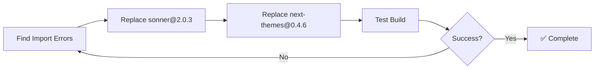

# Prompt 1: Fix Import Syntax
**Priority:** P0 - CRITICAL  
**Time:** 5 minutes  
**Files:** 3 files

---

## Task
Replace incorrect import syntax with standard package imports.

---

## Files to Fix

1. `src/App.tsx:51`
2. `src/components/ui/sonner.tsx:3-4`
3. `src/components/crm/ProposalGenerator.tsx:13`

---

## Actions

### Find and Replace
```bash
# Find all instances:
grep -r "sonner@2.0.3" src/
grep -r "next-themes@0.4.6" src/
```

### Replace in Each File

**Pattern:**
```tsx
// ❌ WRONG
import { Toaster } from 'sonner@2.0.3';
import { useTheme } from 'next-themes@0.4.6';

// ✅ CORRECT
import { Toaster } from 'sonner';
import { useTheme } from 'next-themes';
```

**Files:**
1. `src/App.tsx:51` - Replace `'sonner@2.0.3'` → `'sonner'`
2. `src/components/ui/sonner.tsx:3-4` - Replace both
3. `src/components/crm/ProposalGenerator.tsx:13` - Replace `'sonner@2.0.3'` → `'sonner'`

---

## Verification

```bash
# Test build
npm run build  # Should succeed

# Test dev server
npm run dev    # Should run without errors

# Check for remaining instances
grep -r "@[0-9]" src/  # Should return no results
```

---

## Mermaid: Import Fix Flow



---

## Why This Matters

- Package managers don't support version numbers in import paths
- This syntax is not part of ES modules or CommonJS
- TypeScript will not recognize these imports correctly
- May cause build failures or runtime errors

---

## Next Steps

After completing this prompt, proceed to:
- [Prompt 2: Add TypeScript Config](./03-prompt-02-add-typescript-config.md)

