# Prompt 2: Add TypeScript Config
**Priority:** P0 - CRITICAL  
**Time:** 5 minutes  
**File:** `tsconfig.json` (create new)

---

## Task
Create TypeScript configuration file with proper paths and compiler options.

---

## Create File: `tsconfig.json`

Create this file in the project root:

```json
{
  "compilerOptions": {
    "target": "ES2022",
    "module": "ESNext",
    "lib": ["ES2022", "DOM", "DOM.Iterable"],
    "jsx": "react-jsx",
    "moduleResolution": "bundler",
    "baseUrl": ".",
    "paths": {
      "@/*": ["src/*"]
    },
    "types": ["node"],
    "skipLibCheck": true,
    "isolatedModules": true,
    "noEmit": true,
    "strict": false
  },
  "include": ["src"]
}
```

---

## Verification

```bash
# Run type checking
npx tsc --noEmit  # Should show no errors

# Verify paths work
# Try importing with @ alias in any file:
# import { something } from '@/components/...'
```

---

## Mermaid: TypeScript Setup

```mermaid
graph TD
    A[Create tsconfig.json] --> B[Configure Paths]
    B --> C[Set Compiler Options]
    C --> D[Run Type Check]
    D --> E{Errors?}
    E -->|No| F[✅ Complete]
    E -->|Yes| G[Fix Type Errors]
    G --> D
```



---

## Key Configuration Notes

- **`baseUrl: "."`** - Allows absolute imports from project root
- **`paths: { "@/*": ["src/*"] }`** - Maps `@/` alias to `src/` directory
- **`moduleResolution: "bundler"`** - Required for Vite
- **`jsx: "react-jsx"`** - Uses new JSX transform (no need to import React)
- **`strict: false`** - Can enable later for stricter type checking

---

## Next Steps

After completing this prompt, proceed to:
- [Prompt 3: Add PostCSS Config](./03-prompt-03-add-postcss-config.md)

