# Prompt 4: Add Tailwind Config
**Priority:** P0 - CRITICAL  
**Time:** 3 minutes  
**File:** `tailwind.config.js` (create new)

---

## Task
Create Tailwind configuration with content paths.

---

## Create File: `tailwind.config.js`

Create this file in the project root:

```js
/** @type {import('tailwindcss').Config} */
export default {
  content: [
    "./index.html",
    "./src/**/*.{js,ts,jsx,tsx}",
  ],
  theme: {
    extend: {},
  },
  plugins: [],
}
```

---

## Verification

```bash
# Test dev server - Tailwind classes should work
npm run dev

# Test a Tailwind class in any component:
# className="bg-blue-500 text-white"
# Should apply styles correctly
```

---

## Mermaid: Tailwind Setup

```mermaid
graph TD
    A[Create tailwind.config.js] --> B[Set Content Paths]
    B --> C[Configure Theme]
    C --> D[Test Tailwind Classes]
    D --> E[✅ Complete]
```



---

## Key Configuration Notes

- **`content`** - Tells Tailwind where to look for class names
- **`theme.extend`** - Add custom theme values here
- **`plugins`** - Add Tailwind plugins here if needed

**Note:** Tailwind v4 uses CSS-first configuration, but `tailwind.config.js` is still recommended for content paths and theme customization.

---

## Next Steps

After completing this prompt, proceed to:
- [Prompt 5: Implement React Router](./03-prompt-05-implement-react-router.md)

