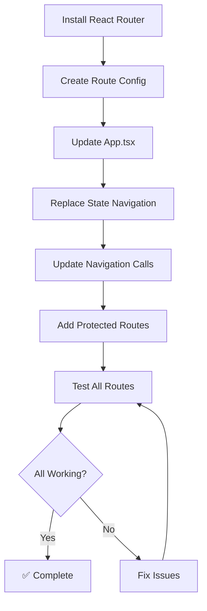
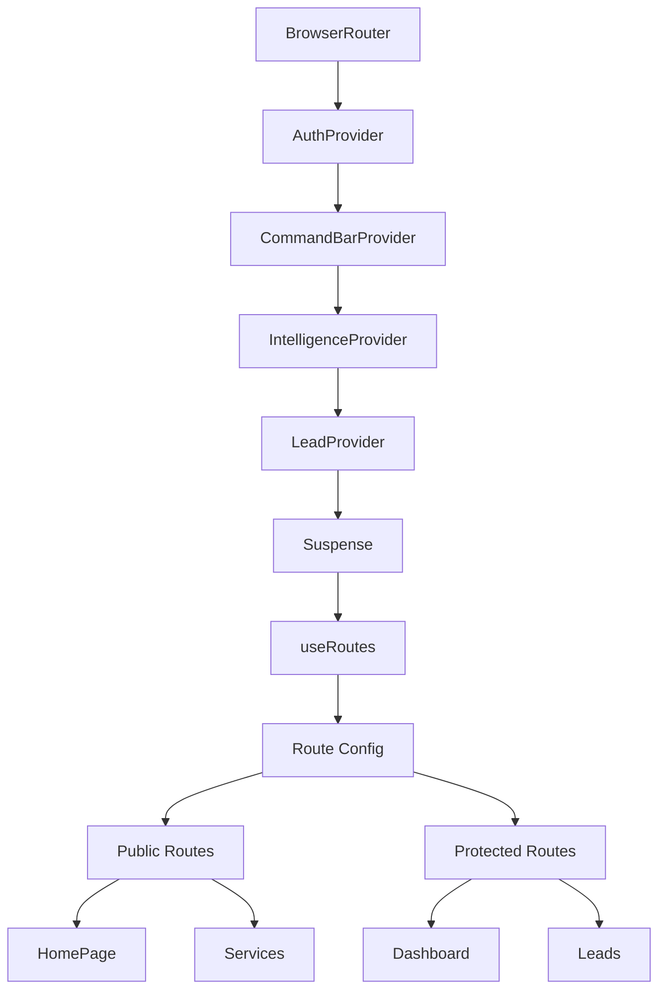

# Prompt 5: Implement React Router
**Priority:** P0 - CRITICAL BLOCKER  
**Time:** 4-6 hours  
**Files:** Multiple

---

## Task
Replace state-based navigation with URL-based routing using React Router v6.

---

## Step 1: Install React Router (if needed)

```bash
npm install react-router-dom@6
```

Verify installation:
```bash
npm list react-router-dom
# Should show: react-router-dom@6.x.x
```

---

## Step 2: Create Route Configuration

**File:** `src/routes/index.tsx` (create new)

```tsx
import { lazy } from 'react';
import type { RouteObject } from 'react-router-dom';

// Lazy load components
const HomePageV7 = lazy(() => import('@/components/premium/HomePageV7'));
const ServicesPageV2 = lazy(() => import('@/components/premium/v7/services/ServicesPageV2'));
const AIWebDevPageV7 = lazy(() => import('@/components/premium/v7/services/AIWebDevPageV7'));
const BriefWizard = lazy(() => import('@/components/BriefWizard'));
const AIProcessingScreen = lazy(() => import('@/components/AIProcessingScreen'));
const ProposalReadyScreen = lazy(() => import('@/components/ProposalReadyScreen'));
const ProjectDashboard = lazy(() => import('@/components/ProjectDashboard'));
const CRMLeadsDashboard = lazy(() => import('@/components/crm/CRMLeadsDashboard'));
const LoginPage = lazy(() => import('@/components/auth/LoginPage'));
// ... import all other pages

export const routes: RouteObject[] = [
  {
    path: '/',
    element: <HomePageV7 onNavigateToWhatsApp={() => {}} onNavigateToAbout={() => {}} onVersionChange={() => {}} />,
  },
  {
    path: '/services',
    element: <ServicesPageV2 onNavigateToWhatsApp={() => {}} onNavigateToAbout={() => {}} onVersionChange={() => {}} />,
  },
  {
    path: '/services/ai-web-dev',
    element: <AIWebDevPageV7 onNavigateToWhatsApp={() => {}} onNavigateToAbout={() => {}} onVersionChange={() => {}} />,
  },
  {
    path: '/wizard',
    element: <BriefWizard onClose={() => {}} onSubmit={() => {}} />,
  },
  {
    path: '/processing',
    element: <AIProcessingScreen onComplete={() => {}} />,
  },
  {
    path: '/proposal',
    element: <ProposalReadyScreen onViewProposal={() => {}} onGoToDashboard={() => {}} />,
  },
  {
    path: '/dashboard',
    element: <ProjectDashboard onClose={() => {}} />,
  },
  {
    path: '/login',
    element: <LoginPage onLoginSuccess={() => {}} />,
  },
  {
    path: '/leads',
    element: <CRMLeadsDashboard />,
  },
  // ... add all other routes
  {
    path: '*',
    element: <div>404 - Page Not Found</div>, // TODO: Create 404 component
  },
];
```

---

## Step 3: Update App.tsx

**File:** `src/App.tsx`

Replace state-based navigation with React Router:

```tsx
import { BrowserRouter, useRoutes } from 'react-router-dom';
import { Suspense } from 'react';
import { routes } from './routes';
import { AuthProvider } from './context/AuthContext';
import { CommandBarProvider } from './context/CommandBarContext';
import { IntelligenceProvider } from './context/IntelligenceContext';
import { LeadProvider } from './context/LeadContext';
import { Toaster } from 'sonner';
import { CommandBar } from './components/crm/intelligence/CommandBar';
import { GlobalChatbot } from './components/GlobalChatbot';

function AppRoutes() {
  const element = useRoutes(routes);
  return element;
}

function LoadingFallback() {
  return (
    <div className="flex items-center justify-center min-h-screen">
      <div className="text-lg">Loading...</div>
    </div>
  );
}

export default function App() {
  return (
    <AuthProvider>
      <CommandBarProvider>
        <IntelligenceProvider>
          <LeadProvider>
            <BrowserRouter>
              <Suspense fallback={<LoadingFallback />}>
                <Toaster position="top-right" />
                <CommandBar />
                <GlobalChatbot onNavigate={() => {}} />
                <AppRoutes />
              </Suspense>
            </BrowserRouter>
          </LeadProvider>
        </IntelligenceProvider>
      </CommandBarProvider>
    </AuthProvider>
  );
}
```

---

## Step 4: Update Navigation Calls

Replace all `setCurrentVersion()` calls with `useNavigate()`:

**Pattern:**
```tsx
// ❌ OLD
const [currentVersion, setCurrentVersion] = useState('v7');
setCurrentVersion('dashboard');

// ✅ NEW
import { useNavigate } from 'react-router-dom';
const navigate = useNavigate();
navigate('/dashboard');
```

**Files to update:**
- All components that call `onVersionChange` or `onNavigate`
- SideMenu component
- Navigation buttons

---

## Step 5: Create Protected Route Wrapper

**File:** `src/components/auth/ProtectedRoute.tsx` (create new)

```tsx
import { Navigate } from 'react-router-dom';
import { useAuth } from '@/context/AuthContext';

export function ProtectedRoute({ children }: { children: React.ReactNode }) {
  const { isAuthenticated, isLoading } = useAuth();
  
  if (isLoading) {
    return <div>Loading...</div>;
  }
  
  if (!isAuthenticated) {
    return <Navigate to="/login" replace />;
  }
  
  return <>{children}</>;
}
```

---

## Step 6: Update Routes with Protected Routes

```tsx
import { ProtectedRoute } from '@/components/auth/ProtectedRoute';

// In routes array:
{
  path: '/dashboard',
  element: (
    <ProtectedRoute>
      <ProjectDashboard onClose={() => navigate('/')} />
    </ProtectedRoute>
  ),
},
```

---

## Verification

```bash
npm run dev
# Test:
# 1. Navigate to http://localhost:5000/
# 2. Click links - URLs should change
# 3. Use browser back/forward - should work
# 4. Refresh page - should stay on same page
# 5. Share URL - should work
```

---

## Mermaid: Router Migration Flow



---

## Mermaid: Router Architecture



---

## Next Steps

After completing this prompt, proceed to:
- [Prompt 6: Add Error Boundaries](./03-prompt-06-add-error-boundaries.md)

