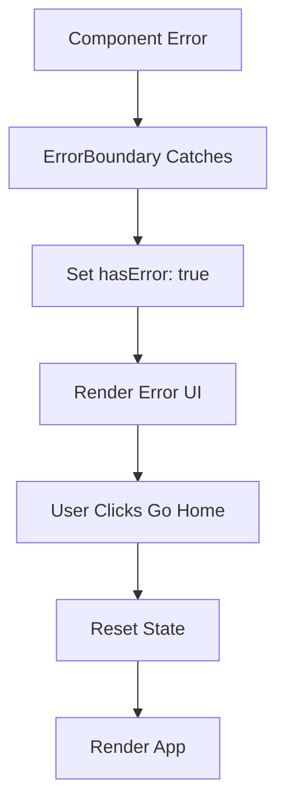

# Prompt 6: Add Error Boundaries
**Priority:** P1 - HIGH  
**Time:** 1 hour

---

## Task
Implement React Error Boundaries to catch and handle component errors gracefully.

---

## Step 1: Create Error Boundary Component

**File:** `src/components/ErrorBoundary.tsx` (create new)

```tsx
import React, { Component, ErrorInfo, ReactNode } from 'react';
import { Button } from './ui/design-system/Button';

interface Props {
  children: ReactNode;
}

interface State {
  hasError: boolean;
  error: Error | null;
}

export class ErrorBoundary extends Component<Props, State> {
  public state: State = {
    hasError: false,
    error: null,
  };

  public static getDerivedStateFromError(error: Error): State {
    return { hasError: true, error };
  }

  public componentDidCatch(error: Error, errorInfo: ErrorInfo) {
    console.error('Uncaught error:', error, errorInfo);
    // TODO: Send to error tracking service (Sentry, etc.)
  }

  public render() {
    if (this.state.hasError) {
      return (
        <div className="min-h-screen flex items-center justify-center bg-slate-50">
          <div className="max-w-md w-full bg-white rounded-lg shadow-lg p-8">
            <h1 className="text-2xl font-bold text-slate-900 mb-4">
              Something went wrong
            </h1>
            <p className="text-slate-600 mb-6">
              {this.state.error?.message || 'An unexpected error occurred'}
            </p>
            <div className="flex gap-4">
              <Button
                onClick={() => {
                  this.setState({ hasError: false, error: null });
                  window.location.href = '/';
                }}
              >
                Go Home
              </Button>
              <Button
                variant="outline"
                onClick={() => window.location.reload()}
              >
                Reload Page
              </Button>
            </div>
          </div>
        </div>
      );
    }

    return this.props.children;
  }
}
```

---

## Step 2: Wrap App with Error Boundary

**File:** `src/App.tsx`

```tsx
import { ErrorBoundary } from './components/ErrorBoundary';

export default function App() {
  return (
    <ErrorBoundary>
      {/* ... existing app code ... */}
    </ErrorBoundary>
  );
}
```

---

## Verification

```tsx
// Test by throwing error in a component:
throw new Error('Test error');
// Should show error boundary UI instead of blank screen
```

---

## Mermaid: Error Boundary Flow



---

## Why This Matters

- Prevents entire app from crashing
- Shows user-friendly error messages
- Provides recovery options
- Enables error logging/tracking

---

## Next Steps

After completing this prompt, proceed to:
- [Prompt 7: Add 404 Page](./03-prompt-07-add-404-page.md)

