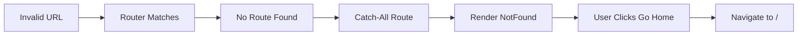

# Prompt 7: Add 404 Page
**Priority:** P1 - HIGH  
**Time:** 30 minutes

---

## Task
Create a 404 Not Found page for invalid URLs.

---

## Step 1: Create 404 Component

**File:** `src/components/NotFound.tsx` (create new)

```tsx
import { Link } from 'react-router-dom';
import { Button } from './ui/design-system/Button';
import { Home, ArrowLeft } from 'lucide-react';

export function NotFound() {
  return (
    <div className="min-h-screen flex items-center justify-center bg-slate-50">
      <div className="max-w-md w-full text-center">
        <h1 className="text-9xl font-bold text-slate-200 mb-4">404</h1>
        <h2 className="text-2xl font-bold text-slate-900 mb-2">
          Page Not Found
        </h2>
        <p className="text-slate-600 mb-8">
          The page you're looking for doesn't exist or has been moved.
        </p>
        <div className="flex gap-4 justify-center">
          <Link to="/">
            <Button leftIcon={<Home className="w-4 h-4" />}>
              Go Home
            </Button>
          </Link>
          <Button
            variant="outline"
            leftIcon={<ArrowLeft className="w-4 h-4" />}
            onClick={() => window.history.back()}
          >
            Go Back
          </Button>
        </div>
      </div>
    </div>
  );
}
```

---

## Step 2: Add to Routes

**File:** `src/routes/index.tsx`

```tsx
import { NotFound } from '@/components/NotFound';

export const routes: RouteObject[] = [
  // ... all other routes
  {
    path: '*',
    element: <NotFound />,
  },
];
```

---

## Verification

```bash
# Navigate to invalid URL:
http://localhost:5000/invalid-page
# Should show 404 page instead of blank screen
```

---

## Mermaid: 404 Flow



---

## Why This Matters

- Better user experience for invalid URLs
- Provides navigation options
- Prevents blank screens
- Professional error handling

---

## Next Steps

After completing this prompt, proceed to:
- [Prompt 8: Implement Code Splitting](./03-prompt-08-implement-code-splitting.md)

