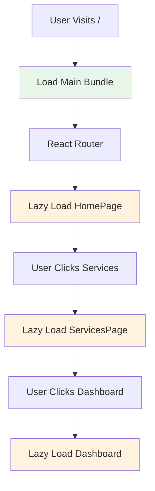

# Prompt 8: Implement Code Splitting
**Priority:** P1 - HIGH  
**Time:** 2-3 hours

---

## Task
Implement code splitting to reduce initial bundle size and improve load times.

---

## Step 1: Update Route Imports to Lazy

**File:** `src/routes/index.tsx`

Already done in Prompt 5, but ensure all routes use `lazy()`:

```tsx
import { lazy } from 'react';

const HomePageV7 = lazy(() => import('@/components/premium/HomePageV7'));
// ... all other routes
```

---

## Step 2: Add Suspense Boundaries

**File:** `src/App.tsx`

```tsx
import { Suspense } from 'react';

function LoadingFallback() {
  return (
    <div className="flex items-center justify-center min-h-screen">
      <div className="animate-spin rounded-full h-12 w-12 border-b-2 border-orange-500"></div>
    </div>
  );
}

// Wrap routes in Suspense
<Suspense fallback={<LoadingFallback />}>
  <AppRoutes />
</Suspense>
```

---

## Step 3: Split Vendor Chunks

**File:** `vite.config.ts`

```ts
export default defineConfig({
  // ... existing config
  build: {
    target: 'esnext',
    outDir: 'build',
    rollupOptions: {
      output: {
        manualChunks: {
          'react-vendor': ['react', 'react-dom', 'react-router-dom'],
          'ui-vendor': [
            '@radix-ui/react-dialog',
            '@radix-ui/react-dropdown-menu',
            // ... other Radix UI packages
          ],
          'chart-vendor': ['recharts'],
        },
      },
    },
  },
});
```

---

## Verification

```bash
npm run build
# Check build/assets/ - should see multiple chunks
# Main bundle should be < 500KB
```

---

## Mermaid: Code Splitting Flow



---

## Expected Results

**Before:**
- Main bundle: ~1.8MB
- Initial load: 2-3 seconds

**After:**
- Main bundle: < 500KB
- Initial load: < 1 second
- Route chunks: Loaded on demand

---

## Why This Matters

- Faster initial page load
- Better user experience
- Reduced bandwidth usage
- Improved SEO (faster load times)

---

## Next Steps

After completing this prompt, proceed to:
- [Prompt 9: Standardize Import Paths](./03-prompt-09-standardize-import-paths.md)

