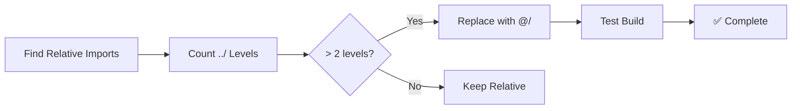

# Prompt 9: Standardize Import Paths
**Priority:** P1 - MEDIUM  
**Time:** 1-2 hours

---

## Task
Standardize all imports to use `@/` alias instead of relative paths.

---

## Step 1: Find All Relative Imports

```bash
# Find imports with 3+ levels of ../
grep -r "from ['\"]\.\.\/\.\.\/\.\." src/

# Find all relative imports
grep -r "from ['\"]\.\." src/ | wc -l
```

---

## Step 2: Replace with @ Alias

**Pattern:**
```tsx
// ❌ OLD
import { Button } from '../../ui/design-system/Button';

// ✅ NEW
import { Button } from '@/components/ui/design-system/Button';
```

**Conversion Rules:**
- `./` → Keep as is (same directory)
- `../` → Convert to `@/components/...`
- `../../` → Convert to `@/components/...`
- `../../../` → Convert to `@/components/...`

---

## Step 3: Add ESLint Rule (Optional)

**File:** `.eslintrc.json` (create if doesn't exist)

```json
{
  "rules": {
    "no-restricted-imports": [
      "error",
      {
        "patterns": ["../*"]
      }
    ]
  }
}
```

---

## Mermaid: Import Standardization



---

## Benefits

- Easier refactoring (moving files doesn't break imports)
- More readable code
- Consistent codebase
- Better IDE support

---

## Next Steps

After completing this prompt, proceed to:
- [Prompt 10: Add Environment Validation](./03-prompt-10-add-environment-validation.md)

