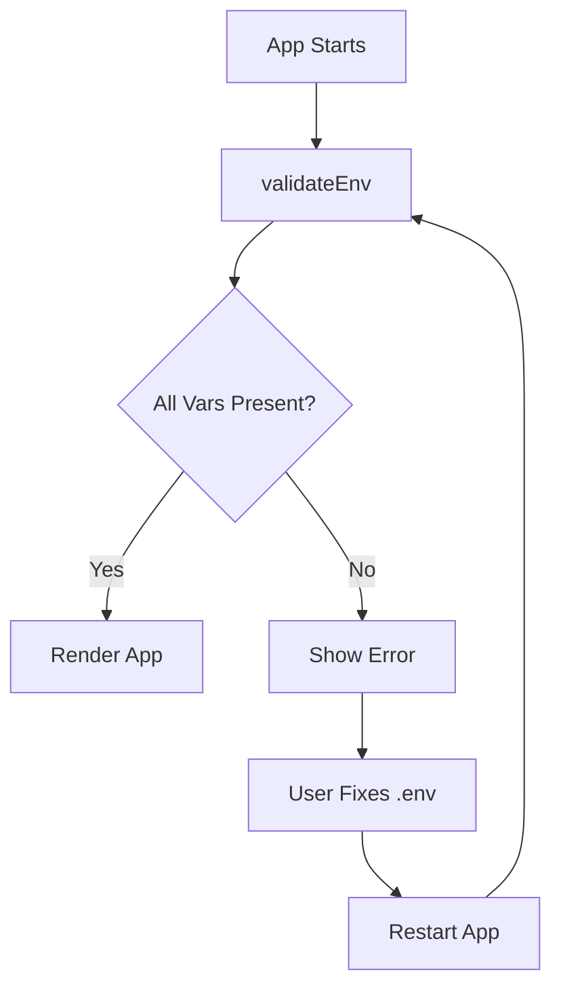

# Prompt 10: Add Environment Validation
**Priority:** P1 - MEDIUM  
**Time:** 30 minutes

---

## Task
Add environment variable validation to catch configuration errors early.

---

## Step 1: Create .env.example

**File:** `.env.example` (create new)

```env
# API Configuration
VITE_API_URL=https://api.example.com

# Feature Flags
VITE_ENABLE_ANALYTICS=true
VITE_ENABLE_CHATBOT=true

# Add all required environment variables
```

---

## Step 2: Create Validation Utility

**File:** `src/lib/env.ts` (create new)

```ts
const requiredEnvVars = [
  // Add required variables here
  // 'VITE_API_URL',
] as const;

export function validateEnv() {
  const missing: string[] = [];
  
  requiredEnvVars.forEach((varName) => {
    if (!import.meta.env[varName]) {
      missing.push(varName);
    }
  });
  
  if (missing.length > 0) {
    throw new Error(
      `Missing required environment variables: ${missing.join(', ')}\n` +
      `Please check your .env file or .env.example for reference.`
    );
  }
}
```

---

## Step 3: Call in main.tsx

**File:** `src/main.tsx`

```tsx
import { validateEnv } from './lib/env';

// Validate before rendering
try {
  validateEnv();
} catch (error) {
  console.error(error);
  document.body.innerHTML = `
    <div style="padding: 2rem; font-family: sans-serif;">
      <h1>Configuration Error</h1>
      <p>${error.message}</p>
      <p>Please check your environment variables and restart the application.</p>
    </div>
  `;
  throw error;
}

// ... rest of main.tsx
```

---

## Verification

```bash
# Remove a required env var
# App should show error message on startup
```

---

## Mermaid: Env Validation Flow



---

## Why This Matters

- Catches configuration errors early
- Clear error messages
- Prevents runtime failures
- Better developer experience

---

## Completion

After completing all 10 prompts, your application will be **85%+ production-ready**! ✅

---

## Return to Index

- [Fix Prompts Index](./00-index.md)

