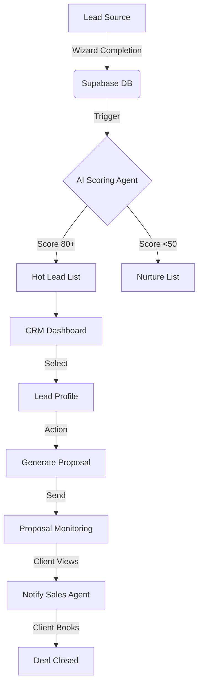

# Luxury AI CRM: Mega Prompts & Master Plan

## 📊 Progress Tracker

- [ ] **Phase 1: Core Foundation**
  - [x] 1. Leads Dashboard (Executive View)
  - [x] 2. Lead Intelligence Profile (Detail View)
  - [x] 6. Booking & Scheduling (Integrated Flow)
- [ ] **Phase 2: The Deal Engine**
  - [x] 4. Proposal Generation Screen (AI-Assisted)
  - [x] 7. Sales Cycle Overview (Health-based Pipeline)
- [ ] **Phase 3: The Intelligence Layer**
  - [x] 1. Intelligence Profile: Signals & Analysis
  - [x] 3. Automated Follow-ups (Drafting)
  - [x] 8. Negotiation Assistant (Chat Interface)
- [ ] **Phase 3: Intelligence & Automation (Advanced)**
  - [x] 3. Sales Activity Feed (Momentum-based)
  - [x] 5. Proposal Monitoring (Real-time Intent)
  - [x] 8. AI Agents Overview (Internal Ops)
  - [x] 9. Automation Workflow Map (Visual Trust)
- [ ] **Phase 4: The Closing Layer**
  - [x] 1. Proposal Generator (Refined)
  - [x] 2. Contract Automation (Drafting & Signatures)

---

## 🔄 System Architecture & User Journey

### High-Level Data Flow (Mermaid)



### The Executive Sales Journey
1.  **Morning Review**: Sales Director opens **Leads Dashboard**. Filters by "Sun Score > 80".
2.  **Deep Dive**: Clicks on top lead (Elena, Fintech CEO). Views **Lead Intelligence Profile**.
3.  **Context**: Checks **AI Summary** ("High intent, Q3 launch").
4.  **Action**: Clicks **Generate Proposal**. AI drafts a "Premium Architecture" package.
5.  **Refinement**: Adjusts budget slightly, clicks "Send".
6.  **Monitoring**: Later, receives alert: "Elena is reading the 'Risks' section".
7.  **Closing**: Elena uses the embedded **Scheduling Tool** to book a strategy call.

---

## 🎨 Design System: "Calm Luxury"

*   **Typography**: Inter or Geist Sans. High contrast headings, slate-500 body text for reduced eye strain.
*   **Palette**:
    *   Backgrounds: `bg-slate-50` (Canvas), `bg-white` (Cards).
    *   Accents: `text-slate-900` (Primary), `text-orange-600` (Brand/Action), `text-emerald-600` (Success/Score).
    *   Borders: `border-slate-100` (Subtle), `border-slate-200` (Dividers).
*   **Components**: Glassmorphism (`bg-white/80 backdrop-blur`), Soft Shadows (`shadow-sm`, `shadow-orange-500/5`), Rounded Corners (`rounded-xl` or `rounded-2xl`).
*   **Motion**: `framer-motion` for smooth entry, hover states that lift cards gently. No jarring transitions.

---

## 🚀 Mega Prompts (Implementation Specs)

### 1️⃣ Leads Dashboard (Executive View)
**Goal:** Instant prioritization. Focus on the top 10%.
**Component Name:** `CRMLeadsDashboard.tsx`

> **Prompt:**
> Design a luxury AI-powered CRM leads dashboard.
> **Layout:**
> - Full-width, data-dense but airy table.
> - Columns: Name (Avatar + Text), Company (Logo + Text), Role, Industry, Budget, Last Active, Sun Score.
> - Sticky Header: "Leads", Search bar, Filters (Score > 80, Industry, Status).
> **Key Feature: Sun Score Badge:**
> - Circular badge displaying 0-100.
> - **Logic:** 80-100 (Emerald, "Hot"), 50-79 (Amber, "Warm"), <50 (Slate, "Cold").
> - **Hover Interaction:** Tooltip reveals "Why this score?": "Clear timeline (+20)", "Corporate Email (+10)", "Budget Match (+15)".
> **Style:**
> - Minimalist table rows with hover effect (`bg-slate-50`).
> - No zebra striping. Use subtle border separators.
> - High contrast text for names, muted text for metadata.

---

### 2️⃣ Lead Intelligence Profile
**Goal:** Understand the human behind the lead in 5 seconds.
**Component Name:** `LeadProfileView.tsx`

> **Prompt:**
> Design a "Lead Intelligence Profile" detail screen.
> **Header:**
> - Left: Name, Large Role, Company.
> - Right: Huge "Sun Score" (e.g., 92) with a glowing ring.
> - Actions: "Generate Proposal", "Archive".
> **Layout (Grid):**
> - **Top Row (The Insight):** "AI Summary Card". A distinct, slightly highlighted card containing a natural language summary: *"High-intent lead. CEO of Fintech startup. Wants AI Chatbot for customer support. Budget $40k-$60k. Suggested approach: Focus on security and scalability."*
> - **Left Col (Facts):** Contact Info, Company Size, Location, LinkedIn URL.
> - **Right Col (Signals):**
>   - **Urgency:** High (Q3 Launch).
>   - **Budget Confidence:** Medium (Self-funded).
>   - **Tech Maturity:** High (Uses AWS, React).
> **Style:**
> - Editorial layout. Generous white space.
> - Section headers in small caps, tracking wide (`uppercase tracking-wider text-xs`).

---

### 3️⃣ Sales Activity Feed (AI-Enhanced)
**Goal:** Show momentum, not just logs.
**Component Name:** `ActivityFeed.tsx` (Embed inside Profile)

> **Prompt:**
> Design a vertical sales activity timeline that highlights *momentum*.
> **Items:**
> - Standard: "Form submitted", "Email sent".
> - **AI Insights (Highlighted):**
>   - "🔥 Momentum Spike: Viewed pricing page 3 times in 1 hour."
>   - "💰 Budget Update: Changed from '$10k' to '$50k' in Wizard."
>   - "⚠️ Risk Alert: Asked about 'Data Privacy' in chat."
> **Visuals:**
> - Connect events with a thin vertical line.
> - Use icons for event types (Mail, Eye, Alert, Sparkles).
> - "AI Insight" items should have a soft amber background (`bg-orange-50`).

---

### 4️⃣ Proposal Generation Screen
**Goal:** Create a 6-figure document in 2 minutes.
**Component Name:** `ProposalGenerator.tsx`

> **Prompt:**
> Design a split-screen Proposal Generator.
> **Left Panel (Controls):**
> - Inputs: Project Name, Client Name.
> - **Scope Selectors:** Checkboxes for "Discovery", "Design", "Development", "AI Integration".
> - **Budget Slider:** Range selector ($20k - $50k).
> - **AI Assist Button:** "✨ Auto-Fill based on Wizard Data".
> **Right Panel (Live Preview):**
> - A document-like container (white paper shadow).
> - Shows the "Preliminary Proposal" we designed earlier.
> - Updates in real-time as Left Panel controls change.
> **Footer:**
> - "Save Draft", "Export PDF", "Send via Link".

---

### 5️⃣ Proposal Monitoring Screen
**Goal:** Telepathy. Know exactly when they are looking.
**Component Name:** `ProposalMonitor.tsx`

> **Prompt:**
> Design a "Proposal Analytics" card or screen.
> **Metrics:**
> - Status: "Viewed 2 mins ago".
> - Total Time Spent: "14 minutes".
> - Completion: "85% scrolled".
> **Heatmap / Section Breakdown:**
> - List sections (Intro, Architecture, Budget).
> - Show "Time Spent" per section.
> - **Insight:** If "Budget" time > 5 mins, show "💰 Intense focus on pricing".
> **Actionable Nudge:**
> - If Status = "Viewing Now", show button "💬 Chat Now" or "📞 Call".

---

### 6️⃣ Booking & Scheduling
**Goal:** Frictionless closure.
**Component Name:** `IntegratedScheduler.tsx`

> **Prompt:**
> Design an embedded booking tool (No Calendly iframes).
> **UI:**
> - **Calendar View:** Minimal month view.
> - **Time Slots:** Clean chips for available times.
> - **Timezone:** Auto-detected (e.g., "London (BST)").
> **AI Slot Proposal:**
> - A simplified "Quick Pick" section at the top: *"AI suggests: Tuesday at 2pm or Thursday at 10am based on your timezone."*
> **Confirmation:**
> - Smooth transition to a "Success" state with "Add to Calendar" buttons.

---

### 7️⃣ Sales Cycle Overview (Pipeline)
**Goal:** Health over Stage.
**Component Name:** `PipelineHealth.tsx`

> **Prompt:**
> Design a "Health-First" pipeline view (Not a standard Kanban).
> **Columns/Sections:**
> - **"Likely to Close" (Green):** Deals with Score > 80 and recent activity.
> - **"At Risk" (Red):** Deals with no activity for 7 days or negative sentiment.
> - **"Developing" (Neutral):** New leads or mid-stage.
> **Card Design:**
> - Minimal cards. Lead Name, Value ($), Last Touch.
> - **Micro-Chart:** A tiny sparkline showing "Momentum" over the last 7 days.
> - **Hover Action:** "Nudge" (Send follow-up).

---

### 8️⃣ AI Agents Overview (Internal)
**Goal:** Transparency in automation.
**Component Name:** `AgentCommandCenter.tsx`

> **Prompt:**
> Design a grid of "Active AI Agents" working for the agency.
> **Cards:**
> 1.  **"Scout" (Lead Qualifier):** "Scanned 40 websites today. Found 3 high-value matches."
> 2.  **"Architect" (Proposal Drafter):** "Drafted 2 proposals. Waiting for review."
> 3.  **"Watchdog" (Risk Monitor):** "Flagged 1 lead for 'Competitor' signals."
> **Visuals:**
> - Pulse animations for "Active" agents.
> - Simple log line showing the last action.
> - Toggle switch to "Pause" an agent.

---

### 9️⃣ Automation Workflow Map
**Goal:** The "Wow" factor. Visualizing the invisible.
**Component Name:** `AutomationVisualizer.tsx`

> **Prompt:**
> Design a node-based visualizer of the CRM workflow.
> **Nodes:**
> - `[Wizard]` -> `[Analysis]` -> `[CRM Entry]` -> `[Email Seq]` -> `[Meeting]`.
> **Animation:**
> - Small particles flowing along the lines to show data moving.
> - Clicking a node shows stats (e.g., "Wizard: 45 completions this week").
> **Style:**
> - Dark mode or deep glassmorphism contrast.
> - Very "Minority Report" but clean.

---

## 📂 Sample Data Structures

### Lead Object
```json
{
  "id": "lead_123",
  "name": "Elena V.",
  "role": "CEO",
  "company": "FinTech Global",
  "sunScore": 92,
  "status": "active",
  "budget": 50000,
  "lastActive": "2024-05-20T14:30:00Z",
  "aiSummary": "High-intent lead looking for enterprise chatbot.",
  "momentum": "high"
}
```

### Activity Object
```json
{
  "id": "act_555",
  "leadId": "lead_123",
  "type": "proposal_view",
  "timestamp": "2024-05-20T14:32:00Z",
  "details": "Viewed 'Budget' section for 3 minutes",
  "sentiment": "positive",
  "isInsight": true
}
```

---

## 🛠 Tech Stack Recommendations

*   **Frontend**: React, Tailwind CSS, Framer Motion (Animation).
*   **State**: Context API (`LeadContext`) or Zustand.
*   **Icons**: Lucide React.
*   **Visuals**: Custom SVGs for the "Automation Map".
*   **Data Grid**: TanStack Table (headless) + Custom UI.
