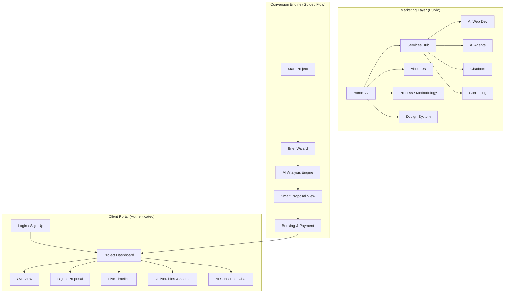

# Sun AI - Architecture & Experience Documentation

## 1. System Architecture & Sitemap

### 1.1 High-Level Structure
The application is divided into three distinct zones based on user intent and authentication state.

### 1.2 Sitemap Tree
*   **1.0 Public Site**
    *   1.1 Home (Luxury Tech Landing)
    *   1.2 Services Hub
        *   1.2.1 AI Web Development
        *   1.2.2 AI Agents & Automation
        *   1.2.3 Enterprise Chatbots
    *   1.3 About Us (Company & Vision)
    *   1.4 Process (The "Sun AI Method")
*   **2.0 Conversion Flow (The Wizard)**
    *   2.1 Intake Form (5 Steps: Basics, Services, Goals, Budget, Review)
    *   2.2 Processing (Loading State with Analysis Feedback)
    *   2.3 Proposal Reveal (Dynamic Exec Summary, Timeline, Budget)
    *   2.4 Booking (Calendar & Stripe Integration)
*   **3.0 Client Platform**
    *   3.1 Auth (Login/Register)
    *   3.2 Project Dashboard
        *   3.2.1 Overview (Status & AI Insights)
        *   3.2.2 Requirements (Living Spec)
        *   3.2.3 Deliverables (Artifact Repository)
        *   3.2.4 Chat (Context-Aware AI Support)

---

## 2. Page Purpose & Content Dictionary

| Page / State | Primary User Intent | Key Content / Features | Primary CTA |
| :--- | :--- | :--- | :--- |
| **Home V7** | Discovery & Credibility | Hero, Value Props, Social Proof, Service Grid | "Start Project" |
| **Brief Wizard** | Requirement Gathering | Multi-step form, URL Scanner, Budget Slider | "Generate Proposal" |
| **Proposal View** | Evaluation & Validation | Dynamic Roadmap, AI Risks, Budget Range, Gantt | "Secure Design Slot" |
| **Booking Page** | Commitment | Calendar, Time Slot Picker, Payment Summary | "Pay & Confirm" |
| **Dashboard** | Management & Transparency | Live Status, AI Deliverable Generation, File Access | "Approve Phase" |

---

## 3. AI Features & Agent Workflows

Sun AI uses a multi-agent architecture to power the user experience, moving beyond simple forms to intelligent generation.

### 3.1 The Agent Roster
1.  **The Architect (Discovery Agent)**
    *   *Role:* Analyzes the user's initial inputs and scanned website URL.
    *   *Output:* Generates the initial Project Proposal, technical approach, and risk assessment.
    *   *Location:* Active during `BriefWizard` -> `ProposalReadyScreen`.
2.  **The Project Manager (Operations Agent)**
    *   *Role:* Breaks down high-level phases into granular deliverables.
    *   *Output:* Populates the "Deliverables" tab in the Dashboard with dates, owners, and acceptance criteria.
    *   *Location:* Active on `ProjectDashboard` initialization.
3.  **The Consultant (Chat Agent)**
    *   *Role:* Answers client questions about the roadmap or technical definitions.
    *   *Output:* Real-time chat responses in the Dashboard.
    *   *Location:* `ChatTab`.

### 3.2 Key AI Workflows
#### Workflow A: The "Zero-to-Roadmap" Journey
1.  **Input:** User enters "I want a chatbot for my real estate site" + URL.
2.  **Analysis:** AI scans URL to determine brand voice and tech stack (simulated).
3.  **Generation:** AI Architect selects the "Chatbot" template.
4.  **Refinement:** Customizes timeline based on budget ($5k vs $50k).
5.  **Output:** A signed-off Digital Proposal ready for payment.

#### Workflow B: Dynamic Deliverable Expansion
1.  **Trigger:** User books a slot.
2.  **Action:** System transitions Proposal -> Active Project.
3.  **Generation:** AI PM generates 5-15 specific Jira-style tickets (e.g., "Design Conversation Flow", "Setup Vector DB").
4.  **Result:** Client sees immediate value/activity in the Dashboard upon first login.

---

## 4. Use Cases & Real World Examples

### Use Case 1: The E-Commerce Scaler
*   **User:** Fashion Brand CEO.
*   **Need:** Reduce support costs.
*   **Flow:**
    1.  Selects "Chatbots" in Wizard.
    2.  AI suggests "Customer Support Automation" package.
    3.  Proposal highlights "Shopify Integration" as a key phase.
    4.  Dashboard immediately lists "Product Catalog Sync" as a Deliverable.

### Use Case 2: The SaaS Startup
*   **User:** Technical Founder.
*   **Need:** MVP Web App.
*   **Flow:**
    1.  Selects "AI Web App" + "MVP".
    2.  AI Architect warns about "API Rate Limits" in the Risk section.
    3.  Timeline is compressed to 4 weeks (Rapid Launch).
    4.  Booking is set for a "Technical Deep Dive".

---

## 5. Style Guide (Design System)

The "Luxury Tech" aesthetic combines minimalism with high-trust financial cues.

### 5.1 Color Palette
*   **Canvas:** Warm White (`#FDFDFD` / `bg-warm-white`) - Replaces clinical pure white.
*   **Ink:** Deep Slate (`#0F172A` / `text-slate-900`) - High contrast, softer than pure black.
*   **Accent:** International Orange (`#F97316` / `text-orange-500`) - Used sparingly for CTAs and "AI Activity" indicators.
*   **Success:** Emerald (`#10B981`) - Used for "Completed" states and trust badges.

### 5.2 Typography
*   **Headings:** Sans-serif, Tracking-tight, Bold weights. (e.g., `text-4xl font-bold tracking-tight`).
*   **Body:** Sans-serif, Relaxed line-height for readability. (e.g., `text-slate-500 leading-relaxed`).
*   **Micro-copy:** Uppercase, tracking-widest, muted colors. (e.g., `text-xs font-bold text-slate-400 uppercase tracking-wider`).

### 5.3 UI Components (ShadCN + Custom)
*   **Cards:**
    *   `variant="solid"`: White bg, subtle border, light shadow.
    *   `variant="glass"`: Backdrop blur, white/80, orange-border hint.
*   **Buttons:**
    *   `Primary`: Solid Slate-900 (Luxury) or Gradient Orange (Conversion).
    *   `Ghost`: Minimal hover effects for secondary actions.
*   **Motion:**
    *   `Framer Motion` used for page transitions and "Scanning" effects.
    *   Smooth easing `[0.22, 1, 0.36, 1]` for premium feel.
