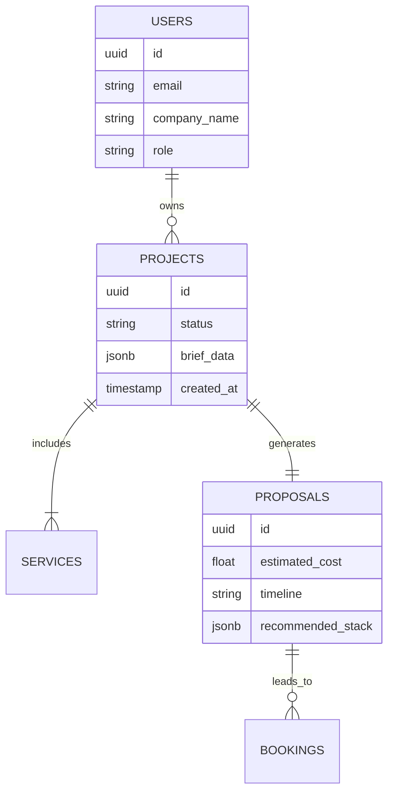

# 🌞 Sun AI System V7 - Master Implementation Plan

## 📊 Progress Tracker

| Phase | Component | Status | Priority |
| :--- | :--- | :--- | :--- |
| **0. Foundation** | Global Design System | 🟡 In Progress | Critical |
| | Routing & Architecture | 🔴 Pending | High |
| **1. Marketing** | Hero Section (Mobile Optimized) | 🟢 Completed | Critical |
| | "How It Works" Storytelling | 🔴 Pending | High |
| | Service Pages | 🔴 Pending | Medium |
| **2. Core Product** | AI Brief Wizard (UX/UI) | 🟡 In Progress | Critical |
| | Proposal Generator Engine | 🔴 Pending | High |
| | Booking & Payment Flow | 🔴 Pending | High |
| **3. Backend** | Supabase Schema & Auth | 🔴 Pending | Critical |
| | CRM & Admin Dashboard | 🔴 Pending | Medium |
| **4. Advanced** | "Pencil-Clip" AI Assistant | 🔴 Pending | Low |
| | WhatsApp Automation | 🔴 Pending | Medium |

---

## 🛠️ Implementation Strategy

This project follows a **"Visual Storytelling First"** approach. We are building a premium AI agency platform that uses complex animations and clean typography to explain AI workflows.

**Core Principles:**
1.  **Mobile-First Hierarchy:** Content must be legible and high-impact on 390px screens.
2.  **Motion as Meaning:** Animations explain the process (e.g., flowcharts connecting steps), they are not just decoration.
3.  **Zero-Friction Conversion:** The transition from "Hero" -> "Wizard" -> "Booking" must be seamless.

---

## 🧜‍♀️ System Diagrams

### 1. Core User Journey Flow

```mermaid
graph TD
    User[Visitor] -->|Lands on| Home[Home / Hero V7]
    Home -->|Scrolls| Process[How It Works]
    Home -->|Clicks| Wizard[AI Brief Wizard]
    
    subgraph "The Magic (Wizard)"
        Wizard -->|Step 1| Context[Company URL & Context]
        Context -->|Step 2| Goals[Goals & Services]
        Goals -->|Step 3| Analysis[AI Analysis & Suggestion]
        Analysis -->|Step 4| Proposal[Proposal Preview]
    end
    
    Proposal -->|Action| Booking[Book Strategy Call]
    Proposal -->|Action| Deposit[Pay Deposit (Stripe)]
    
    Booking --> CRM[Internal CRM]
    Deposit --> CRM
    CRM -->|Notification| Slack[Slack/WhatsApp Alert]
```

### 2. Data Entity Relationship (ERD)



---

## 📅 Systematic Development Phases

### Phase 1: Foundation & Design System (Figma -> Code)
**Goal:** Establish the visual language (Tokens, Typography, Components).

- [ ] **Task 1.1: Global Style Guide**
    - Define `globals.css` variables for Slate-900, Orange-500, and Warm White.
    - Set up Typography (Inter/Manrope).
    - Create `Button`, `Card`, `Badge` base components.
- [ ] **Task 1.2: App Architecture**
    - Configure React Router (if moving away from single-page scroll).
    - Set up `/components/premium/v7` directory structure.

### Phase 2: The "Hero" Experience & Storytelling
**Goal:** Hook the user immediately with high-quality visuals and clear hierarchy.

- [x] **Task 2.1: Mobile Hero Optimization** (Completed)
- [ ] **Task 2.2: "How It Works" Section**
    - Implement horizontal scroll or stacked cards for mobile.
    - Animate connector lines between steps using SVG/Framer Motion.
- [ ] **Task 2.3: Visual Features Grid**
    - "Bento Grid" layout for services.

### Phase 3: The AI Brief Wizard (The Core Product)
**Goal:** A 5-step interactive form that feels like consulting with an AI.

- [ ] **Task 3.1: Wizard Shell & State Management**
    - `useWizardStore` (Zustand) for managing form state.
    - Multi-step layout with progress bar.
- [ ] **Task 3.2: Step 1 - Intelligence**
    - Input URL -> Mock AI scanning animation -> Pre-fill company name.
- [ ] **Task 3.3: Step 2-4 - Selection Logic**
    - Service selection grid.
    - Budget slider.
- [ ] **Task 3.4: Processing Screen**
    - "Generating Proposal" animation screen.

### Phase 4: Conversion & CRM
**Goal:** Capture value and organize data.

- [ ] **Task 4.1: Proposal Preview Page**
    - Dynamic content based on Wizard inputs.
    - "Book Call" integration (Calendly/Custom).
- [ ] **Task 4.2: Admin Dashboard**
    - Simple table view of received briefs.

---

## 🤖 Mega Multi-Step Prompts (Copy & Paste)

Use these prompts in your AI coding assistant (Cursor/Windsurf) to execute the plan.

### Prompt Set 1: Design System & Foundation

```text
**Context:** Creating the V7 Design System for Sun AI.
**Goal:** Set up the global styling foundation in Tailwind CSS.

1. **Colors**: 
   - Primary: Slate 900 (`#0F172A`)
   - Accent: Orange 500 (`#FF6A3D`)
   - Background: Warm White (`#FDFDFD`)
   - Surface: White (`#FFFFFF`) with subtle borders (`#E2E8F0`)

2. **Typography**:
   - Headings: Bold, Tight tracking.
   - Body: Readable, relaxed line-height.

3. **Components**:
   - Create a `Button` component with "Primary" (Orange), "Secondary" (Outline), and "Ghost" variants.
   - Create a `GlassCard` component with backdrop-blur and thin white border.

**Action:** Update `globals.css` and create the base components in `/components/ui/design-system`.
```

### Prompt Set 2: "How It Works" Animation

```text
**Context:** Building the "Process" section of the landing page.
**Goal:** Visual storytelling of the 4-step agency process.

**Requirements:**
1. Create a component `HowItWorksV7.tsx`.
2. Data: 
   - Step 1: Brief (Icon: FileText)
   - Step 2: Analysis (Icon: Brain)
   - Step 3: Build (Icon: Code)
   - Step 4: Scale (Icon: Rocket)
3. **Layout**:
   - Desktop: Horizontal row connected by an SVG line that pulses.
   - Mobile: Vertical stack with a dashed line on the left.
4. **Animation**:
   - As the user scrolls into view, animate the line filling up from Step 1 to Step 4.
   - Cards should fade in sequentially.

**Action:** Implement this using `framer-motion` and Lucide icons.
```

### Prompt Set 3: The Brief Wizard Logic

```text
**Context:** The core lead generation tool.
**Goal:** A multi-step form that collects project requirements.

**Requirements:**
1. State Management: Create `WizardContext` or `useWizardStore`.
2. **Steps**:
   - `IntroStep`: Ask for Name + Website URL.
   - `ServicesStep`: Grid of selectable cards (Web App, Chatbot, Automation).
   - `DetailsStep`: Textarea for specific goals + Budget slider.
   - `ReviewStep`: Summary of choices.
3. **UI**:
   - sticky header with "Step X of 4" progress bar.
   - "Next" and "Back" buttons fixed at the bottom on mobile.
   - Transitions: Slide left/right between steps.

**Action:** Scaffold the `BriefWizard` component and the sub-components for each step.
```

---

## ✅ Acceptance Tests (QA Checklist)

**Mobile Responsiveness:**
- [ ] Hero text does not overflow on 375px screens.
- [ ] Buttons are easy to tap (min height 44px).
- [ ] No horizontal scrolling on any page.

**Performance:**
- [ ] LCP (Largest Contentful Paint) under 2.5s.
- [ ] Animations stop when `prefers-reduced-motion` is enabled.
- [ ] Images use `ImageWithFallback` or optimized formats.

**Functionality:**
- [ ] Wizard state persists if I accidentally refresh (optional, but good).
- [ ] "Book Call" opens the correct modal/link.
- [ ] Contact form submits to console/backend.

---

## 🔧 Troubleshooting Guide

**Issue: Animations cause layout shift.**
*Fix:* Ensure parent containers have fixed heights where possible. Use `layout` prop in Framer Motion carefully.

**Issue: Mobile menu overlaps content.**
*Fix:* Ensure `z-index` of the navbar is 50+. Use `overflow-hidden` on the body when menu is open.

**Issue: Icons missing.**
*Fix:* Always verify Lucide imports. If an icon name changes in the library, update the import string.
