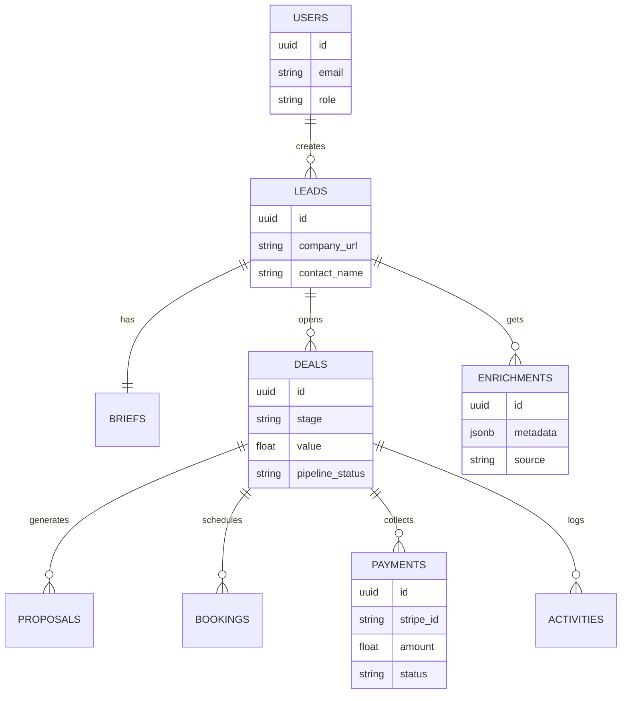

# 🌞 Sun AI System V7 - Technical Implementation Plan

## 📊 Progress Tracker & Status

| Phase | Component | Status | % Complete | Priority |
| :--- | :--- | :--- | :--- | :--- |
| **0. Foundation** | Global Design System (Figma -> Code) | 🟡 In Progress | 70% | Critical |
| | Routing & Architecture | 🔴 Pending | 0% | High |
| **1. Marketing** | Hero Section (Mobile Optimized) | 🟢 Completed | 100% | Critical |
| | "How It Works" Storytelling | 🔴 Pending | 0% | High |
| | Service Pages | 🔴 Pending | 0% | Medium |
| **2. Core Product** | AI Brief Wizard (UX/UI) | 🟡 In Progress | 80% | Critical |
| | Proposal Generator Engine | 🔴 Pending | 0% | High |
| | Booking & Payment Flow | 🔴 Pending | 0% | High |
| **3. Backend** | Supabase Schema & Auth | 🔴 Pending | 0% | Critical |
| | CRM & Admin Dashboard | 🔴 Pending | 0% | Medium |
| **4. Advanced** | "Pencil-Clip" AI Assistant | 🔴 Pending | 0% | Low |
| | WhatsApp Automation | 🔴 Pending | 0% | Medium |

---

## 🏗️ System Architecture & Routing

**Separation of Concerns:**
- **Design System**: Managed in Figma (Visuals, Motion Specs). See `/docs/01-figma-system-v7.md`.
- **Implementation**: Managed here (Code, Data, Logic).

**Routing Strategy:**
- **Marketing (Home)**: Single-page scroll storytelling for maximum immersion.
- **App (Functional)**: Real routes for deep-linking and state preservation.
    - `/wizard`: Multi-step form.
    - `/proposal/:id`: Generated output.
    - `/dashboard`: Client/Admin view.

---

## 🧜‍♀️ System Diagrams

### 1. Core User Journey Flow (The "Truth")

```mermaid
graph TD
  U[Visitor] --> H[Home / Hero V7]
  H --> P[How It Works]
  H --> W[AI Brief Wizard]

  subgraph Wizard[AI Brief Wizard (5 Steps)]
    W --> S1[1. Overview + URL Context]
    S1 --> S2[2. Services + Integrations]
    S2 --> S3[3. Goals + Users]
    S3 --> S4[4. Requirements + Budget]
    S4 --> S5[5. Review + Generate Proposal]
  end

  S5 --> PR[Proposal Preview]
  PR -->|Action| BK[Book Strategy Call]
  PR -->|Action| PY[Pay Deposit (Stripe)]

  BK --> CRM[CRM Deal Created]
  PY --> CRM
  CRM --> N[Slack/WhatsApp Notification]
```

### 2. Data Entity Relationship (ERD)



---

## 📅 Phased Implementation Plan

### Phase 1: Marketing & Storytelling (Home)
**Goal:** High-performance, visual introduction to the agency.

- [x] **1.1 Hero Section (Mobile First)**
    - *Success:* LCP < 2.5s, clear hierarchy on 390px.
- [ ] **1.2 "How It Works" Section**
    - *Action:* Implement scroll-triggered path animation (SVG).
    - *Constraint:* Must respect `prefers-reduced-motion`.
- [ ] **1.3 Service Features (Bento Grid)**
    - *Action:* Responsive grid layout for AI Services.

### Phase 2: The AI Wizard Engine
**Goal:** Convert visitors into structured leads.

- [ ] **2.1 Wizard Shell & Routing**
    - *Action:* Create `/wizard` route and `useWizardStore` (Zustand).
    - *Steps:* Implement the 5-step flow defined in the diagram.
- [ ] **2.2 Intelligent Context (Step 1)**
    - *Action:* URL input triggers mock "Scanning" animation.
- [ ] **2.3 Proposal Generation Logic**
    - *Action:* Map inputs to tiered packages (Starter, Growth, Scale).

### Phase 3: Backend, CRM & Commerce
**Goal:** Persistence and Revenue.

- [ ] **3.1 Supabase Integration**
    - *Action:* Connect Supabase, apply RLS policies.
    - *Schema:* Implement the ERD above.
- [ ] **3.2 Stripe Payment Integration**
    - *Action:* Create "Deposit" checkout session.
- [ ] **3.3 Internal CRM Dashboard**
    - *Action:* Simple Admin view to see Deals and their status.

### Phase 4: Automation & Intelligence
**Goal:** Operational efficiency.

- [ ] **4.1 WhatsApp/Slack Notifications**
    - *Action:* Webhook triggers on new Lead/Booking.
- [ ] **4.2 "Pencil-Clip" AI Assistant**
    - *Action:* Contextual help chatbot within the Wizard.

---

## 🤖 Mega Prompts (for Implementation)

### Prompt A: "How It Works" (Animation & A11y)
```text
**Context:** Building the "Process" section.
**Goal:** Visual storytelling of the 4-step agency process.
**Requirements:**
1. Component: `HowItWorksV7.tsx`.
2. Steps: Brief (FileText), Analysis (Brain), Build (Code), Scale (Rocket).
3. **Motion**: 
   - Desktop: Horizontal SVG line fills as user scrolls.
   - Mobile: Vertical timeline.
   - **Constraint**: Check `prefers-reduced-motion`. If true, show full lines immediately, no drawing animation.
```

### Prompt B: The 5-Step Wizard
```text
**Context:** The core AI Brief Wizard.
**Goal:** Implement the 5-step lead capture form.
**Steps:**
1. **Overview**: URL + Company Name (Auto-focus).
2. **Services**: Grid selection (Web, Chatbot, Agents).
3. **Goals**: Textarea + Key Outcomes (Tags).
4. **Constraints**: Budget Slider + Timeline + Tech Requirements.
5. **Review**: Summary card + "Generate" button.
**Output:** React component with `useWizardStore` state management.
```

---

## ✅ Production Readiness Checklists

### Visual QA
- [ ] **Mobile:** Tested on 390px (iPhone 12/13/14). No horizontal scroll.
- [ ] **Dark Mode:** Text contrast ratios > 4.5:1.
- [ ] **Motion:** All animations respect reduced-motion settings.

### Performance QA
- [ ] **LCP:** < 2.5s (Optimize Hero images/fonts).
- [ ] **CLS:** < 0.1 (Reserve space for dynamic content).
- [ ] **Bundle:** Lazy load the Wizard and Dashboard routes.

### Functional QA
- [ ] **Wizard:** State persists on reload (localStorage).
- [ ] **Forms:** Validation prevents empty submissions.
- [ ] **Booking:** Calendar link opens correctly.

---

## 🔧 Troubleshooting Guide

**Issue: Progress Tracker stuck at 0%**
*Fix:* Ensure the specific component (e.g., `WizardStep2`) is dispatching the `complete` action to the store.

**Issue: Scroll Animations Janky on Mobile**
*Fix:* Use `will-change-transform` on large animated elements. Disable heavy parallax on touch devices.

**Issue: Supabase Connection Fails**
*Fix:* Verify `.env` variables. Ensure RLS policies allow `INSERT` for `anon` users if creating public leads.
