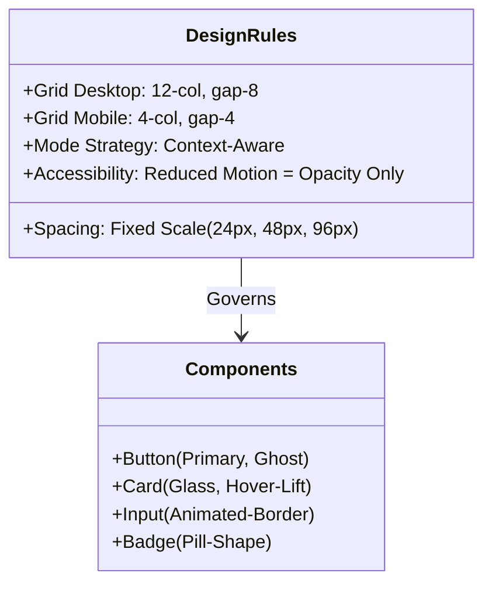
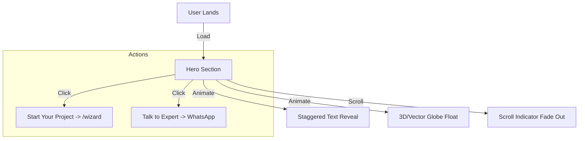
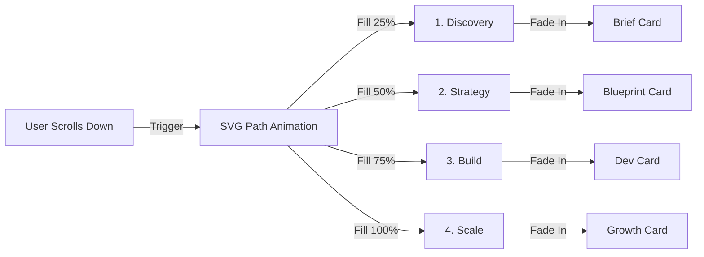
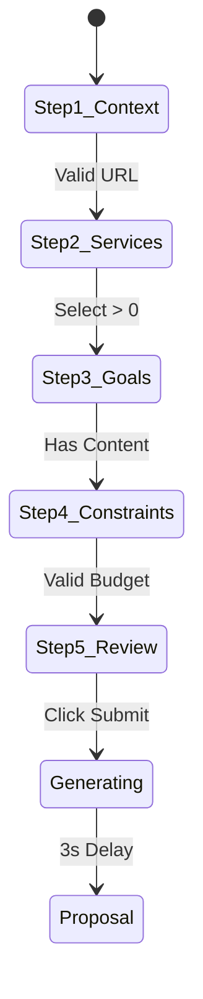
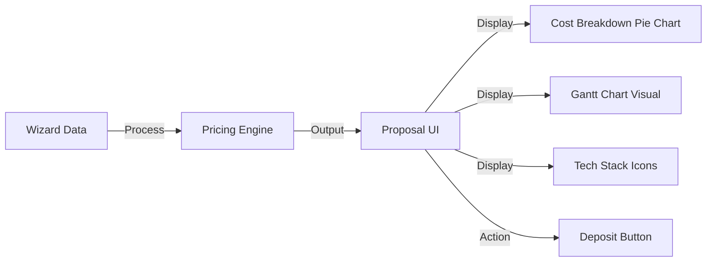

# 🎨 Sun AI Design Prompts & Implementation Library

This document contains **natural language prompts** designed to generate high-end, production-ready UI/UX components. Each prompt is paired with a Mermaid diagram to visualize the architecture, logic, and user flow before generation.

**Aesthetic Goal:** "Premium, Intelligent, Luxury Tech."
**Key Visuals:** Slate 900 backgrounds (Hero/Bento), Warm White backgrounds (Content), Orange-500 accents, glassmorphism, and scroll-driven storytelling.

---

## 1. Global Design System & "Luxury" Rules

**Use this prompt to establish the core visual language, grid, and layout rules.**

### 🧜‍♀️ Architecture: Design Tokens


### 💬 Prompt: The Foundation
> "Create a comprehensive **Global Design System** for 'Sun AI', a premium AI agency.
>
> **1. Layout & Grid System:**
> -   **Desktop:** Standard 12-column grid with `gap-8` and `max-w-7xl` container.
> -   **Mobile:** 4-column grid with `gap-4` and `px-6` margins.
> -   **Vertical Spacing:** Standardize section padding to `py-24` (mobile) and `py-32` (desktop).
>
> **2. Color Mode Strategy (Strict):**
> -   **Dark Mode (Slate-900):** Use ONLY for High-Impact sections: Hero, Bento Grid, Footer, and Final CTA.
> -   **Light Mode (Warm White #FDFDFD):** Use for Content-Heavy sections: How It Works, Wizard, Testimonials, FAQ.
> -   *Never mix dark and light cards within the same section.*
>
> **3. Motion & Accessibility:**
> -   **Micro-interactions:** All interactive elements must have `transition-all duration-300`.
> -   **Reduced Motion:** If `prefers-reduced-motion` is true, disable all transforms/movements. Use only **opacity/fade-in** transitions.
>
> **4. Components:**
> -   Create a `GlassCard` (Dark & Light variants).
> -   Create a `PrimaryButton` (Orange glow on hover).
> -   Create `SectionHeading` (Kicker + Manrope Title + Inter Body).
>
> **Output**: Update `globals.css` and create base components in `/components/ui/design-system`."

---

## 2. The "Hero" Section (Immersive Entrance)

**Use this prompt to build the high-impact landing area.**

### 🧜‍♀️ User Flow: First Impression


### 💬 Prompt: Hero UI/UX (Dark Mode)
> "Develop a **Responsive Hero Section** that conveys 'Production-Ready AI'.
>
> **Visual Direction (Dark Mode):**
> -   **Background**: Deep `bg-slate-900` with a subtle, breathing gradient mesh (Orange/Rose) at 20% opacity.
> -   **Typography**: White text. High-contrast H1 ('The AI Agency for the Future'). Use a gradient text span for the key phrase.
> -   **Layout**: Split screen (Text Left, Visual Right) on Desktop. Stacked on Mobile.
> -   **Motion**: Staggered entrance animation (Text fades up line-by-line). 
> -   **CTA**: Two buttons side-by-side. 
>     1. 'Start Your Project' (Solid Orange, Pulse effect). Links to `/wizard`.
>     2. 'Talk to an Expert' (Glass Outline). Links to WhatsApp.
>
> **Constraint**: Ensure the primary CTA is visible 'above the fold' on iPhone SE (390px height)."

---

## 3. "How It Works" (Scroll-Driven Storytelling)

**Use this prompt to explain the complex process simply.**

### 🧜‍♀️ Logic: Process Animation


### 💬 Prompt: Interactive Process (Light Mode)
> "Create a **'How It Works' Section** that uses scroll-driven storytelling.
>
> **Context:** This section uses the **Light Mode** (Warm White) background.
>
> **UI Layout:**
> -   **Desktop**: A horizontal timeline. As the user scrolls down, a 'circuit line' (SVG) fills with orange color, visually connecting 4 distinct cards.
> -   **Mobile**: A vertical timeline layout. The line draws downwards on the left.
>
> **Cards (Illustrated):**
> -   **Style**: White cards with soft shadow (`shadow-lg`). Not flat.
> -   **Content**: Large Lucide icon, bold Step Number (01, 02...), Title, Description.
> -   **Hover**: Icon glows, card lifts slightly.
>
> **Animation Behavior**:
> -   The line filling matches the scroll position.
> -   Cards fade in (`opacity: 0` -> `1`) as the line reaches them.
> -   *A11y*: If reduced motion, show full line immediately."

---

## 4. Service Features (Bento Grid)

**Use this prompt to showcase capabilities.**

### 🧜‍♀️ Structure: Bento Layout
```mermaid
graph TD
    Grid[Bento Grid Container]
    Grid -->|Large| Item1[Full Stack Web Dev]
    Grid -->|Tall| Item2[AI Chatbots]
    Grid -->|Wide| Item3[Workflow Automation]
    Grid -->|Small| Item4[Consulting]
    
    Item1 -->|Click| Link1[/services/web-dev]
    Item2 -->|Click| Link2[/services/chatbots]
```

### 💬 Prompt: High-End Services Grid (Dark Mode)
> "Design a **'Bento Grid' Layout** for the Services section.
>
> **Context:** This section uses the **Dark Mode** (Slate-900) background to contrast with the previous section.
>
> **Design Specs:**
> -   **Grid**: A CSS Grid layout with varying cell sizes (2x2, 1x2, 2x1).
> -   **Visuals**: Dark glass cards (`bg-slate-800/50` + backdrop blur).
> -   **Interaction**: **Entire card is clickable** (cursor-pointer). On hover, show a 'View Service' arrow icon appearing in the top right.
>
> **Content Visualization:**
> -   *AI Web Dev*: Code snippet typing effect.
> -   *Chatbots*: Simulated chat bubble pop-up.
> -   *Automation*: Nodes connecting (Graph animation)."

---

## 5. The AI Brief Wizard (Complex UX)

**Use this prompt for the core application logic.**

### 🧜‍♀️ User Journey: The Wizard


### 💬 Prompt: Intelligent Wizard Form (Light Mode)
> "Build the **AI Brief Wizard**, a 5-step interactive form located at `/wizard`.
>
> **Context:** Clean, distraction-free **Light Mode** interface.
>
> **Trust Signals (Header):**
> -   Display: 'Est. time: 3 mins', 'Auto-saved', and a 'Private & Encrypted' lock icon.
>
> **Step Breakdown:**
> 1.  **Overview**: Ask for Name + Website URL. *Interaction*: 'Scanning...' animation on URL entry.
> 2.  **Services**: Grid of selectable cards.
> 3.  **Goals**: Textarea with 'Chip' suggestions.
> 4.  **Constraints**: Visual Range Slider (Budget) & Date Picker.
> 5.  **Review**: Summary card.
>
> **UX Logic:**
> -   Use `zustand` for state.
> -   Fixed bottom navigation bar on mobile.
> -   Progress bar showing % completion."

---

## 6. Proposal & Dashboard (Data Viz)

**Use this prompt for the output screen.**

### 🧜‍♀️ Data Flow: Proposal Generation


### 💬 Prompt: Dynamic Proposal UI
> "Create the **Proposal Preview Page**.
>
> **Visual Components:**
> 1.  **Header**: 'Your Custom AI Roadmap'.
> 2.  **Success State**: On load, show a subtle **Golden/Orange Glow** radiating from the main card, followed by a checkmark. (No confetti).
> 3.  **Data Viz**:
>     -   **Projected Efficiency**: Simple bar chart.
>     -   **Timeline**: Horizontal visual Gantt chart.
> 4.  **Pricing Card**: Premium glass card.
>     -   **Main CTA**: 'Secure Design Slot' (Stripe).
>     -   **Secondary**: 'Book Strategy Call'."
