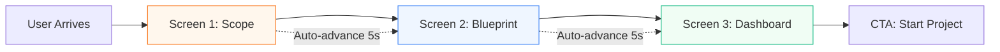
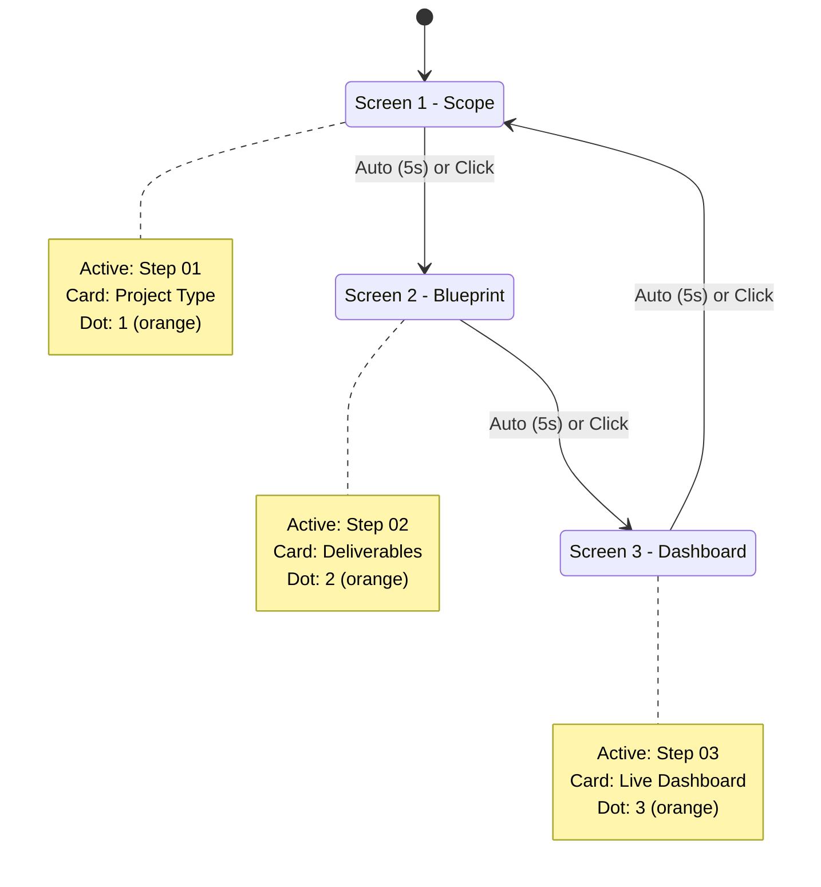
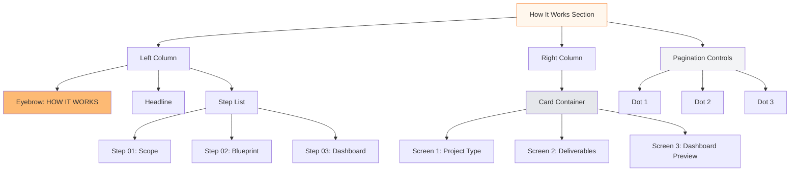

# HOW IT WORKS — 3-SCREEN IMPLEMENTATION

**Purpose:** Showcase the 3-step project workflow with interactive carousel  
**Screens:** Scope → Blueprint → Dashboard  
**Visual Reference:** Calm luxury editorial style with orange accent

---

## MERMAID WORKFLOW DIAGRAM



---

## SCREEN 1 — SCOPE

### Visual Layout
**Left Column (40% width):**
- Small orange eyebrow: "HOW IT WORKS"
- Large headline (48-60px): "The smarter way to build your startup"
- Step indicator: "01" with orange square marker
- Step title: "Scope" (24px, bold)
- Description: "Start your project. Use AI or work with an expert to build a custom scope to share with our engineers."
- Steps 02 and 03 shown in light gray (inactive)

**Right Column (60% width):**
- Large card (neutral-50 background, border)
- Card content:
  - "PROJECT TYPE" label (small, uppercase)
  - "AI Platform Development" (20px, bold)
  - "TIMELINE" label
  - "8-12 Weeks" (18px)
  - "BUDGET RANGE" label
  - "$30,000 - $50,000" (18px, bold)

**Bottom:**
- Pagination dots (3 dots)
- First dot: orange (active)
- Other dots: gray (inactive)

---

## SCREEN 2 — BLUEPRINT

### Visual Layout
**Left Column:**
- Same eyebrow and headline
- Step indicator: "02" with orange square marker
- Step title: "Blueprint" (24px, bold, active)
- Description: "Receive a detailed technical blueprint with architecture, timeline, milestones, and deliverables."
- Steps 01 and 03 in light gray

**Right Column:**
- Large card showing blueprint visual
- Card content:
  - "DELIVERABLES" label
  - List with checkmarks:
    - ✓ System architecture diagram
    - ✓ Database schema & API design
    - ✓ Week-by-week timeline
    - ✓ Tech stack recommendations
    - ✓ Risk analysis & mitigation
  - "INCLUDED" label
  - "Technical documentation" (with document icon)

**Bottom:**
- Pagination dots
- Second dot: orange (active)

---

## SCREEN 3 — DASHBOARD

### Visual Layout
**Left Column:**
- Same eyebrow and headline
- Step indicator: "03" with orange square marker
- Step title: "Dashboard" (24px, bold, active)
- Description: "Track progress in real-time. Review deliverables, communicate with your team, and monitor milestones."
- Steps 01 and 02 in light gray

**Right Column:**
- Large card showing dashboard mockup
- Card content:
  - Mini dashboard preview showing:
    - Progress bar: "Week 3 of 8" (60% complete)
    - Recent activity feed:
      - "Database schema approved" (green check)
      - "API endpoints deployed" (green check)
      - "Frontend in review" (orange clock)
    - Next milestone: "User testing - Due in 3 days"
  - "LIVE UPDATES" badge (green pulse)

**Bottom:**
- Pagination dots
- Third dot: orange (active)

---

## INTERACTION DESIGN

### Auto-Advance Behavior
- Screen displays for 5 seconds
- Smooth fade transition (400ms) to next screen
- Loop: Screen 3 → Screen 1
- User can pause by hovering over card
- Manual navigation via dots or arrow keys

### Animation Sequence
1. **Fade out current screen** (300ms)
2. **Update step indicators** (instant)
3. **Fade in new screen** (300ms)
4. **Slide card from right** (400ms, ease-out)

### States
- **Active step:** Orange square marker, bold text, full opacity
- **Inactive steps:** Gray text, 40% opacity
- **Active dot:** Orange circle, 12px
- **Inactive dots:** Gray circle, 8px

---

## MERMAID STATE DIAGRAM



---

## CONTENT SPECIFICATIONS

### Eyebrow
- Text: "HOW IT WORKS"
- Color: Orange-600
- Size: 12px
- Weight: 600
- Transform: Uppercase
- Spacing: 0.05em

### Headline
- Text: "The smarter way to build your startup"
- Color: Neutral-900
- Size: 48-60px (responsive)
- Weight: 600
- Line height: 1.2
- Remains same across all screens

### Step Numbers
- Format: "01", "02", "03"
- Orange square marker (8px × 8px, rounded-sm)
- Number color: Neutral-900
- Active: Full opacity, bold
- Inactive: 40% opacity, regular weight

### Step Titles
- Scope / Blueprint / Dashboard
- Size: 24px
- Active: Bold, Neutral-900
- Inactive: Regular, Neutral-400

### Descriptions (per screen)
**Screen 1 - Scope:**
"Start your project. Use AI or work with an expert to build a custom scope to share with our engineers."

**Screen 2 - Blueprint:**
"Receive a detailed technical blueprint with architecture, timeline, milestones, and deliverables."

**Screen 3 - Dashboard:**
"Track progress in real-time. Review deliverables, communicate with your team, and monitor milestones."

---

## CARD CONTENT DETAILS

### Screen 1 Card - Project Scope
```
┌─────────────────────────────────┐
│ PROJECT TYPE                    │
│ AI Platform Development         │
│                                 │
│ TIMELINE                        │
│ 8-12 Weeks                      │
│                                 │
│ BUDGET RANGE                    │
│ $30,000 - $50,000              │
└─────────────────────────────────┘
```

### Screen 2 Card - Blueprint Deliverables
```
┌─────────────────────────────────┐
│ DELIVERABLES                    │
│ ✓ System architecture diagram   │
│ ✓ Database schema & API design  │
│ ✓ Week-by-week timeline         │
│ ✓ Tech stack recommendations    │
│ ✓ Risk analysis & mitigation    │
│                                 │
│ INCLUDED                        │
│ 📄 Technical documentation      │
└─────────────────────────────────┘
```

### Screen 3 Card - Live Dashboard
```
┌─────────────────────────────────┐
│ 🟢 LIVE UPDATES                 │
│                                 │
│ Progress: Week 3 of 8           │
│ ████████████░░░░░░  60%         │
│                                 │
│ RECENT ACTIVITY                 │
│ ✓ Database schema approved      │
│ ✓ API endpoints deployed        │
│ ⏱ Frontend in review            │
│                                 │
│ NEXT MILESTONE                  │
│ User testing - Due in 3 days    │
└─────────────────────────────────┘
```

---

## RESPONSIVE BEHAVIOR

### Desktop (1024px+)
- Two-column layout (40/60 split)
- Card slides in from right
- Full card dimensions: 500px × 320px

### Tablet (768-1023px)
- Two-column layout maintained
- Card: 420px × 300px
- Smaller font sizes (-10%)

### Mobile (<768px)
- Single column (stacked)
- Headline first
- Steps list second
- Card third (full width)
- Swipe gestures enabled
- Auto-advance: 6 seconds (slower)

---

## MERMAID COMPONENT DIAGRAM



---

## IMPLEMENTATION PRIORITY

### Phase 1 (MVP)
1. Static 3-screen layout
2. Manual dot navigation
3. Basic fade transitions
4. Responsive grid

### Phase 2 (Enhanced)
1. Auto-advance timer
2. Smooth slide animations
3. Pause on hover
4. Keyboard navigation (arrow keys)

### Phase 3 (Polish)
1. Swipe gestures (mobile)
2. Progress indicators per screen
3. Animation refinements
4. Accessibility (ARIA labels)

---

## ACCESSIBILITY REQUIREMENTS

- **ARIA Labels:** `aria-label="Project workflow carousel"`
- **Role:** `role="region"` on container
- **Tab Navigation:** All dots keyboard accessible
- **Screen Reader:** Announce active screen change
- **Pause Button:** Allow users to stop auto-advance
- **Focus States:** Clear orange outline on interactive elements

---

## ANIMATION TIMING

```mermaid
gantt
    title Screen Transition Timeline
    dateFormat  s
    axisFormat %Ss
    
    section Screen 1
    Display           :active, s1, 0, 5s
    Fade Out          :        s1f, 5s, 0.3s
    
    section Transition
    Update State      :crit,   st, 5.3s, 0.1s
    
    section Screen 2
    Fade In           :        s2f, 5.4s, 0.3s
    Card Slide        :        s2s, 5.4s, 0.4s
    Display           :active, s2, 5.7s, 5s
```

---

## COLOR PALETTE PER SCREEN

### Screen 1 - Scope (Orange Theme)
- Accent: `#F97316` (orange-500)
- Background: `#FFF7ED` (orange-50)
- Border: `#FDBA74` (orange-300)

### Screen 2 - Blueprint (Blue Theme)
- Accent: `#3B82F6` (blue-500)
- Background: `#EFF6FF` (blue-50)
- Border: `#93C5FD` (blue-300)

### Screen 3 - Dashboard (Green Theme)
- Accent: `#10B981` (green-500)
- Background: `#F0FDF4` (green-50)
- Border: `#6EE7B7` (green-300)

---

## FINAL CHECKLIST

- [ ] Three distinct screens created
- [ ] Smooth transitions implemented
- [ ] Auto-advance timer (5 seconds)
- [ ] Manual navigation (dots clickable)
- [ ] Pause on hover working
- [ ] Mobile responsive (stacked layout)
- [ ] Swipe gestures on mobile
- [ ] Keyboard navigation (arrows)
- [ ] ARIA labels for accessibility
- [ ] All content matches specs
- [ ] Cards display correct information
- [ ] Step indicators highlight correctly
- [ ] Pagination dots sync with active screen
- [ ] Animation timing feels natural

---

**END OF DOCUMENT**
