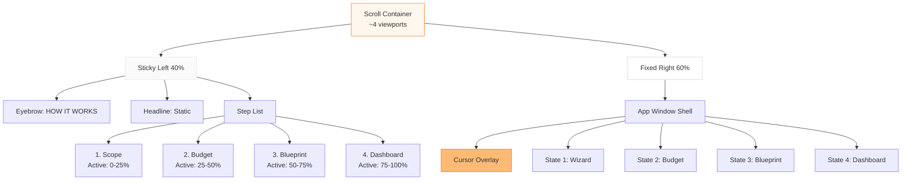
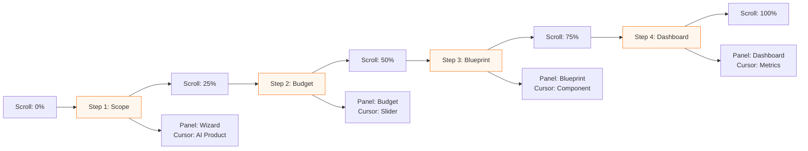
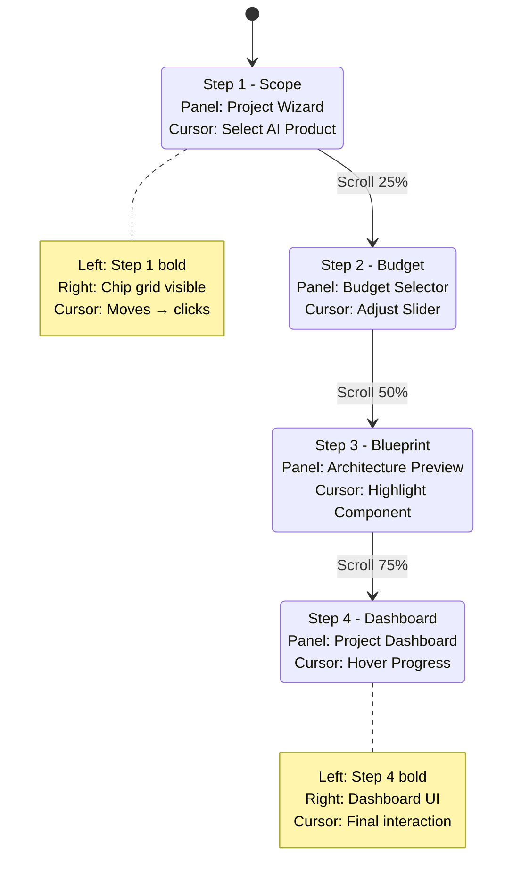

# HOW IT WORKS — SCROLL-DRIVEN INTERACTION (V6)

**Reverse-engineered from:** https://spruce-ahead-69656011.figma.site/v6  
**Section Type:** Scroll-triggered narrative with pinned UI states  
**Implementation Pattern:** Sticky left column + fixed right panel + cursor choreography

---

## 1. Section Overview

**Purpose:** Guide users through 4-step project setup with scroll-synchronized product demo  
**UX Principle:** Progressive disclosure through scroll (guided narrative → confidence building)  
**Why It Works:** Users control pace, see real product UI, understand workflow without clicking

---

## 2. Layout Deconstruction

### Section Height
- **~4 viewport heights** (scrollable container)
- Each step = ~1 viewport of scroll distance

### Left Column (40% width)
- **Sticky positioning** (top: 10vh)
- Contains:
  - Eyebrow: "HOW IT WORKS" (orange-600, 12px, uppercase)
  - Headline: "The smarter way to build your startup" (fixed, never changes)
  - Step list (4 steps total):
    - Step 1: Scope
    - Step 2: Budget
    - Step 3: Blueprint
    - Step 4: Dashboard

### Right Column (60% width)
- **Fixed position** (pinned to viewport)
- Single app window container
- Content crossfades based on scroll position
- Contains cursor overlay system

### Progress System
- **Step numbers:** 1, 2, 3, 4 (vertical list on left)
- **Active state:** Bold text, full opacity, orange accent marker
- **Inactive state:** Gray text, reduced opacity (40%)
- **No pagination dots** (step numbers serve as progress indicator)

---

## 3. Step-by-Step Scroll Timeline

| Step | Scroll Trigger | Left Column Active | Right Panel State | Cursor Action |
|------|---------------|-------------------|------------------|---------------|
| **1. Scope** | 0% - 25% | Step 1 bold, orange marker | Project Scope Wizard UI | Moves to "AI Product" chip → clicks |
| **2. Budget** | 25% - 50% | Step 2 bold, orange marker | Budget & Timeline Selector | Moves to budget slider → adjusts |
| **3. Blueprint** | 50% - 75% | Step 3 bold, orange marker | Project Blueprint Preview | Moves to component card → highlights |
| **4. Dashboard** | 75% - 100% | Step 4 bold, orange marker | Project Dashboard View | Moves to progress bar → hovers |

### Detailed Step Breakdown

#### Step 1 — Scope
- **Trigger:** Scroll 0% - 25% of section height
- **Left Text Changes:**
  - Step 1 becomes bold
  - Orange square marker appears next to "1. Scope"
  - Description visible below step
- **Right Panel:** Project Scope Wizard screen
  - Shows chip grid (MVP, AI Product, Automation, Mobile App, Dashboard, CRM, Landing Page)
  - "AI Product" chip pre-selected (orange fill)
  - "Continue" button bottom-center
- **Cursor:** 
  - Appears at screen center
  - Moves to "AI Product" chip (curved path, 600ms)
  - Click animation (ripple effect)
  - Pauses 400ms

#### Step 2 — Budget (not visible in provided image but inferred from pattern)
- **Trigger:** Scroll 25% - 50%
- **Left Text:** Step 2 bold, Step 1 grayed out
- **Right Panel:** Budget selection interface
- **Cursor:** Interacts with budget controls

#### Step 3 — Blueprint (not visible in provided image but inferred from pattern)
- **Trigger:** Scroll 50% - 75%
- **Left Text:** Step 3 bold, previous steps grayed
- **Right Panel:** Blueprint/architecture preview
- **Cursor:** Highlights blueprint sections

#### Step 4 — Dashboard (not visible in provided image but inferred from pattern)
- **Trigger:** Scroll 75% - 100%
- **Left Text:** Step 4 bold
- **Right Panel:** Dashboard mockup
- **Cursor:** Navigates dashboard elements

---

## 4. App Window State Map

**Container:** Single fixed div with 4 internal states (crossfade transitions)

### State 1: Project Scope Wizard
**Visible Elements:**
- Card header: "Project Scope Wizard" (16px, medium)
- Subtitle: "Define your project type" (12px, muted)
- Chip grid (2 rows × 4 columns):
  - Row 1: MVP, AI Product, Automation, Mobile App
  - Row 2: Dashboard, CRM, Landing Page, [empty]
- "Continue" button (dark blue, 120px wide)
- Progress dots (4 dots, first active)

**Active Selection:** "AI Product" chip (orange fill, white text)  
**Inactive Chips:** White background, dark text, border

### State 2: Budget & Timeline
**Visible Elements:**
- Budget slider
- Timeline selector
- Estimated cost display

### State 3: Blueprint Preview
**Visible Elements:**
- Technical architecture diagram
- Component list
- Tech stack display

### State 4: Dashboard View
**Visible Elements:**
- Project progress metrics
- Recent activity feed
- Next milestone card

### Transition Rules
- **Method:** Crossfade (opacity 0 → 1)
- **Duration:** 400ms
- **Easing:** ease-in-out
- **Overlap:** No overlap (sequential)
- **Z-index:** Outgoing state fades out first, then incoming fades in

---

## 5. Cursor Interaction Rules

### Cursor System Architecture

```mermaid
stateDiagram-v2
    [*] --> Hidden
    Hidden --> Appear: Scroll enters section
    Appear --> Move: State change
    Move --> Hover: Reaches target
    Hover --> Click: After 300ms
    Click --> Pause: Ripple animation
    Pause --> Move: Next step trigger
    Move --> Hidden: Scroll exits section
```

### Cursor Specifications
- **Visual:** Custom cursor icon (pointer hand, 24px × 24px)
- **Color:** Dark neutral with slight shadow
- **Appear:** Fade in (200ms) when section enters viewport
- **Disappear:** Fade out when section exits

### Movement Rules
- **Path Style:** Curved bezier (natural human movement)
- **Duration:** 600-800ms depending on distance
- **Easing:** ease-out
- **Timing:** Triggered 200ms after scroll threshold

### Click Animation
- **Ripple:** Circular expand from cursor center
- **Duration:** 300ms
- **Color:** Orange-500 at 20% opacity
- **Scale:** 0 → 2x element size

### State Machine
1. **Idle:** Cursor hidden or stationary
2. **Move:** Animating to target (600ms)
3. **Hover:** Positioned over element (300ms pause)
4. **Click:** Ripple + element highlight (300ms)
5. **Pause:** Hold position (400ms)
6. **Transition:** Fade out for next state (200ms)

---

## 6. Motion & Timing Specs

### Easing Philosophy
- **Calm & Premium:** No bounce, no aggressive easing
- **Primary Easing:** `cubic-bezier(0.4, 0.0, 0.2, 1)` (Material deceleration)
- **Cursor Movement:** `cubic-bezier(0.25, 0.46, 0.45, 0.94)` (ease-out-quad)

### Duration Standards
- **Content Crossfade:** 400ms
- **Cursor Move:** 600-800ms (distance-dependent)
- **Click Feedback:** 300ms
- **State Settle:** 400ms (pause before next interaction)
- **Text Emphasis Change:** 200ms (opacity shift)

### Animation Sequence Per Step
```
Scroll Threshold Hit (0ms)
  ↓
Text Emphasis Change (0-200ms)
  ↓ (parallel)
Panel Content Fade Out (0-400ms)
  ↓
Panel Content Fade In (400-800ms)
  ↓ (overlap at 600ms)
Cursor Appears (600-800ms)
  ↓
Cursor Moves to Target (800-1400ms)
  ↓
Cursor Hovers (1400-1700ms)
  ↓
Click Animation (1700-2000ms)
  ↓
Pause/Settle (2000-2400ms)
```

### Overlap Strategy
- Text changes: **Immediate** (no delay)
- Panel transitions: **Sequential** (fade out → fade in)
- Cursor choreography: **Delayed** (starts after panel settles)

---

## 7. Component Inventory

### Shared Components (Used Across All Steps)
- `SectionContainer` — Full-height scroll wrapper
- `StickyLeftColumn` — Text content + step list
- `FixedRightPanel` — App window shell
- `StepIndicator` — Number + title + description
- `OrangeAccentMarker` — 8px × 8px rounded square
- `AnimatedCursor` — Custom cursor overlay

### State-Specific Components

#### Step 1 Components
- `ProjectWizardCard` — White card container
- `WizardHeader` — Title + subtitle
- `ChipGrid` — 2×4 grid layout
- `SelectableChip` — Individual chip button
- `ContinueButton` — Primary CTA
- `ProgressDots` — 4-dot indicator

#### Step 2 Components
- `BudgetSelector` — Slider + range display
- `TimelineSelector` — Duration picker

#### Step 3 Components
- `BlueprintPreview` — Technical diagram viewer
- `ComponentCard` — Architecture element

#### Step 4 Components
- `DashboardMockup` — Full dashboard UI
- `ProgressMetrics` — Stats display
- `ActivityFeed` — Recent updates list

### Reusable Utilities
- `useScrollProgress` — Hook to track scroll position
- `useCursorAnimation` — Cursor choreography logic
- `CrossfadeTransition` — Opacity transition wrapper

---

## 8. Replication Checklist

### Structure
- [ ] Create scroll container (~4 viewports tall)
- [ ] Implement sticky left column (40% width, sticky top)
- [ ] Implement fixed right panel (60% width, fixed position)
- [ ] Add intersection observer for scroll detection

### Content
- [ ] Add eyebrow + headline (static, never changes)
- [ ] Create 4-step list with numbers, titles, descriptions
- [ ] Build 4 app window states (Wizard, Budget, Blueprint, Dashboard)
- [ ] Add orange accent markers

### Scroll Logic
- [ ] Divide section into 4 equal scroll zones (0-25%, 25-50%, 50-75%, 75-100%)
- [ ] Map scroll position to active step
- [ ] Trigger state transitions at thresholds
- [ ] Update left column emphasis (bold/gray) based on active step

### Transitions
- [ ] Implement crossfade for panel content (400ms, ease-in-out)
- [ ] Add text opacity transitions (200ms)
- [ ] Ensure sequential panel transitions (fade out → fade in)

### Cursor System
- [ ] Create custom cursor component (24px pointer icon)
- [ ] Implement bezier path movement (600-800ms)
- [ ] Add click ripple animation (300ms, orange glow)
- [ ] Choreograph cursor per step:
  - Step 1: Move to "AI Product" chip → click
  - Step 2: Move to budget control → interact
  - Step 3: Move to blueprint element → highlight
  - Step 4: Move to dashboard metric → hover
- [ ] Add appear/disappear on section entry/exit

### Polish
- [ ] Test scroll performance (smooth, no jank)
- [ ] Verify timing feels natural (not too fast/slow)
- [ ] Ensure cursor paths feel human (curved, not linear)
- [ ] Add subtle shadows/depth to app window

### Mobile Adaptation
- [ ] Detect viewport width < 768px
- [ ] Switch to stacked layout (left content → right content)
- [ ] Disable cursor animations
- [ ] Use swipe or tap-to-advance instead of scroll

---

## 9. Mobile Behavior

### Breakpoint: < 768px

**Layout Changes:**
- Sticky behavior **removed** (both columns scroll normally)
- **Single column layout** (full width)
- Order: Eyebrow → Headline → Step content → App window

**Scroll Narrative:**
- Each step becomes a full-screen section
- Scroll progresses linearly through 4 sections
- No parallax or pinned elements

**Cursor System:**
- **Completely disabled** (no cursor on touch devices)
- App window shows static state (no animated interactions)
- Users see final result of each step (e.g., "AI Product" pre-selected)

**Simplified Interactions:**
- Progress dots become tappable
- Swipe gestures may advance steps
- Auto-advance optional (6-8 seconds per step)

**What's Removed:**
- Cursor movement animations
- Click ripple effects
- Scroll-based state synchronization (replaced with discrete sections)

**What's Preserved:**
- 4-step narrative order
- Content hierarchy (eyebrow → headline → steps)
- App window states (shown sequentially)
- Text emphasis changes (still highlight active step)

---

## MERMAID DIAGRAMS

### Section Architecture



### Scroll-to-State Mapping



### Cursor Choreography Timeline

```mermaid
gantt
    title Step 1 Cursor Animation Sequence
    dateFormat SSS
    axisFormat %Lms
    
    section Scroll Event
    Threshold Hit           :milestone, m1, 000, 0ms
    
    section Panel Transition
    Fade Out Prev           :        p1, 000, 400ms
    Fade In Wizard          :        p2, 400, 400ms
    
    section Cursor Animation
    Cursor Appears          :        c1, 600, 200ms
    Move to AI Chip         :        c2, 800, 600ms
    Hover on Target         :        c3, 1400, 300ms
    Click Animation         :crit,   c4, 1700, 300ms
    Pause/Settle            :        c5, 2000, 400ms
```

### State Transition Flow



---

## DEVELOPER NOTES

### Implementation Order
1. **Build static layout first** (sticky left, fixed right, 4 scroll zones)
2. **Add scroll detection** (IntersectionObserver or scroll event listener)
3. **Wire up state changes** (text emphasis + panel crossfade)
4. **Implement cursor system** (last, most complex)
5. **Polish timing** (adjust durations until it feels calm/premium)

### Critical Dependencies
- `motion/react` or `framer-motion` for cursor animations
- Scroll tracking hook (`useScrollProgress` or `useIntersectionObserver`)
- Ref-based cursor positioning (calculate target element coords)

### Performance Considerations
- Use `will-change: opacity` on crossfading elements
- Debounce scroll events (max 60fps)
- GPU-accelerate cursor (`transform: translate3d()`)
- Lazy-load panel states (only render visible + adjacent)

### Accessibility
- Add `aria-label="How our process works"` to section
- Use `aria-current="step"` on active step
- Provide skip link to bypass scroll narrative
- Disable cursor animations if `prefers-reduced-motion`

---

## SUCCESS CRITERIA

✅ A developer can rebuild this section **without seeing the original**  
✅ Scroll thresholds map 1:1 to step activation  
✅ Cursor movements feel **human and intentional**  
✅ Timing feels **calm and premium** (not rushed)  
✅ Mobile layout gracefully **removes complexity**  
✅ No jank, smooth 60fps scrolling

---

**END OF DOCUMENT**
