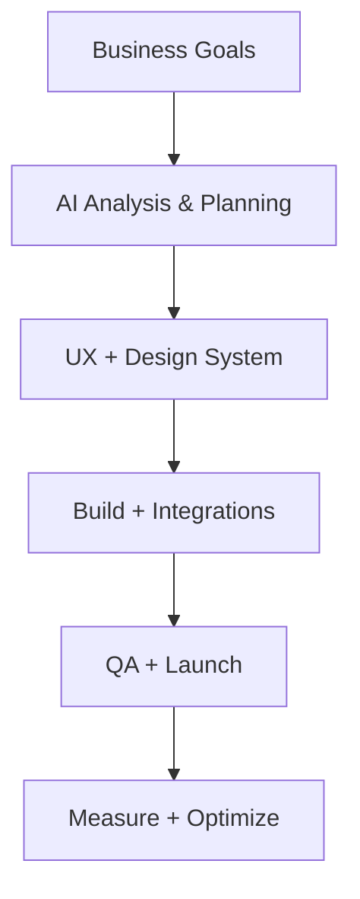
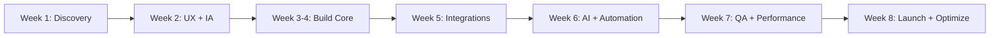
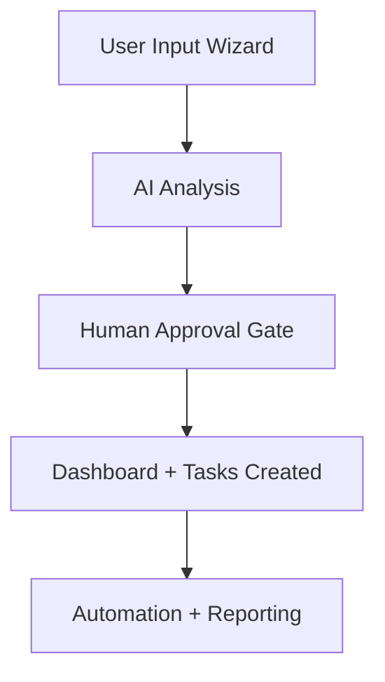

# Sun AI — Marketing Page Design Prompts (One-File Master)
Use this single prompt file in **Figma Make / Claude / Gemini / ChatGPT** to generate **luxury, premium, responsive** marketing pages with **wireframes + diagrams + real-world examples**.

---

## 0) MASTER SYSTEM PROMPT (Paste First)
You are a **senior product designer + UX architect + conversion-focused copywriter**.
Design a **luxury, premium, sophisticated, intelligent** marketing page for a high-end AI agency.

### Design Style Rules
- Calm, premium, editorial minimalism
- Strong hierarchy (headline → subheadline → proof → CTA)
- High whitespace, soft shadows, clean borders
- Off-white background + charcoal text + warm accent for CTAs
- No clutter, no neon, no "sci-fi AI" visuals
- Short copy blocks, scannable sections, crisp headings

### Deliverables Required
1) **Exact wireframe** section-by-section (desktop/tablet/mobile)
2) **Component list** (cards, buttons, tabs, accordions, timelines)
3) **Copy** (headline, tagline, section headings, CTA text)
4) **Diagrams** (flowchart + timeline diagram)
5) **Scroll-driven storytelling** (reveal sequence)
6) **Routes + links** (nav, footer, internal page linking best practices)

---

## 1) ROUTING & LINKING RULES (Best Practice)
Use these standard routes:
- `/` Home (V11 Calm Luxury Editorial - Default)
- `/v11` Home V11 (Calm Luxury Editorial)
- `/services` All Services Overview
- `/projects` Projects / Case Studies
- `/about` About Us
- `/process` Our Process
- `/booking` Book a Call
- `/whatsapp` Contact Support
- `/wizard` Create Project (wizard)
- `/case-studies/{projectSlug}` (detail pages - future)

**Navbar**
- Home, Services, Projects, About, Contact
- Right side: `Sign in` + Primary CTA `Create Project`

**Footer**
- SOLUTIONS: All Services, AI Web Design, App Development, AI Agents, Chatbots, Sales & CRM, MVP Builder
- INDUSTRIES: SaaS, E-commerce, Real Estate, B2B Services, Automotive, Tourism
- COMPANY: About Us, Case Studies, Our Process, Book a Call, Contact Support
- GET STARTED: Start Your Project, Home V11, Client Login, Style Guide, Sitemap
- Add "Projects" quick links: StartupAI, FashionOS, EventsOS, Medellín AI

---

## FOOTER STRUCTURE (V11 SPECIFICATION)

### A. TOP STRATEGIC CTA STRIP
Placed directly above the main footer links.

**Content**
- Headline: **Ready to Build a Real AI System?**
- Subtext: From idea → proposal → production system in weeks, not months.
- Buttons:
  - Primary CTA: **Start Project** → `/wizard`
  - Secondary CTA: **Book a Call** → `/booking`

**Design**
- Background: charcoal (neutral-900)
- Text: white / off-white
- CTA button: warm orange accent
- Spacing: compact, not hero-sized

---

### B. MAIN FOOTER (5 COLUMNS)

**COLUMN 1 — COMPANY**
- About Sun AI → `/about`
- Our Process → `/process`
- Case Studies → `/projects`
- Book a Call → `/booking`
- Support → `/whatsapp`

**COLUMN 2 — SOLUTIONS**
- All Solutions → `/services`
- AI Web Design → `/services/ai-web-dev`
- App Development → `/services/ai-development`
- AI Agents → `/services/ai-agents`
- AI Chatbots → `/services/ai-chatbots`
- Sales CRM → `/services/ai-sales-marketing`
- MVP Builder → `/services/ai-mvp`

**COLUMN 3 — INDUSTRIES**
- SaaS → `/services/chatbot/saas`
- E-commerce → `/services/chatbot/ecommerce`
- Real Estate → `/services/chatbot/real-estate`
- B2B Services → `/services/chatbot/b2b`
- Automotive → `/services/chatbot/automotive`
- Tourism → `/services/chatbot/tourism`

**COLUMN 4 — PROJECT FLOW**
- Start Brief Wizard → `/wizard`
- AI Processing → `/processing`
- Proposal Ready → `/proposal`
- Client Login → `/login`
- Client Dashboard → `/dashboard`

**COLUMN 5 — RESOURCES**
- AI Systems Guide → `/process`
- Pricing & Timelines → `/process#pricing`
- AI FAQs → `/whatsapp`
- WhatsApp Automation → `/whatsapp`
- Contact Support → `/whatsapp`

---

### C. BOTTOM META BAR
**Left:** © Sun AI Agency — All rights reserved  
**Center:** Privacy Policy, Terms of Service, Security  
**Right:** Social icons (Twitter, LinkedIn, GitHub, Email)

---

## 2) AI WEB APPLICATION TYPES (Use in Services / Projects / Use Cases)
Use these as "what we build" categories (pick 3–6 per page):

1. **AI Dashboards** — insights, scores, decisions, monitoring  
2. **AI Wizards** — guided intake → plan/brief/system output  
3. **AI Chat Apps** — context-aware assistants that act on data  
4. **AI Workflow Automation** — triggers → actions → approvals → logs  
5. **AI Recommendation Engines** — suggest services, actions, next steps  
6. **AI Content Platforms** — generate copy, assets, campaign packs  
7. **AI Planning Tools** — roadmaps, milestones, dependencies, budgets  
8. **AI Analytics & Scoring** — readiness, risk, ROI, lead quality scores  
9. **RAG / AI Search** — search internal docs with citations  
10. **Location Intelligence** — maps + data + AI insights  
11. **Client Portals** — client-facing dashboards with AI summaries  
12. **All-in-One AI SaaS** — combined OS (Wizard + Dashboard + Automation)

---

## 3) UNIVERSAL PAGE BLUEPRINT (Luxury Marketing Layout)
Use this layout on any marketing page.

### Section A — HERO (Authority + Outcome)
- H1: Outcome-driven headline
- Subheadline: what you deliver + how fast
- Proof strip: metrics (projects shipped, delivery time, satisfaction)
- Primary CTA + Secondary CTA
- Hero visual: clean product mock / screenshot frame

**Scroll reveal:** headline → subheadline → CTAs → proof strip

---

### Section B — "HOW IT WORKS" (Explain the system)
Create a **5-step** system with icons + one-line explanations:
1) Input → 2) AI understanding → 3) UX/design system → 4) Build/integrate → 5) Launch/optimize

Add a **flowchart** below (simple, clean).

**Flowchart (required)**

---

### Section C — "WHAT YOU GET" (Cards)
6 cards max
Each card format:
- Title
- One-liner benefit
- "Real outcome" micro-line

Examples:
- Conversion-focused UX
- SEO + performance foundations
- Integrations (Stripe, Supabase, WhatsApp, n8n)
- AI assistant / agents
- Analytics + dashboards
- Automation workflows

---

### Section D — "TOOLS WE USE" (Trust + stack)
Display as clean pill badges grouped:
- Design: Figma, Webflow, Lovable
- Frontend: Vite
- Backend: Supabase, Clerk
- AI: Gemini, Claude, OpenAI, LangChain/LangGraph
- Automations: n8n, WhatsApp, Stripe, Cloudinary

---

### Section E — "REAL-WORLD USE CASES" (Proof)
3 cards with:
- Industry label
- Problem → Outcome
- Link to projects / case studies

Example:
- Startups: "Idea → plan → MVP system"
- Fashion: "Brand ops + shoots + content workflows"
- Real estate/travel: "Location intelligence + automation"

---

### Section F — "8-WEEK TIMELINE" (Visual)
Use a horizontal timeline with 6–8 milestones.

**Timeline diagram (required)**

---

### Section G — "WHY US" (Comparison)
Create a side-by-side comparison:
- Traditional agency vs Sun AI delivery
- Use 4–6 metrics: time, quality, maintainability, AI integration, process transparency

---

### Section H — FINAL CTA (Conversion)
- Strong headline + short reassurance line
- Buttons: `Create Project` + `Contact Us`
- Add micro-proof (metrics strip) below

---

## 4) RESPONSIVE REQUIREMENTS (Desktop / Tablet / Mobile)

### Desktop
- Two-column hero
- Grid cards 3×2
- Wide screenshots, generous whitespace

### Tablet
- Collapse to 1–2 columns
- Carousels for screenshots
- Keep CTAs visible

### Mobile
- Single column
- Screenshots first
- Sticky bottom CTA (optional)
- Accordions for long content
- Minimum tap target 44px

---

## 5) SCROLL-DRIVEN STORYTELLING (Step Reveals)
Define a reveal plan:
1. Hero (headline/CTA)
2. Proof metrics
3. System steps
4. Use cases
5. Timeline
6. Testimonials / results
7. Final CTA

Motion style:
- fade + slight translate (subtle)
- no heavy animations

---

## 6) PROJECT / CASE STUDY MODULE (Reusable Section)
Use this for `/projects` or case study highlights.

**Module must include:**
- Project name + one-line positioning
- 3–5 screenshots (dashboard, wizard, AI output, workflow)
- Problem / Solution / AI Capabilities / Results
- Tech stack pills
- CTAs: `View Case Study` + `View Screens`

**Case-study mini flowchart (required)**

---

## 7) ONE-SHOT PROMPT TEMPLATE (Fill-in + Run)
Copy this block and fill the variables:

### PAGE TYPE
{PAGE_TYPE} = Home | Services | Projects | Service Detail | Case Study | Pricing | Contact

### PAGE TITLE
{PAGE_TITLE} = "AI-Powered Web Design & Development" (example)

### PRIMARY GOAL
{GOAL} = "Convert visitors into 'Create Project' starts"

### TARGET AUDIENCE
{AUDIENCE} = "founders, agencies, premium brands"

### AI APP TYPES TO FEATURE (pick 3–6)
{AI_APP_TYPES} = ["AI Dashboards", "AI Wizards", "Automation", "RAG Search"]

### REAL PROJECTS TO SHOW
{PROJECTS} = ["StartupAI", "FashionOS", "EventsOS", "Medellín AI"]

### PROMPT
Design a **luxury premium** marketing page for **{PAGE_TITLE}**.
Follow the **Universal Page Blueprint** in this file.
Deliver:
- Exact wireframe for desktop/tablet/mobile
- Final copy for each section (headline/tagline/CTAs)
- Cards + layout specs
- Required mermaid diagrams (system flow + timeline)
- Scroll reveal sequence
- Correct routing + footer links
- Include real-world examples using {PROJECTS}
- Use {AI_APP_TYPES} as the "what we build" structure

Output format:
1. Wireframe (section-by-section)
2. Copy (section-by-section)
3. Components list
4. Diagrams (Mermaid)
5. Responsive notes
6. Internal links map

---

## 8) COPY BANK (Luxury + Direct)
Use these patterns:

### Headlines
- "Production-Ready AI Systems — Delivered in 8 Weeks"
- "Real AI Products. Real Results."
- "From Idea to Launch — Without the Chaos"

### Subheadlines
- "We combine strategy, design systems, and AI to ship websites that perform."
- "No demos. No hype. Real systems your team can run."

### CTAs
- Primary: "Create Project"
- Secondary: "View Projects"
- Tertiary: "See Our Process"

---

## 9) QUALITY CHECKLIST (Before Final Output)
- Does every section have a purpose?
- Are screenshots used as proof?
- Is the value clear in 5 seconds?
- Are CTAs repeated 3–4 times naturally?
- Are diagrams simple and readable?
- Does mobile stay clean and fast?
- Are routes/links correct and consistent?

---

END OF FILE