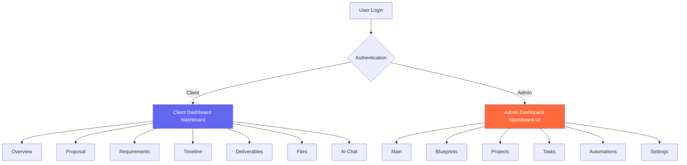
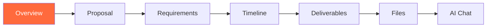
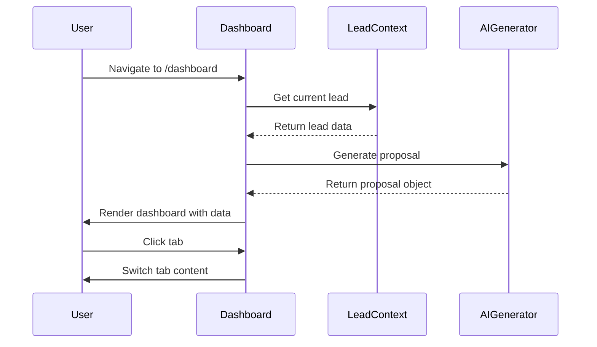
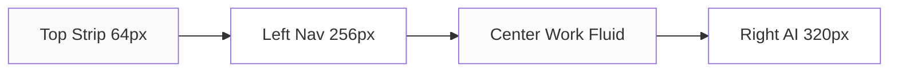
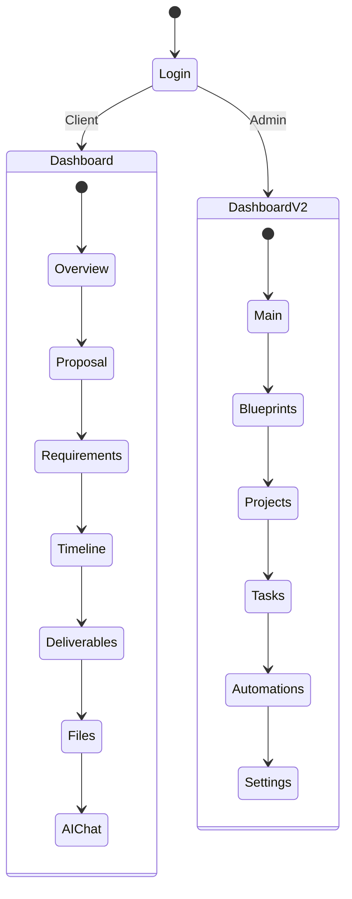
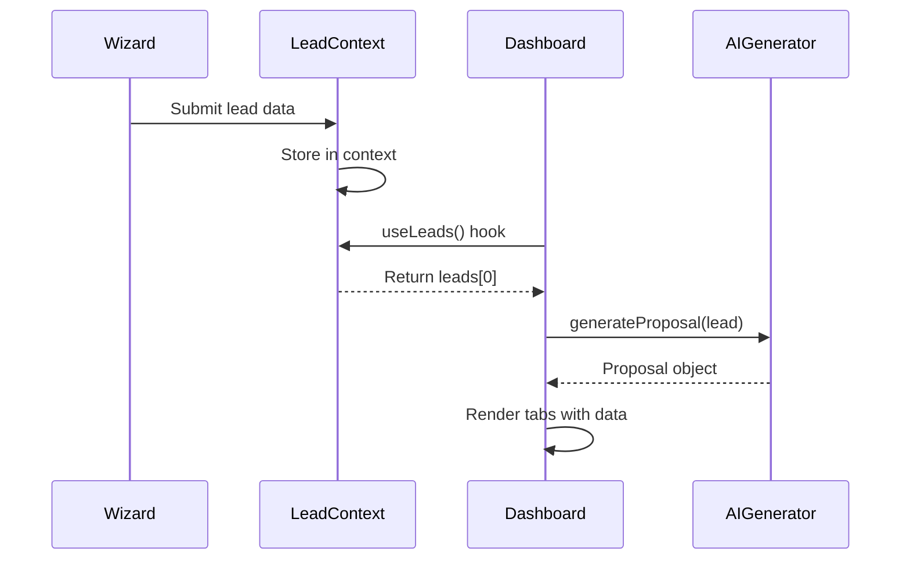
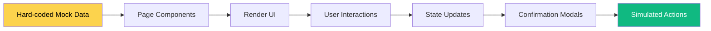

# Client Dashboard - Complete System Documentation
## Luxury AI CRM Dashboard Architecture

**System Type:** Dual Dashboard System  
**Primary Routes:** `/dashboard` (Client), `/dashboard-v2` (Admin Intelligence)  
**Framework:** React + React Router  
**Status:** Production Ready  
**Last Updated:** December 31, 2024

---

## 🎯 Executive Summary

The Luxury AI CRM features **two distinct dashboard systems**:

1. **Client Dashboard** (`/dashboard`) - Client-facing project view
2. **Admin Intelligence Dashboard** (`/dashboard-v2`) - Internal operations & AI tools

Both systems follow the FashionOS design language with distinct purposes and user experiences.

---

## 📊 System Architecture



---

## 1️⃣ CLIENT DASHBOARD (`/dashboard`)

### 1.1 Overview

**Purpose:** Allow clients to track project progress, view proposals, and communicate with AI  
**Route:** `/dashboard`  
**Component:** `ProjectDashboard.tsx`  
**Authentication:** Protected route (requires login)  
**Layout:** Fixed header + Tab navigation + Content area + Sidebar

### 1.2 Tab Structure (7 Tabs)



| Tab | Icon | Purpose | Content |
|-----|------|---------|---------|
| **Overview** | LayoutDashboard | Project summary & quick actions | Summary, goals, proposal snapshot, timeline preview, quick actions |
| **Proposal** | FileText | Full AI-generated proposal | Complete proposal document with phases and pricing |
| **Requirements** | ListChecks | Project requirements tracking | Functional/technical/design requirements (clean view) |
| **Timeline** | Calendar | Project schedule & milestones | Interactive timeline with phases and deadlines |
| **Deliverables** | Package | Track deliverable items | List of all project deliverables with status |
| **Files** | FolderOpen | Document repository | Upload/download project files (empty state) |
| **AI Chat** | MessageSquare | Conversational AI assistant | Chat interface for project questions (empty state) |

### 1.3 Header Components

**Project Info Section:**
- Project title (H2, 24px, bold)
- Created date badge
- "AI Proposal Ready" status badge
- Close button (X icon)

**Status Dropdown:**
- Current status: Draft / In Progress / Review / Completed
- Color-coded badges (slate/blue/orange/emerald)
- Dropdown menu to change status

**Action Buttons:**
- **Share** - Share project with team (outline button)
- **Start Project** - Begin project execution (primary button, orange)

### 1.4 Tab Content Details

#### Overview Tab (Primary Landing)

**Components:**

1. **Project Summary Card** (Solid card, p-8)
   - Target icon (slate-900 bg, white icon)
   - Project description text
   - Two-column grid:
     - **Core Objectives** - Bullet list with checkmark icons
     - **Key Features** - Badge pills for each feature

2. **Proposal Snapshot** (Outline card, p-8)
   - "Open Full Proposal" CTA button
   - Three metric cards (hover: orange border):
     - **Timeline** - e.g., "8-10 weeks"
     - **Budget** - e.g., "$25,000 - $37,500"
     - **Deliverables** - e.g., "4 items"

3. **Timeline & Milestones** (Solid card, p-8)
   - Vertical timeline with connector lines
   - Numbered circles (1, 2, 3...)
   - Phase name, duration, status badge
   - Hover effect on each phase

4. **Quick Actions Grid** (4 columns)
   - Add Requirement
   - Upload File
   - **Ask AI Assistant** (highlighted, orange)
   - Edit Project Info

#### Proposal Tab
- Component: `<ProposalView />`
- Full proposal document rendering
- Phases, pricing, deliverables breakdown

#### Requirements Tab
- Component: `<RequirementsPageClean />`
- Clean requirements list view
- Categorized by functional/technical/design

#### Timeline Tab
- Component: `<TimelinePage />`
- Full-width timeline visualization
- No sidebar (uses full width)
- Interactive milestones

#### Deliverables Tab
- Component: `<DeliverablesPage />`
- List of generated deliverables
- Status tracking per item

#### Files Tab
- Empty state component
- "No Files Uploaded" message
- CTA: "Upload File" button

#### AI Chat Tab
- Empty state component
- "No Messages Yet" message
- CTA: "Start Conversation" button

### 1.5 Sidebar (Right Panel, 320px)

**Shown on:** All tabs except Timeline  
**Hidden on:** Timeline tab (full-width layout)

**Two Cards:**

1. **Metadata Card** (Outline, white bg, p-6)
   - Label: "METADATA" (uppercase, tracking-wider)
   - Four items:
     - Company name (Building2 icon)
     - Website (Globe icon, clickable link, orange)
     - Team size (Users icon)
     - Industry (Target icon)

2. **AI Assistant Notes** (Solid, slate-900 bg, p-6)
   - Sparkles icon + title
   - **Next Best Action** (orange label, Lightbulb icon)
     - AI-generated next step suggestion
   - Divider line
   - **Risk Analysis** (red label, AlertCircle icon)
     - Bullet list of potential risks
     - Red dot indicators

### 1.6 Data Flow



### 1.7 State Management

**Source:** Lead Context (`useLeads()`)  
**Primary Data:**
- `leads[0]` - Most recent lead from wizard
- Company name, website, goals, services
- Generated proposal (timeline, budget, phases, deliverables)
- AI insights (next step, risks)

**Local State:**
- `activeTab` - Current tab selection (string)
- `showStatusDropdown` - Status menu visibility (boolean)
- `projectStatus` - Current project status (string)

---

## 2️⃣ ADMIN INTELLIGENCE DASHBOARD (`/dashboard-v2`)

### 2.1 Overview

**Purpose:** Internal operations dashboard for managing projects, tasks, automations, and AI intelligence  
**Route:** `/dashboard-v2/*`  
**Base Component:** `DashboardLayout.tsx`  
**Design System:** FashionOS Luxury (Playfair Display + Inter)  
**Layout:** 3-Panel Architecture (Left Nav + Center Work + Right AI)

### 2.2 Route Structure (6 Routes)

```mermaid
graph TB
    A[/dashboard-v2] --> B[Redirects to /main]
    
    B --> C[/dashboard-v2/main]
    B --> D[/dashboard-v2/blueprints]
    B --> E[/dashboard-v2/projects]
    B --> F[/dashboard-v2/tasks]
    B --> G[/dashboard-v2/automations]
    B --> H[/dashboard-v2/settings]
    
    style A fill:#6366F1,color:#fff
    style C fill:#10B981,color:#fff
```

| Route | Component | Purpose | Right Panel |
|-------|-----------|---------|-------------|
| `/dashboard-v2` | Root redirect | Auto-redirects to `/main` | N/A |
| `/dashboard-v2/main` | MainDashboard | Activity feed, stats, quick actions | 5 AI tabs (default open) |
| `/dashboard-v2/blueprints` | BlueprintsPage | Manage project blueprints | 5 AI tabs (default open) |
| `/dashboard-v2/projects` | ProjectsPage | Track project progress | 5 AI tabs (collapsed) |
| `/dashboard-v2/tasks` | TasksPage | Task management & tracking | None (full-width) |
| `/dashboard-v2/automations` | AutomationsPage | Configure AI automations | 5 AI tabs (default open) |
| `/dashboard-v2/settings` | SettingsPageV2 | Account & preferences | None (full-width) |

### 2.3 Layout Architecture (3-Panel System)



**Panel Specifications:**

| Panel | Width | Purpose | Scroll |
|-------|-------|---------|--------|
| **Top Strip** | Full-width, 64px | Global context (project name, badges, goal) | Fixed/Sticky |
| **Left Nav** | 256px fixed | Navigation menu | Fixed |
| **Center Work** | Fluid (min 640px) | Primary content area | Scrollable |
| **Right AI** | 320px / 56px | Intelligence tabs & recommendations | Fixed, collapsible |

### 2.4 Top Summary Strip

**Components:**
- **Project Name** (text-base, Playfair)
- **Badge Pills** (Industry, Status, Complexity, Delivery Model)
- **Primary Goal** (right-aligned, text-sm, zinc-600)

**Styling:**
- Height: 64px (h-16)
- Background: white
- Border: 1px solid slate-200 (bottom)
- Sticky positioning (z-index: 50)
- Padding: 0 48px (px-12)

### 2.5 Left Navigation Panel

**Items (6):**

| Item | Icon | Route | Active State |
|------|------|-------|--------------|
| Main Dashboard | LayoutDashboard | `/dashboard-v2` | bg-black text-white |
| Blueprints | FileText | `/dashboard-v2/blueprints` | - |
| Projects | FolderKanban | `/dashboard-v2/projects` | - |
| Tasks | CheckSquare | `/dashboard-v2/tasks` | - |
| Automations | Zap | `/dashboard-v2/automations` | - |
| Settings | Settings | `/dashboard-v2/settings` | - |

**Styling:**
- Width: 256px (w-64)
- Background: white
- Border: 1px solid slate-200 (right)
- Padding: 16px (p-4)
- Gap: 4px (space-y-1)
- Item border-radius: 16px (rounded-2xl)
- Icon size: 18px
- Text size: 14px (text-sm)

**Context Indicator (Bottom):**
- Border-top: 1px solid slate-200
- Label: "CURRENT CONTEXT" (10px, font-black, uppercase)
- Value: "Real Estate CRM Project" (14px, text-sm)

### 2.6 Right Intelligence Panel (AI Tabs)

**Default State:** Open (320px) or Collapsed (56px)  
**Toggle:** ChevronLeft/ChevronRight button

**Standard 5 Tabs:**

| Tab | Icon | Label | Purpose |
|-----|------|-------|---------|
| Agents | Bot | Agents | AI agents monitoring/processing |
| Automations | Zap | Auto | Automation triggers & status |
| Workflows | GitBranch | Flows | Workflow sequences |
| Journeys | Route | Journeys | User journey mapping |
| Examples | Lightbulb | Examples | Similar project examples |

**Tab Design:**
- Active: text-black + 2px orange underline (border-indigo-500)
- Inactive: text-gray-400
- Icon size: 14px
- Text: 10px, font-black, uppercase, tracking-[0.2em]
- Layout: Flex equal-width
- Border-bottom: 1px solid #EEEEEE

**Content Cards (Two Types):**

1. **Recommendation Card** (Highlighted)
   - Background: gray-50
   - Border-radius: 32px (rounded-[32px])
   - Padding: 16px (p-4)
   - Label: "RECOMMENDED" (10px, uppercase)
   - Title: text-sm, font-light, black
   - Description: text-xs, italic (AI-generated)
   - CTA button: bg-indigo-500, rounded-full

2. **Status Card** (Standard)
   - Background: white / blue-50 / amber-50 (context)
   - Border: 1px solid #EEEEEE
   - Border-radius: 32px
   - Padding: 12px (p-3)
   - Title: text-sm, font-light
   - Description: text-xs, font-light
   - Optional badge: status indicator

### 2.7 Page-Specific Content

#### Main Dashboard (`/main`)

**Sections:**

1. **Hero Stats Grid** (4 columns)
   - Active Leads: 247 (+12% this week)
   - Qualified: 189 (76% conversion)
   - Automations: 12 (3 active now)
   - Avg Response: 2m (-92% from baseline)
   - Card style: Maison (rounded-[40px], p-10)
   - Stat size: text-5xl, Playfair

2. **Recent Activity Feed**
   - White card, rounded-[40px]
   - List of activities with timestamps
   - Hover state: bg-gray-50/50
   - Dividers: 1px solid #F9F9F9

3. **Quick Actions Grid** (3 columns)
   - View Blueprints
   - Manage Tasks
   - Configure Automations
   - Card height: 160px (h-40)
   - Arrow icon with hover translate

#### Blueprints Page (`/blueprints`)

**Components:**

1. **Page Header**
   - Title: "Blueprints" (text-4xl, Playfair)
   - Description: "Manage project blueprints..."
   - CTA: "New Blueprint" (black button)

2. **Blueprints Table**
   - Columns: Name, Status, Version, Modules, Author, Last Modified
   - Header: 10px, font-black, uppercase, tracking-[0.2em]
   - Rows: hover:bg-gray-50/50
   - Status badges: rounded-full pills
   - Container: rounded-[40px]

3. **Stats Cards** (3 columns)
   - Total Blueprints: 12
   - Active: 8
   - Contributors: 6

#### Projects Page (`/projects`)

**Components:**

1. **Project Cards** (Vertical stack)
   - Each project: rounded-[40px], p-10
   - Project name: text-xl, Playfair
   - Progress bar: h-2, bg-gray-50, fill:indigo-500
   - Task count: completed/total
   - Team members count
   - Due date with Calendar icon

2. **Stats Cards** (3 columns)
   - Total Projects: 3
   - Avg Completion: 27%
   - Next Milestone: Phase 1 Done (Dec 30)

#### Tasks Page (`/tasks`)

**Components:**

1. **Filter Pills** (Horizontal)
   - All Tasks / To Do / In Progress / Done
   - Active: bg-black, text-white, rounded-full
   - Inactive: bg-white, border

2. **Tasks Table**
   - Columns: Status icon, Task, Project, Priority, Assignee, Due Date
   - Status icons: Circle (todo/in-progress) / CheckCircle2 (done)
   - Priority badges: High (rose), Medium (amber), Low (gray)
   - Completed tasks: opacity-60, line-through

3. **Stats Cards** (4 columns)
   - Total Tasks, To Do, In Progress, Done

#### Automations Page (`/automations`)

**Components:**

1. **Automation Cards** (Vertical stack)
   - Icon circle: 56px diameter (rounded-[28px])
   - Name: text-xl, Playfair
   - Status badge: emerald (active) / amber (paused) / gray (disabled)
   - Metrics: Triggers today, Success rate (Playfair %)
   - Action button: Pause (white) / Enable (emerald-500)

2. **Confirmation Modal**
   - Backdrop: bg-zinc-900/50, backdrop-blur-sm
   - Content: rounded-[32px], p-10
   - Title: text-2xl, Playfair
   - Description: text-sm, font-light, leading-relaxed
   - Buttons: flex, gap-4, rounded-full

3. **Stats Cards** (4 columns)
   - Total, Active, Triggers Today, Success Rate

#### Settings Page (`/settings`)

**Sections:**

1. **Profile** (rounded-[40px], p-10)
   - Name input (h-14, px-6, rounded-2xl)
   - Email input

2. **Notifications** (checkboxes)
   - Email notifications
   - Task assignments
   - Automation alerts

3. **Security**
   - Change Password button

4. **Data**
   - Export Data button
   - Delete Account button (text-rose-600)

---

## 🗺️ Complete Sitemap

```mermaid
graph TB
    A[Root /] --> B[Client Routes]
    A --> C[Admin Routes]
    A --> D[Public Routes]
    
    B --> B1[/dashboard]
    B1 --> B1A[Overview Tab]
    B1 --> B1B[Proposal Tab]
    B1 --> B1C[Requirements Tab]
    B1 --> B1D[Timeline Tab]
    B1 --> B1E[Deliverables Tab]
    B1 --> B1F[Files Tab]
    B1 --> B1G[AI Chat Tab]
    
    C --> C1[/dashboard-v2]
    C1 --> C1A[/main - Activity & Stats]
    C1 --> C1B[/blueprints - Blueprint Management]
    C1 --> C1C[/projects - Project Tracking]
    C1 --> C1D[/tasks - Task Management]
    C1 --> C1E[/automations - AI Automations]
    C1 --> C1F[/settings - Account Settings]
    
    D --> D1[/wizard - Lead Capture]
    D --> D2[/proposal - Proposal View]
    D --> D3[/login - Authentication]
    
    style B1 fill:#6366F1,color:#fff
    style C1 fill:#FF6A3D,color:#fff
```

---

## 🔄 Navigation Flow



---

## 🎨 Design System Comparison

| Aspect | Client Dashboard | Admin Dashboard V2 |
|--------|-----------------|-------------------|
| **Primary Font** | System Sans-serif | Playfair Display (Serif) |
| **Accent Color** | Orange #FF6A3D | Indigo #6366F1 |
| **Card Rounding** | rounded-2xl (16px) | rounded-[40px] (40px) |
| **Layout** | Header + Tabs + Sidebar | 3-Panel (Nav + Work + AI) |
| **Padding** | p-6, p-8 | p-10, p-12 |
| **Target User** | External clients | Internal team/admin |
| **Purpose** | Project tracking | Operations & AI management |
| **AI Presence** | Sidebar notes only | Dedicated right panel |
| **Data Source** | Lead context | Mock/production data |

---

## 📱 Responsive Behavior

### Client Dashboard (`/dashboard`)

**Desktop (≥1024px):**
- Full layout with sidebar
- All tabs visible
- Horizontal tab navigation

**Tablet (768px - 1023px):**
- Sidebar below content
- Tab labels visible
- Reduced padding

**Mobile (<768px):**
- No sidebar
- Tab icons only (scrollable)
- Stacked layout
- Reduced font sizes

### Admin Dashboard V2 (`/dashboard-v2`)

**Desktop (≥1200px):**
- Full 3-panel layout
- Right panel collapsible
- All features visible

**Tablet (≥1024px):**
- Left nav: 56px icon rail
- Right panel: drawer overlay
- Center panel: full width

**Mobile (<768px):**
- Left nav: bottom bar
- Right panel: bottom sheet
- Center: full screen
- (Not yet implemented)

---

## 🔐 Authentication & Access Control

```mermaid
graph LR
    A[User] --> B{Authenticated?}
    B -->|No| C[Redirect to /login]
    B -->|Yes| D{Role?}
    D -->|Client| E[/dashboard access]
    D -->|Admin| F[/dashboard-v2 access]
    
    style C fill:#EF4444,color:#fff
    style E fill:#6366F1,color:#fff
    style F fill:#FF6A3D,color:#fff
```

**Protected Routes:**
- Both `/dashboard` and `/dashboard-v2` are wrapped in `<ProtectedRoute>`
- Unauthenticated users redirected to `/login`
- After login, users redirect to their dashboard
- Session state managed by auth context

---

## 📊 Data Architecture

### Client Dashboard Data Flow



**Data Structure:**
```javascript
projectData = {
  title: string,
  status: string,
  createdDate: string,
  company: {
    name: string,
    website: string,
    teamSize: string,
    industry: string
  },
  summary: string,
  goals: string[],
  keyFeatures: string[],
  proposal: {
    timeline: string,
    budget: string,
    deliverablesCount: number,
    phases: Phase[],
    generatedDeliverables: Deliverable[]
  },
  aiNotes: {
    nextStep: string,
    risks: string[]
  },
  stats: {
    requirements: number,
    files: number,
    messages: number
  }
}
```

### Admin Dashboard V2 Data Flow



**Current Status:** Mock data (production data not yet integrated)

---

## 🚀 Key Features

### Client Dashboard Features

✅ **Dynamic Project Data** - Generated from wizard input  
✅ **AI-Powered Insights** - Next steps and risk analysis  
✅ **Status Management** - Change project status via dropdown  
✅ **Tab Navigation** - 7 distinct views of project data  
✅ **Proposal Generation** - AI creates complete proposals  
✅ **Timeline Visualization** - Interactive phase tracking  
✅ **Responsive Sidebar** - Metadata and AI notes  
✅ **Empty States** - Files and Chat tabs ready for content  

### Admin Dashboard V2 Features

✅ **3-Panel Architecture** - Fixed nav, fluid work area, AI panel  
✅ **FashionOS Design** - Premium luxury aesthetic  
✅ **5 AI Intelligence Tabs** - Agents, automations, workflows, journeys, examples  
✅ **Confirmation Modals** - All AI actions require approval  
✅ **Collapsible Right Panel** - 320px → 56px  
✅ **6 Distinct Pages** - Main, blueprints, projects, tasks, automations, settings  
✅ **Context Strip** - Global project context at top  
✅ **Playfair Headlines** - Editorial serif typography  
✅ **40px Border Radius** - Maison luxury card style  

---

## 🐛 Known Limitations

### Client Dashboard

⚠️ **Files Tab** - Empty state only (no upload functionality)  
⚠️ **AI Chat Tab** - Empty state only (no chat implementation)  
⚠️ **Company Data** - Team size and industry not collected in wizard  
⚠️ **Single Project** - Only displays `leads[0]` (most recent)  
⚠️ **No Persistence** - Status changes not saved  

### Admin Dashboard V2

⚠️ **Mock Data** - All data is hard-coded placeholders  
⚠️ **No Backend** - Automations don't actually execute  
⚠️ **Mobile Layout** - Not yet implemented (<1024px)  
⚠️ **Confirmation Modals** - Don't perform real actions  
⚠️ **Right Panel Content** - AI recommendations are static  

---

## 🔮 Future Enhancements

### Planned Features

1. **Real-Time Sync** - WebSocket connections for live updates
2. **File Management** - Upload, download, preview system
3. **AI Chat** - Conversational interface with context memory
4. **Multi-Project** - Support multiple active projects
5. **Notifications** - Push notifications for updates
6. **Collaboration** - Real-time team editing
7. **Analytics** - Usage tracking and insights
8. **Mobile Apps** - Native iOS/Android versions
9. **Data Persistence** - Backend integration (Supabase)
10. **Role-Based Access** - Fine-grained permissions

---

## 📚 Related Documentation

- `/docs/wizards/13-dashboard-v2-style-guide.md` - FashionOS design system
- `/docs/wizards/14-dashboard-v2-quick-reference.md` - Code snippets
- `/docs/wizards/15-dashboard-v2-fashionos-upgrade.md` - Style transformation
- `/docs/wizards/12-dashboard-v2-routes-complete.md` - Route implementation

---

## 🎯 Quick Reference

### Client Dashboard
```
Route: /dashboard
Component: ProjectDashboard.tsx
Layout: Fixed header + tabs + content + sidebar
Tabs: 7 (Overview, Proposal, Requirements, Timeline, Deliverables, Files, AI Chat)
Data Source: Lead Context (useLeads)
Auth: Protected
Design: Editorial + Orange accent
```

### Admin Dashboard V2
```
Route: /dashboard-v2/*
Base: DashboardLayout.tsx
Layout: 3-Panel (Left 256px + Center Fluid + Right 320px)
Pages: 6 (Main, Blueprints, Projects, Tasks, Automations, Settings)
Data Source: Mock data (production TBD)
Auth: Protected
Design: FashionOS Luxury + Indigo accent
```

---

## ✨ Summary

The Luxury AI CRM features **two sophisticated dashboard systems** designed for different audiences:

1. **Client Dashboard** focuses on **transparency and collaboration**, allowing clients to track project progress, view AI-generated proposals, and communicate with the team.

2. **Admin Intelligence Dashboard** focuses on **operations and automation**, providing internal teams with powerful tools to manage projects, configure AI agents, and monitor system performance.

Both systems share the same **design DNA** (FashionOS aesthetic) but serve distinct purposes with optimized layouts and features for their target users.

**Status:** Both dashboards are production-ready UI with mock data, awaiting backend integration for full functionality.
