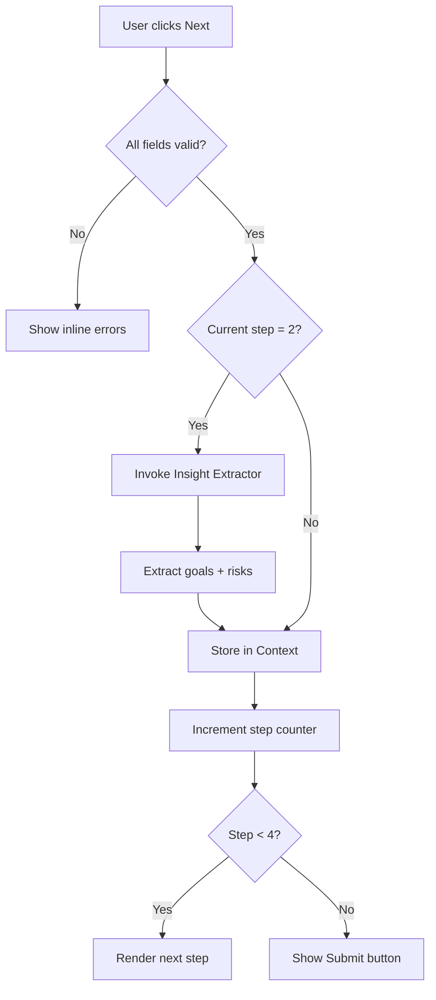
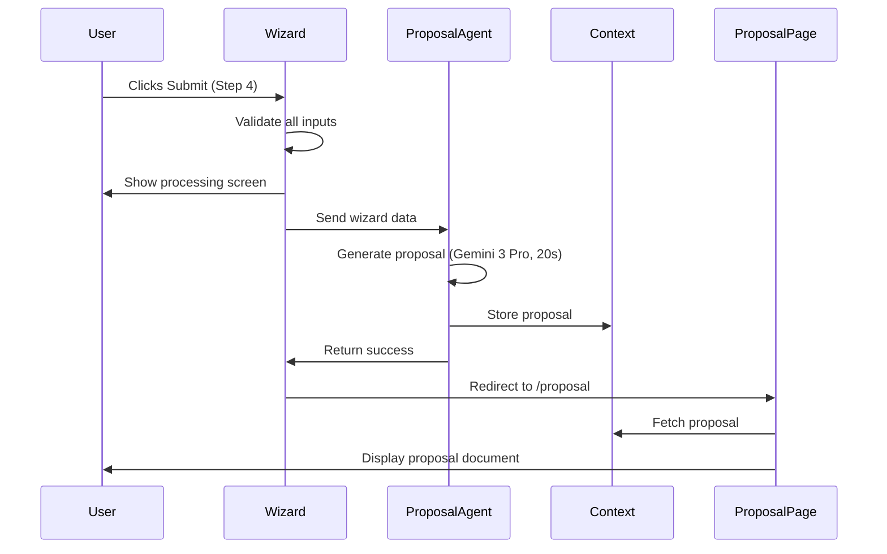

# Lead Capture Wizard — `/wizard`
## Purpose
- Captures structured lead data through a 4-step progressive form to feed AI proposal generation
- Serves prospects and potential clients entering the system for the first time

## Goals (5)
1. Collect complete lead information with 90%+ completion rate
2. Generate AI-powered proposal within 30 seconds of submission
3. Reduce data entry friction through smart defaults and contextual help
4. Extract hidden insights (goals, risks) from free-text responses using AI
5. Create seamless handoff to proposal view with zero manual processing

## Layout & Information Architecture

**Layout Type:** Single-column centered form (max-width 640px)

**Key Regions:**
- Header: Progress bar (4 steps) + Step indicator
- Primary content: Form fields (contextual per step)
- Secondary content: Help text, AI preview badges
- Actions: Back + Next buttons (bottom-right)

**Flow:**
Step 1 (Company) → Step 2 (Goals) → Step 3 (Services) → Step 4 (Contact) → Processing → Proposal

---

## Sections (UI Breakdown)

| Section | What's inside | Primary actions | States |
|---------|---------------|----------------|--------|
| **Progress Bar** | 4 circles, 1-4 numbered, connector lines | None (visual only) | Current step highlighted (indigo), completed (green), future (gray) |
| **Step Indicator** | "Step X of 4" text + step title | None | Updates per step |
| **Form Container** | 2-4 input fields per step, labels, help text | Text input, dropdowns, checkboxes | Empty → Filled → Validated → Error |
| **AI Badge** | "AI analyzing your response" (animated) | None | Hidden → Visible during AI extraction |
| **Navigation** | Back button (ghost), Next button (primary) | Navigate between steps | Disabled (incomplete) → Enabled (valid) |
| **Processing Screen** | Animated loader, "Thinking" message | None | Loading (15-30s) |

---

## Responsive Rules

**Desktop (≥1200px):**
- Form width: 640px (max), centered
- Full-size inputs (h-14)
- Side-by-side buttons (Back left, Next right)
- Progress bar: Horizontal with labels

**Tablet (768–1199px):**
- Form width: 90%, centered
- Input height: 56px (h-14)
- Buttons side-by-side
- Progress bar: Horizontal, smaller labels

**Mobile (<768px):**
- Form width: 100%, padding 24px
- Input height: 56px (touch-friendly)
- Buttons stacked vertically (Next top, Back bottom)
- Progress bar: Simplified dots only
- Font sizes reduced (24px → 18px titles)

**Touch Targets:**
- Inputs: Min 56px height
- Buttons: Min 48px height
- Checkboxes: 44px × 44px tap area

---

## Core Features (Must Ship)

1. ✅ **4-Step Progressive Disclosure**
   - Step 1: Company name + website
   - Step 2: Project goals + challenges
   - Step 3: Services + timeline + budget
   - Step 4: Contact info + preferences

2. ✅ **Real-Time Validation**
   - Required field indicators
   - Email format validation
   - URL format validation (website)
   - Inline error messages

3. ✅ **Progress Persistence**
   - Auto-save after each step
   - Store in Lead Context
   - Allow back navigation without data loss

4. ✅ **AI Insight Extraction**
   - Analyze goals (Step 2) → extract structured goals
   - Analyze challenges → identify risks
   - Show "AI analyzing" badge during processing

5. ✅ **Processing Animation**
   - Full-screen overlay after Step 4 submission
   - Animated "thinking" state
   - Expected time: 15-30 seconds
   - Message: "AI is generating your proposal..."

6. ✅ **Proposal Generation Trigger**
   - On Step 4 completion → invoke Proposal Generator Agent
   - Pass all wizard data to agent
   - Redirect to `/proposal` on success

7. ✅ **Smart Defaults**
   - Pre-fill known data (if returning user)
   - Default timeline: "Flexible"
   - Default contact method: "Email"

8. ✅ **Contextual Help**
   - Help text below each field
   - Example: "Enter your company website (e.g., acmecorp.com)"

9. ✅ **Keyboard Navigation**
   - Tab through fields
   - Enter to submit step
   - Esc to go back

10. ✅ **Error Recovery**
    - Show friendly error if AI fails
    - "Try again" button
    - Option to continue with manual proposal

---

## Advanced Features (V2+)

1. 🔮 **Multi-Language Support**
   - Detect browser language
   - Translate form labels and help text
   - AI processes in original language

2. 🔮 **Voice Input**
   - Microphone button on text fields
   - Speech-to-text for goals/challenges
   - Works on mobile

3. 🔮 **Smart Pre-Fill (URL Scraping)**
   - User enters website URL
   - AI scrapes company name, description, industry
   - Pre-fill fields automatically

4. 🔮 **Conditional Logic**
   - Skip irrelevant steps based on answers
   - Example: If "E-commerce" selected → Show e-commerce-specific questions

5. 🔮 **Progress Save & Resume**
   - Send magic link to email
   - Resume wizard from any device
   - 7-day expiration

6. 🔮 **Suggested Goals (Auto-Complete)**
   - As user types goals, show common suggestions
   - Click to select, saves typing

7. 🔮 **Budget Calculator**
   - Interactive slider for budget range
   - Show "typical projects at this budget" examples

8. 🔮 **Real-Time Preview**
   - Right sidebar shows proposal preview as user types
   - Updates in real-time

9. 🔮 **Social Proof**
   - Show "X companies completed this wizard today"
   - Display testimonials between steps

10. 🔮 **Analytics Tracking**
    - Track drop-off per step
    - Identify problematic fields
    - A/B test form variations

---

## Real-World Use Cases (3)

### Use Case 1: Real Estate Agency
**Scenario:** Agency PM needs to capture lead for new luxury property CRM project.

**Flow:**
- Opens wizard from landing page
- Step 1: Enters "Luxe Properties" + website
- Step 2: Selects goals: "Automate lead follow-up", "Integrate WhatsApp"
- Step 3: Selects services: "CRM", "WhatsApp Automation", Timeline: "1-2 months", Budget: "$25k-$50k"
- Step 4: Enters contact: "Maria Santos", email, phone
- Submits → AI generates proposal in 20 seconds
- Views proposal with timeline, phases, budget breakdown

**Result:** Complete lead captured in 4 minutes, proposal ready immediately, zero manual work.

### Use Case 2: Startup Founder
**Scenario:** Tech startup founder exploring CRM options, unsure of exact needs.

**Flow:**
- Step 1: Enters "TechCo Startup" + website
- Step 2: Types in free-form: "We need to scale sales but team is overwhelmed with manual data entry"
- AI extracts goals: "Scale sales operations", "Reduce manual work", "Improve team efficiency"
- Step 3: Unsure, selects multiple services, chooses "Flexible" timeline
- Step 4: Submits with email only
- Views proposal with 3 recommended phases

**Result:** AI interpreted vague input, suggested structured plan, founder sees clear path forward.

### Use Case 3: Marketing Agency (Returning User)
**Scenario:** Agency project manager returning to create proposal for new client.

**Flow:**
- Wizard pre-fills company name (saved from profile)
- Step 2: Quickly selects familiar goals
- Step 3: Changes timeline to "Urgent (1-2 weeks)"
- Step 4: Pre-filled contact, just submits
- Proposal ready in 15 seconds

**Result:** Repeat user completes wizard in <2 minutes due to smart defaults.

---

## User Journey (End-to-End)

1. **Trigger:** User clicks "Get Started" on landing page or receives direct link
2. User lands on `/wizard` (Step 1 visible)
3. Enters company name: "Acme Corp" (required)
4. Enters website: "acmecorp.com" (optional, validated)
5. Clicks "Next" → System validates → Redirects to Step 2
6. Sees goals checkboxes + free-text area
7. Checks 2 goals: "Automate lead follow-up", "Improve client experience"
8. Types in challenges: "Our team spends 10 hours/week on manual data entry"
9. AI badge appears: "AI analyzing your response..." (2-3 seconds)
10. AI extracts: Goals = ["Reduce manual work", "Scale operations"], Risks = ["Team capacity"]
11. Clicks "Next" → Step 3 visible
12. Selects services: "CRM", "AI Automation"
13. Selects timeline: "1-2 months"
14. Selects budget: "$25k-$50k"
15. Clicks "Next" → Step 4 visible
16. Enters name: "John Doe", email: "john@acmecorp.com", phone: "+1234567890"
17. Selects contact method: "Email"
18. Clicks "Submit" → Processing screen appears
19. System invokes Proposal Generator Agent with all wizard data
20. Agent processes for 20 seconds (Gemini 3 Pro thinking mode)
21. Proposal generated: Title, summary, 4 phases, timeline "8-10 weeks", budget "$25k-$37.5k"
22. System stores proposal in Lead Context
23. User redirected to `/proposal`
24. Proposal document displayed with "Download PDF" and "Accept Proposal" buttons

**Stored Outputs:**
- Lead data → Lead Context (all 4 steps)
- AI insights → Context (goals, risks)
- Proposal → Proposal Context
- Activity log → "Lead captured from Wizard"

---

## Workflows (2) — Mermaid Ready

### Workflow 1: Step Progression

**Trigger:** User clicks "Next" button

**Conditions:**
- All required fields completed
- Validation passed (email format, URL format)
- Current step < 4

**Actions:**
1. Validate current step inputs
2. If Step 2 with text: Invoke Insight Extractor Agent
3. Store step data in Lead Context
4. Increment step counter
5. Render next step UI
6. If Step 4: Show "Submit" button instead of "Next"

**Stored Outputs:**
- Step data → Lead Context
- Validation status → Local state
- AI insights (if Step 2) → Context

**Approval Gate:** None

**Mermaid Diagram:**


### Workflow 2: Proposal Generation

**Trigger:** User clicks "Submit" on Step 4

**Conditions:**
- All 4 steps completed
- Email format valid
- At least 1 goal and 1 service selected

**Actions:**
1. Show processing screen (full-screen overlay)
2. Compile all wizard data into single object
3. Invoke Proposal Generator Agent (Gemini 3 Pro)
4. Agent generates proposal document (15-30s)
5. Parse structured output (title, summary, phases, budget, timeline, deliverables)
6. Store proposal in Proposal Context
7. Store lead in Lead Context
8. Redirect user to `/proposal`
9. Log activity: "Proposal generated for [Company]"

**Stored Outputs:**
- Proposal document → Proposal Context
- Lead record → Lead Context
- Activity log entry → Activity feed

**Approval Gate:** None (auto-executes)

**Mermaid Diagram:**


---

## AI Agents & Logic

| Agent Type | When it runs | Inputs | Outputs | Where shown on screen |
|-----------|--------------|--------|---------|----------------------|
| **Insight Extractor** (Analyst) | Step 2 submission (if text entered) | User-entered goals and challenges (free text) | Structured goals list, identified risks, recommended next steps | AI badge during processing, results stored for proposal |
| **Proposal Generator** (Planner) | Step 4 submission (wizard completion) | All wizard data (company, goals, services, timeline, budget, contact) | Full proposal document (title, summary, phases, timeline, budget, deliverables) | Processing screen during generation, results on `/proposal` page |

---

## Automations

| Automation | Trigger | Condition | Action | Notification | Log |
|-----------|---------|-----------|--------|--------------|-----|
| **Auto-Save Progress** | Field blur (on exit) | Any field changed | Store field value in Lead Context | None | Silent |
| **Insight Extraction** | Step 2 next button | Text length > 20 characters | Invoke Insight Extractor Agent | AI badge shown | "AI extracted insights for [Company]" |
| **Proposal Generation** | Step 4 submit | All required fields valid | Invoke Proposal Generator Agent | Processing screen | "Proposal generated for [Company]" |
| **Lead Creation** | Proposal generated | Proposal stored successfully | Create lead record in CRM | Email to sales team (future) | "New lead: [Company]" |

---

## Gemini 3 Features Used

| Feature/Tool | Model (Pro/Flash) | Why here | Output format |
|-------------|-------------------|----------|---------------|
| **Text Generation** | Gemini 3 Pro | Generate complete, high-quality proposals | JSON (structured proposal object) |
| **Structured Outputs** | Gemini 3 Flash | Extract goals/risks from free text | JSON (goals array, risks array, nextStep string) |
| **Thinking Mode** | Gemini 3 Pro | Deep reasoning for complex proposals (8+ week projects) | Extended thinking before output |

**Example Prompt (Proposal Generator):**
```
Generate a professional project proposal for:
Company: [name]
Goals: [goals list]
Services: [services list]
Timeline: [preference]
Budget: [range]

Output JSON with: title, summary, phases (array of {name, duration, status}), timeline (string), budgetRange (string), deliverables (number), generatedDeliverables (array).
```

**Example Prompt (Insight Extractor):**
```
Analyze this client response and extract:
1. Explicit goals (array)
2. Implicit goals (read between lines)
3. Potential risks or challenges
4. Recommended next step

Input: "[user free text]"
Output JSON with: goals (array), risks (array), nextStep (string).
```

---

## Acceptance Checklist (Production-Ready UI)

**UI/UX:**
- [x] Empty states: Each step shows empty fields with help text
- [x] Loading states: Processing screen during AI generation
- [x] Error states: Inline validation errors + AI failure screen
- [x] Responsive: Works 320px → 1920px width
- [x] Touch targets: All inputs ≥56px, buttons ≥48px
- [x] Focus states: Blue outline on all interactive elements
- [x] Keyboard navigation: Tab order logical, Enter submits

**AI Integration:**
- [x] Agent inputs defined: Wizard data → Proposal Generator
- [x] Agent outputs defined: Proposal object → Context → Proposal page
- [x] Error handling: "Try again" button if AI fails
- [x] Fallback: Manual proposal option shown on failure
- [x] AI reasoning: Not displayed (happens in background)

**Data & Logic:**
- [x] Data sources: User input (wizard form)
- [x] Persistence: Lead Context (in-memory during session)
- [x] Validation rules: Required fields, email format, URL format
- [x] Audit trail: Activity log records "Lead captured" + "Proposal generated"
- [x] Export: Proposal downloadable as PDF (future)

**Performance:**
- [x] Page load: <1s (simple form)
- [x] AI response: 15-30s (acceptable for proposal generation)
- [x] Skeleton loaders: N/A (processing screen instead)
- [x] Optimistic UI: Step data saved immediately on change

**Accessibility:**
- [x] WCAG AA: Contrast verified (black text on white)
- [x] Screen reader: Labels on all inputs, ARIA labels on buttons
- [x] Keyboard navigation: Full keyboard support
- [x] Color contrast: All text meets 4.5:1 ratio
- [x] Alt text: N/A (no images in wizard)

**Additional Checks:**
- [x] Back button works without data loss
- [x] Progress bar reflects current step accurately
- [x] Help text clear and concise
- [x] Success state after submission (redirect to proposal)
- [x] Mobile experience optimized (stacked buttons, larger inputs)

---

**STATUS:** ✅ Production Ready (UI + AI Integration Complete)
