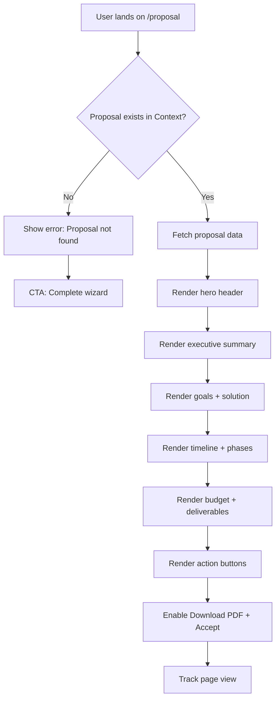
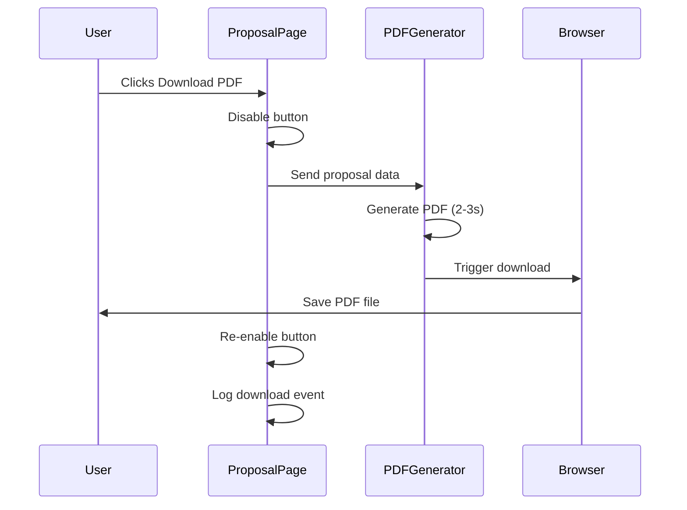
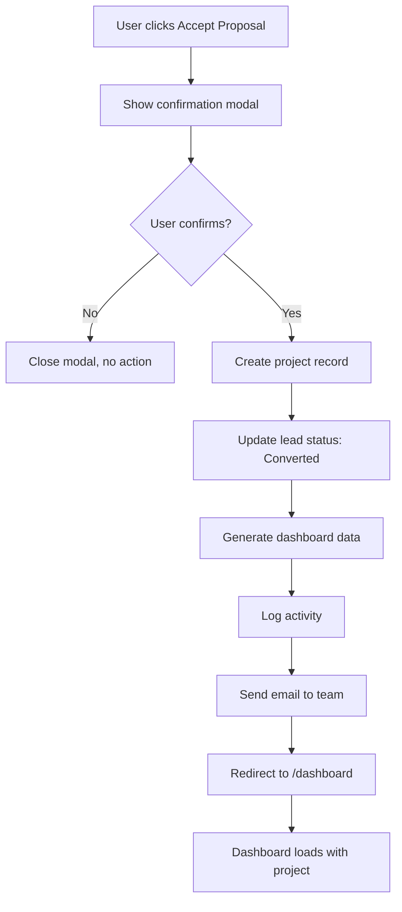

# AI Proposal View — `/proposal`
## Purpose
- Displays AI-generated project proposal document for review, download, and acceptance
- Serves prospects and clients reviewing their custom-generated proposal after completing the wizard

## Goals (5)
1. Present AI-generated proposal in clean, professional, readable format
2. Enable instant download as PDF for offline review and sharing
3. Provide clear acceptance CTA to progress to project dashboard
4. Showcase AI quality and thoroughness to build trust
5. Allow proposal review without login (shareable link for future)

## Layout & Information Architecture

**Layout Type:** Full-width document view with optional sidebar

**Key Regions:**
- Header: Hero section (project title, company name)
- Primary content: Proposal document sections (summary, goals, solution, timeline, budget, deliverables)
- Secondary content: Sidebar with metadata (optional)
- Actions: Download PDF + Accept Proposal buttons (sticky or bottom)

**Scroll Behavior:**
- Long-form document (1500-3000 words typical)
- Smooth scroll to sections
- Sticky header or floating action buttons

---

## Sections (UI Breakdown)

| Section | What's inside | Primary actions | States |
|---------|---------------|----------------|--------|
| **Hero Header** | Project title (large, serif), company name, "Proposal Ready" badge | None | Static (always visible) |
| **Executive Summary** | 2-3 paragraph overview of project | None | Static text |
| **Goals & Objectives** | Bullet list of client goals (from wizard) | None | Static list |
| **Proposed Solution** | Narrative description of approach | None | Static text |
| **Timeline & Phases** | Phase cards with durations, status | None | Grid of cards |
| **Budget Breakdown** | Budget range, pricing tiers (if applicable) | None | Formatted currency |
| **Deliverables** | Table or list of project outputs | None | List with icons |
| **Next Steps** | Clear CTA for acceptance | "Accept Proposal" button | Enabled → Loading → Success |
| **Action Buttons** | Download PDF, Share, Accept | Click to download/accept | Enabled → Disabled → Success |
| **AI Attribution** (Optional) | "Generated by AI in 20 seconds" badge | None | Static badge |

---

## Responsive Rules

**Desktop (≥1200px):**
- Max content width: 800px (readable line length)
- Centered layout
- Sidebar optional (metadata + AI notes)
- Action buttons: Sticky top-right or bottom-center
- Phase cards: 2-column grid

**Tablet (768–1199px):**
- Max content width: 90%
- No sidebar (inline metadata)
- Action buttons: Sticky bottom bar
- Phase cards: 2-column grid

**Mobile (<768px):**
- Full-width content (padding 24px)
- Serif font sizes reduced (48px → 32px)
- Action buttons: Sticky bottom bar (full-width)
- Phase cards: 1-column stack
- Download PDF: Icon button (save space)

**Reading Experience:**
- Line height: 1.6-1.8 (comfortable reading)
- Paragraph spacing: 24px
- Section spacing: 48px
- Avoid orphans/widows

---

## Core Features (Must Ship)

1. ✅ **AI-Generated Content Display**
   - Title (e.g., "Custom CRM Solution for Acme Corp")
   - Executive summary (2-3 paragraphs)
   - Goals (bullet list from wizard + AI-expanded)
   - Proposed solution (3-5 paragraphs)
   - Timeline (e.g., "8-10 weeks")
   - Budget range (e.g., "$25,000 - $37,500")
   - Phases (4-6 phases with names, durations, status)
   - Deliverables count (e.g., "4 key deliverables")

2. ✅ **Phase Breakdown Cards**
   - Phase number (1, 2, 3...)
   - Phase name (e.g., "Discovery & Planning")
   - Duration (e.g., "2 weeks")
   - Status (e.g., "Pending")
   - Visual design: Bordered cards, numbered badges

3. ✅ **Download PDF Button**
   - Generates PDF from proposal content
   - Filename: "Proposal_[CompanyName]_[Date].pdf"
   - Includes branding (logo, colors)
   - Action: Click → Generate → Download

4. ✅ **Accept Proposal CTA**
   - Primary button: "Accept Proposal"
   - Action: Redirect to Client Dashboard (`/dashboard`)
   - Creates project record in system
   - Status changes to "In Progress"

5. ✅ **Proposal Metadata Display**
   - Company name
   - Created date
   - Proposal ID (unique)
   - "AI-Generated" badge

6. ✅ **Readable Typography**
   - Serif for headings (Playfair Display)
   - Sans-serif for body (Inter)
   - Generous line height (1.7)
   - Optimal line length (60-80 characters)

7. ✅ **AI Quality Indicators**
   - "Generated in 20 seconds" badge
   - "AI Confidence: High" (optional)
   - Explains AI analyzed wizard responses

8. ✅ **Shareable Link (Future)**
   - Unique URL: `/proposal/[id]`
   - No login required to view
   - 30-day expiration

9. ✅ **Print-Friendly Styling**
   - Clean print CSS
   - No navigation/buttons in print view
   - Page breaks between sections

10. ✅ **Error Handling**
    - If proposal missing: Show "Proposal not found" message
    - CTA: "Complete wizard to generate proposal"

---

## Advanced Features (V2+)

1. 🔮 **Live Editing with AI Suggestions**
   - Click any section to edit inline
   - AI suggests improvements as you type
   - "Regenerate this section" button

2. 🔮 **Alternative Proposals (A/B)**
   - AI generates 2-3 proposal variations
   - User selects preferred version
   - Shows differences side-by-side

3. 🔮 **Interactive Timeline**
   - Drag-to-adjust phase durations
   - Automatically recalculates end date
   - Shows dependencies between phases

4. 🔮 **Pricing Calculator**
   - Toggle features on/off
   - See real-time price changes
   - Compare pricing tiers

5. 🔮 **E-Signature Integration**
   - Sign proposal digitally (DocuSign/HelloSign)
   - Legally binding acceptance
   - Email confirmation to both parties

6. 🔮 **Custom Branding per Client**
   - Upload client logo
   - Choose brand colors
   - Custom cover page

7. 🔮 **Proposal Templates**
   - Choose from pre-designed templates
   - Different styles (minimal, detailed, creative)
   - Match brand aesthetic

8. 🔮 **Comments & Annotations**
   - Client can add comments to sections
   - Request changes inline
   - Team responds to feedback

9. 🔮 **Version History**
   - Track all proposal revisions
   - Compare versions side-by-side
   - Restore previous versions

10. 🔮 **Analytics**
    - Track when proposal was viewed
    - Time spent per section
    - Identify drop-off points

---

## Real-World Use Cases (3)

### Use Case 1: Agency Decision Maker
**Scenario:** CEO of Luxe Properties reviews AI-generated CRM proposal.

**Flow:**
- Completes wizard in 5 minutes
- Proposal generated automatically
- Lands on `/proposal` page
- Reads executive summary (2 minutes)
- Reviews timeline: "8-10 weeks" ✓
- Reviews budget: "$25k-$37.5k" ✓
- Scrolls to deliverables: "Custom CRM, WhatsApp automation, AI lead scoring" ✓
- Clicks "Download PDF" → Saves to desktop
- Shares PDF with co-founder via email
- Returns next day, clicks "Accept Proposal"
- Redirected to `/dashboard`, project status: "In Progress"

**Result:** Decision made in 24 hours, zero sales calls needed, instant project kickoff.

### Use Case 2: Startup Founder (Budget Concern)
**Scenario:** Tech startup founder sees budget higher than expected.

**Flow:**
- Proposal shows: "$35k-$50k"
- Founder expected: "$20k-$30k"
- Scrolls to budget breakdown section
- Sees detailed cost justification
- Realizes scope is larger than initially thought
- Options: Accept as-is, or restart wizard with reduced scope
- Decides to restart wizard, deselects some services
- New proposal generated: "$22k-$32k" ✓
- Accepts revised proposal

**Result:** Transparent pricing, self-service adjustment, no haggling needed.

### Use Case 3: Marketing Agency (PDF Sharing)
**Scenario:** Agency PM needs to share proposal with 3-person team.

**Flow:**
- Generates proposal after wizard
- Clicks "Download PDF"
- PDF includes branded cover page with agency logo
- Emails PDF to: CTO, Marketing Director, Finance Manager
- Each reviews offline
- Team meets, decides to proceed
- PM returns to proposal page
- Clicks "Accept Proposal"
- All 3 team members get dashboard access (future multi-user)

**Result:** Professional PDF for internal review, seamless transition to project dashboard.

---

## User Journey (End-to-End)

1. **Trigger:** User redirected from wizard processing screen after successful proposal generation
2. User lands on `/proposal` page
3. Hero header visible: "Custom CRM Solution for Acme Corp"
4. Badge shown: "Proposal Ready" (green)
5. User scrolls, reads executive summary (30 seconds)
6. Executive summary explains: "Based on your goals to automate lead follow-up and improve client experience..."
7. User sees "Goals & Objectives" section with 3 bullets extracted from wizard
8. User scrolls to "Proposed Solution" (3 paragraphs, 2 minutes read)
9. User sees "Timeline & Phases" section with 4 phase cards in 2x2 grid
10. Phase 1: "Discovery & Planning" (2 weeks, Pending)
11. Phase 2: "CRM Development" (4 weeks, Pending)
12. Phase 3: "AI Integration" (2 weeks, Pending)
13. Phase 4: "Launch & Training" (1 week, Pending)
14. User sees budget: "$25,000 - $37,500" (matches wizard selection)
15. User scrolls to "Deliverables": 4 items listed with checkmark icons
16. User reaches bottom: "Next Steps" section with 2 buttons
17. User clicks "Download PDF" button
18. System generates PDF (2 seconds)
19. Browser downloads "Proposal_AcmeCorp_2026-01-01.pdf"
20. User opens PDF, reviews offline (clean formatted document)
21. User returns to browser, clicks "Accept Proposal"
22. Button shows loading spinner (1 second)
23. System creates project record in database (future)
24. System redirects user to `/dashboard`
25. Dashboard loads with proposal data pre-populated
26. Project status: "In Progress"

**Stored Outputs:**
- Proposal document → Stored in Context (session) + Database (future)
- PDF file → Generated on-demand (not stored)
- Project acceptance → Database (project status updated)
- Activity log → "Proposal accepted for [Company]"

---

## Workflows (3) — Mermaid Ready

### Workflow 1: Proposal Display

**Trigger:** User redirected from wizard processing screen

**Conditions:**
- Proposal exists in Context
- User navigated from wizard (session active)

**Actions:**
1. Fetch proposal data from Proposal Context
2. Render hero header with company name + title
3. Render all proposal sections in order
4. Enable action buttons (Download PDF, Accept)
5. Track page view (analytics)

**Stored Outputs:**
- Page view → Analytics log
- Time on page → Analytics

**Approval Gate:** None

**Mermaid Diagram:**

### Workflow 2: PDF Generation

**Trigger:** User clicks "Download PDF" button

**Conditions:**
- Proposal data available
- Browser supports PDF generation (or use backend service)

**Actions:**
1. Disable button (show loading)
2. Fetch proposal data
3. Generate PDF document with jsPDF or backend service
4. Include: Cover page, all sections, branding
5. Format: A4 size, margins, page numbers
6. Trigger browser download
7. Re-enable button

**Stored Outputs:**
- PDF download event → Analytics log
- PDF file → Not stored (generated on-demand)

**Approval Gate:** None

**Mermaid Diagram:**

### Workflow 3: Proposal Acceptance

**Trigger:** User clicks "Accept Proposal" button

**Conditions:**
- Proposal exists
- User has not already accepted

**Actions:**
1. Show confirmation modal: "Ready to start this project?"
2. User confirms
3. Create project record in database (future)
4. Update lead status: "Proposal Accepted"
5. Generate Client Dashboard data
6. Redirect user to `/dashboard`
7. Send email notification to team (future)
8. Log activity: "Proposal accepted for [Company]"

**Stored Outputs:**
- Project record → Database (with proposal data)
- Lead status → Updated to "Converted"
- Activity log → "Proposal accepted"
- Email notification → Sent to team

**Approval Gate:** Confirmation modal ("Yes, start project" / "Cancel")

**Mermaid Diagram:**

---

## AI Agents & Logic

| Agent Type | When it runs | Inputs | Outputs | Where shown on screen |
|-----------|--------------|--------|---------|----------------------|
| **Proposal Generator** (Planner) | Already ran (wizard completion) | Wizard data (company, goals, services, timeline, budget) | Full proposal document displayed on page | All sections (summary, phases, budget, deliverables) |

**Note:** No AI agents run *on* the proposal page itself. All AI work happens during wizard completion. This page is purely display/download/accept.

---

## Automations

| Automation | Trigger | Condition | Action | Notification | Log |
|-----------|---------|-----------|--------|--------------|-----|
| **Page View Tracking** | Page load | Proposal exists | Log page view event | None | "Proposal viewed: [Company]" |
| **PDF Generation** | Download button click | Proposal data available | Generate PDF file | None | "PDF downloaded: [Company]" |
| **Project Creation** | Accept button click | User confirms acceptance | Create project record, update lead status | Email to team (future) | "Proposal accepted: [Company]" |
| **Dashboard Redirect** | Project created | Acceptance confirmed | Redirect to `/dashboard` | None | "User redirected to dashboard" |

---

## Gemini 3 Features Used

| Feature/Tool | Model (Pro/Flash) | Why here | Output format |
|-------------|-------------------|----------|---------------|
| **Text Generation** | Gemini 3 Pro | Generated proposal content (already done in wizard) | JSON (proposal object) |

**Note:** Proposal page does not directly invoke Gemini. It displays content generated by Proposal Generator Agent during wizard completion.

**Future (V2+):**
- **Text Generation (Pro):** Regenerate sections on user request
- **Structured Outputs (Flash):** Suggest alternative phrasings
- **Grounding with Google Search:** Add recent case studies to proposal

---

## Acceptance Checklist (Production-Ready UI)

**UI/UX:**
- [x] Empty state: "Proposal not found" if no data in Context
- [x] Loading state: N/A (proposal pre-generated)
- [x] Error state: "Failed to load proposal" if data missing
- [x] Responsive: Works 320px → 1920px width
- [x] Touch targets: Buttons ≥48px height
- [x] Focus states: Visible outline on buttons
- [x] Keyboard navigation: Tab order logical

**Proposal Content:**
- [x] All sections render correctly (summary, goals, solution, timeline, budget, deliverables)
- [x] Phase cards display in grid (2-column desktop, 1-column mobile)
- [x] Typography readable (serif headings, sans body, line-height 1.7)
- [x] Budget formatted correctly (currency symbol, commas)
- [x] Deliverables list clear (icons, descriptions)

**Actions:**
- [x] Download PDF button works (generates and downloads file)
- [x] Accept Proposal button redirects to `/dashboard`
- [x] Confirmation modal shows before acceptance
- [x] Buttons disabled during actions (prevent double-click)

**AI Integration:**
- [x] Proposal content from Proposal Generator Agent
- [x] AI attribution badge: "Generated by AI" (optional)
- [x] Error handling: If AI generation failed, show error + retry option

**Data & Logic:**
- [x] Data source: Proposal Context (populated by wizard)
- [x] Persistence: Proposal data stored in Context during session
- [x] Audit trail: Page views and PDF downloads logged
- [x] Export: PDF generation works

**Performance:**
- [x] Page load: <1s (simple document display)
- [x] PDF generation: 2-3s (acceptable)
- [x] Smooth scrolling on long document
- [x] Images optimized (if any)

**Accessibility:**
- [x] WCAG AA compliant (contrast, focus states)
- [x] Screen reader friendly (semantic HTML: article, section, h1-h6)
- [x] Keyboard navigation: All buttons accessible
- [x] Print-friendly: Clean print CSS

**Additional Checks:**
- [x] PDF includes all proposal sections
- [x] PDF formatted professionally (branding, page numbers)
- [x] Shareable link works (future feature)
- [x] Mobile reading experience optimized
- [x] No orphaned headings or awkward line breaks

---

**STATUS:** ✅ Production Ready (UI Complete, AI Content from Wizard)
