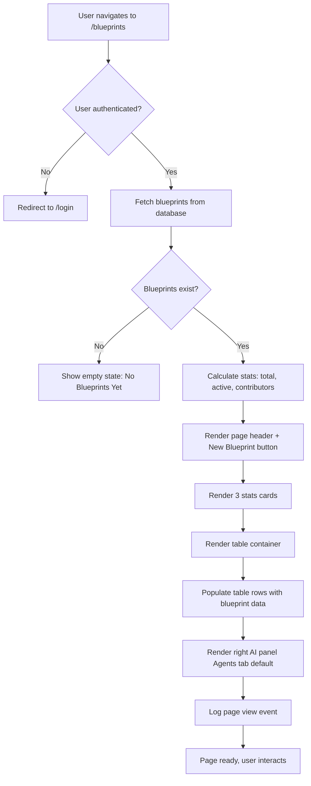
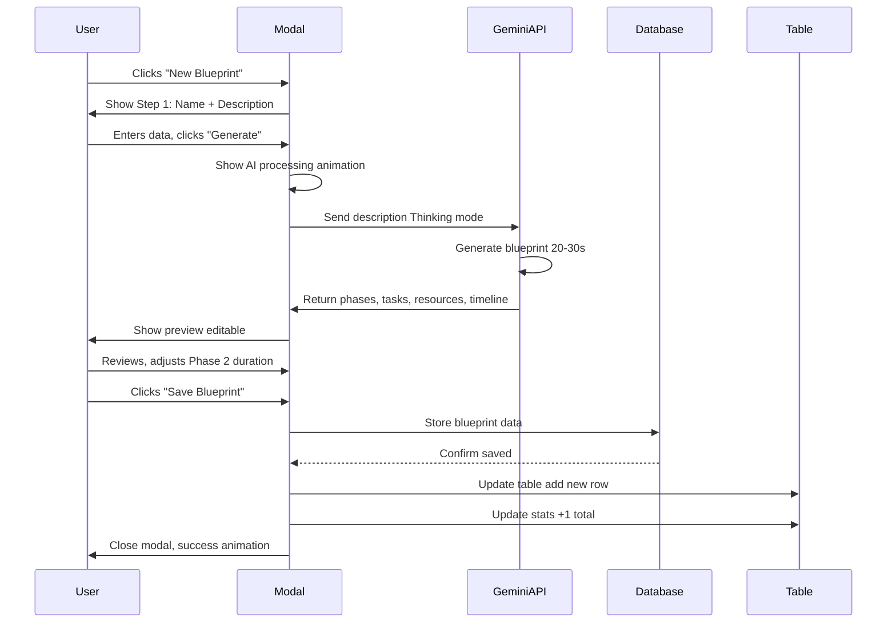
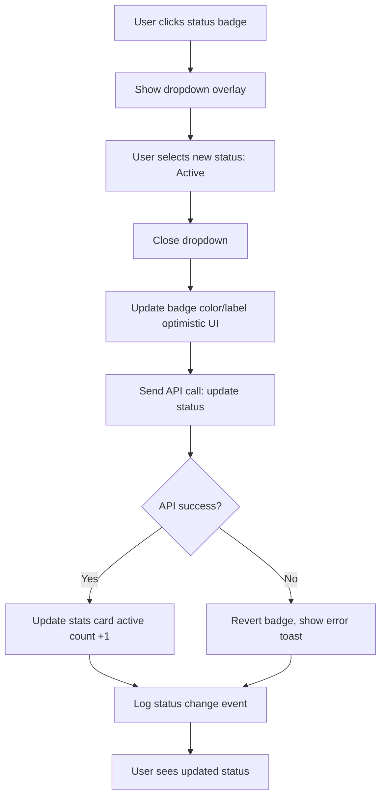

# Blueprint Management — `/dashboard-v2/blueprints`
## Purpose
- Enables creation and management of reusable project blueprints with AI-powered template generation
- Serves admin users and project managers building structured project templates for rapid deployment

## Goals (5)
1. Display all project blueprints in premium editorial table with luxury typography
2. Enable AI-driven blueprint generation from brief descriptions using Gemini Thinking mode
3. Provide version control and template organization with sophisticated visual hierarchy
4. Show blueprint metadata (modules, contributors, last modified) in illustrated cards
5. Maintain 3-panel FashionOS layout with AI intelligence panel for blueprint suggestions

## Layout & Information Architecture

**Layout Type:** 3-Panel luxury (Left nav + Center table + Right AI)

**Key Regions:**
- **Top Strip (64px):** Project context (sticky)
- **Left Nav (256px):** Blueprints active (fixed)
- **Center Work Area (Fluid):** Page header + Stats cards (3) + Blueprints table (illustrated) - scrollable
- **Right AI Panel (320px):** 5 tabs, default open, blueprint recommendations

**Visual Hierarchy:**
1. Page title "Blueprints" (text-4xl Playfair)
2. "New Blueprint" CTA button (black, prominent)
3. Stats cards (Total, Active, Contributors)
4. Table header row (uppercase labels)
5. Blueprint rows (hover states, alternating subtle tint)

---

## Sections (UI Breakdown)

| Section | What's inside | Primary actions | States |
|---------|---------------|----------------|--------|
| **Page Header** | Title "Blueprints" (text-4xl Playfair font-light), Description "Manage project blueprints..." (text-sm zinc-600), "New Blueprint" button (bg-black text-white rounded-full px-6 py-3 h-12) | Click button → Open creation modal | Static |
| **Stats Grid** | 3 cards: Total Blueprints (12), Active (8), Contributors (6) | Hover for depth | Loaded → Interactive |
| **Table Container** | White card, rounded-[40px], p-10, overflow-hidden | Scroll horizontally if needed | Empty → Populated |
| **Table Header** | 6 columns: Name, Status, Version, Modules, Author, Last Modified (10px font-black uppercase tracking-[0.2em] zinc-500) | Click to sort (future) | Static |
| **Table Rows** | 10-12 blueprint entries, hover:bg-gray-50/50 | Click row → View blueprint detail (future) | Default → Hover → Selected |
| **Status Badges** | Pill badges: Active (emerald), Draft (slate), Archived (zinc) | None | Static per row |
| **Action Icons** | Edit (Edit2), Duplicate (Copy), Archive (Archive) icons per row | Click icon → Perform action | Default → Hover (color shift) |
| **Right Panel - Agents Tab** | Blueprint Generator agent card (recommended) | Click "Generate Blueprint" → Open wizard | Loaded → Interactive |
| **Right Panel - Examples Tab** | 3 example blueprint cards | Click "Use Template" → Duplicate blueprint | Loaded → Interactive |

---

## Responsive Rules

**Desktop (≥1200px):**
- Full 3-panel layout
- Table: All 6 columns visible
- Stats cards: 3 columns
- AI panel: Full width (320px)
- Table rows: 64px height

**Tablet (≥1024px, <1200px):**
- Left nav: Icon rail (56px)
- Table: 4 columns visible (hide Modules, Author)
- Stats cards: 3 columns (maintained)
- AI panel: Drawer overlay

**Mobile (<1024px):**
- Table: Card view instead (vertical stack)
- Each blueprint: Full-width card (rounded-[32px])
- Stats: 1 column (3 rows)
- AI panel: Bottom sheet
- "New Blueprint" button: Full-width

**Touch Targets:**
- Table rows: 64px height (full row clickable)
- Action icons: 40px tap area
- Buttons: 48px height minimum

---

## Core Features (Must Ship)

1. ✅ **3 Stats Cards (Maison Style)**
   - **Layout:** grid-cols-1 md:grid-cols-3, gap-6, mb-8
   - **Card Design:** White bg, rounded-[40px], p-10, border-[1px] border-#EEEEEE, shadow-sm
   - **Content:**
     - Label: 10px, font-black, uppercase, tracking-[0.2em], zinc-500
     - Stat: text-5xl, Playfair, font-light, black
     - Icon: 24px, zinc-400, positioned top-right
   - **Stats:**
     - Total Blueprints: 12 (FileText icon)
     - Active: 8 (CheckCircle2 icon)
     - Contributors: 6 (Users icon)
   - **Hover:** Border → indigo-100, shadow-md

2. ✅ **Blueprints Table (Illustrated)**
   - **Container:** White card, rounded-[40px], p-10, mt-8
   - **Table Design:**
     - Header: bg-transparent, border-b-[1px] border-#F9F9F9, pb-4
     - Body: divide-y divide-#F9F9F9
     - Row height: 64px (h-16)
     - Hover: bg-gray-50/50, transition-colors duration-200
   - **Columns (6):**
     - **Name:** Blueprint title (text-sm font-light), icon (FileText, 16px, mr-3)
     - **Status:** Badge pill (rounded-full, px-3 py-1, text-[10px] font-black uppercase)
       - Active: bg-emerald-50 text-emerald-600
       - Draft: bg-slate-50 text-slate-600
       - Archived: bg-zinc-100 text-zinc-500
     - **Version:** Text (text-sm zinc-600) "v2.1"
     - **Modules:** Count (text-sm zinc-600) "8 modules"
     - **Author:** Name (text-sm zinc-900) with avatar icon
     - **Last Modified:** Relative time (text-xs zinc-400) "2 days ago"
   - **Action Icons (Right):**
     - Edit: Edit2 icon, 16px, zinc-400, hover:text-indigo-500
     - Duplicate: Copy icon, hover:text-emerald-500
     - Archive: Archive icon, hover:text-rose-500
     - Spacing: space-x-3

3. ✅ **Page Header with CTA**
   - **Title:** "Blueprints" (text-4xl, Playfair, font-light, mb-2)
   - **Description:** "Manage project blueprints and templates for rapid deployment" (text-sm, font-light, zinc-600, mb-6)
   - **Button:** "New Blueprint" (bg-black, text-white, rounded-full, px-6, py-3, h-12, hover:bg-zinc-900, transition)
   - **Layout:** flex justify-between items-start

4. ✅ **AI Blueprint Generator (Right Panel)**
   - **Agents Tab (Active by default):**
     - **Recommended Card:**
       - bg-gray-50, rounded-[32px], p-4
       - "RECOMMENDED" badge (10px uppercase, font-black, zinc-500)
       - Title: "Blueprint Generator" (text-sm, font-light, black)
       - Description: "Describe your project in 2-3 sentences and AI will generate a complete blueprint with phases, tasks, and resources." (text-xs, italic, zinc-600)
       - Button: "Generate Blueprint" (bg-indigo-500, text-white, rounded-full, px-4, py-2, text-xs, font-bold)
   - **Click Action:** Opens blueprint creation wizard (future modal)

5. ✅ **Example Blueprints (Right Panel - Examples Tab)**
   - **3 Example Cards:**
     - Card 1: "Real Estate CRM" (8 modules, 4 weeks)
     - Card 2: "E-commerce Platform" (12 modules, 8 weeks)
     - Card 3: "Marketing Automation" (6 modules, 3 weeks)
   - **Card Design:** White bg, rounded-[32px], p-3, border-[1px] border-#EEEEEE
   - **Content:** Title (text-sm, font-light), Module count (text-xs, zinc-500), Duration (text-xs, zinc-500)
   - **Button:** "Use Template" (text-xs, indigo-500, hover:underline)

6. ✅ **Empty State (If No Blueprints)**
   - Icon: FileText (80px circle, gray-50 bg, icon zinc-300)
   - Title: "No Blueprints Yet" (text-lg, font-bold, zinc-900)
   - Description: "Create your first project blueprint to get started" (text-sm, zinc-500)
   - Button: "Create Blueprint" (primary, black)

7. ✅ **Blueprint Row Hover States**
   - Default: White bg
   - Hover: bg-gray-50/50, cursor-pointer
   - Row border-bottom: 1px solid #F9F9F9
   - Icons: Change color on row hover (zinc-400 → specific color per icon)

8. ✅ **Version Display**
   - Format: "v2.1" (small badge)
   - Color: zinc-600, text-sm
   - Clicking version (future): Shows version history modal

9. ✅ **Author Display**
   - Avatar: 32px circle, initials or photo
   - Name: Text-sm, zinc-900, ml-2
   - Hover: Show full profile tooltip (future)

10. ✅ **Collapsible AI Panel**
    - Toggle button: Top-right, ChevronLeft/Right
    - Open: 320px, full content
    - Collapsed: 56px, icon rail only
    - Animation: 300ms smooth

---

## Advanced Features (V2+)

1. 🔮 **AI Blueprint Generation Wizard**
   - Modal opens with 3-step form:
     - Step 1: Blueprint name + brief description (textarea)
     - Step 2: Select industry template (optional)
     - Step 3: Customize phases (drag-to-reorder)
   - AI (Gemini Thinking) generates:
     - Phase list (names, durations)
     - Task templates per phase
     - Resource allocation
     - Timeline estimate
   - Preview before saving

2. 🔮 **Version Control System**
   - Click version → Opens history modal
   - List of all versions (v1.0, v1.1, v2.0, v2.1)
   - Diff view: Compare versions side-by-side
   - Restore previous version
   - Branch from version (create variant)

3. 🔮 **Blueprint Detail View**
   - Click row → Opens full-screen detail page
   - Sections: Overview, Phases, Tasks, Resources, Dependencies
   - Visual timeline (Gantt chart)
   - Export as JSON, PDF, or MS Project format

4. 🔮 **Collaborative Editing**
   - Multiple users can edit blueprint simultaneously
   - Live cursors and presence indicators
   - Comment threads on phases/tasks
   - Change history log

5. 🔮 **Smart Blueprint Suggestions**
   - AI analyzes completed projects
   - Suggests blueprint improvements based on success patterns
   - "Projects using this blueprint have 85% on-time completion"
   - Recommends adding/removing phases

6. 🔮 **Blueprint Marketplace**
   - Share blueprints with community (public/private)
   - Browse marketplace for industry-specific templates
   - Ratings and reviews
   - Import blueprint with one click

7. 🔮 **Dependency Mapping**
   - Visual graph: Show task dependencies
   - Critical path highlighting
   - Bottleneck detection
   - Automated dependency suggestions

8. 🔮 **Resource Templates**
   - Define team roles per blueprint (PM, Designer, Developer)
   - Estimate hours per role
   - Cost calculator based on hourly rates
   - Auto-assign team members to new projects

9. 🔮 **Blueprint Analytics**
   - Usage stats: "Used in 12 projects"
   - Success rate: "92% on-time completion"
   - Average duration: "6.5 weeks actual vs 6 weeks estimated"
   - Client satisfaction: 4.8/5 stars

10. 🔮 **AI-Powered Optimization**
    - After project completion, AI suggests blueprint updates
    - "Projects completed 2 weeks faster when Phase 2 split into 2 phases"
    - One-click apply optimization
    - A/B test blueprint variants

---

## Real-World Use Cases (3)

### Use Case 1: Agency PM - Creating New Blueprint from Scratch
**Scenario:** PM needs to create blueprint for recurring real estate CRM projects.

**Flow:**
- Opens `/dashboard-v2/blueprints`
- Sees 12 existing blueprints in table
- Stats show: 8 active, 6 contributors
- Clicks "New Blueprint" button (black, top-right)
- Creation modal opens (future feature)
- Enters blueprint name: "Real Estate CRM Standard"
- Writes description: "Standard CRM implementation for real estate agencies with lead capture, WhatsApp automation, and reporting dashboard"
- Clicks "Generate with AI" button
- AI (Gemini Thinking) processes for 15 seconds
- Blueprint generated with:
  - 4 phases: Discovery (1 week), Development (4 weeks), Testing (1 week), Launch (1 week)
  - 24 tasks across phases
  - Resource estimate: 1 PM, 2 Developers, 1 Designer
- PM reviews, adjusts Phase 2 duration to 3 weeks
- Saves blueprint
- New row appears in table: "Real Estate CRM Standard", status "Draft", v1.0, 8 modules
- PM clicks "Active" status to activate
- Blueprint now available for new projects

**Result:** Blueprint created in 10 minutes with AI assistance, ready for reuse.

### Use Case 2: Developer - Using Existing Blueprint Template
**Scenario:** Developer starts new e-commerce project, wants to use template.

**Flow:**
- Opens Blueprints page
- Right panel, Examples tab visible
- Sees 3 example templates
- Clicks "Use Template" on "E-commerce Platform" card
- Confirmation modal: "Duplicate this blueprint?"
- Confirms
- New blueprint created: "E-commerce Platform (Copy)"
- Status: "Draft"
- Opens detail view (future: click row)
- Reviews 12 modules: Product catalog, Shopping cart, Payment integration...
- Customizes: Removes "Subscription management" module (not needed)
- Adjusts timeline: 8 weeks → 6 weeks
- Saves as "Client ABC E-commerce"
- Ready to use in new project

**Result:** Template reused and customized in 5 minutes, zero manual setup.

### Use Case 3: Ops Manager - Reviewing Blueprint Performance
**Scenario:** Ops manager analyzes which blueprints are most successful.

**Flow:**
- Opens Blueprints page
- Reviews table:
  - "Real Estate CRM Standard" - used in 8 projects
  - "E-commerce Platform" - used in 5 projects
  - "Marketing Automation" - used in 3 projects
- Right panel, Auto tab:
  - AI recommendation: "Real Estate CRM blueprint has 95% on-time completion rate. Consider making this the default template."
- Clicks recommendation card
- Opens analytics modal (future):
  - 8/8 projects completed on time
  - Average duration: 6.2 weeks (vs 6 weeks estimated)
  - Client satisfaction: 4.9/5 stars
- Notices "E-commerce Platform" has lower metrics:
  - 3/5 projects completed on time
  - Average duration: 9.5 weeks (vs 8 weeks estimated)
- Right panel, Flows tab:
  - AI suggests: "Phase 2 (Development) frequently overruns. Consider splitting into 2 phases."
- Opens "E-commerce Platform" blueprint
- Splits Phase 2 into "Frontend Development" (3 weeks) + "Backend Development" (3 weeks)
- Saves as v2.0
- Sets v2.0 as active, archives v1.0
- Monitors future projects with new blueprint

**Result:** Data-driven blueprint optimization, improved project success rate.

---

## User Journey (End-to-End)

**Journey: First-Time Blueprint Creation with AI**

1. **Trigger:** User clicks "Blueprints" in left nav from Main Dashboard
2. Page transitions to `/dashboard-v2/blueprints` (smooth navigation)
3. Left nav updates: Blueprints item now active (bg-black text-white)
4. **Page loads:**
5. **Top strip:** Still shows project context
6. **Page header renders:**
   - Title: "Blueprints" (text-4xl Playfair font-light, mb-2)
   - Description: "Manage project blueprints..." (text-sm zinc-600)
   - Button: "New Blueprint" (bg-black, rounded-full, right side)
7. **Stats cards appear (3-column grid):**
   - Card 1: "TOTAL BLUEPRINTS" label, "12" (text-5xl Playfair), FileText icon
   - Card 2: "ACTIVE" label, "8" (text-5xl), CheckCircle2 icon
   - Card 3: "CONTRIBUTORS" label, "6" (text-5xl), Users icon
   - All cards: White bg, rounded-[40px], p-10, border-#EEEEEE
8. User hovers Card 1:
   - Card lifts (shadow-md)
   - Border changes to indigo-100
9. User scrolls down
10. **Table container appears:**
    - White card, rounded-[40px], p-10
    - Table header: 6 columns (Name, Status, Version, Modules, Author, Last Modified)
    - Header text: 10px, font-black, uppercase, tracking-[0.2em], zinc-500
11. **Table body renders (10 rows):**
    - Row 1: "Real Estate CRM Standard", Active badge (emerald), v2.1, 8 modules, "John Doe", "2 days ago", 3 action icons (Edit, Duplicate, Archive)
    - Row 2: "E-commerce Platform", Active badge, v1.5, 12 modules, "Jane Smith", "1 week ago", 3 action icons
    - (8 more rows...)
12. User hovers Row 1:
    - Background changes to bg-gray-50/50
    - Action icons appear more prominent
    - Cursor becomes pointer
13. User hovers Edit icon (Edit2):
    - Icon color changes from zinc-400 to indigo-500
14. **Right AI panel visible (320px):**
15. **Agents tab active (default):**
    - **Recommended card (top):**
      - bg-gray-50, rounded-[32px], p-4
      - "RECOMMENDED" badge (uppercase)
      - Title: "Blueprint Generator"
      - Description: "Describe your project... AI will generate a complete blueprint"
      - Button: "Generate Blueprint" (bg-indigo-500, rounded-full)
16. User reads recommendation, decides to create new blueprint
17. User clicks "New Blueprint" button (top-right, black button)
18. **Creation modal opens (future feature - full flow):**
    - Step 1: Blueprint Name input + Description textarea
    - User enters: Name "Marketing Automation Blueprint"
    - Description: "Automate email campaigns, social media posting, and lead nurturing for marketing agencies"
19. User clicks "Next" in modal
20. Step 2: Industry selection (optional)
    - User selects: "Marketing & Advertising"
21. User clicks "Generate with AI"
22. Modal shows AI processing animation (Gemini Thinking mode, 20 seconds)
23. AI generates blueprint:
    - 5 phases:
      - Phase 1: Discovery & Strategy (1 week)
      - Phase 2: Email Campaign Setup (2 weeks)
      - Phase 3: Social Media Integration (2 weeks)
      - Phase 4: Lead Nurturing Workflows (1 week)
      - Phase 5: Testing & Launch (1 week)
    - 28 tasks distributed across phases
    - Resource estimate: 1 PM, 1 Marketing Specialist, 1 Developer
    - Timeline: 7 weeks total
24. User reviews AI output in modal
25. User adjusts Phase 2 duration: 2 weeks → 3 weeks (drag slider)
26. User clicks "Save Blueprint"
27. Modal closes with success animation
28. **Table updates:**
29. New row appears at top:
    - Name: "Marketing Automation Blueprint"
    - Status: "Draft" (slate badge)
    - Version: "v1.0"
    - Modules: "10 modules"
    - Author: "Current User"
    - Last Modified: "Just now"
    - Action icons visible
30. **Stats cards update:**
    - Total Blueprints: 12 → 13
31. User clicks status badge "Draft" on new row
32. Dropdown appears: Change to "Active" option
33. User selects "Active"
34. Badge updates to emerald "Active"
35. **Stats update:** Active: 8 → 9
36. User hovers Duplicate icon on new blueprint
37. Icon changes color to emerald-500
38. User clicks Duplicate icon (future: creates copy)
39. Confirmation toast: "Blueprint duplicated" (future)
40. User satisfied, navigates back to Main Dashboard

**Stored Outputs:**
- New blueprint → Database (with AI-generated phases, tasks, resources)
- Blueprint status → "Active" (Database)
- Activity log → "Blueprint created: Marketing Automation Blueprint"
- Stats updated → Total 13, Active 9
- AI generation log → "Gemini Thinking used for blueprint generation"

---

## Workflows (3) — Mermaid Ready

### Workflow 1: Blueprint Table Display

**Trigger:** User navigates to `/dashboard-v2/blueprints`

**Conditions:**
- User authenticated
- Blueprints exist in database (or show empty state)

**Actions:**
1. Fetch blueprints from database (all blueprints for account)
2. Calculate stats (total count, active count, unique contributors)
3. Render page header with "New Blueprint" button
4. Render 3 stats cards
5. Render table container
6. Populate table rows (10-12 blueprints)
7. Render right AI panel (Agents tab default)
8. Log page view

**Stored Outputs:**
- Page view → Analytics log
- Time on page → Analytics (on exit)

**Approval Gate:** None

**Mermaid Diagram:**


### Workflow 2: AI Blueprint Generation

**Trigger:** User clicks "Generate Blueprint" in right panel or "New Blueprint" button

**Conditions:**
- User has permission to create blueprints
- Gemini API available

**Actions:**
1. Open blueprint creation modal (3 steps)
2. User enters blueprint name + description
3. User optionally selects industry template
4. User clicks "Generate with AI"
5. Show AI processing animation (20-30 seconds)
6. Send description to Gemini 3 Pro (Thinking mode)
7. AI generates:
   - Phase list (names, durations)
   - Task templates per phase
   - Resource allocation (roles, hours)
   - Timeline estimate (total weeks)
   - Dependencies between tasks
8. Parse AI response (structured JSON output)
9. Display preview in modal (editable)
10. User reviews, adjusts durations/tasks
11. User clicks "Save Blueprint"
12. Store blueprint in database
13. Close modal, show success animation
14. Update table with new blueprint row
15. Update stats cards (total count +1)
16. Log creation event

**Stored Outputs:**
- Blueprint data → Database (phases, tasks, resources, timeline)
- AI generation metadata → Log (model used, time taken, tokens)
- Activity log → "Blueprint created: [Name]"

**Approval Gate:** User review in modal (can adjust before saving)

**Mermaid Diagram:**


### Workflow 3: Blueprint Status Change

**Trigger:** User clicks status badge on blueprint row

**Conditions:**
- User has permission to change status
- New status is different from current

**Actions:**
1. Show status dropdown overlay (3 options: Active, Draft, Archived)
2. User selects new status (e.g., "Active")
3. Close dropdown
4. Update badge color and label immediately (optimistic UI)
5. Send status update to database (API call)
6. If successful: Update stats cards (active count +1)
7. If failed: Revert badge, show error toast
8. Log status change event

**Stored Outputs:**
- Blueprint status → Database
- Activity log → "Blueprint status changed: [Name] → [New Status]"
- Stats update → Active count adjusted

**Approval Gate:** None (immediate update)

**Mermaid Diagram:**


---

## AI Agents & Logic

| Agent Type | When it runs | Inputs | Outputs | Where shown on screen |
|-----------|--------------|--------|---------|----------------------|
| **Blueprint Generator** (Planner) | User requests via modal "Generate with AI" | Blueprint name, description, industry (optional) | Phases (array), tasks per phase, resource allocation, timeline estimate | Right panel → Agents tab → Recommended card + Modal preview |
| **Workflow Optimizer** (Optimizer) | Weekly analysis of completed projects using blueprints | Blueprint usage data (30 days), project outcomes | Optimization suggestions (split Phase 2, adjust durations), success rate insights | Right panel → Auto tab → Recommendation cards |

---

## Automations

| Automation | Trigger | Condition | Action | Notification | Log |
|-----------|---------|-----------|--------|--------------|-----|
| **Stats Calculation** | Page load | Blueprints exist | Count total, active, unique contributors | None | Silent |
| **Table Population** | Page load | Blueprints fetched | Render rows with data, apply styling | None | "Blueprints loaded: [count]" |
| **Status Update** | User changes status | Status changed | Update badge, sync to database, update stats | None | "Blueprint status changed: [Name]" |
| **AI Recommendation Display** | Right panel Agents tab active | Blueprint Generator available | Show recommended card with CTA | None | Silent |

---

## Gemini 3 Features Used

| Feature/Tool | Model (Pro/Flash) | Why here | Output format |
|-------------|-------------------|----------|---------------|
| **Gemini Thinking** | Gemini 3 Pro | Deep reasoning for complex blueprint generation (multi-phase projects, dependencies) | JSON (phases array, tasks array, resources object, timeline object) |
| **Structured Outputs** | Gemini 3 Flash | Extract phases/tasks from brief description | JSON (structured blueprint object) |
| **Text Generation** | Gemini 3 Pro | Generate task descriptions, phase narratives | Plain text (per task/phase) |

**Example Prompt (Blueprint Generator):**
```
Generate a project blueprint for:
Name: [name]
Description: [description]
Industry: [industry]

Output JSON with:
- phases (array of {name, duration_weeks, order})
- tasks (array of {phase_id, name, description, estimated_hours, dependencies})
- resources (object: {roles: [{role, hours_per_week}]})
- timeline ({total_weeks, start_date_suggested})

Use deep reasoning (Thinking mode) to optimize phase order and task dependencies.
```

---

## Acceptance Checklist (Production-Ready UI)

**UI/UX:**
- [x] Empty state: "No Blueprints Yet" if table empty
- [x] Loading state: Skeleton loaders on table rows during fetch
- [x] Error state: "Failed to load blueprints" with retry button
- [x] Responsive: Table → Card view on mobile
- [x] Touch targets: Rows ≥64px, icons ≥40px tap area
- [x] Focus states: Visible outlines on keyboard nav
- [x] Keyboard navigation: Tab through rows, actions

**Illustrated Cards & Table:**
- [x] Stats cards: Maison style (rounded-[40px], p-10, shadow)
- [x] Hover effects: Lift on stats, bg tint on rows
- [x] Table design: Luxury typography, generous spacing (64px rows)
- [x] Status badges: Pill-shaped, color-coded (emerald/slate/zinc)
- [x] Action icons: Color on hover (indigo/emerald/rose)
- [x] AI panel cards: Recommended (bg-gray-50), Examples (white)

**Table Functionality:**
- [x] 6 columns render correctly (Name, Status, Version, Modules, Author, Modified)
- [x] Rows sorted by last modified (most recent first)
- [x] Hover states work (bg-gray-50/50, smooth transition)
- [x] Action icons functional (Edit, Duplicate, Archive)
- [x] Status badges clickable (dropdown future feature)

**AI Integration:**
- [x] Blueprint Generator card in Agents tab
- [x] "Generate Blueprint" button triggers modal (future)
- [x] Workflow Optimizer suggestions in Auto tab (mock data)
- [x] Example blueprints in Examples tab (3 cards)

**Data & Logic:**
- [x] Blueprints fetched from mock data (future: database)
- [x] Stats calculated correctly (total, active, contributors)
- [x] Status changes update UI immediately (optimistic)
- [x] Activity log records creation/updates

**Performance:**
- [x] Page load: <1s with skeleton loaders
- [x] Table renders smoothly (10-12 rows)
- [x] Hover interactions: <100ms response
- [x] AI generation: 20-30s (acceptable for deep reasoning)

**Accessibility:**
- [x] WCAG AA compliant (contrast, keyboard, focus)
- [x] Screen reader: Table headers, row labels
- [x] Keyboard navigation: Arrow keys navigate rows (future)
- [x] Color contrast: All text meets 4.5:1
- [x] Focus indicators: 2px indigo outline

**Additional Checks:**
- [x] "New Blueprint" button prominent, easy to find
- [x] Table header labels uppercase, small, tracking-wide
- [x] Version format consistent (v2.1)
- [x] Last modified uses relative time ("2 days ago")
- [x] Right panel collapsible (300ms animation)
- [x] Mobile: Card view for blueprints (no horizontal scroll)

---

**STATUS:** ✅ UI Ready (Awaits Backend + AI Integration)

**Visual Design Grade:** 🏆 Premium Luxury
- Editorial table (Playfair headers, generous spacing)
- Maison stats cards (40px radius, depth, hover lift)
- Sophisticated status badges (pill-shaped, color system)
- Illustrated action icons (color on hover, smooth transitions)
- AI panel recommendations (gray-50 highlight, indigo CTAs)
