```mermaid
flowchart TD
    A[User marks task complete on Tasks page] --> B[Task status: To Do → Done]
    B --> C[Database updates task record]
    C --> D[Backend calculates new project completion %]
    D --> E[New % = completed tasks +1 / total tasks × 100]
    E --> F{Page refresh or WebSocket?}
    F -->|WebSocket future| G[Send real-time update event]
    F -->|Page refresh| H[User refreshes Projects page]
    G --> I[Projects page receives update]
    H --> I
    I --> J[Identify project card to update]
    J --> K[Animate progress bar width: 45% → 47%]
    K --> L[Duration 500ms ease-out]
    L --> M[Update task count text: 23/51 → 24/51]
    M --> N[Update percentage: 45% → 47%]
    N --> O{New % >= 76%?}
    O -->|Yes| P[Change color: indigo-500 → emerald-500]
    O -->|No| Q[Keep indigo-500]
    P --> R[Log progress update event]
    Q --> R
```

# Project Tracking — `/dashboard-v2/projects`
## Purpose
- Displays all active projects in elegant illustrated cards with progress visualization and AI-powered completion predictions
- Serves admin users and team members monitoring portfolio health with executive-grade luxury design

## Goals (5)
1. Visualize project health through illustrated progress cards with Playfair typography and generous whitespace
2. Provide predictive insights (completion estimates, risk alerts) via AI Sentiment Monitor in right panel
3. Enable quick project navigation with hover interactions and depth effects
4. Show team composition, task progress, and milestone tracking in premium card layout
5. Maintain 3-panel FashionOS architecture with collapsible AI intelligence panel

## Layout & Information Architecture

**Layout Type:** 3-Panel luxury (Left nav + Center cards + Right AI)

**Key Regions:**
- **Top Strip (64px):** Project context, sticky
- **Left Nav (256px):** Projects active, fixed
- **Center Work Area (Fluid):** Page header + Stats cards (3) + Project cards (vertical stack) - scrollable
- **Right AI Panel (320px):** 5 tabs, collapsed by default on this page for focus

**Visual Hierarchy:**
1. Page title "Projects" (text-4xl Playfair)
2. Stats cards row (Total, Avg Completion, Next Milestone)
3. Project cards (largest elements, illustrated with depth)
4. Progress bars within cards (visual prominence)
5. Team avatars and task counts (supporting details)

---

## Sections (UI Breakdown)

| Section | What's inside | Primary actions | States |
|---------|---------------|----------------|--------|
| **Page Header** | Title "Projects" (text-4xl Playfair font-light), Description "Track all active projects..." (text-sm zinc-600), "New Project" button (bg-black rounded-full) | Click button → Create project modal (future) | Static |
| **Stats Grid** | 3 cards: Total Projects (3), Avg Completion (27%), Next Milestone (Phase 1 Done, Dec 30) | Hover for depth | Loaded → Interactive |
| **Project Cards Container** | Vertical stack of project cards (space-y-6) | Scroll to see all projects | Empty → Populated |
| **Project Card** | Illustrated card (rounded-[40px], p-10, white bg, border, shadow): Project name (text-xl Playfair), Progress bar (h-2 bg-indigo-500), Task count (12/45 completed), Team avatars (3-5), Due date (Calendar icon) | Click card → Project detail (future), Hover for lift | Default → Hover → Selected |
| **Progress Bar** | Visual indicator: bg-gray-50 base, indigo-500 fill, rounded-full, h-2, animated width | None (visual only) | 0% → 100% |
| **Task Count Display** | Text: "12/45 tasks completed" (text-sm zinc-600), Percentage "27%" (text-xs zinc-400) | None | Updates with progress |
| **Team Avatars** | 3-5 circle avatars (32px), overlapping (-ml-2), border-2 border-white | Hover → Show names tooltip (future) | Static display |
| **Due Date Badge** | Calendar icon + "Due Dec 30" text (text-xs zinc-500) | None | Static or urgent (red) |
| **Right Panel - Agents Tab** | Sentiment Monitor card: "3 projects at risk" (recommended card) | Click "Review Risks" → Show risk details | Loaded → Interactive |
| **Right Panel - Journeys Tab** | Common project journey visualization | None (informational) | Static display |

---

## Responsive Rules

**Desktop (≥1200px):**
- Full 3-panel layout
- Stats: 3 columns
- Project cards: Full width (max 800px centered)
- AI panel: Collapsed by default (56px, user can expand)
- Card padding: p-10 (40px)

**Tablet (≥1024px, <1200px):**
- Left nav: Icon rail (56px)
- Stats: 3 columns (maintained)
- Project cards: Full width
- AI panel: Drawer overlay
- Card padding: p-8 (32px)

**Mobile (<1024px):**
- Stats: 1 column (3 rows)
- Project cards: Full width, p-6 (24px)
- Progress bars: Full width
- Team avatars: Max 3 visible, "+2" indicator
- Due dates: Below project name (stacked)

**Touch Targets:**
- Project cards: Full card clickable (min 160px height)
- "New Project" button: 48px height
- Stats cards: 48px minimum touch area

---

## Core Features (Must Ship)

1. ✅ **3 Stats Cards (Maison Style)**
   - **Layout:** grid-cols-1 md:grid-cols-3, gap-6, mb-8
   - **Card Design:** White bg, rounded-[40px], p-10, border-[1px] border-#EEEEEE, shadow-sm
   - **Content:**
     - Label: 10px, font-black, uppercase, tracking-[0.2em], zinc-500
     - Stat: text-5xl, Playfair, font-light, black
     - Supporting text: text-xs, italic, zinc-400
   - **Stats:**
     - **Total Projects:** 3 (FolderKanban icon)
     - **Avg Completion:** 27% (TrendingUp icon, "Across all projects")
     - **Next Milestone:** "Phase 1 Done" (Calendar icon, "Due Dec 30")
   - **Hover:** Border → indigo-100, shadow-md, lift effect

2. ✅ **Illustrated Project Cards (Vertical Stack)**
   - **Container:** space-y-6, max-w-4xl mx-auto
   - **Card Design:**
     - White bg, rounded-[40px], p-10, border-[1px] border-#EEEEEE, shadow-sm
     - Height: Auto (min 200px)
     - Hover: shadow-lg, border-indigo-100, translateY(-2px), transition 200ms
   - **Card Content (Per Project):**
     - **Project Name:** text-xl, Playfair, font-light, black, mb-2
     - **Progress Bar (Visual Focus):**
       - Container: w-full, h-2, bg-gray-50, rounded-full, mb-4, overflow-hidden
       - Fill: h-full, bg-indigo-500, rounded-full, animated width (transition 500ms)
       - Width: Based on completion % (e.g., 27% → width: 27%)
     - **Stats Row (Flex):**
       - Left: Task count "12/45 tasks completed" (text-sm zinc-600)
       - Right: Percentage "27%" (text-xs zinc-400)
     - **Team Row (Flex, items-center, justify-between, mt-4):**
       - Left: Team avatars (overlapping circles, 32px, border-2 white)
       - Right: Due date badge (Calendar icon, text-xs zinc-500, "Due Dec 30")
     - **Optional Risk Badge (If AI flags):**
       - "At Risk" badge (rose-100 bg, rose-600 text, text-[10px] uppercase, rounded-full, px-3 py-1)
       - Position: Top-right of card

3. ✅ **Progress Bar Visualization**
   - **Design System:**
     - Track: bg-gray-50 (light neutral base)
     - Fill: bg-indigo-500 (AI accent color)
     - Height: h-2 (8px, substantial but not overwhelming)
     - Border radius: rounded-full (pill shape)
     - Animation: transition-all duration-500 ease-out
   - **Color Logic:**
     - 0-25%: indigo-500 (starting)
     - 26-75%: indigo-500 (on track)
     - 76-99%: emerald-500 (nearly complete)
     - 100%: emerald-600 (complete, darker green)
   - **Accessibility:** aria-label="Project progress: 27%"

4. ✅ **Team Avatar Display**
   - **Layout:** flex, -space-x-2 (overlapping)
   - **Avatar Design:**
     - Size: 32px circle (w-8 h-8)
     - Border: 2px solid white (prevents overlap visual clash)
     - Background: Random color per user (bg-indigo-100, bg-emerald-100, etc.)
     - Content: User initials (text-xs font-bold) or profile photo
   - **Max Display:** Show 4 avatars, then "+X" circle for remaining
   - **Hover (Future):** Tooltip with full names
   - **Fallback:** If no team, show "Unassigned" text (zinc-400)

5. ✅ **Due Date Display**
   - **Icon:** Calendar (16px, zinc-400)
   - **Text:** "Due Dec 30" (text-xs, zinc-500)
   - **Logic:**
     - If due < 7 days: Text becomes rose-600, icon rose-500, "Due in 3 days"
     - If overdue: Text rose-600 bold, "Overdue by 2 days"
     - If on time: zinc-500 (neutral)
   - **Position:** Right side of team row, flex-shrink-0

6. ✅ **Risk Badge (AI-Powered)**
   - **Trigger:** Sentiment Monitor agent flags project
   - **Design:** rose-100 bg, rose-600 text, rounded-full, px-3 py-1, text-[10px] font-black uppercase
   - **Text:** "AT RISK"
   - **Position:** Absolute top-right of card (top-4 right-4)
   - **Icon:** AlertTriangle (16px, rose-500) inside badge
   - **Hover:** Show tooltip with risk reason (future)

7. ✅ **Empty State (If No Projects)**
   - **Icon:** FolderKanban (80px circle, gray-50 bg, icon zinc-300)
   - **Title:** "No Projects Yet" (text-lg font-bold zinc-900)
   - **Description:** "Create your first project to start tracking progress" (text-sm zinc-500)
   - **Button:** "Create Project" (bg-black, text-white, rounded-full, px-6 py-3)

8. ✅ **Page Header with CTA**
   - **Title:** "Projects" (text-4xl Playfair font-light mb-2)
   - **Description:** "Track all active projects and monitor team progress" (text-sm font-light zinc-600 mb-6)
   - **Button:** "New Project" (bg-black text-white rounded-full px-6 py-3 h-12 hover:bg-zinc-900)
   - **Layout:** flex justify-between items-start

9. ✅ **Project Card Hover Interaction**
   - **Default State:** shadow-sm, border-#EEEEEE
   - **Hover State:**
     - shadow-lg (deeper shadow)
     - border-indigo-100 (subtle color shift)
     - translateY(-2px) (lift effect)
     - scale-[1.005] (subtle grow)
     - cursor-pointer
     - transition-all duration-200 ease-out
   - **Click (Future):** Navigate to project detail page

10. ✅ **AI Panel Recommendations**
    - **Default State:** Collapsed (56px icon rail)
    - **User can expand:** Click ChevronRight button
    - **Agents Tab Content:**
      - Sentiment Monitor card (recommended, gray-50 bg)
      - "3 projects flagged for risk" (text-sm font-light)
      - "Review Risks" button (indigo-500, rounded-full)
    - **Journeys Tab Content:**
      - Common project lifecycle flowchart
      - "Most projects follow: Planning → Dev → Testing → Launch"

---

## Advanced Features (V2+)

1. 🔮 **Predictive Completion Dates**
   - AI analyzes task velocity (tasks completed per week)
   - Predicts actual completion date vs planned
   - Shows: "Projected: Jan 15 (5 days late)" in amber text
   - Updates daily as tasks complete

2. 🔮 **Project Health Score**
   - AI calculates 0-100 health score based on:
     - Task completion rate
     - Team engagement (activity logs)
     - Client sentiment (communication analysis)
     - Budget tracking (spend vs allocated)
   - Display: Circle progress chart (100 = emerald, <50 = rose)

3. 🔮 **Interactive Gantt Chart View**
   - Toggle between Card view ↔ Gantt view
   - Gantt shows all projects on timeline
   - Drag bars to adjust dates
   - Dependencies shown as arrows

4. 🔮 **Filtered Project Views**
   - Filter pills: All, Active, On Hold, Completed, At Risk
   - Active pill: bg-black text-white
   - Click pill → Filter cards instantly
   - Show count: "Active (3)"

5. 🔮 **Project Templates**
   - "Create from Template" button
   - Select blueprint → Instant project creation
   - Pre-filled phases, tasks, team assignments

6. 🔮 **Budget Tracking (Per Card)**
   - Show: "$12,500 / $25,000" (spent / budget)
   - Progress bar (similar to task progress)
   - Color: Green if under budget, amber if 90%+, red if over

7. 🔮 **Milestone Visualization**
   - Timeline dots below progress bar
   - 4-5 milestones per project
   - Current milestone highlighted (indigo dot)
   - Completed milestones: checkmark (emerald)
   - Future milestones: gray dot

8. 🔮 **Client Satisfaction Indicator**
   - Star rating (1-5 stars) from AI sentiment analysis
   - Based on: Email tone, response time, feedback
   - Shown in card header with star icons

9. 🔮 **Drag-to-Reorder Projects**
   - User can drag cards to prioritize
   - Reorder saved to user preferences
   - Visual feedback: Card lifts, others shift

10. 🔮 **Export Project Summary**
    - "Export" button per card
    - Generate PDF with:
      - Project overview
      - Task list with status
      - Team roster
      - Timeline chart
    - Download or email to client

---

## Real-World Use Cases (3)

### Use Case 1: Agency Owner - Weekly Portfolio Review
**Scenario:** CEO reviews all projects every Monday morning to assess health.

**Flow:**
- Opens `/dashboard-v2/projects` from left nav
- Page loads with 3 project cards visible
- **Stats cards show:**
  - Total Projects: 3
  - Avg Completion: 27% (lower than expected)
  - Next Milestone: "Phase 1 Done, Due Dec 30" (3 days away)
- **Project Card 1: "Real Estate CRM for Luxe Properties"**
  - Progress bar: 45% filled (indigo-500)
  - Tasks: 23/51 completed
  - Team: 4 avatars (John, Maria, Sarah, Alex)
  - Due: Jan 15, 2026 (on track)
  - No risk badge
- **Project Card 2: "E-commerce Platform for Fashion Boutique"**
  - Progress bar: 15% filled (indigo-500, behind)
  - Tasks: 8/52 completed
  - Team: 3 avatars
  - Due: Jan 20, 2026
  - **Risk badge:** "AT RISK" (rose-100, top-right)
- CEO hovers Card 2 → Card lifts, shadow deepens
- Notices low completion (15%) + risk badge
- Expands AI panel (clicks ChevronRight)
- **Agents tab shows:**
  - Sentiment Monitor card (recommended)
  - "Fashion Boutique project flagged: Client sent 3 urgent emails, no responses in 48 hours"
  - Button: "Review Risks"
- CEO clicks "Review Risks" → Opens risk detail modal (future)
- Takes action: Messages team lead to prioritize client communication
- **Project Card 3: "Marketing Automation for Agency XYZ"**
  - Progress bar: 22% filled
  - Tasks: 11/50 completed
  - Team: 5 avatars
  - Due: Feb 5, 2026 (on track)
- CEO satisfied with Card 1 and 3, concerned about Card 2
- Makes note to check in on Fashion Boutique project tomorrow

**Result:** 5-minute review identified at-risk project, proactive intervention planned.

### Use Case 2: Project Manager - Daily Task Progress Check
**Scenario:** PM checks projects after lunch to see task progress.

**Flow:**
- Opens Projects page (already bookmarked)
- Sees Real Estate CRM card
- Progress bar has moved: 40% → 45% (since morning)
- Tasks updated: 20/51 → 23/51 (3 tasks completed today)
- Team avatars: Sarah's avatar now has green dot (online indicator, future)
- Hovers over progress bar → Tooltip shows "23 of 51 tasks (45%)" (future)
- Scrolls to Fashion Boutique card
- Progress unchanged: 15% (8/52 tasks)
- Notices risk badge still present
- Checks Due date: Jan 20 (26 days away, but behind schedule)
- Clicks expand AI panel
- Agents tab: "Recommend assigning 2 more developers to catch up"
- PM decides to reassign Jane from Marketing Automation to Fashion Boutique
- (Future: Click team avatars → Add/remove team members)
- Returns to main dashboard to message team

**Result:** Real-time progress visible, daily adjustments possible.

### Use Case 3: Team Member - Checking Next Milestone
**Scenario:** Developer wants to know what milestone is coming up.

**Flow:**
- Opens Projects page
- Stats card shows: "Next Milestone: Phase 1 Done, Due Dec 30"
- 3 days away, need to finish Phase 1 tasks
- Clicks Real Estate CRM card (future: opens detail view)
- (Currently: Card just has hover effect)
- Sees tasks: 23/51 completed
- Needs to complete 28 more tasks for Phase 1 (51 total, 23 done, ~28 in Phase 1)
- Mental calculation: 28 tasks / 3 days = ~9 tasks per day
- Team has 4 people, so ~2-3 tasks per person per day
- Feels achievable
- Navigates to Tasks page (clicks Tasks in left nav)
- Filters by: Project = "Real Estate CRM", Phase = "Phase 1", Status = "To Do"
- Sees list of remaining Phase 1 tasks
- Picks next 3 tasks to work on today

**Result:** Clear milestone visibility drives daily planning.

---

## User Journey (End-to-End)

**Journey: First Visit to Projects Page from Main Dashboard**

1. **Trigger:** User clicks "Projects" in left nav
2. Navigation animates: Main (active) → Projects (active)
3. Page transitions to `/dashboard-v2/projects`
4. **Page loads (smooth fade-in):**
5. **Top strip:** Project context unchanged (sticky)
6. **Left nav:** Projects item now bg-black text-white (active)
7. **Page header renders:**
   - Title: "Projects" (text-4xl Playfair font-light)
   - Description: "Track all active projects..." (text-sm zinc-600)
   - Button: "New Project" (bg-black, top-right)
8. **Stats grid appears (3 cards):**
   - Card 1: "TOTAL PROJECTS" label, "3" stat (text-5xl Playfair)
   - Card 2: "AVG COMPLETION" label, "27%" stat, "Across all projects" note
   - Card 3: "NEXT MILESTONE" label, "Phase 1 Done" stat, "Due Dec 30" note
9. User hovers Card 2 (Avg Completion):
   - Card lifts (shadow-md)
   - Border changes to indigo-100
   - Transition smooth (200ms)
10. User scrolls down (smooth scroll)
11. **Project cards appear (3 cards, vertical stack):**
12. **Card 1: Real Estate CRM**
    - White bg, rounded-[40px], p-10, border-#EEEEEE, shadow-sm
    - Project name: "Real Estate CRM for Luxe Properties" (text-xl Playfair)
    - Progress bar:
      - Container: w-full h-2 bg-gray-50 rounded-full
      - Fill: w-[45%] h-full bg-indigo-500 rounded-full
      - Animated width (transition 500ms ease-out)
    - Stats row:
      - Left: "23/51 tasks completed" (text-sm zinc-600)
      - Right: "45%" (text-xs zinc-400)
    - Team row:
      - Left: 4 avatars overlapping (32px circles, border-2 white)
        - Avatar 1: "JD" (John Doe, bg-indigo-100)
        - Avatar 2: "MS" (Maria Santos, bg-emerald-100)
        - Avatar 3: "SK" (Sarah Kim, bg-amber-100)
        - Avatar 4: "AT" (Alex Taylor, bg-purple-100)
      - Right: Calendar icon + "Due Jan 15" (text-xs zinc-500)
13. User hovers Card 1:
    - Shadow increases to shadow-lg
    - Card lifts: translateY(-2px)
    - Border changes to indigo-100
    - Cursor becomes pointer
    - Transition: 200ms ease-out
14. User moves cursor away:
    - Card returns to default state (smooth transition back)
15. User scrolls to Card 2
16. **Card 2: Fashion Boutique E-commerce**
    - Project name: "E-commerce Platform for Fashion Boutique"
    - **Risk badge visible (top-right):**
      - "AT RISK" text (rose-600)
      - AlertTriangle icon (rose-500)
      - bg-rose-100, rounded-full, px-3 py-1
    - Progress bar: 15% filled (w-[15%], bg-indigo-500)
    - Stats: "8/52 tasks completed", "15%"
    - Team: 3 avatars
    - Due: "Due Jan 20" (zinc-500, on time but behind progress)
17. User notices risk badge, concerned
18. User clicks chevron button on right panel (currently collapsed at 56px)
19. AI panel expands to 320px (300ms animation)
20. **Right panel Agents tab (active):**
21. **Sentiment Monitor card (recommended):**
    - bg-gray-50, rounded-[32px], p-4
    - "RECOMMENDED" badge (uppercase)
    - Title: "Sentiment Monitor Alert" (text-sm font-light)
    - Description: "Fashion Boutique project flagged: Client sent 3 urgent emails, no team responses in 48 hours. Risk of churn." (text-xs italic zinc-600)
    - Button: "Review Risks" (bg-indigo-500, text-white, rounded-full, px-4 py-2)
22. User reads recommendation, understands urgency
23. User clicks "Review Risks" button
24. (Future: Opens modal with detailed risk analysis)
25. Currently: Logs click event, shows toast "Feature coming soon"
26. User returns focus to cards
27. User scrolls to Card 3
28. **Card 3: Marketing Automation**
    - Project name: "Marketing Automation for Agency XYZ"
    - Progress bar: 22% filled
    - Stats: "11/50 tasks completed", "22%"
    - Team: 5 avatars (4 visible + "+1" indicator)
    - Due: "Due Feb 5" (zinc-500, on track)
    - No risk badge
29. User hovers Card 3: Lift effect applies
30. User decides to create new project
31. User scrolls to top (smooth scroll)
32. User clicks "New Project" button (bg-black, top-right)
33. (Future: Opens project creation wizard modal)
34. Currently: Logs click event, shows toast "Feature coming soon"
35. User satisfied with project overview
36. User collapses AI panel (clicks ChevronLeft)
37. Panel animates to 56px (300ms)
38. User navigates to Tasks page (clicks Tasks in left nav)

**Stored Outputs:**
- Page view → Analytics log "Projects page viewed"
- Card hovers → Analytics log "Card hovered: [Project name]" (aggregated)
- AI panel expand/collapse → User preference → Local storage
- Button clicks → Analytics log "New Project clicked", "Review Risks clicked"
- Time on page → Analytics (on exit)

---

## Workflows (3) — Mermaid Ready

### Workflow 1: Projects Page Load

**Trigger:** User navigates to `/dashboard-v2/projects`

**Conditions:**
- User authenticated
- Projects exist in database (or show empty state)

**Actions:**
1. Fetch all projects from database
2. For each project, calculate:
   - Completion % (completed tasks / total tasks)
   - Team member list (unique users assigned to tasks)
   - Due date status (on time, due soon, overdue)
   - Risk flags (from Sentiment Monitor agent)
3. Calculate aggregate stats:
   - Total project count
   - Average completion % across all projects
   - Next upcoming milestone (earliest due date)
4. Render page header with "New Project" button
5. Render 3 stats cards
6. Render project cards (sorted by: at-risk first, then by due date)
7. For each card:
   - Render project name
   - Render progress bar (animated width based on completion %)
   - Render task count
   - Render team avatars (max 4, then +X)
   - Render due date badge
   - If risk flag: Render risk badge
8. Render right AI panel (collapsed by default)
9. Log page view

**Stored Outputs:**
- Page view → Analytics log
- Projects loaded → Cache (for faster subsequent loads)
- AI risk flags → Shown in panel recommendations

**Approval Gate:** None

**Mermaid Diagram:**


### Workflow 2: AI Risk Detection & Display

**Trigger:** Sentiment Monitor agent runs (scheduled or on new communication)

**Conditions:**
- Project has recent client communications (emails, WhatsApp, calls)
- Sentiment analysis threshold crossed (negative sentiment or urgency detected)

**Actions:**
1. Sentiment Monitor agent analyzes communication logs
2. Detects patterns:
   - 3+ urgent emails from client in 48 hours
   - No team responses within 48 hours
   - Negative sentiment score < -0.5 (on scale -1.0 to +1.0)
   - Keywords: "urgent", "frustrated", "disappointed", "concerned"
3. Agent flags project as "At Risk"
4. Creates risk record in database:
   - Project ID
   - Risk type: "Client Communication"
   - Severity: "High"
   - Description: "Client sent 3 urgent emails, no responses in 48 hours"
   - Detected at: Timestamp
5. When Projects page loads, fetch risk flags
6. If project has risk flag: Display "AT RISK" badge on card
7. In AI panel (Agents tab): Show Sentiment Monitor recommendation card
8. Card content:
   - Title: "Sentiment Monitor Alert"
   - Description: Risk details
   - Button: "Review Risks"
9. Log risk detection event

**Stored Outputs:**
- Risk flag → Database (project_risks table)
- Risk badge → Displayed on project card
- AI recommendation → Shown in right panel
- Activity log → "Project flagged at risk: [Project name]"

**Approval Gate:** None (agent runs automatically, displays alert)

**Mermaid Diagram:**


### Workflow 3: Progress Bar Update (Real-Time)

**Trigger:** Task marked complete on Tasks page

**Conditions:**
- Task belongs to a project
- Project is displayed on current Projects page (user is viewing)

**Actions:**
1. User completes task on Tasks page (checkmark clicked)
2. Task status updates: "To Do" → "Done"
3. Database updates task record
4. Backend calculates new project completion %:
   - Completed tasks count +1
   - New %: (completed tasks / total tasks) × 100
5. Backend sends update via WebSocket (future) or page refresh
6. Projects page receives update event
7. Identify project card to update
8. Animate progress bar:
   - From: Current width (e.g., 45%)
   - To: New width (e.g., 47%)
   - Duration: 500ms, ease-out
9. Update task count text: "23/51" → "24/51"
10. Update percentage: "45%" → "47%"
11. If new % crosses threshold (e.g., 75% → 76%):
    - Change progress bar color: indigo-500 → emerald-500
12. Log progress update event

**Stored Outputs:**
- Project completion % → Database (updated)
- Task count → Updated on card
- Progress bar → Animated to new width
- Activity log → "Project progress updated: [Project] now 47%"

**Approval Gate:** None (automatic update)

**Mermaid Diagram:**


---

## AI Agents & Logic

| Agent Type | When it runs | Inputs | Outputs | Where shown on screen |
|-----------|--------------|--------|---------|----------------------|
| **Sentiment Monitor** (Analyst) | Real-time on new communications OR scheduled (hourly) | Project communication logs (emails, WhatsApp, calls, chat) | Risk flags (project_id, severity, reason), sentiment scores (-1.0 to +1.0) | Project card → "AT RISK" badge (top-right) + Right panel → Agents tab → Sentiment Monitor card |
| **Workflow Optimizer** (Optimizer) | Weekly analysis | Project completion data (velocity, blockers, timeline) | Predictive completion dates, optimization suggestions | Right panel → Auto tab → "Project likely to finish 5 days late" card |

---

## Automations

| Automation | Trigger | Condition | Action | Notification | Log |
|-----------|---------|-----------|--------|--------------|-----|
| **Stats Calculation** | Page load | Projects exist | Calculate total, avg completion, next milestone | None | Silent |
| **Project Cards Render** | Page load | Projects fetched | Loop projects, render cards with progress bars | None | "Projects loaded: [count]" |
| **Risk Badge Display** | Page load | Project has risk flag | Render "AT RISK" badge on card | None | Silent |
| **Progress Bar Animation** | Card render | Completion % calculated | Animate bar width from 0% to actual % over 500ms | None | Silent |
| **AI Panel Recommendations** | Right panel expanded | Risk flags exist | Show Sentiment Monitor card with details | None | "AI recommendations loaded" |

---

## Gemini 3 Features Used

| Feature/Tool | Model (Pro/Flash) | Why here | Output format |
|-------------|-------------------|----------|---------------|
| **Sentiment Analysis** | Gemini 3 Flash | Analyze client communications for emotion, urgency, satisfaction | JSON (sentiment_score, emotion_labels array, urgency_flag boolean, risk_reason string) |
| **Structured Outputs** | Gemini 3 Flash | Extract risk reasons from communication patterns | JSON (risk object with severity, type, description) |
| **Text Generation** | Gemini 3 Pro | Generate human-readable risk descriptions for AI panel cards | Plain text (e.g., "Client sent 3 urgent emails...") |

**Example Prompt (Sentiment Monitor):**
```
Analyze these client communications for project health:
- Email 1: "We're very concerned about the lack of progress..."
- Email 2: "This is urgent, need update ASAP"
- Email 3: "Still no response, escalating to management"

Team responses: None in 48 hours

Output JSON:
{
  "sentiment_score": -0.8 (scale -1.0 to +1.0),
  "emotion_labels": ["frustrated", "urgent", "concerned"],
  "urgency_flag": true,
  "risk_flag": true,
  "risk_reason": "Client sent 3 urgent emails, no team responses in 48 hours. High risk of churn."
}
```

---

## Acceptance Checklist (Production-Ready UI)

**UI/UX:**
- [x] Empty state: "No Projects Yet" if no projects
- [x] Loading state: Skeleton loaders on project cards during fetch
- [x] Error state: "Failed to load projects" with retry button
- [x] Responsive: Cards full-width on mobile, max-width centered on desktop
- [x] Touch targets: Full cards clickable ≥160px height
- [x] Focus states: Visible outlines on keyboard nav
- [x] Keyboard navigation: Tab through cards, Enter to open

**Illustrated Cards (Luxury Design):**
- [x] Stats cards: Maison style (rounded-[40px], p-10, shadow, hover lift)
- [x] Project cards: Illustrated depth (shadow-sm default, shadow-lg hover)
- [x] Hover effects: Lift (translateY-2px), border indigo-100, scale-1.005
- [x] Progress bars: Smooth animated width (500ms), rounded-full
- [x] Team avatars: Overlapping circles, border-2 white, initials centered
- [x] Risk badges: Rose-100 bg, bold uppercase, top-right positioned

**Progress Visualization:**
- [x] Progress bars render correctly (indigo-500 fill, gray-50 track)
- [x] Width matches completion % (45% → w-[45%])
- [x] Animation smooth (transition 500ms ease-out)
- [x] Color logic: 0-75% indigo, 76-99% emerald, 100% darker emerald
- [x] Accessibility: aria-label with percentage

**Project Cards:**
- [x] 3 cards render with mock data (Real Estate CRM, Fashion Boutique, Marketing Automation)
- [x] Project names: text-xl Playfair font-light
- [x] Task counts: "23/51 tasks completed" format
- [x] Team avatars: 3-5 visible, "+X" for overflow
- [x] Due dates: Calendar icon + text, color logic (on time/urgent/overdue)
- [x] Risk badges: Only on flagged projects (Fashion Boutique)

**Stats Cards:**
- [x] Total Projects: 3 (FolderKanban icon)
- [x] Avg Completion: 27% (TrendingUp icon)
- [x] Next Milestone: "Phase 1 Done, Due Dec 30" (Calendar icon)
- [x] Hover interactions work (lift, border highlight)

**AI Integration:**
- [x] Sentiment Monitor card in Agents tab (right panel)
- [x] Risk recommendations display correctly
- [x] "Review Risks" button functional (future: opens modal)
- [x] AI panel collapsible (56px ↔ 320px)

**Data & Logic:**
- [x] Projects fetched from mock data (future: database)
- [x] Completion % calculated correctly (tasks completed / total)
- [x] Risk flags from Sentiment Monitor (mock data, future: real AI)
- [x] Due date logic: on time (zinc), urgent (rose), overdue (rose bold)

**Performance:**
- [x] Page load: <1s with skeleton loaders
- [x] Progress bar animations: Smooth 500ms
- [x] Card hover interactions: <100ms response
- [x] No layout shift: Card heights reserved

**Accessibility:**
- [x] WCAG AA compliant (contrast, keyboard, focus)
- [x] Screen reader: ARIA labels on progress bars, cards
- [x] Keyboard navigation: Tab through cards logically
- [x] Color contrast: All text meets 4.5:1
- [x] Focus indicators: 2px indigo outline

**Additional Checks:**
- [x] "New Project" button prominent, easy to find
- [x] Risk badges visually distinct (rose-100, top-right)
- [x] Team avatars: Overlapping visual correct (z-index, borders)
- [x] Due dates: Relative to today's date
- [x] Empty state has clear CTA
- [x] Mobile: Cards stack vertically, full-width, avatars max 3

---

**STATUS:** ✅ UI Ready (Awaits Real-Time Updates + AI Integration)

**Visual Design Grade:** 🏆 Premium Luxury
- Illustrated project cards (40px radius, depth with shadows)
- Animated progress bars (500ms smooth width transitions)
- Overlapping team avatars (editorial magazine style)
- Risk badges (bold rose accents, top-right positioning)
- Generous whitespace (p-10 cards, space-y-6 stack)
- Playfair Display project names (text-xl, sophisticated hierarchy)
