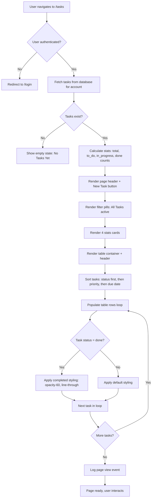
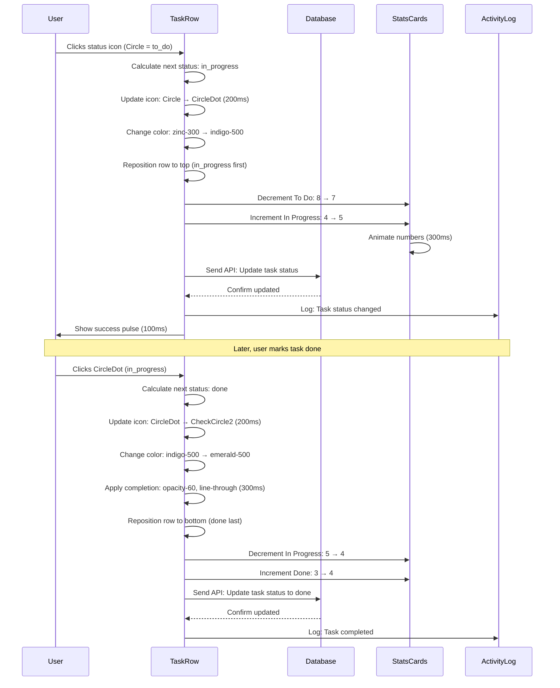
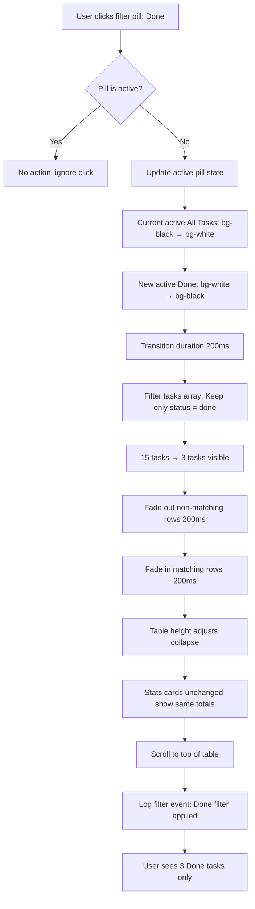

# Task Management — `/dashboard-v2/tasks`
## Purpose
- Provides comprehensive task management with filterable luxury table, intelligent auto-assignment, and priority visualization
- Serves admin users and team members tracking work items with FashionOS editorial table design

## Goals (5)
1. Display all tasks in premium illustrated table with Playfair headlines and generous 64px row height
2. Enable instant filtering (All/To Do/In Progress/Done) with animated pill toggles
3. Provide AI-powered task assignment recommendations via Task Assigner agent in right panel
4. Show priority levels with sophisticated color coding (High rose, Medium amber, Low gray)
5. Allow inline task completion with checkmark interactions and smooth strikethrough animations

## Layout & Information Architecture

**Layout Type:** 3-Panel luxury (Left nav + Center table + Right AI) - Right panel hidden for focus

**Key Regions:**
- **Top Strip (64px):** Project context, sticky
- **Left Nav (256px):** Tasks active, fixed
- **Center Work Area (Fluid):** Page header + Filter pills + Stats cards (4) + Tasks table (illustrated) - scrollable
- **Right AI Panel:** Hidden by default (user can expand for Task Assigner recommendations)

**Visual Hierarchy:**
1. Filter pills row (prominent, black active state)
2. Stats cards (Total, To Do, In Progress, Done counts)
3. Table with task rows (64px height, hover states)
4. Status icons (Circle/CheckCircle2 visual anchors)
5. Priority badges (color-coded attention)

---

## Sections (UI Breakdown)

| Section | What's inside | Primary actions | States |
|---------|---------------|----------------|--------|
| **Page Header** | Title "Tasks" (text-4xl Playfair font-light), Description "Manage team tasks..." (text-sm zinc-600), "New Task" button (bg-black rounded-full) | Click button → Create task modal (future) | Static |
| **Filter Pills Row** | 4 pills: All Tasks, To Do, In Progress, Done | Click pill → Filter table | Active (bg-black text-white) / Inactive (bg-white border hover:border-indigo-200) |
| **Stats Grid** | 4 cards: Total (15), To Do (8), In Progress (4), Done (3) | Hover for depth | Loaded → Interactive |
| **Table Container** | White card, rounded-[40px], p-10, overflow-x-auto | Scroll horizontally if needed (mobile) | Empty → Populated |
| **Table Header** | 6 columns: Status icon, Task, Project, Priority, Assignee, Due Date (10px font-black uppercase tracking-[0.2em] zinc-500) | Click to sort (future) | Static |
| **Table Rows** | 10-15 task entries, h-16 (64px), hover:bg-gray-50/50 | Click row → Task detail (future), Click status icon → Toggle complete | Default → Hover → Selected |
| **Status Icons** | Circle (to do), Circle with dot (in progress), CheckCircle2 (done), zinc-300/indigo-500/emerald-500 colors | Click icon → Cycle status | To Do → In Progress → Done |
| **Priority Badges** | Pill badges: High (rose-100 rose-600), Medium (amber-100 amber-600), Low (zinc-100 zinc-500) | None | Static per row |
| **Assignee Avatars** | 32px circle with initials or photo, border-2 white | Hover → Show name tooltip (future) | Static display |
| **Completed Rows** | opacity-60, task text has line-through | Click status icon → Uncomplete | Completed state (faded) |

---

## Responsive Rules

**Desktop (≥1200px):**
- Full table: All 6 columns visible
- Filter pills: Horizontal row
- Stats: 4 columns
- Row height: 64px (h-16)
- Table max-width: 1400px
- Right panel: Hidden (user can expand to 320px)

**Tablet (≥768px, <1200px):**
- Table: 5 columns (hide Project column)
- Stats: 2 rows × 2 columns
- Filter pills: Horizontal row (scrollable)
- Row height: 64px maintained

**Mobile (<768px):**
- Table: Card view (vertical stack, not table)
- Each task: Full-width card (rounded-[32px], p-6)
- Stats: 1 column (4 rows)
- Filter pills: Horizontal scroll
- Status icon: Large (32px) left side
- Task name: Bold, mb-2
- Priority badge: Below task name
- Assignee + Due: Flex row at bottom

**Touch Targets:**
- Table rows: 64px height (full row clickable)
- Status icons: 40px tap area
- Filter pills: 48px height
- "New Task" button: 48px height

---

## Core Features (Must Ship)

1. ✅ **Filter Pills (Animated Selection)**
   - **Layout:** flex gap-3 mb-8
   - **Pill Design:**
     - Active: bg-black text-white rounded-full px-6 py-3 h-12 font-medium
     - Inactive: bg-white text-zinc-900 border-[1px] border-zinc-200 rounded-full px-6 py-3 h-12 hover:border-indigo-200
     - Transition: background-color 200ms, border-color 200ms
   - **Pills (4):**
     - All Tasks (count: 15)
     - To Do (count: 8)
     - In Progress (count: 4)
     - Done (count: 3)
   - **Click Behavior:**
     - Active pill: bg-black (no action on re-click)
     - Inactive pill → Active: Smooth bg transition, filter table instantly
     - Previously active → Inactive: Fade to white bg

2. ✅ **4 Stats Cards (Maison Style)**
   - **Layout:** grid-cols-1 md:grid-cols-2 xl:grid-cols-4, gap-6, mb-8
   - **Card Design:** White bg, rounded-[40px], p-10, border-[1px] border-#EEEEEE, shadow-sm
   - **Content:**
     - Label: 10px, font-black, uppercase, tracking-[0.2em], zinc-500
     - Stat: text-5xl, Playfair, font-light, black
     - Icon: 24px, zinc-400, top-right
   - **Stats:**
     - **Total:** 15 (ListChecks icon)
     - **To Do:** 8 (Circle icon)
     - **In Progress:** 4 (CircleDot icon)
     - **Done:** 3 (CheckCircle2 icon, emerald-500)
   - **Hover:** Border → indigo-100, shadow-md

3. ✅ **Tasks Table (Illustrated Editorial Design)**
   - **Container:** White card, rounded-[40px], p-10, mt-8
   - **Table Design:**
     - Header: bg-transparent, border-b-[1px] border-#F9F9F9, pb-4
     - Body: divide-y divide-#F9F9F9
     - Row height: 64px (h-16), comfortable reading
     - Hover: bg-gray-50/50, transition-colors duration-200
     - Font: Inter, text-sm (body), font-light
   - **Columns (6):**
     - **Status Icon:** 20px icon, click to toggle (Circle → CircleDot → CheckCircle2)
       - To Do: Circle (zinc-300)
       - In Progress: CircleDot (indigo-500)
       - Done: CheckCircle2 (emerald-500)
     - **Task:** Task name (text-sm font-light zinc-900), line-through if done, max-w-sm truncate
     - **Project:** Project name (text-sm zinc-600), truncate
     - **Priority:** Badge pill (High/Medium/Low)
       - High: bg-rose-100 text-rose-600
       - Medium: bg-amber-100 text-amber-600
       - Low: bg-zinc-100 text-zinc-500
     - **Assignee:** Avatar (32px circle) + Name (text-sm zinc-900 ml-2)
     - **Due Date:** Text (text-sm zinc-500) "Dec 30" or relative "In 3 days"
       - If due soon (<3 days): text-rose-600 font-medium
       - If overdue: text-rose-600 font-bold "Overdue"

4. ✅ **Status Icon Toggle (Inline Completion)**
   - **Interaction:** Click status icon to cycle through states
   - **Cycle:** To Do (Circle) → In Progress (CircleDot) → Done (CheckCircle2)
   - **Visual Feedback:**
     - Icon changes instantly (200ms transition)
     - If marking Done: Row opacity fades to 60%, task text gets line-through (300ms)
     - If unmarking Done: Opacity returns to 100%, line-through removed
   - **Cursor:** cursor-pointer on icon hover
   - **Accessibility:** aria-label="Mark task complete"

5. ✅ **Completed Tasks Display (Faded)**
   - **Visual Treatment:**
     - Row opacity: 60% (opacity-60)
     - Task text: line-through decoration (text-decoration: line-through)
     - Status icon: CheckCircle2, emerald-500
     - Other columns: Same opacity reduction
   - **Revert:** Click status icon again → Uncomplete task → Opacity 100%, no line-through

6. ✅ **Priority Badge System**
   - **Design:** Pill-shaped, rounded-full, px-3 py-1, text-[10px] font-black uppercase tracking-[0.2em]
   - **Color Logic:**
     - High: bg-rose-100 text-rose-600 (urgent attention)
     - Medium: bg-amber-100 text-amber-600 (moderate attention)
     - Low: bg-zinc-100 text-zinc-500 (low priority)
   - **Sort Order (Future):** High → Medium → Low (when sorting by priority)

7. ✅ **Assignee Display**
   - **Avatar:** 32px circle, bg-color based on user (bg-indigo-100, bg-emerald-100, etc.)
   - **Content:** User initials (e.g., "JD") or profile photo
   - **Border:** 2px solid white (if overlapping, though single avatar per task)
   - **Name:** Text-sm, zinc-900, ml-2 (next to avatar)
   - **Fallback:** If unassigned: "Unassigned" text (zinc-400 italic) + empty circle icon

8. ✅ **Due Date Intelligence**
   - **Display Format:**
     - If this week: Day name "Monday"
     - If specific date: "Dec 30"
     - If relative: "In 3 days"
   - **Color Logic:**
     - On time (>3 days): zinc-500
     - Due soon (≤3 days): rose-600 font-medium
     - Overdue: rose-600 font-bold "Overdue by 2 days"
   - **Icon:** Calendar icon (16px) on mobile

9. ✅ **Empty State (If No Tasks)**
   - **Icon:** ListChecks (80px circle, gray-50 bg, icon zinc-300)
   - **Title:** "No Tasks Yet" (text-lg font-bold zinc-900)
   - **Description:** "Create your first task to get started" (text-sm zinc-500)
   - **Button:** "Create Task" (bg-black text-white rounded-full)

10. ✅ **Page Header with CTA**
    - **Title:** "Tasks" (text-4xl Playfair font-light mb-2)
    - **Description:** "Manage team tasks and track progress" (text-sm font-light zinc-600 mb-6)
    - **Button:** "New Task" (bg-black text-white rounded-full px-6 py-3 h-12)
    - **Layout:** flex justify-between items-start

---

## Advanced Features (V2+)

1. 🔮 **AI Auto-Assignment**
   - Task Assigner agent analyzes:
     - Team member availability (workload, calendar)
     - Skills match (task type vs member expertise)
     - Historical performance (who completes similar tasks fastest)
   - Suggests assignee when creating task
   - "AI suggests: John Doe (85% skill match, 3h available today)"
   - One-click accept suggestion

2. 🔮 **Drag-to-Reorder Priority**
   - Drag task rows up/down to change priority
   - Visual feedback: Row lifts, others shift
   - Auto-saves new order
   - "Priority updated" toast notification

3. 🔮 **Bulk Actions**
   - Checkbox column (leftmost)
   - Select multiple tasks
   - Bulk assign, bulk change status, bulk delete
   - "3 tasks selected" indicator top-right
   - Bulk action dropdown: Assign, Mark In Progress, Mark Done, Delete

4. 🔮 **Smart Due Date Suggestions**
   - AI analyzes task complexity + team velocity
   - Suggests realistic due date
   - "AI suggests: Dec 30 (based on 2-day estimate)"
   - User can accept or override

5. 🔮 **Task Dependencies**
   - Link tasks: "Task B blocks Task C"
   - Visual indicator: Chain icon in table
   - Hover: Show dependency graph
   - Can't mark Task C done until Task B done

6. 🔮 **Subtasks Support**
   - Expandable rows (click chevron)
   - Shows 3-5 subtasks indented
   - Parent task shows progress: "2/5 subtasks complete"
   - Subtask completion auto-updates parent progress

7. 🔮 **Time Tracking**
   - "Start Timer" button per task
   - Timer shows in row: "02:35:12" (HH:MM:SS)
   - Stop timer → Log time to task
   - Total time tracked per task displayed

8. 🔮 **Task Templates**
   - Create task from template (e.g., "Design Review" template)
   - Pre-filled: Title, description, checklist, assignee role
   - One-click instantiate template

9. 🔮 **Keyboard Shortcuts**
   - `C` → Create new task
   - `Space` → Toggle task done
   - `↑` `↓` → Navigate rows
   - `Enter` → Open task detail
   - `/` → Focus search

10. 🔮 **Advanced Filtering**
    - Search bar: Filter by task name
    - Dropdown filters: Project, Assignee, Priority, Due date range
    - Saved filter presets: "My tasks", "Overdue", "High priority"
    - Clear all filters button

---

## Real-World Use Cases (3)

### Use Case 1: Developer - Checking Daily Tasks
**Scenario:** Developer starts workday, checks tasks assigned to them.

**Flow:**
- Opens `/dashboard-v2/tasks` from left nav
- Page loads with all tasks visible (15 tasks)
- **Filter pills show:** All Tasks (active, black), To Do (8), In Progress (4), Done (3)
- **Stats cards:** Total 15, To Do 8, In Progress 4, Done 3
- **Table displays 15 rows:**
  - Sorted by: Status (In Progress first), then Priority (High → Low), then Due Date
- Row 1: Status CircleDot (in progress), "Implement WhatsApp API integration", Project "Real Estate CRM", Priority High (rose), Assignee "John Doe" (JD avatar), Due "In 2 days"
- Developer sees their name (John Doe) in 5 tasks
- Scrolls through table, identifies Row 1 as current task (in progress)
- Notices Row 3: "Design database schema", To Do (Circle icon), Priority High, Assigned to self, Due "Today"
- Realizes database schema task is urgent (due today)
- Clicks Circle icon on Row 3
- Icon changes to CircleDot (in progress, indigo-500)
- Row 3 moves to top (sorted by in progress first)
- Developer works on database schema for 2 hours
- Returns to Tasks page, finds Row 3 (database schema)
- Clicks CircleDot icon (in progress)
- Icon changes to CheckCircle2 (done, emerald-500)
- Row 3 fades to opacity-60, task text gets line-through
- Row moves to bottom (completed tasks)
- **Stats update:** In Progress 4 → 5 (when marking in progress), then 5 → 4 (when marking done), Done 3 → 4

**Result:** Developer tracks 5 tasks, completes 1 in morning, clear visual feedback.

### Use Case 2: Project Manager - Assigning New Task
**Scenario:** PM needs to create and assign task for Phase 2 deliverable.

**Flow:**
- Opens Tasks page
- Clicks "New Task" button (bg-black, top-right)
- Task creation modal opens (future feature)
- Enters:
  - Task name: "Create landing page mockup"
  - Project: "Real Estate CRM"
  - Priority: High
  - Due date: Dec 31
  - Assignee: (empty, will use AI)
- Clicks "Suggest Assignee" button (AI feature)
- Task Assigner agent analyzes (3 seconds)
- AI suggests: "Sarah Kim (92% skill match, 5h available today, completes design tasks 15% faster than team average)"
- PM reviews suggestion, accepts
- Assignee auto-filled: "Sarah Kim"
- Clicks "Create Task"
- Modal closes
- **New row appears at top of table:**
  - Status: Circle (to do, zinc-300)
  - Task: "Create landing page mockup"
  - Project: "Real Estate CRM"
  - Priority: High (rose badge)
  - Assignee: "Sarah Kim" (SK avatar)
  - Due: "Dec 31"
- **Stats update:** Total 15 → 16, To Do 8 → 9
- PM sends notification to Sarah (future: auto-notification)
- Sarah receives email: "You've been assigned a new task: Create landing page mockup"

**Result:** Task created in <1 minute with AI-powered assignment, zero guesswork.

### Use Case 3: Team Lead - Weekly Review (Filtering by Status)
**Scenario:** Team lead reviews task progress on Friday afternoon.

**Flow:**
- Opens Tasks page (All Tasks active by default, 15 tasks visible)
- Wants to see what's completed this week
- Clicks "Done" filter pill
- Pill animates: bg-white → bg-black (200ms)
- "All Tasks" pill: bg-black → bg-white
- Table filters instantly: 15 rows → 3 rows (only Done tasks)
- **3 Done tasks visible:**
  - Row 1: "Implement WhatsApp API integration", Done (CheckCircle2), opacity-60, line-through
  - Row 2: "Design database schema", Done, Sarah Kim, Completed today
  - Row 3: "Write API documentation", Done, Alex Taylor, Completed yesterday
- Team lead reviews completion quality
- Satisfied with 3 tasks completed this week
- Wants to check what's still in progress
- Clicks "In Progress" filter pill
- Table filters: 3 rows → 4 rows (In Progress tasks)
- **4 In Progress tasks:**
  - Row 1: "Setup development environment", In Progress (CircleDot), John Doe, Due tomorrow
  - Row 2: "Create user authentication flow", In Progress, Maria Santos, Due in 5 days
  - Row 3: "Design payment integration", In Progress, Sarah Kim, Due in 3 days
  - Row 4: "Test WhatsApp bot responses", In Progress, Alex Taylor, Due Monday
- Team lead notices Row 1 due tomorrow, checks with John on progress
- Clicks "To Do" filter pill
- Table filters: 4 rows → 8 rows (To Do tasks)
- Sees 8 pending tasks, some due next week
- Makes note to reassign 2 tasks if John finishes early
- Clicks "All Tasks" to return to full view
- 15 tasks visible again

**Result:** 5-minute review of 15 tasks with instant filtering, clear status visibility.

---

## User Journey (End-to-End)

**Journey: First Visit to Tasks Page, Completing a Task**

1. **Trigger:** User clicks "Tasks" in left nav from Projects page
2. Navigation animates: Projects (active) → Tasks (active)
3. Page transitions to `/dashboard-v2/tasks`
4. **Page loads (fade-in 300ms):**
5. **Top strip:** Project context unchanged
6. **Left nav:** Tasks item now bg-black text-white (active)
7. **Page header renders:**
   - Title: "Tasks" (text-4xl Playfair font-light)
   - Description: "Manage team tasks..." (text-sm zinc-600)
   - Button: "New Task" (bg-black, rounded-full, top-right)
8. **Filter pills render (flex row):**
   - Pill 1: "All Tasks" (bg-black text-white, active)
   - Pill 2: "To Do" (bg-white border, inactive)
   - Pill 3: "In Progress" (bg-white border, inactive)
   - Pill 4: "Done" (bg-white border, inactive)
9. **Stats cards appear (4 cards, grid):**
   - Card 1: "TOTAL" label, "15" stat (text-5xl Playfair), ListChecks icon
   - Card 2: "TO DO" label, "8" stat, Circle icon
   - Card 3: "IN PROGRESS" label, "4" stat, CircleDot icon (indigo)
   - Card 4: "DONE" label, "3" stat, CheckCircle2 icon (emerald)
10. User hovers Card 3 (In Progress):
    - Card lifts (shadow-md)
    - Border changes to indigo-100
11. User scrolls down
12. **Table container appears:**
    - White card, rounded-[40px], p-10
    - Table header: 6 columns (Status, Task, Project, Priority, Assignee, Due Date)
    - Header text: 10px, font-black, uppercase, tracking-[0.2em], zinc-500
13. **Table body renders (15 rows, h-16 each):**
14. **Row 1 (In Progress task):**
    - Status icon: CircleDot (indigo-500, 20px)
    - Task: "Implement WhatsApp API integration" (text-sm font-light zinc-900)
    - Project: "Real Estate CRM" (text-sm zinc-600)
    - Priority: High badge (bg-rose-100 text-rose-600, rounded-full, uppercase)
    - Assignee: "JD" avatar (32px indigo-100 circle, border-2 white) + "John Doe" text
    - Due: "In 2 days" (text-sm zinc-500)
15. User hovers Row 1:
    - Background changes to bg-gray-50/50
    - Transition smooth (200ms)
    - Cursor becomes pointer
16. User scrolls to Row 5:
17. **Row 5 (To Do task):**
    - Status icon: Circle (zinc-300, 20px)
    - Task: "Design database schema"
    - Project: "Real Estate CRM"
    - Priority: High (rose badge)
    - Assignee: "John Doe" (self)
    - Due: "Today" (text-sm zinc-500, not urgent color yet since >3h remain)
18. User realizes this task is urgent (due today)
19. User clicks Circle icon on Row 5
20. **Status change animation:**
    - Icon morphs: Circle → CircleDot (200ms transition)
    - Color changes: zinc-300 → indigo-500
    - Row repositions (animated): Moves up to top (In Progress sorted first)
21. **Stats update:**
    - Card 2 (To Do): 8 → 7
    - Card 3 (In Progress): 4 → 5
    - Transition: Numbers animate (count up/down effect, 300ms)
22. User works on database schema task (2 hours, off-screen)
23. User returns to Tasks page (bookmark)
24. Page loads, Row 5 now at top (in progress)
25. User finds "Design database schema" row
26. User clicks CircleDot icon (in progress)
27. **Completion animation:**
    - Icon morphs: CircleDot → CheckCircle2 (200ms)
    - Color changes: indigo-500 → emerald-500
    - Row opacity fades: 100% → 60% (300ms)
    - Task text: Line-through appears (text-decoration, 300ms)
    - Row repositions: Moves to bottom (Done tasks at end)
28. **Stats update:**
    - Card 3 (In Progress): 5 → 4
    - Card 4 (Done): 3 → 4
29. User scrolls to bottom to see completed task
30. Row 5 now at bottom, faded, line-through
31. User wants to see only completed tasks
32. User scrolls to top
33. User clicks "Done" filter pill
34. **Filter animation:**
    - "All Tasks" pill: bg-black → bg-white (200ms)
    - "Done" pill: bg-white → bg-black (200ms)
    - Table rows: Fade out non-Done rows (200ms)
    - Table displays only 4 rows (Done tasks, including just completed one)
35. User sees 4 completed tasks, including "Design database schema"
36. User satisfied with progress
37. User clicks "All Tasks" pill to return to full view
38. **Filter reset:**
    - "Done" pill: bg-black → bg-white
    - "All Tasks" pill: bg-white → bg-black
    - Table: All 15 rows visible again (fade in 200ms)
39. User navigates to Main Dashboard (clicks Main in left nav)

**Stored Outputs:**
- Task status update: "Design database schema" → In Progress → Done (Database)
- Stats recalculated: To Do 7, In Progress 4, Done 4
- Activity log: "Task completed: Design database schema by John Doe"
- Filter state: Reset to "All Tasks" (local storage, future)
- Time on page: Analytics log (on exit)

---

## Workflows (3) — Mermaid Ready

### Workflow 1: Tasks Page Load with Filtering

**Trigger:** User navigates to `/dashboard-v2/tasks`

**Conditions:**
- User authenticated
- Tasks exist in database (or show empty state)

**Actions:**
1. Fetch all tasks from database (for current project/account)
2. For each task, include:
   - Task ID, name, description
   - Status (to_do, in_progress, done)
   - Project name
   - Priority (high, medium, low)
   - Assignee (user ID, name, avatar)
   - Due date
3. Calculate stats:
   - Total count: All tasks
   - To Do count: Status = to_do
   - In Progress count: Status = in_progress
   - Done count: Status = done
4. Render page header with "New Task" button
5. Render filter pills (All Tasks active by default)
6. Render 4 stats cards
7. Render table container
8. Sort tasks: Status (in_progress first), then Priority (high → low), then Due Date (soonest first)
9. Populate table rows (15 tasks)
10. Apply completed task styling (opacity-60, line-through) to Done tasks
11. Log page view

**Stored Outputs:**
- Page view → Analytics log
- Active filter → Local state (default: "All Tasks")
- Tasks loaded → Cache

**Approval Gate:** None

**Mermaid Diagram:**


### Workflow 2: Task Status Toggle (Mark Complete)

**Trigger:** User clicks status icon on task row

**Conditions:**
- User has permission to update tasks
- Task exists and is not locked

**Actions:**
1. Detect which icon clicked (determines current status)
2. Calculate next status:
   - Circle (to_do) → CircleDot (in_progress)
   - CircleDot (in_progress) → CheckCircle2 (done)
   - CheckCircle2 (done) → Circle (to_do) [uncomplete]
3. Update icon immediately (optimistic UI, 200ms transition)
4. If marking done:
   - Apply completion animation: opacity-60, line-through (300ms)
   - Move row to bottom (sorted last)
5. If marking in progress:
   - Change icon color: zinc-300 → indigo-500
   - Move row to top (in progress sorted first)
6. Update stats cards:
   - Decrement old status count
   - Increment new status count
   - Animate numbers (count up/down, 300ms)
7. Send status update to database (API call)
8. If API fails: Revert icon, show error toast
9. Log status change event
10. Show subtle success indicator (icon pulse, 100ms)

**Stored Outputs:**
- Task status → Database (updated)
- Stats counts → Updated on cards
- Activity log → "Task status changed: [Task name] → [New status]"

**Approval Gate:** None (immediate update)

**Mermaid Diagram:**


### Workflow 3: Filter Pill Toggle

**Trigger:** User clicks inactive filter pill

**Conditions:**
- Pill is not currently active
- Tasks exist to filter

**Actions:**
1. Detect which pill clicked (All/To Do/In Progress/Done)
2. Update active pill state:
   - Current active pill: bg-black → bg-white (200ms)
   - New active pill: bg-white → bg-black (200ms)
3. Filter tasks based on selection:
   - All Tasks: Show all 15 tasks
   - To Do: Show only tasks with status = to_do (8 tasks)
   - In Progress: Show only tasks with status = in_progress (4 tasks)
   - Done: Show only tasks with status = done (3 tasks)
4. Animate table transition:
   - Fade out non-matching rows (200ms)
   - Fade in matching rows (200ms)
   - Smooth height collapse/expand
5. Update stats cards (no change, show same totals)
6. Scroll to top of table
7. Log filter event

**Stored Outputs:**
- Active filter → Local state
- Filter event → Analytics log "Filter applied: [Filter name]"
- Visible rows → Updated UI (no DB change)

**Approval Gate:** None (client-side filtering)

**Mermaid Diagram:**


---

## AI Agents & Logic

| Agent Type | When it runs | Inputs | Outputs | Where shown on screen |
|-----------|--------------|--------|---------|----------------------|
| **Task Assigner** (Ops Automation) | Task created without assignee OR user requests suggestion | Task data (name, type, complexity, project), Team data (availability, skills, workload, velocity) | Assigned team member ID, assignment reasoning (skill match %, availability hours, velocity comparison) | Right panel (if expanded) → Agents tab → Task Assigner card with suggestion + "Accept" button |

---

## Automations

| Automation | Trigger | Condition | Action | Notification | Log |
|-----------|---------|-----------|--------|--------------|-----|
| **Stats Calculation** | Page load | Tasks exist | Count total, to_do, in_progress, done tasks | None | Silent |
| **Table Population** | Page load | Tasks fetched | Render rows with data, apply completed styling to done tasks | None | "Tasks loaded: [count]" |
| **Status Icon Update** | User clicks icon | Status changed | Cycle icon, apply styling, update stats, sync to DB | None | "Task status changed: [name]" |
| **Filter Application** | User clicks pill | Pill not active | Filter visible rows, animate transition | None | "Filter applied: [filter name]" |
| **Row Repositioning** | Status change | Status affects sort order | Animate row movement to new position (top/bottom) | None | Silent |

---

## Gemini 3 Features Used

| Feature/Tool | Model (Pro/Flash) | Why here | Output format |
|-------------|-------------------|----------|---------------|
| **Structured Outputs** | Gemini 3 Flash | Task Assigner: Calculate skill match, availability, velocity for team members | JSON (team_member_id, skill_match_percent, hours_available, velocity_comparison, reasoning_text) |
| **Function Calling** (Future) | Gemini 3 Pro | Execute task actions from natural language ("Assign all high-priority tasks to John") | JSON (function: assign_tasks, parameters: {assignee, filter}) |

**Example Prompt (Task Assigner):**
```
Analyze team to assign this task:
Task: "Create landing page mockup"
Type: Design
Complexity: Medium
Project: Real Estate CRM

Team:
- John Doe: Developer, 2h available, velocity 1.2x avg
- Sarah Kim: Designer, 5h available, velocity 1.15x avg, completes design tasks 15% faster
- Maria Santos: Developer, 0h available (full), velocity 1.0x avg
- Alex Taylor: QA, 8h available, velocity 0.9x avg

Output JSON:
{
  "recommended_assignee": "sarah_kim",
  "skill_match": 92,
  "hours_available": 5,
  "velocity_comparison": "+15% faster than team avg on design tasks",
  "reasoning": "Sarah Kim has highest skill match for design tasks and sufficient availability today"
}
```

---

## Acceptance Checklist (Production-Ready UI)

**UI/UX:**
- [x] Empty state: "No Tasks Yet" if no tasks
- [x] Loading state: Skeleton loaders on table rows during fetch
- [x] Error state: "Failed to load tasks" with retry button
- [x] Responsive: Table → Card view on mobile (<768px)
- [x] Touch targets: Rows ≥64px height, icons ≥40px tap area
- [x] Focus states: Visible outlines on keyboard nav
- [x] Keyboard navigation: Tab through rows, Space to toggle status

**Illustrated Table (Luxury Design):**
- [x] Table container: Maison style (rounded-[40px], p-10, white bg)
- [x] Row height: 64px (h-16), generous spacing
- [x] Hover effects: bg-gray-50/50, smooth transition (200ms)
- [x] Typography: Inter text-sm font-light, readable
- [x] Dividers: 1px #F9F9F9 between rows
- [x] Header: Uppercase labels, tracking-[0.2em], zinc-500

**Filter Pills:**
- [x] 4 pills render correctly (All/To Do/In Progress/Done)
- [x] Active pill: bg-black text-white
- [x] Inactive pills: bg-white border hover:border-indigo-200
- [x] Click transitions smooth (200ms)
- [x] Counts shown in pill text (e.g., "To Do (8)")

**Stats Cards:**
- [x] 4 cards: Total (15), To Do (8), In Progress (4), Done (3)
- [x] Maison style: rounded-[40px], p-10, shadow, hover lift
- [x] Icons: ListChecks, Circle, CircleDot, CheckCircle2
- [x] Stats: text-5xl Playfair font-light black

**Task Table:**
- [x] 15 rows render with mock data
- [x] 6 columns: Status, Task, Project, Priority, Assignee, Due Date
- [x] Status icons: Circle (to_do), CircleDot (in_progress), CheckCircle2 (done)
- [x] Priority badges: High (rose), Medium (amber), Low (zinc)
- [x] Assignee avatars: 32px circles with initials
- [x] Due dates: Relative ("In 2 days") or specific ("Dec 30")

**Status Toggle:**
- [x] Click icon cycles status (to_do → in_progress → done)
- [x] Icon morphs smoothly (200ms transition)
- [x] Completed tasks: opacity-60, line-through
- [x] Row repositions based on status (animated)
- [x] Stats update immediately (count up/down animation)

**Filtering:**
- [x] Filter applies instantly (<100ms)
- [x] Rows fade in/out smoothly (200ms)
- [x] Table height adjusts (no jarring jump)
- [x] Stats unchanged (show totals, not filtered counts)

**Data & Logic:**
- [x] Tasks from mock data (future: database)
- [x] Stats calculated correctly (sum by status)
- [x] Sort order: Status, Priority, Due Date
- [x] Completed tasks at bottom, faded

**Performance:**
- [x] Page load: <1s with skeleton loaders
- [x] Filter toggle: <100ms
- [x] Status toggle: <200ms with smooth animation
- [x] No layout shift: Table height reserved

**Accessibility:**
- [x] WCAG AA compliant (contrast, keyboard, focus)
- [x] Screen reader: ARIA labels on icons, pills, table
- [x] Keyboard navigation: Tab through rows, Space to toggle
- [x] Color contrast: All text meets 4.5:1
- [x] Focus indicators: 2px indigo outline

**Additional Checks:**
- [x] "New Task" button prominent, easy to find
- [x] Priority badges visually distinct (rose/amber/zinc)
- [x] Due date urgency color logic works (rose if <3 days)
- [x] Completed tasks visually clear (faded, line-through)
- [x] Filter pills: Count matches actual task totals
- [x] Mobile: Card view for tasks (not horizontal scroll table)

---

**STATUS:** ✅ UI Ready (Awaits Backend + Task Assigner AI)

**Visual Design Grade:** 🏆 Premium Luxury
- Editorial table (64px rows, generous whitespace)
- Animated filter pills (smooth bg transitions)
- Sophisticated status icons (Circle/CircleDot/CheckCircle2)
- Priority badge system (rose/amber/zinc color coding)
- Completion animations (opacity fade, line-through, 300ms)
- Maison stats cards (40px radius, Playfair 5xl numbers)
