# Automation Configuration — `/dashboard-v2/automations`
## Purpose
- Enables configuration and monitoring of AI-powered automations with elegant card-based interface and confirmation modals
- Serves admin users managing intelligent workflows with premium FashionOS design and Workflow Optimizer recommendations

## Goals (5)
1. Display all automations in illustrated vertical cards with Playfair typography and generous 48px spacing
2. Provide instant enable/pause controls with sophisticated confirmation modals (glassmorphism backdrop)
3. Show real-time automation metrics (triggers today, success rate) with Playfair percentage typography
4. Surface AI-powered optimization suggestions via Workflow Optimizer in right panel
5. Maintain luxury aesthetic with 40px border radius cards, indigo highlights, and smooth 300ms transitions

## Layout & Information Architecture

**Layout Type:** 3-Panel luxury (Left nav + Center cards + Right AI)

**Key Regions:**
- **Top Strip (64px):** Project context, sticky
- **Left Nav (256px):** Automations active, fixed
- **Center Work Area (Fluid):** Page header + Stats cards (4) + Automation cards (vertical stack) - scrollable
- **Right AI Panel (320px):** 5 tabs, default open for Workflow Optimizer recommendations

**Visual Hierarchy:**
1. Page title "Automations" (text-4xl Playfair)
2. Stats cards row (Total, Active, Triggers Today, Success Rate)
3. Automation cards (largest elements, 200px height minimum)
4. Status badges (emerald Active, amber Paused, zinc Disabled)
5. Action buttons (Pause/Enable/Configure)

---

## Sections (UI Breakdown)

| Section | What's inside | Primary actions | States |
|---------|---------------|----------------|--------|
| **Page Header** | Title "Automations" (text-4xl Playfair font-light), Description "Configure AI-powered workflows..." (text-sm zinc-600), "New Automation" button (bg-black rounded-full) | Click button → Create automation wizard (future) | Static |
| **Stats Grid** | 4 cards: Total (12), Active (8), Triggers Today (47), Success Rate (94%) | Hover for depth | Loaded → Interactive |
| **Automation Cards Container** | Vertical stack of automation cards (space-y-6), max-w-4xl centered | Scroll to see all automations | Empty → Populated |
| **Automation Card** | Illustrated card (rounded-[40px], p-10, white bg, border, shadow): Icon circle (56px, rounded-[28px], bg-color per automation), Name (text-xl Playfair), Status badge (emerald/amber/zinc), Metrics (triggers, success rate as Playfair %), Action button (Pause/Enable) | Click button → Show confirmation modal, Hover for lift | Default → Hover → Active |
| **Icon Circle** | 56px diameter, rounded-[28px], bg-indigo-50 (or themed color), icon 28px centered | None (visual identifier) | Static |
| **Status Badge** | Pill badge: Active (emerald-50 emerald-600), Paused (amber-50 amber-600), Disabled (zinc-100 zinc-500) | None (status display) | Changes on action |
| **Metrics Row** | 2 metrics: "47 triggers today" (text-sm zinc-600), "94% success rate" (text-lg Playfair font-light) | None (informational) | Updates real-time |
| **Action Button** | Pause (white bg, border), Enable (emerald-500 bg), Configure (ghost) | Click → Show confirmation modal | Enabled → Loading → Disabled |
| **Confirmation Modal** | Centered modal (max-w-lg, rounded-[32px], p-10, white bg), Backdrop (bg-zinc-900/50, backdrop-blur-sm), Title (text-2xl Playfair), Description (text-sm font-light), Buttons (Confirm primary + Cancel ghost) | Click Confirm → Execute action, Click Cancel → Close modal | Hidden → Visible (fade-in) |
| **Right Panel - Auto Tab** | Workflow Optimizer recommendations (2-3 cards) | Click "Apply Optimization" → Show modal | Loaded → Interactive |

---

## Responsive Rules

**Desktop (≥1200px):**
- Full 3-panel layout
- Stats: 4 columns
- Automation cards: Max-width 1000px, centered
- Card padding: p-10 (40px)
- AI panel: Full width (320px), open by default
- Modal: Max-width 600px

**Tablet (≥1024px, <1200px):**
- Left nav: Icon rail (56px)
- Stats: 2 rows × 2 columns
- Automation cards: Full width
- Card padding: p-8 (32px)
- AI panel: Drawer overlay
- Modal: Max-width 500px

**Mobile (<1024px):**
- Stats: 1 column (4 rows)
- Automation cards: Full width, p-6 (24px)
- Icon circle: 48px (smaller)
- Metrics: Stacked vertically
- Action buttons: Full width
- Modal: Full width minus 24px padding
- AI panel: Bottom sheet

**Touch Targets:**
- Automation cards: Full card hover area (min 200px height)
- Action buttons: 48px height
- Modal buttons: 48px height
- "New Automation" button: 48px height

---

## Core Features (Must Ship)

1. ✅ **4 Stats Cards (Maison Style)**
   - **Layout:** grid-cols-1 md:grid-cols-2 xl:grid-cols-4, gap-6, mb-8
   - **Card Design:** White bg, rounded-[40px], p-10, border-[1px] border-#EEEEEE, shadow-sm
   - **Content:**
     - Label: 10px, font-black, uppercase, tracking-[0.2em], zinc-500
     - Stat: text-5xl, Playfair, font-light, black
     - Supporting text: text-xs, italic, zinc-400
   - **Stats:**
     - **Total Automations:** 12 (Zap icon)
     - **Active:** 8 (CircleCheck icon, emerald-500)
     - **Triggers Today:** 47 (Lightning icon, "Across all automations")
     - **Success Rate:** 94% (TrendingUp icon, "Last 7 days")
   - **Hover:** Border → indigo-100, shadow-md, lift

2. ✅ **Automation Cards (Vertical Stack)**
   - **Container:** space-y-6, max-w-4xl mx-auto
   - **Card Design:**
     - White bg, rounded-[40px], p-10, border-[1px] border-#EEEEEE, shadow-sm
     - Height: Auto (min 200px)
     - Hover: shadow-lg, border-indigo-100, translateY(-2px), transition 200ms
   - **Card Content (Per Automation):**
     - **Icon Circle (Top-left):**
       - Size: 56px diameter (w-14 h-14)
       - Border radius: rounded-[28px] (half of 56px for perfect rounding)
       - Background: Themed per automation (indigo-50, emerald-50, amber-50, purple-50)
       - Icon: 28px, themed color (indigo-500, emerald-500, etc.)
       - Position: Absolute or flex start
     - **Header Row (Flex, items-center, justify-between):**
       - Left: Automation name (text-xl Playfair font-light black)
       - Right: Status badge (pill, rounded-full, px-3 py-1, text-[10px] font-black uppercase)
     - **Description (Below name):**
       - Text: text-sm, font-light, zinc-600, leading-relaxed, mb-4
       - Example: "Automatically replies to WhatsApp inquiries within 2 minutes"
     - **Metrics Row (Flex, gap-8, mb-4):**
       - Metric 1: "47 triggers today" (text-sm zinc-600)
       - Metric 2: "94% success rate" (text-lg Playfair font-light zinc-900)
     - **Action Buttons Row (Flex, gap-3):**
       - If Active: "Pause" button (bg-white border-zinc-200 text-zinc-900 hover:border-zinc-400)
       - If Paused/Disabled: "Enable" button (bg-emerald-500 text-white hover:bg-emerald-600)
       - Always: "Configure" button (ghost style, text-zinc-600 hover:text-zinc-900)

3. ✅ **Status Badge System**
   - **Design:** Pill-shaped, rounded-full, px-3 py-1, text-[10px] font-black uppercase tracking-[0.2em]
   - **Color Logic:**
     - Active: bg-emerald-50 text-emerald-600 (positive, operational)
     - Paused: bg-amber-50 text-amber-600 (temporary hold, attention)
     - Disabled: bg-zinc-100 text-zinc-500 (inactive, low priority)
   - **Position:** Top-right of card header

4. ✅ **Icon Circle Theming**
   - **Automation-Specific Colors:**
     - WhatsApp Auto-Reply: bg-emerald-50, icon emerald-500 (MessageSquare icon)
     - Lead Scorer: bg-indigo-50, icon indigo-500 (Star icon)
     - Task Auto-Assignment: bg-purple-50, icon purple-500 (UserPlus icon)
     - Email Follow-Up: bg-blue-50, icon blue-500 (Mail icon)
     - Sentiment Monitor: bg-rose-50, icon rose-500 (Heart icon)
   - **Visual Consistency:** All 56px diameter, rounded-[28px], icon centered

5. ✅ **Metrics Display**
   - **Format:**
     - Triggers: "47 triggers today" (text-sm zinc-600)
     - Success Rate: "94%" (text-lg Playfair font-light zinc-900)
   - **Update Frequency:** Real-time (WebSocket future) or on page refresh
   - **Color Logic:**
     - Success rate ≥90%: zinc-900 (good)
     - Success rate 70-89%: amber-600 (moderate)
     - Success rate <70%: rose-600 (attention needed)

6. ✅ **Confirmation Modal (Glassmorphism)**
   - **Backdrop:** bg-zinc-900/50, backdrop-blur-sm, fixed inset-0
   - **Modal Container:**
     - Max-width: 500px (max-w-lg)
     - Centered: flex items-center justify-center h-screen
     - White bg, rounded-[32px], p-10, shadow-2xl
   - **Content:**
     - **Icon:** Top, centered, 64px circle with themed bg (amber-50 for pause, emerald-50 for enable)
     - **Title:** text-2xl, Playfair, font-light, black, mb-4, centered or left
       - Example: "Pause WhatsApp Auto-Reply?"
     - **Description:** text-sm, font-light, zinc-600, leading-relaxed, mb-6
       - Example: "Pausing this automation will stop automatic responses. You can re-enable it anytime."
     - **Buttons Row:** flex, gap-4, justify-end
       - **Cancel:** ghost style, text-zinc-600, hover:text-zinc-900
       - **Confirm:** primary style (bg-emerald-500 for enable, bg-amber-500 for pause), text-white, rounded-full, px-6 py-3
   - **Animation:** Fade in backdrop + scale modal (0.95 → 1.0) over 200ms

7. ✅ **Action Button States**
   - **Pause Button (If Active):**
     - Default: bg-white, border-[1px] border-zinc-200, text-zinc-900, rounded-full, px-6 py-3, h-12
     - Hover: border-zinc-400, shadow-sm
     - Click: Show confirmation modal
   - **Enable Button (If Paused/Disabled):**
     - Default: bg-emerald-500, text-white, rounded-full, px-6 py-3, h-12, shadow-sm shadow-emerald-500/20
     - Hover: bg-emerald-600, shadow-md
     - Click: Show confirmation modal
   - **Configure Button:**
     - Default: ghost style, text-zinc-600, hover:text-zinc-900, hover:bg-zinc-50
     - Click: Opens configuration panel (future) or navigates to settings

8. ✅ **Empty State (If No Automations)**
   - **Icon:** Zap (80px circle, gray-50 bg, icon zinc-300)
   - **Title:** "No Automations Yet" (text-lg font-bold zinc-900)
   - **Description:** "Create your first automation to streamline workflows" (text-sm zinc-500)
   - **Button:** "Create Automation" (bg-black text-white rounded-full)

9. ✅ **Page Header with CTA**
   - **Title:** "Automations" (text-4xl Playfair font-light mb-2)
   - **Description:** "Configure AI-powered workflows and monitor performance" (text-sm font-light zinc-600 mb-6)
   - **Button:** "New Automation" (bg-black text-white rounded-full px-6 py-3 h-12)
   - **Layout:** flex justify-between items-start

10. ✅ **Right Panel - Workflow Optimizer Recommendations**
    - **Auto Tab (Active by default):**
      - **Recommended Card 1:**
        - bg-gray-50, rounded-[32px], p-4
        - "RECOMMENDED" badge
        - Title: "Optimize WhatsApp Response Time" (text-sm font-light)
        - Description: "Current avg response: 2min. AI suggests enabling instant greeting (reduces to 30sec)." (text-xs italic zinc-600)
        - Button: "Apply Optimization" (bg-indigo-500, rounded-full, px-4 py-2)
      - **Recommendation Card 2:**
        - White bg, rounded-[32px], p-3
        - Title: "Split Task Assignment Logic"
        - Description: "Projects using split logic complete 12% faster"
        - Button: "Learn More" (text-indigo-500, hover:underline)

---

## Advanced Features (V2+)

1. 🔮 **Visual Automation Builder**
   - Drag-and-drop flowchart builder
   - Nodes: Trigger, Condition, Action, Delay
   - Connect nodes with arrows
   - Real-time validation
   - Save as template

2. 🔮 **Automation Logs & History**
   - Click automation card → Opens log drawer
   - List of last 50 executions
   - Per execution: Timestamp, trigger data, result, duration
   - Filter: Success, Failed, Skipped
   - Export logs as CSV

3. 🔮 **A/B Testing Automations**
   - Create variant of automation
   - Split traffic 50/50 or custom %
   - Compare metrics after 1 week
   - Winner auto-activated
   - Loser archived

4. 🔮 **Scheduled Automations**
   - Add schedule to automation (e.g., "Every Monday 9am")
   - Visual calendar picker
   - Timezone handling
   - Pause schedule temporarily

5. 🔮 **Multi-Step Workflows**
   - Chain 3-5 automations
   - Output of Step 1 → Input of Step 2
   - Conditional branching: "If lead score >80, assign to senior sales"
   - Visual flowchart display

6. 🔮 **Automation Templates**
   - Library of 20+ pre-built automations
   - Categories: Lead management, Client communication, Task automation
   - One-click instantiate template
   - Customize after creation

7. 🔮 **Error Handling & Retry Logic**
   - Set retry attempts (1-5 times)
   - Exponential backoff (1min, 5min, 15min)
   - Fallback action: "If fails 3 times, notify team lead"
   - Error notification channels: Email, Slack, In-app

8. 🔮 **Cost Tracking Per Automation**
   - Show: "47 triggers × $0.02 = $0.94 today"
   - Budget alerts: "Approaching $10 daily limit"
   - Optimize for cost: "Reduce triggers by adding filters"

9. 🔮 **Team Collaboration**
   - Share automation with team
   - Permissions: View, Edit, Manage
   - Comment threads on automations
   - Change log: "Sarah edited trigger conditions 2h ago"

10. 🔮 **AI-Powered Optimization**
    - Workflow Optimizer runs weekly
    - Analyzes execution patterns
    - Suggests: "Add filter to reduce false triggers by 30%"
    - One-click apply suggestions

---

## Real-World Use Cases (3)

### Use Case 1: Sales Manager - Pausing WhatsApp Automation During Holidays
**Scenario:** Agency closing for holidays, need to pause WhatsApp auto-replies.

**Flow:**
- Opens `/dashboard-v2/automations` from left nav
- Page loads with 12 automation cards
- **Stats show:** Total 12, Active 8, Triggers Today 47, Success Rate 94%
- Scrolls to "WhatsApp Auto-Reply" card
- **Card details:**
  - Icon circle: bg-emerald-50, MessageSquare icon emerald-500
  - Name: "WhatsApp Auto-Reply" (text-xl Playfair)
  - Status badge: "ACTIVE" (emerald-50 bg)
  - Description: "Automatically replies to WhatsApp inquiries within 2 minutes"
  - Metrics: "47 triggers today", "96% success rate" (Playfair)
  - Buttons: "Pause" (white bg, border), "Configure" (ghost)
- Hovers card: Card lifts (shadow-lg), border → indigo-100
- Clicks "Pause" button
- **Confirmation modal appears:**
  - Backdrop: bg-zinc-900/50, backdrop-blur-sm (glassmorphism)
  - Modal: White card, rounded-[32px], p-10, centered
  - Icon: 64px amber-50 circle, Pause icon amber-500
  - Title: "Pause WhatsApp Auto-Reply?" (text-2xl Playfair)
  - Description: "Pausing this automation will stop automatic responses. Inquiries will queue for manual review. You can re-enable anytime."
  - Buttons: "Cancel" (ghost) + "Pause Automation" (bg-amber-500 text-white)
- Manager reads description, confirms decision
- Clicks "Pause Automation" button
- Modal fades out (200ms)
- **Card updates:**
  - Status badge: "ACTIVE" → "PAUSED" (amber-50 bg, amber-600 text)
  - "Pause" button → "Enable" button (bg-emerald-500 text-white)
  - Card border briefly glows amber (300ms pulse effect)
- **Stats update:** Active 8 → 7
- Success toast appears: "WhatsApp Auto-Reply paused" (bottom-right, 3s)
- Activity log records: "WhatsApp Auto-Reply paused by [Manager name]"
- Manager satisfied, holidays start with no auto-replies

**Result:** Automation paused in 30 seconds with clear confirmation, zero accidental clicks.

### Use Case 2: Operations Lead - Enabling New Lead Scorer Automation
**Scenario:** Lead Scorer automation just configured, need to activate.

**Flow:**
- Opens Automations page
- Scrolls to "Lead Scorer" card
- **Card shows:**
  - Icon: bg-indigo-50, Star icon indigo-500
  - Status: "DISABLED" (zinc-100 bg, zinc-500 text)
  - Metrics: "0 triggers today", "—% success rate" (not yet run)
  - Button: "Enable" (bg-emerald-500, ready to activate)
- Clicks "Enable" button
- **Confirmation modal:**
  - Icon: 64px emerald-50 circle, Play icon emerald-500
  - Title: "Enable Lead Scorer?"
  - Description: "This automation will score all new leads (0-100) based on company data, budget, and engagement signals. Scores will appear in Lead Intelligence page."
  - Note: "First run will process 24 existing leads (est. 30 seconds)"
  - Buttons: "Cancel" + "Enable Automation" (bg-emerald-500)
- Lead clicks "Enable Automation"
- Modal closes (fade out)
- **Card updates:**
  - Status badge: "DISABLED" → "ACTIVE" (emerald-50, emerald-600)
  - "Enable" button → "Pause" button (white bg, border)
  - Metrics: Shows loading spinner "Processing..." (2 seconds)
  - After 2 seconds: "24 triggers today", "100% success rate" (first run)
- **Stats update:** Active 7 → 8
- Success toast: "Lead Scorer enabled and processing 24 leads"
- Right panel, Auto tab:
  - New card appears: "Lead Scorer Results" (white bg)
  - "24 leads scored: 8 High Priority, 12 Medium, 4 Low"
  - Button: "View Leads" → Links to Lead Intelligence page
- Lead satisfied, checks lead scores on Lead Intelligence page

**Result:** Automation enabled in 15 seconds, instant processing of existing data.

### Use Case 3: PM - Reviewing Automation Performance
**Scenario:** Weekly review of all automations to identify underperformers.

**Flow:**
- Opens Automations page Monday morning
- Reviews stats cards:
  - Total: 12 (unchanged)
  - Active: 8 (good)
  - Triggers Today: 47 (within expected range)
  - Success Rate: 94% (excellent overall)
- Scrolls through 12 automation cards
- **Card 1: WhatsApp Auto-Reply** - 96% success, performing well
- **Card 2: Lead Scorer** - 100% success, excellent
- **Card 3: Task Auto-Assignment** - 89% success (below 90%)
  - PM notices lower success rate
  - Metrics: "12 triggers today", "89% success rate" (amber-600 color)
- Hovers Card 3: Card lifts
- Right panel, Auto tab shows:
  - Workflow Optimizer card (recommended, bg-gray-50)
  - "Optimize Task Assignment Logic"
  - Description: "Current logic fails when 2+ team members have equal availability. Suggest adding tie-breaker: assign to member with least tasks this week."
  - Button: "Apply Optimization"
- PM reads recommendation, makes sense
- Clicks "Apply Optimization" button
- **Confirmation modal:**
  - Title: "Apply Workflow Optimization?"
  - Description: AI explains change, shows before/after logic comparison
  - Buttons: "Cancel" + "Apply Changes" (bg-indigo-500)
- PM clicks "Apply Changes"
- Modal closes
- Task Auto-Assignment card updates:
  - Success rate: 89% → (will improve over next week)
  - Description updated to include tie-breaker logic
- Success toast: "Optimization applied to Task Auto-Assignment"
- **Card 4-12:** PM reviews remaining cards (all >92% success)
- PM checks Right panel, Flows tab:
  - Visual flowchart of WhatsApp → Lead Scorer → Task Assignment journey
  - Shows: "94% of leads follow this journey"
- PM satisfied with overall performance
- Makes note: Check Task Assignment success rate next Monday

**Result:** Weekly review completed in 10 minutes, proactive optimization applied.

---

## User Journey (End-to-End)

**Journey: First Visit, Pausing an Automation**

1. **Trigger:** User clicks "Automations" in left nav
2. Navigation animates: Previous page → Automations (active)
3. Page transitions to `/dashboard-v2/automations`
4. **Page loads (fade-in 300ms):**
5. **Top strip:** Project context unchanged
6. **Left nav:** Automations item bg-black text-white (active)
7. **Page header renders:**
   - Title: "Automations" (text-4xl Playfair font-light)
   - Description: "Configure AI-powered workflows..." (text-sm zinc-600)
   - Button: "New Automation" (bg-black, top-right)
8. **Stats cards appear (4 cards, grid):**
   - Card 1: "TOTAL AUTOMATIONS" label, "12" stat (text-5xl Playfair), Zap icon
   - Card 2: "ACTIVE" label, "8" stat, CircleCheck icon (emerald-500)
   - Card 3: "TRIGGERS TODAY" label, "47" stat, Lightning icon
   - Card 4: "SUCCESS RATE" label, "94%" stat, TrendingUp icon
9. User hovers Card 4 (Success Rate):
   - Card lifts (shadow-md)
   - Border → indigo-100
10. User scrolls down
11. **Automation cards container appears (12 cards, vertical stack):**
12. **Card 1: WhatsApp Auto-Reply**
    - Icon circle: 56px, rounded-[28px], bg-emerald-50, MessageSquare icon emerald-500
    - Header row:
      - Left: "WhatsApp Auto-Reply" (text-xl Playfair font-light)
      - Right: "ACTIVE" badge (emerald-50 bg, emerald-600 text, pill)
    - Description: "Automatically replies to WhatsApp inquiries within 2 minutes" (text-sm font-light zinc-600)
    - Metrics row:
      - "47 triggers today" (text-sm zinc-600)
      - "96%" success rate (text-lg Playfair zinc-900)
    - Buttons row:
      - "Pause" button (white bg, border-zinc-200, rounded-full, px-6 py-3)
      - "Configure" button (ghost style, text-zinc-600)
13. User hovers Card 1:
    - Shadow: shadow-sm → shadow-lg (300ms)
    - Border: #EEEEEE → indigo-100
    - Transform: translateY(-2px)
    - Cursor: pointer
14. User decides to pause this automation (holidays approaching)
15. User clicks "Pause" button
16. **Confirmation modal appears:**
    - Backdrop fades in: bg-zinc-900/50, backdrop-blur-sm (200ms)
    - Modal scales in: 0.95 → 1.0 (200ms), centered
    - **Modal content:**
      - Icon: 64px circle, bg-amber-50, Pause icon amber-500, centered top
      - Title: "Pause WhatsApp Auto-Reply?" (text-2xl Playfair font-light, centered, mb-4)
      - Description: "Pausing this automation will stop automatic responses. Inquiries will queue for manual review. You can re-enable anytime." (text-sm font-light zinc-600, leading-relaxed, mb-6)
      - Buttons row (flex gap-4 justify-end):
        - "Cancel" button (ghost, text-zinc-600, hover:text-zinc-900)
        - "Pause Automation" button (bg-amber-500, text-white, rounded-full, px-6 py-3, shadow-lg shadow-amber-500/20)
17. User reads modal, understands consequences
18. User hovers "Pause Automation" button:
    - Background: amber-500 → amber-600
    - Shadow: shadow-lg → shadow-xl
19. User clicks "Pause Automation"
20. **Modal closes (fade-out 200ms):**
    - Backdrop fades out
    - Modal scales down: 1.0 → 0.95
21. **Card 1 updates (animated):**
    - Status badge changes: "ACTIVE" → "PAUSED" (200ms color transition, emerald → amber)
    - "Pause" button → "Enable" button:
      - Text changes: "Pause" → "Enable"
      - Style changes: white bg → emerald-500 bg, border removed, text-white
      - Transition: 300ms
    - Card border pulses amber briefly (300ms glow effect)
22. **Stats update (animated):**
    - Card 2 (Active): "8" → "7" (number count-down animation, 300ms)
23. **Success toast appears (bottom-right):**
    - White card, rounded-2xl, p-4, shadow-lg, border-l-4 border-amber-500
    - Icon: CheckCircle2 (amber-500)
    - Text: "WhatsApp Auto-Reply paused" (font-medium)
    - Duration: Visible 3 seconds, fade-out
24. **Activity log updated (background):**
    - "WhatsApp Auto-Reply paused by [User name]" logged
    - Timestamp: Current time
25. **Right panel updates (if visible):**
    - Auto tab shows new recommendation:
      - "WhatsApp Auto-Reply Paused" (white card)
      - "Resume before holidays end to avoid missed inquiries"
26. User scrolls through remaining cards
27. **Card 2: Lead Scorer** - Active, 100% success
28. **Card 3: Task Auto-Assignment** - Active, 89% success (amber-600 color, attention)
29. User notices Card 3 lower success rate
30. User continues reviewing remaining 9 cards
31. User satisfied with automation overview
32. User navigates to Main Dashboard

**Stored Outputs:**
- Automation status → Database (WhatsApp Auto-Reply = paused)
- Activity log → "Automation paused: WhatsApp Auto-Reply"
- Stats recalculated → Active count 8 → 7
- Toast notification → Displayed + dismissed after 3s
- Time on page → Analytics log (on exit)

---

## Workflows (3) — Mermaid Ready

### Workflow 1: Automations Page Load

**Trigger:** User navigates to `/dashboard-v2/automations`

**Conditions:**
- User authenticated
- Automations exist in database

**Actions:**
1. Fetch all automations from database
2. For each automation, include:
   - ID, name, description, status (active/paused/disabled)
   - Icon identifier, color theme
   - Metrics: triggers_today, success_rate_7d
3. Calculate aggregate stats:
   - Total count: All automations
   - Active count: Status = active
   - Triggers today: Sum across all automations
   - Success rate: Weighted average
4. Render page header with "New Automation" button
5. Render 4 stats cards
6. Render automation cards container
7. Sort automations: Active first, then Paused, then Disabled
8. Populate automation cards (12 cards)
9. For each card:
   - Render icon circle (themed bg + icon)
   - Render name + status badge
   - Render description
   - Render metrics (triggers, success rate)
   - Render action buttons (Pause/Enable, Configure)
10. Render right AI panel (Auto tab, Workflow Optimizer recommendations)
11. Log page view

**Stored Outputs:**
- Page view → Analytics log
- Automations loaded → Cache
- AI recommendations → Shown in right panel

**Approval Gate:** None

**Mermaid Diagram:**


### Workflow 2: Pause Automation with Confirmation

**Trigger:** User clicks "Pause" button on automation card

**Conditions:**
- Automation is currently active
- User has permission to modify automations

**Actions:**
1. Detect "Pause" button click on specific automation
2. Retrieve automation details (name, description, current status)
3. Show confirmation modal:
   - Backdrop fades in (bg-zinc-900/50, backdrop-blur-sm, 200ms)
   - Modal scales in (0.95 → 1.0, 200ms)
   - Render modal content:
     - Icon (Pause, amber-50 bg)
     - Title "Pause [Automation Name]?"
     - Description of consequences
     - Cancel + Confirm buttons
4. User reads modal
5. User clicks "Pause Automation" button (or Cancel)
6. If Cancel: Close modal (fade-out 200ms), no action
7. If Confirm:
   - Close modal (fade-out 200ms)
   - Update automation status: active → paused (optimistic UI)
   - Card updates:
     - Status badge: ACTIVE → PAUSED (emerald → amber, 200ms)
     - Button changes: Pause → Enable (white → emerald-500 bg, 300ms)
     - Card border pulses amber (300ms glow)
   - Send API call to backend: Update automation status
   - If API success:
     - Update stats: Active count -1
     - Log activity: "Automation paused: [Name]"
     - Show success toast (3s)
   - If API fails:
     - Revert card changes
     - Show error toast "Failed to pause automation"
8. Log pause event

**Stored Outputs:**
- Automation status → Database (active → paused)
- Activity log → "Automation paused: [Name] by [User]"
- Stats updated → Active count -1
- Toast notification → Displayed

**Approval Gate:** Confirmation modal (user must click "Pause Automation")

**Mermaid Diagram:**


```mermaid
sequenceDiagram
    participant User
    participant Card
    participant Modal
    participant Database
    participant Stats
    participant Toast
    
    User->>Card: Clicks "Pause" button
    Card->>Modal: Show confirmation modal
    Modal->>Modal: Fade in backdrop 200ms
    Modal->>Modal: Scale in modal 0.95 → 1.0
    Modal->>User: Display Pause [Name]? + description
    User->>Modal: Reads, decides
    
    alt User clicks Confirm
        User->>Modal: Clicks "Pause Automation"
        Modal->>Modal: Fade out 200ms
        Modal->>Card: Close modal
        Card->>Card: Update status badge: ACTIVE → PAUSED
        Card->>Card: Change button: Pause → Enable
        Card->>Card: Pulse amber border 300ms
        Card->>Database: Send API: Update status to paused
        Database-->>Card: Confirm updated
        Card->>Stats: Decrement Active count: 8 → 7
        Stats->>Stats: Animate number 300ms
        Card->>Toast: Show success: "Automation paused"
        Toast->>User: Display toast 3s, fade out
    else User clicks Cancel
        User->>Modal: Clicks "Cancel"
        Modal->>Modal: Fade out 200ms
        Modal->>Card: Close modal, no changes
    end
```

### Workflow 3: Apply Workflow Optimizer Recommendation

**Trigger:** User clicks "Apply Optimization" button in right panel recommendation card

**Conditions:**
- Recommendation exists (from Workflow Optimizer agent)
- Automation is active
- User has permission to modify

**Actions:**
1. User clicks "Apply Optimization" on recommendation card
2. Show confirmation modal:
   - Icon: Lightbulb, indigo-50 bg
   - Title: "Apply Workflow Optimization?"
   - Description: Detailed explanation of change
   - Before/After comparison (visual or text)
   - Cancel + Apply Changes buttons
3. User reviews optimization details
4. User clicks "Apply Changes"
5. Close modal (fade-out)
6. Update automation configuration:
   - Apply optimized logic (e.g., new filter condition)
   - Update automation description to reflect change
7. Automation card updates:
   - Description text changes to include optimization
   - Brief highlight animation (border glow indigo, 500ms)
8. Send API call to backend: Update automation config
9. If success:
   - Show success toast "Optimization applied to [Automation Name]"
   - Log activity: "Optimization applied: [Details]"
   - Right panel recommendation card:
     - Changes from RECOMMENDED to "APPLIED" (emerald badge)
     - Button disabled or hidden
10. If fail:
    - Revert changes
    - Show error toast
11. Log optimization event

**Stored Outputs:**
- Automation configuration → Database (updated logic)
- Activity log → "Optimization applied: [Automation] → [Change]"
- Recommendation status → "Applied" (no longer shown as recommended)
- Toast notification → Success message

**Approval Gate:** Confirmation modal (user reviews before/after)

**Mermaid Diagram:**


---

## AI Agents & Logic

| Agent Type | When it runs | Inputs | Outputs | Where shown on screen |
|-----------|--------------|--------|---------|----------------------|
| **Workflow Optimizer** (Optimizer) | Weekly scheduled analysis OR user requests manual analysis | Automation execution logs (30 days), success/failure patterns, execution times, trigger volumes | Optimization suggestions (array of {automation_id, suggestion_text, expected_improvement, before_logic, after_logic}) | Right panel → Auto tab → Recommendation cards (2-3 cards) with "Apply Optimization" buttons |

---

## Automations

| Automation | Trigger | Condition | Action | Notification | Log |
|-----------|---------|-----------|--------|--------------|-----|
| **Stats Calculation** | Page load | Automations exist | Calculate total, active, triggers today, success rate | None | Silent |
| **Cards Population** | Page load | Automations fetched | Render cards with icons, metrics, buttons | None | "Automations loaded: [count]" |
| **Status Update** | User confirms pause/enable | Status changed | Update badge, button, sync to DB, update stats | Success toast 3s | "Automation [action]: [name]" |
| **Confirmation Modal** | User clicks pause/enable button | Action requires confirmation | Show modal, wait for user decision | None | "Modal shown: [action] [name]" |
| **AI Recommendations Display** | Right panel Auto tab active | Workflow Optimizer has suggestions | Show 2-3 recommendation cards | None | Silent |

---

## Gemini 3 Features Used

| Feature/Tool | Model (Pro/Flash) | Why here | Output format |
|-------------|-------------------|----------|---------------|
| **Structured Outputs** | Gemini 3 Flash | Workflow Optimizer: Generate optimization suggestions with before/after logic | JSON (automation_id, suggestion_text, expected_improvement_percent, before_logic, after_logic) |
| **Text Generation** | Gemini 3 Pro | Create human-readable optimization descriptions for modal/cards | Plain text (e.g., "Add filter to reduce false triggers by 30%") |
| **Deep Research** (Future) | Gemini 3 Pro | Analyze industry best practices, suggest advanced optimization patterns | JSON (best_practices array, advanced_suggestions) |

**Example Prompt (Workflow Optimizer):**
```
Analyze this automation for optimization:
Name: Task Auto-Assignment
Current Logic: Assign to team member with lowest current task count
Execution Data (30 days):
- 120 total executions
- 107 successes (89%)
- 13 failures (11% - 2+ members tied for lowest count, random selection fails)
- Avg execution time: 1.2 seconds

Output JSON:
{
  "automation_id": "task_auto_assign",
  "suggestion_text": "Add tie-breaker logic when multiple team members have equal availability",
  "expected_improvement": "95% success rate (+6%)",
  "before_logic": "Assign to member with lowest task count (fails if tied)",
  "after_logic": "Assign to member with lowest task count. If tied, assign to member with least tasks this week. If still tied, assign to member who joined team earliest.",
  "implementation_complexity": "Low (2-hour dev time)"
}
```

---

## Acceptance Checklist (Production-Ready UI)

**UI/UX:**
- [x] Empty state: "No Automations Yet" if none exist
- [x] Loading state: Skeleton loaders on cards during fetch
- [x] Error state: "Failed to load automations" with retry
- [x] Responsive: Cards full-width on mobile, max-width centered desktop
- [x] Touch targets: Full cards ≥200px height, buttons ≥48px
- [x] Focus states: Visible outlines on keyboard nav
- [x] Keyboard navigation: Tab through cards, Enter to trigger button

**Illustrated Cards (Luxury Design):**
- [x] Stats cards: Maison style (rounded-[40px], p-10, shadow, hover lift)
- [x] Automation cards: Illustrated depth (shadow-sm default, shadow-lg hover)
- [x] Icon circles: 56px, rounded-[28px], themed colors per automation
- [x] Hover effects: Lift (translateY-2px), border indigo-100
- [x] Status badges: Pill-shaped (emerald/amber/zinc), uppercase
- [x] Metrics: Playfair % typography (text-lg font-light)

**Confirmation Modals:**
- [x] Glassmorphism backdrop: bg-zinc-900/50, backdrop-blur-sm
- [x] Modal: rounded-[32px], p-10, white bg, shadow-2xl
- [x] Animations: Backdrop fade + modal scale (200ms)
- [x] Icon: 64px circle, themed bg (amber for pause, emerald for enable)
- [x] Title: text-2xl Playfair font-light
- [x] Description: text-sm font-light, leading-relaxed
- [x] Buttons: Cancel (ghost) + Confirm (primary, themed)

**Automation Cards:**
- [x] 12 cards render with mock data
- [x] Icon circles: Themed (emerald-50/indigo-50/purple-50/blue-50/rose-50)
- [x] Status badges: Active (emerald), Paused (amber), Disabled (zinc)
- [x] Metrics: "47 triggers today", "94% success rate" (Playfair)
- [x] Action buttons: Pause/Enable (contextual), Configure (always)
- [x] Descriptions: Readable, text-sm font-light

**Stats Cards:**
- [x] Total: 12 (Zap icon)
- [x] Active: 8 (CircleCheck icon, emerald)
- [x] Triggers Today: 47 (Lightning icon)
- [x] Success Rate: 94% (TrendingUp icon)
- [x] Hover lift effect works

**AI Integration:**
- [x] Workflow Optimizer recommendations in Auto tab
- [x] 2-3 recommendation cards displayed
- [x] "Apply Optimization" buttons functional (show modal)
- [x] RECOMMENDED badge on suggested optimizations

**Data & Logic:**
- [x] Automations from mock data (future: database)
- [x] Stats calculated correctly (sum totals, avg success rate)
- [x] Status changes update UI immediately (optimistic)
- [x] Activity log records pause/enable actions

**Performance:**
- [x] Page load: <1s with skeleton loaders
- [x] Modal animations: Smooth 200ms
- [x] Card hover interactions: <100ms response
- [x] No layout shift: Card heights reserved

**Accessibility:**
- [x] WCAG AA compliant (contrast, keyboard, focus)
- [x] Screen reader: ARIA labels on buttons, modals
- [x] Keyboard navigation: Tab through cards, Enter to trigger
- [x] Color contrast: All text meets 4.5:1
- [x] Focus indicators: 2px indigo outline

**Additional Checks:**
- [x] "New Automation" button prominent, easy to find
- [x] Status badges visually distinct (emerald/amber/zinc)
- [x] Icon circles: Perfect 28px radius (rounded-[28px])
- [x] Metrics: Success rate <90% shows in amber/rose color
- [x] Confirmation modals: Clear consequences explained
- [x] Mobile: Cards stack vertically, full-width, buttons full-width

---

**STATUS:** ✅ UI Ready (Awaits Backend + Workflow Optimizer AI)

**Visual Design Grade:** 🏆 Premium Luxury
- Illustrated automation cards (40px radius, icon circles, depth)
- Glassmorphism modals (backdrop-blur, smooth animations)
- Sophisticated status badges (emerald/amber/zinc pill system)
- Playfair metrics typography (94% as text-lg font-light)
- Confirmation flow (user approval required, clear consequences)
- Generous whitespace (p-10 cards, space-y-6 stack)
