```mermaid
sequenceDiagram
    participant User
    participant Checkbox
    participant SaveButton
    participant Database
    participant Toast
    
    User->>Checkbox: Clicks Email Notifications checkbox
    Checkbox->>Checkbox: Current state: Checked
    Checkbox->>Checkbox: Toggle: Checked → Unchecked
    Checkbox->>Checkbox: Animate: Checkmark fade, bg white, border zinc-300 200ms
    Checkbox->>SaveButton: Detect change, enable button
    SaveButton->>SaveButton: State: Disabled → Enabled opacity 100%
    
    User->>SaveButton: Clicks Save Changes
    SaveButton->>SaveButton: Show Saving... + spinner
    SaveButton->>Database: Send API: Update preferences
    Database->>Database: Process update 200ms
    Database-->>SaveButton: Return success
    SaveButton->>SaveButton: Button: Saved! + checkmark 500ms
    SaveButton->>SaveButton: Return: Save Changes disabled
    SaveButton->>Toast: Show success toast
    Toast->>User: Display Settings saved successfully 3s
```

# Account Settings — `/dashboard-v2/settings`
## Purpose
- Provides clean, organized account settings interface with Quiet Luxury design and generous form spacing
- Serves admin users and team members managing profile, notifications, security, and data preferences

## Goals (5)
1. Present settings in elegant full-width layout with Playfair section headings and 48px vertical spacing
2. Organize settings into 4 clear sections (Profile, Notifications, Security, Data) with Maison-style cards
3. Provide immediate save feedback with subtle success indicators and toast notifications
4. Maintain accessibility with 56px input heights, clear labels, and keyboard navigation
5. Support future advanced settings (AI preferences, team management) with scalable architecture

## Layout & Information Architecture

**Layout Type:** Full-width form layout (No right panel for focus)

**Key Regions:**
- **Top Strip (64px):** Project context (sticky)
- **Left Nav (256px):** Settings active (fixed)
- **Center Work Area (Full width, max 800px centered):** Page header + Settings sections (4 cards) - scrollable
- **No Right Panel:** Settings page focuses user on forms, no AI panel distraction

**Visual Hierarchy:**
1. Page title "Settings" (text-4xl Playfair)
2. Section cards (Profile, Notifications, Security, Data)
3. Section headings (text-2xl Playfair per card)
4. Input labels (text-sm font-medium, above inputs)
5. Input fields (h-14, rounded-2xl, generous padding)

---

## Sections (UI Breakdown)

| Section | What's inside | Primary actions | States |
|---------|---------------|----------------|--------|
| **Page Header** | Title "Settings" (text-4xl Playfair font-light), Description "Manage your account preferences" (text-sm zinc-600) | None | Static |
| **Profile Card** | White card rounded-[40px] p-10: Name input, Email input, Save button | Type in inputs, Click Save → Update profile | Empty → Filled → Saved |
| **Notifications Card** | Checkboxes: Email notifications, Task assignments, Automation alerts, Save button | Toggle checkboxes, Click Save → Update preferences | Default → Modified → Saved |
| **Security Card** | Change Password button (opens modal future), Two-factor authentication toggle (future) | Click Change Password → Modal (future) | Default → In Progress → Updated |
| **Data Card** | Export Data button, Delete Account button (destructive, rose-600 text) | Click Export → Download JSON, Click Delete → Confirmation modal | Default → Processing → Complete |
| **Input Fields** | h-14 (56px), rounded-2xl, px-6, border-[1px] border-zinc-200, focus:border-indigo-500, focus:ring-2 focus:ring-indigo-500/20 | Type text, Tab to next field | Empty → Focused → Filled |
| **Checkboxes** | Custom styled, 20px, rounded, indigo-500 checked, border-zinc-300 unchecked | Click to toggle | Unchecked → Checked |
| **Save Buttons** | Primary style (bg-black text-white rounded-full px-6 py-3 h-12), Disabled if no changes (opacity-50 cursor-not-allowed) | Click → Save changes, show loading spinner, then success | Disabled → Enabled → Loading → Success |

---

## Responsive Rules

**Desktop (≥1200px):**
- Center content: Max-width 800px, mx-auto
- Card padding: p-10 (40px)
- Inputs: Full width within card
- Two-column layout for some inputs (Name + Email side-by-side, future)
- Section spacing: mb-8 (32px)

**Tablet (≥768px, <1200px):**
- Center content: 90% width
- Card padding: p-8 (32px)
- Inputs: Full width
- Section spacing: mb-6 (24px)

**Mobile (<768px):**
- Content: Full width minus 24px padding
- Card padding: p-6 (24px)
- Inputs: Full width, h-14 maintained (touch-friendly)
- Buttons: Full width
- Section spacing: mb-6 (24px)
- Labels: text-sm (maintain readability)

**Touch Targets:**
- Input fields: 56px height (h-14)
- Buttons: 48px height (h-12)
- Checkboxes: 20px box, 44px tap area (padding)

---

## Core Features (Must Ship)

1. ✅ **Profile Settings Card (First Section)**
   - **Container:** White bg, rounded-[40px], p-10, border-[1px] border-#EEEEEE, shadow-sm, mb-8
   - **Heading:** "Profile" (text-2xl, Playfair, font-light, mb-6)
   - **Form Fields:**
     - **Name Input:**
       - Label: "Full Name" (text-sm, font-medium, zinc-700, mb-2)
       - Input: h-14, rounded-2xl, px-6, border-[1px] border-zinc-200, focus:border-indigo-500, focus:ring-2 focus:ring-indigo-500/20, transition-all 200ms
       - Placeholder: "John Doe"
       - Type: text, required
       - Value: Pre-filled with current user name
     - **Email Input:**
       - Label: "Email Address" (text-sm, font-medium, zinc-700, mb-2)
       - Input: Same styling as Name, h-14, rounded-2xl
       - Placeholder: "john@company.com"
       - Type: email, required
       - Value: Pre-filled with current email
       - Note: "We'll send a verification email if you change this" (text-xs, italic, zinc-400, mt-1)
   - **Save Button:**
     - Style: bg-black, text-white, rounded-full, px-6, py-3, h-12, hover:bg-zinc-900
     - Text: "Save Changes"
     - Position: Right-aligned (ml-auto)
     - State: Disabled if no changes (opacity-50, cursor-not-allowed)
     - Loading: Shows spinner + "Saving..." text

2. ✅ **Notifications Settings Card (Second Section)**
   - **Container:** Same as Profile card, mb-8
   - **Heading:** "Notifications" (text-2xl Playfair font-light mb-6)
   - **Checkboxes (3):**
     - **Checkbox 1: Email Notifications**
       - Checkbox: 20px, rounded, border-zinc-300, checked:bg-indigo-500 checked:border-indigo-500
       - Label: "Email Notifications" (text-sm, font-medium, zinc-900, ml-3)
       - Description: "Receive email updates about project activity" (text-xs, zinc-500, ml-8, mt-1)
       - Default: Checked
     - **Checkbox 2: Task Assignments**
       - Label: "Task Assignments" (text-sm, font-medium, zinc-900)
       - Description: "Get notified when you're assigned a new task" (text-xs, zinc-500)
       - Default: Checked
     - **Checkbox 3: Automation Alerts**
       - Label: "Automation Alerts" (text-sm, font-medium, zinc-900)
       - Description: "Receive alerts when automations fail or need attention" (text-xs, zinc-500)
       - Default: Checked
   - **Spacing:** space-y-4 (16px between checkboxes)
   - **Save Button:** Same as Profile card, appears at bottom

3. ✅ **Security Settings Card (Third Section)**
   - **Container:** Same styling, mb-8
   - **Heading:** "Security" (text-2xl Playfair font-light mb-6)
   - **Options:**
     - **Change Password Button:**
       - Style: bg-white, border-[1px] border-zinc-200, text-zinc-900, rounded-full, px-6, py-3, h-12, hover:border-zinc-400, hover:bg-zinc-50
       - Text: "Change Password"
       - Icon: Key icon (16px, mr-2)
       - Click: Opens Change Password modal (future feature)
     - **Two-Factor Authentication (Future):**
       - Toggle switch (styled, indigo-500 active)
       - Label: "Two-Factor Authentication" (text-sm, font-medium, zinc-900)
       - Description: "Add extra security to your account" (text-xs, zinc-500)
       - Default: Off
   - **Note:** "Last password change: Dec 15, 2024" (text-xs, italic, zinc-400, mt-4)

4. ✅ **Data Settings Card (Fourth Section)**
   - **Container:** Same styling, mb-8 (last card, no margin-bottom needed)
   - **Heading:** "Data & Privacy" (text-2xl Playfair font-light mb-6)
   - **Options:**
     - **Export Data Button:**
       - Style: bg-white, border-[1px] border-zinc-200, text-zinc-900, rounded-full, px-6, py-3, h-12, hover:border-zinc-400, hover:bg-zinc-50
       - Text: "Export My Data"
       - Icon: Download icon (16px, mr-2)
       - Click: Generates JSON export, downloads file (future: includes projects, tasks, automations)
     - **Delete Account Button:**
       - Style: bg-white, border-[1px] border-rose-200, text-rose-600, rounded-full, px-6, py-3, h-12, hover:border-rose-400, hover:bg-rose-50
       - Text: "Delete Account"
       - Icon: Trash2 icon (16px, mr-2, rose-600)
       - Click: Opens destructive confirmation modal with warnings
   - **Warning Text:** "Deleting your account is permanent and cannot be undone. All data will be permanently deleted." (text-xs, italic, rose-600, mt-4, p-3, bg-rose-50, rounded-xl)

5. ✅ **Input Field Styling (Consistent)**
   - **Default State:**
     - Height: h-14 (56px, touch-friendly)
     - Border radius: rounded-2xl (16px)
     - Padding: px-6 (24px horizontal)
     - Border: 1px solid zinc-200
     - Background: white
     - Text: text-sm, zinc-900
   - **Focus State:**
     - Border: indigo-500
     - Ring: 2px indigo-500/20 (ring-2 ring-indigo-500/20)
     - Transition: all 200ms
   - **Disabled State:**
     - Background: zinc-50
     - Cursor: not-allowed
     - Opacity: 60%

6. ✅ **Checkbox Styling (Custom)**
   - **Unchecked:**
     - Size: 20px × 20px
     - Border: 2px solid zinc-300
     - Border radius: rounded (4px)
     - Background: white
   - **Checked:**
     - Background: indigo-500
     - Border: indigo-500
     - Checkmark: White, centered
   - **Focus:**
     - Ring: 2px indigo-500/20
     - Outline: 2px offset
   - **Hover:**
     - Border: indigo-400 (when unchecked)

7. ✅ **Save Button Logic**
   - **Disabled State (No Changes):**
     - Opacity: 50% (opacity-50)
     - Cursor: not-allowed
     - No hover effect
     - Tooltip: "No changes to save" (future)
   - **Enabled State (Changes Detected):**
     - Full opacity, black bg
     - Hover: bg-zinc-900
     - Cursor: pointer
   - **Loading State (Saving):**
     - Text: "Saving..."
     - Spinner: 16px, white, animated spin
     - Disabled: cursor-not-allowed
   - **Success State (After Save):**
     - Brief checkmark animation (300ms)
     - Text: "Saved!" (500ms, then back to "Save Changes")
     - Button returns to disabled (no changes)

8. ✅ **Success Toast Notification**
   - **Trigger:** After successful save
   - **Position:** Bottom-right, fixed
   - **Design:**
     - White bg, rounded-2xl, p-4, shadow-lg
     - Border-left: 4px solid emerald-500
     - Icon: CheckCircle2 (emerald-500, 20px)
     - Text: "Settings saved successfully" (text-sm, font-medium, zinc-900)
   - **Animation:** Slide in from right + fade in (200ms), stay 3s, fade out (200ms)

9. ✅ **Page Header (Clean)**
   - **Title:** "Settings" (text-4xl, Playfair, font-light, mb-2)
   - **Description:** "Manage your account preferences and privacy" (text-sm, font-light, zinc-600, mb-8)
   - **Layout:** Simple, no buttons (all actions in sections)

10. ✅ **Form Validation**
    - **Email Format:** Validates email format (regex)
    - **Required Fields:** Name and Email cannot be empty
    - **Inline Errors:** Show below input (text-xs, rose-600, mt-1)
      - Example: "Please enter a valid email address"
    - **Prevent Save:** Disable Save button if validation fails

---

## Advanced Features (V2+)

1. 🔮 **Avatar Upload**
   - Circle avatar (80px) at top of Profile card
   - Click to upload new photo
   - Crop tool before save
   - Preview before confirming
   - Delete avatar option

2. 🔮 **Change Password Modal**
   - Current Password input (required)
   - New Password input (strength meter)
   - Confirm Password input (must match)
   - Show password toggle (eye icon)
   - Requirements checklist (8+ chars, 1 uppercase, 1 number)

3. 🔮 **Two-Factor Authentication**
   - Toggle switch to enable
   - Setup wizard: QR code for authenticator app
   - Backup codes generation (download)
   - Recovery phone number option
   - Disable with password confirmation

4. 🔮 **Notification Preferences (Expanded)**
   - Granular controls per notification type
   - Email vs In-App vs Push (mobile)
   - Frequency: Real-time, Daily digest, Weekly summary
   - Quiet hours: Mute 9pm-8am
   - Project-specific notification settings

5. 🔮 **AI Learning Preferences**
   - Section: "AI & Automation"
   - Toggle: Allow AI to learn from my data
   - Toggle: Share anonymized data for model improvement
   - Button: Reset AI preferences
   - Button: View AI usage logs

6. 🔮 **Team Management**
   - Section: "Team Members" (admin only)
   - Table: Name, Email, Role, Status
   - Actions: Invite, Edit role, Remove
   - Roles: Admin, Member, Viewer
   - Invitation link generation

7. 🔮 **API Keys & Integrations**
   - Section: "Developer"
   - Generate API key (masked, copy button)
   - Webhook URLs for integrations
   - OAuth connections (Google, Slack, WhatsApp)
   - Activity log per integration

8. 🔮 **Billing & Subscription**
   - Section: "Billing"
   - Current plan display (Starter/Pro/Enterprise)
   - Usage metrics (API calls, storage)
   - Payment method (card ending in XXXX)
   - Invoices table (download PDFs)
   - Upgrade/downgrade buttons

9. 🔮 **Language & Timezone**
   - Language dropdown (English, Spanish, Portuguese, French)
   - Timezone dropdown (with autocomplete)
   - Date format preference (MM/DD/YYYY vs DD/MM/YYYY)
   - Currency preference (USD, EUR, GBP, BRL)

10. 🔮 **Data Export Options**
    - Format selection: JSON, CSV, PDF
    - Date range picker (last 30 days, all time)
    - Content selection: Projects only, Tasks only, All data
    - Scheduled exports (weekly, monthly)
    - Email delivery option

---

## Real-World Use Cases (3)

### Use Case 1: New User - Setting Up Profile
**Scenario:** First-time user completing profile after signup.

**Flow:**
- User logs in for first time
- Onboarding suggests: "Complete your profile" (future feature)
- User clicks Settings in left nav
- Lands on `/dashboard-v2/settings`
- Page loads with 4 cards visible
- **Profile card (first):**
  - Name input: Pre-filled with signup name "John D"
  - Email input: Pre-filled with signup email "john@company.com"
  - Save button: Disabled (no changes yet)
- User clicks Name input
  - Input focuses: border → indigo-500, ring-2 ring-indigo-500/20
  - Cursor blinks in input
- User types full name: "John D" → "John Doe"
- Save button: Disabled → Enabled (bg-black, cursor-pointer)
- User clicks Email input
  - Name input loses focus (border → zinc-200)
  - Email input focuses (border → indigo-500)
- User leaves email unchanged (already correct)
- User clicks Save Changes button
  - Button: "Save Changes" → "Saving..." (spinner appears)
  - Button disabled (cursor-not-allowed)
- (300ms backend delay)
- Profile updated in database
- Button: "Saving..." → "Saved!" (checkmark icon, 500ms)
- Button returns: "Saved!" → "Save Changes" (disabled, opacity-50, no changes)
- **Success toast appears (bottom-right):**
  - Slides in from right (200ms)
  - White card, rounded-2xl, p-4, shadow-lg
  - Border-left: 4px emerald-500
  - Icon: CheckCircle2 (emerald-500)
  - Text: "Settings saved successfully"
  - Stays visible 3 seconds
  - Fades out (200ms)
- User scrolls to Notifications card
- All 3 checkboxes already checked (defaults)
- User satisfied, no changes needed
- User logs out

**Result:** Profile updated in <1 minute, clear feedback, smooth experience.

### Use Case 2: Team Member - Adjusting Notification Preferences
**Scenario:** User receiving too many email notifications, wants to reduce.

**Flow:**
- User opens Settings page (familiar with layout)
- Scrolls directly to Notifications card (second card)
- **Current state:**
  - Email Notifications: ✓ Checked
  - Task Assignments: ✓ Checked
  - Automation Alerts: ✓ Checked
- User reads descriptions
  - "Email Notifications: Receive email updates about project activity"
  - Decides to disable this (too many emails)
- User clicks Email Notifications checkbox
  - Checkbox: Checked → Unchecked (animation: checkmark fades out, 200ms)
  - Background: indigo-500 → white
  - Border: indigo-500 → zinc-300
- Save button at bottom: Disabled → Enabled (changes detected)
- User keeps other 2 checkboxes checked (wants task + automation alerts)
- User clicks Save Changes button
  - Button: "Save Changes" → "Saving..." (spinner)
- Settings saved to database
- Button: "Saving..." → "Saved!" (500ms)
- Success toast: "Settings saved successfully" (3s)
- User satisfied, expects fewer emails now
- User navigates back to Main Dashboard

**Result:** Notification preferences updated in 30 seconds, immediate feedback.

### Use Case 3: Admin - Exporting Data for Backup
**Scenario:** Admin wants to export all data before major system update.

**Flow:**
- User opens Settings page
- Scrolls to bottom: Data & Privacy card (fourth card)
- **Card shows:**
  - Heading: "Data & Privacy" (text-2xl Playfair)
  - Two buttons: "Export My Data", "Delete Account" (rose-600)
  - Warning text (rose-50 bg): "Deleting your account is permanent..."
- User clicks "Export My Data" button
  - Button: border-zinc-200 → border-zinc-400 (hover)
  - Click triggers export generation
- (Future feature modal opens):
  - Title: "Export Your Data"
  - Format dropdown: JSON (selected), CSV, PDF
  - Date range: All time (selected), Last 30 days, Last year
  - Content: All data (projects, tasks, automations)
  - Button: "Generate Export"
- User clicks "Generate Export"
- Modal shows progress: "Generating export... 45%" (progress bar)
- After 5 seconds: "Export ready" (checkmark)
- Button: "Download Export.json" (3.2 MB)
- User clicks Download
- Browser downloads: "LuxuryAICRM_Export_2026-01-01.json"
- Modal closes with success message
- User opens JSON file (validates data present)
- User satisfied with backup

**Result:** Data exported in <1 minute, ready for external backup.

---

## User Journey (End-to-End)

**Journey: First-Time Settings Visit, Profile Update**

1. **Trigger:** User clicks "Settings" in left nav
2. Navigation animates: Previous page → Settings (active)
3. Page transitions to `/dashboard-v2/settings`
4. **Page loads (fade-in 300ms):**
5. **Top strip:** Project context unchanged
6. **Left nav:** Settings item bg-black text-white (active)
7. **Page header renders:**
   - Title: "Settings" (text-4xl Playfair font-light)
   - Description: "Manage your account preferences and privacy" (text-sm zinc-600)
8. **Profile card appears (first card):**
   - White bg, rounded-[40px], p-10, border-#EEEEEE, shadow-sm
   - Heading: "Profile" (text-2xl Playfair font-light mb-6)
   - **Name input:**
     - Label: "Full Name" (text-sm font-medium zinc-700 mb-2)
     - Input: h-14, rounded-2xl, px-6, border-zinc-200
     - Value: Pre-filled "John D" (from signup)
   - **Email input:**
     - Label: "Email Address"
     - Input: Same styling, h-14
     - Value: Pre-filled "john@company.com"
     - Note: "We'll send a verification email..." (text-xs italic zinc-400)
   - **Save button:**
     - Style: bg-black text-white rounded-full px-6 py-3 h-12
     - Text: "Save Changes"
     - State: Disabled (opacity-50, cursor-not-allowed, no changes yet)
9. User clicks Name input field
10. **Input focuses:**
    - Border: zinc-200 → indigo-500 (transition 200ms)
    - Ring: Appears (ring-2 ring-indigo-500/20)
    - Cursor blinks inside input
11. User selects existing text "John D"
12. User types new name: "John Doe"
13. **Save button updates (change detected):**
    - Disabled → Enabled (opacity-50 → opacity-100)
    - Cursor: not-allowed → pointer
    - Hover effect active (hover:bg-zinc-900)
14. User tabs to Email input (keyboard navigation)
15. **Name input loses focus:**
    - Border: indigo-500 → zinc-200 (200ms)
    - Ring: Disappears (200ms fade)
16. **Email input focuses:**
    - Border: zinc-200 → indigo-500
    - Ring: Appears (ring-2 ring-indigo-500/20)
17. User leaves email unchanged (already correct)
18. User clicks Save Changes button
19. **Button state changes:**
    - Text: "Save Changes" → "Saving..."
    - Spinner appears (16px, white, animated spin, mr-2)
    - Background: Remains black
    - Cursor: pointer → not-allowed (disabled during save)
20. (Backend API call: 300ms)
21. Profile updated in database: Name "John D" → "John Doe"
22. **Button success state:**
    - Spinner disappears
    - Text: "Saving..." → "Saved!"
    - Checkmark icon appears (CheckCircle2, 16px, white, mr-2)
    - Duration: 500ms
23. **Button returns to default:**
    - Text: "Saved!" → "Save Changes"
    - Checkmark → Disappears
    - State: Enabled → Disabled (opacity-50, no new changes)
24. **Success toast appears (bottom-right):**
    - Animation: Slides in from right + fades in (200ms)
    - Position: Fixed bottom-8 right-8
    - Card: White bg, rounded-2xl, p-4, shadow-lg
    - Border-left: 4px solid emerald-500
    - Content:
      - Icon: CheckCircle2 (emerald-500, 20px)
      - Text: "Settings saved successfully" (text-sm font-medium zinc-900)
25. Toast visible for 3 seconds
26. Toast fades out (200ms)
27. User scrolls down (smooth scroll)
28. **Notifications card visible (second card):**
    - Heading: "Notifications" (text-2xl Playfair)
    - 3 checkboxes:
      - Email Notifications: ✓ Checked
      - Task Assignments: ✓ Checked
      - Automation Alerts: ✓ Checked
    - Save button: Disabled (no changes)
29. User reviews checkboxes, all appropriate
30. User continues scrolling
31. **Security card visible (third card):**
    - Heading: "Security"
    - Change Password button (white bg, border, rounded-full)
    - Note: "Last password change: Dec 15, 2024" (text-xs italic zinc-400)
32. User notes password was recently changed, no action needed
33. User scrolls to final card
34. **Data & Privacy card (fourth card):**
    - Heading: "Data & Privacy"
    - Export My Data button (white bg, border)
    - Delete Account button (rose-600 text, rose-200 border)
    - Warning: "Deleting your account is permanent..." (rose-50 bg, rounded-xl)
35. User reads warning, no intention to delete
36. User satisfied with settings review
37. User navigates to Main Dashboard (clicks Main in left nav)

**Stored Outputs:**
- User profile → Database (name updated: "John Doe")
- Activity log → "Profile updated by [User]"
- Success toast → Displayed + dismissed after 3s
- Time on page → Analytics log (on exit)

---

## Workflows (2) — Mermaid Ready

### Workflow 1: Profile Update with Validation

**Trigger:** User changes Name or Email, clicks Save

**Conditions:**
- At least one field changed
- Validation passes (email format if email changed)

**Actions:**
1. User modifies Name input: "John D" → "John Doe"
2. Detect change: Compare current value to initial value
3. Enable Save button (disabled → enabled)
4. User clicks Save Changes
5. Disable button, show loading state ("Saving..." + spinner)
6. Validate inputs:
   - Name: Not empty (required)
   - Email: Valid format (regex: /^[^\s@]+@[^\s@]+\.[^\s@]+$/)
7. If validation fails:
   - Re-enable button
   - Show inline error (text-xs, rose-600, below input)
   - Example: "Please enter a valid email address"
   - Shake animation on input (200ms)
8. If validation passes:
   - Send API call: Update user profile
   - Payload: {name: "John Doe", email: "john@company.com"}
9. Backend processes (300ms)
10. Backend returns success
11. Update button: "Saving..." → "Saved!" (checkmark, 500ms)
12. Button returns: "Saved!" → "Save Changes" (disabled, opacity-50)
13. Show success toast (bottom-right, 3s)
14. Log activity: "Profile updated"

**Stored Outputs:**
- User profile → Database (name, email)
- Activity log → "Profile updated by [User]"
- Success toast → Displayed

**Approval Gate:** None (immediate save on button click)

**Mermaid Diagram:**

```mermaid
flowchart TD
    A[User changes Name: John D → John Doe] --> B[Detect change: compare to initial]
    B --> C[Enable Save button: disabled → enabled]
    C --> D[User clicks Save Changes]
    D --> E[Disable button, show Saving... + spinner]
    E --> F[Validate inputs]
    F --> G{Validation passes?}
    G -->|No| H[Re-enable button, show inline error]
    H --> I[Shake input animation 200ms]
    I --> J[User corrects input]
    J --> D
    G -->|Yes| K[Send API: Update profile]
    K --> L[Backend processes 300ms]
    L --> M{API success?}
    M -->|No| N[Show error toast, re-enable button]
    M -->|Yes| O[Update button: Saved! + checkmark 500ms]
    O --> P[Button returns: Save Changes disabled opacity-50]
    P --> Q[Show success toast bottom-right 3s]
    Q --> R[Log activity: Profile updated]
```

### Workflow 2: Notification Preferences Toggle

**Trigger:** User clicks checkbox to toggle notification preference

**Conditions:**
- Checkbox is clickable (not disabled)

**Actions:**
1. User clicks "Email Notifications" checkbox
2. Detect current state: Checked
3. Toggle state: Checked → Unchecked
4. Animate checkbox:
   - Checkmark fades out (200ms)
   - Background: indigo-500 → white
   - Border: indigo-500 → zinc-300
5. Detect change (checkbox state different from initial)
6. Enable Save button (disabled → enabled, opacity-50 → 100%)
7. User clicks Save Changes
8. Disable button, show "Saving..." + spinner
9. Send API call: Update notification preferences
10. Payload: {email_notifications: false, task_assignments: true, automation_alerts: true}
11. Backend updates preferences (200ms)
12. Backend returns success
13. Button: "Saving..." → "Saved!" (500ms)
14. Button: "Saved!" → "Save Changes" (disabled)
15. Show success toast "Settings saved successfully"
16. Log activity: "Notification preferences updated"

**Stored Outputs:**
- Notification preferences → Database
- Activity log → "Preferences updated"
- Success toast → Displayed

**Approval Gate:** None (save on button click)

**Mermaid Diagram:**

---

## AI Agents & Logic

| Agent Type | When it runs | Inputs | Outputs | Where shown on screen |
|-----------|--------------|--------|---------|----------------------|
| **None** | N/A | N/A | N/A | Settings page has no AI agents (future: AI preferences section) |

**Note:** Settings page is purely user configuration, no AI agents active. Future AI preferences section will allow users to control AI behavior.

---

## Automations

| Automation | Trigger | Condition | Action | Notification | Log |
|-----------|---------|-----------|--------|--------------|-----|
| **Change Detection** | Input field blur or checkbox toggle | Value different from initial | Enable Save button | None | Silent |
| **Form Validation** | Save button click | Inputs modified | Validate email format, required fields | Inline errors if fail | "Validation failed" |
| **Profile Save** | Save button click + validation pass | Profile fields changed | Send API, update database, show success | Success toast 3s | "Profile updated" |
| **Notification Save** | Save button click + validation pass | Checkbox states changed | Send API, update preferences, show success | Success toast 3s | "Preferences updated" |

---

## Gemini 3 Features Used

| Feature/Tool | Model (Pro/Flash) | Why here | Output format |
|-------------|-------------------|----------|---------------|
| **None** | N/A | Settings page has no Gemini features (future: AI preferences) | N/A |

**Future (V2+):**
- **Structured Outputs (Flash):** Generate API key descriptions
- **Text Generation (Pro):** Create personalized onboarding tips

---

## Acceptance Checklist (Production-Ready UI)

**UI/UX:**
- [x] No empty state needed (always has settings)
- [x] Loading state: Skeleton loaders on initial page load (fields)
- [x] Error state: Inline validation errors below inputs
- [x] Responsive: Full-width forms on mobile, centered on desktop
- [x] Touch targets: Inputs ≥56px, buttons ≥48px, checkboxes 44px tap area
- [x] Focus states: Indigo ring on all inputs
- [x] Keyboard navigation: Tab through all fields, Enter to save

**Form Fields (Luxury Design):**
- [x] Input height: h-14 (56px, comfortable)
- [x] Input radius: rounded-2xl (16px)
- [x] Input padding: px-6 (generous)
- [x] Focus ring: ring-2 ring-indigo-500/20
- [x] Border transition: 200ms smooth
- [x] Labels: text-sm font-medium, above inputs
- [x] Descriptions: text-xs, zinc-500, below labels

**Settings Cards:**
- [x] 4 cards: Profile, Notifications, Security, Data
- [x] Maison style: rounded-[40px], p-10, shadow-sm
- [x] Section headings: text-2xl Playfair font-light
- [x] Spacing: mb-8 (32px) between cards
- [x] White bg, border-#EEEEEE

**Profile Card:**
- [x] Name input: Pre-filled, h-14, rounded-2xl
- [x] Email input: Same styling, pre-filled
- [x] Note: Email verification notice (text-xs italic)
- [x] Save button: Disabled by default, enabled on change

**Notifications Card:**
- [x] 3 checkboxes: Email, Task Assignments, Automation Alerts
- [x] Custom checkbox styling (20px, rounded, indigo-500 checked)
- [x] Descriptions: text-xs zinc-500 below each label
- [x] Save button: Bottom of card

**Security Card:**
- [x] Change Password button: white bg, border, rounded-full
- [x] Key icon (16px, mr-2)
- [x] Note: "Last password change..." (text-xs italic zinc-400)
- [x] Future: Two-factor toggle (placeholder)

**Data Card:**
- [x] Export Data button: white bg, border, Download icon
- [x] Delete Account button: rose-600 text, rose-200 border, Trash2 icon
- [x] Warning text: rose-50 bg, rose-600 text, rounded-xl, p-3

**Save Button Logic:**
- [x] Disabled if no changes (opacity-50, cursor-not-allowed)
- [x] Enabled on change (bg-black, hover:bg-zinc-900)
- [x] Loading state: "Saving..." + spinner
- [x] Success state: "Saved!" + checkmark (500ms)
- [x] Returns to disabled after save

**Success Toast:**
- [x] Position: bottom-right, fixed
- [x] Design: white, rounded-2xl, p-4, shadow-lg
- [x] Border-left: 4px emerald-500
- [x] Icon: CheckCircle2 (emerald-500)
- [x] Text: "Settings saved successfully"
- [x] Animation: Slide in + fade (200ms), stay 3s, fade out

**Validation:**
- [x] Email format validated (regex)
- [x] Required fields checked (Name, Email)
- [x] Inline errors: text-xs rose-600, below input
- [x] Prevent save if validation fails

**Data & Logic:**
- [x] Profile pre-filled from user account (mock data)
- [x] Notification preferences: Default all checked
- [x] Change detection: Compare to initial values
- [x] API calls: Simulated (future: real backend)
- [x] Activity log: Records updates

**Performance:**
- [x] Page load: <1s (simple forms)
- [x] Input focus: <100ms
- [x] Save action: 300ms simulated delay
- [x] Toast animations: Smooth 200ms

**Accessibility:**
- [x] WCAG AA compliant (contrast, keyboard, focus)
- [x] Screen reader: Labels on all inputs, checkboxes
- [x] Keyboard navigation: Full tab order, Enter to save
- [x] Color contrast: All text meets 4.5:1
- [x] Focus indicators: 2px indigo ring

**Additional Checks:**
- [x] Page header: Clear, no buttons (all actions in sections)
- [x] Input placeholders: Helpful examples
- [x] Checkbox descriptions: Clear, concise
- [x] Delete button: Visually destructive (rose colors)
- [x] Warning text: Prominent, rose-50 bg
- [x] Mobile: Full-width inputs, buttons, cards

---

**STATUS:** ✅ UI Ready (Awaits Backend Integration)

**Visual Design Grade:** 🏆 Premium Luxury
- Generous input heights (56px, touch-friendly)
- Maison settings cards (40px radius, p-10)
- Playfair section headings (text-2xl font-light)
- Indigo focus rings (ring-2 ring-indigo-500/20)
- Smooth transitions (200ms border, bg changes)
- Success toast (glassmorphism-inspired, emerald accent)
- Clean, focused layout (no right panel distraction)
