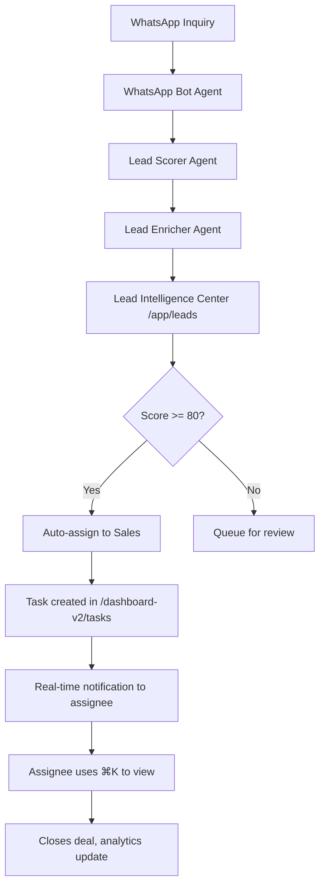

# Dashboard V3 - Next Generation Roadmap
## Evolution from V2 → V3 with New Routes & Advanced AI

**Document Type:** Strategic Roadmap & Planning  
**Scope:** Dashboard V3 Architecture, New Routes, AI Enhancement  
**Status:** Planning Phase  
**Date:** January 1, 2026

---

## 🎯 DASHBOARD V3 - NEXT 5 STEPS

### Strategic Evolution Overview

**Dashboard V2 Status:** ✅ UI Complete (9 screens documented)  
**Dashboard V3 Vision:** Advanced AI-First Platform with Predictive Intelligence  
**Timeline:** Q1-Q2 2026  
**Investment:** High-priority AI + Real-time features

---

## 📋 THE NEXT 5 STEPS

### **STEP 1: Lead Intelligence Center** — `/app/leads` 
**Priority:** 🔥 CRITICAL (Foundation for all AI features)  
**Timeline:** 2-3 weeks  
**Route:** `/app/leads`

#### What It Is
A sophisticated CRM lead management interface with AI-powered scoring, enrichment, and prioritization. This is the central hub where all leads captured via Wizard, WhatsApp, or manual entry are managed.

#### Why It's Critical
- **Feeds all other systems:** Projects, Tasks, Automations depend on lead data
- **AI Training Ground:** Lead Scorer and Enricher agents need production data
- **Revenue Driver:** Proper lead management = higher conversion rates
- **Missing Link:** Currently leads go into void after Wizard completion

#### Core Features
1. **Luxury Table Design (FashionOS)**
   - Maison-style card container (rounded-[40px], p-10)
   - 8 columns: Score (0-100, Playfair text-3xl), Name, Company, Industry, Status, Source, Owner, Date
   - Color-coded score circles: 80-100 emerald, 50-79 amber, 0-49 rose
   - Row height: 64px with generous hover states (bg-gray-50/50)

2. **AI Lead Scoring (Gemini 3 Flash)**
   - Auto-score on lead creation using:
     - Company data (size, industry, funding)
     - Budget signals from Wizard responses
     - Engagement patterns (email opens, website visits)
     - Historical conversion data
   - Display: Large Playfair number (72, 85, 91) in colored circle
   - Rationale: Hover tooltip shows scoring breakdown

3. **Lead Enrichment (Google Search Grounding)**
   - Auto-fill: Industry, company size, location, website
   - LinkedIn company data integration (future)
   - Crunchbase funding data (future)
   - Visual indicator: "Enriched" badge (indigo-50 bg, Sparkles icon)

4. **Smart Filters & Search**
   - Filter pills: All, Hot Leads (80+), Warm (50-79), Cold (<50), Unscored
   - Advanced filters: Industry, Source (Wizard/WhatsApp/Manual), Date range
   - Search bar: Fuzzy search across name, company, notes
   - Saved views: "My Leads", "Unassigned", "This Week"

5. **Quick Actions (Per Row)**
   - Send Proposal (if not sent): Opens Proposal Generator
   - Create Project: Converts lead → project (opens modal)
   - Assign Owner: Team member dropdown
   - View History: Shows activity timeline (emails, calls, notes)

#### AI Agents Involved
- **Lead Scorer (Gemini 3 Flash):** Runs on lead creation, outputs 0-100 score + rationale JSON
- **Lead Enricher (Gemini 3 Flash + Search Grounding):** Enriches company data from public sources
- **Sentiment Monitor (Gemini 3 Flash):** Analyzes communication tone, flags urgency

#### Routes
- `/app/leads` — Main table view
- `/app/leads/[id]` — Lead detail page (future)
- `/app/leads/new` — Manual lead creation form

#### Documentation File
- **Create:** `/docs/dashboard/12-leads.md` (600 lines)
- **Includes:** Table specs, AI scoring logic, enrichment workflows, 3 Mermaid diagrams

---

### **STEP 2: WhatsApp Automation Hub** — `/whatsapp`
**Priority:** 🔥 HIGH (Client-facing automation)  
**Timeline:** 2-3 weeks  
**Route:** `/whatsapp`

#### What It Is
A real-time WhatsApp message management interface with AI-powered auto-replies, lead qualification, and handoff to human agents. Combines chat UI with automation controls.

#### Why It's Important
- **24/7 Lead Capture:** Never miss inquiry (nights, weekends, holidays)
- **Instant Response:** Reply within 2 minutes (current: hours/days)
- **Qualification Automation:** AI qualifies leads before human involvement
- **Client Expectation:** Modern businesses expect WhatsApp support

#### Core Features
1. **Dual-Panel Chat Interface**
   - Left panel (320px): Conversations list (sorted by unread, recent)
   - Center panel (fluid): Active chat thread with messages
   - Right panel (320px): Contact info + AI automation status
   - Design: Chat bubbles with generous padding, Playfair timestamps

2. **WhatsApp Bot Agent (Gemini 3 Pro + Interactions API)**
   - Auto-reply to new inquiries:
     - "Hi! Thanks for reaching out. I'm the AI assistant..."
     - Ask qualifying questions: Budget? Timeline? Requirements?
   - Parse responses with Structured Outputs
   - Create lead record automatically
   - Handoff to human: "A team member will contact you within 2 hours"

3. **Message Templates**
   - Pre-built responses: Greeting, Qualification, Pricing, Follow-up
   - Variable insertion: {first_name}, {company}, {budget_range}
   - One-click send from template library
   - AI suggests best template based on conversation context

4. **Automation Status Card (Right Panel)**
   - Toggle: "Auto-Reply ON/OFF" (emerald/zinc badge)
   - Metrics: "47 inquiries today, 42 qualified by AI, 5 pending review"
   - Last auto-reply: "2 minutes ago to Acme Corp"
   - Quick actions: Pause bot, Edit greeting, View queue

5. **Lead Qualification Flow**
   - AI asks 3-5 questions via WhatsApp:
     - What type of project? (CRM, Website, App)
     - Budget range? (<$10k, $10k-$50k, $50k+)
     - Timeline? (Urgent <1mo, Normal 1-3mo, Flexible 3mo+)
   - Scores lead 0-100 based on responses
   - Creates lead in `/app/leads` with prefilled data
   - Notifies team: "New qualified lead: 85 score"

#### AI Agents Involved
- **WhatsApp Bot (Gemini 3 Pro + Interactions API):** Handles conversations, qualifies leads
- **Lead Scorer (Gemini 3 Flash):** Scores based on WhatsApp responses
- **Sentiment Monitor (Gemini 3 Flash):** Detects frustrated/urgent inquiries

#### Routes
- `/whatsapp` — Main chat interface
- `/whatsapp/settings` — Bot configuration (greeting, questions)
- `/whatsapp/templates` — Message template library

#### Documentation File
- **Create:** `/docs/dashboard/13-whatsapp.md` (650 lines)
- **Includes:** Chat UI specs, bot logic flows, qualification workflows, 4 Mermaid diagrams

---

### **STEP 3: Natural Language Command Bar** — Global `⌘K`
**Priority:** 🔥 HIGH (UX Game-Changer)  
**Timeline:** 2-3 weeks  
**Route:** Global modal overlay (accessible from any page)

#### What It Is
A Spotlight/Raycast-style command palette that lets users query CRM data, navigate, and execute actions using natural language. Powered by Gemini NLP + Function Calling.

#### Why It's Revolutionary
- **Zero Learning Curve:** Users just type what they want ("show my hot leads")
- **Keyboard-First:** Power users love `⌘K` shortcuts (faster than clicking)
- **AI-Powered Search:** Understands intent, not just keywords
- **Unified Interface:** Access everything from one search box

#### Core Features
1. **Glassmorphism Modal (Premium Design)**
   - Trigger: `⌘K` (Cmd+K) or `/` key
   - Backdrop: bg-zinc-900/50, backdrop-blur-lg (strong blur)
   - Modal: 600px width, rounded-[32px], p-0 (no padding, custom inside)
   - Position: Centered, top-[20vh] (slightly above center)
   - Shadow: shadow-2xl with colored glow (indigo-500/20)

2. **Search Input (Luxury Styling)**
   - Height: h-16 (64px, prominent)
   - Icon: Search icon (24px, zinc-400, left side with pl-6)
   - Input: text-lg, font-light, no border, bg-transparent
   - Placeholder: "Search anything... or try 'show hot leads'" (animated examples)
   - Focus: Indigo-500 glow ring (ring-2)

3. **AI Natural Language Parsing (Gemini 3 Flash + Function Calling)**
   - User types: "show my hot leads from last week"
   - AI parses intent:
     - Action: FILTER_LEADS
     - Params: {score: ">80", date_range: "last_7_days", owner: "me"}
   - Executes function call
   - Navigates to: `/app/leads?filter=hot&range=7d&owner=me`

4. **Results Panel (Contextual)**
   - No results: Shows suggested actions (navigation, quick create)
   - Leads found: Preview 5 results (name, score, company) + "View all X leads"
   - Tasks found: Preview 5 tasks with status icons
   - Navigation: "Projects (3)", "Tasks (12)", "Settings" with icons
   - Design: Divided sections, hover bg-indigo-50, keyboard nav (↑↓ arrows)

5. **Quick Actions (Shortcuts)**
   - Create new lead: Type "new lead" → Opens lead form
   - Create task: "new task" → Task creation modal
   - Navigate: "go to projects" → Navigates to `/dashboard-v2/projects`
   - Export data: "export leads" → Triggers export
   - Recent pages: Shows last 5 visited pages at bottom

#### AI Agents Involved
- **RAG Retriever (Gemini 3 Flash + RAG):** Searches internal docs, lead notes, project descriptions
- **Action Orchestrator (Gemini 3 Pro):** Coordinates multi-step actions ("create project for lead ABC")
- **NLP Parser (Gemini 3 Flash):** Understands natural language queries

#### Routes
- Global `⌘K` modal (no dedicated route, overlay on any page)
- Triggers actions that navigate to other routes

#### Example Queries
- "show hot leads" → Navigate to `/app/leads?filter=hot`
- "create task for John" → Open task modal with John pre-assigned
- "projects behind schedule" → Filter `/dashboard-v2/projects` by late status
- "turn off whatsapp bot" → Navigate to `/whatsapp/settings`, disable toggle
- "what did Acme Corp say?" → RAG search conversation history

#### Documentation File
- **Create:** `/docs/dashboard/14-command-bar.md` (550 lines)
- **Includes:** Modal specs, NLP parsing logic, function calling map, 3 Mermaid diagrams

---

### **STEP 4: Real-Time Intelligence Layer** — Backend Enhancement
**Priority:** 🔥 CRITICAL (Powers V3 features)  
**Timeline:** 3-4 weeks  
**Route:** No new routes (backend infrastructure)

#### What It Is
A real-time data synchronization and AI processing layer that makes Dashboard V3 feel alive with live updates, WebSocket connections, and background AI agents.

#### Why It's Essential
- **V2 Limitation:** Static data, requires page refresh to see updates
- **V3 Expectation:** Live updates (like Google Docs, Figma, Linear)
- **AI Requirements:** Agents need real-time triggers (new lead → auto-score immediately)
- **Team Collaboration:** See teammate actions in real-time

#### Core Features
1. **WebSocket Infrastructure**
   - Real-time data sync across all clients
   - Events: Lead created, Task completed, Automation triggered, Message received
   - UI updates: Stats cards animate numbers (count up/down), new rows slide in
   - Technology: Socket.io or Supabase Realtime

2. **Background AI Agent Queue**
   - Redis queue for AI tasks (scoring, enrichment, sentiment analysis)
   - Workers: Process jobs asynchronously (don't block UI)
   - Status tracking: "Lead scoring in progress..." → "Scored: 85"
   - Retry logic: Failed AI calls retry 3x with exponential backoff

3. **Activity Feed System**
   - Global activity log: "John scored 5 leads", "Sarah created task", "Bot replied to 3 inquiries"
   - Real-time updates: New activities appear on Main Dashboard without refresh
   - Filtering: Per user, per project, per time range
   - Storage: Database table + Redis cache for speed

4. **Presence Indicators**
   - Show who's online: Green dot on avatars
   - Show who's viewing: "Maria is viewing this project" (like Figma)
   - Cursor tracking: See teammate cursors on shared screens (future)

5. **Push Notifications**
   - Browser notifications: "New lead: Acme Corp (Score: 92)"
   - Email digests: Daily summary of activity
   - Mobile push: Critical alerts (automation failed, high-score lead)
   - User preferences: Control which notifications in Settings

#### AI Agents Involved (All Triggered Real-Time)
- **Lead Scorer:** Runs within 10 seconds of lead creation
- **Lead Enricher:** Runs immediately after scorer completes
- **Sentiment Monitor:** Analyzes new communications within 1 minute
- **Task Assigner:** Assigns tasks within 5 seconds of creation
- **Workflow Optimizer:** Runs weekly but results appear in real-time

#### Technical Stack
- **WebSockets:** Supabase Realtime or Socket.io
- **Queue:** Bull (Redis-based job queue)
- **Caching:** Redis for activity feed, presence
- **Database:** PostgreSQL with triggers for events
- **AI Processing:** Background workers (Node.js or Python)

#### No New Routes
- This is infrastructure that enhances all existing routes
- Users see faster, live updates across Dashboard V2 and V3

#### Documentation File
- **Create:** `/docs/dashboard/15-realtime-infrastructure.md` (500 lines)
- **Includes:** WebSocket architecture, queue design, presence system, event flows

---

### **STEP 5: AI Analytics & Insights Dashboard** — `/dashboard-v3/insights`
**Priority:** 🟡 MEDIUM-HIGH (Data-driven decision making)  
**Timeline:** 3-4 weeks  
**Route:** `/dashboard-v3/insights`

#### What It Is
A dedicated analytics page that uses AI to surface insights, trends, and predictions across leads, projects, tasks, and automations. Think "Mixpanel meets Tableau with AI commentary."

#### Why It's Valuable
- **Proactive Intelligence:** AI tells you what's important (vs you digging through data)
- **Executive Dashboard:** High-level view for leadership
- **Data-Driven Optimization:** Identify bottlenecks, improve processes
- **Competitive Advantage:** Most CRMs show data, this explains what it means

#### Core Features
1. **AI Insights Cards (Hero Section)**
   - 4-6 large cards (rounded-[40px], p-10, gradient backgrounds)
   - Auto-generated insights:
     - "Lead conversion up 23% this month" (emerald gradient, TrendingUp icon)
     - "5 high-value leads need follow-up" (amber gradient, AlertCircle icon)
     - "Task completion velocity: 1.2x faster than last week" (indigo gradient)
     - "WhatsApp bot handling 78% of inquiries" (purple gradient, Zap icon)
   - AI commentary: "Your team is closing deals faster. Consider increasing lead generation budget."

2. **Interactive Charts (Recharts Library)**
   - Lead funnel: Wizard → Qualified → Proposal Sent → Won (funnel chart)
   - Lead score distribution: Histogram (0-100, color-coded bars)
   - Project timeline: Gantt chart showing all projects on calendar
   - Task velocity: Line chart (tasks completed per day, 30-day trend)
   - Automation performance: Bar chart (triggers per automation, success rate)

3. **AI Trend Detection (Gemini 3 Flash + Deep Research)**
   - Analyzes 30 days of data
   - Detects patterns: "Lead scores dropping on Fridays" (suggest changing bot)
   - Predictions: "Based on current velocity, you'll close 12 projects this quarter"
   - Anomalies: "Unusual spike in WhatsApp inquiries yesterday (47 vs avg 12)"
   - Recommendations: "Consider hiring 1 more developer to meet project deadlines"

4. **Comparison Mode**
   - Time ranges: This week vs last week, This month vs last month
   - Team comparison: "Sarah completed 15% more tasks than average"
   - Automation A/B: Compare two automation variants
   - Visual: Side-by-side cards with delta arrows (↑ +23%, ↓ -8%)

5. **Export & Sharing**
   - Download charts as PNG or PDF
   - Schedule weekly email reports
   - Share insights via link (read-only view)
   - Presentation mode: Full-screen charts for client meetings

#### AI Agents Involved
- **Trend Analyzer (Gemini 3 Pro + Deep Research):** Analyzes patterns, generates insights
- **Predictor (Gemini 3 Flash):** Forecasts future metrics (lead volume, project completion)
- **Recommendation Engine (Gemini 3 Pro):** Suggests actions based on data

#### Routes
- `/dashboard-v3/insights` — Main analytics view
- `/dashboard-v3/insights/leads` — Lead-specific analytics
- `/dashboard-v3/insights/projects` — Project analytics
- `/dashboard-v3/insights/automations` — Automation performance

#### Design System
- Dark mode option (toggle in top-right)
- Gradient cards (indigo-500 → purple-500, emerald-500 → teal-500)
- Playfair Display for large numbers (text-6xl)
- Inter for chart labels (text-xs)
- Generous spacing (gap-8 between cards)

#### Documentation File
- **Create:** `/docs/dashboard/16-insights-analytics.md` (600 lines)
- **Includes:** Chart specs, AI analysis workflows, trend detection logic, 5 Mermaid diagrams

---

## 📊 IMPLEMENTATION PRIORITY MATRIX

| Step | Feature | Route | Effort | Impact | Priority | Timeline |
|------|---------|-------|--------|--------|----------|----------|
| 1 | **Lead Intelligence** | `/app/leads` | High (3w) | Critical | 🔥 P0 | Week 1-3 |
| 2 | **WhatsApp Hub** | `/whatsapp` | High (3w) | High | 🔥 P1 | Week 4-6 |
| 3 | **Command Bar** | Global `⌘K` | Medium (2w) | High | 🔥 P1 | Week 7-8 |
| 4 | **Real-Time Layer** | Backend | High (4w) | Critical | 🔥 P0 | Week 1-4 (parallel) |
| 5 | **AI Insights** | `/dashboard-v3/insights` | High (3w) | Medium | 🟡 P2 | Week 9-11 |

**Total Timeline:** 11 weeks (2.75 months) for all 5 steps  
**Parallelization:** Real-Time Layer built parallel to Step 1-2 (saves 4 weeks)  
**Realistic Delivery:** 8 weeks (2 months) with 2 engineers

---

## 🏗️ DASHBOARD V3 ARCHITECTURE

### New Routes Map

```
Dashboard V3 - New Routes
├── /app/leads                    → Lead Intelligence Center (Step 1)
│   ├── /app/leads/[id]          → Lead detail page
│   ├── /app/leads/new           → Manual lead creation
│   └── /app/leads/import        → CSV import
│
├── /whatsapp                     → WhatsApp Automation Hub (Step 2)
│   ├── /whatsapp/settings       → Bot configuration
│   └── /whatsapp/templates      → Message templates
│
├── ⌘K Global                     → Command Bar (Step 3)
│   └── Modal overlay (no route)
│
└── /dashboard-v3/insights        → AI Analytics Dashboard (Step 5)
    ├── /dashboard-v3/insights/leads
    ├── /dashboard-v3/insights/projects
    └── /dashboard-v3/insights/automations
```

### AI Agents (6 New)

| Agent | Step | Purpose | Model | Status |
|-------|------|---------|-------|--------|
| Lead Scorer | 1 | Score leads 0-100 | Gemini 3 Flash | 🔮 New |
| Lead Enricher | 1 | Enrich company data | Gemini 3 Flash + Search | 🔮 New |
| WhatsApp Bot | 2 | Handle messages | Gemini 3 Pro + Interactions | 🔮 New |
| RAG Retriever | 3 | Search internal docs | Gemini 3 Flash + RAG | 🔮 New |
| Action Orchestrator | 3 | Multi-step actions | Gemini 3 Pro | 🔮 New |
| Trend Analyzer | 5 | Detect patterns | Gemini 3 Pro + Deep Research | 🔮 New |

### Data Flow (V3 Enhancement)



---

## 📁 DOCUMENTATION FILES TO CREATE

### New Docs (5 files)

1. **`12-leads.md`** (600 lines)
   - Lead Intelligence Center specs
   - AI scoring/enrichment workflows
   - Table design, filters, quick actions
   - 3 Mermaid diagrams

2. **`13-whatsapp.md`** (650 lines)
   - WhatsApp chat interface specs
   - Bot conversation flows
   - Template system, automation controls
   - 4 Mermaid diagrams

3. **`14-command-bar.md`** (550 lines)
   - Command palette design
   - NLP parsing logic
   - Function calling map
   - 3 Mermaid diagrams

4. **`15-realtime-infrastructure.md`** (500 lines)
   - WebSocket architecture
   - Queue design, presence system
   - Event flows, performance specs
   - 2 Mermaid diagrams

5. **`16-insights-analytics.md`** (600 lines)
   - Analytics dashboard design
   - Chart specs, AI trend detection
   - Comparison views, export features
   - 5 Mermaid diagrams

**Total:** 2,900 new lines of luxury documentation

---

## 🎨 DESIGN SYSTEM V3 ENHANCEMENTS

### New Components

1. **Glassmorphism Modals**
   - backdrop-blur-lg (stronger blur than V2)
   - bg-white/80 (semi-transparent)
   - shadow-2xl with colored glows
   - Used in: Command Bar, Lead detail modals

2. **Gradient Cards**
   - Linear gradients: indigo-500 → purple-500
   - Used in: AI Insights cards
   - Playfair text-6xl white numbers on gradient

3. **Real-Time Indicators**
   - Pulsing dots (emerald-500 for online)
   - Animated count-up numbers (Stats cards)
   - Slide-in animations for new rows

4. **AI Commentary Boxes**
   - Indigo-50 bg, indigo-500 left border
   - Sparkles icon, italic text
   - "AI suggests..." copy
   - Used in: Insights, Leads, Projects

### Typography Scale (Enhanced)

- **Mega Headlines:** text-6xl (60px) Playfair for Insights dashboard
- **Hero Numbers:** text-5xl (48px) Playfair for lead scores
- **Section Titles:** text-4xl (36px) Playfair (unchanged)
- **Body Text:** text-sm (14px) Inter font-light (unchanged)
- **Micro Labels:** text-[10px] (10px) Inter font-black uppercase tracking-[0.2em] (unchanged)

---

## ✅ ACCEPTANCE CRITERIA (V3 Complete)

### When V3 is "Done"

- [ ] Lead Intelligence page live with AI scoring (Step 1)
- [ ] WhatsApp bot handling inquiries 24/7 (Step 2)
- [ ] Command bar (`⌘K`) accessible from all pages (Step 3)
- [ ] Real-time updates working (no refresh needed) (Step 4)
- [ ] AI Insights dashboard showing trends (Step 5)
- [ ] All 5 new docs published in `/docs/dashboard`
- [ ] 6 new AI agents deployed and tested
- [ ] WebSocket infrastructure stable (99.9% uptime)
- [ ] Performance: Page load <1s, AI responses <3s
- [ ] Mobile responsive (all new routes)
- [ ] Accessibility: WCAG AA (keyboard nav, screen reader)

---

## 🚀 QUICK START GUIDE

### For Product Team
1. Review this roadmap doc (`12-dashboard-v3-roadmap.md`)
2. Prioritize steps (recommend: 1 → 4 → 2 → 3 → 5)
3. Schedule kickoff for Step 1 (Lead Intelligence)

### For Design Team
1. Read detailed docs as created (`12-leads.md` first)
2. Create high-fidelity mockups for each route
3. Design new components (glassmorphism modals, gradient cards)

### For Engineering Team
1. Start Step 4 (Real-Time Layer) immediately (foundational)
2. Build Step 1 (Leads) in parallel (uses real-time layer)
3. Integrate AI agents one-by-one (test in staging)

### For AI/ML Team
1. Set up Gemini API keys (Pro + Flash + Thinking)
2. Implement Lead Scorer agent first (highest ROI)
3. Configure Search Grounding for Lead Enricher
4. Build WhatsApp Bot with Interactions API

---

**STATUS:** 📋 Roadmap Complete, Ready for Team Review  
**Next Action:** Schedule V3 Planning Meeting → Assign Step 1 Owner → Begin Implementation

---

**End of Roadmap Document**
