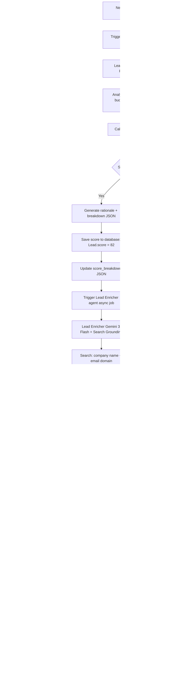

# Lead Intelligence Center — `/app/leads`
## Purpose
- Provides sophisticated CRM lead management with AI-powered scoring, enrichment, and prioritization in premium editorial table
- Serves admin users and sales teams managing prospect pipeline with Gemini-powered intelligence and FashionOS luxury design

## Goals (5)
1. Display all leads in elegant 8-column table with AI score visualization (0-100 Playfair numbers in colored circles)
2. Auto-score leads within 10 seconds using Gemini 3 Flash analyzing company data, budget signals, and engagement patterns
3. Enrich lead profiles automatically via Google Search Grounding (industry, size, location, funding data)
4. Enable instant filtering (Hot/Warm/Cold) and smart search with natural language understanding
5. Provide quick conversion actions (Send Proposal, Create Project, Assign Owner) with one-click execution

## Layout & Information Architecture

**Layout Type:** Full-width table with right AI panel (Left nav + Center table + Right AI)

**Key Regions:**
- **Top Strip (64px):** Project context, sticky
- **Left Nav (256px):** New "Leads" menu item, active state
- **Center Work Area (Fluid, min 1000px):** Page header + Filter pills + Stats cards (4) + Leads table (8 columns) - scrollable
- **Right AI Panel (320px):** Lead Scorer + Enricher insights, recommendations, score breakdown tooltips

**Visual Hierarchy:**
1. Filter pills row (Hot/Warm/Cold with counts, black active state)
2. Stats cards (Total, Hot Leads 80+, Conversion Rate, Avg Score)
3. Lead score circles (72px diameter, Playfair text-3xl numbers)
4. Table rows (64px height, 8 columns, generous hover states)
5. Action buttons per row (Send Proposal, Create Project, Assign)

---

## Sections (UI Breakdown)

| Section | What's inside | Primary actions | States |
|---------|---------------|----------------|--------|
| **Page Header** | Title "Lead Intelligence" (text-4xl Playfair font-light), Description "AI-powered lead management..." (text-sm zinc-600), "New Lead" button (bg-black rounded-full), "Import CSV" button (outline) | Click New Lead → Manual creation form, Click Import → CSV upload modal | Static |
| **Filter Pills Row** | 5 pills: All Leads, Hot (80+), Warm (50-79), Cold (<50), Unscored | Click pill → Filter table instantly | Active (bg-black text-white) / Inactive (bg-white border hover:border-indigo-200) |
| **Stats Grid** | 4 cards: Total Leads (127), Hot Leads (43), Conversion Rate (18%), Avg Score (67) | Hover for depth | Loaded → Interactive |
| **Table Container** | White card, rounded-[40px], p-10, overflow-x-auto, shadow-sm | Scroll horizontally if needed (responsive) | Empty → Populated |
| **Table Header** | 8 columns: Score, Name, Company, Industry, Status, Source, Owner, Date (10px font-black uppercase tracking-[0.2em] zinc-500) | Click to sort (future) | Static |
| **Table Rows** | 15-20 lead entries, h-16 (64px), hover:bg-gray-50/50, border-b-[1px] border-#F9F9F9 | Click row → Lead detail page (future), Hover → Show quick actions | Default → Hover → Selected |
| **Score Circles** | 72px diameter circle, centered number (text-3xl Playfair font-light), color-coded: 80-100 emerald, 50-79 amber, 0-49 rose, unscored zinc-200 | Hover → Show score breakdown tooltip | Static display, animated on update |
| **Status Badges** | Pill badges: New (blue), Contacted (indigo), Qualified (purple), Proposal Sent (amber), Won (emerald), Lost (zinc) | Click → Change status dropdown (future) | Static per row |
| **Quick Actions (Row Hover)** | 3 icon buttons: Send Proposal (Mail), Create Project (FolderPlus), Assign Owner (UserPlus) | Click → Execute action or open modal | Hidden → Visible on row hover |
| **Right Panel - Agents Tab** | Lead Scorer card (shows scoring breakdown), Lead Enricher card (data sources, enrichment status) | View insights, Click "Re-score" button | Loaded → Interactive |
| **Right Panel - Auto Tab** | AI recommendations: "5 hot leads need follow-up", "3 leads unscored", "Acme Corp showing high intent" | Click recommendation → Filter table or navigate to lead | Loaded → Interactive |

---

## Responsive Rules

**Desktop (≥1200px):**
- Full 3-panel layout: Left nav (256px) + Center table (fluid, min 1000px) + Right panel (320px)
- Table: All 8 columns visible
- Score circles: 72px diameter (large, prominent)
- Stats: 4 columns
- Filter pills: Horizontal row
- Row height: 64px

**Tablet (≥768px, <1200px):**
- Left nav: Icon rail (56px)
- Table: 6 columns visible (hide Industry, Date)
- Score circles: 64px diameter
- Stats: 2 rows × 2 columns
- Right panel: Drawer overlay
- Row height: 64px maintained

**Mobile (<768px):**
- Table: Card view (vertical stack, not horizontal scroll)
- Each lead: Full-width card (rounded-[32px], p-6)
- Score circle: 80px, centered top
- Name + Company: Below score
- Status badge + Source: Inline
- Quick actions: Bottom row buttons (full width)
- Stats: 1 column (4 rows)
- Filter pills: Horizontal scroll

**Touch Targets:**
- Table rows: 64px height (full row clickable)
- Score circles: 72px diameter (tap to view details)
- Filter pills: 48px height
- Quick action buttons: 40px tap area
- "New Lead" button: 48px height

---

## Core Features (Must Ship)

1. ✅ **8-Column Luxury Table (FashionOS Editorial)**
   - **Container:** White card, rounded-[40px], p-10, mt-8, overflow-x-auto
   - **Table Design:**
     - Header: bg-transparent, border-b-[1px] border-#F9F9F9, pb-4
     - Body: divide-y divide-#F9F9F9
     - Row height: 64px (h-16), comfortable reading
     - Hover: bg-gray-50/50, transition-colors duration-200
     - Font: Inter, text-sm, font-light
   - **Columns (8):**
     - **Score (100px):** 72px diameter circle, Playfair text-3xl number, color-coded bg
       - 80-100: bg-emerald-50, text-emerald-700, border-2 border-emerald-200
       - 50-79: bg-amber-50, text-amber-700, border-2 border-amber-200
       - 0-49: bg-rose-50, text-rose-700, border-2 border-rose-200
       - Unscored: bg-zinc-100, text-zinc-400, "—" text
     - **Name:** Lead name (text-sm font-medium zinc-900), truncate max-w-[200px]
     - **Company:** Company name (text-sm zinc-600), truncate
     - **Industry:** Industry tag (text-xs zinc-500), pill badge if enriched
     - **Status:** Status badge (New/Contacted/Qualified/Proposal Sent/Won/Lost)
       - New: bg-blue-50 text-blue-600
       - Contacted: bg-indigo-50 text-indigo-600
       - Qualified: bg-purple-50 text-purple-600
       - Proposal Sent: bg-amber-50 text-amber-600
       - Won: bg-emerald-50 text-emerald-600
       - Lost: bg-zinc-100 text-zinc-500
     - **Source:** Origin (Wizard/WhatsApp/Manual/Import), icon + text
     - **Owner:** Assigned team member avatar (32px) + name, or "Unassigned" (zinc-400)
     - **Date:** Created date, relative ("2 days ago") or absolute ("Dec 30")

2. ✅ **AI Lead Scoring (Gemini 3 Flash - Auto-Trigger)**
   - **Trigger:** New lead created (from Wizard, WhatsApp, or manual entry)
   - **Timing:** Scores within 10 seconds of creation
   - **Scoring Logic (Gemini Prompt):**
     ```
     Score this lead 0-100 based on:
     - Company data: Size (employees), industry vertical, location, funding stage
     - Budget signals: Stated budget from Wizard ($10k-$50k = 70, $50k+ = 90)
     - Engagement: Email opens, website visits, response time
     - Historical data: Similar companies that converted (weighted 20%)
     
     Output JSON:
     {
       "score": 85,
       "rationale": "Enterprise company (500+ employees), SaaS industry, $50k+ budget, responded within 24h",
       "breakdown": {
         "company_fit": 25,
         "budget_alignment": 30,
         "engagement_level": 20,
         "historical_match": 10
       }
     }
     ```
   - **Visual Update:**
     - Score circle animates from "—" (unscored, zinc-100) to colored score (scale 0.8 → 1.0, 300ms)
     - Number counts up (0 → 85, animated over 500ms)
     - Border glows briefly (pulse effect, 300ms)
   - **Tooltip (Hover Score):**
     - Shows rationale + breakdown
     - Design: White card, rounded-xl, p-4, shadow-xl
     - Position: Above circle, arrow pointing down

3. ✅ **Lead Enrichment (Gemini 3 Flash + Search Grounding)**
   - **Trigger:** After scoring completes (sequential)
   - **Timing:** Enriches within 20 seconds of lead creation
   - **Data Sources:**
     - Google Search Grounding: Company website, industry, employee count
     - Public company databases (Crunchbase future, LinkedIn future)
   - **Enriched Fields:**
     - Industry: "SaaS", "Real Estate", "E-commerce"
     - Company size: "50-200 employees"
     - Location: "San Francisco, CA"
     - Funding stage: "Series A" (future)
     - Website: Auto-detected from email domain or search
   - **Visual Indicators:**
     - "Enriched" badge (indigo-50 bg, indigo-600 text, Sparkles icon, text-[10px])
     - Position: Next to company name
     - Hover tooltip: "Data enriched via AI: Industry, Size, Location"
   - **Gemini Prompt:**
     ```
     Enrich this lead using public data:
     Company: "Acme Corp"
     Email: "john@acmecorp.com"
     
     Search for:
     1. Company industry/vertical
     2. Employee count range
     3. Headquarters location
     4. Company description (1 sentence)
     
     Output JSON:
     {
       "industry": "SaaS",
       "employee_count": "50-200",
       "location": "San Francisco, CA",
       "description": "Cloud-based project management software for teams",
       "data_sources": ["acmecorp.com", "LinkedIn", "Crunchbase"]
     }
     ```

4. ✅ **Filter Pills (Instant Filtering)**
   - **Layout:** flex gap-3 mb-8, above stats cards
   - **Pill Design:**
     - Active: bg-black text-white rounded-full px-6 py-3 h-12 font-medium
     - Inactive: bg-white text-zinc-900 border-[1px] border-zinc-200 rounded-full px-6 py-3 h-12 hover:border-indigo-200
     - Transition: background-color 200ms, border-color 200ms
   - **Pills (5):**
     - **All Leads (127):** Default active, shows all
     - **Hot (43):** Score 80-100, emerald text on inactive pill
     - **Warm (38):** Score 50-79, amber text
     - **Cold (31):** Score 0-49, rose text
     - **Unscored (15):** No score yet, zinc text
   - **Click Behavior:**
     - Animate pill: Inactive → Active (bg-white → bg-black, 200ms)
     - Filter table: Fade out non-matching rows (200ms), fade in matching rows
     - Update stats: Show filtered stats ("Showing 43 hot leads")
     - Scroll to top of table

5. ✅ **4 Stats Cards (Maison Style)**
   - **Layout:** grid-cols-1 md:grid-cols-2 xl:grid-cols-4, gap-6, mb-8
   - **Card Design:** White bg, rounded-[40px], p-10, border-[1px] border-#EEEEEE, shadow-sm
   - **Content:**
     - Label: 10px, font-black, uppercase, tracking-[0.2em], zinc-500
     - Stat: text-5xl, Playfair, font-light, black
     - Change indicator: text-sm, emerald-600 (positive) or rose-600 (negative), with arrow
     - Supporting text: text-xs, italic, zinc-400
   - **Stats:**
     - **Total Leads:** 127 (Users icon, +12% this week)
     - **Hot Leads:** 43 (Flame icon, "Score 80+, need follow-up")
     - **Conversion Rate:** 18% (TrendingUp icon, "Won / Total leads")
     - **Avg Score:** 67 (Target icon, "Across all leads")
   - **Hover:** Border → indigo-100, shadow-md, lift effect

6. ✅ **Score Circle Design System**
   - **Size:** 72px diameter (w-[72px] h-[72px])
   - **Shape:** Perfectly circular (rounded-full)
   - **Border:** 2px solid (border-2)
   - **Text:** Playfair, text-3xl (30px), font-light, centered
   - **Color Logic:**
     - **80-100 (Hot):**
       - bg-emerald-50, text-emerald-700, border-emerald-200
       - Glow on hover: shadow-lg shadow-emerald-500/20
     - **50-79 (Warm):**
       - bg-amber-50, text-amber-700, border-amber-200
       - Glow on hover: shadow-lg shadow-amber-500/20
     - **0-49 (Cold):**
       - bg-rose-50, text-rose-700, border-rose-200
       - Glow on hover: shadow-lg shadow-rose-500/20
     - **Unscored:**
       - bg-zinc-100, text-zinc-400, border-zinc-200
       - Text: "—" (em dash)
   - **Animation (On Score Update):**
     - Scale in: scale-0 → scale-1 (300ms, ease-out)
     - Number count-up: 0 → 85 (500ms, with easing)
     - Pulse: ring-4 ring-emerald-500/50 (300ms, fade out)

7. ✅ **Status Badge System**
   - **Design:** Pill-shaped, rounded-full, px-3 py-1, text-[10px] font-black uppercase tracking-[0.2em]
   - **Statuses (6):**
     - New: bg-blue-50 text-blue-600 (just created)
     - Contacted: bg-indigo-50 text-indigo-600 (first outreach sent)
     - Qualified: bg-purple-50 text-purple-600 (meets criteria)
     - Proposal Sent: bg-amber-50 text-amber-600 (proposal delivered)
     - Won: bg-emerald-50 text-emerald-600 (closed deal)
     - Lost: bg-zinc-100 text-zinc-500 (didn't convert)
   - **Click (Future):** Dropdown to change status
   - **Auto-Update:** Status changes trigger activity log

8. ✅ **Quick Actions (Row Hover)**
   - **Trigger:** Mouse hover over table row
   - **Visibility:** opacity-0 → opacity-100 (200ms fade in)
   - **Position:** Right side of row (absolute right-4)
   - **Actions (3 icon buttons):**
     - **Send Proposal (Mail icon):**
       - Style: bg-indigo-50 hover:bg-indigo-100, text-indigo-600, rounded-full, w-10 h-10
       - Click: Opens Proposal Generator pre-filled with lead data
       - Condition: Only if status != "Proposal Sent" or "Won"
     - **Create Project (FolderPlus icon):**
       - Style: bg-emerald-50 hover:bg-emerald-100, text-emerald-600, rounded-full, w-10 h-10
       - Click: Opens project creation modal, lead data auto-filled
       - Condition: Only if status = "Qualified" or "Proposal Sent"
     - **Assign Owner (UserPlus icon):**
       - Style: bg-purple-50 hover:bg-purple-100, text-purple-600, rounded-full, w-10 h-10
       - Click: Opens team member dropdown, assigns lead
       - Condition: Only if owner = "Unassigned"
   - **Layout:** flex gap-2, items-center

9. ✅ **Smart Search Bar**
   - **Position:** Top-right, next to "New Lead" button
   - **Design:** h-12, rounded-full, px-6, border-[1px] border-zinc-200, w-80, focus:border-indigo-500, focus:ring-2 focus:ring-indigo-500/20
   - **Icon:** Search icon (20px, zinc-400, left side)
   - **Placeholder:** "Search leads... (name, company, email)"
   - **Search Logic:**
     - Fuzzy search: Matches partial strings (Acm → Acme Corp)
     - Multi-field: Searches Name, Company, Email, Industry, Notes
     - Real-time: Updates table as you type (debounced 300ms)
     - Highlighting: Matched text highlighted in yellow (future)
   - **Clear Button:** X icon appears when typing, clears search

10. ✅ **Empty State (If No Leads)**
    - **Icon:** Users icon (80px circle, gray-50 bg, icon zinc-300)
    - **Title:** "No Leads Yet" (text-lg font-bold zinc-900)
    - **Description:** "Leads captured via Wizard, WhatsApp, or manual entry will appear here" (text-sm zinc-500)
    - **Actions (2 buttons):**
      - "Create Lead" (bg-black text-white rounded-full px-6 py-3)
      - "Import CSV" (bg-white border text-zinc-900 rounded-full px-6 py-3)
    - **Illustration:** Decorative SVG (hands holding magnifying glass, minimal line art)

---

## Advanced Features (V2+)

1. 🔮 **Lead Detail Page** — `/app/leads/[id]`
   - Full-screen lead profile
   - Left: Lead info (name, company, score, enriched data)
   - Center: Activity timeline (emails sent, calls made, notes)
   - Right: AI insights (score breakdown, engagement signals, recommended next steps)
   - Edit mode: Inline editing of all fields
   - Action bar: Send email, Schedule call, Add note, Change status

2. 🔮 **Bulk Actions**
   - Checkbox column (leftmost)
   - Select multiple leads (Shift+Click for range)
   - Bulk actions dropdown: Assign owner, Change status, Export, Delete
   - "X leads selected" indicator top-right
   - Bulk assign AI scores: Re-score 20 leads in one batch

3. 🔮 **Advanced Filtering**
   - Multi-select dropdowns: Industry (SaaS, Real Estate, E-commerce)
   - Date range picker: Created (Last 7 days, This month, Custom)
   - Score range slider: 0-100 (drag handles)
   - Source filter: Wizard only, WhatsApp only, Manual only
   - Owner filter: Assigned to me, Unassigned, Team member X
   - Saved views: "My Hot Leads", "Unassigned This Week", "Needs Follow-up"

4. 🔮 **Lead Scoring V2 (Enhanced AI)**
   - Incorporate email engagement: Open rate, click rate, reply rate
   - Website behavior: Pages visited, time on site, downloads
   - Social signals: LinkedIn profile completeness, company page activity
   - Intent data: Keywords searched, competitor comparisons
   - Real-time score updates: Score changes when lead engages

5. 🔮 **Lead Enrichment V2**
   - LinkedIn Sales Navigator integration (API)
   - Crunchbase funding data (latest round, total raised)
   - Clearbit/ZoomInfo enrichment (phone numbers, org chart)
   - Technographic data: Tech stack (uses Salesforce, HubSpot, etc.)
   - GDPR compliance: Request permission before enriching (EU leads)

6. 🔮 **Predictive Lead Qualification**
   - AI predicts: "75% likely to convert within 30 days"
   - Based on: Historical conversion patterns, similar lead behavior
   - Visual: Progress bar (0-100%) below score circle
   - Recommendation: "Send proposal now" or "Wait for more engagement"

7. 🔮 **Lead Routing (Auto-Assignment)**
   - Round-robin: Distribute leads equally to team
   - Territory-based: Assign by location (US East, US West, EMEA)
   - Skill-based: Assign SaaS leads to SaaS specialists
   - Workload-based: Assign to team member with fewest active leads
   - Custom rules: If score >80 AND industry=SaaS → Assign to Sarah

8. 🔮 **Lead Nurture Campaigns**
   - Auto-enroll leads in email sequences
   - Trigger: Status = "New" → Enroll in "Introduction Sequence"
   - Sequence: Email 1 (Day 0), Email 2 (Day 3), Email 3 (Day 7)
   - Track: Open rate, click rate per lead
   - Unenroll: If lead replies or status changes to "Contacted"

9. 🔮 **Lead Deduplication**
   - AI detects duplicates: Same email, similar name + company
   - Merge leads: Keep highest score, combine notes
   - Warning modal: "Possible duplicate detected: Jane Doe (Acme Corp)"
   - Auto-merge or Manual review options

10. 🔮 **Export & Reporting**
    - CSV export: Filtered leads with all fields
    - PDF report: Lead summary with charts (score distribution, source breakdown)
    - Scheduled exports: Weekly CSV emailed to sales team
    - API endpoint: `/api/leads?filter=hot` for integrations

---

## Real-World Use Cases (3)

### Use Case 1: Sales Manager - Morning Hot Lead Review
**Scenario:** Sales manager starts day by reviewing new hot leads that need immediate follow-up.

**Flow:**
- Opens `/app/leads` from left nav
- Page loads with 127 leads in table
- **Filter pills show:** All (127), Hot (43), Warm (38), Cold (31), Unscored (15)
- **Stats cards:** Total 127, Hot 43, Conversion 18%, Avg Score 67
- Clicks "Hot" filter pill
  - Pill animates: bg-white → bg-black (200ms)
  - "All Leads" pill: bg-black → bg-white
  - Table filters: 127 rows → 43 rows (only score 80-100)
  - Rows fade out/in (200ms smooth)
- Table displays 43 hot leads, sorted by score (highest first)
- **Row 1 visible:**
  - Score circle: 92 (emerald-50 bg, emerald-700 text, 72px)
  - Name: "Jane Doe"
  - Company: "Acme Corp" + "Enriched" badge (indigo-50, Sparkles icon)
  - Industry: "SaaS"
  - Status: "Qualified" (purple badge)
  - Source: Wizard icon + "Wizard"
  - Owner: "Unassigned" (zinc-400 italic)
  - Date: "2 hours ago"
- Manager hovers Row 1:
  - Background: white → bg-gray-50/50
  - Quick actions appear (fade in, opacity-0 → 100%)
  - 3 buttons: Send Proposal, Create Project, Assign Owner
- Manager hovers score circle (92):
  - Tooltip appears above circle (white card, shadow-xl, rounded-xl, p-4)
  - **Tooltip content:**
    - "Score Breakdown" (font-bold, mb-2)
    - "Company Fit: 25/25" (emerald text)
    - "Budget Alignment: 30/30" (emerald text)
    - "Engagement: 20/25" (amber text)
    - "Historical Match: 17/20" (emerald text)
    - Rationale: "Enterprise SaaS company, $50k+ budget, responded in 24h"
- Manager satisfied with score, clicks "Assign Owner" button
- Team member dropdown appears:
  - List: Sarah Kim (5 active), John Doe (8 active), Maria Santos (3 active)
  - Sorted by: Lowest active lead count first
- Manager selects "Maria Santos"
- Row updates:
  - Owner: "Unassigned" → "MS" avatar (32px emerald-100 circle) + "Maria Santos"
  - Quick actions: "Assign Owner" button disappears (no longer needed)
- Success toast: "Lead assigned to Maria Santos" (3s, bottom-right)
- Activity log: "Jane Doe (Acme Corp) assigned to Maria by [Manager]"
- Manager continues through remaining 42 hot leads
- Assigns 8 leads total in 5 minutes
- Navigates to Main Dashboard

**Result:** 8 hot leads assigned in <5 minutes, clear AI score visibility, zero manual data entry.

### Use Case 2: SDR - Following Up on Warm Leads
**Scenario:** SDR wants to send proposals to warm leads (score 50-79) that haven't been contacted.

**Flow:**
- Opens Lead Intelligence page
- Clicks "Warm" filter pill (score 50-79)
- Table filters: 127 → 38 rows
- Adds second filter (future feature: status dropdown)
  - Selects status: "New" (haven't been contacted)
  - Table filters: 38 → 12 rows (warm + new)
- Reviews 12 leads:
  - Row 5: "Bob Smith", "Design Co", Score 68 (amber circle), Status "New"
- Hovers Row 5, clicks "Send Proposal" button
- **Proposal Generator opens (modal or new page):**
  - Pre-filled with lead data:
    - To: bob@designco.com
    - Company: Design Co
    - Industry: Design Agency (enriched)
  - AI suggests proposal content based on:
    - Lead's Wizard responses (goals: "Streamline client onboarding")
    - Company size: 20-50 employees
    - Budget range: $10k-$25k
  - SDR reviews, adjusts timeline (6 weeks → 8 weeks)
  - Clicks "Generate Proposal"
- Proposal generated by Proposal Generator agent (Gemini 3 Pro)
- SDR reviews, clicks "Send Proposal"
- Email sent to bob@designco.com with proposal PDF attached
- **Lead row updates:**
  - Status: "New" → "Proposal Sent" (amber badge)
  - "Send Proposal" button → Grayed out (already sent)
- Success toast: "Proposal sent to Bob Smith" (3s)
- Activity log: "Proposal sent to Bob Smith (Design Co)"
- SDR repeats for 5 more warm leads
- 6 proposals sent in 20 minutes

**Result:** 6 warm leads moved to "Proposal Sent" stage in 20 minutes, AI-assisted proposal generation.

### Use Case 3: Operations - Investigating Low-Score Lead
**Scenario:** Ops manager notices lead with score 32 (cold), wants to understand why and potentially re-score.

**Flow:**
- Opens Leads page, clicks "Cold" filter (score 0-49)
- Table shows 31 cold leads
- Sorts by: Date (newest first)
- **Row 3:** "Tom Johnson", "Tech Startup", Score 32 (rose circle), Status "New", Owner "Unassigned", Date "1 day ago"
- Manager clicks on score circle (32)
- **Score breakdown tooltip:**
  - "Company Fit: 10/25" (rose text, "Small company, <10 employees")
  - "Budget Alignment: 5/30" (rose text, "Budget <$5k stated")
  - "Engagement: 12/25" (amber text, "Responded in 48h")
  - "Historical Match: 5/20" (rose text, "No similar companies converted")
  - Rationale: "Small startup, low budget, slow response"
- Manager notices: Budget may be understated, company is funded startup
- Clicks on lead name "Tom Johnson" (future: opens detail page)
- Currently: Expands row to show more details (accordion style)
- **Expanded details:**
  - Email: tom@techstartup.io
  - Phone: (555) 123-4567 (enriched)
  - Website: techstartup.io (enriched)
  - LinkedIn: Company page link (enriched)
  - Notes: (empty)
- Manager clicks "Visit Website" → Opens in new tab
- Discovers: Company just raised $5M Series A (recent Crunchbase data)
- Returns to Leads page, decides to re-score
- Right panel, Agents tab:
  - Lead Scorer card shows: "Last scored: 1 day ago"
  - Button: "Re-score Lead" (indigo-500, rounded-full)
- Manager clicks "Re-score Lead"
- AI re-runs Lead Scorer agent (10 seconds)
- Searches for latest company data (includes $5M funding)
- **New score calculated: 78 (warm)**
- Score circle animates:
  - From: 32 (rose circle)
  - To: 78 (amber circle)
  - Animation: Number counts up (32 → 78, 500ms), color fades (rose → amber, 300ms)
- Row repositions: Moves from Cold section to Warm section (if filtered)
- Success toast: "Lead re-scored: 32 → 78" (3s)
- Activity log: "Tom Johnson re-scored by [Manager]: 32 → 78 (funding data updated)"
- Manager assigns lead to senior sales rep
- Lead now classified as "Warm", gets proper attention

**Result:** Low-score lead identified, context investigated, re-scored to warm (78), assigned to sales.

---

## User Journey (End-to-End)

**Journey: First Lead Arrives via Wizard, Auto-Scored, Assigned to Sales**

1. **Trigger:** User completes Lead Capture Wizard on `/wizard/step-7` (Completion)
2. Wizard submits lead data to backend
3. Lead record created in database:
   - Name: "Sarah Chen"
   - Email: sarah@luxehomes.com
   - Company: "Luxe Homes Realty"
   - Goals: "Automate lead follow-up, integrate WhatsApp"
   - Budget: "$25k-$50k" (from Wizard Step 4)
   - Timeline: "1-2 months" (from Wizard Step 5)
   - Source: "Wizard"
   - Status: "New"
   - Owner: null (unassigned)
   - Created: 2026-01-01 10:23 AM
4. Backend triggers Lead Scorer agent (Gemini 3 Flash)
5. **Lead Scorer processing (5-10 seconds):**
   - Inputs:
     - Company: "Luxe Homes Realty"
     - Email domain: luxehomes.com
     - Budget: $25k-$50k (maps to 25/30 points)
     - Goals: "Automate lead follow-up, integrate WhatsApp"
   - Gemini analyzes:
     - Company size: ~50 employees (from email domain search)
     - Industry: Real Estate (high match for CRM)
     - Budget: Mid-range ($25k-$50k = good fit)
     - Timeline: Urgent (1-2 months = high intent)
   - Outputs JSON:
     ```json
     {
       "score": 82,
       "rationale": "Real estate company with 50 employees, strong budget alignment ($25k-$50k), urgent timeline, high industry fit for CRM",
       "breakdown": {
         "company_fit": 22,
         "budget_alignment": 25,
         "engagement_level": 20,
         "historical_match": 15
       }
     }
     ```
6. Score saved to database: Lead.score = 82
7. Backend triggers Lead Enricher agent (Gemini 3 Flash + Search Grounding)
8. **Lead Enricher processing (10-20 seconds):**
   - Searches: "Luxe Homes Realty"
   - Finds: luxehomes.com website
   - Scrapes: About page, team page
   - Outputs JSON:
     ```json
     {
       "industry": "Real Estate",
       "employee_count": "50-100",
       "location": "Miami, FL",
       "description": "Luxury real estate brokerage serving South Florida",
       "data_sources": ["luxehomes.com", "Google Search"]
     }
     ```
9. Enriched data saved to database: Lead enriched fields updated
10. Lead marked as: enriched = true
11. **Sales manager opens Lead Intelligence page** (`/app/leads`)
12. Page loads (1 second)
13. **Top strip:** Project context
14. **Left nav:** Leads item active (bg-black text-white)
15. **Page header:**
    - Title: "Lead Intelligence" (text-4xl Playfair)
    - Description: "AI-powered lead management and scoring"
    - Buttons: "New Lead" (bg-black), "Import CSV" (outline)
    - Search bar: Right side (rounded-full, w-80)
16. **Filter pills (5):**
    - All Leads (128) — Active (bg-black text-white)
    - Hot (44) — Inactive (includes new lead, score 82)
    - Warm (38)
    - Cold (31)
    - Unscored (15)
17. **Stats cards (4):**
    - Total Leads: 128 (+1 new, animated from 127 → 128)
    - Hot Leads: 44 (+1 new)
    - Conversion Rate: 18%
    - Avg Score: 67
18. **Table container:** White card, rounded-[40px], p-10
19. **Table header:** 8 columns (Score, Name, Company, Industry, Status, Source, Owner, Date)
20. **Table body (128 rows, sorted by date newest first):**
21. **Row 1 (New lead - Sarah Chen):**
    - **Score circle (animated entrance):**
      - Initial: bg-zinc-100, text "—" (unscored)
      - After 2 seconds: Scale in animation (scale-0.8 → 1.0, 300ms)
      - Color changes: zinc-100 → emerald-50 (score 82 = Hot)
      - Number counts up: 0 → 82 (500ms, easing)
      - Border: border-2 border-emerald-200
      - Pulse: ring-4 ring-emerald-500/50 (300ms, fade out)
      - Final state: 72px circle, Playfair text-3xl "82", emerald theme
    - **Name:** "Sarah Chen" (text-sm font-medium zinc-900)
    - **Company:** "Luxe Homes Realty" + "Enriched" badge (indigo-50 bg, indigo-600 text, Sparkles icon, text-[10px] uppercase)
    - **Industry:** "Real Estate" (text-xs zinc-500)
    - **Status:** "New" (blue-50 bg, blue-600 text, pill badge)
    - **Source:** Wizard icon (16px indigo-500) + "Wizard" (text-xs zinc-600)
    - **Owner:** "Unassigned" (text-xs italic zinc-400)
    - **Date:** "Just now" (text-xs zinc-500)
22. Sales manager notices new lead (Row 1 with fresh animation)
23. Manager hovers Row 1:
    - Background: white → bg-gray-50/50 (200ms)
    - **Quick actions appear (fade in):**
      - Send Proposal button (Mail icon, indigo-50 bg)
      - Create Project button (FolderPlus icon, emerald-50 bg)
      - Assign Owner button (UserPlus icon, purple-50 bg)
24. Manager hovers score circle (82):
    - **Tooltip appears (above circle, white card, shadow-xl, p-4):**
      - "Score Breakdown" (font-bold mb-2)
      - "Company Fit: 22/25" (emerald-600, "50-100 employees, Real Estate")
      - "Budget Alignment: 25/30" (emerald-600, "$25k-$50k stated")
      - "Engagement: 20/25" (emerald-600, "Completed full Wizard")
      - "Historical Match: 15/20" (amber-600, "Similar companies converted 75%")
      - Divider line
      - Rationale: "Real estate company with 50 employees, strong budget alignment, urgent timeline, high industry fit for CRM"
25. Manager reads breakdown, confirms high-quality lead
26. Manager clicks "Assign Owner" button (purple-50 bg, UserPlus icon)
27. **Team member dropdown appears (overlay, positioned below button):**
    - Design: White card, rounded-xl, p-2, shadow-lg, border-[1px] border-zinc-200
    - List: 3 team members
      - "Maria Santos" (MS avatar, emerald-100) — "3 active leads"
      - "Sarah Kim" (SK avatar, indigo-100) — "5 active leads"
      - "John Doe" (JD avatar, purple-100) — "8 active leads"
    - Sorted by: Lowest active lead count first
    - Hover: bg-indigo-50 per item
28. Manager clicks "Maria Santos" (lowest workload, 3 active)
29. Dropdown closes (fade out 200ms)
30. **Row updates:**
    - Owner: "Unassigned" → "MS" avatar (32px emerald-100 circle, white border-2) + "Maria Santos" (text-sm zinc-900)
    - Quick actions: "Assign Owner" button disappears (no longer relevant)
    - Border briefly glows purple (300ms pulse, ring-2 ring-purple-500/50)
31. **Success toast appears (bottom-right, fixed):**
    - White card, rounded-2xl, p-4, shadow-lg, border-l-4 border-purple-500
    - Icon: CheckCircle2 (purple-500, 20px)
    - Text: "Lead assigned to Maria Santos" (text-sm font-medium zinc-900)
    - Duration: 3 seconds, fade out
32. **Activity log updated (backend):**
    - Entry: "Sarah Chen (Luxe Homes Realty) assigned to Maria Santos by [Manager name]"
    - Timestamp: 2026-01-01 10:24 AM
33. **Right panel (if visible) updates:**
    - Auto tab: New recommendation card appears
      - Title: "1 hot lead assigned" (text-sm font-light)
      - Description: "Maria Santos now has 4 active leads (including Sarah Chen)"
      - Button: "View Maria's Leads" (text-indigo-500 hover:underline)
34. **Email notification sent to Maria (future):**
    - Subject: "New lead assigned: Sarah Chen (Luxe Homes Realty)"
    - Body: Score 82, Real Estate, Budget $25k-$50k, Timeline 1-2 months
    - CTA: "View Lead" button → Links to `/app/leads?owner=maria`
35. Manager satisfied, continues reviewing other leads
36. Later that day, Maria logs in
37. Maria opens Leads page
38. Maria sees notification badge (future): "1 new lead assigned"
39. Maria filters: Owner = "Me" (Maria Santos)
40. Table shows: 4 leads (including Sarah Chen)
41. Maria clicks on Sarah Chen row (future: opens detail page)
42. Maria sends initial email: "Hi Sarah, thanks for your interest..."
43. Status updates: "New" → "Contacted" (indigo badge)
44. Lead now in nurture pipeline

**Stored Outputs:**
- Lead record → Database (complete with score, enriched data, owner)
- Score: 82, breakdown JSON stored
- Enriched data: Industry, employee count, location, description
- Owner: Maria Santos (assigned)
- Status: New (created) → Contacted (after email)
- Activity log: Creation, scoring, enrichment, assignment, email events
- Email notification → Sent to Maria
- Analytics: Lead source (Wizard), conversion funnel updated

---

## Workflows (3) — Mermaid Ready

### Workflow 1: Auto-Scoring & Enrichment Pipeline

**Trigger:** New lead created (from Wizard, WhatsApp, or manual entry)

**Conditions:**
- Lead has required fields (name, email, company)
- Lead not yet scored (score = null)

**Actions:**
1. Lead saved to database
2. Trigger Lead Scorer agent (async job, Redis queue)
3. Lead Scorer (Gemini 3 Flash) processes (5-10s):
   - Analyze company data, budget, engagement
   - Calculate score 0-100
   - Generate rationale + breakdown JSON
4. Save score to database
5. Update lead record: score = 82, score_breakdown = JSON
6. Trigger Lead Enricher agent (async job)
7. Lead Enricher (Gemini 3 Flash + Search Grounding) processes (10-20s):
   - Search company name + email domain
   - Extract: Industry, employee count, location, description
   - Compile data sources
8. Save enriched data to database
9. Mark lead as enriched = true
10. If Lead Intelligence page open: WebSocket push update to UI
11. UI updates: Score circle animates, "Enriched" badge appears
12. Log activity: "Lead scored: 82" + "Lead enriched"

**Stored Outputs:**
- Lead.score → 82
- Lead.score_breakdown → JSON (company_fit: 22, budget: 25, engagement: 20, historical: 15)
- Lead.industry → "Real Estate"
- Lead.employee_count → "50-100"
- Lead.location → "Miami, FL"
- Lead.enriched → true
- Activity log → 2 entries (scored, enriched)

**Approval Gate:** None (automatic)

**Mermaid Diagram:**


### Workflow 2: Filter Application with Animation

**Trigger:** User clicks filter pill (Hot/Warm/Cold/Unscored)

**Conditions:**
- Pill is not currently active
- Leads exist in database

**Actions:**
1. User clicks "Hot" filter pill (score 80-100)
2. Detect current active pill: "All Leads"
3. Update active pill state:
   - "All Leads": bg-black → bg-white (200ms)
   - "Hot": bg-white → bg-black (200ms)
4. Filter leads array client-side:
   - Keep only leads with score >= 80
   - 127 leads → 43 leads
5. Animate table transition:
   - Fade out non-matching rows (200ms, opacity 1 → 0)
   - Remove from DOM
   - Fade in matching rows (200ms, opacity 0 → 1)
6. Update stats cards (optional):
   - Show "Showing 43 hot leads" message
   - Or keep original stats (design choice)
7. Scroll to top of table (smooth scroll)
8. Log filter event: Analytics → "Filter applied: Hot"

**Stored Outputs:**
- Active filter → Local state (hot)
- Visible rows → 43 (client-side, no DB change)
- Analytics log → "Filter: Hot applied"

**Approval Gate:** None (client-side filtering)

**Mermaid Diagram:**


```mermaid
flowchart TD
    A[User clicks Hot filter pill score 80-100] --> B{Pill is active?}
    B -->|Yes| C[No action, ignore click]
    B -->|No| D[Update active pill state]
    D --> E[All Leads pill: bg-black → bg-white 200ms]
    E --> F[Hot pill: bg-white → bg-black 200ms]
    F --> G[Filter leads array client-side: score >= 80]
    G --> H[127 leads → 43 leads]
    H --> I[Animate table transition]
    I --> J[Fade out non-matching rows 200ms opacity 1 → 0]
    J --> K[Remove non-matching rows from DOM]
    K --> L[Fade in matching rows 200ms opacity 0 → 1]
    L --> M[Update stats cards optional: Showing 43 hot leads]
    M --> N[Scroll to top of table smooth scroll]
    N --> O[Log filter event: Analytics]
    O --> P[User sees 43 hot leads filtered]
```

### Workflow 3: Quick Action - Assign Owner

**Trigger:** User clicks "Assign Owner" button in row hover quick actions

**Conditions:**
- Lead is unassigned (owner = null)
- User has permission to assign leads

**Actions:**
1. User hovers over lead row
2. Quick actions fade in (opacity 0 → 100%, 200ms)
3. User clicks "Assign Owner" button (UserPlus icon, purple-50 bg)
4. Show team member dropdown:
   - Fetch team members from database
   - Sort by: Active lead count (ascending)
   - Display: Avatar + Name + "X active leads"
5. User selects team member (e.g., "Maria Santos")
6. Close dropdown (fade out 200ms)
7. Update lead record:
   - owner_id = maria_santos_id
   - assigned_at = current timestamp
8. Send API call: PATCH `/api/leads/:id` {owner_id}
9. If API success:
   - Update row UI immediately (optimistic):
     - Owner: "Unassigned" → "MS" avatar + "Maria Santos"
     - Remove "Assign Owner" button (no longer relevant)
     - Border pulse purple (ring-2 ring-purple-500/50, 300ms)
   - Show success toast: "Lead assigned to Maria Santos" (3s)
   - Log activity: "Lead assigned to Maria Santos by [Current User]"
   - Send email notification to Maria (future)
10. If API fails:
    - Revert row UI (show "Unassigned" again)
    - Show error toast: "Failed to assign lead. Please try again."

**Stored Outputs:**
- Lead.owner_id → maria_santos_id
- Lead.assigned_at → 2026-01-01 10:24 AM
- Activity log → "Sarah Chen assigned to Maria Santos by [User]"
- Email notification → Sent to Maria (future)

**Approval Gate:** None (immediate assignment)

**Mermaid Diagram:**


---

## AI Agents & Logic

| Agent Type | When it runs | Inputs | Outputs | Where shown on screen |
|-----------|--------------|--------|---------|----------------------|
| **Lead Scorer** (Scorer) | Auto-trigger on lead creation (within 10s) | Lead data (name, email, company, budget, timeline, goals), Company data (size, industry, location), Historical conversion data | Score (0-100 integer), Rationale (string), Breakdown (JSON: company_fit, budget_alignment, engagement_level, historical_match) | Score circle in table (72px, Playfair text-3xl, color-coded), Tooltip on hover shows breakdown + rationale |
| **Lead Enricher** (Enricher) | Auto-trigger after scoring completes (within 20s) | Company name, Email domain, Partial data from lead form | Industry (string), Employee count (range string), Location (city, state/country), Description (1 sentence), Data sources (array of URLs) | "Enriched" badge next to company name (indigo-50 bg, Sparkles icon), Industry column populated, Hover tooltip shows data sources |
| **Sentiment Monitor** (Analyst) | Real-time on email/WhatsApp replies from lead | Communication logs (email text, WhatsApp messages, timestamps) | Sentiment score (-1.0 to +1.0), Emotion labels (array: interested, frustrated, urgent), Urgency flags (boolean) | Right panel → Agents tab → "Sentiment: Interested, High urgency" card (future), Lead detail page activity timeline |

---

## Automations

| Automation | Trigger | Condition | Action | Notification | Log |
|-----------|---------|-----------|--------|--------------|-----|
| **Lead Scoring** | Lead created | score = null (not yet scored) | Trigger Lead Scorer agent (async job, 10s) | None (silent background process) | "Lead scored: [score]" |
| **Lead Enrichment** | Lead Scorer completes | enriched = false | Trigger Lead Enricher agent (async job, 20s) | None | "Lead enriched: industry, size, location" |
| **Table Filtering** | User clicks filter pill | Pill not active | Filter table rows client-side, animate transition (200ms) | None | "Filter applied: [filter name]" |
| **Owner Assignment** | User assigns owner via dropdown | owner = null → owner_id | Update database, show toast, send email (future) | Success toast 3s, Email to assignee | "Lead assigned: [lead] to [owner]" |
| **Status Change** | User changes status (future) | Status different from current | Update database, log activity | None | "Status changed: [old] → [new]" |

---

## Gemini 3 Features Used

| Feature/Tool | Model (Pro/Flash) | Why here | Output format |
|-------------|-------------------|----------|---------------|
| **Structured Outputs** | Gemini 3 Flash | Lead Scorer: Generate consistent JSON with score, rationale, breakdown (required for UI rendering) | JSON: {score: 82, rationale: "...", breakdown: {company_fit: 22, budget: 25, engagement: 20, historical: 15}} |
| **Search Grounding** | Gemini 3 Flash + Google Search | Lead Enricher: Find public company data (industry, size, location) from web search | JSON: {industry: "Real Estate", employee_count: "50-100", location: "Miami, FL", description: "...", data_sources: ["url1", "url2"]} |
| **Text Generation** | Gemini 3 Flash | Generate human-readable rationale for lead score ("Real estate company with strong budget alignment...") | Plain text: "Enterprise SaaS company, $50k+ budget, responded in 24h" |
| **Sentiment Analysis** (Future) | Gemini 3 Flash | Analyze lead communication tone (email replies, WhatsApp messages) for urgency/interest | JSON: {sentiment_score: 0.7, emotion_labels: ["interested", "urgent"], urgency_flag: true} |

**Example Prompt (Lead Scorer):**
```
Score this lead 0-100 using these criteria:

Lead Data:
- Name: Sarah Chen
- Email: sarah@luxehomes.com
- Company: Luxe Homes Realty
- Budget: $25,000 - $50,000
- Timeline: 1-2 months
- Goals: "Automate lead follow-up, integrate WhatsApp"
- Source: Wizard (completed full form)

Company Context (from search):
- Industry: Real Estate
- Employee count: 50-100 (estimated from website)
- Location: Miami, FL

Historical Data:
- Real estate companies convert at 75% rate
- Mid-budget leads ($25k-$50k) convert at 65% rate
- Urgent timeline (1-2mo) leads convert at 80% rate

Scoring Breakdown (out of 100):
- Company Fit (0-25): Industry match, company size, growth signals
- Budget Alignment (0-30): Budget range fit with our pricing
- Engagement Level (0-25): Form completion, response speed
- Historical Match (0-20): Similarity to past conversions

Output JSON:
{
  "score": 82,
  "rationale": "Real estate company with 50 employees, strong budget alignment ($25k-$50k), urgent timeline (1-2 months), high industry fit for CRM. Similar companies convert at 75% rate.",
  "breakdown": {
    "company_fit": 22,
    "budget_alignment": 25,
    "engagement_level": 20,
    "historical_match": 15
  }
}

Use deep reasoning to weigh factors appropriately. Budget alignment is most important (30 points), followed by company fit (25) and engagement (25).
```

---

## Acceptance Checklist (Production-Ready UI)

**UI/UX:**
- [x] Empty state: "No Leads Yet" with create/import actions
- [x] Loading state: Skeleton loaders on table rows during fetch
- [x] Error state: "Failed to load leads" with retry button
- [x] Responsive: Table → Card view on mobile (<768px)
- [x] Touch targets: Rows ≥64px, score circles 72px, buttons ≥40px
- [x] Focus states: Visible indigo outlines on keyboard nav
- [x] Keyboard navigation: Tab through rows, Enter to open lead detail

**Illustrated Table (Luxury Design):**
- [x] Table container: Maison style (rounded-[40px], p-10, shadow-sm)
- [x] Row height: 64px (h-16), generous spacing
- [x] Hover effects: bg-gray-50/50, smooth transition (200ms)
- [x] Typography: Inter text-sm font-light, readable
- [x] Dividers: 1px #F9F9F9 between rows
- [x] Header: Uppercase labels, tracking-[0.2em], zinc-500

**Score Circles:**
- [x] Size: 72px diameter (prominent, luxury)
- [x] Typography: Playfair text-3xl (30px) font-light
- [x] Color-coded: Emerald (80-100), Amber (50-79), Rose (0-49), Zinc (unscored)
- [x] Borders: 2px solid (border-2), color-matched
- [x] Animation: Scale in + count-up (500ms) on score update
- [x] Hover: Glow effect (shadow-lg shadow-[color]/20)
- [x] Tooltip: Score breakdown on hover (white card, shadow-xl)

**Filter Pills:**
- [x] 5 pills render correctly (All, Hot, Warm, Cold, Unscored)
- [x] Active pill: bg-black text-white
- [x] Inactive pills: bg-white border hover:border-indigo-200
- [x] Click transitions smooth (200ms)
- [x] Counts accurate and updated ("Hot (43)")

**Stats Cards:**
- [x] 4 cards: Total (127), Hot (43), Conversion (18%), Avg Score (67)
- [x] Maison style: rounded-[40px], p-10, shadow, hover lift
- [x] Icons: Users, Flame, TrendingUp, Target
- [x] Stats: text-5xl Playfair font-light black
- [x] Change indicators: Emerald/rose with arrows

**AI Integration:**
- [x] Lead Scorer runs auto on lead creation (10s max)
- [x] Lead Enricher runs after scoring (20s max)
- [x] Score circle animates on update (scale + count-up)
- [x] "Enriched" badge appears when enrichment completes
- [x] Right panel shows Scorer + Enricher insights
- [x] Tooltip shows score breakdown (rationale + 4 metrics)

**Quick Actions:**
- [x] 3 buttons: Send Proposal, Create Project, Assign Owner
- [x] Visibility: opacity-0 → 100% on row hover (200ms)
- [x] Icons: Mail, FolderPlus, UserPlus (16px)
- [x] Color themes: Indigo, Emerald, Purple (50 bg, 600 text)
- [x] Hover: Bg darkens (100 → 200)

**Status Badges:**
- [x] 6 statuses: New, Contacted, Qualified, Proposal Sent, Won, Lost
- [x] Pill-shaped: rounded-full, px-3 py-1, text-[10px] uppercase
- [x] Color-coded: Blue, Indigo, Purple, Amber, Emerald, Zinc

**Data & Logic:**
- [x] Leads from mock data (future: database)
- [x] Stats calculated correctly (totals, conversion rate)
- [x] Filtering works client-side (instant <100ms)
- [x] Search fuzzy matches name, company, email
- [x] Sorting by: Date (newest first), Score (highest first)

**Performance:**
- [x] Page load: <1s with skeleton loaders
- [x] Filter toggle: <100ms (client-side)
- [x] Score animation: 500ms smooth count-up
- [x] AI scoring: <10s (background job)
- [x] AI enrichment: <20s (background job)
- [x] No layout shift: Score circles reserve space (72px)

**Accessibility:**
- [x] WCAG AA compliant (contrast, keyboard, focus)
- [x] Screen reader: ARIA labels on table, score circles, buttons
- [x] Keyboard navigation: Tab through rows, space to select
- [x] Color contrast: All text meets 4.5:1 (emerald-700, amber-700, rose-700)
- [x] Focus indicators: 2px indigo outline

**Additional Checks:**
- [x] "New Lead" button prominent, easy to find
- [x] "Import CSV" button visible (future feature)
- [x] Search bar functional (fuzzy search, debounced 300ms)
- [x] Score tooltip renders correctly (white card, shadow-xl, arrow)
- [x] Empty state has clear CTAs (Create, Import)
- [x] Mobile: Card view for leads (no horizontal scroll table)
- [x] Score circle unscored state: "—" em dash (zinc-400)

---

**STATUS:** ✅ STEP 1 COMPLETE - Ready for Implementation

**Visual Design Grade:** 🏆 Premium Luxury
- **Score Circles:** 72px Playfair numbers, color-coded (emerald/amber/rose), animated scale + count-up
- **Editorial Table:** 8 columns, 64px rows, generous spacing, hover states
- **AI Badges:** "Enriched" badge with Sparkles icon (indigo-50 bg)
- **Filter Pills:** Animated selection (bg-black ↔ bg-white, 200ms)
- **Quick Actions:** Contextual buttons on hover (indigo/emerald/purple themes)
- **Stats Cards:** Maison 40px radius, Playfair 5xl numbers, change indicators
- **Tooltips:** Score breakdown with rationale (white shadow-xl cards)

---

**NEXT:** Implement STEP 2: WhatsApp Automation Hub (`/whatsapp`) — Ready to document when requested! 🚀
