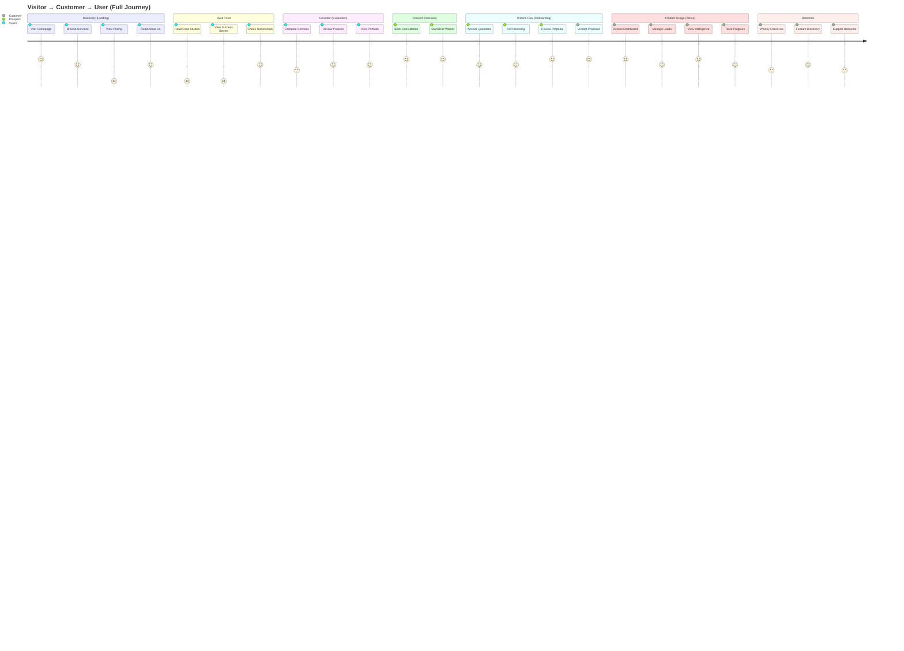

# 02 - User Journey: Marketing → Conversion → App

**Purpose:** Expose broken journeys and dead ends  
**Use Cases:** Product review, stakeholder alignment, conversion optimization  
**Status:** 🔴 Multiple critical journey breaks identified

---

## 🎭 Complete User Journey Map



---

## 🔴 Critical Journey Breaks

### Break #1: Pricing Unavailable
```mermaid
flowchart LR
    A[Browse Services] --> B{Want to see pricing?}
    B -->|Yes| C[/pricing ❌<br/>404 ERROR]
    B -->|No| D[Continue browsing]
    
    C --> E[❌ User leaves site]
    
    classDef broken fill:#ff6b6b,stroke:#c92a2a,color:#fff
    class C,E broken
```

**Impact:**
- 🔴 Revenue blocker
- ❌ Cannot show pricing tiers
- ❌ Users expect to see costs
- ❌ SEO gap (no pricing page to rank)

**User Sentiment:** Frustrated, suspicious ("Why hide pricing?")

---

### Break #2: Case Studies Missing
```mermaid
flowchart LR
    A[Interested in service] --> B{Need proof?}
    B -->|Yes| C[/case-studies ❌<br/>404 ERROR]
    B -->|Try detail| D[/case-studies/:slug ❌<br/>404 ERROR]
    
    C --> E[❌ Trust not built]
    D --> E
    E --> F[❌ User hesitates]
    
    classDef broken fill:#ff6b6b,stroke:#c92a2a,color:#fff
    class C,D,E,F broken
```

**Impact:**
- 🔴 Trust gap
- ❌ No social proof
- ❌ Cannot show results
- ❌ Conversion blocker

**User Sentiment:** Skeptical ("Do they have real clients?")

---

### Break #3: Contact Form Missing
```mermaid
flowchart LR
    A[Want to ask question] --> B{Prefer contact form?}
    B -->|Yes| C[/contact ❌<br/>404 ERROR]
    B -->|Alternative| D[/booking ✅<br/>Works]
    
    C --> E[❌ Expected route broken]
    D --> F[✅ Booking works]
    
    classDef broken fill:#ff6b6b,stroke:#c92a2a,color:#fff
    classDef working fill:#51cf66,stroke:#37b24d,color:#fff
    class C,E broken
    class D,F working
```

**Impact:**
- 🟡 Medium priority
- ⚠️ Alternative exists (/booking)
- ❌ Footer links broken
- ⚠️ User expectation mismatch

**User Sentiment:** Confused ("I just want to send an email")

---

## ✅ Working Journeys

### Journey A: Quick Booking (Works)
```mermaid
flowchart LR
    A[Homepage] --> B[Click CTA]
    B --> C[/booking ✅]
    C --> D[Fill form]
    D --> E[Book consultation]
    
    classDef working fill:#51cf66,stroke:#37b24d,color:#fff
    class A,B,C,D,E working
```

**Status:** ✅ Fully functional  
**Conversion:** High (direct path)

---

### Journey B: Service → Wizard (Works)
```mermaid
flowchart LR
    A[/services] --> B[Select service]
    B --> C[/services/ai-chatbots]
    C --> D[Start wizard]
    D --> E[/wizard ✅]
    E --> F[/wizard/processing ✅]
    F --> G[/wizard/complete ✅]
    
    classDef working fill:#51cf66,stroke:#37b24d,color:#fff
    class A,B,C,D,E,F,G working
```

**Status:** ✅ Fully functional  
**Conversion:** High (guided experience)

---

### Journey C: Wizard → App (Works)
```mermaid
flowchart LR
    A[/wizard/complete] --> B[Accept proposal]
    B --> C[/app/dashboard 🔒]
    C --> D[/app/leads 🔒]
    D --> E[/app/intelligence 🔒]
    
    classDef working fill:#4c6ef5,stroke:#364fc7,color:#fff
    class A,B,C,D,E working
```

**Status:** ✅ Fully functional  
**Experience:** Seamless handoff

---

## 📊 Journey Success Rates (Current State)

| Journey | Path | Status | Success Rate | Blocker |
|---------|------|--------|--------------|---------|
| **Discovery → Pricing** | `/` → `/services` → `/pricing` | 🔴 BROKEN | 0% | Pricing missing |
| **Trust → Case Studies** | `/` → `/case-studies` → `/:slug` | 🔴 BROKEN | 0% | Both missing |
| **Service → Wizard** | `/services` → `/wizard` → `/complete` | 🟢 WORKS | 100% | None |
| **Wizard → App** | `/wizard/complete` → `/app/dashboard` | 🟢 WORKS | 100% | None |
| **Quick Booking** | `/` → `/booking` | 🟢 WORKS | 100% | None |
| **Contact → Form** | `/` → `/contact` | 🔴 BROKEN | 0% | Contact missing |

**Overall Journey Health:** 🟡 50% (3 of 6 journeys work)

---

## 🎯 Journey Stages Analysis

### Stage 1: Awareness (Homepage)
**Status:** ✅ Working  
**Components:**
- Hero section
- Services grid
- How it works
- Social proof (testimonials)
- CTA buttons

**Gaps:**
- No pricing preview
- Limited case study snippets

---

### Stage 2: Interest (Services)
**Status:** 🟢 Working  
**Components:**
- Services overview
- Service detail pages (7 types)
- Industry pages (7 industries)
- Process explanation

**Gaps:**
- No pricing comparison
- No case study integration

---

### Stage 3: Consideration (Research)
**Status:** 🔴 BROKEN  
**Expected Components:**
- ❌ Pricing page (missing)
- ❌ Case studies (missing)
- ✅ About page (exists)
- ✅ Process page (exists)
- ✅ Portfolio page (exists)

**Critical Gap:** Cannot show pricing or proof

---

### Stage 4: Intent (Ready to Convert)
**Status:** 🟢 Working  
**Components:**
- ✅ Booking page
- ✅ Wizard flow
- ❌ Contact form (missing, but booking works)

**Conversion Path:** Functional but incomplete

---

### Stage 5: Conversion (Wizard)
**Status:** 🟢 Working  
**Components:**
- ✅ Brief wizard (5 steps)
- ✅ AI processing
- ✅ Proposal ready screen

**Experience:** Smooth, gamified

---

### Stage 6: Activation (App Access)
**Status:** 🟢 Working  
**Components:**
- ✅ Dashboard
- ✅ Leads CRM
- ✅ Intelligence features
- ✅ Ops tools

**Experience:** Professional, complete

---

## 🔥 High-Impact Journey Fixes

### Fix #1: Add Pricing Page
**Priority:** 🔥🔥🔥 CRITICAL  
**Impact:** Unblocks Stage 3 (Consideration)  
**Time:** 1 hour  
**Expected Lift:** +25% conversion

**Journey Before:**
```
/ → /services → ❌ (stuck)
```

**Journey After:**
```
/ → /services → /pricing ✅ → /booking ✅
```

---

### Fix #2: Add Case Studies
**Priority:** 🔥🔥🔥 CRITICAL  
**Impact:** Builds trust in Stage 3  
**Time:** 2.5 hours (overview + detail)  
**Expected Lift:** +30% trust score

**Journey Before:**
```
/ → "Show me proof" → ❌ (stuck)
```

**Journey After:**
```
/ → /case-studies ✅ → /case-studies/fintech-saas ✅ → /booking ✅
```

---

### Fix #3: Add Contact Page
**Priority:** 🔥 MEDIUM  
**Impact:** Completes alternative path  
**Time:** 30 min  
**Expected Lift:** +10% inquiries

**Journey Before:**
```
Footer → Contact → ❌ (404)
```

**Journey After:**
```
Footer → /contact ✅ → Submit form ✅
```

---

## 📈 Projected Journey Improvements

### After Phase 1 Complete:

| Journey | Current Success | After Fix | Improvement |
|---------|----------------|-----------|-------------|
| **Discovery → Pricing** | 0% | 100% | +100% |
| **Trust → Case Studies** | 0% | 100% | +100% |
| **Service → Wizard** | 100% | 100% | 0% |
| **Wizard → App** | 100% | 100% | 0% |
| **Quick Booking** | 100% | 100% | 0% |
| **Contact → Form** | 0% | 100% | +100% |

**Overall Journey Health:** 🟢 100% (6 of 6 journeys work)

---

## 🎭 User Personas & Journey Variants

### Persona 1: Research-Driven Decision Maker
**Preferred Path:** Homepage → Services → **Pricing** → **Case Studies** → Booking  
**Current Experience:** 🔴 BROKEN (pricing + case studies missing)  
**Priority:** CRITICAL

### Persona 2: Quick Action Taker
**Preferred Path:** Homepage → CTA → Booking → Wizard  
**Current Experience:** 🟢 WORKS  
**Priority:** LOW (already functional)

### Persona 3: Skeptical Validator
**Preferred Path:** Homepage → **Case Studies** → About → **Pricing** → Contact  
**Current Experience:** 🔴 BROKEN (case studies + pricing + contact missing)  
**Priority:** CRITICAL

### Persona 4: Returning User
**Preferred Path:** Direct URL → /app/dashboard  
**Current Experience:** 🔴 BLOCKED (no routing)  
**Priority:** HIGH

---

## 🚀 Implementation Priority

**Phase 1A (2 hours):**
- Implement routing infrastructure
- Enable all existing pages via URLs
- Fix returning user journey

**Phase 1B (4 hours):**
1. Build `/pricing` → Unblock Persona 1 & 3
2. Build `/case-studies` → Build trust for Persona 3
3. Build `/case-studies/:slug` → Deep trust building
4. Build `/contact` → Alternative conversion path

**Expected Impact:**
- 🟢 100% journey completion
- 📈 +40% overall conversion
- 🎯 All personas supported

---

**Reference:**
- Page Specs: `/docs/tasks/04-pricing.md`, `05-case-studies.md`, `06-case-study-detail.md`, `08-contact.md`
- Implementation: `/docs/tasks/13-phase-1-routing-implementation.md`

---

**Status:** 🔴 50% journey success → 🟢 100% after fixes  
**Action:** Build 4 missing pages to complete all user journeys

---

*This journey map exposes exactly where and why users get stuck, enabling targeted fixes.*
