# 04 - Protected Routing + Auth Guard Architecture

**Purpose:** Confirm security and access control  
**Use Cases:** Security audit, auth flow validation, onboarding review  
**Status:** 🔴 Auth guards exist, routing not implemented

---

## 🔐 Complete Authentication & Authorization Flow

```mermaid
flowchart TD
    Start([User Attempts Access]) --> Check{Authenticated?}
    
    %% Unauthenticated Flow
    Check -->|No| Public{Accessing Public Route?}
    
    Public -->|Yes - Marketing| Marketing[Allow Access]
    Public -->|No - Protected| Redirect1[Redirect to /login]
    
    Marketing --> PublicPages[Public Pages:<br/>/, /services, /about, etc.]
    
    Redirect1 --> Login[/login<br/>Login Page]
    Login --> LoginForm{Login Form}
    
    LoginForm -->|Submit| Auth{Validate Credentials}
    Auth -->|Success| SetToken[Set Auth Token]
    Auth -->|Failure| LoginError[Show Error]
    LoginError --> Login
    
    SetToken --> CheckIntent{Has Intended Route?}
    CheckIntent -->|Yes| RedirectIntended[Redirect to Intended Route]
    CheckIntent -->|No| RedirectDash[Redirect to /app/dashboard]
    
    %% Authenticated Flow
    Check -->|Yes| AuthCheck{Accessing Auth Route?}
    
    AuthCheck -->|Yes - Login/Signup| AlreadyAuth[Already Authenticated]
    AuthCheck -->|No - App| AllowApp[Allow Access]
    
    AlreadyAuth --> RedirectDash2[Redirect to /app/dashboard]
    
    AllowApp --> AppRoutes[Protected App Routes]
    
    %% App Routes
    AppRoutes --> Dashboard[/app/dashboard<br/>Project Dashboard]
    AppRoutes --> Leads[/app/leads<br/>Leads CRM]
    AppRoutes --> Ops[/app/ops<br/>Agent Control Room]
    AppRoutes --> Workflows[/app/workflows<br/>Automation Map]
    AppRoutes --> Intelligence[/app/intelligence/*<br/>Intelligence Hub]
    AppRoutes --> Settings[/app/settings<br/>Settings]
    
    %% Session Management
    Dashboard -.->|Session Expires| SessionCheck{Check Token}
    SessionCheck -->|Invalid| Logout[Logout]
    SessionCheck -->|Valid| Refresh[Refresh Token]
    
    Logout --> Login
    Refresh --> Dashboard
    
    %% Styling
    classDef public fill:#51cf66,stroke:#37b24d,color:#fff
    classDef protected fill:#4c6ef5,stroke:#364fc7,color:#fff
    classDef auth fill:#ffd43b,stroke:#fab005,color:#000
    classDef error fill:#ff6b6b,stroke:#c92a2a,color:#fff
    
    class PublicPages,Marketing public
    class AppRoutes,Dashboard,Leads,Ops,Workflows,Intelligence,Settings protected
    class Login,LoginForm,Auth,SetToken auth
    class LoginError,Logout error
```

---

## 🛡️ Route Protection Levels

### Level 1: Public Routes (No Auth Required)
**Access:** Anyone can view

**Routes:**
- `/` - Homepage
- `/services` - Services overview
- `/services/*` - All service pages
- `/about` - About page
- `/projects` - Portfolio
- `/process` - How we work
- `/solutions/whatsapp` - WhatsApp automation
- `/wizard` - Brief wizard (captures lead data)
- `/wizard/processing` - AI processing
- `/wizard/complete` - Proposal ready
- `/booking` - Booking page

**Total:** 25 public routes ✅

**Guard:** None (open access)

---

### Level 2: Auth Routes (Redirect if Authenticated)
**Access:** Only unauthenticated users

**Routes:**
- `/login` - Login page
- `/signup` - Signup page (if created)
- `/forgot-password` - Password reset (if created)

**Behavior:**
- If user is authenticated → Redirect to `/app/dashboard`
- If user is not authenticated → Show login form

**Guard:** `PublicRoute` component

**Implementation:**
```tsx
<PublicRoute>
  <LoginPage />
</PublicRoute>
```

---

### Level 3: Protected Routes (Auth Required)
**Access:** Only authenticated users

**Routes:**
- `/app` - Redirect to dashboard
- `/app/dashboard` - Project dashboard
- `/app/leads` - Leads CRM
- `/app/leads/:id` - Lead profile
- `/app/ops` - Agent control room
- `/app/workflows` - Automation map
- `/app/intelligence` - Intelligence hub
- `/app/intelligence/upload` - Call upload
- `/app/intelligence/analysis` - AI analysis
- `/app/intelligence/brief` - Call brief
- `/app/intelligence/search` - Search results
- `/app/settings` - Settings

**Total:** 11 protected routes 🔒

**Guard:** `ProtectedRoute` component

**Behavior:**
- If user is authenticated → Show protected content
- If user is not authenticated → Redirect to `/login` and save intended route

**Implementation:**
```tsx
<ProtectedRoute>
  <AdminLayout>
    <Outlet />
  </AdminLayout>
</ProtectedRoute>
```

---

## 🔑 Auth Guard Components

### ProtectedRoute (Auth Required)

**Purpose:** Protect routes that require authentication

**Code:**
```tsx
import { ReactNode } from 'react';
import { Navigate, useLocation } from 'react-router-dom';
import { useAuth } from '../../context/AuthContext';
import { Loader2 } from 'lucide-react';

interface ProtectedRouteProps {
  children: ReactNode;
}

export function ProtectedRoute({ children }: ProtectedRouteProps) {
  const { isAuthenticated, isLoading } = useAuth();
  const location = useLocation();

  // Show loading state while checking auth
  if (isLoading) {
    return (
      <div className="min-h-screen flex items-center justify-center">
        <Loader2 className="h-12 w-12 animate-spin text-indigo-600" />
        <p>Loading...</p>
      </div>
    );
  }

  // Not authenticated → redirect to login
  if (!isAuthenticated) {
    return <Navigate to="/login" state={{ from: location }} replace />;
  }

  // Authenticated → show protected content
  return <>{children}</>;
}
```

**Key Features:**
- ✅ Saves intended route in `state.from`
- ✅ Shows loading state during auth check
- ✅ Redirects to login if not authenticated
- ✅ Allows access if authenticated

---

### PublicRoute (No Auth Required, Redirect if Authenticated)

**Purpose:** Routes that should redirect authenticated users

**Code:**
```tsx
import { ReactNode } from 'react';
import { Navigate } from 'react-router-dom';
import { useAuth } from '../../context/AuthContext';

interface PublicRouteProps {
  children: ReactNode;
}

export function PublicRoute({ children }: PublicRouteProps) {
  const { isAuthenticated } = useAuth();

  // Already authenticated → redirect to dashboard
  if (isAuthenticated) {
    return <Navigate to="/app/dashboard" replace />;
  }

  // Not authenticated → show public content
  return <>{children}</>;
}
```

**Key Features:**
- ✅ Prevents authenticated users from seeing login
- ✅ Redirects to dashboard if already logged in
- ✅ Simple and performant

---

## 🔄 Auth Context (State Management)

**File:** `/context/AuthContext.tsx`

**Responsibilities:**
- Manage authentication state
- Store user session
- Provide auth methods
- Handle token refresh

**Key State:**
```tsx
interface AuthState {
  isAuthenticated: boolean;
  isLoading: boolean;
  user: User | null;
  token: string | null;
}
```

**Methods:**
```tsx
interface AuthContextType {
  isAuthenticated: boolean;
  isLoading: boolean;
  user: User | null;
  login: (email: string, password: string) => Promise<void>;
  logout: () => void;
  signup: (email: string, password: string, name: string) => Promise<void>;
  refreshToken: () => Promise<void>;
}
```

---

## 🎯 Authentication Flows

### Flow 1: Login (Successful)


---

### Flow 2: Protected Route Access (Not Authenticated)

```mermaid
sequenceDiagram
    participant U as User
    participant B as Browser
    participant P as ProtectedRoute
    participant A as Auth Context
    participant L as Login Page

    U->>B: Navigate to /app/leads
    B->>P: Check protection
    P->>A: Check isAuthenticated
    A-->>P: Returns false
    P->>P: Save intended route (/app/leads)
    P->>L: Redirect to /login
    L-->>U: Show login form
    
    Note over U,L: After login...
    
    U->>L: Submit credentials
    L->>A: login()
    A-->>L: Success
    L->>B: Redirect to intended route
    B->>U: Show /app/leads ✅
```


---

### Flow 3: Token Refresh (Session Expired)


---

## 🚨 Security Features

### 1. Token Storage
**Method:** Supabase handles token storage  
**Location:** Encrypted cookies (httpOnly)  
**Expiry:** Configurable (default: 1 hour)  
**Refresh:** Automatic before expiry

---

### 2. Route Guards
**Implementation:** React Router + Higher-Order Components  
**Validation:** On every route change  
**Fallback:** Redirect to login

---

### 3. Session Management
**Auto-refresh:** Before token expiry  
**Manual refresh:** User action  
**Logout:** Clear all tokens and state

---

### 4. CSRF Protection
**Method:** Supabase built-in  
**Tokens:** Per-session CSRF tokens  
**Validation:** Server-side

---

### 5. XSS Prevention
**Sanitization:** React's built-in XSS protection  
**CSP Headers:** Content Security Policy (TODO)  
**Input Validation:** Client and server

---

## 📊 Auth Flow Metrics

| Flow | Current State | Expected Behavior | Status |
|------|--------------|-------------------|--------|
| **Public Access** | ✅ Works (no routing) | Allow all visitors | ✅ |
| **Login Redirect** | ❌ Not implemented | Redirect if authenticated | 🔴 Needs routing |
| **Protected Access** | ❌ Not implemented | Require auth | 🔴 Needs routing |
| **Session Recovery** | ⚠️ Partial | Auto-refresh tokens | 🟡 |
| **Logout** | ✅ Works | Clear session | ✅ |
| **Token Refresh** | ⚠️ Partial | Auto-refresh | 🟡 |

---

## 🔧 Implementation Checklist

### Phase 1: Basic Guards (Included in Routing)
- [ ] Create `ProtectedRoute.tsx`
- [ ] Create `PublicRoute.tsx`
- [ ] Wrap `/app/*` routes with `ProtectedRoute`
- [ ] Wrap `/login` with `PublicRoute`
- [ ] Test redirect flows

### Phase 2: Enhanced Auth (Future)
- [ ] Add role-based access control (RBAC)
- [ ] Add permission system
- [ ] Add audit logging
- [ ] Add 2FA support
- [ ] Add OAuth providers (Google, GitHub)

---

## 🎯 User Scenarios

### Scenario 1: New Visitor
```
1. Visit homepage → ✅ Allow
2. Click "Services" → ✅ Allow
3. Try /app/dashboard → 🔴 Redirect to /login
4. Login → ✅ Show dashboard
```

---

### Scenario 2: Returning User (Session Active)
```
1. Visit /app/dashboard directly → ✅ Check session
2. Session valid → ✅ Show dashboard
3. Session expired → 🔄 Refresh token
4. Refresh success → ✅ Continue
5. Refresh failed → 🔴 Redirect to login
```

---

### Scenario 3: Bookmarked Protected Route
```
1. User bookmarks /app/leads (while logged in)
2. User logs out
3. User clicks bookmark → 🔴 Redirect to /login
4. After login → ✅ Redirect to /app/leads (intended route)
```

---

### Scenario 4: Already Logged In → Login Page
```
1. User is logged in
2. User visits /login → 🔴 Redirect to /app/dashboard
3. User doesn't see login form (already authenticated)
```

---

## 🚀 Testing Plan

### Test 1: Public Route Access
```bash
# Expected: Should work without auth
curl http://localhost:5173/
curl http://localhost:5173/services
curl http://localhost:5173/about
```

---

### Test 2: Protected Route Without Auth
```bash
# Expected: Redirect to /login
curl -L http://localhost:5173/app/dashboard
# Should land on /login
```

---

### Test 3: Login → Protected Route
```bash
# 1. Login
POST /api/auth/login { email, password }

# 2. Get token
Cookie: session=<token>

# 3. Access protected route
curl -H "Cookie: session=<token>" http://localhost:5173/app/dashboard
# Expected: Show dashboard
```

---

### Test 4: Session Expiry
```bash
# 1. Login and wait for token expiry
# 2. Try to access protected route
# Expected: Auto-refresh or redirect to login
```

---

**Reference:**
- Auth Context: `/context/AuthContext.tsx`
- Login Page: `/components/auth/LoginPage.tsx`
- Routing Guide: `/docs/tasks/13-phase-1-routing-implementation.md`

---

**Status:** 🔴 Guards exist, routing not implemented  
**Priority:** HIGH (part of Phase 1)  
**Security:** Standard best practices applied

---

*This architecture ensures secure access control with proper session management and user experience.*
