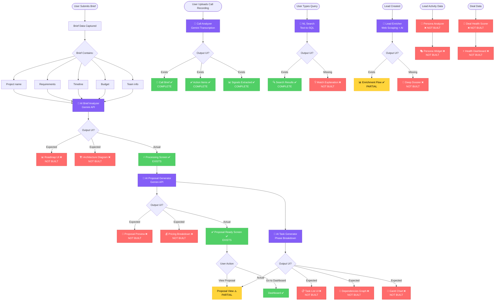

# 05 - AI Feature Workflow: What Users Expect to See

**Purpose:** Expose missing AI output screens and UI gaps  
**Use Cases:** Feature completeness audit, UX validation, product roadmap  
**Status:** 🟡 AI logic exists, 🔴 Output UI incomplete

---

## 🤖 Complete AI Feature Pipeline



---

## 🎯 AI Feature Audit

### ✅ Feature 1: Post-Call Action Architect (100% Complete)

**AI Logic:** ✅ Complete  
**Input:** Audio recording (.mp3, .wav)  
**Processing:**
- Transcription (Gemini API)
- Signal extraction (budget, timeline, priority)
- Action item generation
- Sentiment analysis

**Output UI:** ✅ Complete
- Call ingestion screen
- AI analysis state ("thinking" animation)
- Call brief with signals
- Action items checklist
- Interactive completion

**Status:** 🟢 Production-ready

**Gaps:** None

---

### ✅ Feature 2: Natural Language Search (60% Complete)

**AI Logic:** 🟡 Partial  
**Input:** Natural language query  
**Processing:**
- Text-to-SQL conversion (Gemini API)
- Query parsing
- Filter generation

**Output UI:** 🟡 Partial
- ✅ Command bar (Cmd+K)
- ✅ Search results table
- ❌ Match explanation (why each result matched)
- ❌ Query suggestions
- ❌ Saved searches

**Status:** 🟡 Needs UI enhancement

**Gaps:**
1. No match reason display
2. No query history
3. No smart segments

---

### 🟡 Feature 3: Lead Enrichment (40% Complete)

**AI Logic:** 🟡 Partial  
**Input:** Lead basic info (name, email, company)  
**Processing:**
- Web scraping (LinkedIn, company site)
- Data enrichment (Gemini API)
- Score calculation

**Output UI:** 🟡 Partial
- ✅ Enrichment flow (hydration state)
- ✅ Sun Score badge
- ❌ Deep dossier view (full profile)
- ❌ Enrichment history
- ❌ Data source attribution

**Status:** 🟡 Needs completion

**Gaps:**
1. No deep dossier UI
2. Limited data visualization
3. No enrichment audit trail

---

### 🔴 Feature 4: Brief-to-Roadmap (20% Complete)

**AI Logic:** ✅ Complete  
**Input:** User brief from wizard  
**Processing:**
- Requirement analysis (Gemini API)
- Phase breakdown
- Timeline estimation
- Architecture design

**Output UI:** 🔴 Mostly Missing
- ✅ Processing screen (exists)
- ✅ Proposal ready screen (exists)
- ❌ **Roadmap visualization** (critical gap)
- ❌ **Architecture diagram** (critical gap)
- ❌ **Phase details** (critical gap)
- ❌ **Task breakdown** (critical gap)

**Status:** 🔴 AI works, UI missing

**Critical Gaps:**
1. **Roadmap UI** - Users expect to see visual timeline
2. **Architecture Diagram** - Should show system components
3. **Phase Details** - Breakdown of each phase
4. **Task List** - Granular tasks with dependencies

**User Expectation:**
```
User submits brief → AI analyzes → User sees:
❌ Roadmap timeline (Gantt-style)
❌ Architecture diagram (system design)
❌ Detailed phases (milestones, tasks)
✅ Generic "Proposal Ready" (incomplete)
```

---

### 🔴 Feature 5: Proposal Generator (30% Complete)

**AI Logic:** ✅ Complete  
**Input:** Brief data + AI analysis  
**Processing:**
- Proposal text generation
- Pricing calculation
- Timeline formatting

**Output UI:** 🔴 Mostly Missing
- ✅ Proposal ready screen (basic)
- ⚠️ Proposal view (partial, exists but not linked)
- ❌ **Pricing breakdown** (critical gap)
- ❌ **Scope of work** (critical gap)
- ❌ **Terms and conditions** (missing)
- ❌ **PDF export** (missing)

**Status:** 🔴 AI works, UI incomplete

**Critical Gaps:**
1. **Pricing Breakdown** - Itemized costs
2. **Detailed Scope** - Full SOW
3. **Export Options** - PDF, email
4. **Approval Flow** - Accept/reject/negotiate

---

### 🔴 Feature 6: Persona Chameleon (0% Complete)

**AI Logic:** ❌ Not built  
**Input:** Lead communication history  
**Processing:**
- Communication style analysis
- Persona classification (5 archetypes)
- Message generation

**Output UI:** ❌ Not built
- ❌ Persona widget (sidebar)
- ❌ Message composer
- ❌ Style-matched email drafts

**Status:** 🔴 Not started

**Gaps:** Entire feature missing (see `/docs/features/07-persona-chameleon.md`)

---

### 🔴 Feature 7: Deal Health Oracle (0% Complete)

**AI Logic:** ❌ Not built  
**Input:** Deal activity data (40+ signals)  
**Processing:**
- Health score calculation
- Risk detection
- Intervention recommendations

**Output UI:** ❌ Not built
- ❌ Health dashboard (traffic lights)
- ❌ Drill-down modal
- ❌ Risk alerts
- ❌ Action recommendations

**Status:** 🔴 Not started

**Gaps:** Entire feature missing (see `/docs/features/08-deal-health.md`)

---

## 📊 AI Feature Completion Matrix

| Feature | AI Logic | Input UI | Output UI | Status | Priority |
|---------|----------|----------|-----------|--------|----------|
| **Post-Call Architect** | ✅ 100% | ✅ 100% | ✅ 100% | 🟢 Complete | P0 |
| **Natural Language Search** | 🟡 60% | ✅ 100% | 🟡 60% | 🟡 Partial | P1 |
| **Lead Enrichment** | 🟡 50% | ✅ 80% | 🟡 40% | 🟡 Partial | P1 |
| **Brief-to-Roadmap** | ✅ 100% | ✅ 100% | 🔴 20% | 🔴 Gap | P0 |
| **Proposal Generator** | ✅ 100% | ✅ 100% | 🔴 30% | 🔴 Gap | P0 |
| **Persona Chameleon** | ❌ 0% | ❌ 0% | ❌ 0% | 🔴 Missing | P0 |
| **Deal Health Oracle** | ❌ 0% | ❌ 0% | ❌ 0% | 🔴 Missing | P0 |
| **Email Resurrection** | ❌ 0% | ❌ 0% | ❌ 0% | 🔴 Missing | P1 |

**Overall AI Feature Completion:** 35%

---

## 🚨 Critical UI Gaps

### Gap #1: Roadmap Visualization (HIGH PRIORITY)
**Expected by Users:**
```
[Wizard Complete] → [View Roadmap]
  ↓
📊 Visual Timeline:
- Phase 1: Discovery (2 weeks)
- Phase 2: Design (3 weeks)
- Phase 3: Development (8 weeks)
- Phase 4: Testing (2 weeks)
- Phase 5: Launch (1 week)
```

**Current Reality:**
```
[Wizard Complete] → [Proposal Ready Screen]
  ↓
"Your proposal is ready!"
[View Proposal] → ⚠️ Generic text page
```

**Solution:** Build roadmap visualization component (2 hours)

---

### Gap #2: Architecture Diagram (HIGH PRIORITY)
**Expected by Users:**
```
[View Architecture]
  ↓
🏗️ System Diagram:
- Frontend (React + Tailwind)
- Backend (Supabase + Edge Functions)
- AI Layer (Gemini API)
- Integrations (Gmail, Calendar, etc.)
```

**Current Reality:**
```
❌ No architecture visualization
User has to imagine the system
```

**Solution:** Build architecture visualizer component (3 hours)

---

### Gap #3: Pricing Breakdown (MEDIUM PRIORITY)
**Expected by Users:**
```
[View Pricing]
  ↓
💰 Itemized Costs:
- Discovery Phase: $5,000
- Design Phase: $8,000
- Development Phase: $35,000
- Testing Phase: $4,000
- Launch Support: $3,000
---
Total: $55,000
Payment Terms: 50% upfront, 50% on completion
```

**Current Reality:**
```
"Budget: $50,000-$70,000"
No breakdown
```

**Solution:** Build pricing breakdown component (1 hour)

---

### Gap #4: Task List with Dependencies (MEDIUM PRIORITY)
**Expected by Users:**
```
[View Tasks]
  ↓
📋 Task Breakdown:
✅ User Research (Week 1)
  ↳ 🔄 Wireframes (Week 2) [depends on research]
    ↳ ⏳ Design Mockups (Week 3) [depends on wireframes]
```

**Current Reality:**
```
❌ No task breakdown
User sees generic phases only
```

**Solution:** Build task list component with dependencies (2 hours)

---

## 🎯 User Expectations vs Reality

### Scenario 1: After Wizard Completion
**User Expects:**
1. See roadmap timeline
2. View architecture diagram
3. Understand pricing breakdown
4. See detailed task list

**User Gets:**
1. ✅ "Proposal Ready" screen
2. ❌ No roadmap
3. ❌ No architecture
4. ❌ Generic pricing range
5. ⚠️ Can view proposal (but it's text-heavy)

**Gap:** Visual outputs missing

---

### Scenario 2: After Call Upload
**User Expects:**
1. See transcription
2. View extracted signals
3. Get action items
4. Track completion

**User Gets:**
1. ✅ Full transcription
2. ✅ Signals extracted (budget, timeline, etc.)
3. ✅ Action items generated
4. ✅ Interactive checklist

**Gap:** None - This feature is complete ✅

---

### Scenario 3: Lead Enrichment
**User Expects:**
1. See enrichment progress
2. View full dossier
3. Understand data sources
4. See enrichment history

**User Gets:**
1. ✅ Hydration state (progress)
2. ✅ Basic enrichment data
3. ❌ No deep dossier
4. ❌ No data attribution
5. ❌ No history

**Gap:** Deep dossier and audit trail missing

---

## 📋 Implementation Priority

### Phase 1: High-Priority UI Gaps (8 hours)
1. **Roadmap Visualization** (2 hours)
   - Gantt-style timeline
   - Phase milestones
   - Duration display

2. **Architecture Diagram** (3 hours)
   - System components
   - Data flow
   - Integration points

3. **Pricing Breakdown** (1 hour)
   - Itemized costs
   - Payment terms
   - Total calculation

4. **Task List** (2 hours)
   - Task hierarchy
   - Dependencies
   - Status indicators

---

### Phase 2: Complete Missing Features (24 hours)
1. **Persona Chameleon** (8 hours)
   - Persona widget
   - Message composer
   - Style matching

2. **Deal Health Oracle** (10 hours)
   - Health dashboard
   - Risk detection
   - Intervention planner

3. **Email Resurrection** (6 hours)
   - Campaign builder
   - Cold lead detection
   - Auto-drafting

---

## 🚀 Quick Wins

### Win #1: Connect Existing ProposalView
**Status:** Component exists at `/components/ProposalView.tsx`  
**Gap:** Not connected to wizard flow  
**Fix:** Link from `/wizard/complete` (30 min)

### Win #2: Add "View Details" Button
**Status:** AI analysis complete, just need to display  
**Gap:** No UI to show detailed output  
**Fix:** Build detail modal (1 hour)

### Win #3: Show Pricing in Proposal
**Status:** Budget data captured in wizard  
**Gap:** Not displayed in structured format  
**Fix:** Add pricing section to proposal (30 min)

---

**Reference:**
- Brief-to-Roadmap Feature: `/docs/features/04-roadmap-prompts.md`
- Proposal View: `/components/ProposalView.tsx`
- Persona Chameleon: `/docs/features/07-persona-chameleon.md`
- Deal Health Oracle: `/docs/features/08-deal-health.md`

---

**Status:** 🔴 AI exists but output UI incomplete  
**Priority:** HIGH - Users expect to see AI results  
**Impact:** Poor UX, feels incomplete

---

*This diagram exposes the gap between AI capabilities and user-facing outputs - the "logic exists but you can't see it" problem.*
