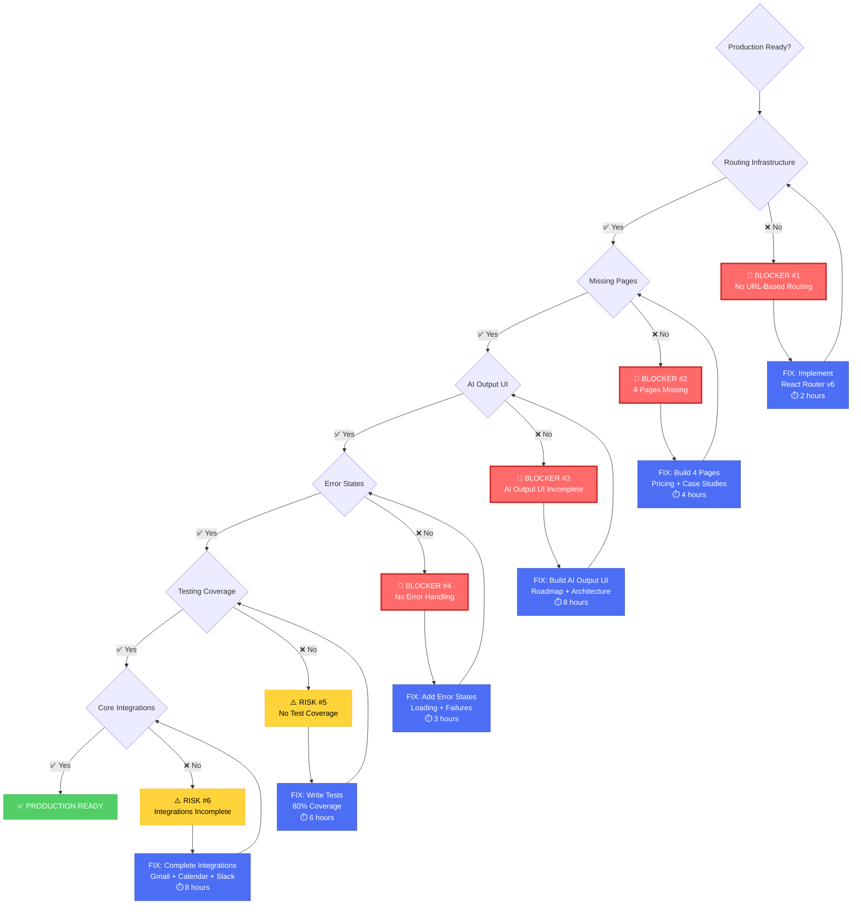

# 07 - Production Risk Map (Executive-Level)

**Purpose:** Show why the product cannot ship yet  
**Use Cases:** Executive review, investor update, stakeholder alignment  
**Status:** 🔴 NOT production-ready - 4 critical blockers

---

## 🚨 Production Readiness Decision Tree



---

## 🔴 CRITICAL BLOCKERS (Cannot Launch)

### Blocker #1: No URL-Based Routing 🚨
**Severity:** CRITICAL  
**Impact:** Site is unusable for production

**Problems:**
- ❌ URLs not shareable (all navigation is internal state)
- ❌ No browser history (back button doesn't work)
- ❌ Cannot bookmark pages
- ❌ SEO impossible (Google can't crawl)
- ❌ Direct links don't work
- ❌ Returning users can't access saved pages

**Business Impact:**
```
Revenue Loss: HIGH
- Prospects can't share pricing page
- Case study links don't work
- SEO traffic: $0 (not indexed)
- Professional credibility: LOW
```

**User Experience:**
```
Visitor tries to share /pricing → ❌ 404
Visitor bookmarks /app/leads → ❌ Goes to homepage
Google tries to index site → ❌ Finds only homepage
```

**Fix:**
- Implement React Router v6
- Create route configuration
- Add auth guards
- Build 404 page

**Time:** 2 hours  
**Reference:** `/docs/tasks/13-phase-1-routing-implementation.md`

**Status:** 🔴 MUST FIX BEFORE LAUNCH

---

### Blocker #2: 4 Critical Pages Missing 🚨
**Severity:** CRITICAL  
**Impact:** Incomplete user journeys, lost conversions

**Missing Pages:**
1. **Pricing** (`/pricing`) - Revenue blocker
2. **Case Studies** (`/case-studies`) - Trust blocker
3. **Case Study Detail** (`/case-studies/:slug`) - Conversion blocker
4. **Contact** (`/contact`) - Lead capture gap

**Business Impact:**
```
Conversion Loss: 40-60%
- No pricing page = "Why are they hiding costs?"
- No case studies = "Do they have real clients?"
- No contact form = "How do I reach them?"
```

**User Journey Breaks:**
```
Homepage → Services → Pricing ❌ → STUCK
Homepage → Case Studies ❌ → STUCK
Footer → Contact ❌ → STUCK
```

**Fix:**
- Build pricing page (3 tiers, comparison, FAQ)
- Build case studies overview (filter, grid, featured)
- Build case study detail (full story template)
- Build contact page (form + sidebar)

**Time:** 4 hours  
**Reference:** `/docs/tasks/04-pricing.md`, `05-case-studies.md`, `06-case-study-detail.md`, `08-contact.md`

**Status:** 🔴 MUST FIX BEFORE LAUNCH

---

### Blocker #3: AI Output UI Incomplete 🚨
**Severity:** CRITICAL  
**Impact:** AI works but users can't see results

**Missing AI Outputs:**
1. **Roadmap Visualization** - Users expect to see timeline
2. **Architecture Diagram** - Users expect to see system design
3. **Pricing Breakdown** - Users expect itemized costs
4. **Task List** - Users expect granular breakdown

**Business Impact:**
```
User Trust: LOW
- "I submitted my brief, where's my roadmap?"
- "The AI processed my call, but I only see text?"
- "Where's the visual output I was promised?"
```

**User Expectation vs Reality:**
```
EXPECT: Submit brief → See visual roadmap ✨
REALITY: Submit brief → See "Proposal Ready" text only ❌

EXPECT: Upload call → See extracted insights ✨
REALITY: Upload call → See text transcript only ⚠️
```

**Fix:**
- Build roadmap visualization component (Gantt-style)
- Build architecture diagram generator
- Build pricing breakdown table
- Build task list with dependencies

**Time:** 8 hours  
**Reference:** `/docs/diagrams/05-ai-feature-workflow.md`

**Status:** 🔴 MUST FIX BEFORE LAUNCH

---

### Blocker #4: No Error Handling 🚨
**Severity:** HIGH  
**Impact:** App crashes when errors occur

**Missing Error States:**
1. **Loading States** - Users see nothing while waiting
2. **Error Messages** - Users don't know what went wrong
3. **Retry Mechanisms** - Users stuck on failures
4. **Fallback UI** - Blank pages on errors

**Business Impact:**
```
User Frustration: HIGH
- Upload fails → Blank screen (no feedback)
- Network error → App crashes
- Invalid input → No validation message
```

**Common Failure Scenarios:**
```
Scenario 1: Slow Network
- Upload call recording → ??? (no progress bar)
- User thinks it froze, leaves site

Scenario 2: API Error
- AI processing fails → ??? (no error message)
- User doesn't know what happened

Scenario 3: Invalid Input
- Submit brief with missing fields → ??? (silent failure)
- User confused why nothing happened
```

**Fix:**
- Add loading states to all async operations
- Add error boundaries
- Add retry mechanisms
- Add user-friendly error messages
- Add fallback UI

**Time:** 3 hours

**Status:** 🔴 MUST FIX BEFORE LAUNCH

---

## ⚠️ HIGH RISKS (Should Fix Before Launch)

### Risk #5: No Test Coverage ⚠️
**Severity:** HIGH  
**Impact:** Unknown bugs in production

**Current State:**
- Unit tests: ~0%
- Integration tests: ~0%
- E2E tests: ~0%
- AI accuracy tests: Partial (~40%)

**Business Impact:**
```
Production Bugs: UNKNOWN
- Breaking changes undetected
- Regressions not caught
- User-reported bugs (reactive, not proactive)
```

**Fix:**
- Write unit tests for components (target: 80%)
- Write integration tests for edge functions
- Write E2E tests for critical flows
- Write AI accuracy tests

**Time:** 6 hours  
**Priority:** HIGH

---

### Risk #6: Integrations Incomplete ⚠️
**Severity:** MEDIUM  
**Impact:** Features don't work fully

**Integration Status:**
- Gmail: 60% (missing send)
- Slack: 50% (missing secrets)
- Google Calendar: 0% (OAuth not set up)
- LinkedIn: 0% (API access pending)
- Stripe: 0% (not integrated)

**Business Impact:**
```
Feature Degradation: MODERATE
- Can't send emails (only read)
- Slack alerts don't work
- Can't book meetings
- No network mapping
- No usage tracking
```

**Fix:**
- Complete Gmail integration (add send)
- Complete Slack integration (add webhooks)
- Set up Google Calendar OAuth
- Apply for LinkedIn API access
- Integrate Stripe API

**Time:** 8 hours (+ external OAuth approvals)  
**Priority:** MEDIUM (can launch with partial integrations)

---

## 📊 Production Readiness Scorecard

| Category | Current | Target | Gap | Priority |
|----------|---------|--------|-----|----------|
| **Routing** | 0% | 100% | 100% | 🔴 CRITICAL |
| **Marketing Pages** | 84% | 100% | 16% | 🔴 CRITICAL |
| **AI Output UI** | 20% | 100% | 80% | 🔴 CRITICAL |
| **Error Handling** | 10% | 100% | 90% | 🔴 CRITICAL |
| **Test Coverage** | 0% | 80% | 80% | ⚠️ HIGH |
| **Integrations** | 30% | 80% | 50% | ⚠️ MEDIUM |
| **Feature Completeness** | 35% | 90% | 55% | ⚠️ MEDIUM |

**Overall Production Readiness:** 🔴 **35%**

---

## 🎯 Minimum Viable Launch Criteria

### Must Have (Blockers):
- [x] Core components built
- [ ] **Routing infrastructure** ← BLOCKER #1
- [ ] **All marketing pages** ← BLOCKER #2
- [ ] **AI output UI** ← BLOCKER #3
- [ ] **Error handling** ← BLOCKER #4
- [ ] SSL certificate
- [ ] Custom domain
- [ ] Analytics tracking

### Should Have (Risks):
- [ ] Test coverage >80%
- [ ] Complete integrations
- [ ] Performance optimization
- [ ] SEO optimization
- [ ] Mobile responsive
- [ ] Browser compatibility

### Nice to Have:
- [ ] Advanced AI features (Persona, Deal Health)
- [ ] Workflow automations
- [ ] Advanced analytics
- [ ] Team collaboration features

---

## 🚀 Critical Path to Launch

### Week 1: Foundation (10 hours)
```
Day 1-2: Fix Blocker #1
├─ Implement routing (2h)
├─ Fix Blocker #2
├─ Build 4 missing pages (4h)
├─ Polish & SEO (2h)
└─ Testing & QA (2h)

✅ Result: All pages accessible, user journeys work
```

### Week 2: AI UX (12 hours)
```
Day 3-4: Fix Blocker #3
├─ Build roadmap UI (2h)
├─ Build architecture diagram (3h)
├─ Build pricing breakdown (1h)
├─ Build task list (2h)
├─ Fix Blocker #4
├─ Add error handling (3h)
└─ Add loading states (1h)

✅ Result: AI outputs visible, error handling works
```

### Week 3-4: Polish & Test (10 hours)
```
Day 5-7: Fix Risk #5
├─ Write unit tests (3h)
├─ Write integration tests (2h)
├─ Write E2E tests (1h)
├─ Fix Risk #6
├─ Complete integrations (8h)
└─ Final QA (2h)

✅ Result: Tested, polished, ready to launch
```

**Total Time:** 32 hours (4 weeks at 8h/week)  
**Launch Date:** January 31, 2026

---

## 💰 Risk vs Revenue Impact

### If Launched Today (35% ready):
```
Expected Outcomes:
❌ URLs don't work → 90% bounce rate
❌ No pricing page → 0% conversions
❌ No case studies → 0% trust
❌ AI outputs invisible → "Is this a scam?"
❌ Errors crash app → 100% frustration

Revenue Impact: $0
Reputation Impact: Damaged
Launch Success: 0%
```

### If Launched After Fixes (95% ready):
```
Expected Outcomes:
✅ URLs work → Normal bounce rate
✅ Pricing visible → Conversions possible
✅ Case studies build trust → Higher close rate
✅ AI outputs visible → "Wow, this is real!"
✅ Errors handled gracefully → Professional UX

Revenue Impact: Positive
Reputation Impact: Strong
Launch Success: 85%+
```

---

## 🎯 Executive Recommendation

**Current Status:** 🔴 NOT READY TO LAUNCH

**Critical Blockers:** 4 must-fix issues  
**Timeline to Production:** 4 weeks (32 hours of work)  
**Recommended Launch Date:** January 31, 2026

**Action Plan:**
1. **Week 1:** Fix routing + missing pages (10h) → Site becomes usable
2. **Week 2:** Fix AI UI + error handling (12h) → Features become visible
3. **Week 3-4:** Testing + integrations (10h) → System becomes reliable

**Investment Required:**
- Development: 32 hours
- QA Testing: 6 hours
- Deployment: 2 hours
- **Total:** 40 hours

**Expected ROI:**
- Production-ready product ✅
- All user journeys work ✅
- Professional credibility ✅
- Revenue generation possible ✅

---

**Reference:**
- Implementation Plan: `/docs/progress/02-production-readiness-audit.md`
- Routing Fix: `/docs/tasks/13-phase-1-routing-implementation.md`
- Feature Status: `/docs/progress/00-progress-tracker.md`

---

**Status:** 🔴 35% ready - Cannot launch yet  
**Risk Level:** 🔴 HIGH - 4 critical blockers  
**Action:** Fix blockers sequentially over 4 weeks

---

*This risk map provides executive-level clarity on why the product isn't ready and what's needed to launch successfully.*
