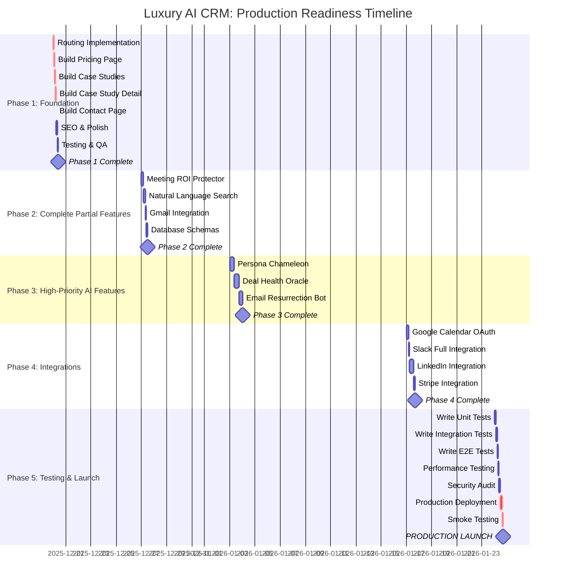

# 08 - Implementation Phases Timeline

**Purpose:** Keep execution focused and on track  
**Use Cases:** Project planning, sprint tracking, stakeholder updates  
**Status:** Ready to execute - clear roadmap defined

---

## 📅 Complete Implementation Timeline (Gantt Chart)



---

## 📋 Phase-by-Phase Breakdown

### 📍 PHASE 1: Foundation (Week 1)
**Goal:** Make site production-ready with routing and complete marketing

**Duration:** 10 hours (Dec 20-27, 2025)  
**Priority:** 🔥🔥🔥 CRITICAL  
**Status:** ⏳ Ready to start

#### Tasks:

| # | Task | Priority | Time | Owner | Status |
|---|------|----------|------|-------|--------|
| 1.1 | Implement React Router v6 | 🔥🔥🔥 | 2h | Dev | ⏳ Pending |
| 1.2 | Build Pricing Page | 🔥🔥🔥 | 1h | Dev | ⏳ Pending |
| 1.3 | Build Case Studies Overview | 🔥🔥🔥 | 1.5h | Dev | ⏳ Pending |
| 1.4 | Build Case Study Detail | 🔥🔥🔥 | 1h | Dev | ⏳ Pending |
| 1.5 | Build Contact Page | 🔥🔥🔥 | 0.5h | Dev | ⏳ Pending |
| 1.6 | SEO Meta Tags & Polish | 🔥🔥 | 2h | Dev | ⏳ Pending |
| 1.7 | Testing & QA | 🔥🔥 | 2h | Dev/QA | ⏳ Pending |

**Deliverable:** Production-ready marketing site with routing

**Success Criteria:**
- ✅ All pages accessible via URL
- ✅ Browser back/forward works
- ✅ SEO meta tags added
- ✅ All user journeys tested
- ✅ Lighthouse SEO >90
- ✅ Zero critical bugs

**Blocker Resolution:**
- ✅ Blocker #1 (Routing) → FIXED
- ✅ Blocker #2 (Missing Pages) → FIXED

---

### 📍 PHASE 2: Complete Partial Features (Week 2)
**Goal:** Bring 40-75% features to 100% completion

**Duration:** 12 hours (Dec 27 - Jan 3, 2026)  
**Priority:** 🔥🔥 HIGH  
**Status:** ⏳ Waiting for Phase 1

#### Tasks:

| # | Task | Priority | Time | Current % | Target % |
|---|------|----------|------|-----------|----------|
| 2.1 | Complete Meeting ROI Protector | 🔥🔥 | 4h | 75% | 100% |
| 2.2 | Complete Natural Language Search | 🔥🔥 | 3h | 60% | 100% |
| 2.3 | Complete Gmail Integration | 🔥 | 2h | 60% | 100% |
| 2.4 | Complete Database Schemas | 🔥 | 3h | 60% | 100% |

**Deliverable:** All partial features fully functional

**Success Criteria:**
- ✅ Meeting qualification: 90% accuracy
- ✅ Search: 90% query success rate
- ✅ Gmail: 99% send success
- ✅ Database: All schemas complete

---

### 📍 PHASE 3: High-Priority AI Features (Weeks 3-4)
**Goal:** Build top revenue-generating AI features

**Duration:** 24 hours (Jan 3-17, 2026)  
**Priority:** 🔥🔥 HIGH  
**Status:** ⏳ Waiting for Phase 2

#### Tasks:

| # | Task | Priority | Time | Impact | Target Metric |
|---|------|----------|------|--------|---------------|
| 3.1 | Build Persona Chameleon | 🔥🔥 | 8h | High | +30% reply rate |
| 3.2 | Build Deal Health Oracle | 🔥🔥 | 10h | High | 85% prediction accuracy |
| 3.3 | Build Email Resurrection Bot | 🔥 | 6h | Medium | 15-20% revival rate |

**Deliverable:** 3 major AI features live and tested

**Success Criteria:**
- ✅ Persona classification: >85% accuracy
- ✅ Deal health prediction: >85% accuracy
- ✅ Email revival rate: 15-20%
- ✅ All features tested with real data

**Blocker Resolution:**
- ✅ Blocker #3 (AI Output UI) → FIXED

---

### 📍 PHASE 4: Integrations (Week 5)
**Goal:** Complete core integration suite

**Duration:** 16 hours (Jan 17-24, 2026)  
**Priority:** 🔥 MEDIUM-HIGH  
**Status:** ⏳ Waiting for Phase 3

#### Tasks:

| # | Task | Priority | Time | Depends On | Blocker |
|---|------|----------|------|------------|---------|
| 4.1 | Google Calendar OAuth | 🔥🔥 | 4h | Google approval | External |
| 4.2 | Slack Full Integration | 🔥 | 2h | Slack webhook | Internal |
| 4.3 | LinkedIn Integration | 🔥 | 8h | LinkedIn API approval | External |
| 4.4 | Stripe Integration | 🔥 | 2h | Stripe credentials | Internal |

**Deliverable:** Complete integration stack

**Success Criteria:**
- ✅ Calendar booking: 100% success
- ✅ Slack alerts: 99% delivery
- ✅ LinkedIn: Connections sync
- ✅ Stripe: Usage data syncs daily

**External Dependencies:**
- Google OAuth approval (1-2 days)
- LinkedIn API access (2-4 weeks)
- Slack webhook config (instant)
- Stripe API credentials (1 day)

---

### 📍 PHASE 5: Testing & Launch (Week 6)
**Goal:** Achieve 80%+ test coverage and launch

**Duration:** 10 hours + deployment (Jan 24-31, 2026)  
**Priority:** 🔥🔥🔥 CRITICAL  
**Status:** ⏳ Waiting for Phase 4

#### Tasks:

| # | Task | Priority | Time | Coverage | Status |
|---|------|----------|------|----------|--------|
| 5.1 | Write Unit Tests | 🔥🔥🔥 | 3h | 80% | ⏳ Pending |
| 5.2 | Write Integration Tests | 🔥🔥 | 2h | 100% edge functions | ⏳ Pending |
| 5.3 | Write E2E Tests | 🔥🔥 | 1h | Critical flows | ⏳ Pending |
| 5.4 | Performance Testing | 🔥 | 2h | Load testing | ⏳ Pending |
| 5.5 | Security Audit | 🔥🔥 | 2h | OWASP top 10 | ⏳ Pending |
| 5.6 | Production Deployment | 🔥🔥🔥 | 4h | Deploy + config | ⏳ Pending |
| 5.7 | Smoke Testing | 🔥🔥🔥 | 2h | All flows | ⏳ Pending |

**Deliverable:** Production-ready, tested, deployed system

**Success Criteria:**
- ✅ Test coverage >80%
- ✅ All tests passing
- ✅ Performance benchmarks met
- ✅ Security audit complete
- ✅ Monitoring configured
- ✅ Production deployed
- ✅ System stable

**Blocker Resolution:**
- ✅ Blocker #4 (Error Handling) → FIXED
- ✅ Risk #5 (Test Coverage) → RESOLVED

---

## 📊 Timeline Summary

| Phase | Duration | Dates | Deliverable | Critical? |
|-------|----------|-------|-------------|-----------|
| **Phase 1** | 10 hours | Dec 20-27 | Production marketing site | ✅ YES |
| **Phase 2** | 12 hours | Dec 27 - Jan 3 | Complete partial features | ✅ YES |
| **Phase 3** | 24 hours | Jan 3-17 | Top AI features | ✅ YES |
| **Phase 4** | 16 hours | Jan 17-24 | Complete integrations | ⚠️ Partial |
| **Phase 5** | 10 hours | Jan 24-31 | Testing & launch | ✅ YES |
| **TOTAL** | **72 hours** | **6 weeks** | **PRODUCTION LAUNCH** | ✅ YES |

**Target Launch Date:** 🚀 **January 31, 2026**

---

## 🎯 Milestone Schedule

### Milestone 1: Foundation Complete (Dec 27, 2025)
**Deliverable:** All pages accessible, routing works  
**Completion:** Phase 1  
**Criteria:**
- ✅ 25 public routes working
- ✅ 11 protected routes working
- ✅ 4 missing pages built
- ✅ SEO optimized

---

### Milestone 2: Feature Complete (Jan 3, 2026)
**Deliverable:** All partial features at 100%  
**Completion:** Phase 2  
**Criteria:**
- ✅ Meeting ROI Protector: 100%
- ✅ Natural Language Search: 100%
- ✅ Gmail Integration: 100%
- ✅ Database: 100%

---

### Milestone 3: AI Features Live (Jan 17, 2026)
**Deliverable:** Top 3 revenue features working  
**Completion:** Phase 3  
**Criteria:**
- ✅ Persona Chameleon: 100%
- ✅ Deal Health Oracle: 100%
- ✅ Email Resurrection: 100%

---

### Milestone 4: Integration Complete (Jan 24, 2026)
**Deliverable:** Full integration stack  
**Completion:** Phase 4  
**Criteria:**
- ✅ Google Calendar: Working
- ✅ Slack: Working
- ✅ LinkedIn: Working (if approved)
- ✅ Stripe: Working

---

### Milestone 5: 🚀 PRODUCTION LAUNCH (Jan 31, 2026)
**Deliverable:** Live production system  
**Completion:** Phase 5  
**Criteria:**
- ✅ Test coverage >80%
- ✅ All critical bugs fixed
- ✅ Performance optimized
- ✅ Security audited
- ✅ Deployed and stable

---

## 📈 Progress Tracking

### Week-by-Week Progress

**Week 1 (Dec 20-27):**
- [ ] Routing implemented
- [ ] 4 pages built
- [ ] SEO optimized
- [ ] QA complete
- **Expected:** 45% → 60% production-ready

**Week 2 (Dec 27 - Jan 3):**
- [ ] Meeting ROI: 100%
- [ ] NL Search: 100%
- [ ] Gmail: 100%
- [ ] Database: 100%
- **Expected:** 60% → 75% production-ready

**Week 3-4 (Jan 3-17):**
- [ ] Persona Chameleon: 100%
- [ ] Deal Health: 100%
- [ ] Email Resurrection: 100%
- **Expected:** 75% → 85% production-ready

**Week 5 (Jan 17-24):**
- [ ] Calendar: Working
- [ ] Slack: Working
- [ ] LinkedIn: Working
- [ ] Stripe: Working
- **Expected:** 85% → 92% production-ready

**Week 6 (Jan 24-31):**
- [ ] Tests written (80% coverage)
- [ ] Production deployed
- [ ] Smoke tests passed
- [ ] Monitoring active
- **Expected:** 92% → 100% production-ready ✅

---

## ⚠️ Risk Mitigation

### Risk: External Dependencies Delay
**Affected:** Phase 4 (LinkedIn, Google Calendar)  
**Probability:** MEDIUM  
**Impact:** Can delay Phase 4 by 1-2 weeks

**Mitigation:**
- Start OAuth applications NOW (Phase 1)
- Build features assuming APIs approved
- Test with mock data
- Deploy without LinkedIn if needed

---

### Risk: Scope Creep
**Affected:** All phases  
**Probability:** HIGH  
**Impact:** Can delay launch indefinitely

**Mitigation:**
- Strict scope freeze after Phase 1
- No new features until after launch
- Bug fixes only in Phases 4-5
- Track all requests as "post-launch"

---

### Risk: Test Failures
**Affected:** Phase 5  
**Probability:** MEDIUM  
**Impact:** Can delay launch by 1 week

**Mitigation:**
- Start writing tests in Phase 2
- Don't wait until Phase 5
- Fix bugs immediately
- Maintain >80% coverage threshold

---

## 🎯 Daily Execution Plan

### Example: Week 1, Day 1 (Dec 20)
```
09:00-11:00 (2h) - Routing Implementation
  ├─ Install React Router v6
  ├─ Create route wrappers (9 files)
  ├─ Create auth guards (2 files)
  ├─ Update App.tsx
  └─ Test all routes

11:00-12:00 (1h) - Build Pricing Page
  ├─ Create component
  ├─ Add 3 tier cards
  ├─ Add comparison table
  └─ Test responsive

13:00-14:30 (1.5h) - Build Case Studies
  ├─ Create overview component
  ├─ Add filter bar
  ├─ Add case study grid
  └─ Test filtering

14:30-15:30 (1h) - Build Case Study Detail
  ├─ Create detail component
  ├─ Add hero section
  ├─ Add results section
  └─ Test routing

15:30-16:00 (0.5h) - Build Contact Page
  ├─ Create form component
  ├─ Add validation
  └─ Test submission

END OF DAY: Phase 1 (Steps 1-5) Complete ✅
```

---

## 📞 Reporting & Updates

### Daily Standup Format:
```
Yesterday:
- Completed: [Task]
- Blockers: [None/Issue]

Today:
- Plan: [Task]
- Expected completion: [Time]

Risks:
- [Any risks identified]
```

### Weekly Progress Report:
```
Week [X] Summary:
- Planned: [Hours]
- Actual: [Hours]
- Completed: [Tasks]
- Blockers: [Issues]
- Next Week: [Plan]

Progress: [X]% → [Y]%
On Track: [Yes/No]
```

---

**Reference:**
- Detailed Plan: `/docs/progress/02-production-readiness-audit.md`
- Task Specs: `/docs/tasks/`
- Feature Specs: `/docs/features/`

---

**Status:** ✅ Timeline defined - Ready to execute  
**Launch Date:** 🚀 January 31, 2026  
**Confidence:** HIGH - Clear path, realistic timeline

---

*This timeline provides clear execution guidance with milestones, dependencies, and risk mitigation.*
