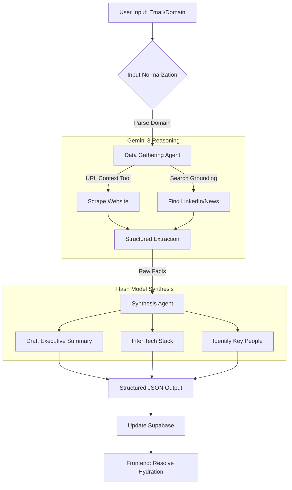

# AI Auto-Enrichment System ("Deep Dossier")

## 0. Executive Summary
**Goal:** When a lead is added, Sun AI automatically researches, synthesizes, and explains who they are, what their company is doing, and how to sell to them — before a human touches the record.
**Value:** Transforms the CRM from "data storage" to "intelligence engine".
**Time Saved:** 20–30 minutes per lead.

---

## 1. User Journey (The "Calm Luxury" Flow)

### Scenario
A sales rep pastes `jane@fintechco.com` into the "Add Lead" input.

### Experience
1. **Input:** Rep submits email.
2. **Immediate Transition:** System enters "Hydrating Profile..." state (No spinners, just calm status updates).
3. **Intelligence Gathering:** AI researches Jane + FintechCo across public sources.
4. **Resolution:** Profile resolves into a clear, structured **Deep Dossier**.

### Outcome
Sales rep immediately knows:
- Who they are
- What they care about
- How to approach them

---

## 2. Multi-Screen UI/UX Flow

### Screen A: Add Lead (Entry Point)
*Purpose: Trigger enrichment without friction.*

**Layout:**
- **Input:** Single email/domain input.
- **CTA:** Minimal "Add Lead" button.
- **Constraints:** No optional fields. No clutter.

**Behavior:**
- Transitions immediately to Screen B on submit.
- No confirmation modals.

> **Figma Make AI Prompt:**
> "Design a minimal 'Add Lead' screen for a luxury AI CRM. Layout: Single email/domain input. Primary CTA: 'Add Lead'. No secondary fields. Calm spacing, premium typography. Behavior: On submit, transition immediately to enrichment state. Tone: Effortless, Executive."

### Screen B: Enrichment State ("Hydrating...")
*Purpose: Show intelligence without anxiety.*

**UX Philosophy:**
- **No Spinners:** Spinners imply waiting.
- **Progressive Disclosure:** Show what the AI is doing.

**Visuals:**
- Centered card with soft animated shimmer.
- **Status Text Sequence:**
  1. "Analyzing public data..."
  2. "Identifying company signals..."
  3. "Synthesizing profile..."

> **Figma Make AI Prompt:**
> "Design an AI enrichment loading state titled 'Hydrating Profile...'. Visuals: Soft animated shimmer. Progressive status text that updates every few seconds. No spinners, no percentages. Tone: Calm, Confident, Intelligent. Motion: Slow, deliberate."

### Screen C: Deep Dossier (Main Profile View)
*Purpose: Instant understanding.*

**Structure (Vertical Flow):**
1.  **Header:** Name, Role, Company, Sun Score, Status ("Enriched").
2.  **AI Executive Summary (Hero Section):** A single paragraph written for humans.
    *   *Example:* "CTO at Series A fintech focused on payments automation. Likely technical buyer. Speed-to-market and reliability matter more than cost."
3.  **Intelligence Cards:**
    *   **Company Snapshot:** Industry, Size, Location, Funding, News.
    *   **Tech Stack Signals:** Frontend, Backend, Infra, Payments.
    *   **Key People:** Decision Makers, inferred roles.

> **Figma Make AI Prompt:**
> "Design a luxury CRM lead profile screen called 'Deep Dossier'. Layout: Vertical editorial flow. No tabs. Clear hierarchy. Top: Lead name, role, company, Sun Score badge. Primary Card: AI-written executive summary. Secondary Cards: Company Snapshot, Tech Stack Signals, Key People. Style: Calm, high-end, generous spacing."

---

## 3. AI Workflow & Logic (Gemini 3 Pipeline)

### Mermaid Workflow Diagram

### Step-by-Step Logic
1.  **Input Normalization:** Parse domain, infer company name.
2.  **Data Gathering (Grounding):**
    *   **Tools:** URL Context, Search Grounding, Deep Research Mode.
    *   **Sources:** Corporate site, Public LinkedIn, Crunchbase data, News APIs.
3.  **Structured Extraction (Gemini 3 Pro):** Extract facts only. Attribute uncertainty.
4.  **Synthesis (Gemini 3 Flash):** Write the "Executive Summary" in a human tone.
5.  **Output:** Strict JSON Schema.

### Gemini 3 Features Mapped
| Feature | Usage |
| :--- | :--- |
| **Gemini 3 Pro** | Deep reasoning & fact extraction |
| **Gemini 3 Flash** | Fast summarization & synthesis |
| **URL Context Tool** | Website scraping & grounding |
| **Search Grounding** | News, funding, & recent events |
| **Structured Outputs** | Enforcing strict JSON schema |

---

## 4. Feature Task Matrix

| Component | Task | Type | Status |
| :--- | :--- | :--- | :--- |
| **Backend** | Integrate Gemini 3 Client | Core | ⬜ |
| **Backend** | Create `enrich_lead` Edge Function | Core | ⬜ |
| **Backend** | Implement Search/Scrape Tools | Advanced | ⬜ |
| **Frontend** | Build `AddLeadForm` (Screen A) | Core | ⬜ |
| **Frontend** | Build `HydrationState` (Screen B) | Core | ⬜ |
| **Frontend** | Build `DeepDossier` View (Screen C) | Core | ⬜ |
| **Logic** | Implement "Progressive Status" messages | Core | ⬜ |
| **Logic** | Error Handling (Failed Enrichment) | Core | ⬜ |
| **Advanced** | Tech Stack Inference Logic | Advanced | ⬜ |
| **Advanced** | Key Person Identification | Advanced | ⬜ |

---

## 5. Production Ready Checklist

### Data Integrity
- [ ] Confidence scores implemented
- [ ] Inferred data clearly marked vs. confirmed data
- [ ] Fallback UI for missing data points

### Performance
- [ ] "Hydration" animation smooth (60fps)
- [ ] Progressive rendering (show partial data if full fails)
- [ ] Timeout handling (>30s)

### Ethics & Privacy
- [ ] No scraping of private/gated data
- [ ] Disclaimer: "Publicly available signals"
- [ ] No guessing of personal identities/PII

### Mobile Responsiveness
- [ ] Single-column layout verified
- [ ] Touch targets >44px
- [ ] No hover dependencies
