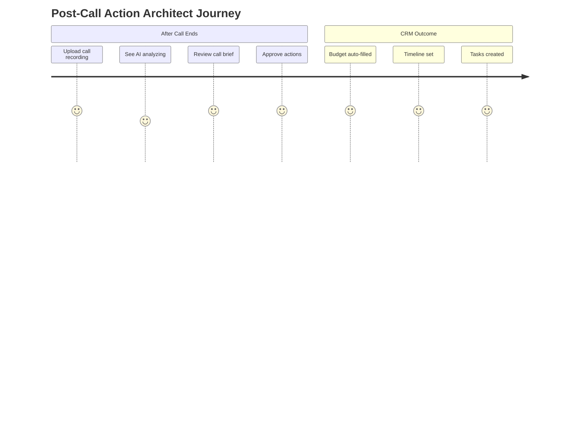
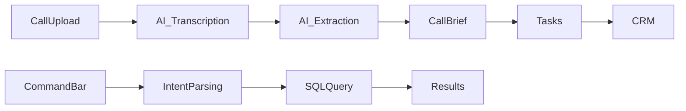

# Sales Intelligence OS: Post-Call Action Architect & Natural Language CRM

## Role & Intent
**Role**: Senior Product Designer + AI Systems Architect
**Goal**: Create a luxury, intelligence-first CRM experience.
*   Calm, executive-grade UI
*   Zero manual data entry
*   AI that turns conversations into action
*   No clutter. No dashboards for the sake of dashboards.

## Core Pages / Routes
*   `/crm/leads/:id/calls` (Call History)
*   `/crm/leads/:id/call/:callId` (Specific Call Brief)
*   `/crm/search` (Natural Language Search Results)

---

## Part 1: Post-Call "Action Architect"

### 1. System View
An AI note-taker + structured extractor + task engine that:
*   Accepts call audio or transcript
*   Understands business intent
*   Updates CRM automatically
*   Generates tasks with owners and deadlines

### 2. User Journey


### 3. Screen A: Call Upload / Ingestion
**Purpose**: Turn raw conversation into intelligence.
*   **Desktop**: Centered upload card, drag & drop zone.
*   **Mobile**: Full-width "Upload Recording" CTA.
*   **Visuals**: Trust indicators ("Secure • Private"), generous whitespace.

### 4. Screen B: AI Analysis State
**UX Principle**: Never show "processing". Show thinking.
*   **Copy**: "Transcribing conversation...", "Identifying scope...", "Extracting action items..."
*   **Visuals**: Soft animated text updates, no spinners.

### 5. Screen C: Call Brief (Core Output)
**Purpose**: Summarize a 45-minute call in 30 seconds.
*   **Layout**: Vertical, editorial flow.
*   **Section 1**: AI Call Summary (Hero).
*   **Section 2**: Extracted Signals (Cards: Budget, Timeline, Priority).
*   **Section 3**: Action Items (Auto-created tasks with owners/dates).

### 6. AI Workflow
*   **Transcription**: Whisper / Gemini
*   **Extraction**: Gemini 3 Pro (Structured Outputs)
*   **Schema**:
    ```json
    {
      "summary": "",
      "budget_range": "",
      "timeline": "",
      "action_items": [{ "task": "", "owner": "", "due_date": "" }],
      "confidence": 0.0
    }
    ```

---

## Part 2: Natural Language CRM Command Bar

### 7. Concept
A command bar for your CRM. Users stop learning filters. They just ask.

### 8. Screen D: Global CRM Command Bar
*   **Access**: Cmd+K or top search bar.
*   **Interaction**: Natural language queries.
*   **Example**: "Show Fintech CEOs in NY with budgets over $50k"

### 9. Screen E: Query Results Table
*   **Layout**: Clean data table.
*   **Smart Feedback**: Highlight match reason per row (e.g., "Matched: Fintech + Budget > $50k").
*   **Mobile**: Stacked cards.

### 10. Logic (Text-to-SQL)
*   Parse intent -> Resolve ambiguity -> Generate SQL/JSON filters.

---

## System Architecture



---

## Implementation Plan (Mega Prompts)

Use these prompts systematically to build the feature.

### Step 1: Core Shell & Routing
```text
Create the core file structure for the Sales Intelligence OS.
1. Create new directory `src/components/crm/intelligence`.
2. Create placeholder pages:
   - `CallIngestion.tsx` (Screen A)
   - `AnalysisState.tsx` (Screen B)
   - `CallBrief.tsx` (Screen C)
   - `CommandBar.tsx` (Screen D)
   - `SearchResults.tsx` (Screen E)
3. Setup routing in `App.tsx` (or a sub-router) to access these pages for testing.
4. Ensure shared layout (CRMNavigation) is applied.
```

### Step 2: Post-Call Action Architect (Screens A & B)
```text
Implement Screen A (Upload) and Screen B (Analysis) with "Calm Luxury" aesthetics.
1. `CallIngestion.tsx`:
   - Centered Drag & Drop Zone using `react-dropzone`.
   - Style: Glassmorphic card, generous padding, "Secure • Private" badge.
   - Transition: On drop -> Navigate to Analysis.
2. `AnalysisState.tsx`:
   - Use `motion/react` for text transitions.
   - Loop through status messages: "Transcribing...", "Analyzing Intent...", "Generating Tasks...".
   - No spinners. Use a soft pulsing background or gradient.
   - Transition: Auto-navigate to Call Brief after 3 seconds (mock).
```

### Step 3: Call Brief UI (Screen C)
```text
Implement the Editorial Call Brief (Screen C).
1. `CallBrief.tsx`:
   - Layout: Single column, max-width-3xl, centered.
   - Hero: "AI Summary" with gradient background.
   - Signals Grid: Cards for Budget, Timeline, Priority.
   - Action Items: List with checkboxes, distinct "Owner" avatars, and due dates.
2. Mock Data:
   - Create a robust mock object representing a "Fintech Discovery Call".
   - Pass this data to the components.
```

### Step 4: Natural Language Command Bar (Screen D)
```text
Implement the Global Command Bar.
1. `CommandBar.tsx`:
   - Trigger: Cmd+K listener.
   - UI: Modal dialog, minimal input field (no borders), "Ask anything..." placeholder.
   - State: "Thinking..." micro-interaction when typing stops.
   - Result Preview: Mock a list of leads that matches a query like "High value fintech leads".
```

### Step 5: Results View & Logic (Screen E)
```text
Implement the Search Results Page.
1. `SearchResults.tsx`:
   - Table view for Desktop, Card view for Mobile.
   - "Match Logic" Column: Explain WHY a row matched (e.g., "Matched 'NY' and '> $50k'").
   - Connect to Command Bar (passing query params).
```

---

## Progress Tracker

### Core Features (MVP)
- [ ] Call Upload UI (Drag & Drop)
- [ ] Analysis State (Animation logic)
- [ ] Call Brief (Summary, Signals, Actions)
- [ ] Command Bar (UI & Hotkey)
- [ ] Search Results (Table Layout)

### Advanced Features (Post-MVP)
- [ ] Real Audio Transcription (Whisper)
- [ ] Gemini API Integration (Extraction)
- [ ] Text-to-SQL logic
- [ ] Mobile-specific optimizations

## Production Checklist
- [ ] **Visuals**: No spinners, consistent spacing (8px grid), correct font hierarchy.
- [ ] **Interaction**: All hover states are defined, transitions are smooth (>300ms).
- [ ] **Responsiveness**: Tested on mobile breakpoint (375px).
- [ ] **Code Quality**: No hardcoded styles (use Tailwind), properly typed interfaces.
