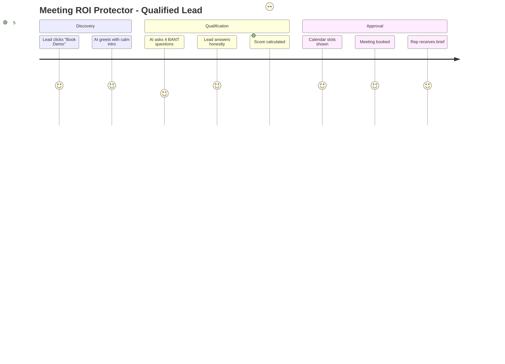
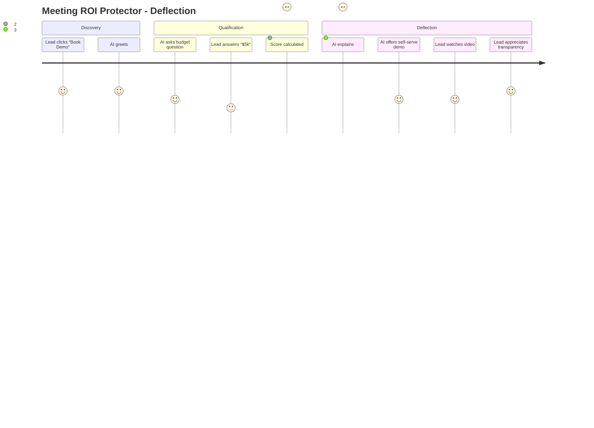

# Feature: Meeting ROI Protector

## Feature Overview

**Feature Name:** Meeting ROI Protector  
**Priority:** P0 (Build Now)  
**Status:** 🔴 Planned  
**Owner:** Product + AI Team  
**Estimated Effort:** 2 weeks  
**Revenue Impact:** +35% rep productivity (equivalent to 2.5 FTEs saved)

---

## User Story

**As a** sales rep drowning in unqualified meetings  
**I want** an AI to pre-qualify leads before they book my calendar  
**So that** I only spend time on high-value conversations and avoid tire-kickers

---

## Problem Statement

### Current Pain Points
1. **Time Waste**: Reps spend 8+ hours/week on low-quality discovery calls
2. **No Gatekeeper**: Anyone can book a meeting via Calendly without qualification
3. **Inconsistent BANT**: Some reps ask qualifying questions, others don't
4. **Post-Meeting Regret**: "That was a 30-minute call I'll never get back"
5. **Opportunity Cost**: While on bad calls, high-value deals go cold

### Market Context
- Industry average: 40% of sales meetings are unqualified
- Cost per wasted meeting: $150 (rep time + overhead)
- Luxury positioning: Premium products need premium buyers

---

## Success Criteria

### Quantitative
- ✅ **70%+ deflection rate** on sub-$25k budget leads (below our ICP)
- ✅ **Meeting-to-opportunity conversion improves from 35% → 55%**
- ✅ **Average qualification time: <3 minutes** (user completes pre-call chat)
- ✅ **Rep satisfaction score: 4.5+/5** ("This saves me so much time")
- ✅ **False positive rate <5%** (qualified leads not deflected)

### Qualitative
- Users feel the AI is helpful, not gatekeeping rudely
- Deflected leads receive value (case study, demo video, webinar)
- Process feels luxury, not corporate-robotic

---

## User Journey

### Happy Path (Qualified Lead)


### Deflection Path (Unqualified Lead)


---

## Feature Specifications

### Screen A: Pre-Qualification Chat

**Route:** `/crm/meetings/qualify?source=website`

**Layout:**
- **Left Panel (60%):** Chat interface
  - Large, calm input field (no borders, shadow only)
  - AI messages on left (soft gray bubble)
  - User messages on right (brand accent color)
  - Typing indicator: "Thinking..." with subtle animation

- **Right Panel (40%):** Live Qualification Score Card
  - BANT Checklist (progressive reveal):
    - ✅ Budget: $75k (qualified)
    - ✅ Authority: Decision Maker
    - ✅ Need: CRM + AI enrichment
    - ⏳ Timeline: Asking...
  - Overall Score: Circular progress (0-100)
  - Next Step Preview:
    - >70 score: "Select meeting time ↓"
    - 30-70 score: "Manager review required"
    - <30 score: "Here are some resources..."

**Mobile:**
- Single panel: Chat full-screen
- Score card collapses into floating chip (tap to expand)

---

### Conversation Flow (AI Script)

**Message 1 (Greeting):**
```
AI: "Hi there! I'm here to understand your goals and see 
if we're a fit. This should take ~2 minutes. Sound good?"
```

**Message 2 (Company Context):**
```
AI: "First, tell me a bit about your company. What industry 
are you in, and roughly how many people on your sales team?"

[User types: "Fintech, 15 sales reps"]

AI: "Got it. Fintech with a 15-person sales team. 
What's the biggest challenge your team faces with your 
current CRM?"
```

**Message 3 (Budget):**
```
AI: "To make sure we're aligned, what budget range are 
you working with for a CRM + AI solution?

Options (chips):
  - <$25k
  - $25k-$50k
  - $50k-$100k
  - $100k+
  - Not sure yet"
```

**Message 4 (Timeline):**
```
AI: "When are you hoping to have a solution in place?

Options:
  - This quarter
  - Next quarter
  - Just exploring
  - ASAP"
```

**Message 5 (Authority):**
```
AI: "Last question: Are you the final decision-maker, 
or will others be involved?

Options:
  - I decide
  - I recommend, someone else approves
  - Just gathering info"
```

---

### Decision Logic (Qualification Scoring)

**Scoring Model:**

```typescript
// Pseudo-logic (not code, but clear rules)

Budget Score:
  - "$100k+" → 40 points
  - "$50k-$100k" → 30 points
  - "$25k-$50k" → 15 points
  - "<$25k" → 0 points
  - "Not sure" → 10 points (exploratory, might convert)

Authority Score:
  - "I decide" → 30 points
  - "I recommend" → 20 points
  - "Just gathering info" → 5 points

Need Score:
  - Mentions pain = "manual data entry", "lost deals", 
    "can't find leads" → 20 points
  - Generic response → 10 points
  - No clear need → 0 points

Timeline Score:
  - "ASAP" or "This quarter" → 10 points
  - "Next quarter" → 7 points
  - "Just exploring" → 3 points

Total Score = Budget + Authority + Need + Timeline
Max = 100 points
```

**Outcome Decision Tree:**
```
IF score >= 70 THEN
  SHOW calendar slots
  CREATE lead in CRM with "High Priority" tag
  NOTIFY rep: "Hot lead incoming: [name]"

ELSE IF score 30-69 THEN
  MESSAGE: "Your request needs manager review. 
           Expect a reply within 24 hours."
  CREATE lead with "Manual Review" tag
  SEND Slack alert to sales manager

ELSE IF score < 30 THEN
  MESSAGE: "Based on your needs, our solutions start 
           at $50k. Here's a self-serve demo to explore:"
  SHOW resources:
    - Watch 5-min demo video
    - Download case study
    - Attend webinar (next one: Tuesday 2 PM)
  CREATE lead with "Nurture" tag (add to drip campaign)
  NO calendar access
END IF
```

---

### Screen B: Resource Library (Deflection)

**Route:** `/resources` (public page)

**Layout:**
- Hero: "Explore on Your Own"
- Card Grid:
  - **Card 1:** Interactive Demo (Loom video embedded)
  - **Card 2:** Case Study PDF (gated: email required)
  - **Card 3:** Upcoming Webinars (calendar of events)
  - **Card 4:** Pricing Guide (transparent pricing, no hidden costs)

**Call-to-Action:**
- "Still think we're a fit? Request a manager review"
- Button: "Talk to a Human" → Opens human-approval form

---

## AI Implementation Details

### Gemini Model Selection
**Model:** Gemini 2.0 Flash  
**Why:** Fast response (<1 second), conversational, handles follow-ups

**Prompt Engineering:**

**System Prompt:**
```
You are a polite, efficient sales qualification assistant 
for a luxury AI CRM company. Your goal is to qualify leads 
using BANT (Budget, Authority, Need, Timeline) in a calm, 
non-pushy way. Ask one question at a time. Be warm but 
professional. If the lead isn't qualified, gracefully 
direct them to self-serve resources without making them 
feel rejected.

Key rules:
- Never say "You don't qualify"
- Always offer value even if deflecting
- Use "we" language, not "I" (you represent the company)
- Keep responses under 50 words
- If user is evasive about budget, say: "No problem, 
  our solutions typically range $50k-$100k. Does that 
  align with your expectations?"
```

**Conversation History Context:**
- Store last 10 messages in session
- Pass to Gemini on each turn (for context continuity)
- Extract signals using structured outputs

**Structured Output Schema:**
```json
{
  "user_intent": "exploring_options | ready_to_buy | price_shopping",
  "budget_range": "under_25k | 25k_to_50k | 50k_to_100k | over_100k | unknown",
  "authority": "decision_maker | recommender | researcher",
  "timeline": "urgent | this_quarter | next_quarter | exploring",
  "pain_points": ["manual_entry", "lost_deals", "no_intelligence"],
  "qualification_score": 0-100,
  "recommended_action": "approve | manual_review | deflect",
  "next_question": "What question to ask next?"
}
```

---

## Database Schema

### Table: `meeting_qualification_sessions`
```sql
CREATE TABLE meeting_qualification_sessions (
  id UUID PRIMARY KEY DEFAULT uuid_generate_v4(),
  org_id UUID REFERENCES organizations(id),
  lead_id UUID REFERENCES leads(id) NULL, -- Created after qualification
  
  -- Session metadata
  source TEXT, -- 'website', 'linkedin_ad', 'email_campaign'
  started_at TIMESTAMPTZ DEFAULT NOW(),
  completed_at TIMESTAMPTZ,
  
  -- Conversation log
  messages JSONB DEFAULT '[]', -- [{role: 'ai'|'user', text: '...'}]
  
  -- Extracted signals
  company_name TEXT,
  industry TEXT,
  team_size INT,
  budget_range TEXT,
  authority TEXT,
  timeline TEXT,
  pain_points TEXT[],
  
  -- Scoring
  score INT, -- 0-100
  outcome TEXT, -- 'approved', 'manual_review', 'deflected'
  deflection_reason TEXT,
  
  -- Follow-up
  meeting_booked BOOLEAN DEFAULT FALSE,
  calendar_event_id TEXT, -- Link to Google Calendar event
  resources_sent TEXT[] -- Which assets were offered
);

CREATE INDEX idx_qual_sessions_outcome ON meeting_qualification_sessions(outcome, started_at DESC);
```

### Table: `deflection_resources`
```sql
CREATE TABLE deflection_resources (
  id UUID PRIMARY KEY,
  title TEXT,
  type TEXT, -- 'video', 'case_study', 'webinar', 'pricing_guide'
  url TEXT,
  thumbnail_url TEXT,
  description TEXT,
  
  -- Targeting
  min_budget INT, -- Show pricing guide only to >$50k leads
  industries TEXT[], -- Show fintech case study to fintech leads
  
  -- Analytics
  views INT DEFAULT 0,
  conversions INT DEFAULT 0 -- How many came back after viewing
);
```

---

## Edge Function Specifications

### Function: `qualify-meeting`

**Trigger:** HTTP POST from frontend chat

**Input:**
```json
{
  "session_id": "uuid",
  "message": "Fintech, 15 sales reps",
  "conversation_history": [...]
}
```

**Logic Flow:**
1. Fetch session from database
2. Append user message to conversation history
3. Call Gemini 2.0 Flash with system prompt + history
4. Parse structured output (BANT signals + score)
5. Update session record with extracted signals
6. Determine outcome (approve / review / deflect)
7. If deflected, fetch relevant resources from `deflection_resources`
8. Return AI response + next step to frontend

**Output:**
```json
{
  "ai_message": "Got it. What budget range are you working with?",
  "score": 45,
  "bant": {
    "budget": "unknown",
    "authority": "recommender",
    "need": ["manual_entry"],
    "timeline": "exploring"
  },
  "outcome": null, // null until final decision
  "resources": [] // empty unless deflecting
}
```

**Error Handling:**
- Gemini API timeout: "Our AI is taking longer than expected. Please refresh."
- Invalid input: "I didn't quite catch that. Could you rephrase?"
- Rate limit hit: "We're experiencing high traffic. Please try again in 1 minute."

---

### Function: `book-qualified-meeting`

**Trigger:** HTTP POST after qualification approved

**Input:**
```json
{
  "session_id": "uuid",
  "calendar_slot": "2025-12-20T14:00:00Z",
  "timezone": "America/New_York",
  "contact_info": {
    "name": "Jane Doe",
    "email": "jane@fintechco.com",
    "phone": "+1-555-0100"
  }
}
```

**Logic Flow:**
1. Verify session score >= 70 (security check)
2. Create lead record in `leads` table
3. Link lead to session via `lead_id`
4. Call Google Calendar API:
   - Find rep with availability at requested time
   - Create calendar event with lead details
   - Send invite to lead + rep
5. Generate pre-call brief (pull BANT data from session)
6. Notify rep via Slack: "New meeting booked: Jane Doe (Fintech, $75k budget, ASAP timeline)"
7. Send confirmation email to lead with:
   - Meeting details
   - Link to add to calendar
   - Pre-call questionnaire (optional)

**Output:**
```json
{
  "success": true,
  "meeting_id": "uuid",
  "calendar_event_url": "https://calendar.google.com/...",
  "confirmation_sent": true
}
```

---

## Integration Points

### Google Calendar Integration
- **Purpose:** Check rep availability, create events
- **Auth:** OAuth 2.0 (Calendar API scope: `calendar.events`)
- **Fallback:** If API unavailable, send email to rep with manual booking request

### Calendly Alternative
- **Option:** Use Calendly API instead of Google Calendar
- **Pros:** Easier routing logic, built-in reminders
- **Cons:** Additional cost ($12/user/month)

### Slack Notifications
- **Trigger:** High-value lead qualified (score >85)
- **Channel:** `#hot-leads` (private sales team channel)
- **Message Format:**
  ```
  🔥 Hot Lead Qualified!
  Name: Jane Doe
  Company: FintechCo
  Budget: $75k
  Timeline: This quarter
  Pain Points: Manual data entry, lost deals
  Meeting: Dec 20 @ 2 PM ET
  [View Lead Profile]
  ```

---

## UI/UX Specifications

### Visual Design (Calm Luxury)

**Color Palette:**
- Background: Warm off-white (#FEFDF8)
- Chat bubbles (AI): Soft gray (#F5F5F5)
- Chat bubbles (User): Brand accent (muted blue/green)
- Score card: Glassmorphic card with subtle shadow
- Progress circle: Gradient (green at 100, amber at 50, gray at 0)

**Typography:**
- AI messages: Sans-serif, 16px, line-height 1.6
- User input: Sans-serif, 16px (match AI for consistency)
- Score labels: 14px, medium weight

**Animations:**
- Message appear: Fade-in + slide-up (200ms ease-out)
- Score update: Circular progress animates smoothly (500ms)
- Typing indicator: 3 dots pulsing (motion/react)

**Micro-Interactions:**
- Quick reply chips: Hover lifts slightly (2px translateY)
- Send button: Pulse gently when input is filled
- Success state: Confetti animation (subtle, not overwhelming)

---

### Responsive Breakpoints

**Desktop (>1024px):**
- Two-column layout (chat + score card)
- Score card sticky on scroll

**Tablet (768px - 1024px):**
- Two-column layout (chat 70%, score card 30%)
- Score card collapses into accordion at top

**Mobile (<768px):**
- Single column: Chat full-screen
- Score card as bottom drawer (swipe up to reveal)
- Quick reply chips stack vertically

---

## Testing Plan

### Unit Tests
- [ ] Scoring logic: Given BANT inputs, correct score calculated
- [ ] Outcome logic: Score 80 → approve, 40 → review, 20 → deflect
- [ ] Message parsing: Extract budget/timeline from user responses

### Integration Tests
- [ ] Gemini API: Send mock conversation, receive structured output
- [ ] Calendar API: Create event, verify in test calendar
- [ ] Database: Session created, signals saved, lead linked

### End-to-End Tests
- [ ] **Test 1:** High-value lead (score 85) → Approved → Calendar booked
- [ ] **Test 2:** Mid-value lead (score 50) → Manual review → Slack alert sent
- [ ] **Test 3:** Low-value lead (score 20) → Deflected → Resources shown
- [ ] **Test 4:** Evasive user (dodges budget question) → AI rephrases gently

### User Acceptance Testing
- [ ] **Scenario 1:** Sales rep uses protector for 1 week, measures time saved
- [ ] **Scenario 2:** Deflected lead watches demo, returns via "Talk to Human"
- [ ] **Scenario 3:** Manager reviews borderline lead (score 55), approves manually

---

## Success Metrics (Post-Launch)

### Track Weekly

| Metric | Target | Measurement |
|--------|--------|-------------|
| Total sessions started | 100+/week | `COUNT(*) FROM meeting_qualification_sessions` |
| Completion rate | >80% | Sessions with `completed_at` not null |
| Approval rate | 25-35% | `outcome = 'approved'` / total sessions |
| Deflection rate | 50-60% | `outcome = 'deflected'` / total sessions |
| False positive rate | <5% | Manual review of deflected leads (sales manager tags wrong deflections) |
| Average session time | <3 min | `completed_at - started_at` average |
| Meeting-to-opp conversion | >55% | Opportunities created / meetings booked |

---

## Rollout Plan

### Week 1: Internal Testing
- Deploy to staging environment
- Sales team tests with mock personas
- Collect feedback, iterate on conversation flow

### Week 2: Soft Launch (Website Only)
- Enable on `/book-demo` page
- 50% traffic goes through protector, 50% direct to Calendly (A/B test)
- Monitor for bugs, adjust scoring thresholds

### Week 3: Full Launch
- 100% of website traffic uses protector
- Add to email campaign CTAs ("Book a qualified demo")
- Publish case study: "How we saved 8 hours/week per rep"

### Week 4: Optimization
- Analyze deflection patterns (why are leads failing?)
- Adjust scoring weights (e.g., if too many good leads deflected)
- Add industry-specific questions (e.g., "Are you GDPR compliant?" for EU leads)

---

## Risks & Mitigation

| Risk | Impact | Likelihood | Mitigation |
|------|--------|------------|------------|
| Users abandon chat mid-flow | High | Medium | Add progress bar, make skippable, offer "Call me instead" button |
| AI misunderstands user input | Medium | Medium | Add clarification prompts: "Did you mean $50k-$100k?" |
| Calendar API rate limits | High | Low | Implement queue, fallback to email scheduling |
| Leads complain about gatekeeping | High | Low | Test messaging with focus groups, emphasize value ("We respect your time") |
| Scoring model inaccurate | High | Medium | Start conservative (approve borderline leads), iterate based on conversion data |

---

## Future Enhancements (Post-MVP)

### Phase 2 Features
- **Voice Qualification:** Call-based qualification for phone leads
- **Video Intro:** AI-generated personalized video after qualification
- **Smart Rescheduling:** If no-show, AI re-engages via email
- **Industry Templates:** Custom questions per vertical (SaaS, E-commerce, Healthcare)

### Phase 3 Features
- **Multi-Language Support:** Qualify international leads
- **Competitor Detection:** "Currently using Salesforce?" → Custom battle card
- **Team Routing:** Assign to specialist (Enterprise AE vs. SMB AE) based on signals

---

## Figma Design Prompts

### Prompt 1: Create Chat Interface
```
Design a calm luxury chat interface for pre-call qualification.

Layout:
- Left: Chat messages (AI on left, user on right)
- Right: Live BANT score card (glassmorphic)
- Input: Large text field at bottom, "Send" button
- Quick reply chips above input (e.g., "$50k-$100k", "This quarter")

Style:
- Warm off-white background
- Soft shadows, rounded corners (12px)
- AI messages: Light gray bubble
- User messages: Muted blue/green bubble
- Score card: Circular progress (0-100), traffic light colors

Interactions:
- Message appears: Fade-in + slide-up animation
- Typing indicator: 3 pulsing dots
- Score updates: Smooth circular animation

Responsive:
- Mobile: Chat full-screen, score card as bottom drawer
- Desktop: Side-by-side layout
```

### Prompt 2: Create Deflection Resource Library
```
Design a resource library page for deflected leads.

Layout:
- Hero: "Explore Our Solutions" + subheading
- Card grid (2x2 on desktop, 1 column on mobile)
  - Card 1: "Watch Demo" (video thumbnail, play button)
  - Card 2: "Read Case Study" (PDF icon, download CTA)
  - Card 3: "Attend Webinar" (calendar icon, register CTA)
  - Card 4: "View Pricing" (pricing table preview)

Style:
- Calm luxury aesthetic (consistent with chat)
- Cards: Hover lifts slightly (4px shadow increase)
- CTA buttons: Primary style (brand color)

Footer:
- "Still think we're a fit? Request a callback"
- Button: "Talk to a Human"
```

---

## Systematic Implementation Prompts

### Step 1: Database Setup
```
Create the Supabase tables for Meeting ROI Protector.

1. Create `meeting_qualification_sessions` table with fields:
   - id, org_id, lead_id, source, started_at, completed_at
   - messages (JSONB array), company_name, industry, team_size
   - budget_range, authority, timeline, pain_points
   - score, outcome, deflection_reason
   - meeting_booked, calendar_event_id, resources_sent

2. Create `deflection_resources` table with fields:
   - id, title, type, url, thumbnail_url, description
   - min_budget, industries, views, conversions

3. Add Row-Level Security policies:
   - Users can only access their org's sessions
   - Resources are publicly readable

4. Create indexes:
   - idx_qual_sessions_outcome (outcome, started_at DESC)
   - idx_qual_sessions_lead (lead_id)
```

### Step 2: Edge Function - Qualify Meeting
```
Create Supabase Edge Function: `qualify-meeting`

Purpose: Handle chat messages, call Gemini AI, return response + score

Input: { session_id, message, conversation_history }

Logic:
1. Fetch session from database
2. Append user message to history
3. Call Gemini 2.0 Flash with:
   - System prompt (qualification assistant)
   - Conversation history
   - Request structured output (BANT signals)
4. Parse response, extract:
   - AI message text
   - Budget/authority/need/timeline
   - Qualification score (0-100)
5. Update session in database
6. If score complete:
   - Determine outcome (approve/review/deflect)
   - If deflected, fetch resources
7. Return JSON response to client

Error handling:
- Gemini timeout: Friendly error message
- Invalid session: 404 error
- Rate limit: Retry with exponential backoff
```

### Step 3: Frontend - Chat Component
```
Create React component: `MeetingQualificationChat`

Location: `/components/crm/intelligence/MeetingQualificationChat.tsx`

Features:
1. Chat message list (auto-scroll to bottom)
2. User input field with send button
3. Quick reply chips (budget/timeline options)
4. Typing indicator when AI is thinking
5. Live score card (right sidebar on desktop)

State management:
- Use React useState for messages array
- Use useEffect to call edge function on send
- Use motion/react for message animations

Responsive:
- Desktop: Two-column (chat + score card)
- Mobile: Chat full-screen, score card as drawer

Integration:
- Call `/functions/v1/qualify-meeting` on message send
- Update messages array with AI response
- Update score card with BANT signals
```

### Step 4: Calendar Integration
```
Integrate Google Calendar API for meeting booking.

1. Set up OAuth 2.0:
   - Create Google Cloud project
   - Enable Calendar API
   - Add OAuth consent screen
   - Store credentials in Supabase secrets

2. Create Edge Function: `book-qualified-meeting`
   - Input: session_id, calendar_slot, contact_info
   - Verify qualification score >= 70
   - Create lead in CRM
   - Call Calendar API to create event
   - Send confirmation email
   - Notify sales rep via Slack

3. Handle errors:
   - API unavailable: Send manual booking email to rep
   - Double-booking: Show alternative time slots
```

### Step 5: Testing & Launch
```
Test Meeting ROI Protector end-to-end.

Test scenarios:
1. High-value lead (Budget $100k, Decision maker, ASAP)
   → Score 90 → Approve → Calendar booking works

2. Mid-value lead (Budget $40k, Recommender, Next quarter)
   → Score 55 → Manual review → Slack alert sent

3. Low-value lead (Budget $5k, Researcher, Exploring)
   → Score 15 → Deflected → Resources shown

4. Edge cases:
   - User types gibberish → AI asks to clarify
   - User abandons mid-chat → Session saved, can resume
   - Multiple users qualify simultaneously → No conflicts

Launch checklist:
- [ ] All tests passing
- [ ] RLS policies verified (can't access other org's sessions)
- [ ] Gemini API rate limits configured
- [ ] Error monitoring set up (Sentry)
- [ ] Sales team trained on new flow
```

---

## Next Steps

1. **This Week:**
   - [ ] Design Figma mockups for chat interface + score card
   - [ ] Write Supabase schema migration SQL
   - [ ] Draft Gemini system prompt + test with Gemini Playground

2. **Next Week:**
   - [ ] Implement chat UI component (React + motion/react)
   - [ ] Deploy `qualify-meeting` edge function
   - [ ] Test with mock data, no real AI yet

3. **Week 3:**
   - [ ] Integrate Gemini API (real AI responses)
   - [ ] Add Google Calendar booking
   - [ ] Internal testing with sales team

4. **Week 4:**
   - [ ] Soft launch (50% traffic A/B test)
   - [ ] Monitor metrics, adjust scoring
   - [ ] Full launch + publish case study

---

**Status:** Ready for design + development kickoff  
**Next Document:** [07 - Persona Chameleon](./07-persona-chameleon.md)
