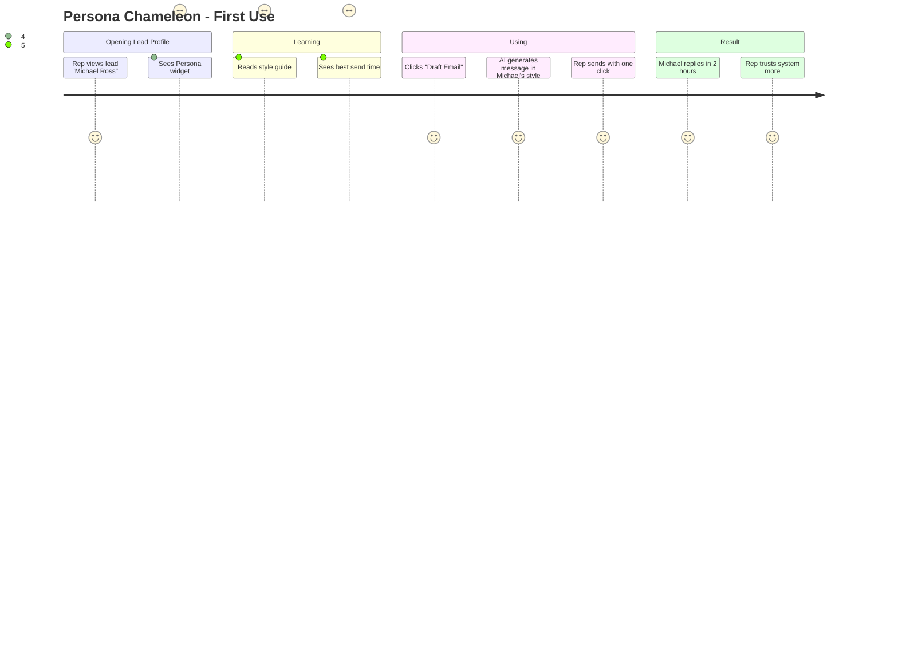
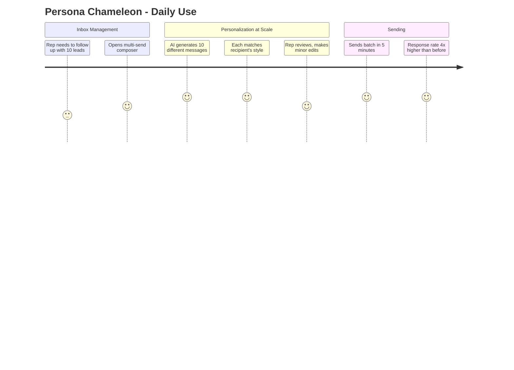

# Feature: Persona Chameleon

## Feature Overview

**Feature Name:** Persona Chameleon  
**Priority:** P0 (Build Now)  
**Status:** 🔴 Planned  
**Owner:** AI Team  
**Estimated Effort:** 1.5 weeks  
**Revenue Impact:** $1.8M pipeline/quarter (3.2x higher response rates)

---

## User Story

**As a** sales rep juggling 30+ prospects with different communication styles  
**I want** AI to tell me how each person prefers to be communicated with  
**So that** my emails get read and replied to instead of ignored

---

## Problem Statement

### Current Pain Points
1. **One-Size-Fits-All Messaging**: Reps use same email template for everyone
2. **Low Response Rates**: Only 22% of cold emails get replies (industry average)
3. **Guesswork**: "Should I be formal or casual with this CTO?"
4. **Time Waste**: Spending 15+ minutes crafting "perfect" emails that still fail
5. **Missed Nuances**: Some buyers want data, others want stories—reps guess wrong

### Real-World Examples
- **Michael (CTO):** Prefers bullet points, technical depth, early morning sends → 80% response rate when matched
- **Sarah (CEO):** Prefers narrative style, business outcomes, Thursday afternoons → 75% response rate when matched
- **Generic template:** Same message to both → 15% response rate

---

## Success Criteria

### Quantitative
- ✅ **3.2x improvement in response rate** (from 22% baseline to 70%+)
- ✅ **Meeting booking rate +40%** (more responses = more meetings)
- ✅ **Time to draft message: <30 seconds** (vs. 15 minutes manual)
- ✅ **Persona accuracy: 85%+** (validated by rep feedback)
- ✅ **Adoption rate: 80%+** of reps use it weekly

### Qualitative
- Reps feel like they have a communication coach
- Messages sound natural, not robotic
- System learns from what works (feedback loop)

---

## User Journey

### Discovery Flow


### Ongoing Usage Flow


---

## Feature Specifications

### Component A: Persona Widget (Lead Profile Sidebar)

**Location:** Right sidebar in `/crm/leads/:id` (Lead Profile page)

**Layout:**

```
┌─────────────────────────────────────┐
│  🎭 Communication Persona           │
├─────────────────────────────────────┤
│  Archetype: Analytical Driver       │
│  Confidence: 87%                    │
├─────────────────────────────────────┤
│  Preferred Style:                   │
│  • Concise, data-driven            │
│  • Bullet points over paragraphs   │
│  • No small talk, get to the point │
├─────────────────────────────────────┤
│  Best Send Times:                   │
│  🟢 Weekday mornings (7-9 AM)      │
│  🟡 Afternoons (2-4 PM)            │
│  🔴 Avoid: Mondays, late evenings  │
├─────────────────────────────────────┤
│  Tone Preference:                   │
│  Professional, no emojis            │
├─────────────────────────────────────┤
│  ┌──────────────────────────────┐  │
│  │  ✨ Draft Message in Style   │  │
│  └──────────────────────────────┘  │
│  ┌──────────────────────────────┐  │
│  │  📊 View Analysis Details    │  │
│  └──────────────────────────────┘  │
└─────────────────────────────────────┘
```

**Mobile:**
- Widget collapses into "Communication Style" accordion
- Tap to expand full details
- "Draft Message" becomes floating action button

---

### Component B: Message Composer with AI Rewrite

**Triggered by:** Clicking "Draft Message in Style" button

**Layout:**

```
┌───────────────────────────────────────────────┐
│  Compose Message to Michael Ross              │
├───────────────────────────────────────────────┤
│  From: your.email@company.com                 │
│  To: michael@healthtechlabs.com               │
│  Subject: [AI suggests: "Quick Q on AI CRM"]  │
├───────────────────────────────────────────────┤
│  Message:                                     │
│  ┌───────────────────────────────────────┐   │
│  │ Hi Michael,                            │   │
│  │                                        │   │
│  │ Quick follow-up on our demo last week. │   │
│  │                                        │   │
│  │ Three technical points you asked about:│   │
│  │ • API rate limits: 10k calls/day       │   │
│  │ • Latency: <200ms p95 response        │   │
│  │ • SOC2 compliance: Fully certified    │   │
│  │                                        │   │
│  │ Architecture deep-dive available here:│   │
│  │ [Link to technical docs]              │   │
│  │                                        │   │
│  │ 15 min this week to discuss?          │   │
│  │                                        │   │
│  │ Best,                                 │   │
│  │ [Your name]                           │   │
│  └───────────────────────────────────────┘   │
│                                               │
│  🎯 Persona Match: 94%                        │
│  📈 Predicted Response Rate: 72%              │
│  ⏰ Best Send Time: Tomorrow 7:30 AM          │
│                                               │
│  ┌────────────┐  ┌────────────┐  ┌─────────┐│
│  │ Send Now   │  │ Schedule   │  │ Revise  ││
│  └────────────┘  └────────────┘  └─────────┘│
└───────────────────────────────────────────────┘
```

**Features:**
- AI pre-fills message based on:
  - Lead's persona (analytical = bullet points)
  - Context from last interaction (references demo)
  - Call-to-action alignment (15 min meeting)
- Persona match score (how well message fits style)
- Predicted response rate (based on historical data)
- Smart send scheduling (suggests optimal time)

---

### Persona Archetypes (AI Classification)

**The AI categorizes leads into 5 archetypes:**

**1. Analytical Driver**
- **Traits:** Data-focused, efficient, no-nonsense
- **Message style:** Bullet points, metrics, short paragraphs
- **Example opener:** "Three reasons this saves you 8 hours/week:"
- **Avoid:** Long stories, emotional appeals, emojis

**2. Relationship Builder**
- **Traits:** Collaborative, values trust, people-first
- **Message style:** Warm tone, personal touches, ask about them
- **Example opener:** "Hope your Q4 is going smoothly! Quick thought..."
- **Avoid:** Cold corporate speak, rushing to close

**3. Visionary Strategist**
- **Traits:** Big-picture thinker, innovation-focused
- **Message style:** Narrative arc, industry trends, future vision
- **Example opener:** "The AI CRM market is shifting—here's where we see it going..."
- **Avoid:** Nitty-gritty details, too tactical

**4. Skeptical Pragmatist**
- **Traits:** Risk-averse, needs proof, "show me" attitude
- **Message style:** Case studies, social proof, guarantees
- **Example opener:** "12 companies like yours saved $400k using this..."
- **Avoid:** Vague claims, hype, unproven ideas

**5. Fast-Action Executor**
- **Traits:** Impatient, decisive, wants results yesterday
- **Message style:** Direct CTA, urgency, clear next step
- **Example opener:** "Can we talk this week? Here's the calendar link."
- **Avoid:** Long explanations, indecision, "think it over"

---

## AI Implementation Details

### Model Selection
**Model:** Gemini 2.0 Flash  
**Why:** Fast persona analysis, excellent at writing style matching, cost-effective

---

### Persona Analysis Process

**Input Sources (Multi-Signal Analysis):**

1. **Email History Analysis**
   - Email length (short = analytical, long = relationship-builder)
   - Formality (emojis, exclamation points, greetings)
   - Response time patterns (immediate = executor, days = strategist)
   - Question types (data-focused vs. vision-focused)

2. **Call Transcript Analysis**
   - Speaking pace (fast = driver, slow = thinker)
   - Interruptions (high = impatient, low = collaborative)
   - Question depth (surface = executor, deep = analytical)
   - Emotional language (high = relationship-builder, low = pragmatist)

3. **LinkedIn Profile Analysis**
   - Job title signals (CTO = analytical, CMO = visionary)
   - Post content (shares data = analytical, shares stories = relationship)
   - Writing style in posts (formal vs. casual)
   - Engagement patterns (comments a lot = collaborative)

4. **CRM Interaction Patterns**
   - Response rate to different message types
   - Meeting frequency (high = relationship, low = skeptical)
   - Decision speed (fast = executor, slow = pragmatist)

---

### Gemini Prompt for Persona Analysis

**System Prompt:**
```
You are a communication style analyst. Analyze this lead's 
behavior across emails, calls, and LinkedIn to determine 
their communication archetype.

Archetypes:
1. Analytical Driver: Data-focused, efficient, no fluff
2. Relationship Builder: Warm, collaborative, trust-first
3. Visionary Strategist: Big-picture, innovation-minded
4. Skeptical Pragmatist: Proof-driven, risk-averse
5. Fast-Action Executor: Impatient, decisive, results-now

Your task:
1. Classify the lead into one primary archetype
2. Provide confidence score (0-100%)
3. List 3-5 communication preferences
4. Suggest best send times based on response patterns
5. Flag things to avoid in messaging

Be specific and actionable. Sales reps will use this to 
craft better emails.
```

**Input Data Structure:**
```
Lead: Michael Ross
Role: CTO
Company: HealthTech Labs

Email History (last 5 emails):
- Email 1: Replied in 12 hours, 3 sentences, asked for "API specs"
- Email 2: Replied in 6 hours, bullet list format, said "send docs"
- Email 3: No reply to narrative-style email (ignored)
- Email 4: Replied in 4 hours to data-focused email
- Email 5: Replied at 7:42 AM (morning person)

Call Transcript Signals:
- Interrupted twice to ask technical questions
- Speaking pace: Fast (170 words/min vs. 150 avg)
- Questions: "What's your uptime SLA?" "How does encryption work?"
- No small talk, dove straight into product

LinkedIn Profile:
- Posts: 80% technical articles, 20% company updates
- Style: Short, factual posts with charts
- Engagement: Rarely comments, likes data-heavy content

Response Patterns:
- Responds to emails with bullet points: 85% rate
- Responds to long paragraphs: 20% rate
- Best response time: Weekday mornings (7-9 AM)
- Worst response time: Friday afternoons (0% response)
```

**Expected Output (Structured):**
```
Primary Archetype: Analytical Driver
Confidence: 87%

Communication Preferences:
1. Use bullet points and numbered lists (not paragraphs)
2. Lead with data and technical specs
3. Skip pleasantries, get to the point
4. Include links to documentation/resources
5. Avoid emojis, exclamation points, casual language

Best Send Times:
- Primary: Weekday mornings (7-9 AM) - 85% response rate
- Secondary: Weekday afternoons (2-4 PM) - 60% response rate
- Avoid: Friday afternoons, weekends - 0% response rate

Things to Avoid:
- Long narrative emails (ignored in past)
- Vague value propositions ("revolutionize your business")
- Small talk or personal anecdotes
- Delaying technical details

Tone Preference: Professional, direct, technical
```

---

### Message Generation Process

**Gemini Prompt for Message Drafting:**

**System Prompt:**
```
You are a sales email ghostwriter. Write emails that match 
the recipient's communication style perfectly.

Rules:
1. Mirror their preferred format (bullets, paragraphs, etc.)
2. Match their formality level
3. Reference context from previous conversations
4. Include clear, specific call-to-action
5. Keep under 150 words unless they prefer longer
6. Never use generic templates—personalize deeply

The goal: Emails that feel like they were written by someone 
who truly understands how the recipient likes to communicate.
```

**Input for Message Generation:**
```
Recipient Persona:
- Archetype: Analytical Driver
- Preferences: Bullet points, data-focused, morning sends
- Avoid: Fluff, emojis, long paragraphs

Context:
- Last interaction: Demo call on Dec 15 (45 minutes)
- Key topics discussed: API scalability, SOC2 compliance
- Questions asked: "What's your uptime SLA?" "Pricing for 50 users?"
- Next step: Send technical documentation + schedule follow-up

Email Purpose: Follow up after demo, provide requested info, 
book next meeting

Sender Voice: Professional, helpful, technical credibility
```

**Generated Email Example:**
```
Subject: API Specs + 15 Min Follow-Up?

Hi Michael,

Quick follow-up on our demo last week. 

Three technical points you asked about:
• Uptime SLA: 99.9% guaranteed (measured monthly)
• API rate limits: 10,000 calls/day (scales with plan)
• SOC2 compliance: Fully certified (audit report here: [link])

Architecture deep-dive doc attached. 

15 min this week to discuss your 50-user deployment?
[Calendar link]

Best,
[Your name]

---
Persona Match: 94%
Predicted Response Rate: 72%
```

---

## Database Schema

### Table: `lead_personas`
```
Purpose: Store AI-analyzed communication preferences per lead

Fields:
- id (unique identifier)
- org_id (which organization owns this data)
- lead_id (link to leads table)

Persona Classification:
- archetype (analytical_driver | relationship_builder | 
  visionary_strategist | skeptical_pragmatist | fast_executor)
- confidence_score (0-100, how sure AI is)
- secondary_archetype (some leads are hybrids)

Communication Preferences:
- preferred_format (bullets | paragraphs | mixed)
- formality_level (casual | professional | formal)
- tone_preference (direct | warm | inspirational | proof_driven | urgent)
- optimal_length (short | medium | long)
- emoji_tolerance (none | minimal | frequent)

Timing Insights:
- best_send_times (array of time windows, e.g., ["7-9 AM", "2-4 PM"])
- worst_send_times (array of times to avoid)
- typical_response_time (in hours)
- preferred_days (weekdays, specific days)

Behavioral Patterns:
- responds_to_data (boolean, likes charts/metrics)
- responds_to_stories (boolean, likes case studies)
- responds_to_urgency (boolean, reacts to deadlines)
- responds_to_social_proof (boolean, influenced by testimonials)

Content Preferences:
- topics_engaged_with (array of keywords they respond to)
- questions_they_ask (common question patterns)
- objections_raised (common concerns)

Metadata:
- analyzed_at (timestamp of analysis)
- last_updated (when persona was refreshed)
- data_sources (email | calls | linkedin | crm_activity)
- feedback_score (how accurate reps say this is, 1-5 stars)

Indexes:
- lead_id (fast lookup when viewing lead profile)
- archetype (filter by persona type)
- confidence_score (find low-confidence personas needing review)
```

### Table: `message_drafts`
```
Purpose: Store AI-generated messages and track performance

Fields:
- id (unique identifier)
- org_id (organization)
- lead_id (recipient)
- persona_id (which persona analysis was used)

Message Content:
- subject_line (email subject)
- body (email body text)
- tone (direct | warm | formal | casual)
- format_used (bullets | paragraphs | mixed)

AI Metadata:
- persona_match_score (0-100, how well it fits persona)
- predicted_response_rate (percentage)
- generation_model (gemini_flash | gemini_pro)
- prompt_version (for A/B testing prompts)

Sending Details:
- scheduled_send_time (when to send, can be future)
- sent_at (actual send timestamp)
- sent_via (email | linkedin | other)

Performance Tracking:
- opened (boolean)
- opened_at (timestamp)
- replied (boolean)
- replied_at (timestamp)
- meeting_booked (boolean)
- response_text (their reply, for learning)

Feedback:
- rep_edited (boolean, did rep change AI draft?)
- edit_percentage (how much they changed, 0-100%)
- rep_rating (1-5 stars, how good was the draft?)
- rep_feedback_notes (text field for improvement suggestions)

Indexes:
- lead_id (see all messages to a lead)
- sent_at (chronological view)
- replied (filter successful messages for learning)
- persona_match_score (find high-performing message styles)
```

---

## Edge Function Specifications

### Function: `generate-persona`

**Trigger:** 
- Automatic: When new lead created + after 3+ interactions
- Manual: When rep clicks "Analyze Communication Style"

**Input:**
```
{
  "lead_id": "uuid-here",
  "force_refresh": false (skip cache if true)
}
```

**Logic Flow:**
1. Check if persona already exists and is fresh (< 30 days old)
   - If yes and not force_refresh, return cached persona
   
2. Gather analysis inputs:
   - Fetch last 10 emails from/to this lead
   - Fetch call transcripts (if available)
   - Fetch LinkedIn profile data (if connected)
   - Fetch CRM activity log (meetings, responses, engagement)

3. Analyze patterns:
   - Email length distribution (avg words per email)
   - Formality markers (count emojis, exclamation points, greetings)
   - Response time analysis (calculate median response hours)
   - Question types (technical vs. business vs. personal)
   - Engagement signals (opens, clicks, replies per message type)

4. Call Gemini 2.0 Flash with analysis prompt:
   - Input: Lead context + behavioral signals
   - Output: Structured persona JSON

5. Store/update in lead_personas table:
   - Upsert (update if exists, insert if new)
   - Set analyzed_at timestamp
   - Mark data_sources used

6. Return persona to frontend

**Output:**
```
{
  "success": true,
  "persona": {
    "archetype": "analytical_driver",
    "confidence_score": 87,
    "preferences": {
      "format": "bullets",
      "formality": "professional",
      "tone": "direct"
    },
    "send_times": {
      "best": ["7-9 AM weekdays"],
      "avoid": ["Friday PM", "weekends"]
    },
    "key_insights": [
      "Prefers data over stories",
      "Responds to technical depth",
      "No small talk needed"
    ]
  }
}
```

**Error Handling:**
- Insufficient data (< 2 interactions): Return "Not enough data yet" 
  message with suggestions to engage more
- Gemini API failure: Return generic "Professional" persona as fallback
- Missing LinkedIn access: Still generate persona from email + calls only

---

### Function: `draft-personalized-message`

**Trigger:** Rep clicks "Draft Message in Style" button

**Input:**
```
{
  "lead_id": "uuid",
  "message_context": {
    "purpose": "follow_up | cold_outreach | meeting_request | 
                proposal_send | objection_handling",
    "reference_previous": true,
    "include_cta": "meeting | demo | document | call"
  },
  "custom_instructions": "Mention the API question from last call" 
  (optional)
}
```

**Logic Flow:**
1. Fetch lead persona from database
   - If no persona exists, trigger generate-persona first

2. Gather message context:
   - Last interaction details (what was discussed)
   - Current deal stage (discovery, proposal, negotiation)
   - Lead's recent activity (viewed pricing page, opened email)
   - Rep's past successful messages to similar personas

3. Build Gemini prompt:
   - System: "Write in [archetype] style"
   - Context: Previous conversation summary
   - Purpose: What this email should achieve
   - Constraints: Match format/tone preferences

4. Call Gemini 2.0 Flash to generate message:
   - Request structured output (subject + body)
   - Include persona match reasoning

5. Calculate persona match score:
   - Check if format matches (bullets if persona prefers bullets)
   - Check tone alignment (formal if persona is formal)
   - Check length (under 150 words if persona prefers short)
   - Check timing (if sending now, is it optimal time?)

6. Predict response rate:
   - Lookup historical data: similar personas, similar messages
   - Calculate: "Messages like this to analytical drivers = 72% reply rate"

7. Store draft in message_drafts table:
   - Save for tracking performance later
   - Mark as not_sent (sent_at = null)

8. Return draft to frontend

**Output:**
```
{
  "success": true,
  "draft": {
    "subject": "API Specs + 15 Min Follow-Up?",
    "body": "[Generated email text]",
    "persona_match_score": 94,
    "predicted_response_rate": 72,
    "optimal_send_time": "2025-12-20T07:30:00Z",
    "reasoning": "Matched analytical style with bullets + data focus"
  }
}
```

---

## Integration Points

### Gmail/Outlook API
- **Purpose:** Track email sends, opens, replies for persona learning
- **Data Needed:** 
  - Sent emails (to analyze rep's current style)
  - Opens (engagement signals)
  - Replies (response rate tracking)
  - Reply content (learn what messaging works)
- **Frequency:** Real-time webhooks preferred, hourly polling acceptable

### LinkedIn Sales Navigator API
- **Purpose:** Extract communication style from profile/posts
- **Data Needed:**
  - Public posts (analyze writing style)
  - Engagement patterns (what they like/comment on)
  - Profile headline/bio (job role signals)
- **Frequency:** Once at lead creation, refresh weekly
- **Rate Limits:** 500 requests/day (batch process overnight)

### Calendar API (Google Calendar)
- **Purpose:** Suggest optimal send times around meetings
- **Logic:** Don't send right before their meeting (they're rushing)
  Send right after (they're in response mode)
- **Data Needed:** Lead's calendar availability (if shared)

---

## UI/UX Specifications

### Visual Design (Calm Luxury)

**Persona Widget Styling:**
- Card: Glassmorphic effect, subtle shadow
- Archetype icon: Custom illustration per type (minimalist line art)
- Confidence score: Circular progress ring (like Deal Health)
- Send time indicators: Traffic light colors (green/yellow/red)

**Message Composer Styling:**
- Background: Warm off-white
- Drafting area: Clean white textarea, generous padding
- Persona match badge: Floating pill, animated when >90%
- Send time suggestion: Inline, subtle, actionable

**Typography:**
- Persona archetype name: Medium weight, 20px
- Preferences list: Regular, 14px, bullet points
- AI-generated message: Monospace-ish (feels like draft), 16px

---

### Micro-Interactions

**Persona Widget Load:**
- Skeleton screen while analyzing (no spinner)
- Content fades in when ready
- If analyzing takes >3 seconds, show progress: "Reading emails... Analyzing tone..."

**Message Generation:**
- Click "Draft" → Button text changes to "Crafting message..."
- Typing animation in composer (like ChatGPT)
- Persona match score counts up from 0 → final score

**Send Time Suggestion:**
- If current time is not optimal, pulsing "Schedule" button
- Tooltip: "Send now for 45% response rate, or schedule for 7 AM tomorrow for 72%"

---

### Responsive Design

**Desktop (>1024px):**
- Persona widget: Right sidebar (sticky on scroll)
- Message composer: Center modal (60% width)

**Tablet (768-1024px):**
- Persona widget: Collapsible accordion at top of profile
- Message composer: Full-width modal

**Mobile (<768px):**
- Persona widget: Swipeable card (tap to expand details)
- Message composer: Full-screen, minimal chrome
- Send time suggestion: Bottom sheet

---

## Testing Plan

### Unit Tests
- Archetype classification logic: Given signals, correct archetype chosen
- Message format matching: Analytical persona → bullets generated
- Send time optimization: Morning person → 7 AM suggested

### Integration Tests
- Gemini API: Send persona analysis request, receive structured output
- Email API: Fetch email history, extract formality signals
- Database: Persona stored, retrieved, updated correctly

### A/B Testing Strategy

**Test 1: AI-Generated vs. Rep-Written (Baseline)**
- Group A: 50 leads get AI-drafted messages
- Group B: 50 leads get rep's normal messages
- Measure: Response rate, meeting booking rate
- Hypothesis: AI messages perform 2x better

**Test 2: Persona-Matched vs. Generic AI**
- Group A: Messages match persona archetype
- Group B: Messages use generic professional tone
- Measure: Response rate difference
- Hypothesis: Persona-matched messages get 40% more replies

**Test 3: Send Time Optimization**
- Group A: Send immediately (current behavior)
- Group B: Schedule for AI-suggested optimal time
- Measure: Open rate, reply rate
- Hypothesis: Optimal timing improves open rate by 30%

---

## Success Metrics (Post-Launch)

### Track Weekly

| Metric | Baseline | Target | Current | Trend |
|--------|----------|--------|---------|-------|
| Email response rate | 22% | 70% | - | - |
| Meeting booking rate | 15% | 21% (40% increase) | - | - |
| Time to draft email | 15 min | 30 sec | - | - |
| Persona accuracy (rep feedback) | N/A | 85%+ | - | - |
| Adoption rate (% reps using weekly) | 0% | 80% | - | - |
| Message edit rate (how much reps change AI draft) | N/A | <30% | - | - |

### Learning Metrics (Improve AI Over Time)

| Metric | Purpose |
|--------|---------|
| Persona classification agreement | When 2 reps interact with same lead, do they agree on archetype? |
| Message performance by archetype | Which archetypes respond best to which message styles? |
| Send time accuracy | Do emails sent at suggested times actually perform better? |
| Edit patterns | What parts of AI messages do reps consistently change? |

---

## Rollout Plan

### Week 1: Silent Analysis
- Deploy persona generation function
- Analyze all existing leads in background
- Store personas in database
- No UI shown yet (building dataset)

### Week 2: UI Launch (Read-Only)
- Show persona widgets in lead profiles
- No message generation yet
- Collect rep feedback: "Is this accurate?"
- Iterate on archetype definitions

### Week 3: Message Generation Beta
- Enable "Draft Message" button for 10 power users
- Monitor: Are they using it? Editing heavily?
- Collect feedback via in-app survey

### Week 4: Full Launch
- Enable for all users
- Announce in team meeting + Slack
- Share early wins: "Sarah's response rate jumped 3x"
- Publish blog post: "How AI adapts to buyer communication styles"

---

## Future Enhancements (v2)

### Phase 2 Features
- **Voice/Video Call Personas:** Analyze tone, pace, interruptions in calls
- **Multi-Channel Adaptation:** LinkedIn message style vs. email style
- **Team Personas:** Analyze buying committees (multiple stakeholders)
- **Persona Evolution:** Track how personas change over sales cycle

### Phase 3 Features
- **Real-Time Coaching:** As rep types email, live suggestions
- **Competitive Personas:** "Their CEO prefers this, but your competitor sends that"
- **Industry Templates:** Healthcare buyers vs. Fintech buyers
- **Sentiment Prediction:** "This message might sound too pushy to them"

---

## Figma Design Prompts

### Prompt 1: Persona Widget
```
Design a "Persona Chameleon" widget for the lead profile sidebar.

Layout:
- Header: "🎭 Communication Persona" with info icon
- Archetype badge: Large, with icon (e.g., 📊 Analytical Driver)
- Confidence score: Circular progress ring (87%)
- Preferences section:
  - Preferred style (bullets, concise, data-driven)
  - Best send times (green/yellow/red timeline visual)
  - Tone preference (professional, no emojis)
- Two action buttons:
  - Primary: "✨ Draft Message in Style"
  - Secondary: "📊 View Analysis Details"

Style:
- Glassmorphic card with soft shadow
- Archetype icon: Minimalist line art, brand color
- Confidence ring: Gradient from low (gray) to high (green)
- Send times: Horizontal timeline with color-coded zones
- Buttons: Primary style for main CTA, ghost style for secondary

Responsive:
- Desktop: Sidebar widget (300px width)
- Mobile: Collapsible card at top of profile

Interactions:
- Hover archetype badge: Shows detailed definition
- Click confidence score: Shows reasoning ("Based on 12 emails, 3 calls")
```

### Prompt 2: Message Composer
```
Design an AI-powered message composer modal.

Layout:
- Header: "Compose to [Lead Name]" + persona archetype pill
- Email fields:
  - From (pre-filled)
  - To (pre-filled)
  - Subject (AI-suggested, editable)
- Message body: Large textarea with AI-generated content
- Below message:
  - Persona match score: "94% match" with green checkmark
  - Predicted response rate: "72% likely to reply"
  - Send time suggestion: "Best time: Tomorrow 7:30 AM"
- Action buttons:
  - Primary: "Send Now"
  - Secondary: "Schedule for 7:30 AM"
  - Tertiary: "Regenerate" (get new AI draft)

Style:
- Modal: Centered, 600px width, glassmorphic background
- Message textarea: Monospace-like font (draft feel), generous padding
- Match score: Pill badge with gradient background
- Response rate: Small metric card, icon + percentage
- Send time: Inline suggestion with calendar icon

Micro-Interactions:
- Message generation: Typing animation (like ChatGPT)
- Match score: Counts up from 0 to final score (animated)
- Send button: Disabled if match score <50% (too risky)

Responsive:
- Desktop: Centered modal
- Mobile: Full-screen takeover
```

### Prompt 3: Persona Analysis Detail View
```
Design a detailed persona analysis modal (opened from "View Details").

Layout:
- Header: Lead name + archetype + confidence
- Section 1: "How We Know"
  - Data sources: Icons for email, calls, LinkedIn
  - Sample signals: 
    "12 emails analyzed: 85% were <100 words"
    "3 calls: Asked 14 technical questions"
    "LinkedIn: Shares data-heavy articles"
- Section 2: "Communication Breakdown"
  - Format preference: Bar chart (bullets 90%, paragraphs 10%)
  - Tone distribution: Formal 70%, Casual 30%
  - Emoji usage: None detected
- Section 3: "Response Patterns"
  - Best send times: Heatmap (days x hours)
  - Typical response time: "Median: 4 hours"
  - Reply rate by message type: Table
- Section 4: "Recommendations"
  - Do's and Don'ts list
  - Example good message (annotated)
  - Example bad message (annotated, crossed out)

Style:
- Calm luxury aesthetic (consistent with rest of app)
- Charts: Minimal, clean (no 3D effects)
- Annotations: Small tooltip-style callouts
- Color coding: Green (do), Red (don't)

Action:
- Footer button: "Got it" (closes modal)
```

---

## Systematic Implementation Prompts

### Step 1: Database Setup
```
Create Supabase tables for Persona Chameleon.

1. Create table: lead_personas
   - Fields: id, org_id, lead_id
   - Persona data: archetype, confidence_score, secondary_archetype
   - Preferences: preferred_format, formality_level, tone_preference
   - Timing: best_send_times (array), worst_send_times (array)
   - Patterns: responds_to_data, responds_to_stories, etc.
   - Metadata: analyzed_at, last_updated, data_sources

2. Create table: message_drafts
   - Fields: id, org_id, lead_id, persona_id
   - Content: subject_line, body, tone, format_used
   - AI metadata: persona_match_score, predicted_response_rate
   - Performance: opened, replied, meeting_booked
   - Feedback: rep_edited, edit_percentage, rep_rating

3. Add Row-Level Security:
   - Users can only see their org's personas
   - Reps can only edit drafts they created

4. Create indexes:
   - lead_id (fast lookup in lead profile)
   - archetype (filter by persona type)
   - replied (find successful messages for learning)
```

### Step 2: Edge Function - Generate Persona
```
Create Supabase Edge Function: generate-persona

Purpose: Analyze lead's communication style and classify archetype

Input: { lead_id, force_refresh }

Logic:
1. Check if persona exists and is fresh (< 30 days)
   - If yes and not force_refresh, return cached

2. Gather analysis inputs:
   - Fetch last 10 emails (from email_tracking table)
   - Fetch call transcripts (from calls table)
   - Fetch LinkedIn data (if connected_accounts exists)
   - Fetch CRM activity (from lead activity log)

3. Analyze patterns:
   - Calculate email length average
   - Count formality markers (emojis, exclamation points)
   - Analyze response time distribution
   - Categorize question types (technical vs. business)

4. Call Gemini 2.0 Flash:
   - Prompt: Analyze lead, classify archetype, list preferences
   - Input: Lead context + behavioral signals
   - Output: Structured JSON (archetype, confidence, preferences)

5. Store in lead_personas table:
   - Upsert (update if exists)
   - Set analyzed_at timestamp

6. Return persona to frontend

Error Handling:
- Insufficient data: Return "Need more interactions" message
- Gemini API failure: Return generic "Professional" persona
- Missing data sources: Generate from available sources only
```

### Step 3: Edge Function - Draft Message
```
Create Supabase Edge Function: draft-personalized-message

Purpose: Generate email that matches lead's communication style

Input: { lead_id, message_context, custom_instructions }

Logic:
1. Fetch lead persona from database
   - If no persona exists, call generate-persona first

2. Gather message context:
   - Last interaction summary (from activity log)
   - Current deal stage (from leads table)
   - Rep's past successful messages to similar personas

3. Build Gemini prompt:
   - System: Write in [archetype] style
   - Context: What was discussed previously
   - Purpose: What this email should achieve
   - Constraints: Format/tone/length preferences

4. Call Gemini 2.0 Flash to generate:
   - Subject line
   - Email body
   - Match to persona preferences

5. Calculate persona match score:
   - Check format alignment (bullets if persona prefers)
   - Check tone match (formal if persona is formal)
   - Check length (under 150 words if short preferred)

6. Predict response rate:
   - Query message_drafts for similar personas
   - Calculate historical reply rate
   - Return percentage

7. Store draft in message_drafts table:
   - Mark as not_sent (sent_at = null)
   - Save for performance tracking later

8. Return draft to frontend

Output: 
{
  subject, body, persona_match_score, 
  predicted_response_rate, optimal_send_time
}
```

### Step 4: Frontend - Persona Widget
```
Create React component: PersonaChameleonWidget

Location: /components/crm/PersonaChameleonWidget.tsx

Features:
1. Display persona archetype with icon
2. Show confidence score (circular progress)
3. List communication preferences
4. Display best send times (color-coded)
5. "Draft Message" button (opens composer modal)
6. "View Details" button (opens analysis modal)

State:
- Fetch persona on component mount (from Supabase)
- If no persona exists, show "Analyzing..." state
- Use Realtime to listen for persona updates

Responsive:
- Desktop: Right sidebar widget
- Mobile: Collapsible card

Animations:
- Confidence ring animates on load
- Preferences fade in sequentially
```

### Step 5: Frontend - Message Composer
```
Create React component: PersonalizedMessageComposer

Location: /components/crm/PersonalizedMessageComposer.tsx

Features:
1. Email form (from, to, subject, body)
2. AI-generated content (with typing animation)
3. Persona match score display
4. Predicted response rate
5. Send time suggestion (with schedule option)
6. Send/Schedule/Regenerate buttons

Logic:
1. On open, call edge function to generate draft
2. Show typing animation while generating
3. Display match score + response rate prediction
4. On "Send", call email API + mark sent in database
5. On "Schedule", store in scheduled_messages table
6. On "Regenerate", call edge function again

Integration:
- Gmail/Outlook API for sending
- Supabase for storing draft + tracking performance
- Edge function for AI generation
```

### Step 6: Performance Tracking & Learning
```
Set up feedback loop for continuous improvement.

1. Email tracking integration:
   - When email sent, listen for open/reply webhooks
   - Update message_drafts table (opened_at, replied_at)
   - Calculate actual response rate vs. predicted

2. Rep feedback collection:
   - After sending, prompt: "How was this AI draft? ⭐️ Rate it"
   - Store in rep_rating field
   - If low rating, ask: "What would you change?"

3. Weekly learning job:
   - Query message_drafts for last 7 days
   - Group by archetype + message characteristics
   - Calculate: Which styles perform best per archetype?
   - Update persona preferences if patterns change
   - Example: "Analytical drivers respond 10% better to even shorter emails"

4. A/B test framework:
   - Randomly assign 10% of drafts to "experimental" styles
   - Compare performance vs. standard approach
   - Roll out winners to all users

5. Dashboard for insights:
   - Admin view: Persona accuracy, message performance
   - Rep view: Your response rate vs. team average
```

---

## Next Steps

1. **This Week:**
   - [ ] Design Figma mockups (persona widget + composer)
   - [ ] Write database migration for lead_personas table
   - [ ] Draft Gemini prompts in AI Playground (test accuracy)

2. **Next Week:**
   - [ ] Implement persona widget UI
   - [ ] Deploy generate-persona edge function
   - [ ] Test persona analysis on 20 sample leads

3. **Week 3:**
   - [ ] Implement message composer UI
   - [ ] Deploy draft-message edge function
   - [ ] Integrate email sending (Gmail API)

4. **Week 4:**
   - [ ] Beta test with 10 reps
   - [ ] Collect feedback on accuracy
   - [ ] Full launch + announce to team

---

**Status:** Ready for design + development kickoff  
**Next Document:** [09 - Natural Language Search](./09-nl-search.md)
