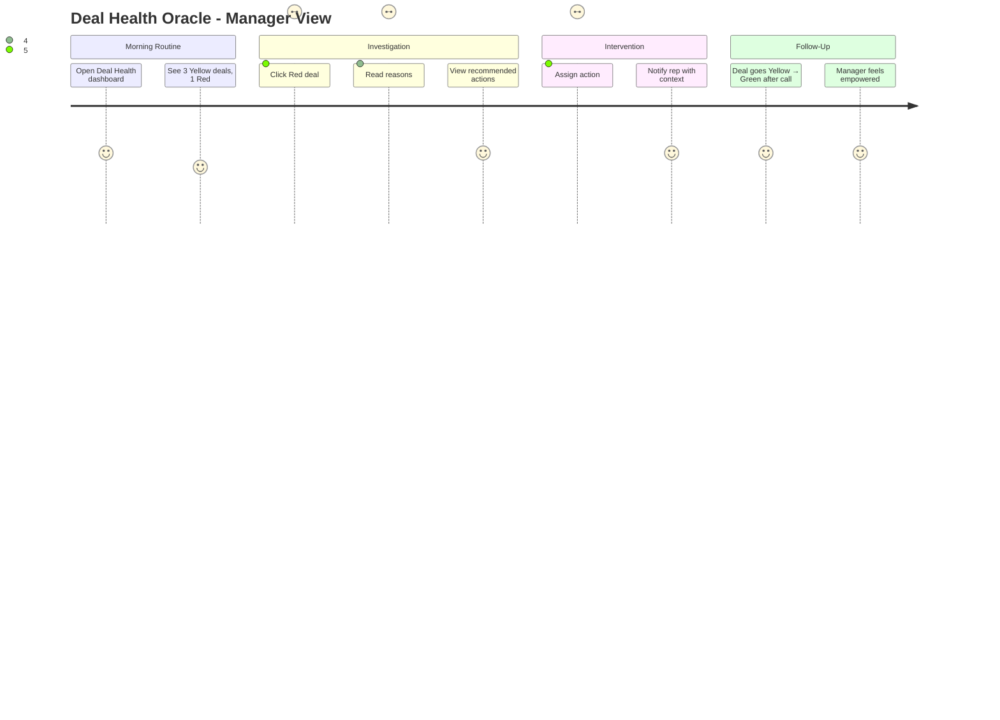
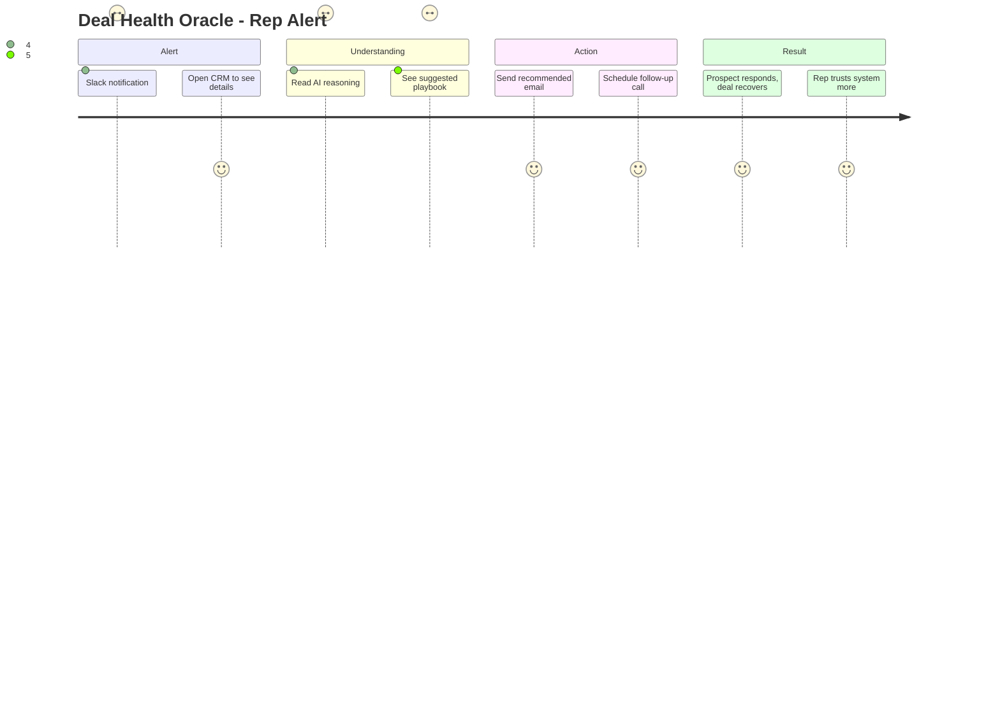

# Feature: Deal Health Oracle v1

## Feature Overview

**Feature Name:** Deal Health Oracle v1  
**Priority:** P0 (Build Now)  
**Status:** 🔴 Planned  
**Owner:** AI + Product Team  
**Estimated Effort:** 3 weeks  
**Revenue Impact:** $2.4M ARR saved (prevents 20 deal losses/quarter)

---

## User Story

**As a** sales manager monitoring 50+ active deals  
**I want** AI to predict which deals are at risk before they stall  
**I so that** can intervene early and prevent revenue leakage

---

## Problem Statement

### Current Pain Points
1. **Reactive Management**: Deals die silently, managers find out too late
2. **No Early Warning System**: By the time rep says "deal is stuck," it's often over
3. **Gut Feel Forecasting**: Managers rely on rep's optimism (often wrong)
4. **Manual Pipeline Reviews**: 4+ hours/week reviewing every deal individually
5. **Inconsistent Risk Detection**: Some reps are self-aware, others aren't

### Data Supporting Problem
- Industry stat: 70% of stalled deals show warning signs 14+ days before going cold
- Average loss per stalled deal: $120k (wasted effort + lost revenue)
- Manager time spent on pipeline hygiene: 20% of their week

---

## Success Criteria

### Quantitative
- ✅ **85%+ prediction accuracy** (correctly flags at-risk deals)
- ✅ **False positive rate <15%** (don't cry wolf too often)
- ✅ **Lead time: 7+ days** (flag risk a week before deal stalls)
- ✅ **Recovery rate: 40%+** (of flagged deals, 40% get back on track after intervention)
- ✅ **Manager time saved: 6 hours/week** (vs. manual pipeline review)

### Qualitative
- Reps trust the system (don't ignore alerts)
- Alerts are actionable (not just "deal is risky"—tell me WHY and WHAT TO DO)
- System feels like having an analyst, not a nagging bot

---

## User Journey

### Manager Journey (Primary User)


### Rep Journey (Secondary User)


---

## Feature Specifications

### Screen A: Deal Health Dashboard

**Route:** `/crm/insights/deal-health`

**Layout (Desktop):**

**Header Section:**
- Title: "Deal Health Oracle"
- Subtitle: "Predicted risk for all active deals • Updated every hour"
- Refresh timestamp: "Last updated: 12 minutes ago"

**Summary Tiles (Horizontal Row):**
```
┌─────────────┐  ┌─────────────┐  ┌─────────────┐  ┌─────────────┐
│ 🟢 Healthy  │  │ 🟡 At Risk  │  │ 🔴 Critical │  │ Total Value │
│     23      │  │      8      │  │      3      │  │   $4.2M     │
└─────────────┘  └─────────────┘  └─────────────┘  └─────────────┘
```

**Filters Section:**
- Dropdown: "All Reps" | "My Team" | Individual rep names
- Dropdown: "All Stages" | "Discovery" | "Proposal" | "Negotiation"
- Toggle: "Show only at-risk" (Yellow + Red only)

**Deals List (Table View):**

| Deal | Value | Owner | Stage | Health | Risk Factors | Last Activity | Actions |
|------|-------|-------|-------|--------|--------------|---------------|---------|
| FintechCo | $75k | Sarah | Proposal | 🔴 32% | No response (6d), Competitor mentioned | 6 days ago | [Intervene] |
| HealthTech | $120k | Michael | Negotiation | 🟡 58% | Engagement dropping, Budget unclear | 2 days ago | [Review] |
| RetailCo | $45k | Jane | Discovery | 🟢 87% | Active, Timeline set | 3 hours ago | [Continue] |

**Mobile Layout:**
- Summary tiles: Horizontal scroll
- Deals: Card view instead of table
- Each card shows: Deal name, health score (circular progress), top 2 risk factors

---

### Screen B: Deal Detail Drill-Down (Modal/Drawer)

**Triggered by:** Clicking a deal row in the table

**Layout:**

**Header:**
- Deal name: "FintechCo - CRM Implementation"
- Health score: Large circular progress (32% in red)
- Last updated: "15 minutes ago"

**Section 1: Risk Breakdown**
```
Why is this deal at risk?

🔴 High Impact Risks:
  • No response to 3 emails in past 6 days
  • Competitor "HubSpot" mentioned in last call (Dec 12)

🟡 Medium Impact Risks:
  • Budget still unconfirmed (marked "TBD" in CRM)
  • Champion (Jane) job change detected on LinkedIn (Dec 10)

✅ Positive Signals:
  • Strong initial demo feedback (NPS 9)
  • Contract sent, not yet reviewed
```

**Section 2: Activity Timeline (Mini Version)**
- Last 7 days of activity (emails, calls, notes)
- Visual: Simple timeline with dots (green = positive, red = negative)

**Section 3: Recommended Actions (AI-Generated)**
```
What to do next:

Priority 1: Re-engage Champion
  → Send personalized email referencing demo feedback
  → Suggested template: [View Draft]

Priority 2: Address Competitor
  → Send HubSpot battle card
  → Offer comparison call with solution engineer

Priority 3: Clarify Budget
  → Schedule 15-min budget alignment call
  → Use ROI calculator to justify price
```

**Action Buttons:**
- Primary: "Assign Intervention Plan" (creates tasks for rep)
- Secondary: "Mark as Reviewing" (snooze alerts for 48h)
- Tertiary: "False Alarm" (feedback to improve model)

---

## AI Implementation Details

### Model Selection
**Model:** Gemini 2.0 Flash Thinking  
**Why:** Complex multi-signal reasoning, explains its logic, cost-effective for batch processing

### Prediction Methodology

**Inputs (40+ Signals):**

**Engagement Signals (30 points max):**
- Days since last email reply: -5 points per day (max -15)
- Email open rate trend: +10 if increasing, -10 if decreasing
- Call attendance: +15 if prospect initiated call, -10 if no-show
- CRM logins (if buyer portal): +5 if active, -5 if none in 7 days

**Deal Hygiene Signals (20 points max):**
- Budget confirmed: +10 if yes, -5 if "TBD"
- Timeline set: +10 if specific date, -5 if vague
- Multi-threading: +5 per additional contact engaged (max +15)
- Next step scheduled: +10 if yes, -10 if no

**External Signals (20 points max):**
- Competitor mentions: -15 per competitor in calls/emails
- Champion job change: -20 if left company, -10 if new role
- Company news (layoffs, funding): -10 if negative, +10 if positive
- Website traffic (if trackable): +5 if they visited pricing page recently

**Historical Patterns (30 points max):**
- Similar deals outcome: Learn from past wins/losses
- Rep's win rate: Adjust based on rep's track record
- Seasonal trends: Adjust for end-of-quarter urgency

**Scoring Formula:**
```
Base Score = 100 points

Adjusted Score = Base + Engagement + Hygiene + External + Historical

Normalize to 0-100 range

Health Category:
  - 80-100: 🟢 Healthy (Green)
  - 50-79: 🟡 At Risk (Yellow)
  - 0-49: 🔴 Critical (Red)
```

---

### Reasoning Explainability

**Prompt Structure:**
```
You are a sales deal analyst. Analyze this deal and predict 
health score + explain reasoning.

Deal Context:
- Name: FintechCo CRM Implementation
- Value: $75k
- Stage: Proposal Sent
- Owner: Sarah Chen
- Days in stage: 18 days

Recent Activity:
- Dec 12: Demo call (45 min, prospect rating: 9/10)
- Dec 13: Proposal sent via email
- Dec 13-18: 3 follow-up emails sent, 0 replies
- Dec 15: Competitor "HubSpot" mentioned in call transcript

Signals:
- No email response: 6 days
- Competitor mentioned: Yes (HubSpot)
- Budget confirmed: No (marked TBD)
- Champion engagement: Declined (was daily, now none)
- Multi-threading: Single contact only

Similar Deals (historical):
- 12 deals in "Proposal" stage with no response for 6+ days
  → 9 went "Lost" (75%), 3 recovered after intervention (25%)

Task:
1. Calculate health score (0-100)
2. List top 3 risk factors (ranked by impact)
3. Suggest 3 specific actions to recover deal
4. Predict: Will this deal close? (Yes/No + confidence %)

Output as JSON:
{
  "score": 32,
  "health": "critical",
  "reasoning": "No engagement for 6 days post-proposal + 
                competitor mention = 75% historical loss rate",
  "risk_factors": [
    { "factor": "No response to 3 emails", "impact": "high" },
    { "factor": "Competitor HubSpot mentioned", "impact": "high" },
    { "factor": "Budget unconfirmed", "impact": "medium" }
  ],
  "recommended_actions": [
    { "priority": 1, "action": "Re-engage champion with 
      personalized email", "template_id": "re_engage_001" },
    { "priority": 2, "action": "Send HubSpot battle card", 
      "resource_url": "/battle-cards/hubspot" },
    { "priority": 3, "action": "Schedule budget clarity call", 
      "playbook_id": "budget_alignment" }
  ],
  "prediction": {
    "will_close": false,
    "confidence": 0.68,
    "rationale": "Historical pattern shows 75% loss rate 
                  without immediate intervention"
  }
}
```

---

### Continuous Learning (Feedback Loop)

**Training Data Collection:**
```
Table: `deal_health_feedback`
Fields:
  - prediction_id (link to ai_agent_runs)
  - actual_outcome ("won", "lost", "still_active")
  - user_feedback ("accurate", "false_alarm", "missed_risk")
  - manual_notes (what really happened)

Weekly Job: `retrain-deal-health-model`
  1. Fetch last 90 days of predictions + outcomes
  2. Calculate accuracy per signal
  3. Adjust signal weights:
     - If "no email response" over-predicted risk → lower weight
     - If "budget unconfirmed" under-predicted risk → raise weight
  4. Store updated weights in `model_configs` table
  5. Deploy new version (A/B test first)
```

---

## Database Schema

### Table: `deal_health_scores`
```sql
CREATE TABLE deal_health_scores (
  id UUID PRIMARY KEY DEFAULT uuid_generate_v4(),
  org_id UUID REFERENCES organizations(id),
  lead_id UUID REFERENCES leads(id),
  
  -- Score data
  score INT CHECK (score >= 0 AND score <= 100),
  health_category TEXT, -- 'healthy', 'at_risk', 'critical'
  previous_score INT, -- Track changes
  score_trend TEXT, -- 'improving', 'declining', 'stable'
  
  -- Risk factors
  risk_factors JSONB, -- Array of {factor, impact, weight}
  positive_signals JSONB, -- Array of good signals
  
  -- Recommendations
  recommended_actions JSONB, -- Array of {priority, action, resource}
  intervention_assigned BOOLEAN DEFAULT FALSE,
  intervention_completed_at TIMESTAMPTZ,
  
  -- Prediction
  predicted_outcome TEXT, -- 'will_close', 'will_lose', 'uncertain'
  confidence DECIMAL(3,2), -- 0.00 to 1.00
  
  -- Metadata
  calculated_at TIMESTAMPTZ DEFAULT NOW(),
  expires_at TIMESTAMPTZ DEFAULT NOW() + INTERVAL '1 hour',
  
  -- Feedback
  actual_outcome TEXT, -- Filled when deal closes/loses
  feedback_accuracy TEXT -- 'accurate', 'false_alarm', 'missed_risk'
);

CREATE INDEX idx_deal_health_org_health ON deal_health_scores(org_id, health_category, calculated_at DESC);
CREATE INDEX idx_deal_health_lead ON deal_health_scores(lead_id, calculated_at DESC);
```

### Table: `deal_health_alerts`
```sql
CREATE TABLE deal_health_alerts (
  id UUID PRIMARY KEY,
  org_id UUID REFERENCES organizations(id),
  lead_id UUID REFERENCES leads(id),
  deal_health_id UUID REFERENCES deal_health_scores(id),
  
  -- Alert details
  alert_type TEXT, -- 'went_critical', 'went_yellow', 'recovered'
  message TEXT,
  severity TEXT, -- 'high', 'medium', 'low'
  
  -- Actions
  notified_users UUID[], -- Array of user IDs
  notification_sent_at TIMESTAMPTZ,
  viewed_at TIMESTAMPTZ,
  dismissed_at TIMESTAMPTZ,
  action_taken TEXT -- 'intervened', 'snoozed', 'ignored'
);
```

---

## Edge Function Specifications

### Function: `calculate-deal-health` (Scheduled - Hourly)

**Trigger:** pg_cron job every hour OR manual trigger from UI

**Logic Flow:**
```
1. Fetch all active deals (status != 'won' AND status != 'lost')
2. For each deal:
   a. Gather signals:
      - Query email tracking data (opens, replies)
      - Query call logs (sentiment, attendance)
      - Query CRM fields (budget, timeline, stage)
      - Query external APIs (LinkedIn for job changes)
      - Query historical data (similar deals outcomes)
   
   b. Call Gemini 2.0 Flash Thinking:
      - Input: Deal context + signals + historical patterns
      - Output: Structured JSON (score, risk_factors, actions)
   
   c. Calculate score trend:
      - Compare to previous score
      - Trend = 'improving' | 'declining' | 'stable'
   
   d. Upsert into `deal_health_scores` table
   
   e. Check for alert conditions:
      - IF score dropped >20 points → Create alert
      - IF went from Green to Yellow/Red → Create alert
      - IF went from Red to Yellow/Green → Create "recovered" alert
   
   f. Send notifications:
      - Slack to manager if deal goes Red
      - Email summary to rep if deal goes Yellow
      - Dashboard realtime update (via broadcast)

3. Log execution to `ai_agent_runs` table
4. Return summary: "Scored 34 deals, 3 new alerts"
```

**Error Handling:**
- External API timeout (LinkedIn): Skip that signal, note in logs
- Gemini API failure: Retry 3 times, then use fallback scoring (simple rule-based)
- Database deadlock: Retry with exponential backoff

**Performance Optimization:**
- Process deals in batches of 10 (parallel Gemini calls)
- Cache frequently accessed data (rep win rates, historical patterns)
- Skip deals with no activity in last 30 days (mark as "stale")

---

### Function: `create-intervention-plan`

**Trigger:** HTTP POST when manager clicks "Assign Intervention Plan"

**Input:**
```json
{
  "deal_health_id": "uuid",
  "lead_id": "uuid",
  "selected_actions": [1, 2] // Priority 1 and 2 actions
}
```

**Logic Flow:**
```
1. Fetch deal health record + recommended actions
2. For each selected action:
   a. Create task in CRM:
      - Title: Action description
      - Owner: Deal owner (rep)
      - Due date: Based on urgency (Critical deals = today, Yellow = 2 days)
      - Context: Link to deal health report
   
   b. If action has template (e.g., "re-engage email"):
      - Generate personalized draft using Gemini Flash
      - Pre-fill email composer in CRM
   
   c. If action has resource (e.g., battle card):
      - Attach resource to task
      - Notify rep: "Here's the battle card for HubSpot"

3. Mark intervention_assigned = TRUE in deal_health_scores
4. Create activity log: "Manager assigned intervention plan"
5. Send Slack notification to rep:
   "Your manager assigned an intervention plan for FintechCo. 
    Check your tasks."

6. Return success + task IDs
```

---

## Integration Points

### Email Tracking (Gmail/Outlook)
- **Purpose:** Detect open rates, reply rates, engagement trends
- **Data:** Email sent timestamp, opened timestamp, replied timestamp
- **Frequency:** Real-time webhook OR poll every 15 minutes

### Call Recording Platforms (Gong/Chorus)
- **Purpose:** Extract sentiment, competitor mentions, objections
- **Data:** Call transcript, sentiment score, keywords
- **Frequency:** Webhook when call ends + transcription complete

### LinkedIn Sales Navigator
- **Purpose:** Detect job changes, company news, buyer engagement
- **Data:** Profile updates, job changes, company posts
- **Frequency:** Daily sync (rate limits apply)

### Calendar (Google Calendar)
- **Purpose:** Detect no-shows, rescheduling patterns, meeting frequency
- **Data:** Meeting attendance, RSVPs, cancellations
- **Frequency:** Real-time webhook OR hourly sync

---

## UI/UX Specifications

### Visual Design (Calm Luxury)

**Color System (Traffic Lights):**
- 🟢 **Healthy (80-100):** Deep forest green `#2D5F3F`
- 🟡 **At Risk (50-79):** Warm amber `#D97D28`
- 🔴 **Critical (0-49):** Muted red `#C44E4E`

**Typography:**
- Dashboard title: Large, calm serif (48px)
- Deal names: Sans-serif medium (18px)
- Risk factors: Sans-serif regular (14px), with icons

**Health Score Visualization:**
- Circular progress ring (inspired by Apple Watch activity rings)
- Smooth animation when score changes (1 second ease-out)
- Hover shows: "Changed from 65 to 32 in last 24 hours"

**Risk Factor Icons:**
- No response: 📭 (inbox icon)
- Competitor mentioned: ⚔️ (crossed swords)
- Budget unclear: 💰 (dollar with question mark)
- Job change: 🔄 (circular arrows)

---

### Micro-Interactions

**Score Update Animation:**
- When score changes, circular ring animates from old to new value
- If declining: Brief red pulse to draw attention
- If improving: Green sparkle effect (subtle)

**Alert Notification:**
- Banner appears at top of dashboard: "3 deals need attention"
- Animate slide-down (300ms)
- Auto-dismiss after 10 seconds (unless hovered)

**Drill-Down Modal:**
- Opens with fade-in + scale-up (200ms)
- Risk factors reveal sequentially (stagger 100ms each)
- Recommended actions appear with soft bounce

---

### Responsive Design

**Desktop (>1024px):**
- Summary tiles: 4-column grid
- Deals table: Full table with all columns
- Drill-down: Right-side modal (60% width)

**Tablet (768px - 1024px):**
- Summary tiles: 2x2 grid
- Deals table: Hide "Last Activity" column
- Drill-down: Full-screen modal

**Mobile (<768px):**
- Summary tiles: Horizontal scroll (snap to each tile)
- Deals: Card view (stacked vertically)
- Drill-down: Bottom sheet (swipe up to full-screen)

---

## Testing Plan

### Unit Tests
- [ ] Scoring logic: Given signals, calculate correct score
- [ ] Risk factor ranking: High-impact risks appear first
- [ ] Trend detection: Score 80→60 = "declining"

### Integration Tests
- [ ] Gemini API: Send deal context, receive structured score
- [ ] Database: Upsert score, create alert, fetch for dashboard
- [ ] Notifications: Slack webhook triggered for Red deals

### End-to-End Tests
- [ ] **Scenario 1:** Deal goes Red → Alert created → Manager notified → Intervention assigned → Tasks created
- [ ] **Scenario 2:** Deal recovers (Red → Green) → "Good news" notification sent
- [ ] **Scenario 3:** False alarm → Manager marks as "inaccurate" → Model learns

### AI Accuracy Testing
- [ ] Backtest on historical deals (last 6 months)
- [ ] Compare predictions to actual outcomes
- [ ] Target: 85%+ accuracy, <15% false positives

---

## Success Metrics (Post-Launch)

### Track Weekly

| Metric | Target | Current | Trend |
|--------|--------|---------|-------|
| Total deals scored | 100%/week | - | - |
| Prediction accuracy | 85%+ | - | - |
| False positive rate | <15% | - | - |
| Alert response time | <24h | - | - |
| Recovery rate (flagged deals) | 40%+ | - | - |
| Manager time saved | 6h/week | - | - |
| Revenue saved (prevented losses) | $120k/month | - | - |

---

## Rollout Plan

### Week 1: Shadow Mode
- Deploy function, calculate scores silently
- Store in database, don't show to users yet
- Validate accuracy against historical data

### Week 2: Internal Alpha
- Show dashboard to sales leadership only
- Collect feedback on accuracy + usefulness
- Adjust signal weights based on feedback

### Week 3: Team Beta
- Show to all sales managers (10 users)
- Enable alerts (but mark as "Beta")
- Monitor for false positives, iterate

### Week 4: Full Launch
- Show to all users (reps + managers)
- Announce via all-hands: "New Deal Health Oracle live"
- Publish blog post: "How AI predicts deal risk"

---

## Future Enhancements (v2)

### Advanced Features
- **Predictive Close Date:** "This deal will close in 18 days (±5 days)"
- **Win Probability:** "65% chance of closing" (vs. binary healthy/at-risk)
- **Prescriptive Actions:** Auto-execute (send email, schedule call) with approval
- **Competitive Intelligence:** "Competitor X wins 70% against us in this segment—here's how to counter"

### Integrations
- **Salesforce:** Bi-directional sync (pull signals, push scores)
- **Outreach/SalesLoft:** Trigger sequences based on health score
- **Slack Bot:** "Ask Deal Oracle: Why is FintechCo at risk?"

---

## Figma Design Prompts

### Prompt 1: Create Dashboard
```
Design a "Deal Health Oracle" dashboard for sales managers.

Layout:
- Header: Title + subtitle + last updated timestamp
- Summary tiles: 4 horizontal cards (Green, Yellow, Red deals + Total Value)
- Filters: Dropdown menus (All Reps, All Stages) + Toggle (Show only at-risk)
- Deals table: Sortable columns (Deal, Value, Owner, Stage, Health, Risk Factors, Actions)

Health Score Display:
- Circular progress ring (like Apple Watch)
- Green (80-100), Yellow (50-79), Red (0-49)
- Percentage inside circle

Style:
- Calm luxury aesthetic (warm off-white background)
- Glassmorphic cards with soft shadows
- Traffic light colors for health categories
- Icons for risk factors (inbox, crossed swords, dollar)

Responsive:
- Desktop: Full table view
- Mobile: Card view instead of table

Interactions:
- Click deal row → Opens drill-down modal
- Hover on health score → Shows score trend ("Changed from 65 to 32")
```

### Prompt 2: Create Drill-Down Modal
```
Design a deal detail drill-down modal/drawer.

Layout:
- Header: Deal name + large health score (circular progress)
- Section 1: Risk Breakdown
  - List of high/medium/low impact risks
  - Use color-coded pills (Red, Yellow, Green)
  - Icons for each risk type
- Section 2: Activity Timeline (mini version)
  - Last 7 days of activity
  - Visual: Horizontal timeline with dots (green = positive, red = negative)
- Section 3: Recommended Actions
  - Priority-ordered list (1, 2, 3)
  - Each action has description + CTA button
  - Example: "Send re-engagement email [View Draft]"

Action Buttons (Bottom):
- Primary: "Assign Intervention Plan"
- Secondary: "Snooze Alerts (48h)"
- Tertiary: "Mark as False Alarm"

Style:
- Consistent with dashboard (calm luxury)
- Animate risk factors sequentially (stagger 100ms)
- Actions appear with soft bounce

Responsive:
- Desktop: Right-side modal (60% width)
- Mobile: Bottom sheet (swipe to full-screen)
```

---

## Systematic Implementation Prompts

### Step 1: Database Setup
```
Create Supabase tables for Deal Health Oracle.

1. Create `deal_health_scores` table:
   - id, org_id, lead_id, score, health_category, previous_score, score_trend
   - risk_factors (JSONB), positive_signals (JSONB)
   - recommended_actions (JSONB), intervention_assigned
   - predicted_outcome, confidence, calculated_at, expires_at
   - actual_outcome, feedback_accuracy

2. Create `deal_health_alerts` table:
   - id, org_id, lead_id, deal_health_id
   - alert_type, message, severity
   - notified_users (UUID[]), notification_sent_at, viewed_at

3. Add RLS policies:
   - Managers can view their team's deal health scores
   - Reps can view only their own deals

4. Create indexes:
   - idx_deal_health_org_health (org_id, health_category, calculated_at DESC)
   - idx_deal_health_lead (lead_id, calculated_at DESC)
```

### Step 2: Edge Function - Calculate Deal Health
```
Create Supabase Edge Function: `calculate-deal-health`

Trigger: Scheduled (hourly via pg_cron) OR manual HTTP POST

Logic:
1. Fetch all active deals (status != 'won'/'lost')
2. For each deal, gather signals:
   - Email engagement (from email_tracking table)
   - Call data (from calls table)
   - CRM fields (budget, timeline, stage, days_in_stage)
   - External data (LinkedIn job changes, if available)
3. Call Gemini 2.0 Flash Thinking:
   - Prompt: "Analyze this deal, predict health score + risks + actions"
   - Input: Deal context + signals + historical patterns
   - Output: Structured JSON (score, risk_factors, recommended_actions)
4. Calculate score trend (compare to previous score)
5. Upsert into `deal_health_scores`
6. Check alert conditions:
   - IF score dropped >20 points OR went Red → Create alert
7. Send notifications (Slack/email)
8. Log to `ai_agent_runs` for audit

Error handling:
- External API failures: Skip that signal, log warning
- Gemini timeout: Use fallback rule-based scoring
- Batch processing: 10 deals at a time (parallel)
```

### Step 3: Frontend - Dashboard Component
```
Create React component: `DealHealthDashboard`

Location: `/components/crm/intelligence/DealHealthDashboard.tsx`

Features:
1. Summary tiles (Green, Yellow, Red counts + Total Value)
2. Filters (rep selector, stage selector, toggle "at-risk only")
3. Deals table with sortable columns
4. Health score displayed as circular progress ring
5. Click row → Opens drill-down modal

State management:
- Fetch deal health scores from Supabase on mount
- Use Realtime subscription to listen for score updates
- Filter/sort deals based on user selections

Responsive:
- Desktop: Full table
- Tablet: Hide some columns
- Mobile: Card view

Animations:
- Use motion/react for score updates
- Stagger risk factors reveal in modal
```

### Step 4: Intervention System
```
Create intervention assignment system.

Edge Function: `create-intervention-plan`
Input: { deal_health_id, lead_id, selected_actions }

Logic:
1. Fetch recommended actions from deal health record
2. For each selected action:
   - Create task in CRM (assigned to deal owner)
   - Generate email draft if action requires it (using Gemini Flash)
   - Attach resources (battle cards, playbooks)
3. Mark intervention_assigned = TRUE
4. Send Slack notification to rep
5. Create activity log entry

Frontend Component: Intervention assignment form in drill-down modal
- Checkboxes for each recommended action
- Preview of what will be created (tasks, emails)
- Confirm button
```

### Step 5: Monitoring & Feedback Loop
```
Set up monitoring + feedback collection.

1. Dashboard analytics:
   - Track: Alert views, intervention assignments, false alarms
   - Store in `deal_health_analytics` table

2. Feedback mechanism:
   - When deal closes/loses, prompt manager:
     "Was the health score accurate?"
     Options: "Yes", "No (False alarm)", "No (Missed risk)"
   - Store in `deal_health_feedback` table

3. Weekly retraining job:
   - Analyze last 90 days of predictions vs. outcomes
   - Adjust signal weights
   - Deploy new model version (A/B test first)

4. Alerting:
   - If accuracy drops below 80% → Slack alert to AI team
   - If false positive rate >20% → Review signal weights
```

---

## Next Steps

1. **This Week:**
   - [ ] Design Figma mockups for dashboard + drill-down modal
   - [ ] Write Supabase schema migration
   - [ ] Draft Gemini prompt for deal analysis

2. **Next Week:**
   - [ ] Implement dashboard UI (React component)
   - [ ] Deploy `calculate-deal-health` edge function
   - [ ] Test with mock data (no real AI yet)

3. **Week 3:**
   - [ ] Integrate Gemini API (real scoring)
   - [ ] Add alert system (Slack notifications)
   - [ ] Internal testing (shadow mode)

4. **Week 4:**
   - [ ] Full launch to sales team
   - [ ] Monitor accuracy + collect feedback
   - [ ] Iterate on signal weights

---

**Status:** Ready for design + development kickoff  
**Next Document:** [09 - Natural Language Search](./09-nl-search.md)
