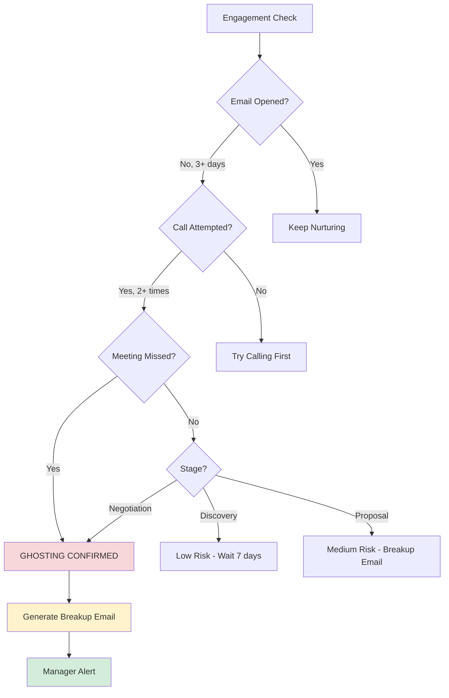

# Workflow: Ghost Detection & Intervention

**Status:** 🔴 Planned (January 2026)  
**Impact:** Save $1.2M/year in abandoned deals  
**Connects:** Email tracking, Call tracking, Deal Health Oracle

---

## Problem Statement

30% of sales conversations go silent without explanation. Reps don't know when to give up vs. when to re-engage, resulting in wasted time and lost opportunities.

---

## Workflow Logic

### Trigger: Engagement Monitoring

**Check every 24 hours:**
```
SELECT leads.* 
FROM leads
WHERE 
  stage IN ('Discovery', 'Proposal', 'Negotiation')
  AND (
    -- Email ghosting
    (last_email_sent_date < NOW() - INTERVAL '3 days' 
     AND email_open_count = 0)
    OR
    -- Call ghosting  
    (last_call_date < NOW() - INTERVAL '7 days'
     AND call_attempts >= 2
     AND no_answer_count >= 2)
    OR
    -- Meeting ghosting
    (calendar_invite_sent = true
     AND invite_status = 'no_response'
     AND sent_date < NOW() - INTERVAL '2 days')
  )
```

### Decision Tree



### Action: Breakup Email Generation

**AI Prompt:**
```
Generate a professional "breakup email" for this ghosting lead.

LEAD CONTEXT:
- Name: {leadName}
- Company: {company}
- Last interaction: {lastInteractionDate} ({daysAgo} days ago)
- Stage: {stage}
- Previous conversations: {conversationSummary}

GHOSTING SIGNALS:
- 3 emails sent, 0 opened
- 2 calls attempted, both no answer
- Meeting invite sent, no response

TONE: Professional, respectful, permission-to-close
GOAL: Get a response OR close the loop

TEMPLATE STRUCTURE:
1. Reference last conversation
2. Acknowledge radio silence
3. Assume timing isn't right
4. Offer to check back later OR close file
5. Make it easy to respond (yes/no question)

EXAMPLE OUTPUT:
Subject: Should I close your file?

Hi {firstName},

I've reached out a few times since our conversation on {lastCallDate} 
about {topicDiscussed}, but haven't heard back.

I'm guessing the timing isn't right, or priorities have shifted—
totally understand.

Rather than keep bothering you, should I:
A) Close your file for now, or
B) Check back in {suggestedTimeframe}?

Just reply A or B (or feel free to call if you'd like to discuss).

Best,
{repName}

P.S. If I don't hear back, I'll assume A and stop reaching out.
```

### Notification Flow

**To Rep:**
```
🔔 Ghost Alert: FintechFlow (Sarah Chen)

3 emails sent, 0 opened in 10 days
2 calls attempted, both no answer

📧 Breakup Email Ready
[Review & Send] [Edit] [Dismiss]

Suggested Action:
Send breakup email, then remove from active pipeline 
if no response in 7 days.
```

**To Manager:**
```
📊 Weekly Ghost Report

10 deals went silent this week:
• 4 sent breakup emails (2 responded ✅)
• 3 closed as "timing not right"
• 3 still in queue (rep reviewing)

Pipeline Cleaned: $450k removed (unrealistic)
Pipeline Revived: $180k (2 deals re-engaged)
```

---

## Database Schema

### Table: `engagement_tracking`

```sql
CREATE TABLE engagement_tracking (
  id UUID PRIMARY KEY,
  lead_id UUID REFERENCES leads(id),
  
  -- Email engagement
  last_email_sent_date TIMESTAMP,
  email_open_count INTEGER DEFAULT 0,
  email_reply_count INTEGER DEFAULT 0,
  
  -- Call engagement
  last_call_date TIMESTAMP,
  call_attempts INTEGER DEFAULT 0,
  calls_answered INTEGER DEFAULT 0,
  
  -- Meeting engagement
  last_meeting_date TIMESTAMP,
  meetings_scheduled INTEGER DEFAULT 0,
  meetings_attended INTEGER DEFAULT 0,
  
  -- Ghosting detection
  ghosting_score INTEGER DEFAULT 0, -- 0-100
  ghosting_status TEXT CHECK (ghosting_status IN ('active', 'at_risk', 'ghosting')),
  ghosting_detected_at TIMESTAMP,
  
  updated_at TIMESTAMP DEFAULT NOW()
);

CREATE INDEX idx_engagement_ghosting 
ON engagement_tracking(ghosting_status, ghosting_detected_at DESC)
WHERE ghosting_status IN ('at_risk', 'ghosting');
```

### Table: `breakup_emails`

```sql
CREATE TABLE breakup_emails (
  id UUID PRIMARY KEY,
  lead_id UUID REFERENCES leads(id),
  org_id UUID REFERENCES organizations(id),
  
  -- Email content
  subject TEXT NOT NULL,
  body TEXT NOT NULL,
  suggested_timeframe TEXT, -- "Q2 2026", "6 months"
  
  -- Status
  status TEXT DEFAULT 'draft' CHECK (status IN ('draft', 'sent', 'responded', 'ignored')),
  sent_at TIMESTAMP,
  response_received_at TIMESTAMP,
  response_type TEXT, -- "revived", "closed", "timing"
  
  created_at TIMESTAMP DEFAULT NOW()
);
```

---

## Edge Function: `detect-ghosts`

**Runs:** Daily at 8 AM

**Logic:**
1. Query all active leads (Discovery, Proposal, Negotiation stages)
2. Check engagement signals (emails, calls, meetings)
3. Calculate ghosting score (0-100)
4. Flag leads with score > 70 as "ghosting"
5. Generate breakup emails for flagged leads
6. Notify reps via Slack + email

**Output:**
```json
{
  "ghostingLeads": [
    {
      "leadId": "lead_123",
      "leadName": "Sarah Chen",
      "company": "FintechFlow",
      "stage": "Proposal",
      "ghostingScore": 85,
      "reasons": [
        "3 emails sent, 0 opened (10 days)",
        "2 calls attempted, both no answer",
        "Meeting invite sent, no response"
      ],
      "breakupEmail": {
        "subject": "Should I close your file?",
        "body": "Hi Sarah, I've reached out...",
        "suggestedTimeframe": "Q2 2026"
      },
      "recommendedAction": "send_breakup_email"
    }
  ],
  "summary": {
    "totalGhosting": 10,
    "newThisWeek": 4,
    "emailsGenerated": 10,
    "pipelineValue": "$450k"
  }
}
```

---

## Success Metrics

| Metric | Target | Tracking |
|--------|--------|----------|
| Ghosting detection rate | 90%+ | Compare to manual rep tracking |
| Breakup email response rate | 20%+ | Emails sent vs. responses |
| Pipeline cleanup | $1M+/year | Value removed from stale deals |
| Revived deals | 15% | Ghosted → re-engaged via email |

---

## Real-World Example

```
SCENARIO: Sarah Chen (FintechFlow) goes silent

Day 1: Rep Michael sends follow-up email
Day 3: No open detected, score: 30 (low risk)
Day 5: Second email sent
Day 7: Still no opens, score: 50 (at risk)
Day 8: Michael calls, no answer
Day 9: Second call, no answer
Day 10: Ghosting score hits 85 (confirmed ghosting)

AI GENERATES BREAKUP EMAIL:
Subject: Should I close your file?
Body: "Hi Sarah, I've reached out a few times since our 
       December 10 call about your Q3 CRM needs..."

Day 10: Rep reviews, clicks "Send"
Day 11: Sarah replies: "Sorry, buried in quarter-end. 
        Let's reconnect in January."

OUTCOME: Deal revived, moved to nurture campaign
```

---

## Implementation Plan

**Week 1:** Build engagement tracking table + queries  
**Week 2:** Develop ghosting score algorithm  
**Week 3:** Create breakup email generator (AI prompt)  
**Week 4:** Test with 50 stale leads, measure response rate  

**Launch:** January 2026

---

*Last Updated: December 18, 2025*
