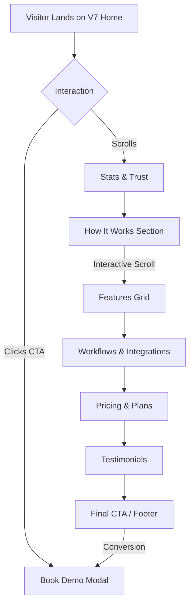

# Home Page Version 7 Implementation Plan

## 📊 Progress Tracker

- [x] **Project Setup & Architecture**
- [x] **Style Guide Definition (V7 Theme)**
- [x] **NavbarV7**: Sticky, backdrop blur, responsive menu.
- [x] **HeroV7**: Split layout, Orange/Slate palette, 3D Globe Animation.
- [x] **StatsV7**: Trust indicators, clean typography.
- [x] **HowItWorksV7**: Scroll-driven storytelling, interactive screens.
- [ ] **FeaturesV7**: Bento grid or alternate clean layout (Review needed).
- [ ] **WorkflowsV7**: Automation visualization (Review needed).
- [ ] **PricingV7**: Clear tiers, "Stripe-like" tables.
- [ ] **TestimonialsV7**: Social proof, carousel or grid.
- [ ] **FAQV7**: Accordion style.
- [ ] **FinalCTAV7**: High conversion footer.
- [ ] **FooterV7**: Links, copyright, social.
- [ ] **Mobile Optimization**: QA on < 375px devices.
- [ ] **Performance Audit**: Lighthouse score > 90.

---

## 🎨 V7 Style Guide

### Color Palette
| Color | Hex | Tailwind Class | Usage |
|-------|-----|----------------|-------|
| **Deep Charcoal** | `#0f172a` | `bg-slate-900` / `text-slate-900` | Primary Text, Backgrounds (Dark Mode), Heavy Actions |
| **Soft Slate** | `#64748b` | `text-slate-500` | Secondary Text, Body Copy, Icons |
| **Neon Green** | `#22C55E` | `text-green-500` | Success states, Positive Metrics (Legacy Accent) |
| **Brand Orange** | `#FF6A3D` | `text-[#FF6A3D]` / `bg-[#FF6A3D]` | Primary CTA, Active States, Highlights (V7 Signature) |
| **Off White** | `#F8FAFC` | `bg-slate-50` | Section Backgrounds (Alternating) |
| **Pure White** | `#FFFFFF` | `bg-white` | Cards, Navbar, Modals |

### Typography
- **Font Family**: `Inter` (sans-serif) or system default.
- **Headings**: `font-bold`, `tracking-tight`, `leading-[1.1]`.
- **Body**: `font-medium` (for readability on white), `leading-relaxed`.

### Visual Hierarchy
1.  **H1**: Hero Headline (5xl-7xl)
2.  **H2**: Section Headers (4xl-5xl)
3.  **H3**: Card Titles / Sub-points (xl-2xl)
4.  **Label**: Uppercase, tracking-widest, small text (xs-sm) for badges.

---

## 📝 Core Tasks & Implementation Details

### 1. Navigation (`NavbarV7.tsx`)
*   **Design**: Sticky top, glassmorphism (`backdrop-blur-md`).
*   **Actions**: "Book a Demo" (Primary), Navigation Links (Secondary).
*   **Mobile**: Hamburger menu with full-screen overlay.
*   **Best Practice**: Ensure high contrast for accessibility on scroll.

### 2. Hero Section (`HeroV7.tsx` + `HeroGlobeIllustrationV7.tsx`)
*   **Layout**: 50/50 Split (Text Left, Visual Right).
*   **Visual**: Custom 3D/SVG Animation (Globe/Nodes) reacting to mouse or auto-rotating.
*   **Content**: "Build Intelligent AI Products".
*   **CTA**: Dual button layout (Primary Fill vs. Secondary Outline).

### 3. Trust & Stats (`StatsV7.tsx`)
*   **Layout**: Simple row or grid of logos/numbers.
*   **Style**: Monochromatic logos (Slate-400 -> Slate-900 on hover).
*   **Animation**: Counter-up numbers for metrics.

### 4. Interactive How It Works (`HowItWorksV7.tsx`)
*   **UX**: Scroll-jacking or Sticky positioning.
*   **Mechanism**: As user scrolls text on left, right screen updates (Scope -> Budget -> Blueprint -> Dashboard).
*   **Tech**: `framer-motion` `useScroll` hook.

### 5. Features Grid (`FeaturesV7.tsx`)
*   **Layout**: Bento Grid (asymmetrical box layout).
*   **Content**: Highlighting core platform capabilities (Auth, Database, Edge Functions).
*   **Interaction**: Hover effects (glow, scale, or video play).

### 6. Workflow Automation (`WorkflowsV7.tsx`)
*   **Visual**: Node-based graph visualization.
*   **Animation**: "Signal" packets traveling along lines connecting nodes.
*   **Message**: "Connect your entire stack".

### 7. Pricing (`PricingV7.tsx`)
*   **Layout**: 3 Cards (Starter, Pro, Enterprise).
*   **Design**: "Pro" card elevated or highlighted with Brand Orange border.
*   **Toggle**: Monthly/Yearly switch.

### 8. Social Proof (`TestimonialsV7.tsx`)
*   **Layout**: Masonry grid or Infinite Marquee.
*   **Content**: Quotes from "CTOs", "Founders".
*   **Style**: Clean cards, subtle shadow, avatar images.

---

## 🚀 Advanced Implementation & Polishing

### Animation Strategy (Motion/React)
*   **Entrance**: `initial={{ opacity: 0, y: 20 }}` -> `whileInView={{ opacity: 1, y: 0 }}`.
*   **Micro-interactions**: Hover states on buttons, cards, and links.
*   **Performance**: Use `will-change` sparingly. optimize SVG paths.

### Responsive Design Checklist
*   [ ] **Desktop (1280px+)**: Max-width containers centered.
*   [ ] **Laptop (1024px)**: Adjust padding, reduce font sizes slightly.
*   [ ] **Tablet (768px)**: Collapse 2-col layouts to 1-col.
*   [ ] **Mobile (375px)**: Stack everything, ensure touch targets > 44px.

---

## 🧪 Acceptance Tests

### User Journey 1: The Curious Visitor
1.  Land on Hero -> See clear Value Prop.
2.  Scroll to "How It Works" -> Understand the process (no confusion).
3.  See "Trusted By" logos -> Gain confidence.
4.  Click "Book a Demo" -> Open Modal or scroll to form.

### User Journey 2: The Technical Evaluator
1.  Scan "Features" -> Look for "API", "Export code", "Security".
2.  Review "Workflows" -> Understand integration capabilities.
3.  Check "Pricing" -> assess transparency.

---

## 🧜‍♀️ User Flow Diagram

---

## 🛠 Troubleshooting & Common Issues

### Issue: "Sticky Section Jitters"
*   **Cause**: `framer-motion` layout thrashing or incorrect `height` on parent.
*   **Fix**: Ensure parent container has explicitly defined height (e.g., `min-h-[300vh]`) and `sticky` element has `top-0`.

### Issue: "Mobile Menu Z-Index"
*   **Cause**: Navbar `z-index` lower than some hero elements or modals.
*   **Fix**: Set Navbar to `z-50`, Modals to `z-[60]`.

### Issue: "SVG Performance"
*   **Cause**: Too many DOM nodes in complex illustrations (Globe).
*   **Fix**: Use Canvas for extreme detail, or optimize SVG paths. Ensure `HeroGlobeIllustrationV7` uses hardware accelerated transforms.

---

## ✅ Production Ready Checklist

1.  [ ] **Linting**: No console errors or warnings.
2.  [ ] **Images**: All assets use `ImageWithFallback` or optimized `figma:asset` imports.
3.  [ ] **SEO**: Meta tags, semantic HTML (`<main>`, `<section>`, `<h1>`, `<h2>`).
4.  [ ] **Accessibility**: Colors pass WCAG AA contrast. All interactive elements focusable.
5.  [ ] **Clean Code**: No "magic numbers" in CSS (use Tailwind scale). Component props typed interfaces.

---

## 🎨 UI/UX Layout & Component Breakdowns

### Section 1: Hero
**Intent**: Capture attention instantly.
**Layout**: Asymmetrical 50/50.
**Key Element**: The "Globe" or "Abstract Network" suggests global scale and connectivity without being cliché.

### Section 2: How It Works
**Intent**: Education through interaction.
**Layout**: Sticky Side-by-Side.
**Key Element**: The "Browser Frame" simulation. It anchors the abstract text to reality.

### Section 3: Features (Bento Grid)
**Intent**: Show breadth of platform.
**Layout**: Grid (bento box style).
**Key Element**: Diversity of cell sizes (1x1, 2x1, 2x2) creates visual interest and hierarchy.

### Section 4: Pricing
**Intent**: Transparency.
**Layout**: 3-Column Cards.
**Key Element**: The "Recommended" middle card must pop (shadow, border, slightly larger).

---

## 📚 Resources & Assets
- **Icons**: `lucide-react`
- **Charts**: `recharts` (if needed for dashboard previews)
- **Animation**: `motion/react`
- **Images**: Unsplash (via tool)
