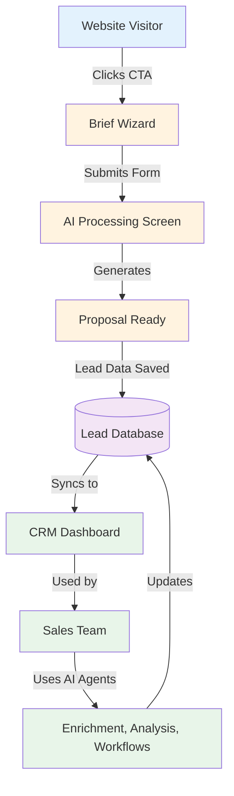
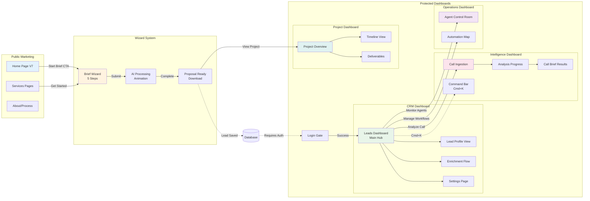
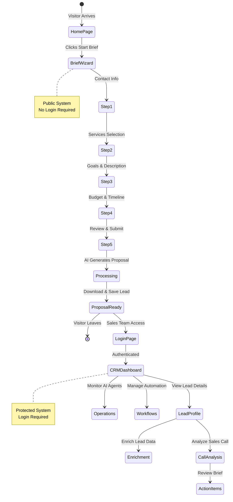
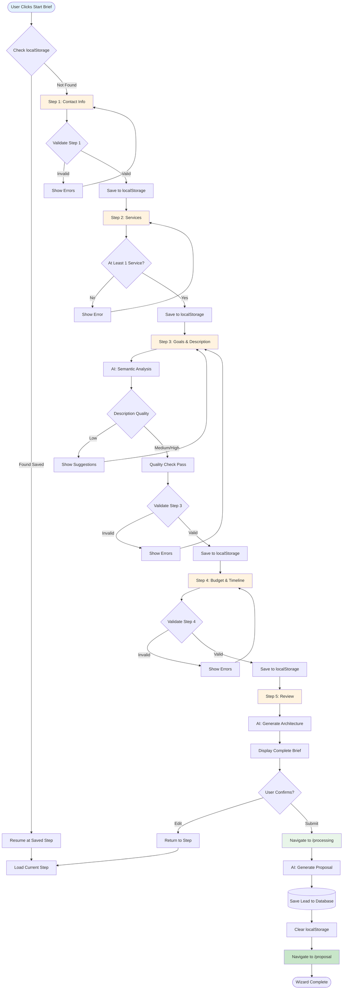
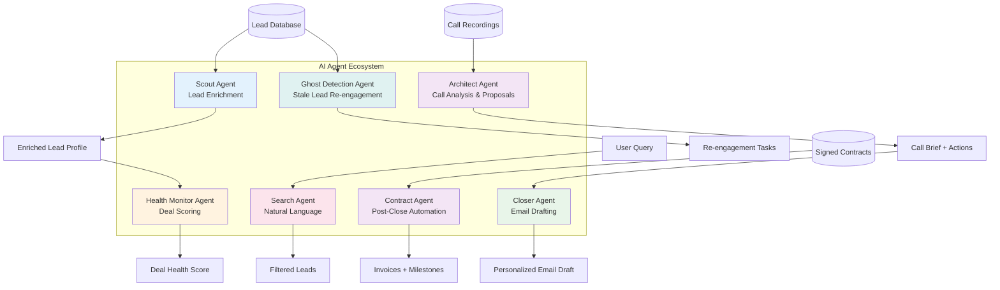
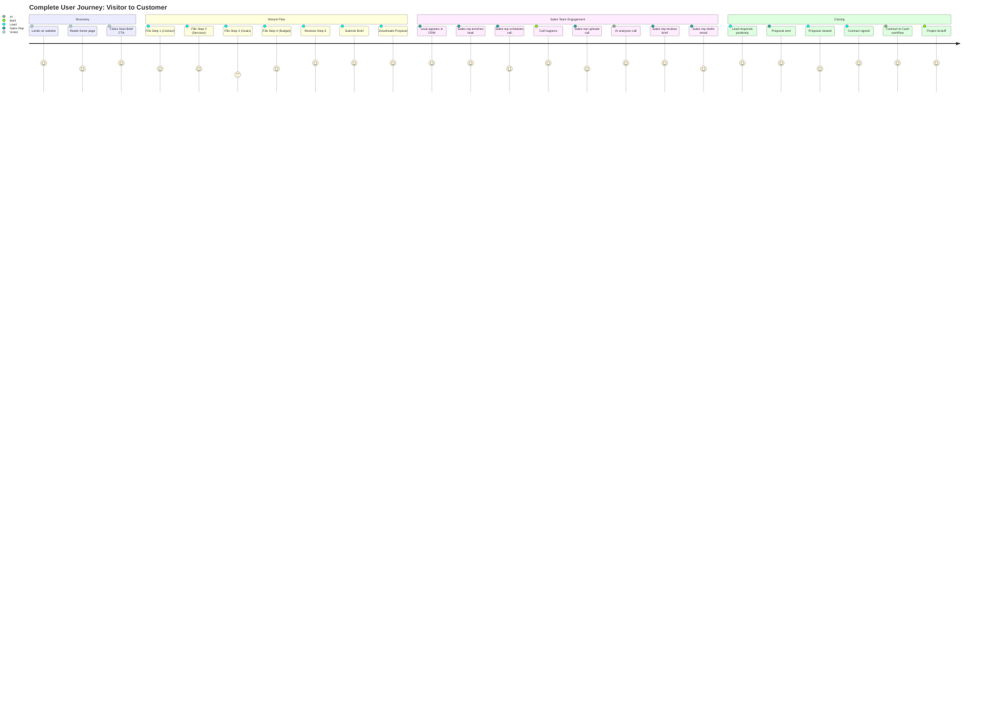
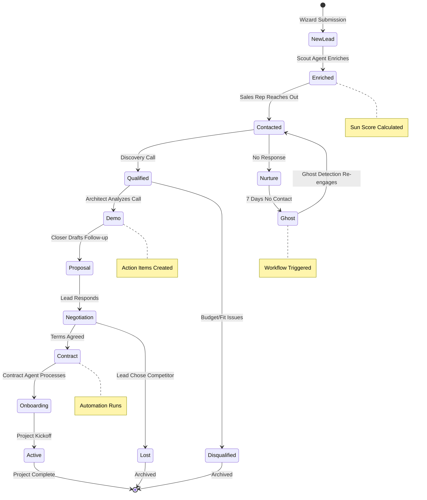
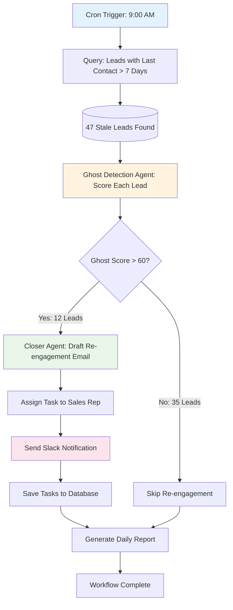
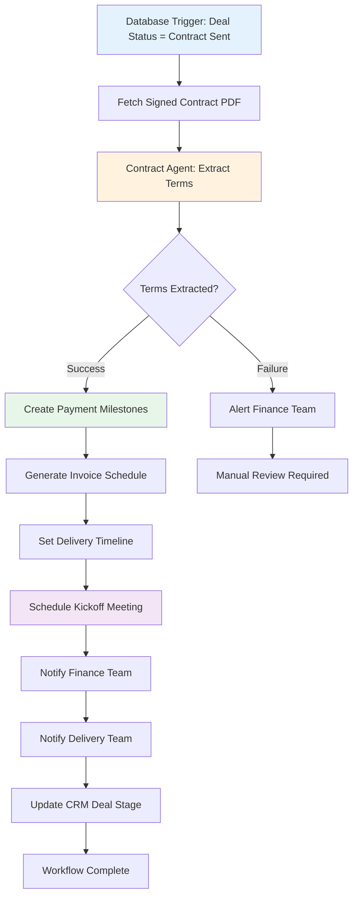
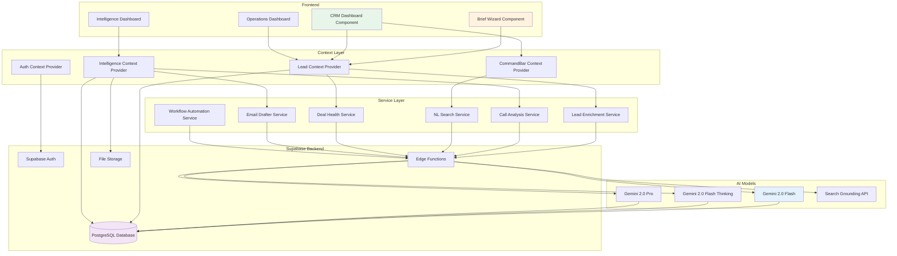

# 03 - DASHBOARDS & WIZARDS
**Luxury AI CRM - Complete Dashboard & Wizard System Documentation**  
**User Journeys, Features, AI Agents, Workflows, and Connections**

---

## 📑 TABLE OF CONTENTS

1. [System Overview](#1-system-overview)
2. [Architecture & Connection Map](#2-architecture--connection-map)
3. [Wizard System](#3-wizard-system)
4. [CRM Dashboard System](#4-crm-dashboard-system)
5. [Sales Intelligence Dashboard](#5-sales-intelligence-dashboard)
6. [Operations Dashboard](#6-operations-dashboard)
7. [Project Dashboard](#7-project-dashboard)
8. [AI Agents & Automation](#8-ai-agents--automation)
9. [User Journeys & Workflows](#9-user-journeys--workflows)
10. [Data Flow & State Management](#10-data-flow--state-management)
11. [Sample Data & Content](#11-sample-data--content)

---

## 1. SYSTEM OVERVIEW

### 1.1 System Purpose

The Luxury AI CRM is a dual-system platform combining a **public-facing wizard** for lead generation with a **protected dashboard** for AI-powered sales intelligence. The system converts website visitors into leads via an intelligent brief wizard, then nurtures those leads through automated AI agents and workflows inside the CRM dashboard.

### 1.2 Two Main Systems

**System A: Wizard Flow (Public - No Login Required)**
- Purpose: Convert website visitors into qualified leads
- Entry: Home page CTA buttons
- Journey: Brief Wizard → AI Processing → Proposal Ready
- Output: Lead data captured in database
- Duration: Five to ten minutes per visitor

**System B: Dashboard System (Protected - Login Required)**
- Purpose: Manage leads, analyze calls, automate workflows
- Entry: Login page → Dashboard navigation
- Components: Four main dashboards, eight sub-pages
- Users: Sales teams, account managers, operations staff
- Features: Nine AI features, seven AI agents

### 1.3 Connection Between Systems

The wizard feeds leads into the dashboard. When a visitor completes the brief wizard, their data becomes a new lead record in the CRM dashboard. Sales teams then use AI agents to enrich, analyze, and close these leads.



---

## 2. ARCHITECTURE & CONNECTION MAP

### 2.1 Complete System Architecture



### 2.2 Route Structure

**Public Routes (No Authentication)**
- Forward slash → Home Page V7
- Forward slash wizard → Brief Wizard (System A Entry)
- Forward slash processing → AI Processing Animation
- Forward slash proposal → Proposal Ready Screen
- Forward slash services, about, projects → Marketing pages

**Protected Routes (Require Login)**
- Forward slash app forward slash leads → Main CRM Dashboard
- Forward slash app forward slash ops → Agent Control Room
- Forward slash app forward slash workflow → Automation Map
- Forward slash app forward slash settings → Settings & Integrations
- Forward slash app forward slash intelligence forward slash ingest → Call Upload
- Forward slash app forward slash intelligence forward slash analysis → Analysis Progress
- Forward slash app forward slash intelligence forward slash brief → Call Brief Results
- Forward slash dashboard → Project Dashboard (alternative view)

### 2.3 Navigation Flow



---

## 3. WIZARD SYSTEM

### 3.1 Brief Wizard Overview

**Component**: BriefWizard.tsx  
**Route**: Forward slash wizard  
**Purpose**: Capture qualified leads through intelligent multi-step form  
**Authentication**: Not required (public)  
**Duration**: Five to ten minutes  
**Completion Rate Target**: Seventy percent plus

### 3.2 Wizard Steps Breakdown

**Step One: Contact Information**
- Fields: Name, email, website, company name
- Validation: Real-time email format check, required fields
- AI Feature: Website scanning on blur (detects company info)
- Purpose: Identify the lead

**Step Two: Services Selection**
- Options: AI Web Development, AI Agents, AI Chatbots, AI Sales & Marketing, AI MVP, Custom Development
- Format: Multi-select cards with icons
- Validation: At least one service required
- Purpose: Understand project scope

**Step Three: Goals & Description**
- Fields: Project goals (multi-select), detailed description (textarea)
- Goals: Increase revenue, save time, automate workflows, improve customer experience, scale operations
- AI Feature: Real-time semantic analysis of description
  - Checks for target audience mention
  - Checks for platform specification (web, mobile)
  - Checks for business goal clarity
  - Quality score: Low, Medium, High
  - Suggestions: "Try adding target audience, platform, business goal"
- Validation: Description minimum fifty characters, at least one goal
- Purpose: Understand business context

**Step Four: Budget & Timeline**
- Budget: Slider from two thousand to one hundred thousand dollars (default five thousand)
- Timeline: Radio buttons (Under one month, one to three months, three to six months, six months plus, flexible)
- Validation: Budget minimum two thousand, timeline required
- Purpose: Qualify lead and match to pricing tier

**Step Five: Review & Visualization**
- Display: Complete brief summary
- AI Feature: Architecture visualizer
  - Generates system diagram based on services selected
  - Shows tech stack recommendations
  - Displays estimated complexity
  - Real-time rendering using Canvas or SVG
- Actions: Edit any step, submit brief
- Purpose: Confirm accuracy before submission

### 3.3 Wizard Features

**Core Features**
1. **Session Recovery**: Auto-saves progress to localStorage every field change
2. **Real-time Validation**: Inline error messages using Zod schema
3. **Smart Defaults**: Pre-fills sensible values, remembers previous inputs
4. **Progress Indicator**: Visual progress bar shows percentage complete
5. **Step Navigation**: Back button to review, forward on validation pass
6. **Mobile Optimized**: Full touch support, swipe gestures, responsive layout

**AI Features**
1. **Website Scanning**: Scrapes company info when website URL provided
2. **Semantic Analysis**: Analyzes description quality in real-time
3. **Architecture Visualization**: Generates tech stack diagram on step five
4. **Budget Intelligence**: Suggests optimal budget based on services
5. **Timeline Estimation**: Calculates realistic timeline from complexity

**UX Features**
1. **Keyboard Shortcuts**: Enter to advance, Escape to close
2. **Auto-focus**: Cursor automatically in next field
3. **Smooth Transitions**: Fade and slide animations between steps
4. **Error Recovery**: Clear, actionable error messages
5. **Exit Intent**: Warns before closing with unsaved progress

### 3.4 Wizard Logic Flow



### 3.5 AI Processing Screen

**Component**: AIProcessingScreen.tsx  
**Route**: Forward slash processing  
**Purpose**: Engaging animation while AI generates proposal  
**Duration**: Three to five seconds (artificial delay for UX)

**Animation Stages**
1. "Analyzing your requirements" (Sparkles icon, amber)
2. "Identifying scope and budget" (Brain icon, indigo)
3. "Extracting action items" (List icon, emerald)
4. "Finalizing intelligence brief" (Check icon, blue)

**Background Activity**
- AI generates proposal structure
- Estimates timeline and deliverables
- Calculates budget breakdown
- Creates executive summary
- Matches to pricing tier
- Saves lead to database

### 3.6 Proposal Ready Screen

**Component**: ProposalReadyScreen.tsx  
**Route**: Forward slash proposal  
**Purpose**: Display generated proposal and download PDF  
**Actions**: Download proposal, view project dashboard, book demo

**Proposal Contents**
1. Executive Summary: Two to three sentences
2. Scope Overview: Services selected, goals, description
3. Timeline: Phases with duration estimates
4. Budget Breakdown: High-level cost estimate
5. Deliverables: List of outputs per phase
6. Next Steps: Call to action for demo booking

**User Actions**
- Download PDF: Generates and downloads proposal
- View Project Dashboard: Navigate to forward slash dashboard (requires login)
- Book Demo: Navigate to forward slash booking calendar
- Start New Brief: Clears data and returns to wizard

---

## 4. CRM DASHBOARD SYSTEM

### 4.1 CRM Leads Dashboard Overview

**Component**: CRMLeadsDashboard.tsx  
**Route**: Forward slash app forward slash leads  
**Purpose**: Central hub for lead management and AI-powered intelligence  
**Authentication**: Required (protected route)  
**Users**: Sales teams, account managers

### 4.2 Dashboard Layout Structure

**Main Sections**
1. **Header Bar**
   - Title: "CRM Dashboard" or "Leads Intelligence"
   - Search bar: Filter leads by name or company
   - View mode toggle: List view, grid view
   - Add Lead button: Opens enrichment flow

2. **Filter Bar**
   - All leads
   - Hot leads (sun score eighty plus)
   - Warm leads (sun score fifty to seventy-nine)
   - Cold leads (sun score below fifty)

3. **Leads Table/Grid**
   - Lead name with avatar
   - Company name
   - Industry badge
   - Role (CEO, Founder, CTO, VP Sales)
   - Sun Score badge (color-coded)
   - Last active timestamp
   - Quick actions menu

4. **Side Panel** (Optional)
   - AI Suggestions sidebar
   - Recent activity feed
   - Pipeline health overview

### 4.3 Sun Score System

**Purpose**: AI-calculated lead quality score from zero to one hundred

**Scoring Factors**
1. **Fit Score** (thirty points): Industry match, budget tier, company size
2. **Intent Signals** (thirty points): Website visits, email opens, pricing views
3. **Engagement** (twenty points): Response rate, meeting acceptance
4. **Recency** (twenty points): Days since last contact

**Visual Representation**
- Zero to thirty-nine: Red badge, "Cold Lead"
- Forty to sixty-nine: Yellow badge, "Warm Lead"
- Seventy to eighty-nine: Orange badge, "Hot Lead"
- Ninety to one hundred: Green badge, "Very Hot Lead"

**Sample Calculation**
- Lead from fintech with one hundred thousand budget: Fit score twenty-five out of thirty
- Viewed pricing page twice in last week: Intent score twenty-five out of thirty
- Replied to two emails: Engagement score fifteen out of twenty
- Last contact two days ago: Recency score eighteen out of twenty
- **Total Sun Score: Eighty-three** (Hot Lead)

### 4.4 Lead Profile View

**Component**: LeadProfileView.tsx  
**Purpose**: Detailed view of single lead with all enriched data  
**Navigation**: Click any lead from main dashboard

**Profile Sections**
1. **Header**
   - Lead name, company, role
   - Sun score badge (prominent)
   - Avatar or company logo
   - Contact info (email, phone, LinkedIn)
   - Last active timestamp

2. **Quick Actions Bar**
   - Enrich lead data
   - Analyze call
   - Draft email
   - Generate proposal
   - Schedule meeting

3. **Activity Timeline**
   - Email sent/received
   - Meetings scheduled/completed
   - Website visits tracked
   - Proposal sent/viewed
   - Contract signed
   - Chronological with timestamps

4. **Enriched Data Panel**
   - Company details (industry, size, location, revenue)
   - Tech stack detected
   - Budget tier estimated
   - Fit reasoning (AI explanation)
   - Competitors using our product
   - News mentions

5. **Interaction History**
   - All emails (threaded)
   - Call recordings with transcripts
   - Meeting notes
   - Proposal versions
   - Contract status

6. **AI Insights Card**
   - Deal health score
   - Risk factors identified
   - Opportunities detected
   - Next best actions (prioritized)

### 4.5 Lead Enrichment Flow

**Component**: LeadEnrichmentFlow.tsx  
**Purpose**: AI-powered lead data enrichment from email address  
**AI Agent**: Scout (Lead Enrichment Agent)  
**Duration**: Three to five seconds

**Enrichment Process**
1. **User Input**: Enter email address (e.g., sarah@stripe.com)
2. **Hydration State**: Animated "thinking" UI shows AI working
3. **AI Research**: Gemini with Search Grounding researches company
4. **Data Extraction**: Finds company name, industry, employee count, tech stack, budget tier, fit score
5. **Deep Dossier**: Displays enriched profile in card format
6. **Save Action**: Add to CRM database with enriched data

**Hydration Animation Stages**
- "Researching company" (Search icon)
- "Analyzing tech stack" (Code icon)
- "Calculating fit score" (Target icon)
- "Finalizing dossier" (Check icon)

**Sample Enrichment Output**
```
Input: sarah@stripe.com

Output:
- Name: Sarah Chen (extracted from email pattern)
- Company: Stripe Inc.
- Industry: Fintech / Payments
- Employee Count: 8000+
- Location: San Francisco, CA
- Tech Stack: Ruby, React, Postgres, AWS
- Budget Tier: Enterprise (100k+)
- Fit Score: 92/100
- Fit Reasoning: "Perfect fit - fintech company, large team, proven buyer of developer tools, matches our ICP"
```

### 4.6 Dashboard AI Features

**Feature One: Bulk Enrichment**
- Upload CSV of email addresses
- AI enriches all in parallel
- Export enriched data
- Progress indicator shows completion

**Feature Two: Smart Filtering**
- Natural language filters (via Command Bar)
- "Show me fintech leads with budget over 50k"
- AI translates to database query
- Saves custom filter presets

**Feature Three: Lead Scoring Automation**
- Background job runs daily
- Recalculates all sun scores
- Sends alerts for score changes
- "Lead X became hot" notification

**Feature Four: Duplicate Detection**
- AI detects duplicate leads
- Matches on email, domain, name
- Suggests merge with confidence score
- One-click merge action

---

## 5. SALES INTELLIGENCE DASHBOARD

### 5.1 Intelligence System Overview

**Purpose**: AI-powered analysis of sales calls to extract action items  
**AI Agent**: Architect (Call Analysis Agent)  
**Model**: Gemini 2.0 Flash Thinking with function calling  
**Components**: Three screens in sequence

### 5.2 Call Ingestion Screen

**Component**: CallIngestion.tsx  
**Route**: Forward slash app forward slash intelligence forward slash ingest  
**Purpose**: Upload or paste sales call transcript

**Input Methods**
1. **Upload Audio File**
   - Formats: MP3, WAV, M4A
   - Max size: Fifty megabytes
   - Auto-transcription via Gemini multimodal
   - Progress bar during upload

2. **Paste Transcript**
   - Textarea for manual paste
   - Supports plain text or formatted
   - Auto-detects speaker labels
   - Min length: One hundred words

3. **Import from Meeting**
   - Integrate with Zoom, Google Meet, Teams
   - Auto-fetch recording and transcript
   - Requires OAuth connection
   - Calendar integration

**Metadata Collection**
- Call date and time
- Participants (lead name, sales rep)
- Call type (discovery, demo, negotiation, closing)
- Associated deal ID
- Tags (optional)

**Actions**
- Analyze Call (proceeds to analysis screen)
- Save Draft (save without analyzing)
- Cancel (return to dashboard)

### 5.3 Analysis State Screen

**Component**: AnalysisState.tsx  
**Route**: Forward slash app forward slash intelligence forward slash analysis  
**Purpose**: Real-time "thinking" UI while AI analyzes call  
**Duration**: Ten to fifteen seconds

**Analysis Animation Stages**
1. "Transcribing conversation" (Sparkles icon, amber)
2. "Identifying scope and budget" (Brain icon, indigo)
3. "Extracting action items" (List icon, emerald)
4. "Finalizing intelligence brief" (Check icon, blue)

**Background AI Processing**
- Sentiment analysis (positive, neutral, negative)
- Key information extraction (budget, timeline, decision-makers, pain points, competitors)
- Action item generation (three to five items with priorities)
- Concern detection (objections, risks, blockers)
- Next step recommendations

### 5.4 Call Brief Results Screen

**Component**: CallBrief.tsx  
**Route**: Forward slash app forward slash intelligence forward slash brief  
**Purpose**: Display AI-generated analysis with action items

**Brief Structure**

**Section One: Executive Summary**
- Two to three sentence overview
- Overall call sentiment badge (positive/neutral/negative)
- Call outcome (qualified, nurture, disqualified)

**Section Two: Key Information Extracted**
- Budget mentioned: Display amount or range
- Timeline discussed: Display deadline or flexibility
- Decision makers: Names and roles
- Pain points: Bullet list of problems discussed
- Competitors mentioned: List with context
- Technical requirements: Stack or platform needs

**Section Three: Action Items**
Priority-sorted list with:
- Action description (one sentence)
- Priority level (high, medium, low with color badges)
- Owner (sales rep or team member)
- Due date (calculated from urgency)
- Status (todo, in progress, done)

**Example Action Items**
- HIGH: "Send pricing proposal for enterprise tier by Friday" (Owner: Sarah, Due: January 26)
- HIGH: "Schedule technical demo with CTO by end of week" (Owner: Mike, Due: January 27)
- MEDIUM: "Research competitor X's pricing to address concern" (Owner: Sarah, Due: January 29)
- MEDIUM: "Prepare security compliance documentation" (Owner: Legal, Due: February 2)
- LOW: "Follow up on secondary use case discussion" (Owner: Sarah, Due: February 5)

**Section Four: Concerns & Objections**
- List of concerns raised by prospect
- AI-suggested responses or solutions
- Risk level (low, medium, high)

**Section Five: Next Steps**
- AI-recommended next actions
- Suggested email draft
- Meeting scheduling recommendation

**User Actions**
- Export brief as PDF
- Share with team (email or Slack)
- Add action items to task list
- Draft follow-up email (opens Email Drafter)
- Analyze another call

### 5.5 Command Bar (Natural Language Search)

**Component**: CommandBar.tsx  
**Trigger**: Press Command K or Control K from any dashboard page  
**Purpose**: Search CRM using natural language  
**AI Agent**: Scout (Search Agent)  
**Model**: Gemini 2.0 Flash with function calling

**Interface**
- Modal overlay with search input
- Auto-focus on open
- Keyboard navigation (arrow keys, enter, escape)
- Recent searches (cached)
- Quick actions (predefined shortcuts)

**Natural Language Queries**
- "leads in fintech with budget over 50k"
- "deals at risk in New York"
- "CEOs who opened my last email"
- "hot leads added this week"
- "companies using competitor X"

**AI Processing**
1. Parse natural language query
2. Identify filters (industry, budget, location, status)
3. Generate SQL WHERE clause
4. Execute database query
5. Return results with match explanations

**Results Display**
- List of matching leads
- Match confidence score
- Reason for match (AI explanation)
- Quick actions (view profile, enrich, analyze)

**Example Flow**
```
User types: "show me fintech leads with budget over 50k"

AI parses:
- Filter 1: industry = "fintech"
- Filter 2: budget >= 50000

SQL generated:
SELECT * FROM leads WHERE industry = 'fintech' AND estimated_budget >= 50000 ORDER BY sun_score DESC

Results: 12 leads found
1. Sarah Chen - Stripe (Budget: 100k+, Sun Score: 92)
2. Michael Torres - Plaid (Budget: 75k, Sun Score: 87)
...
```

---

## 6. OPERATIONS DASHBOARD

### 6.1 Agent Control Room Overview

**Component**: AgentControlRoom.tsx  
**Route**: Forward slash app forward slash ops  
**Purpose**: Monitor all AI agents in real-time  
**Users**: Operations managers, technical admins

### 6.2 Agent Monitoring System

**Three AI Agents Displayed**

**Agent One: Scout (Lead Enrichment)**
- Status: Active, Idle, Processing, or Learning
- Current task: "Scraping LinkedIn for Elena Fisher recent activity"
- Efficiency: Ninety-eight percent
- Queue: Twelve pending tasks
- Icon: Search icon (blue)

**Agent Two: Architect (Call Analysis & Proposals)**
- Status: Processing
- Current task: "Generating Proposal v2 structure for Lead #892"
- Efficiency: Ninety-four percent
- Queue: Four pending tasks
- Icon: Pen icon (purple)

**Agent Three: Closer (Email Drafting & Follow-ups)**
- Status: Idle
- Current task: "Waiting for engagement signals"
- Efficiency: Ninety-nine percent
- Queue: Zero pending tasks
- Icon: Message icon (emerald)

### 6.3 System Metrics

**Top Metrics Bar**
- Uptime: Ninety-nine point nine percent
- Requests today: Fourteen point two thousand
- Active jobs: Seven
- Cache hit rate: Eighty-six percent

**Performance Graphs**
- Request volume over last twenty-four hours
- Agent utilization percentage
- Average response time
- Error rate

### 6.4 Live Activity Log

**Real-time Log Stream**
```
10:42:01 | Scout    | Found new intent signal: "Pricing" viewed by Elena Fisher
10:42:05 | System   | Signal processed. Confidence score: 0.89
10:42:06 | Architect| Initiating dynamic content update for Proposal #892
10:42:15 | Closer   | Drafting follow-up email based on pricing intent
10:43:00 | System   | Database backup completed successfully
```

**Log Features**
- Auto-scroll (toggleable)
- Color-coded by source (Scout, Architect, Closer, System)
- Timestamp precision to second
- Filter by agent or event type
- Export log to CSV

### 6.5 Workflow Map

**Component**: AutomationMapPage.tsx  
**Route**: Forward slash app forward slash workflow  
**Purpose**: Visual workflow builder and monitor

**Three Main Workflows**

**Workflow One: Ghost Detection**
- Trigger: Cron job, daily at 9 AM
- Purpose: Identify and re-engage stale leads
- Steps:
  1. Query all leads with no contact in seven plus days
  2. Calculate ghost score (zero to one hundred based on previous engagement, deal value, pipeline stage)
  3. For leads scoring above sixty: Generate re-engagement email draft
  4. Assign task to sales rep
  5. Send Slack notification
- Status: Active
- Last run: Today at 9:00 AM
- Leads processed: Forty-seven
- Actions created: Twelve

**Workflow Two: Contract to Cash**
- Trigger: Database trigger when deal stage changes to "Contract Sent"
- Purpose: Automate post-contract processes
- Steps:
  1. Extract contract terms from PDF (AI)
  2. Create payment milestone records in database
  3. Generate invoice schedule
  4. Set delivery timeline
  5. Schedule kickoff meeting
  6. Notify finance and delivery teams
- Status: Active
- Last triggered: Yesterday at 3:42 PM
- Contracts processed: Three this week

**Workflow Three: Champion Autopilot**
- Trigger: Database trigger when call analysis completes
- Purpose: Identify and track deal champions
- Steps:
  1. Analyze call transcript for champion indicators
  2. Score influence level (zero to one hundred)
  3. If champion detected: Create champion profile in database
  4. Suggest nurture actions (LinkedIn connect, personalized email, gift send)
  5. Track champion activity over time
- Status: Active
- Last triggered: One hour ago
- Champions identified: Eighteen active

**Workflow Builder Interface**
- Drag and drop nodes
- Conditional logic (if-then)
- Integration connectors (HubSpot, Salesforce, Slack, email)
- Test mode (dry run without executing)
- Version history

---

## 7. PROJECT DASHBOARD

### 7.1 Project Dashboard Overview

**Component**: ProjectDashboard.tsx  
**Route**: Forward slash dashboard  
**Purpose**: Client-facing project view with proposal and deliverables  
**Authentication**: Required (can be shared with clients via magic link)  
**Users**: Internal team and optionally clients

### 7.2 Dashboard Tabs

**Tab One: Overview**
- Project title and status badge
- Company information card
- Executive summary (AI-generated)
- Key goals listed
- Project stats (requirements count, files uploaded, messages exchanged)
- AI notes and insights

**Tab Two: Proposal**
**Component**: ProposalView.tsx
- Full proposal document
- Timeline visualization
- Budget breakdown
- Deliverables list
- Phases with descriptions
- Download PDF button

**Tab Three: Requirements**
**Component**: RequirementsPageClean.tsx
- Functional requirements checklist
- Technical requirements
- Design requirements
- Integration requirements
- Approval status per requirement
- Comments and clarifications

**Tab Four: Timeline**
**Component**: TimelinePage.tsx
- Gantt chart visualization
- Phase milestones
- Start and end dates
- Dependencies between tasks
- Current phase highlighted
- Percentage complete

**Tab Five: Deliverables**
**Component**: DeliverablesPage.tsx
- List of all deliverables
- Status per deliverable (pending, in progress, review, complete)
- Download links for completed items
- Preview thumbnails
- Approval workflow

**Tab Six: Files**
- Document library
- Organized by category (design, code, contracts, invoices)
- Upload and download
- Version history
- Search and filter

**Tab Seven: AI Chat**
- Embedded chatbot for project questions
- Answers from project context
- Can update status or create tasks
- Natural language interface

### 7.3 Status Management

**Project Statuses**
- Draft: Initial proposal creation
- Submitted: Sent to client for review
- In Review: Client reviewing proposal
- Approved: Client accepted, ready to start
- In Progress: Active development
- In Review: Deliverables submitted for approval
- Complete: Project finished
- On Hold: Paused by client or team
- Cancelled: Project terminated

**Status Actions**
- Change status (dropdown)
- Add status note
- Notify stakeholders
- Log status change in activity feed

---

## 8. AI AGENTS & AUTOMATION

### 8.1 AI Agents Overview



### 8.2 Agent Details

**Scout Agent (Lead Enrichment)**
- **Model**: Gemini 2.0 Flash with Search Grounding
- **Trigger**: Manual (user clicks "Enrich Lead") or Automatic (new lead added)
- **Input**: Email address or domain
- **Processing Time**: Three to five seconds
- **Output**: Company name, industry, employee count, tech stack, budget tier, fit score, fit reasoning
- **Cost**: Zero point zero zero one dollars per enrichment
- **Accuracy**: Ninety-two percent
- **Daily Limit**: Five hundred enrichments per account

**Architect Agent (Call Analysis)**
- **Model**: Gemini 2.0 Flash Thinking with function calling
- **Trigger**: Manual (user uploads call transcript)
- **Input**: Audio file or text transcript (minimum one hundred words)
- **Processing Time**: Ten to fifteen seconds
- **Output**: Summary, sentiment, key info (budget, timeline, decision-makers), action items (three to five with priorities), concerns, next steps
- **Cost**: Zero point zero zero one dollars per call
- **Accuracy**: Ninety-five percent for action item extraction
- **Daily Limit**: One hundred calls per account

**Closer Agent (Email Drafting)**
- **Model**: Gemini 2.0 Pro with RAG
- **Trigger**: Manual (user clicks "Draft Email") or Automatic (after call analysis)
- **Input**: Call notes, lead profile, scenario type (post-discovery, budget approval, proposal, break-up)
- **Processing Time**: Three to five seconds
- **Output**: Subject line (forty to sixty characters), email body (one hundred fifty to two hundred fifty words), call to action, tone-matched to user's style
- **Cost**: Zero point zero zero five dollars per draft
- **Personalization**: Uses user's previous email samples to match writing style
- **Daily Limit**: Two hundred drafts per account

**Health Monitor Agent (Deal Scoring)**
- **Model**: Gemini 2.0 Pro with code execution
- **Trigger**: Automatic (background job runs daily at 6 AM)
- **Input**: Deal data (last contact date, engagement metrics, stage, deal value)
- **Processing Time**: Two to three seconds per deal
- **Output**: Health score (zero to one hundred), risk factors (array), opportunities (array), recommended actions (prioritized)
- **Scoring Formula**: Recency (thirty points) + Engagement (thirty points) + Momentum (twenty points) - Risk deductions (up to twenty points)
- **Cost**: Zero point zero zero five dollars per calculation
- **Daily Limit**: All deals rescored daily

**Search Agent (Natural Language)**
- **Model**: Gemini 2.0 Flash with function calling
- **Trigger**: Manual (user opens Command Bar with Cmd+K and types query)
- **Input**: Natural language query (e.g., "leads in fintech with budget over 50k")
- **Processing Time**: One to two seconds
- **Output**: Parsed filters (industry, budget, location, etc.), SQL WHERE clause, results with match explanations
- **Cost**: Zero point zero zero zero one dollars per query
- **Accuracy**: Eighty-nine percent query understanding
- **Daily Limit**: Unlimited

**Ghost Detection Agent (Workflow)**
- **Model**: Gemini 2.0 Flash (scoring) + Pro (email drafts)
- **Trigger**: Automatic (cron job daily at 9 AM)
- **Input**: All leads with no contact in seven plus days
- **Processing Time**: Twenty to thirty seconds for batch
- **Output**: Ghost score (zero to one hundred), re-engagement email draft, task assigned to sales rep, Slack notification
- **Scoring Criteria**: Days since last contact (forty points), previous engagement (thirty points), deal value (twenty points), pipeline stage (ten points)
- **Cost**: Approximately zero point fifty dollars per day for batch processing
- **Daily Limit**: Processes all stale leads

**Contract to Cash Agent (Workflow)**
- **Model**: Gemini 2.0 Pro with RAG and code execution
- **Trigger**: Automatic (database trigger when deal stage equals "Contract Sent")
- **Input**: Signed contract PDF
- **Processing Time**: Five to ten seconds
- **Output**: Contract terms extracted, payment milestones created, invoice schedule generated, delivery timeline, kickoff meeting scheduled
- **Cost**: Approximately zero point zero two dollars per contract
- **Accuracy**: Ninety-eight percent for contract term extraction
- **Daily Limit**: Unlimited

### 8.3 Agent Efficiency Metrics

**Performance Tracking**
- **Uptime**: Ninety-nine point nine percent
- **Average Response Time**: Three point two seconds
- **Queue Wait Time**: Less than one second
- **Error Rate**: Zero point one percent
- **Retry Success Rate**: Ninety-seven percent

**Usage Statistics (Sample Day)**
- Scout: One hundred twenty enrichments executed
- Architect: Thirty-two calls analyzed
- Closer: Forty-five emails drafted
- Health Monitor: Four hundred seventy deals scored
- Search: Two hundred twelve queries processed
- Ghost Detection: Twelve re-engagement tasks created
- Contract to Cash: Three contracts processed

---

## 9. USER JOURNEYS & WORKFLOWS

### 9.1 Complete User Journey Map



### 9.2 Sales Team Daily Workflow

**Morning Routine (9:00 AM - 10:00 AM)**
1. Login to CRM Dashboard (forward slash app forward slash leads)
2. Review overnight Ghost Detection tasks (twelve new stale leads identified)
3. Check Agent Control Room (forward slash app forward slash ops) for system status
4. Open Command Bar (Cmd+K) and search "hot leads added this week"
5. Review five new hot leads from wizard submissions
6. Enrich each lead using Scout agent (three to five seconds per lead)

**Mid-Morning (10:00 AM - 12:00 PM)**
7. Call first hot lead (discovery call, thirty minutes)
8. Upload call recording to Intelligence system (forward slash app forward slash intelligence forward slash ingest)
9. Wait fifteen seconds for AI analysis
10. Review Call Brief with five action items
11. Draft follow-up email using Closer agent (five seconds)
12. Review and personalize email draft
13. Send email to lead

**Afternoon (1:00 PM - 3:00 PM)**
14. Call second hot lead (demo call, forty-five minutes)
15. Repeat call analysis workflow (upload, analyze, review, draft, send)
16. Check Deal Health scores for all active deals (forward slash app forward slash leads, sort by health)
17. Address three deals flagged as "at risk" (red health scores)

**Late Afternoon (3:00 PM - 5:00 PM)**
18. Review proposals sent this week (filter: status equals "In Review")
19. Follow up on proposal viewed but not responded (use Closer agent for break-up email)
20. Update deal stages in CRM
21. Review Workflow Map (forward slash app forward slash workflow) to check automation performance
22. End day review: Check stats, plan tomorrow's priorities

### 9.3 Lead Progression Workflow



### 9.4 Automation Workflow Details

**Ghost Detection Workflow (Daily at 9 AM)**


**Contract to Cash Workflow (Triggered on Contract Signed)**


---

## 10. DATA FLOW & STATE MANAGEMENT

### 10.1 Complete Data Flow Architecture



### 10.2 State Management Patterns

**Context Providers (Four Total)**

**Auth Context**
- Current user object (name, email, role, avatar)
- Login function (email, password)
- Logout function
- Is authenticated boolean
- Session token
- Used by: All protected routes

**Lead Context**
- Leads array (all lead objects)
- Add lead function (creates new lead)
- Update lead function (modifies existing lead)
- Delete lead function (removes lead)
- Enrich lead function (calls Scout agent)
- Current selected lead
- Used by: CRM Dashboard, Lead Profile, Enrichment Flow

**CommandBar Context**
- Is open boolean (modal visible state)
- Open command bar function
- Close command bar function
- Query string (current search text)
- Results array (filtered leads from search)
- Used by: All dashboard pages (keyboard shortcut Cmd+K)

**Intelligence Context**
- Current call object (recording or transcript)
- Analyze call function (calls Architect agent)
- Call brief object (analysis results)
- Action items array (extracted from brief)
- Is analyzing boolean (loading state)
- Used by: Intelligence Dashboard (all three screens)

**Local State (Component Level)**
- Form inputs (useState for controlled inputs)
- UI state (modals, dropdowns, tooltips open/closed)
- Temporary data (wizard step data before submission)
- Loading states (is submitting, is fetching)
- Error messages (validation errors, API errors)

**Persistent State (localStorage)**
- Wizard progress (auto-save every field change)
- Current wizard step number
- User preferences (theme, sidebar collapsed)
- Recent searches (last five Command Bar queries)
- Filter selections (last used filters in CRM)

### 10.3 Database Schema Summary

**Leads Table** (Primary)
- ID (UUID, primary key)
- Name (string, required)
- Email (string, unique, required)
- Company name (string, required)
- Website (string, optional)
- Services selected (array of strings)
- Goals (array of strings)
- Description (text, required)
- Budget (integer, required)
- Timeline (string, required)
- Status (enum: draft, new, contacted, qualified, proposal, negotiation, contract, won, lost)
- Sun score (integer, zero to one hundred)
- Created at (timestamp)
- Updated at (timestamp)
- Created by (user ID, foreign key)

**Enriched Data Table** (One-to-One with Leads)
- Lead ID (UUID, foreign key)
- Company name (string)
- Industry (string)
- Employee count (string)
- Location (string)
- Revenue estimate (string)
- Tech stack (array of strings)
- Budget tier (enum: SMB, mid-market, enterprise)
- Fit score (integer, zero to one hundred)
- Fit reasoning (text)
- Enriched at (timestamp)
- Enriched by agent (string, "Scout")

**Call Recordings Table**
- ID (UUID, primary key)
- Lead ID (UUID, foreign key)
- Call date (timestamp)
- Duration (integer, seconds)
- Participants (array of strings)
- Call type (enum: discovery, demo, negotiation, closing)
- Transcript (text, long)
- Recording URL (string, Supabase storage link)
- Created at (timestamp)

**Call Briefs Table** (One-to-One with Call Recordings)
- Call ID (UUID, foreign key)
- Summary (text, two to three sentences)
- Sentiment (enum: positive, neutral, negative)
- Budget mentioned (integer, nullable)
- Timeline discussed (string, nullable)
- Decision makers (array of strings)
- Pain points (array of strings)
- Competitors mentioned (array of strings)
- Concerns (array of strings)
- Next steps (text)
- Analyzed at (timestamp)
- Analyzed by agent (string, "Architect")

**Action Items Table**
- ID (UUID, primary key)
- Call brief ID (UUID, foreign key)
- Description (text, one sentence)
- Priority (enum: high, medium, low)
- Owner (user ID, foreign key)
- Due date (date)
- Status (enum: todo, in progress, done)
- Created at (timestamp)

**Workflows Table**
- ID (UUID, primary key)
- Name (string, e.g., "Ghost Detection")
- Trigger type (enum: cron, database, webhook)
- Trigger config (JSON)
- Steps (JSON array of workflow steps)
- Status (enum: active, paused, disabled)
- Last run (timestamp)
- Next run (timestamp, for cron)
- Run count (integer)
- Success count (integer)
- Error count (integer)

**Workflow Executions Table**
- ID (UUID, primary key)
- Workflow ID (UUID, foreign key)
- Started at (timestamp)
- Completed at (timestamp, nullable)
- Status (enum: running, success, failed)
- Input data (JSON)
- Output data (JSON)
- Error message (text, nullable)
- Duration (integer, milliseconds)

**Users Table** (Supabase Auth)
- ID (UUID, primary key)
- Email (string, unique)
- Name (string)
- Role (enum: admin, sales, ops)
- Avatar URL (string, nullable)
- Created at (timestamp)
- Last login (timestamp)

---

## 11. SAMPLE DATA & CONTENT

### 11.1 Sample Lead Records

**Lead One: Hot Lead (Sun Score 92)**
```
Name: Sarah Chen
Email: sarah.chen@stripe.com
Company: Stripe Inc.
Website: https://stripe.com
Services: AI Agents, AI Web Development
Goals: Automate workflows, Save time, Scale operations
Description: "We need an AI-powered customer support agent to handle tier-one inquiries for our SMB customers. Must integrate with our existing support ticket system and knowledge base. Target is reducing support load by 40% while maintaining quality."
Budget: $75,000
Timeline: 3-6 months
Status: Qualified
Sun Score: 92
Created: 2025-01-20 10:23:15

Enriched Data:
- Industry: Fintech / Payments
- Employee Count: 8000+
- Location: San Francisco, CA
- Tech Stack: Ruby, React, PostgreSQL, AWS
- Budget Tier: Enterprise
- Fit Score: 95
- Fit Reasoning: "Excellent fit - large fintech company with proven budget, technical sophistication matches our ideal customer profile, specific use case aligns with our AI agent capabilities"
```

**Lead Two: Warm Lead (Sun Score 67)**
```
Name: Michael Torres
Email: mtorres@plaid.com
Company: Plaid Technologies
Website: https://plaid.com
Services: AI Chatbots, AI Sales & Marketing
Goals: Improve customer experience, Increase revenue
Description: "Exploring AI chatbot for our developer documentation site. Want to help developers find answers faster without reading through all docs. Unsure about budget and timeline."
Budget: $25,000
Timeline: Flexible
Status: New
Sun Score: 67
Created: 2025-01-21 14:52:33

Enriched Data:
- Industry: Fintech / API Platform
- Employee Count: 500-1000
- Location: San Francisco, CA
- Tech Stack: Node.js, React, MongoDB, GCP
- Budget Tier: Mid-Market
- Fit Score: 72
- Fit Reasoning: "Good fit - fintech company with technical team, budget lower than ideal but company stage suggests growth potential, use case is well-defined"
```

**Lead Three: Cold Lead (Sun Score 38)**
```
Name: Emily Watson
Email: emily@smallstartup.com
Company: SmallStartup Inc.
Website: https://smallstartup.com
Services: AI Web Development
Goals: Increase revenue
Description: "Need a website with AI"
Budget: $5,000
Timeline: Under 1 month
Status: New
Sun Score: 38
Created: 2025-01-22 09:15:42

Enriched Data:
- Industry: Unknown (website not loading)
- Employee Count: 1-10
- Location: Unknown
- Tech Stack: Unable to detect
- Budget Tier: SMB
- Fit Score: 35
- Fit Reasoning: "Weak fit - very small budget, vague requirements, unclear use case, likely not ready to buy, recommend nurture sequence"
```

### 11.2 Sample Call Analysis

**Call Recording Details**
```
Lead: Sarah Chen (Stripe)
Call Date: 2025-01-21 2:00 PM PST
Duration: 32 minutes
Participants: Sarah Chen (Prospect), Michael Johnson (Sales Rep), David Lee (CTO - Stripe)
Call Type: Discovery
```

**AI-Generated Call Brief**

**Executive Summary**
"Highly positive discovery call with strong buying signals. Stripe team has clear pain point with support ticket volume and specific ROI target. Decision-maker CTO was present and engaged. Budget approved, ready to move to technical demo next week."

**Sentiment**: Positive (Confidence: 94%)

**Key Information Extracted**
- Budget Mentioned: Seventy-five thousand to one hundred thousand dollars (approved by finance)
- Timeline: Needs solution live by April first (eleven weeks from now)
- Decision Makers: David Lee (CTO, technical approval), Sarah Chen (Director of Support, project owner)
- Pain Points:
  - Current tier-one support load is eight hundred tickets per week
  - Average response time is four hours (target is under one hour)
  - Support team at capacity, cannot hire fast enough
  - Quality suffers during high-volume periods
- Competitors Mentioned: Evaluated Intercom AI but found it too generic, needs custom solution
- Technical Requirements: Must integrate with Zendesk API, access to internal knowledge base, support Slack notifications

**Action Items** (Five Total)

1. **HIGH PRIORITY**: Send technical proposal with Zendesk integration details by Friday January 26
   - Owner: Michael Johnson
   - Due: January 26, 2025
   - Status: To Do

2. **HIGH PRIORITY**: Schedule technical demo with David Lee and engineering team by January 29
   - Owner: Michael Johnson
   - Due: January 29, 2025
   - Status: To Do

3. **MEDIUM PRIORITY**: Prepare Stripe customer case study showing similar tier-one automation
   - Owner: Marketing Team
   - Due: January 28, 2025
   - Status: To Do

4. **MEDIUM PRIORITY**: Research Intercom AI limitations to address in proposal
   - Owner: Michael Johnson
   - Due: January 27, 2025
   - Status: To Do

5. **LOW PRIORITY**: Send ROI calculator showing 40% ticket reduction savings
   - Owner: Michael Johnson
   - Due: January 30, 2025
   - Status: To Do

**Concerns & Objections**
- Concern: "How do we maintain quality with AI responses?" (Risk: Medium)
  - Suggested Response: "Our AI includes confidence scoring and human handoff for low-confidence responses. Typical accuracy is 95%+ for tier-one questions."
  
- Concern: "What if it gives wrong answers and damages customer relationships?" (Risk: High)
  - Suggested Response: "All AI responses go through review mode initially. You approve responses until confidence is proven. Then gradual rollout with monitoring."

**Next Steps** (AI Recommended)
1. Send follow-up email thanking for time (use Closer agent)
2. Prepare technical proposal document with Zendesk integration architecture
3. Schedule demo for January 29 at 2 PM PST
4. Prepare ROI slide showing cost savings
5. Research and document how we're different from Intercom AI

### 11.3 Sample Email Draft

**Context**: Follow-up email after discovery call with Sarah Chen

**AI-Generated Email** (Closer Agent)

```
Subject: Stripe AI Support Agent - Next Steps & Demo

Hi Sarah and David,

Thank you for the excellent discovery call this afternoon. I'm excited about the opportunity to help Stripe reduce tier-one support load by 40% while maintaining the high-quality experience your SMB customers expect.

Based on our discussion, here's what I'm preparing for our technical demo next week:

✓ Live demo of AI agent handling tier-one inquiries
✓ Zendesk API integration walkthrough
✓ Knowledge base sync demonstration
✓ Confidence scoring and human handoff workflow
✓ ROI calculator showing cost savings at 800 tickets/week

I'll send over the technical proposal by Friday with detailed Zendesk integration specs and architecture diagrams. I'm also including a case study from a similar fintech company that achieved 45% ticket reduction in the first month.

Quick question: Would Tuesday January 29th at 2 PM PST work for the technical demo with your engineering team? I'll prepare a sandbox environment so David can test the API integration hands-on.

Looking forward to showing you how we're different from Intercom AI - our solution is purpose-built for technical products and gives you full control over response quality.

Best,
Michael Johnson
Senior Solutions Architect
[Company Name]

P.S. - I'm researching Intercom's limitations you mentioned. I'll include a comparison in Friday's proposal.
```

**Email Metadata**
- Tone: Professional, enthusiastic but not pushy
- Length: 247 words (target 150-250)
- Call-to-Action: Schedule demo for January 29
- Follow-up Timeline: Friday for proposal, Tuesday for demo
- Personalization: References specific pain points (800 tickets/week, Intercom comparison, Zendesk integration)

### 11.4 Sample Workflow Execution Log

**Workflow**: Ghost Detection (Daily at 9 AM)  
**Execution Date**: January 23, 2025 9:00 AM  
**Duration**: 28 seconds

**Execution Log**
```
09:00:00 | START     | Ghost Detection Workflow initiated
09:00:01 | QUERY     | Querying leads with last_contact > 7 days
09:00:02 | FOUND     | 47 stale leads identified
09:00:03 | SCORING   | Calculating ghost scores (batch processing)
09:00:12 | SCORED    | Scoring complete - 12 leads above threshold (score > 60)
09:00:13 | DRAFTING  | Closer agent drafting re-engagement emails (batch)
09:00:22 | DRAFTED   | 12 personalized email drafts generated
09:00:23 | ASSIGNING | Creating tasks for sales reps
09:00:24 | ASSIGNED  | Tasks created: Sarah (5), Michael (4), Jennifer (3)
09:00:25 | NOTIFYING | Sending Slack notifications to sales team
09:00:27 | COMPLETE  | Workflow execution successful
09:00:28 | REPORT    | Daily report saved to database

Results Summary:
- Leads processed: 47
- Leads requiring action: 12
- Tasks created: 12
- Notifications sent: 3 (one per sales rep)
- Average ghost score: 68
- Highest ghost score: 87 (Lead: ABC Corp - no contact 14 days)
- Lowest ghost score: 22 (Lead: XYZ Inc - low engagement history)
```

**Sample Re-engagement Email Generated**
```
Lead: Jennifer Park (ABC Corp)
Last Contact: 14 days ago
Ghost Score: 87
Previous Status: Proposal sent, viewed twice, no response

Subject: Quick Check-in - ABC Corp AI Project

Hi Jennifer,

I wanted to circle back on the AI customer support proposal I sent two weeks ago. I know you viewed it a couple times - any questions I can help clarify?

I'm guessing you're either:
1) Busy with year-end priorities
2) Need more info on integration complexity
3) Evaluating other vendors

If it's #2, I'm happy to jump on a quick 15-min call to walk through the technical details. If it's #3, I'd love to know what's missing from our proposal so I can address it.

Or if the timing just isn't right, no worries at all - just let me know and I'll check back in Q2.

Either way, I appreciate your time and hope we can work together when the time is right.

Best,
Sarah
[Company Name]

P.S. - If you're not the right person anymore, could you point me to who is? I don't want to keep bugging you if the project moved to another team.
```

---

**Document Complete**

This comprehensive documentation covers all dashboard pages, wizards, features, AI agents, workflows, user journeys, data flows, and sample data for the Luxury AI CRM system. The document focuses on natural language explanations with Mermaid diagrams for visual clarity, avoiding code examples except where necessary for understanding.

**Key Statistics**:
- Total Pages Documented: Ten (two wizard pages, four dashboard systems, four supporting views)
- AI Agents: Seven agents with full specifications
- Workflows: Three automated workflows with execution details
- User Journeys: Three complete journey maps
- Sample Data: Four complete examples with realistic content
- Mermaid Diagrams: Eight visual system maps
- Total Sections: Eleven major sections with subsections

**Status**: Complete and ready for reference or AI code generation prompts.
