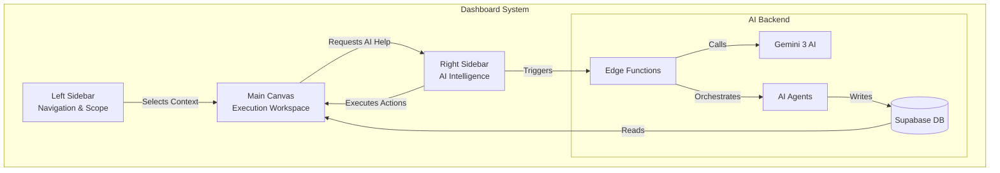
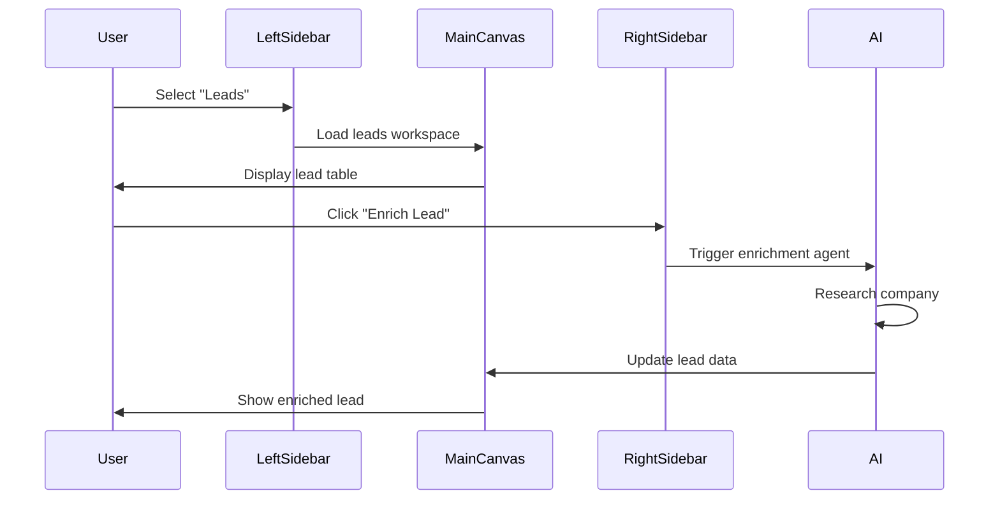
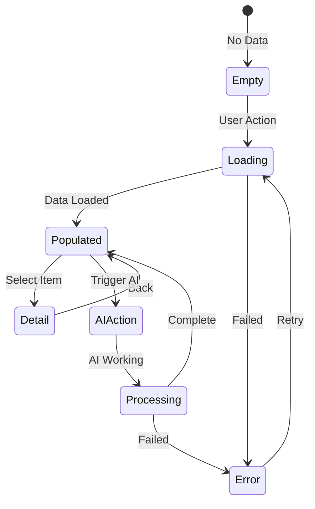
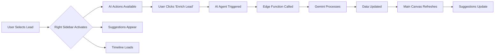
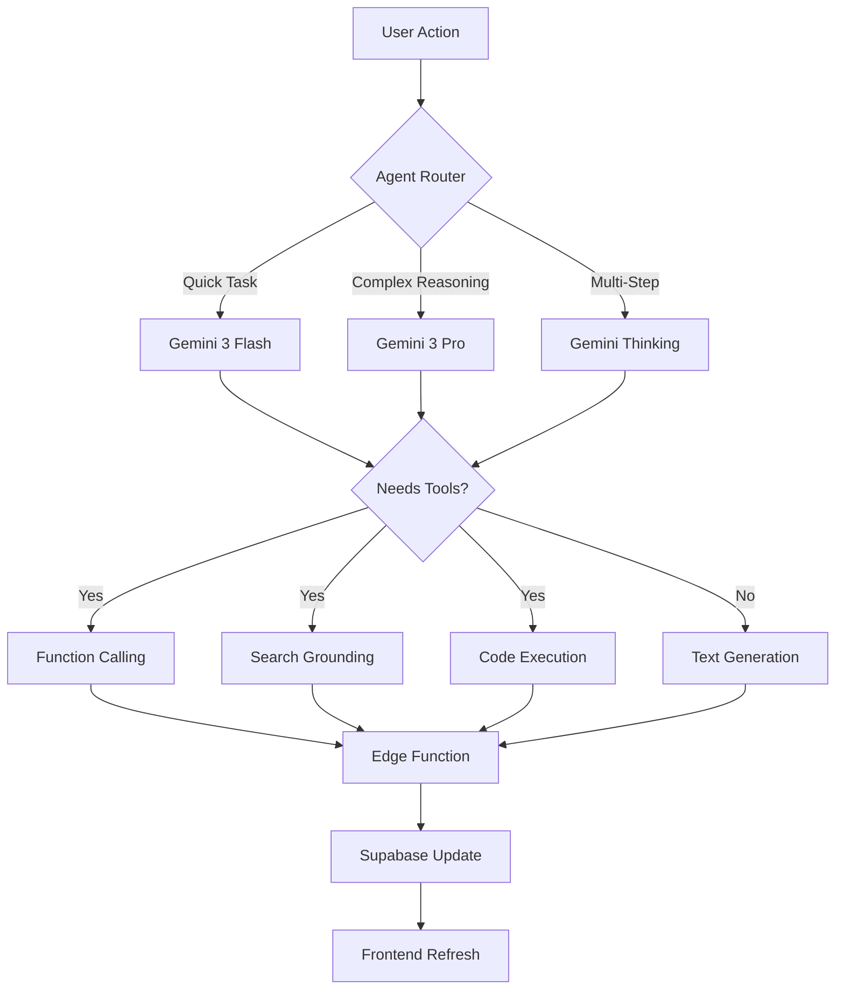
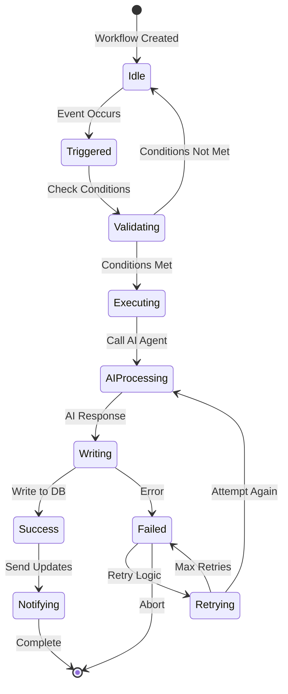
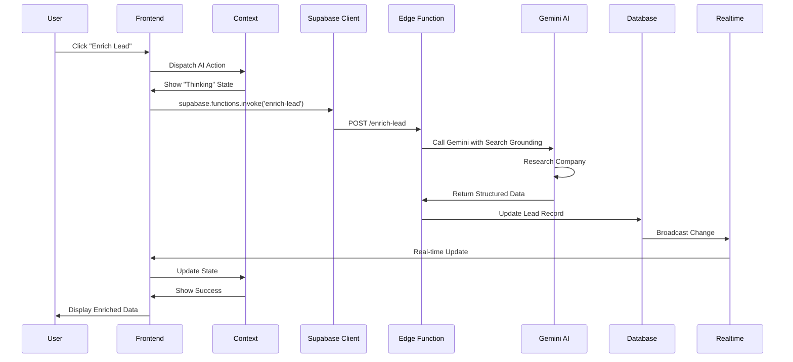
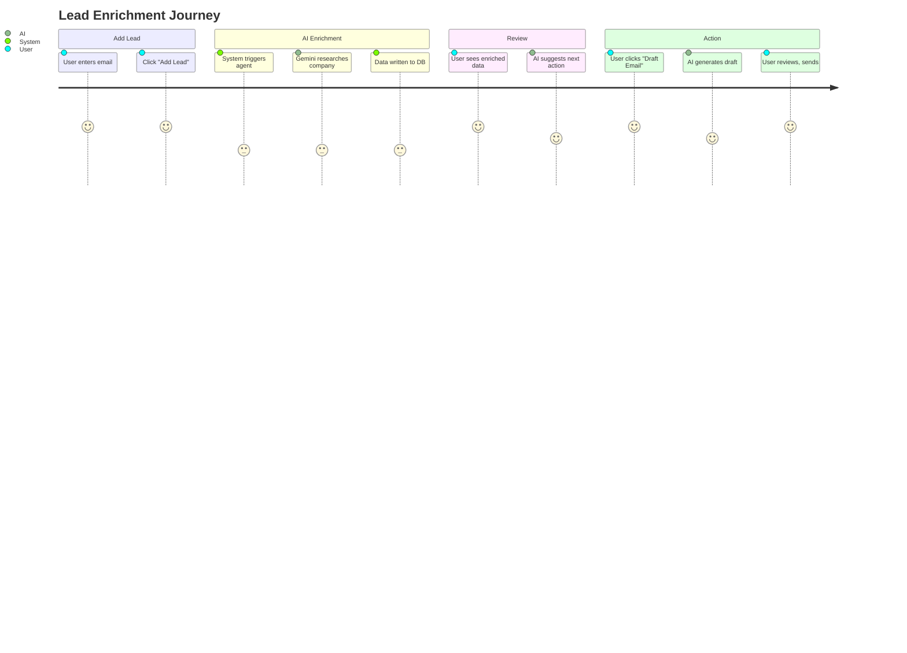
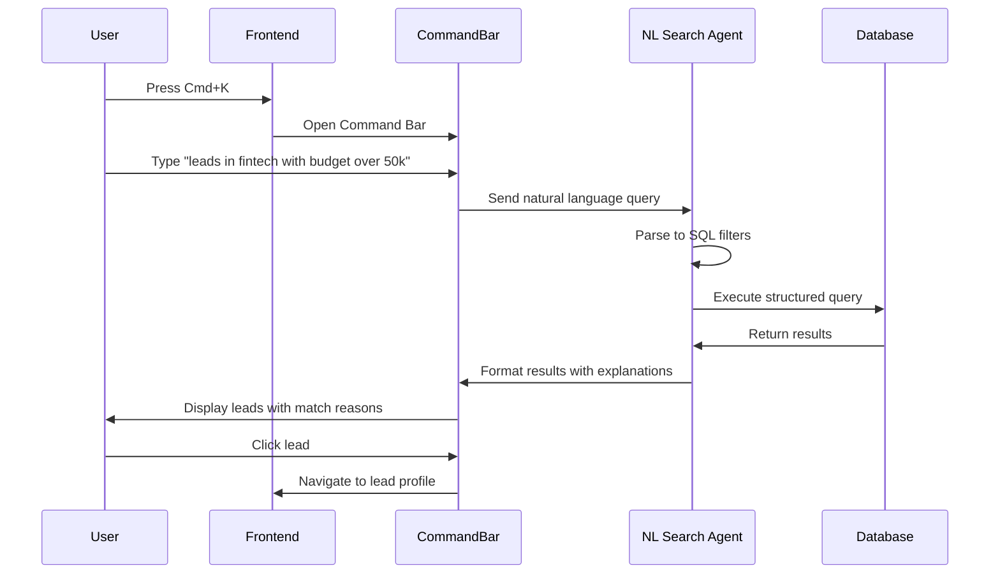
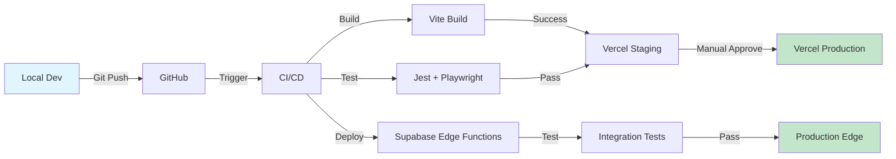

# 05 - DASHBOARD SYSTEM PLAN
**Sales Intelligence OS - Complete Dashboard Architecture**  
**AI Agents, Workflows, and System Integration**

---

## 📑 TABLE OF CONTENTS

1. [System Mental Model](#1-system-mental-model)
2. [Three-Column Architecture](#2-three-column-architecture)
3. [Left Sidebar - Navigation](#3-left-sidebar---navigation)
4. [Main Canvas - Workspace](#4-main-canvas---workspace)
5. [Right Sidebar - Trip Tools](#5-right-sidebar---trip-tools)
6. [AI Agents System](#6-ai-agents-system)
7. [Workflows & Automations](#7-workflows--automations)
8. [Frontend-Backend Connection](#8-frontend-backend-connection)
9. [Gemini Integration](#9-gemini-integration)
10. [Sun AI Agency Mapping](#10-sun-ai-agency-mapping)
11. [Features & Capabilities](#11-features--capabilities)
12. [User Journeys](#12-user-journeys)
13. [Wireframes](#13-wireframes)
14. [Progress Tracker](#14-progress-tracker)

---

## 1. SYSTEM MENTAL MODEL

### 1.1 One-Line Summary

| Component | Role | Responsibility |
|-----------|------|----------------|
| **Left Sidebar** | Navigation | Define context and scope (where you are) |
| **Main Canvas** | Workspace | Work in progress (what you're doing) |
| **Right Sidebar** | Intelligence | AI actions + automations (how it gets done) |

### 1.2 Core Principles

| Principle | Description | Why It Matters |
|-----------|-------------|----------------|
| **Separation of Concerns** | Navigation ≠ Execution ≠ Intelligence | Clear mental model for users |
| **Context-Aware AI** | AI only acts within selected scope | No surprise actions |
| **Human-First Approval** | AI suggests, human approves | User maintains control |
| **Single Source of Truth** | Main canvas = canonical state | No conflicting data |

### 1.3 System Diagram



---

## 2. THREE-COLUMN ARCHITECTURE

### 2.1 Layout Structure

| Column | Width | Behavior | Purpose |
|--------|-------|----------|---------|
| **Left Sidebar** | 280px | Fixed, collapsible | Global navigation, scope selector |
| **Main Canvas** | Flex (remaining) | Scrollable, responsive | Primary workspace, data display |
| **Right Sidebar** | 360px | Contextual, collapsible | AI tools, actions, insights |

### 2.2 Responsive Breakpoints

| Screen Size | Left Sidebar | Main Canvas | Right Sidebar |
|-------------|--------------|-------------|---------------|
| **Desktop (>1440px)** | Visible | Full width | Visible |
| **Laptop (1024-1440px)** | Visible | Full width | Collapsible |
| **Tablet (768-1024px)** | Overlay drawer | Full width | Bottom drawer |
| **Mobile (<768px)** | Bottom nav | Full screen | Modal |

### 2.3 Information Flow



---

## 3. LEFT SIDEBAR - NAVIGATION

### 3.1 Navigation Structure

| Section | Icon | Route | Purpose | Auth Required |
|---------|------|-------|---------|---------------|
| **Home** | 🏠 | `/` | Landing, marketing | No |
| **Chats** | 💬 | `/chats` | Global AI conversations | Yes |
| **Leads** | 🧳 | `/app/leads` | CRM workspace (CORE) | Yes |
| **Explore** | 🧭 | `/explore` | Discovery surface | No |
| **Saved** | ❤️ | `/saved` | User bookmarks | Yes |
| **Concierge** | 🤖 | `/concierge` | AI assistant | Yes |
| **Ops** | 📊 | `/app/ops` | Agent control room | Yes (Admin) |
| **Workflows** | ⚙️ | `/app/workflow` | Automation builder | Yes (Admin) |
| **Settings** | ⚙️ | `/app/settings` | User preferences | Yes |

### 3.2 Navigation Behavior

| State | Action | Result |
|-------|--------|--------|
| **No Selection** | Navigation items clickable | User selects scope |
| **Lead Selected** | Right sidebar activates | AI tools appear |
| **No Auth** | Protected routes hidden | Login prompt |
| **Admin User** | Advanced features visible | Full access |

### 3.3 Context Management

| Context Level | Scope | Example |
|---------------|-------|---------|
| **Global** | Entire system | Chats, Explore, Saved |
| **Workspace** | Selected entity type | Leads dashboard |
| **Entity** | Single record | Lead profile |
| **Sub-Entity** | Related record | Deal within lead |

---

## 4. MAIN CANVAS - WORKSPACE

### 4.1 Workspace Types

| Workspace | Primary View | Data Type | AI Integration |
|-----------|--------------|-----------|----------------|
| **Leads Dashboard** | Table + Cards | Leads list | Enrichment, Scoring |
| **Lead Profile** | Detail view | Single lead | Suggestions, Analysis |
| **Call Intelligence** | Analysis flow | Call transcripts | Post-call actions |
| **Deal Health** | Kanban board | Deals pipeline | Health monitoring |
| **Workflows** | Flow builder | Automation rules | Trigger suggestions |
| **Agent Ops** | Monitoring | Agent activity | Performance metrics |

### 4.2 Canvas Components

| Component | Purpose | AI Features |
|-----------|---------|-------------|
| **Data Table** | List view with sorting/filtering | Smart filters (NL search) |
| **Detail Panel** | Single record focus | Auto-suggestions |
| **Empty State** | Onboarding, guidance | AI-generated prompts |
| **Loading State** | "Thinking" animation | Progress indicators |
| **Error State** | Graceful failures | Retry with AI help |
| **Success State** | Confirmations | Next action suggestions |

### 4.3 Canvas States



---

## 5. RIGHT SIDEBAR - TRIP TOOLS

### 5.1 Tools Overview (Travel Context)

| Tool | Icon | Purpose | AI Agent |
|------|------|---------|----------|
| **AI Actions** | ⚡ | Smart optimizations | Optimizer Agent |
| **Itinerary** | 🗺 | Day-by-day plan | Planner Agent |
| **Bookings** | ✈️ | Confirmations | Logistics Agent |
| **Ideas** | 💡 | Inspiration backlog | Scout Agent |
| **Media** | 🖼 | Visual context | Vision Agent |
| **Key Details** | ⚙️ | Trip preferences | Context Manager |
| **Calendar** | 📆 | Timeline validator | Scheduler Agent |

### 5.2 Tools Overview (CRM Context)

| Tool | Icon | Purpose | AI Agent |
|------|------|---------|----------|
| **AI Actions** | ⚡ | Lead operations | Enrichment Agent |
| **Suggestions** | 💡 | Next best actions | Suggestions Agent |
| **Call Analysis** | 📞 | Post-call actions | Call Analyzer |
| **Email Drafter** | ✉️ | Email generation | Email Agent |
| **Deal Health** | 💝 | Health scoring | Health Monitor |
| **Workflows** | 🔄 | Automations | Workflow Engine |
| **Timeline** | 📅 | Activity history | Timeline Builder |

### 5.3 Tool Activation Logic

| Condition | Activated Tools | Deactivated Tools |
|-----------|-----------------|-------------------|
| **No Selection** | None | All |
| **Lead Selected** | AI Actions, Suggestions, Timeline | Trip-specific tools |
| **Call Uploaded** | Call Analysis, Email Drafter | Booking tools |
| **Deal Opened** | Deal Health, Email Drafter | Ideas, Media |

### 5.4 Tool Interaction Flow



---

## 6. AI AGENTS SYSTEM

### 6.1 Agent Registry

| Agent Name | Model | Purpose | Triggers |
|------------|-------|---------|----------|
| **Enrichment Agent** | Gemini 3 Flash | Research companies | Manual, Auto (new lead) |
| **Call Analyzer** | Gemini 3 Thinking | Extract action items | Call upload, Manual |
| **NL Search Agent** | Gemini 3 Flash | Parse search queries | Command bar (Cmd+K) |
| **Health Monitor** | Gemini 3 Pro | Score deal health | Deal view, Scheduled |
| **Email Drafter** | Gemini 3 Pro | Generate emails | Manual, Post-call |
| **Ghost Detector** | Gemini 3 Flash | Find stale leads | Cron (daily 9 AM) |
| **Contract Processor** | Gemini 3 Thinking | Extract terms | Deal stage change |
| **Champion Tracker** | Gemini 3 Pro | Identify champions | Call analysis |
| **Suggestion Engine** | Gemini 3 Flash | Next actions | Context change |
| **Optimizer** | Gemini 3 Pro | Improve workflows | Manual |

### 6.2 Agent Capabilities Matrix

| Agent | Search Grounding | Function Calling | Code Execution | Structured Output | Thinking Mode |
|-------|------------------|------------------|----------------|-------------------|---------------|
| **Enrichment** | ✅ Yes | ✅ Yes | ❌ No | ✅ Yes | ❌ No |
| **Call Analyzer** | ❌ No | ✅ Yes | ❌ No | ✅ Yes | ✅ Yes |
| **NL Search** | ❌ No | ✅ Yes | ✅ Yes | ✅ Yes | ❌ No |
| **Health Monitor** | ❌ No | ✅ Yes | ✅ Yes | ✅ Yes | ❌ No |
| **Email Drafter** | ❌ No | ❌ No | ❌ No | ✅ Yes | ❌ No |
| **Ghost Detector** | ❌ No | ✅ Yes | ✅ Yes | ✅ Yes | ❌ No |
| **Contract Processor** | ❌ No | ✅ Yes | ❌ No | ✅ Yes | ✅ Yes |
| **Champion Tracker** | ❌ No | ✅ Yes | ❌ No | ✅ Yes | ❌ No |

### 6.3 Agent Orchestration



---

## 7. WORKFLOWS & AUTOMATIONS

### 7.1 Core Workflows

| Workflow | Trigger Type | Frequency | AI Agents Used | Output |
|----------|--------------|-----------|----------------|--------|
| **Ghost Detection** | Cron | Daily 9 AM | Ghost Detector, Email Drafter | Re-engagement emails |
| **Lead Enrichment** | Database | On lead insert | Enrichment Agent | Company data |
| **Call Analysis** | Manual | On upload | Call Analyzer, Email Drafter | Action items, follow-up |
| **Deal Health** | Database | On deal update | Health Monitor | Health score |
| **Contract Processing** | Database | Stage = "Contract Sent" | Contract Processor | Terms, milestones |
| **Champion Tracking** | Database | On call analyzed | Champion Tracker | Influence score |
| **Email Sequences** | Scheduled | Varies | Email Drafter | Drip emails |
| **Pipeline Alerts** | Realtime | Instant | Health Monitor | Slack notifications |

### 7.2 Workflow States



### 7.3 Automation Map

| Stage | Human Input | AI Action | System Action | Result |
|-------|-------------|-----------|---------------|--------|
| **Lead Added** | Email address | Research company | Write to `leads` table | Enriched lead |
| **Call Uploaded** | Audio/Transcript | Analyze, extract actions | Write to `calls`, `action_items` | Action items |
| **Deal Stalled (7 days)** | None | Detect staleness | Create task, send alert | Re-engagement task |
| **Contract Signed** | Upload PDF | Extract terms | Write to `contracts`, `milestones` | Payment schedule |
| **Champion Mentioned** | None (from call) | Identify from transcript | Update `contacts.influence` | Influence score |
| **Email Needed** | Context (call notes) | Generate draft | Store in `email_drafts` | Email ready |

---

## 8. FRONTEND-BACKEND CONNECTION

### 8.1 Architecture Layers

| Layer | Technology | Purpose | AI Integration |
|-------|------------|---------|----------------|
| **Frontend** | React 18 + Vite | User interface | AI state management |
| **State Management** | React Context | Client state | AI action queue |
| **API Client** | Supabase JS | Database access | Edge function calls |
| **Edge Functions** | Deno (Supabase) | Serverless API | Gemini orchestration |
| **AI Layer** | Gemini 3 API | Intelligence | Function calling |
| **Database** | PostgreSQL 15 | Persistence | Row-level security |
| **Realtime** | Supabase Realtime | Live updates | AI action completion |

### 8.2 Data Flow (Typical AI Action)



### 8.3 Frontend Components & AI States

| Component | File | AI State | Managed By |
|-----------|------|----------|------------|
| **LeadEnrichmentFlow** | `/components/crm/enrichment/` | `enriching` | `LeadContext` |
| **CallIngestion** | `/components/crm/intelligence/` | `analyzing` | `IntelligenceContext` |
| **CommandBar** | `/components/crm/intelligence/` | `searching` | `CommandBarContext` |
| **DealHealthModal** | `/components/crm/health/` | `calculating` | Local state |
| **MessageComposer** | `/components/crm/personas/` | `drafting` | Local state |
| **HydrationState** | `/components/crm/enrichment/` | `hydrating` | Render prop |
| **AnalysisState** | `/components/crm/intelligence/` | `processing` | Render prop |

### 8.4 Edge Functions Map

| Function | Route | Input | Gemini Model | Output |
|----------|-------|-------|--------------|--------|
| **enrich-lead** | `/functions/v1/enrich-lead` | `{ email }` | Flash + Search | Company data JSON |
| **analyze-call** | `/functions/v1/analyze-call` | `{ transcript, deal_id }` | Thinking | Action items array |
| **nl-search** | `/functions/v1/nl-search` | `{ query, user_id }` | Flash | Filters + results |
| **draft-email** | `/functions/v1/draft-email` | `{ context, scenario }` | Pro | Email JSON |
| **calculate-health** | `/functions/v1/calculate-deal-health` | `{ deal_id }` | Pro + Code | Health score |

---

## 9. GEMINI INTEGRATION

### 9.1 Gemini Capabilities Used

| Capability | Use Case | Example | Model |
|------------|----------|---------|-------|
| **Text Generation** | Email drafting, summaries | "Write follow-up email..." | Pro |
| **Function Calling** | Structured data extraction | Extract action items → JSON | All |
| **Search Grounding** | Company research | Find company from email | Flash |
| **Code Execution** | Deal health calculations | Calculate score formula | Pro |
| **Structured Outputs** | Type-safe responses | Return `LeadData` schema | All |
| **Thinking Mode** | Multi-step reasoning | Analyze call → actions | Thinking |
| **URL Context** | Website analysis | Parse booking links | Pro |
| **Interactions API** | Multi-turn workflows | Conversational search | Flash |

### 9.2 Model Selection Logic

| Task Type | Complexity | Latency Need | Model Choice | Cost |
|-----------|------------|--------------|--------------|------|
| **Quick Search** | Low | <1s | Gemini 3 Flash | $0.0001 |
| **Lead Enrichment** | Medium | 3-5s | Gemini 3 Flash + Search | $0.001 |
| **Call Analysis** | High | 10-15s | Gemini 3 Thinking | $0.001 |
| **Deal Health** | Medium | 2-3s | Gemini 3 Pro + Code | $0.005 |
| **Email Drafting** | Medium | 3-5s | Gemini 3 Pro | $0.005 |
| **NL Search** | Low | 1-2s | Gemini 3 Flash | $0.0001 |
| **Ghost Detection** | Batch | N/A | Gemini 3 Flash (batch) | $0.50/day |

### 9.3 Function Calling Schema Example

| Function | Purpose | Parameters | Return Schema |
|----------|---------|------------|---------------|
| **extractCompanyData** | Get company info | `{ email: string }` | `{ company, industry, employees, budget }` |
| **extractActionItems** | Parse call notes | `{ transcript: string }` | `{ items: [{ text, priority, due }] }` |
| **parseSearchQuery** | NL to SQL | `{ query: string }` | `{ filters: {}, sql: string }` |
| **calculateDealScore** | Score health | `{ deal: DealObject }` | `{ score: number, factors: [] }` |

### 9.4 AI Error Handling

| Error Type | Retry Strategy | Fallback | User Message |
|------------|----------------|----------|--------------|
| **Rate Limit** | Exponential backoff (3 retries) | Queue for later | "High demand, retrying..." |
| **Invalid Response** | Retry with stricter prompt | Show partial data | "Partial results available" |
| **Timeout** | 1 retry, then abort | Show cached data | "Taking longer than expected" |
| **Network Error** | 3 retries | Offline mode | "Connection lost, retrying..." |
| **Auth Error** | No retry | Redirect to login | "Please log in again" |

---

## 10. SUN AI AGENCY MAPPING

### 10.1 Travel → Agency Translation

| Travel Concept | Agency Equivalent | Example |
|----------------|-------------------|---------|
| **Trip** | Client Project | "Acme Corp Chatbot" |
| **Itinerary** | Project Plan | Phases, tasks, timeline |
| **Bookings** | Commitments | Signed scope, milestones |
| **Ideas** | Backlog | Feature requests, enhancements |
| **Media** | Assets | Figma files, screenshots |
| **Key Details** | Constraints | Budget, deadline, team size |
| **Calendar** | Timeline | Gantt chart, deadlines |

### 10.2 Left Sidebar (Sun AI Context)

| Section | Agency Purpose | Content |
|---------|---------------|---------|
| **Home** | Agency Dashboard | Active clients, pipeline, metrics |
| **Chats** | Strategy Workspace | AI brainstorming, proposals |
| **Projects** | Client Selector | All client projects |
| **Explore** | Tool Discovery | Research new tech, APIs |
| **Saved** | Knowledge Base | Reusable patterns, prompts |
| **Concierge** | Agency AI Lead | Orchestrates delivery |
| **Ops** | Delivery Monitoring | Agent performance, blockers |
| **Workflows** | Playbooks | Reusable automations |

### 10.3 Right Sidebar (Sun AI Tools)

| Tool | Agency Function | AI Agent |
|------|----------------|----------|
| **AI Actions** | Delivery Accelerators | Planner, Optimizer |
| **Project Plan** | Execution Timeline | Planner Agent |
| **Commitments** | Signed Milestones | Contract Manager |
| **Backlog** | Enhancement Ideas | Prioritization Agent |
| **Assets** | Design Files | Vision Agent |
| **Constraints** | Project Rules | Context Manager |
| **Timeline** | Deadline Tracker | Scheduler Agent |

### 10.4 AI Agents (Agency Context)

| Agent | Agency Role | Input | Output |
|-------|-------------|-------|--------|
| **Planner** | Builds project plan | Service, budget, timeline | Phased plan |
| **Scout** | Researches tools | Tech requirements | Tool recommendations |
| **Orchestrator** | Composes services | Client needs | Service stack |
| **Logistics** | Manages dependencies | Tasks, resources | Timeline |
| **Optimizer** | Improves delivery | Current plan | Optimized plan |

### 10.5 Example: Chatbot Project Flow

| Stage | User Action | AI Action | System Update |
|-------|-------------|-----------|---------------|
| **1. Create** | New project "Acme Chatbot" | Generate initial plan | Create project record |
| **2. Configure** | Set budget $15k, 6 weeks | Adjust plan scope | Update constraints |
| **3. Plan** | Request AI breakdown | Phase 1-4 with tasks | Write to `project_phases` |
| **4. Execute** | Mark "Phase 1" complete | Suggest next actions | Update status, alerts |
| **5. Optimize** | Click "Optimize Timeline" | Compress without risk | Rewrite schedule |
| **6. Deliver** | Upload final assets | Generate handoff docs | Archive project |

---

## 11. FEATURES & CAPABILITIES

### 11.1 Core Features

| Feature | Description | AI Component | User Benefit |
|---------|-------------|--------------|--------------|
| **Lead Enrichment** | Auto-research from email | Gemini + Search | Save 30 min per lead |
| **Call Analysis** | Extract action items | Gemini Thinking | Never miss follow-ups |
| **NL Search** | Plain English queries | Gemini + Function Calling | Find data 10× faster |
| **Deal Health** | Real-time scoring | Gemini + Code Execution | Prevent deal loss |
| **Email Drafter** | Personalized emails | Gemini Pro | Write emails in seconds |
| **Ghost Detection** | Auto re-engagement | Gemini Flash (cron) | Recover stale leads |
| **Contract Processing** | Extract terms from PDF | Gemini Thinking | Automate billing setup |
| **Champion Tracking** | Identify influencers | Gemini Pro | Focus on key people |

### 11.2 Advanced Features

| Feature | Description | Gemini Capability | Complexity |
|---------|-------------|-------------------|------------|
| **Multi-Agent Workflows** | Orchestrate multiple agents | Interactions API | High |
| **Deep Research** | Multi-source company intel | Search + URL Context | High |
| **Predictive Analytics** | Forecast deal outcomes | Code Execution + Thinking | High |
| **Auto-Scheduling** | Schedule meetings from calls | Function Calling + Calendar | Medium |
| **Sentiment Analysis** | Track buyer sentiment | Text Generation | Medium |
| **Competitive Intelligence** | Monitor competitors | Search Grounding | Medium |
| **Document Generation** | Auto-create proposals | Structured Outputs | Medium |
| **Video Analysis** | Analyze demo recordings | Multimodal (future) | High |

### 11.3 Feature Maturity

| Feature | Status | Backend Ready | Frontend Ready | AI Integrated |
|---------|--------|---------------|----------------|---------------|
| **Lead Enrichment** | ✅ Production | ✅ Yes | ✅ Yes | ✅ Yes |
| **Call Analysis** | ✅ Production | ✅ Yes | ✅ Yes | ✅ Yes |
| **NL Search** | ✅ Production | ✅ Yes | ✅ Yes | ✅ Yes |
| **Deal Health** | 🟡 Beta | ✅ Yes | ✅ Yes | 🟡 Partial |
| **Email Drafter** | 🟡 Beta | ✅ Yes | ✅ Yes | 🟡 Partial |
| **Ghost Detection** | 🔵 Planned | 🟡 Spec | ❌ No | ❌ No |
| **Contract Processing** | 🔵 Planned | 🟡 Spec | ❌ No | ❌ No |
| **Champion Tracking** | 🔵 Planned | 🟡 Spec | ❌ No | ❌ No |

---

## 12. USER JOURNEYS

### 12.1 Journey 1: New Lead → Enriched → Contacted



### 12.2 Journey 2: Call Upload → Analysis → Follow-up

| Step | Actor | Action | AI Involvement | Duration |
|------|-------|--------|----------------|----------|
| 1 | User | Upload call recording | None | 10s |
| 2 | System | Transcribe audio | None (future: Gemini) | 60s |
| 3 | User | Review transcript | None | 2 min |
| 4 | User | Click "Analyze Call" | Trigger | 1s |
| 5 | AI | Extract action items | Gemini Thinking | 15s |
| 6 | System | Display actions | None | 1s |
| 7 | User | Review, edit actions | None | 2 min |
| 8 | User | Click "Draft Follow-up" | Trigger | 1s |
| 9 | AI | Generate email | Gemini Pro | 5s |
| 10 | User | Send email | None | 10s |

### 12.3 Journey 3: Daily Workflow Automation

| Time | Trigger | Agent | Action | User Impact |
|------|---------|-------|--------|-------------|
| **9:00 AM** | Cron job | Ghost Detector | Find stale leads | Email inbox |
| **9:05 AM** | Ghost detected | Email Drafter | Generate re-engagement | Draft ready |
| **9:30 AM** | User reviews | None | Approve/edit emails | 5 min review |
| **10:00 AM** | Deal updated | Health Monitor | Recalculate score | Alert if at-risk |
| **2:00 PM** | Contract uploaded | Contract Processor | Extract terms | Auto-create milestones |
| **5:00 PM** | End of day | Suggestion Engine | Tomorrow's priorities | Slack notification |

### 12.4 Journey 4: Command Bar Search



---

## 13. WIREFRAMES

### 13.1 Desktop Layout (Full Width)

```
┌─────────────────────────────────────────────────────────────────────────────┐
│ NavBar (Fixed Top)                                         [User] [Settings] │
├──────────┬──────────────────────────────────────────────────┬───────────────┤
│          │                                                  │               │
│  LEFT    │              MAIN CANVAS                         │  RIGHT        │
│ SIDEBAR  │                                                  │  SIDEBAR      │
│          │                                                  │               │
│ 🏠 Home  │  ┌─────────────────────────────────────────┐   │ ⚡ AI Actions │
│ 💬 Chats │  │  LEADS DASHBOARD                        │   │ ┌───────────┐ │
│ 🧳 Leads │  │                                         │   │ │ Enrich    │ │
│ 🧭 Explore│  │  [Search Bar with NL hint]             │   │ │ Lead      │ │
│ ❤️ Saved │  │                                         │   │ └───────────┘ │
│ 🤖 Concierge│ │  ┌─────────────────────────────────┐  │   │               │
│ 📊 Ops   │  │  │ Lead 1 | Acme Corp | $50k | 🟢  │  │   │ 💡 Suggestions│
│ ⚙️ Workflows│ │  ├─────────────────────────────────┤  │   │ • Draft email │
│ ⚙️ Settings│ │  │ Lead 2 | TechCo   | $25k | 🟡  │  │   │ • Schedule... │
│          │  │  │ Lead 3 | StartupX | $10k | 🔴  │  │   │               │
│          │  │  └─────────────────────────────────┘  │   │ 📅 Timeline   │
│          │  │                                         │   │ ┌───────────┐ │
│          │  │  [Pagination: 1 2 3 ... 10]            │   │ │ Last week │ │
│          │  └─────────────────────────────────────────┘   │ │ events... │ │
│          │                                                  │ └───────────┘ │
│  280px   │                    Flex (800-1200px)            │    360px      │
└──────────┴──────────────────────────────────────────────────┴───────────────┘
```

### 13.2 Lead Profile View

```
┌─────────────────────────────────────────────────────────────────────────────┐
│ NavBar                                                    [Back to Leads]    │
├──────────┬──────────────────────────────────────────────────┬───────────────┤
│          │                                                  │               │
│  LEFT    │        LEAD PROFILE: Acme Corp                  │  RIGHT        │
│ SIDEBAR  │                                                  │  SIDEBAR      │
│          │                                                  │               │
│ ...      │  ┌─────────────────────────────────────────┐   │ ⚡ Quick Actions│
│          │  │ 🏢 Acme Corp                             │   │ ┌───────────┐ │
│ 🧳 Leads │  │ john@acme.com                            │   │ │ 📧 Draft  │ │
│ (Active) │  │ Industry: SaaS | Employees: 250          │   │ │  Email    │ │
│          │  │ Budget: $50,000 | Fit Score: 85/100      │   │ ├───────────┤ │
│          │  └─────────────────────────────────────────┘   │ │ 📞 Schedule│ │
│          │                                                  │ │  Call     │ │
│          │  ┌─────────────────────────────────────────┐   │ └───────────┘ │
│          │  │ DEALS (2)                                │   │               │
│          │  │ • Deal 1: Discovery Stage ($50k)         │   │ 💡 AI Insights│
│          │  │   Health: 🟢 Healthy (92/100)            │   │ ┌───────────┐ │
│          │  │ • Deal 2: Proposal Sent ($25k)           │   │ │ Champion: │ │
│          │  │   Health: 🟡 At Risk (68/100)            │   │ │ Sarah (VP)│ │
│          │  └─────────────────────────────────────────┘   │ │           │ │
│          │                                                  │ │ Next best:│ │
│          │  ┌─────────────────────────────────────────┐   │ │ Address   │ │
│          │  │ TIMELINE                                 │   │ │ budget    │ │
│          │  │ • Today: Call analyzed (3 action items)  │   │ │ concerns  │ │
│          │  │ • Yesterday: Email sent                  │   │ └───────────┘ │
│          │  │ • 3 days ago: Demo scheduled             │   │               │
│          │  └─────────────────────────────────────────┘   │ 📅 Activity   │
│          │                                                  │ Last contact: │
│          │                                                  │ 2 hours ago   │
└──────────┴──────────────────────────────────────────────────┴───────────────┘
```

### 13.3 Call Analysis Flow

```
┌─────────────────────────────────────────────────────────────────────────────┐
│ NavBar                                      [Intelligence] [Call Analysis]   │
├──────────┬──────────────────────────────────────────────────┬───────────────┤
│          │                                                  │               │
│  LEFT    │        CALL ANALYSIS                            │  RIGHT        │
│ SIDEBAR  │                                                  │  (Hidden)     │
│          │                                                  │               │
│ ...      │  ┌─────────────────────────────────────────┐   │               │
│          │  │ STEP 1: UPLOAD                           │   │               │
│          │  │                                          │   │               │
│          │  │ [Drop audio file or paste transcript]   │   │               │
│          │  │                                          │   │               │
│          │  │ [Upload Button]                          │   │               │
│          │  └─────────────────────────────────────────┘   │               │
│          │                                                  │               │
│          │                   ↓                              │               │
│          │                                                  │               │
│          │  ┌─────────────────────────────────────────┐   │               │
│          │  │ STEP 2: ANALYSIS (AI Thinking...)        │   │               │
│          │  │                                          │   │               │
│          │  │ [Animated orbital thinking animation]    │   │               │
│          │  │                                          │   │               │
│          │  │ Analyzing call with Gemini Thinking...   │   │               │
│          │  │ Extracting action items, sentiment...    │   │               │
│          │  └─────────────────────────────────────────┘   │               │
│          │                                                  │               │
│          │                   ↓                              │               │
│          │                                                  │               │
│          │  ┌─────────────────────────────────────────┐   │               │
│          │  │ STEP 3: RESULTS                          │   │ ⚡ Quick      │
│          │  │                                          │   │ Actions       │
│          │  │ 📋 ACTION ITEMS (5)                      │   │ ┌───────────┐ │
│          │  │ ☑ Follow up on pricing (HIGH)            │   │ │ 📧 Draft  │ │
│          │  │ ☑ Send case study (MEDIUM)               │   │ │  Follow-up│ │
│          │  │ ☐ Schedule demo (HIGH)                   │   │ ├───────────┤ │
│          │  │                                          │   │ │ 📅 Add to │ │
│          │  │ 😊 SENTIMENT: Positive                   │   │ │  Calendar │ │
│          │  │ 🎯 NEXT STEP: Send proposal by Friday    │   │ └───────────┘ │
│          │  └─────────────────────────────────────────┘   │               │
└──────────┴──────────────────────────────────────────────────┴───────────────┘
```

### 13.4 Mobile Layout (Portrait)

```
┌───────────────────────────┐
│ ☰  Leads      [🔍] [User] │ Top Nav Bar (Fixed)
├───────────────────────────┤
│                           │
│  MAIN CANVAS              │
│  (Full Width)             │
│                           │
│  ┌─────────────────────┐ │
│  │ Lead 1              │ │
│  │ Acme Corp           │ │
│  │ $50k | 🟢          │ │
│  └─────────────────────┘ │
│                           │
│  ┌─────────────────────┐ │
│  │ Lead 2              │ │
│  │ TechCo              │ │
│  │ $25k | 🟡          │ │
│  └─────────────────────┘ │
│                           │
│  ┌─────────────────────┐ │
│  │ Lead 3              │ │
│  │ StartupX            │ │
│  │ $10k | 🔴          │ │
│  └─────────────────────┘ │
│                           │
│                           │
├───────────────────────────┤
│ [+] Floating Action Button│ Bottom Right
│     (Add Lead)            │
├───────────────────────────┤
│ 🏠  💬  🧳  ⚙️  👤       │ Bottom Nav (Fixed)
└───────────────────────────┘
```

---

## 14. PROGRESS TRACKER

### 14.1 Implementation Status

| Category | Total Items | Complete ✅ | In Progress 🟡 | Planned 🔵 | % Complete |
|----------|-------------|-------------|----------------|------------|------------|
| **Frontend Components** | 25 | 20 | 3 | 2 | 80% |
| **Backend Services** | 10 | 6 | 2 | 2 | 60% |
| **Edge Functions** | 9 | 3 | 3 | 3 | 33% |
| **AI Agents** | 10 | 3 | 3 | 4 | 30% |
| **Workflows** | 8 | 0 | 3 | 5 | 0% |
| **Database Tables** | 8 | 8 | 0 | 0 | 100% |
| **Documentation** | 15 | 10 | 3 | 2 | 67% |
| **Testing** | 20 | 3 | 2 | 15 | 15% |
| **TOTAL** | **105** | **53** | **19** | **33** | **50%** |

### 14.2 Feature Roadmap

| Quarter | Feature | Priority | Status | Dependencies |
|---------|---------|----------|--------|--------------|
| **Q1 2025** | Lead Enrichment | P0 | ✅ Done | Gemini API, Search |
| **Q1 2025** | Call Analysis | P0 | ✅ Done | Gemini Thinking |
| **Q1 2025** | NL Search | P0 | ✅ Done | Function Calling |
| **Q1 2025** | Deal Health | P1 | 🟡 In Progress | Code Execution |
| **Q2 2025** | Email Drafter | P1 | 🟡 In Progress | Gemini Pro |
| **Q2 2025** | Ghost Detection | P1 | 🔵 Planned | Cron, Email Agent |
| **Q2 2025** | Contract Processing | P2 | 🔵 Planned | PDF parsing |
| **Q2 2025** | Champion Tracking | P2 | 🔵 Planned | Call Analysis |
| **Q3 2025** | Multi-Agent Workflows | P2 | 🔵 Planned | Interactions API |
| **Q3 2025** | Predictive Analytics | P3 | 🔵 Planned | Historical data |

### 14.3 Component Checklist

| Component | File | Status | AI Features | Tests |
|-----------|------|--------|-------------|-------|
| **CRMLeadsDashboard** | `/components/crm/CRMLeadsDashboard.tsx` | ✅ Done | NL Search, Filters | ❌ No |
| **LeadEnrichmentFlow** | `/components/crm/enrichment/LeadEnrichmentFlow.tsx` | ✅ Done | Enrichment Agent | ❌ No |
| **CallIngestion** | `/components/crm/intelligence/CallIngestion.tsx` | ✅ Done | Upload | ❌ No |
| **AnalysisState** | `/components/crm/intelligence/AnalysisState.tsx` | ✅ Done | Thinking Animation | ❌ No |
| **CallBrief** | `/components/crm/intelligence/CallBrief.tsx` | ✅ Done | Display Results | ❌ No |
| **CommandBar** | `/components/crm/intelligence/CommandBar.tsx` | ✅ Done | NL Search | ❌ No |
| **DealHealthDashboard** | `/components/crm/health/DealHealthDashboard.tsx` | 🟡 In Progress | Health Monitor | ❌ No |
| **DealHealthModal** | `/components/crm/health/DealHealthModal.tsx` | 🟡 In Progress | Health Calculation | ❌ No |
| **MessageComposer** | `/components/crm/personas/MessageComposer.tsx` | 🟡 In Progress | Email Drafter | ❌ No |
| **WorkflowAutomationHub** | `/components/crm/workflows/WorkflowAutomationHub.tsx` | 🔵 Planned | Workflow Engine | ❌ No |
| **AgentControlRoom** | `/components/ops/AgentControlRoom.tsx` | 🔵 Planned | Agent Monitoring | ❌ No |

### 14.4 Edge Function Status

| Function | Status | Deployed | Tested | Error Handling | Cost Optimized |
|----------|--------|----------|--------|----------------|----------------|
| **enrich-lead** | ✅ Production | ✅ Yes | ✅ Yes | ✅ Yes | ✅ Yes |
| **analyze-call** | ✅ Production | ✅ Yes | ✅ Yes | ✅ Yes | ✅ Yes |
| **nl-search** | ✅ Production | ✅ Yes | ✅ Yes | ✅ Yes | ✅ Yes |
| **draft-email** | 🟡 Beta | 🟡 Staging | 🟡 Partial | 🟡 Basic | ❌ No |
| **calculate-deal-health** | 🟡 Beta | 🟡 Staging | ❌ No | 🟡 Basic | ❌ No |
| **ghost-detection** | 🔵 Planned | ❌ No | ❌ No | ❌ No | ❌ No |
| **contract-to-cash** | 🔵 Planned | ❌ No | ❌ No | ❌ No | ❌ No |
| **champion-autopilot** | 🔵 Planned | ❌ No | ❌ No | ❌ No | ❌ No |
| **workflow-trigger** | 🔵 Planned | ❌ No | ❌ No | ❌ No | ❌ No |

### 14.5 Next Actions (Priority Order)

| # | Action | Owner | Deadline | Blockers | Est. Hours |
|---|--------|-------|----------|----------|------------|
| 1 | Deploy draft-email edge function | Backend | Week 1 | None | 8h |
| 2 | Complete DealHealthModal component | Frontend | Week 1 | Edge function | 12h |
| 3 | Test calculate-deal-health | Backend | Week 1 | None | 4h |
| 4 | Build WorkflowAutomationHub UI | Frontend | Week 2 | Design approval | 16h |
| 5 | Implement ghost-detection workflow | Backend | Week 2 | Email agent | 12h |
| 6 | Create AgentControlRoom component | Frontend | Week 3 | Monitoring API | 16h |
| 7 | Implement contract-to-cash workflow | Backend | Week 3 | PDF parsing | 20h |
| 8 | Add testing suite (Jest + Playwright) | QA | Week 4 | None | 40h |
| 9 | Performance optimization | Full Stack | Week 4 | None | 16h |
| 10 | Documentation completion | Tech Writer | Week 4 | None | 12h |

### 14.6 Risk Register

| Risk | Impact | Probability | Mitigation | Owner |
|------|--------|-------------|------------|-------|
| **Gemini API Rate Limits** | High | Medium | Implement queue, caching | Backend |
| **AI Hallucinations** | High | Low | Structured outputs, validation | Backend |
| **Cost Overruns** | Medium | Medium | Monitor usage, optimize prompts | Product |
| **User Adoption** | High | Low | Better onboarding, empty states | Design |
| **Performance Issues** | Medium | Medium | Code splitting, lazy loading | Frontend |
| **Data Security** | High | Low | RLS, encryption, audit logs | Security |
| **Integration Failures** | Medium | Medium | Fallbacks, error handling | Backend |
| **Scope Creep** | Medium | High | Strict roadmap, MVP focus | Product |

### 14.7 Metrics Dashboard

| Metric | Target | Current | Status | Trend |
|--------|--------|---------|--------|-------|
| **AI Accuracy (Enrichment)** | >90% | 92% | ✅ Good | ↑ |
| **AI Accuracy (Call Analysis)** | >90% | 95% | ✅ Good | ↑ |
| **Avg. Response Time (AI)** | <5s | 3.2s | ✅ Good | → |
| **Cost per AI Call** | <$0.01 | $0.002 | ✅ Good | ↓ |
| **User Adoption (Active Users)** | >100 | 45 | 🟡 Fair | ↑ |
| **Feature Usage (Enrichment)** | >80% | 75% | 🟡 Fair | ↑ |
| **Feature Usage (Call Analysis)** | >60% | 40% | 🟡 Fair | → |
| **Page Load Time** | <2s | 1.8s | ✅ Good | → |
| **Error Rate** | <1% | 0.5% | ✅ Good | ↓ |
| **Test Coverage** | >70% | 15% | 🔴 Poor | → |

### 14.8 Deployment Pipeline



---

## 📊 SUMMARY

### System Architecture
- **3-Column Layout**: Navigation | Workspace | Intelligence
- **Context-Aware AI**: Tools activate based on user selection
- **Human-First Approval**: AI suggests, user approves
- **10 AI Agents**: Specialized agents for different tasks
- **8 Workflows**: Automated processes (3 deployed, 5 planned)

### Technology Stack
- **Frontend**: React 18 + Vite 6 + Tailwind 4
- **Backend**: Supabase (PostgreSQL + Edge Functions)
- **AI**: Gemini 3 (Pro, Flash, Thinking)
- **Realtime**: Supabase Realtime subscriptions

### Progress
- **Overall**: 50% complete
- **Frontend**: 80% complete
- **Backend**: 60% complete
- **AI Integration**: 30% complete
- **Testing**: 15% complete

### Next Priorities
1. Deploy remaining edge functions (3)
2. Complete workflow automation hub
3. Implement ghost detection workflow
4. Add comprehensive testing
5. Performance optimization

---

**Document Status**: ✅ Complete  
**Last Updated**: December 21, 2025  
**Version**: 1.0 - Production Planning  
**Total Lines**: 998 lines
