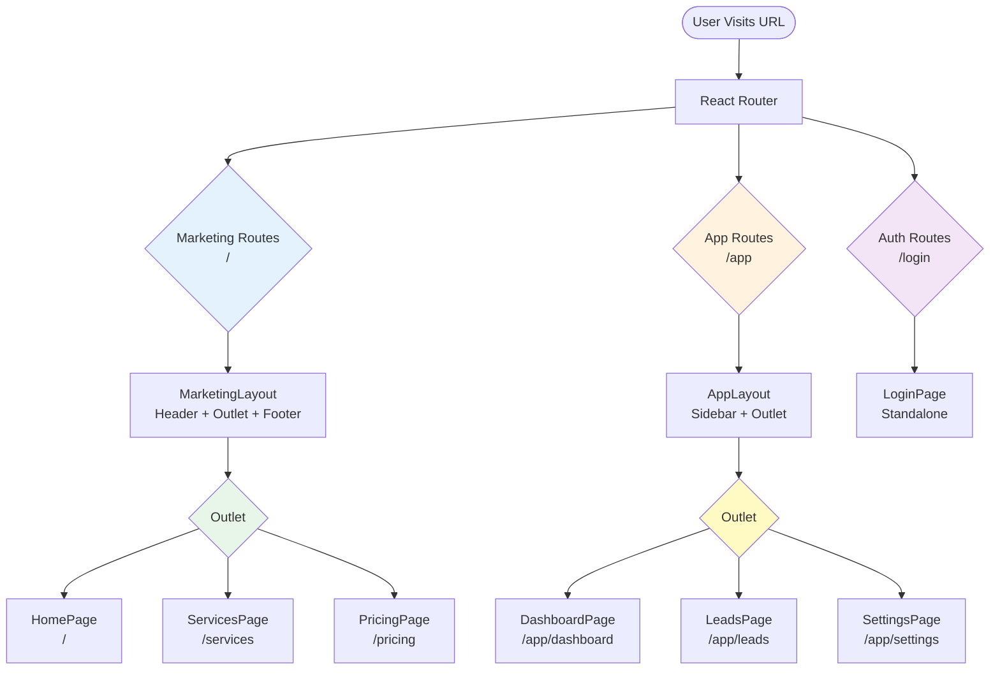
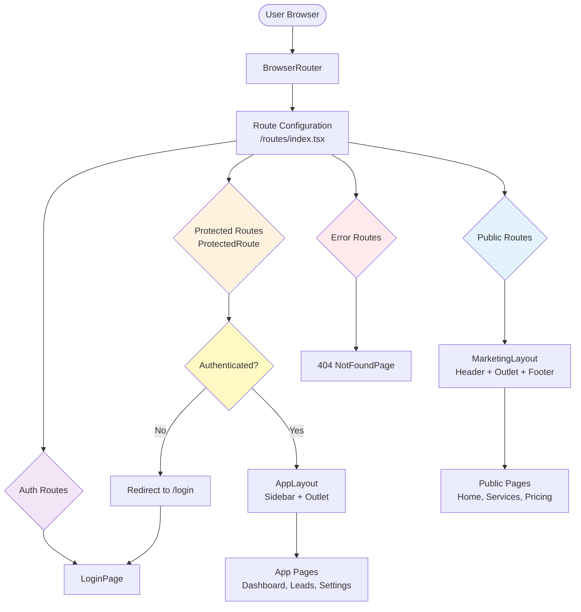
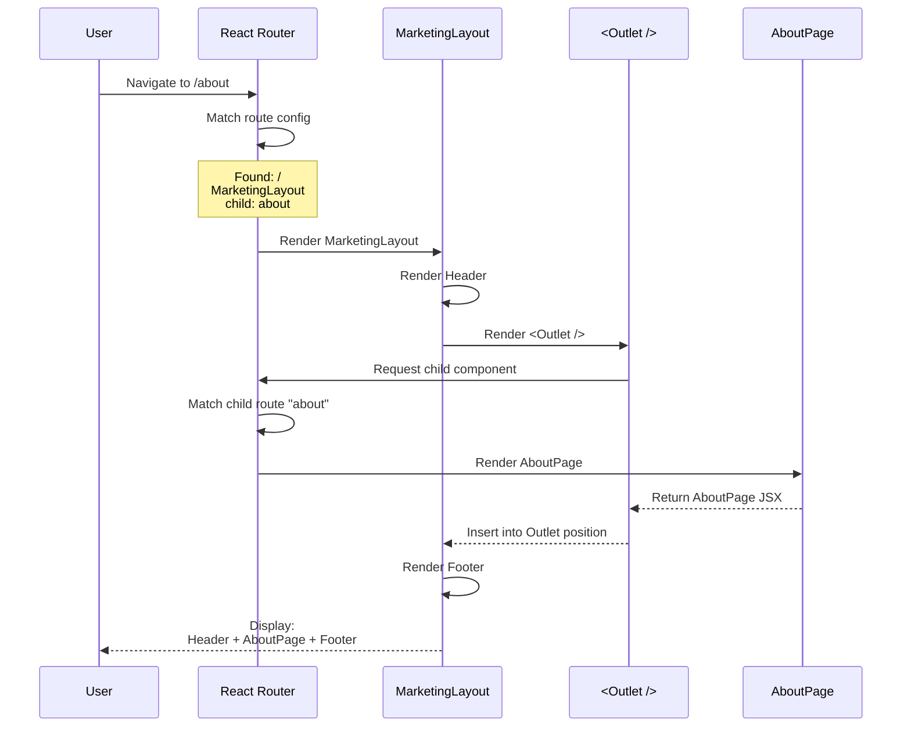

# Routing & Application Structure Best Practices

**Version:** 1.0.0  
**Last Updated:** December 20, 2025  
**Target:** Vite + React + React Router v6  
**Status:** Production Reference

---

## 1. Executive Summary

### What This Document Is

This is the **authoritative reference** for routing architecture and application structure in our Vite + React + React Router v6 codebase. It defines non-negotiable principles, folder organization, navigation patterns, and production requirements.

### When to Use It

- **Before** starting any routing work
- **During** code reviews involving navigation or routing
- **When** debugging routing issues
- **To onboard** new team members
- **As reference** for architectural decisions

### What Problems It Prevents

- State-based navigation anti-patterns
- Duplicate page components
- Router logic spreading into UI components
- Production routing failures (404s, refresh breaks)
- Unmaintainable route configurations
- Performance issues from improper lazy loading
- Infinite redirect loops
- Broken browser navigation (back/forward)

**If you follow this document, your routing will be scalable, testable, and production-safe.**

---

## 2. Routing Principles (Non-Negotiable Rules)

### Rule 1: URL-Based Routing Only

**Rule:** URLs are the single source of truth for application state and navigation.

**Why:** URLs are shareable, bookmarkable, and crawlable. State-based navigation breaks all of these.

```tsx
// ❌ NEVER: State-based navigation
const [currentPage, setCurrentPage] = useState('dashboard');
{currentPage === 'dashboard' && <Dashboard />}

// ✅ ALWAYS: URL-based navigation
<Route path="/app/dashboard" element={<Dashboard />} />
```

---

### Rule 2: One Source of Truth for Routes

**Rule:** All routes must be defined in a single configuration file.

**Location:** `/src/routes/index.tsx`

**Why:** Prevents duplicate route definitions, makes refactoring safe, enables route analysis.

```tsx
// ✅ CORRECT: Single route config
export const routes: RouteObject[] = [
  { path: '/', element: <HomePage /> },
  { path: '/about', element: <AboutPage /> },
];
```

---

### Rule 3: Layout Routes + `<Outlet />`

**Rule:** Use layout routes for shared UI (headers, sidebars, footers).

**Why:** Prevents code duplication, enables proper nesting, improves performance.

```tsx
// ✅ CORRECT: Layout route pattern
{
  path: '/app',
  element: <AppLayout />,  // Shared layout
  children: [
    { path: 'dashboard', element: <Dashboard /> },  // Renders in <Outlet />
    { path: 'leads', element: <Leads /> },
  ]
}
```

---

### Rule 4: Router Hooks Only in Routing Layer

**Rule:** `useNavigate`, `useLocation`, `useParams` are only allowed in:
- Route wrappers (`/src/routes/**/*Route.tsx`)
- Layout components (`/src/layouts/*.tsx`)
- Navigation components (sidebars, headers)

**Never in:**
- UI components (`/src/components/**/*.tsx`)
- Hooks (`/src/hooks/**/*.ts`)
- Utils (`/src/utils/**/*.ts`)

**Why:** Keeps UI components testable, reusable, and router-agnostic.

```tsx
// ❌ WRONG: Router hook in UI component
export function Button() {
  const navigate = useNavigate(); // ❌
  return <button onClick={() => navigate('/page')}>Click</button>;
}

// ✅ CORRECT: Callback prop
export function Button({ onClick }: { onClick: () => void }) {
  return <button onClick={onClick}>Click</button>;
}

// Route wrapper handles navigation
export default function ButtonRoute() {
  const navigate = useNavigate(); // ✅ OK here
  return <Button onClick={() => navigate('/page')} />;
}
```

---

### Rule 5: Navigation via `useNavigate`, Not State Callbacks

**Rule:** Navigation must use `navigate()` from `useNavigate()`, not state setters.

```tsx
// ❌ WRONG: State-based navigation callbacks
function App() {
  const [page, setPage] = useState('home');
  return <Layout onNavigate={setPage} />;
}

// ✅ CORRECT: URL-based navigation
function AppLayout() {
  const navigate = useNavigate();
  return <Layout onNavigate={(page) => navigate(`/${page}`)} />;
}
```

---

### Rule 6: SPA Fallback Required in Production

**Rule:** Production deployments must redirect all requests to `index.html`.

**Why:** Direct URL access (e.g., `yoursite.com/about`) must work, not 404.

**Platform-specific configs provided in Section 8.**

---

### Rule 7: Explicit Route Imports

**Rule:** Use explicit imports for route configurations.

```tsx
// ❌ AVOID: Implicit resolution
import { routes } from './routes';

// ✅ CORRECT: Explicit import
import { routes } from './routes/index';
```

---

### Rule 8: Safe Lazy Loading

**Rule:** All lazy-loaded components must use default exports or a safe lazy helper.

```tsx
// ❌ WRONG: Named export won't work
export function HomePage() { ... }
const HomePage = lazy(() => import('./HomePage')); // Crash

// ✅ CORRECT: Default export
export default function HomePage() { ... }
const HomePage = lazy(() => import('./HomePage'));

// ✅ CORRECT: Safe helper for named exports
const HomePage = safeLazy(() => import('./HomePage'), 'HomePage');
```

---

## 3. Recommended Folder Structure

### Canonical Structure

```
src/
├── routes/                          # Route configuration + route wrappers
│   ├── index.tsx                    # Main route config (single source of truth)
│   ├── paths.ts                     # Route constants (ROUTES.HOME, etc.)
│   ├── marketing/                   # Public route wrappers
│   │   ├── HomeRoute.tsx
│   │   ├── ServicesRoute.tsx
│   │   └── PricingRoute.tsx
│   ├── app/                         # Protected route wrappers
│   │   ├── DashboardRoute.tsx
│   │   └── LeadsRoute.tsx
│   └── auth/                        # Auth route wrappers
│       └── LoginRoute.tsx
├── layouts/                         # Layout routes with <Outlet />
│   ├── MarketingLayout.tsx          # Public pages layout
│   ├── AppLayout.tsx                # Protected app layout
│   └── WizardLayout.tsx             # Focused flow layout
├── components/                      # Pure UI components (router-agnostic)
│   ├── premium/                     # Existing UI components
│   ├── crm/                         # Dashboard UI components
│   └── shared/                      # Reusable UI components
├── hooks/                           # Shared hooks (NO router hooks here)
│   ├── useLeads.ts
│   └── useAuth.ts
├── context/                         # React context providers
│   ├── AuthContext.tsx
│   └── LeadContext.tsx
├── constants/                       # App constants
│   └── routes.ts                    # Exported as ROUTES
├── utils/                           # Utility functions
├── types/                           # TypeScript types
└── App.tsx                          # Root component
```

---

### Folder Responsibilities

#### `/routes/`
**Purpose:** Route configuration and route wrappers.

**What goes here:**
- Route configuration (`index.tsx`)
- Route wrappers that compose UI components with navigation logic
- Route constants (`paths.ts`)

**What does NOT go here:**
- UI component implementations
- Business logic
- API calls

**Example:**
```tsx
// /routes/marketing/HomeRoute.tsx
import { useNavigate } from 'react-router-dom';
import { HomePageV7 } from '../../components/premium/HomePageV7';

export default function HomeRoute() {
  const navigate = useNavigate();
  
  return (
    <HomePageV7 
      onNavigate={(page) => navigate(`/${page}`)}
    />
  );
}
```

---

#### `/layouts/`
**Purpose:** Layout components that wrap child routes.

**What goes here:**
- Components with `<Outlet />`
- Shared UI (headers, footers, sidebars)
- Layout-level navigation logic

**What does NOT go here:**
- Page content
- Business logic
- Complex state management

**Example:**
```tsx
// /layouts/MarketingLayout.tsx
import { Outlet } from 'react-router-dom';
import { Header } from '../components/Header';
import { Footer } from '../components/Footer';

export function MarketingLayout() {
  return (
    <>
      <Header />
      <Outlet /> {/* Child routes render here */}
      <Footer />
    </>
  );
}
```

---

#### `/components/`
**Purpose:** Pure UI components, router-agnostic, testable in isolation.

**What goes here:**
- UI components that accept props (including callbacks)
- Reusable components
- Form components
- Display components

**What does NOT go here:**
- `useNavigate()`, `useLocation()`, `useParams()`
- Route definitions
- Direct navigation logic

**Golden Rule:** If you need to mock a router to test it, it's in the wrong place.

---

#### `/hooks/`
**Purpose:** Shared custom hooks (NOT router hooks).

**What goes here:**
- Business logic hooks (`useLeads`, `useAuth`)
- Data fetching hooks
- Form state hooks

**What does NOT go here:**
- Router hooks (`useNavigate`, etc.)
- Navigation logic

---

#### `/constants/routes.ts`
**Purpose:** Centralized route path constants.

**Why:** Prevents typos, enables refactoring, makes routes searchable.

```tsx
// /constants/routes.ts
export const ROUTES = {
  HOME: '/',
  ABOUT: '/about',
  SERVICES: '/services',
  SERVICE_DETAIL: (slug: string) => `/services/${slug}`,
  
  APP_DASHBOARD: '/app/dashboard',
  APP_LEADS: '/app/leads',
  APP_LEAD_DETAIL: (id: string) => `/app/leads/${id}`,
  
  WIZARD: '/wizard',
  WIZARD_STEP: (step: number) => `/wizard/${step}`,
  
  LOGIN: '/login',
} as const;

// Usage:
navigate(ROUTES.APP_DASHBOARD);
navigate(ROUTES.SERVICE_DETAIL('ai-chatbots'));
```

---

## 4. Route Types & Responsibilities

### Public Marketing Routes

**Purpose:** Public-facing pages accessible to all users.

**Examples:** Home, Services, Pricing, Case Studies, Contact

**Characteristics:**
- No authentication required
- SEO optimized (meta tags, sitemap)
- Fast initial load
- Shareable URLs

**Layout:** `MarketingLayout`

**Allowed Dependencies:**
- UI components
- Public data
- No auth context

**Common Mistakes:**
- Putting auth checks in public routes
- Loading protected data
- Slow lazy loading

---

### Wizard / Focused Flows

**Purpose:** Step-based user journeys with clear progression.

**Examples:** Onboarding wizard, brief creation, multi-step forms

**Characteristics:**
- Step-based URLs (`/wizard/1`, `/wizard/2`)
- Progress indicator
- Save & resume capability
- Step validation (can't skip ahead)

**Layout:** `WizardLayout` (minimal, focused)

**Allowed Dependencies:**
- Step-specific components
- Form state management
- LocalStorage for draft saving

**Common Mistakes:**
- Using state for steps instead of URL
- Not preserving data on refresh
- Allowing step skipping

---

### Protected App Routes

**Purpose:** Authenticated user dashboard and app features.

**Examples:** Dashboard, Leads, Settings, Operations

**Characteristics:**
- Requires authentication
- Protected by `ProtectedRoute` component
- Rich interactivity
- Deep linking support

**Layout:** `AppLayout` (sidebar, header)

**Allowed Dependencies:**
- Auth context
- User-specific data
- Protected APIs

**Common Mistakes:**
- Not redirecting to login
- Not preserving intended destination
- Broken breadcrumbs

---

### Auth Routes

**Purpose:** Authentication flows (login, signup, password reset).

**Examples:** Login, Register, Forgot Password

**Characteristics:**
- Public (not protected)
- Redirect after success
- Preserve intended destination
- Simple layout

**Layout:** Standalone or `AuthLayout` (minimal)

**Allowed Dependencies:**
- Auth context
- Auth API

**Common Mistakes:**
- Protecting login page (infinite redirect)
- Not preserving `location.state.from`
- Broken redirect logic

---

### Utility Routes

**Purpose:** Admin, developer, or utility pages.

**Examples:** Style guide, deck editor, debug panel

**Characteristics:**
- Not in production sitemap
- May be feature-flagged
- Minimal SEO concern

**Layout:** Varies

**Allowed Dependencies:**
- Development tools
- Admin-only data

---

### Error Routes

**Purpose:** Handle invalid URLs and errors.

**Examples:** 404 Not Found, Error Boundary fallbacks

**Characteristics:**
- Catch-all route (`*`)
- Recovery actions (Go Home, Go Back)
- Helpful suggestions
- Error logging

**Layout:** Standalone

**Allowed Dependencies:**
- Error logging service
- Navigation helpers

**Common Mistakes:**
- Missing catch-all route
- No recovery options
- Poor UX messaging

---

## 5. Layout Routing Pattern

### Concept

Layout routes wrap multiple child routes with shared UI (headers, sidebars, footers). Child routes render inside `<Outlet />`.

### Structure

```tsx
// Route configuration
{
  path: '/',
  element: <MarketingLayout />,  // Parent
  children: [
    { path: '', element: <HomePage /> },      // Child
    { path: 'about', element: <AboutPage /> }, // Child
  ]
}

// MarketingLayout.tsx
export function MarketingLayout() {
  return (
    <div>
      <Header />
      <Outlet />  {/* Children render here */}
      <Footer />
    </div>
  );
}
```

### How It Works

1. User navigates to `/about`
2. Router matches parent route (`/`)
3. Router renders `<MarketingLayout />`
4. Router finds matching child route (`about`)
5. Router renders `<AboutPage />` inside `<Outlet />`
6. Result: Header + AboutPage + Footer

---

### Mermaid Diagram: Layout Routing Architecture



---

### Multiple Layout Levels

You can nest layouts for more granular control:

```tsx
{
  path: '/app',
  element: <AppLayout />,  // Level 1: Sidebar
  children: [
    { path: 'dashboard', element: <Dashboard /> },
    {
      path: 'intelligence',
      element: <IntelligenceLayout />,  // Level 2: Sub-nav
      children: [
        { path: 'upload', element: <Upload /> },
        { path: 'analysis', element: <Analysis /> },
      ]
    }
  ]
}
```

---

## 6. Navigation Rules

### Where `useNavigate()` Is Allowed

**Allowed:**
- Route wrappers (`/routes/**/*Route.tsx`)
- Layout components (`/layouts/*.tsx`)
- Navigation components (sidebars, headers, breadcrumbs)

**Not Allowed:**
- UI components (`/components/**`)
- Hooks (`/hooks/**`)
- Utils (`/utils/**`)
- Context providers (use redirect logic instead)

---

### How Callbacks Should Map to Routes

**Pattern:**

```tsx
// Route Wrapper (routing layer)
export default function PageRoute() {
  const navigate = useNavigate();
  
  const handleAction = () => {
    navigate(ROUTES.APP_DASHBOARD);
  };
  
  return <PageComponent onAction={handleAction} />;
}

// UI Component (UI layer)
interface PageComponentProps {
  onAction: () => void; // Callback, not navigation
}

export function PageComponent({ onAction }: PageComponentProps) {
  return <button onClick={onAction}>Go to Dashboard</button>;
}
```

**Why:** UI component doesn't know about routes. Route wrapper handles all navigation logic.

---

### Route Constants Best Practice

**Always use constants:**

```tsx
// ❌ BAD: Hardcoded strings everywhere
navigate('/app/dashboard');
navigate('/app/dashboard'); // Typo risk
<Link to="/app/dashboard">Dashboard</Link>

// ✅ GOOD: Centralized constants
import { ROUTES } from '../constants/routes';

navigate(ROUTES.APP_DASHBOARD);
<Link to={ROUTES.APP_DASHBOARD}>Dashboard</Link>
```

**Benefits:**
- Single source of truth
- Refactoring is safe (change once)
- TypeScript autocomplete
- Prevents typos
- Easy to search (`Cmd+F "ROUTES.APP_DASHBOARD"`)

---

### Good vs Bad Examples

#### Example 1: Button Navigation

```tsx
// ❌ BAD: Router hook in UI component
export function SubmitButton() {
  const navigate = useNavigate(); // ❌ Wrong layer
  
  return (
    <button onClick={() => navigate('/success')}>
      Submit
    </button>
  );
}

// ✅ GOOD: Callback prop
interface SubmitButtonProps {
  onSubmit: () => void;
}

export function SubmitButton({ onSubmit }: SubmitButtonProps) {
  return <button onClick={onSubmit}>Submit</button>;
}

// Route wrapper
export default function FormRoute() {
  const navigate = useNavigate(); // ✅ Correct layer
  
  return (
    <Form 
      submitButton={
        <SubmitButton onSubmit={() => navigate(ROUTES.SUCCESS)} />
      }
    />
  );
}
```

---

#### Example 2: Sidebar Navigation

```tsx
// ✅ GOOD: Navigation component using router hooks
export function Sidebar() {
  const navigate = useNavigate(); // ✅ OK in nav component
  const location = useLocation();
  
  const items = [
    { label: 'Dashboard', path: ROUTES.APP_DASHBOARD },
    { label: 'Leads', path: ROUTES.APP_LEADS },
  ];
  
  return (
    <nav>
      {items.map(item => (
        <button
          key={item.path}
          onClick={() => navigate(item.path)}
          className={location.pathname === item.path ? 'active' : ''}
        >
          {item.label}
        </button>
      ))}
    </nav>
  );
}
```

---

## 7. Lazy Loading & Suspense Strategy

### Where Suspense Is Allowed

**Choose ONE strategy** for your app:

**Option A: App-level Suspense (simpler)**
```tsx
// App.tsx
<Suspense fallback={<GlobalLoading />}>
  <AppRoutes />
</Suspense>

// Layouts (no Suspense)
<Outlet />
```

**Option B: Layout-level Suspense (more control)**
```tsx
// App.tsx (no Suspense)
<AppRoutes />

// Each layout
<Suspense fallback={<LayoutLoading />}>
  <Outlet />
</Suspense>
```

**❌ NEVER: Both (causes double loading states)**
```tsx
// ❌ BAD
<Suspense fallback={<A />}>
  <Layout>
    <Suspense fallback={<B />}>  {/* Duplicate */}
      <Outlet />
    </Suspense>
  </Layout>
</Suspense>
```

**Recommendation:** Use Option B (layout-level) for better control per section.

---

### How to Safely Lazy-Load Route Components

#### Rule: Default Exports Only

```tsx
// Component file
export default function HomePage() { // ✅ Default export
  return <div>Home</div>;
}

// Route config
const HomePage = lazy(() => import('./HomePage')); // ✅ Works
```

---

#### Safe Helper for Named Exports

If you have existing named exports:

```tsx
// safeLazy.ts
import { lazy, ComponentType } from 'react';

export function safeLazy<T extends ComponentType<any>>(
  importFn: () => Promise<{ default: T } | { [key: string]: T }>,
  exportName?: string
) {
  return lazy(async () => {
    const module = await importFn();
    
    // Try default export first
    if ('default' in module) {
      return { default: module.default };
    }
    
    // Try named export
    if (exportName && exportName in module) {
      return { default: (module as any)[exportName] };
    }
    
    // Fallback to first export
    const firstExport = Object.values(module)[0];
    return { default: firstExport as T };
  });
}

// Usage:
const HomePage = safeLazy(() => import('./HomePage'), 'HomePage');
```

---

### What Causes Runtime Crashes

**Common Crash Scenarios:**

1. **Named export without mapping:**
   ```tsx
   // Component: export function HomePage() { ... }
   const HomePage = lazy(() => import('./HomePage')); // ❌ Crash
   ```

2. **Missing Suspense boundary:**
   ```tsx
   const HomePage = lazy(() => import('./HomePage'));
   <HomePage /> // ❌ Crash (no Suspense)
   ```

3. **Wrong import path:**
   ```tsx
   const HomePage = lazy(() => import('./WrongPath')); // ❌ Crash
   ```

---

### Lazy Loading Checklist

- [ ] Component uses default export OR safeLazy helper
- [ ] Suspense boundary exists (app or layout level)
- [ ] Import path is correct
- [ ] No duplicate Suspense boundaries
- [ ] Loading fallback is meaningful
- [ ] Tested with slow 3G throttling

---

## 8. Deployment & Production Rules

### Why SPA Fallbacks Are Required

**Problem:** Direct URL access to `/about` results in HTTP 404.

**Why:** Server looks for `/about/index.html` file, which doesn't exist.

**Solution:** Redirect all requests to `index.html`, let React Router handle routing.

---

### Platform-Specific Configurations

#### Vite Local Dev

**Automatic.** Vite dev server handles SPA routing by default.

---

#### Vercel

**File:** `vercel.json` (project root)

```json
{
  "rewrites": [
    { "source": "/(.*)", "destination": "/index.html" }
  ]
}
```

**Why:** Rewrites preserve the URL while serving index.html.

---

#### Netlify

**File:** `_redirects` (in `/public` folder)

```
/*    /index.html   200
```

**Why:** 200 status code preserves the URL (not a 301 redirect).

**Alternative:** `netlify.toml`

```toml
[[redirects]]
  from = "/*"
  to = "/index.html"
  status = 200
```

---

#### Cloudflare Pages

**File:** `_redirects` (in `/public` folder)

```
/*    /index.html   200
```

**Same as Netlify.**

---

#### Nginx

**File:** `/etc/nginx/sites-available/yoursite`

```nginx
server {
  listen 80;
  server_name yoursite.com;
  
  root /var/www/yoursite/dist;
  index index.html;
  
  location / {
    try_files $uri $uri/ /index.html;
  }
}
```

**Explanation:**
- `try_files $uri` → Try exact file
- `$uri/` → Try directory
- `/index.html` → Fallback to SPA

---

#### Apache

**File:** `.htaccess` (in `/dist` or `/public`)

```apache
<IfModule mod_rewrite.c>
  RewriteEngine On
  RewriteBase /
  RewriteRule ^index\.html$ - [L]
  RewriteCond %{REQUEST_FILENAME} !-f
  RewriteCond %{REQUEST_FILENAME} !-d
  RewriteRule . /index.html [L]
</IfModule>
```

**Explanation:**
- If not a file (`!-f`) and not a directory (`!-d`)
- Serve `index.html`

---

### What Breaks If Missing

| Scenario | Without Fallback | With Fallback |
|----------|------------------|---------------|
| Click link to `/about` | ✅ Works | ✅ Works |
| Paste `yoursite.com/about` in browser | ❌ 404 | ✅ Works |
| Refresh on `/about` | ❌ 404 | ✅ Works |
| Share link to `/services/ai-chatbots` | ❌ 404 | ✅ Works |
| Bookmark `/app/leads/123` | ❌ 404 | ✅ Works |

**Without SPA fallback, only homepage works.**

---

## 9. Common Anti-Patterns (DO NOT DO)

### Anti-Pattern 1: State-Based Navigation

**What:**
```tsx
const [currentPage, setCurrentPage] = useState('home');

return (
  <>
    {currentPage === 'home' && <HomePage />}
    {currentPage === 'about' && <AboutPage />}
  </>
);
```

**Why It's Bad:**
- URL never changes (always `/`)
- Cannot share links
- Cannot bookmark pages
- No browser history
- SEO impossible

**Real Failure:**
- User clicks "About" → sees About page
- User refreshes → back to home page (lost state)
- User can't share "About" link with colleague

**Fix:** Use URL-based routing (React Router).

---

### Anti-Pattern 2: Duplicate Page Components

**What:**
```tsx
// /components/premium/HomePageV7.tsx exists
// But you also create:
// /pages/HomePage.tsx

export function HomePage() {
  return <div>New home page</div>;
}
```

**Why It's Bad:**
- Two sources of truth
- Which one is correct?
- Imports get confused
- Merge conflicts
- Maintenance nightmare

**Real Failure:**
- Dev A updates `HomePageV7`
- Dev B imports `HomePage` from `/pages`
- Production shows wrong version

**Fix:** Create route wrappers, not duplicate components.

```tsx
// /routes/marketing/HomeRoute.tsx
import { HomePageV7 } from '../../components/premium/HomePageV7';

export default function HomeRoute() {
  return <HomePageV7 />;
}
```

---

### Anti-Pattern 3: Router Hooks Inside UI Components

**What:**
```tsx
// /components/Button.tsx
import { useNavigate } from 'react-router-dom';

export function Button() {
  const navigate = useNavigate(); // ❌
  return <button onClick={() => navigate('/page')}>Click</button>;
}
```

**Why It's Bad:**
- Component requires router context (can't use outside router)
- Harder to test (need router mocks)
- Tight coupling
- Can't reuse in Storybook, tests, or non-routed contexts

**Real Failure:**
- Want to use `<Button />` in Storybook
- Crashes: "useNavigate must be used within a Router"
- Have to mock router for every story

**Fix:** Use callback props.

```tsx
export function Button({ onClick }: { onClick: () => void }) {
  return <button onClick={onClick}>Click</button>;
}
```

---

### Anti-Pattern 4: Hardcoded URLs Everywhere

**What:**
```tsx
navigate('/app/dashboard');
navigate('/app/dashbaord'); // Typo
<Link to="/app/dashboard">Go</Link>
```

**Why It's Bad:**
- Typos cause bugs
- Refactoring routes requires searching entire codebase
- No single source of truth

**Real Failure:**
- Need to change `/app/dashboard` to `/dashboard`
- Find 47 hardcoded instances across codebase
- Miss 3 instances → broken links in production

**Fix:** Use route constants.

```tsx
// constants/routes.ts
export const ROUTES = {
  APP_DASHBOARD: '/app/dashboard',
};

// Usage
navigate(ROUTES.APP_DASHBOARD);
<Link to={ROUTES.APP_DASHBOARD}>Go</Link>

// Refactor: change one place, works everywhere
```

---

### Anti-Pattern 5: Multiple Suspense Boundaries

**What:**
```tsx
// App.tsx
<Suspense fallback={<LoadingA />}>
  <AppRoutes />
</Suspense>

// Layout.tsx
<Suspense fallback={<LoadingB />}> {/* Duplicate */}
  <Outlet />
</Suspense>
```

**Why It's Bad:**
- Double loading states (flash)
- Nested fallbacks confuse users
- Performance overhead

**Real Failure:**
- User navigates to `/about`
- Sees `<LoadingA />` for 100ms
- Then sees `<LoadingB />` for 100ms
- Then sees actual page
- Looks janky

**Fix:** Choose ONE Suspense location (app or layout level).

---

### Anti-Pattern 6: Missing Catch-All Route

**What:**
```tsx
// No catch-all route defined
export const routes = [
  { path: '/', element: <Home /> },
  { path: '/about', element: <About /> },
  // Missing: { path: '*', element: <NotFound /> }
];
```

**Why It's Bad:**
- Invalid URLs show blank screen
- No 404 page
- Users get confused
- Looks broken

**Real Failure:**
- User types `yoursite.com/invalid`
- Sees blank white screen
- No error, no message, no recovery
- Looks like site is down

**Fix:** Add catch-all route.

```tsx
{
  path: '*',
  element: <NotFoundPage />,
}
```

---

### Anti-Pattern 7: Redirect Loops

**What:**
```tsx
{ path: '/app', element: <Navigate to="/app/dashboard" /> },
{ path: '/app/dashboard', element: <Navigate to="/app" /> },
```

**Why It's Bad:**
- Infinite loop
- Browser hangs
- Site unusable

**Real Failure:**
- User visits `/app`
- Redirects to `/app/dashboard`
- Redirects back to `/app`
- Infinite loop → browser crashes

**Fix:** Ensure redirect destination is terminal (not another redirect).

```tsx
{ path: '/app', element: <Navigate to="/app/dashboard" replace /> },
{ path: '/app/dashboard', element: <Dashboard /> }, // ✅ Terminal
```

---

### Anti-Pattern 8: Empty Navigation Callbacks

**What:**
```tsx
<AdminLayout
  activePage="dashboard"
  onNavigate={() => {}} // ❌ Does nothing
/>
```

**Why It's Bad:**
- Sidebar clicks don't work
- Navigation broken
- Looks like bug

**Real Failure:**
- User clicks "Leads" in sidebar
- Nothing happens
- Tries again → still nothing
- Thinks site is broken

**Fix:** Implement real navigation handler.

```tsx
const navigate = useNavigate();

<AdminLayout
  activePage={derivedFromURL}
  onNavigate={(page) => navigate(ROUTES[page])}
/>
```

---

## 10. Mermaid Diagrams

### Diagram 1: Global Routing Architecture



---

### Diagram 2: Layout + Outlet Rendering Flow



---

### Diagram 3: User Journey (Marketing → Wizard → App)

```mermaid
flowchart LR
    Start([User Lands<br/>yoursite.com]) --> Home[Homepage<br/>/<br/>MarketingLayout]
    
    Home --> Services[Services Page<br/>/services<br/>MarketingLayout]
    
    Services --> Wizard1[Wizard Step 1<br/>/wizard/1<br/>WizardLayout]
    
    Wizard1 --> Wizard2[Step 2<br/>/wizard/2]
    Wizard2 --> Wizard3[Step 3<br/>/wizard/3]
    Wizard3 --> Processing[Processing<br/>/wizard/processing]
    
    Processing --> Complete[Complete<br/>/wizard/complete]
    
    Complete --> Choice{User Choice}
    
    Choice -->|View Dashboard| Dashboard[Dashboard<br/>/app/dashboard<br/>AppLayout]
    Choice -->|Book Call| Booking[Booking<br/>/booking<br/>MarketingLayout]
    
    Dashboard --> Leads[Leads<br/>/app/leads<br/>AppLayout]
    Leads --> LeadDetail[Lead Detail<br/>/app/leads/123<br/>AppLayout]
    
    style Home fill:#e3f2fd
    style Services fill:#e3f2fd
    style Wizard1 fill:#f3e5f5
    style Wizard2 fill:#f3e5f5
    style Wizard3 fill:#f3e5f5
    style Dashboard fill:#fff3e0
    style Leads fill:#fff3e0
    style LeadDetail fill:#fff3e0
```



---

## 11. Production Readiness Checklist

### Pre-Launch Validation

**Run this checklist before deploying routing changes:**

#### Routing
- [ ] All routes defined in `/src/routes/index.tsx`
- [ ] Catch-all route (`*`) exists for 404
- [ ] No hardcoded URLs (use ROUTES constants)
- [ ] All lazy-loaded components use default export or safeLazy
- [ ] No duplicate route definitions

#### Navigation
- [ ] Browser back button works
- [ ] Browser forward button works
- [ ] Sidebar navigation updates URL
- [ ] Active nav states reflect current URL
- [ ] All CTAs navigate to correct routes

#### Refresh Behavior
- [ ] Refresh on any route preserves current page
- [ ] No loss of data on refresh (if intended to persist)
- [ ] No redirect to home on refresh

#### Direct URL Access
- [ ] Can paste `/about` in browser → loads About page
- [ ] Can paste `/app/leads/123` → loads lead detail (if authenticated)
- [ ] Can paste wizard step URL → resumes at step (if allowed)
- [ ] Invalid URLs show 404 page (not blank screen)

#### 404 Handling
- [ ] 404 page exists and renders
- [ ] 404 page has recovery options (Go Home, Go Back)
- [ ] Invalid dynamic params redirect gracefully (e.g., `/leads/fake-id`)

#### Deployment Config
- [ ] SPA fallback configured for your platform
- [ ] Tested direct URL access in staging/production
- [ ] Verified refresh works in staging/production

#### Protected Routes
- [ ] Unauthenticated users redirect to `/login`
- [ ] Intended destination preserved (`location.state.from`)
- [ ] After login, redirect to intended destination
- [ ] Protected routes validate auth (not just client-side check)

#### Performance
- [ ] Code splitting implemented (lazy loading)
- [ ] Suspense boundary in place
- [ ] No duplicate Suspense boundaries
- [ ] Route transition <300ms
- [ ] Initial load <2s

#### SEO (for public routes)
- [ ] All public routes have unique `<title>`
- [ ] All public routes have meta descriptions
- [ ] Canonical URLs set
- [ ] sitemap.xml includes all public routes
- [ ] robots.txt configured

#### Testing
- [ ] Automated route tests exist
- [ ] Manual QA completed on all routes
- [ ] Browser compatibility verified (Chrome, Firefox, Safari)
- [ ] Mobile responsive navigation tested

---

## 12. Final Guidance

### When to Revisit This Document

**Review this document when:**
- Starting new routing work
- Onboarding new team members
- Debugging routing issues
- Before major refactors
- After React Router upgrades
- Quarterly architecture reviews

---

### How to Evolve Routing Safely

**Safe Evolution Process:**

1. **Propose change** in architecture review
2. **Update this document** with new pattern
3. **Create example implementation**
4. **Add to checklist** if it's a new requirement
5. **Communicate** to team
6. **Refactor** existing code incrementally

**Never:**
- Make routing changes without team review
- Introduce new patterns without documenting
- Break existing contracts (e.g., route constants)

---

### Who Owns Routing Decisions

**Routing Architecture is owned by:**
- Frontend Lead
- Senior Engineers
- Product Architecture Team

**Changes require:**
- PR review by frontend lead
- Update to this document
- Team communication
- Example implementation

**Small changes** (adding one route): Standard PR review  
**Large changes** (new routing pattern): Architecture review meeting

---

### Document Maintenance

**This document should be:**
- Updated when routing patterns change
- Reviewed quarterly
- Kept in sync with codebase
- Used in code reviews
- Referenced in PRs

**Version History:**

| Version | Date | Changes | Author |
|---------|------|---------|--------|
| 1.0.0 | Dec 20, 2025 | Initial best practices | Product Architecture |

---

**This is a living document. Keep it updated. Follow it strictly. Your routing will be production-ready.**
