# Routing & Structure Troubleshooting Guide

**Version:** 1.0.0  
**Last Updated:** December 20, 2025  
**Target:** Vite + React + React Router v6  
**Purpose:** Production Incident Response

---

## 1. How to Use This Guide

### Quick Response Protocol

1. **Identify symptom** → Use Section 2 (Symptoms Index)
2. **Jump to relevant section** → Follow "Where to Look"
3. **Apply fix** → Follow step-by-step instructions
4. **Verify** → Test the specific scenario
5. **Document** → Add notes to incident log

---

### Scan Order (Top to Bottom)

When debugging unknown routing issues:

1. **Router Level** (Section 3) → Is router mounted? Routes defined?
2. **Layout Level** (Section 4) → Is `<Outlet />` present?
3. **Lazy Loading** (Section 5) → Are imports correct?
4. **Navigation** (Section 6) → Are callbacks working?
5. **Deployment** (Section 9) → Is SPA fallback configured?

---

### Under Pressure

**If incident is critical:**
1. Check Section 2 (Symptoms Index) for quick match
2. Apply "Quick Fix" immediately
3. Read "Root Cause" later for permanent solution

**If unsure:**
- Run Section 10 (Debugging Checklist) top-to-bottom
- Document what you find
- Escalate if unresolved after 30 minutes

---

## 2. Critical Symptoms Index (Quick Lookup)

| Symptom | Likely Cause | Where to Look | Fix Summary |
|---------|--------------|---------------|-------------|
| Blank screen on route change | Missing `<Outlet />` | Section 4 | Add `<Outlet />` to layout |
| URL changes but page doesn't render | Wrong route config | Section 3 | Check route path matches URL |
| Page works on refresh but not navigation | State not derived from URL | Section 6 | Use `useLocation()` not state |
| Route works locally but 404 in production | Missing SPA fallback | Section 9 | Add platform-specific config |
| Sidebar navigation does nothing | Dead `onNavigate` callback | Section 6 | Implement real `navigate()` call |
| Lazy-loaded route crashes | Named export without mapping | Section 5 | Use default export or safeLazy |
| Wizard step reloads to home | Step not in URL | Section 7 | Use URL params for steps |
| Protected route redirects incorrectly | Auth guard logic error | Section 8 | Check `ProtectedRoute` component |
| Infinite redirect loop | Circular redirects | Section 3 | Remove circular Navigate logic |
| Browser back button broken | History API not used | Section 6 | Use `navigate()` not state |
| Flash of wrong content | Duplicate Suspense | Section 5 | Remove nested Suspense |
| 404 on direct URL access | No catch-all route | Section 3 | Add `{ path: '*', element: <NotFound /> }` |
| Routes defined but not rendering | Not wrapped in `<BrowserRouter>` | Section 3 | Wrap App in `<BrowserRouter>` |
| TypeScript error on navigate | Wrong route path | Section 6 | Use ROUTES constants |
| Header/footer duplicating | Outlet in wrong place | Section 4 | Move `<Outlet />` to correct location |
| Active nav state wrong | Not using `useLocation()` | Section 6 | Derive state from URL |
| Can't deep-link to page | Route not defined | Section 3 | Add route to config |
| Protected page flashes then redirects | No loading state | Section 8 | Add loading check before redirect |
| Page renders but data is wrong | Params not read correctly | Section 7 | Use `useParams()` |
| Navigate doesn't work | Used outside router | Section 3 | Check `useNavigate()` placement |

---

## 3. Routing-Level Failures

### Issue: Blank Screen on All Routes

**❌ What breaks:**
Nothing renders. Blank white screen. No console errors.

**🔍 Root cause:**
`<BrowserRouter>` missing or not wrapping app.

**✅ Exact fix:**

```tsx
// App.tsx
import { BrowserRouter } from 'react-router-dom';

// ❌ WRONG:
export default function App() {
  return <AppRoutes />;
}

// ✅ CORRECT:
export default function App() {
  return (
    <BrowserRouter>
      <AppRoutes />
    </BrowserRouter>
  );
}
```

**🧪 How to verify:**
- Check React DevTools
- Should see `<BrowserRouter>` component
- Navigate to any route → should render

---

### Issue: "useNavigate must be used within a Router"

**❌ What breaks:**
Console error. Component crashes.

**🔍 Root cause:**
`useNavigate()`, `useLocation()`, or `useParams()` used outside `<BrowserRouter>`.

**✅ Exact fix:**

Check component hierarchy:
```tsx
// ✅ CORRECT:
<BrowserRouter>
  <Component />  {/* Can use useNavigate here */}
</BrowserRouter>

// ❌ WRONG:
<Component />  {/* useNavigate will crash */}
<BrowserRouter>
  ...
</BrowserRouter>
```

**Common mistake:**
```tsx
// App.tsx
const navigate = useNavigate(); // ❌ WRONG (outside BrowserRouter)

return (
  <BrowserRouter>
    ...
  </BrowserRouter>
);
```

**Fix:**
```tsx
// App.tsx
return (
  <BrowserRouter>
    <InnerApp />  {/* useNavigate INSIDE here */}
  </BrowserRouter>
);
```

**🧪 How to verify:**
- Error should disappear
- Navigation should work

---

### Issue: Route Defined But Not Rendering

**❌ What breaks:**
URL changes to `/about` but nothing renders.

**🔍 Root cause:**
Route path doesn't match URL or route not registered.

**✅ Exact fix:**

Check route configuration:
```tsx
// routes/index.tsx
export const routes = [
  { path: '/', element: <Home /> },
  { path: '/about', element: <About /> },  // ✅ Must match URL
  // ❌ WRONG: { path: 'about', element: <About /> } (missing leading /)
];
```

**Common mistakes:**
- Path mismatch: `/about` vs `about`
- Typo: `/abuot` instead of `/about`
- Route not imported in main config

**🧪 How to verify:**
- Navigate to `/about`
- Check React DevTools → should see `<About />` component

---

### Issue: Infinite Redirect Loop

**❌ What breaks:**
Browser hangs. "Too many redirects" error.

**🔍 Root cause:**
Circular `<Navigate>` components.

**✅ Exact fix:**

Find circular redirects:
```tsx
// ❌ WRONG: Infinite loop
{ path: '/app', element: <Navigate to="/app/dashboard" /> },
{ path: '/app/dashboard', element: <Navigate to="/app" /> },

// ✅ CORRECT: Terminal destination
{ path: '/app', element: <Navigate to="/app/dashboard" replace /> },
{ path: '/app/dashboard', element: <Dashboard /> }, // ✅ Ends here
```

**Debugging:**
1. Open DevTools → Network tab
2. Look for repeated requests to same URL
3. Check route config for circular redirects

**🧪 How to verify:**
- Navigate to `/app`
- Should land on `/app/dashboard` and stop
- No more redirects

---

### Issue: 404 on Valid Routes

**❌ What breaks:**
Navigate to `/about` → shows "Not Found"

**🔍 Root cause:**
Route not in catch-all, or catch-all too early.

**✅ Exact fix:**

Check catch-all placement:
```tsx
// ❌ WRONG: Catch-all too early
export const routes = [
  { path: '*', element: <NotFound /> }, // ❌ Catches everything
  { path: '/', element: <Home /> },
  { path: '/about', element: <About /> },
];

// ✅ CORRECT: Catch-all last
export const routes = [
  { path: '/', element: <Home /> },
  { path: '/about', element: <About /> },
  { path: '*', element: <NotFound /> }, // ✅ Last resort
];
```

**🧪 How to verify:**
- Navigate to `/about` → should render About page
- Navigate to `/invalid` → should show 404

---

### Issue: Basename Not Working

**❌ What breaks:**
App deployed to `yoursite.com/app/` but routes break.

**🔍 Root cause:**
Missing `basename` prop on `<BrowserRouter>`.

**✅ Exact fix:**

```tsx
// If app is at yoursite.com/app/ (subdirectory)
<BrowserRouter basename="/app">
  <AppRoutes />
</BrowserRouter>
```

**How to determine basename:**
- Root domain: no basename needed
- Subdirectory: basename = subdirectory path

**🧪 How to verify:**
- Navigate within app
- URLs should include basename (e.g., `/app/about`)

---

## 4. Layout & Outlet Failures

### Issue: Child Routes Not Appearing

**❌ What breaks:**
Layout renders (header/footer visible) but child route content missing.

**🔍 Root cause:**
Missing `<Outlet />` in layout component.

**✅ Exact fix:**

```tsx
// ❌ WRONG: No Outlet
export function MarketingLayout() {
  return (
    <div>
      <Header />
      {/* Missing <Outlet /> */}
      <Footer />
    </div>
  );
}

// ✅ CORRECT: Outlet present
export function MarketingLayout() {
  return (
    <div>
      <Header />
      <Outlet /> {/* ✅ Child routes render here */}
      <Footer />
    </div>
  );
}
```

**🧪 How to verify:**
- Navigate to child route
- Check React DevTools → should see child component inside layout
- Page content should appear between header and footer

---

### Issue: Header/Footer Duplicating

**❌ What breaks:**
Two headers appear, or header inside header.

**🔍 Root cause:**
`<Outlet />` in wrong location or nested layouts duplicating UI.

**✅ Exact fix:**

Check Outlet placement:
```tsx
// ❌ WRONG: Outlet before header
export function Layout() {
  return (
    <div>
      <Outlet /> {/* ❌ Child might render another header */}
      <Header />
    </div>
  );
}

// ✅ CORRECT: Proper order
export function Layout() {
  return (
    <div>
      <Header />
      <main>
        <Outlet /> {/* ✅ Main content area */}
      </main>
      <Footer />
    </div>
  );
}
```

**🧪 How to verify:**
- Inspect DOM
- Should see ONE header, content, ONE footer

---

### Mermaid: Layout + Outlet Flow

```mermaid
flowchart TD
    Router[React Router] --> MatchParent{Match Parent Route<br/>/}
    
    MatchParent -->|Yes| RenderLayout[Render MarketingLayout]
    
    RenderLayout --> Header[Render Header]
    Header --> Outlet[Encounter Outlet]
    
    Outlet --> MatchChild{Match Child Route<br/>about}
    
    MatchChild -->|Yes| RenderChild[Render AboutPage]
    MatchChild -->|No| RenderNothing[Render nothing<br/>❌ Missing route]
    
    RenderChild --> InsertOutlet[Insert AboutPage<br/>at Outlet location]
    
    InsertOutlet --> Footer[Render Footer]
    
    Footer --> Result[Final DOM:<br/>Header + AboutPage + Footer]
    
    RenderNothing --> FooterBroken[Render Footer]
    FooterBroken --> Broken[Final DOM:<br/>Header + BLANK + Footer<br/>❌ BROKEN]
    
    style Outlet fill:#fff9c4
    style Result fill:#e8f5e9
    style Broken fill:#ffebee
```



---

### Issue: Nested Routes Not Working

**❌ What breaks:**
Route `/app/leads/123` doesn't render.

**🔍 Root cause:**
Parent layout missing `<Outlet />` or route not nested correctly.

**✅ Exact fix:**

Check route nesting:
```tsx
// Route config
{
  path: '/app',
  element: <AppLayout />, // ✅ Must have <Outlet />
  children: [
    { path: 'leads', element: <LeadsLayout /> }, // ✅ Must have <Outlet />
    { path: 'leads/:id', element: <LeadDetail /> },
  ]
}

// AppLayout.tsx
export function AppLayout() {
  return (
    <div>
      <Sidebar />
      <Outlet /> {/* ✅ Required for children */}
    </div>
  );
}

// LeadsLayout.tsx (if used)
export function LeadsLayout() {
  return (
    <div>
      <LeadsSidebar />
      <Outlet /> {/* ✅ Required if this has children */}
    </div>
  );
}
```

**🧪 How to verify:**
- Navigate to `/app/leads/123`
- Check React DevTools component tree
- Should see: AppLayout → LeadDetail

---

## 5. Lazy Loading & Suspense Failures

### Issue: "Element type is invalid"

**❌ What breaks:**
Console error: "Element type is invalid... expected a string... got undefined"

**🔍 Root cause:**
Lazy-loaded component uses named export but `lazy()` expects default.

**✅ Exact fix:**

**Option A: Change to default export**
```tsx
// Component file
// ❌ WRONG:
export function HomePage() { ... }

// ✅ CORRECT:
export default function HomePage() { ... }
```

**Option B: Map named export**
```tsx
// If you can't change component
const HomePage = lazy(() =>
  import('./HomePage').then(m => ({ default: m.HomePage }))
);
```

**Option C: Use safeLazy helper**
```tsx
// Import helper (see Best Practices doc)
import { safeLazy } from './utils/safeLazy';

const HomePage = safeLazy(() => import('./HomePage'), 'HomePage');
```

**🧪 How to verify:**
- Navigate to route
- Component should render without error

---

### Issue: Double Loading Spinners

**❌ What breaks:**
Two loading spinners appear briefly during navigation.

**🔍 Root cause:**
Duplicate `<Suspense>` boundaries (App + Layout level).

**✅ Exact fix:**

Remove duplicate Suspense:
```tsx
// ❌ WRONG: Duplicate Suspense
// App.tsx
<Suspense fallback={<LoadingA />}>
  <AppRoutes />
</Suspense>

// Layout.tsx
<Suspense fallback={<LoadingB />}> {/* ❌ Duplicate */}
  <Outlet />
</Suspense>

// ✅ CORRECT: Single Suspense (choose ONE location)
// App.tsx
<AppRoutes /> {/* No Suspense */}

// Layout.tsx
<Suspense fallback={<Loading />}> {/* ✅ Only here */}
  <Outlet />
</Suspense>
```

**🧪 How to verify:**
- Navigate with slow 3G throttling
- Should see ONE loading state only

---

### Issue: Lazy Import Resolves But Renders Nothing

**❌ What breaks:**
No error, but page is blank.

**🔍 Root cause:**
Import path wrong or module has no exports.

**✅ Exact fix:**

Check import path:
```tsx
// ❌ WRONG: Path doesn't exist
const HomePage = lazy(() => import('./pages/Home')); // No Home.tsx file

// ✅ CORRECT: Path exists
const HomePage = lazy(() => import('./pages/HomePage')); // HomePage.tsx exists
```

**Debugging:**
1. Open browser DevTools → Network tab
2. Look for failed chunk loads
3. Check file exists at expected path

**🧪 How to verify:**
- Navigate to route
- Network tab should show successful chunk load
- Component should render

---

### Issue: "Suspense must have fallback"

**❌ What breaks:**
Console error or crash.

**🔍 Root cause:**
Lazy component without `<Suspense>` boundary.

**✅ Exact fix:**

```tsx
// ❌ WRONG: No Suspense
const HomePage = lazy(() => import('./HomePage'));

<HomePage /> // ❌ Crash

// ✅ CORRECT: Wrapped in Suspense
<Suspense fallback={<Loading />}>
  <HomePage />
</Suspense>

// Or in layout:
export function Layout() {
  return (
    <Suspense fallback={<Loading />}>
      <Outlet /> {/* Lazy routes render here */}
    </Suspense>
  );
}
```

**🧪 How to verify:**
- Error should disappear
- Loading state should show during load

---

## 6. Navigation Failures (Most Common)

### Issue: Sidebar Clicks Do Nothing

**❌ What breaks:**
Click sidebar item → URL doesn't change, page doesn't navigate.

**🔍 Root cause:**
Empty or broken `onNavigate` callback.

**✅ Exact fix:**

```tsx
// ❌ WRONG: Empty callback
<AdminLayout
  activePage="dashboard"
  onNavigate={() => {}} // ❌ Does nothing
/>

// ✅ CORRECT: Real navigation
import { useNavigate } from 'react-router-dom';

export function AppLayout() {
  const navigate = useNavigate();
  
  const handleNavigate = (page: string) => {
    const routes: Record<string, string> = {
      dashboard: '/app/dashboard',
      leads: '/app/leads',
      ops: '/app/ops',
    };
    navigate(routes[page] || '/app/dashboard');
  };
  
  return (
    <AdminLayout
      activePage="dashboard"
      onNavigate={handleNavigate} // ✅ Works
    />
  );
}
```

**🧪 How to verify:**
- Click sidebar item
- URL should change
- Page should navigate

---

### Issue: Active Nav State Wrong

**❌ What breaks:**
Navigate to `/app/leads` but sidebar shows "Dashboard" as active.

**🔍 Root cause:**
Active state hardcoded instead of derived from URL.

**✅ Exact fix:**

```tsx
// ❌ WRONG: Hardcoded
<AdminLayout activePage="dashboard" /> // Always "dashboard"

// ✅ CORRECT: Derived from URL
import { useLocation } from 'react-router-dom';

export function AppLayout() {
  const location = useLocation();
  
  const getActivePage = (pathname: string): string => {
    if (pathname.startsWith('/app/leads')) return 'leads';
    if (pathname.startsWith('/app/ops')) return 'ops';
    return 'dashboard';
  };
  
  const activePage = getActivePage(location.pathname);
  
  return <AdminLayout activePage={activePage} />;
}
```

**🧪 How to verify:**
- Navigate to `/app/leads`
- Sidebar should highlight "Leads"
- Refresh page → still highlighted correctly

---

### Issue: Buttons Stop Navigating

**❌ What breaks:**
Button click does nothing. No navigation, no error.

**🔍 Root cause:**
Callback not connected to `navigate()`.

**✅ Exact fix:**

```tsx
// Route wrapper
export default function PageRoute() {
  const navigate = useNavigate();
  
  // ❌ WRONG: No navigate call
  const handleClick = () => {
    console.log('Clicked'); // ❌ Logs but doesn't navigate
  };
  
  // ✅ CORRECT: Calls navigate
  const handleClick = () => {
    navigate(ROUTES.APP_DASHBOARD);
  };
  
  return <Page onButtonClick={handleClick} />;
}
```

**🧪 How to verify:**
- Click button
- Should navigate to target route

---

### Issue: Callbacks Fire But No Route Change

**❌ What breaks:**
`console.log` shows callback fires, but URL doesn't change.

**🔍 Root cause:**
Using state setter instead of `navigate()`.

**✅ Exact fix:**

```tsx
// ❌ WRONG: State-based (URL never changes)
const [page, setPage] = useState('home');

const handleNavigate = (newPage: string) => {
  setPage(newPage); // ❌ Only updates state
};

// ✅ CORRECT: URL-based
const navigate = useNavigate();

const handleNavigate = (route: string) => {
  navigate(route); // ✅ Updates URL
};
```

**🧪 How to verify:**
- Trigger callback
- URL should change
- Browser back/forward should work

---

## 7. Wizard & Multi-Step Flow Failures

### Issue: Wizard Progress Lost on Refresh

**❌ What breaks:**
User on step 3 → refreshes → back to step 1.

**🔍 Root cause:**
Step stored in state, not URL.

**✅ Exact fix:**

```tsx
// ❌ WRONG: State-based steps
const [currentStep, setCurrentStep] = useState(1);

// ✅ CORRECT: URL-based steps
// Route config:
{ path: '/wizard/:step', element: <WizardStepPage /> }

// Component:
import { useParams } from 'react-router-dom';

export default function WizardStepPage() {
  const { step } = useParams<{ step: string }>();
  const currentStep = parseInt(step || '1');
  
  // Render based on URL param
  return <Step currentStep={currentStep} />;
}
```

**🧪 How to verify:**
- Navigate to `/wizard/3`
- Refresh page
- Still on step 3

---

### Issue: Cannot Deep-Link to Step

**❌ What breaks:**
Paste `/wizard/3` in browser → goes to step 1.

**🔍 Root cause:**
No route defined for step param or forced redirect.

**✅ Exact fix:**

```tsx
// Route config
{ path: '/wizard/:step', element: <WizardStepPage /> }

// Component: Don't force redirect to step 1
export default function WizardStepPage() {
  const { step } = useParams();
  
  // ❌ WRONG: Always redirects
  if (!step) {
    navigate('/wizard/1');
  }
  
  // ✅ CORRECT: Allow direct access (with validation)
  const currentStep = parseInt(step || '1');
  
  // Validate step is accessible (completed previous steps)
  if (currentStep > maxAccessibleStep) {
    navigate(`/wizard/${maxAccessibleStep}`);
  }
  
  return <Step currentStep={currentStep} />;
}
```

**🧪 How to verify:**
- Paste `/wizard/3` in browser
- Should load step 3 (if allowed) or redirect to correct step

---

### Issue: Back Button Breaks Wizard Flow

**❌ What breaks:**
Click browser back → wizard breaks or goes to wrong step.

**🔍 Root cause:**
Not using URL params for steps or broken history management.

**✅ Exact fix:**

Use URL-based steps:
```tsx
// In wizard step component
const navigate = useNavigate();

const handleNext = () => {
  navigate(`/wizard/${currentStep + 1}`); // ✅ Back button will work
};

const handleBack = () => {
  navigate(`/wizard/${currentStep - 1}`); // ✅ Or use navigate(-1)
};
```

**🧪 How to verify:**
- Progress through wizard
- Click browser back button
- Should go to previous step

---

### Mermaid: Wizard Flow with URLs

```mermaid
flowchart LR
    Start([User Starts]) --> Step1[/wizard/1<br/>Step 1]
    
    Step1 -->|Next| Step2[/wizard/2<br/>Step 2]
    Step2 -->|Next| Step3[/wizard/3<br/>Step 3]
    Step3 -->|Next| Complete[/wizard/complete<br/>Complete]
    
    Step2 -.->|Back Button| Step1
    Step3 -.->|Back Button| Step2
    
    Step3 -.->|Refresh| StepCheck{Step Accessible?}
    StepCheck -->|Yes Completed 1-2| Step3
    StepCheck -->|No Not Complete| Redirect[Redirect to<br/>Last Accessible]
    
    Start -.->|Paste URL<br/>/wizard/3| DeepLink{Deep Link Valid?}
    DeepLink -->|Yes| Step3
    DeepLink -->|No| Step1
    
    style Step1 fill:#e3f2fd
    style Step2 fill:#e3f2fd
    style Step3 fill:#e3f2fd
    style Complete fill:#e8f5e9
```

---

## 8. Auth & Protected Route Failures

### Issue: Infinite Login Redirect

**❌ What breaks:**
Login page → redirects to login → infinite loop.

**🔍 Root cause:**
Login route wrapped in `ProtectedRoute` or auth check.

**✅ Exact fix:**

```tsx
// ❌ WRONG: Login protected
{
  path: '/login',
  element: (
    <ProtectedRoute> {/* ❌ Login needs auth to access login? */}
      <LoginPage />
    </ProtectedRoute>
  )
}

// ✅ CORRECT: Login is public
{
  path: '/login',
  element: <LoginPage /> // ✅ Public route
}
```

**🧪 How to verify:**
- Log out
- Visit `/login`
- Should show login page (no redirect)

---

### Issue: Protected Page Flashes Then Redirects

**❌ What breaks:**
User sees protected page for 100ms, then redirects to login.

**🔍 Root cause:**
No loading state while checking auth.

**✅ Exact fix:**

```tsx
// ProtectedRoute component
export function ProtectedRoute({ children }: { children: ReactNode }) {
  const { isAuthenticated, isLoading } = useAuth();
  
  // ❌ WRONG: No loading check
  if (!isAuthenticated) {
    return <Navigate to="/login" />;
  }
  
  // ✅ CORRECT: Show loading while checking
  if (isLoading) {
    return <Loading />;
  }
  
  if (!isAuthenticated) {
    return <Navigate to="/login" />;
  }
  
  return <>{children}</>;
}
```

**🧪 How to verify:**
- Refresh protected page
- Should show loading → then page (no flash)

---

### Issue: Login Works But Returns to Wrong Page

**❌ What breaks:**
User tries to access `/app/leads` → redirected to `/login` → after login goes to `/app/dashboard` (wrong).

**🔍 Root cause:**
Not preserving intended destination.

**✅ Exact fix:**

```tsx
// ProtectedRoute: Save intended destination
export function ProtectedRoute({ children }: { children: ReactNode }) {
  const { isAuthenticated } = useAuth();
  const location = useLocation();
  
  if (!isAuthenticated) {
    return (
      <Navigate 
        to="/login" 
        state={{ from: location.pathname }} // ✅ Save where they wanted to go
        replace 
      />
    );
  }
  
  return <>{children}</>;
}

// LoginPage: Redirect to intended destination
export default function LoginPage() {
  const navigate = useNavigate();
  const location = useLocation();
  
  const from = location.state?.from || '/app/dashboard'; // ✅ Get intended destination
  
  const handleLogin = async () => {
    await login();
    navigate(from, { replace: true }); // ✅ Go to intended page
  };
  
  return <LoginForm onSubmit={handleLogin} />;
}
```

**🧪 How to verify:**
- Log out
- Try to access `/app/leads`
- Login
- Should land on `/app/leads` (not dashboard)

---

### Issue: Auth State Lost on Refresh

**❌ What breaks:**
User logged in → refreshes → logged out.

**🔍 Root cause:**
Auth state only in memory, not persisted.

**✅ Exact fix:**

```tsx
// AuthContext: Check localStorage on mount
export function AuthProvider({ children }: { children: ReactNode }) {
  const [user, setUser] = useState<User | null>(null);
  const [isLoading, setIsLoading] = useState(true);
  
  useEffect(() => {
    // ✅ Check persisted auth on mount
    const checkAuth = () => {
      const token = localStorage.getItem('token');
      const savedUser = localStorage.getItem('user');
      
      if (token && savedUser) {
        setUser(JSON.parse(savedUser));
      }
      
      setIsLoading(false);
    };
    
    checkAuth();
  }, []);
  
  const login = (email: string, password: string) => {
    // ... login logic
    localStorage.setItem('token', token); // ✅ Persist
    localStorage.setItem('user', JSON.stringify(user));
  };
  
  return (
    <AuthContext.Provider value={{ user, isAuthenticated: !!user, isLoading }}>
      {children}
    </AuthContext.Provider>
  );
}
```

**🧪 How to verify:**
- Login
- Refresh page
- Still logged in

---

## 9. Production-Only Failures

### Issue: Routes Work Locally But 404 in Production

**❌ What breaks:**
- Local dev: `/about` works ✅
- Production: `/about` shows 404 ❌

**🔍 Root cause:**
Missing SPA fallback configuration on server.

**✅ Platform-specific fixes:**

---

#### Vercel

Create `vercel.json` in project root:

```json
{
  "rewrites": [
    { "source": "/(.*)", "destination": "/index.html" }
  ]
}
```

Commit and redeploy.

---

#### Netlify

Create `_redirects` file in `/public` folder:

```
/*    /index.html   200
```

Or create `netlify.toml`:

```toml
[[redirects]]
  from = "/*"
  to = "/index.html"
  status = 200
```

Commit and redeploy.

---

#### Cloudflare Pages

Create `_redirects` file in `/public` folder:

```
/*    /index.html   200
```

Commit and redeploy.

---

#### Nginx

Edit server config:

```nginx
server {
  listen 80;
  server_name yoursite.com;
  
  root /var/www/yoursite/dist;
  index index.html;
  
  location / {
    try_files $uri $uri/ /index.html;
  }
}
```

Reload Nginx:
```bash
sudo nginx -t
sudo systemctl reload nginx
```

---

#### Apache

Create `.htaccess` in dist folder:

```apache
<IfModule mod_rewrite.c>
  RewriteEngine On
  RewriteBase /
  RewriteRule ^index\.html$ - [L]
  RewriteCond %{REQUEST_FILENAME} !-f
  RewriteCond %{REQUEST_FILENAME} !-d
  RewriteRule . /index.html [L]
</IfModule>
```

---

**🧪 How to verify:**
- Deploy with config
- Paste direct URL in browser: `yoursite.com/about`
- Should load About page (not 404)
- Refresh on any route → should work

---

### Issue: Direct URL Access Works But Refresh Fails

**❌ What breaks:**
- Click link to `/about` → works ✅
- Refresh page → 404 ❌

**🔍 Root cause:**
Same as above (missing SPA fallback).

**✅ Fix:** Apply platform-specific config from above.

---

## 10. Debugging Checklist (Run Top → Bottom)

**Use this when cause is unknown. Check each item sequentially:**

### Level 1: Router Setup

- [ ] `<BrowserRouter>` wraps app in `App.tsx`?
- [ ] Routes defined in `/routes/index.tsx`?
- [ ] Route paths have leading `/` (e.g., `/about` not `about`)?
- [ ] Catch-all route (`*`) is last in config?

### Level 2: Layout & Outlet

- [ ] Layout component has `<Outlet />`?
- [ ] `<Outlet />` in correct position (between header and footer)?
- [ ] No duplicate `<Outlet />` components?
- [ ] Parent route has `children` array?

### Level 3: Lazy Loading

- [ ] Lazy component uses default export?
- [ ] Or using safeLazy helper for named exports?
- [ ] `<Suspense>` boundary exists?
- [ ] Only ONE `<Suspense>` level (not nested)?
- [ ] Import path is correct?

### Level 4: Navigation

- [ ] `useNavigate()` called inside router context?
- [ ] `onNavigate` callback actually calls `navigate()`?
- [ ] Not using state setters for navigation?
- [ ] Active state derived from `useLocation()` not hardcoded?

### Level 5: Route Matching

- [ ] URL matches route path exactly?
- [ ] No typos in route paths?
- [ ] Dynamic params format correct (`:id` not `{id}`)?
- [ ] Route not hidden behind auth redirect?

### Level 6: Auth & Protection

- [ ] Login route is public (not protected)?
- [ ] `ProtectedRoute` checks `isAuthenticated`?
- [ ] Auth state persists in localStorage?
- [ ] Intended destination preserved in `location.state`?

### Level 7: Production Config

- [ ] SPA fallback configured for hosting platform?
- [ ] `basename` set if deployed to subdirectory?
- [ ] Build deployed correctly?
- [ ] Cache cleared after deploy?

### Level 8: Browser & Environment

- [ ] No browser extensions blocking navigation?
- [ ] Console shows no errors?
- [ ] Network tab shows successful chunk loads?
- [ ] React DevTools shows correct component tree?

---

## 11. Mermaid Diagrams

### Diagram 1: Route Resolution Flow

```mermaid
flowchart TD
    UserAction([User Action:<br/>Click Link / Enter URL]) --> BrowserRouter[BrowserRouter<br/>Mounted?]
    
    BrowserRouter -->|No| Error1[❌ ERROR<br/>'useNavigate must be<br/>used within Router']
    BrowserRouter -->|Yes| ParseURL[Parse URL:<br/>/about]
    
    ParseURL --> MatchRoute{Match Route<br/>in Config?}
    
    MatchRoute -->|No| CatchAll{Catch-All<br/>Route Exists?}
    MatchRoute -->|Yes| CheckLayout{Route Has<br/>Parent Layout?}
    
    CatchAll -->|No| BlankScreen[❌ Blank Screen]
    CatchAll -->|Yes| Render404[Render 404 Page]
    
    CheckLayout -->|No| RenderDirect[Render Component<br/>Directly]
    CheckLayout -->|Yes| RenderLayout[Render Layout<br/>Component]
    
    RenderLayout --> CheckOutlet{Layout Has<br/>Outlet?}
    
    CheckOutlet -->|No| Error2[❌ ERROR<br/>Child Routes<br/>Don't Appear]
    CheckOutlet -->|Yes| RenderInOutlet[Render Child<br/>in Outlet]
    
    RenderInOutlet --> CheckLazy{Component<br/>Lazy Loaded?}
    RenderDirect --> CheckLazy
    
    CheckLazy -->|No| RenderComponent[✅ Render Component]
    CheckLazy -->|Yes| CheckSuspense{Suspense<br/>Boundary Exists?}
    
    CheckSuspense -->|No| Error3[❌ ERROR<br/>Suspense Required]
    CheckSuspense -->|Yes| ShowLoading[Show Loading<br/>Fallback]
    
    ShowLoading --> LoadChunk[Load Component<br/>Chunk]
    
    LoadChunk --> CheckExport{Default<br/>Export Exists?}
    
    CheckExport -->|No| Error4[❌ ERROR<br/>'Element type<br/>is invalid']
    CheckExport -->|Yes| RenderComponent
    
    RenderComponent --> Success[✅ Page Renders<br/>Successfully]
    
    style Error1 fill:#ffebee
    style Error2 fill:#ffebee
    style Error3 fill:#ffebee
    style Error4 fill:#ffebee
    style BlankScreen fill:#ffebee
    style Success fill:#e8f5e9
```



---

### Diagram 2: Common Failure Paths


---

### Diagram 3: Protected Route + Redirect Flow

```mermaid
sequenceDiagram
    participant User
    participant Router
    participant Protected as ProtectedRoute
    participant Auth as AuthContext
    participant Login as LoginPage
    participant Dashboard

    User->>Router: Navigate to<br/>/app/dashboard
    Router->>Protected: Render ProtectedRoute
    
    Protected->>Auth: Check isAuthenticated
    Auth-->>Protected: false + isLoading = true
    Protected->>User: Show Loading Spinner
    
    Auth->>Auth: Check localStorage<br/>for token
    Auth-->>Protected: isLoading = false<br/>isAuthenticated = false
    
    Protected->>Protected: Save intended destination<br/>state: { from: '/app/dashboard' }
    Protected->>Login: <Navigate to="/login"<br/>state={{ from }} />
    
    Login-->>User: Show Login Form
    
    User->>Login: Submit Credentials
    Login->>Auth: login(email, password)
    Auth->>Auth: Validate + Save<br/>localStorage
    Auth-->>Login: Success
    
    Login->>Login: Read state.from<br/>= '/app/dashboard'
    Login->>Router: navigate('/app/dashboard')
    
    Router->>Protected: Render ProtectedRoute
    Protected->>Auth: Check isAuthenticated
    Auth-->>Protected: true ✅
    
    Protected->>Dashboard: Render Dashboard
    Dashboard-->>User: Show Dashboard ✅
```



---

## 12. Final Warnings & Safe Defaults

### If Unsure, Do This

**When debugging under pressure:**

1. **Check BrowserRouter first** (80% of blank screen issues)
2. **Check Outlet second** (70% of "layout renders but no content")
3. **Check SPA fallback third** (90% of production 404s)
4. **Use React DevTools** to inspect component tree
5. **Check console for errors** before assuming silent failure

---

### Safe Architectural Defaults

**When implementing new routing:**

- **Always** wrap app in `<BrowserRouter>`
- **Always** add `<Outlet />` to layouts
- **Always** use default exports for lazy components
- **Always** add catch-all route (`*`)
- **Always** configure SPA fallback for production
- **Never** use state for navigation (always URL)
- **Never** duplicate Suspense boundaries
- **Never** protect login route

---

### When to Stop and Escalate

**Escalate after 30 minutes if:**

- Following troubleshooting guide doesn't resolve issue
- Root cause is unclear
- Multiple symptoms present simultaneously
- Production is down and issue is critical

**Escalation path:**
1. Document what you've tried (use this guide's section numbers)
2. Capture error messages and console logs
3. Note platform (local/staging/production)
4. Contact frontend lead immediately

---

### What NOT to Hotfix Under Pressure

**Do NOT do these during incident:**

- Refactor routing architecture
- Change Suspense strategy
- Move routes between configs
- Modify auth logic
- Change basename
- Update React Router version

**These require planning and testing. Use safe fallbacks instead.**

---

### Safe Fallback Patterns

**If routing is completely broken:**

```tsx
// Temporary: Disable routing, use state (for testing only)
const USE_ROUTING = false;

return USE_ROUTING ? <NewRouterApp /> : <OldStateApp />;
```

**If one route is broken:**

```tsx
// Temporarily bypass broken route
{
  path: '/broken',
  element: <div>Under maintenance</div>
}
```

**If lazy loading broken:**

```tsx
// Temporarily use direct import (not lazy)
import HomePage from './HomePage'; // Not lazy
{ path: '/', element: <HomePage /> }
```

---

## Appendix: Quick Reference

### Error Message → Fix Lookup

| Error Message | Fix Section |
|---------------|-------------|
| "useNavigate must be used within Router" | Section 3 |
| "Element type is invalid" | Section 5 |
| "Suspense must have fallback" | Section 5 |
| Browser shows 404 in production | Section 9 |
| Blank white screen | Section 3, 4 |
| Too many redirects | Section 3 |

---

### Symptom → Section Lookup

| Symptom | Section |
|---------|---------|
| Blank screen | 3, 4 |
| URL changes, no render | 4 |
| 404 in production | 9 |
| Sidebar doesn't work | 6 |
| Wizard loses progress | 7 |
| Auth redirect loop | 8 |
| Double loading | 5 |

---

**This troubleshooting guide is designed for incident response. Use it sequentially. Document your findings. Escalate when stuck.**
