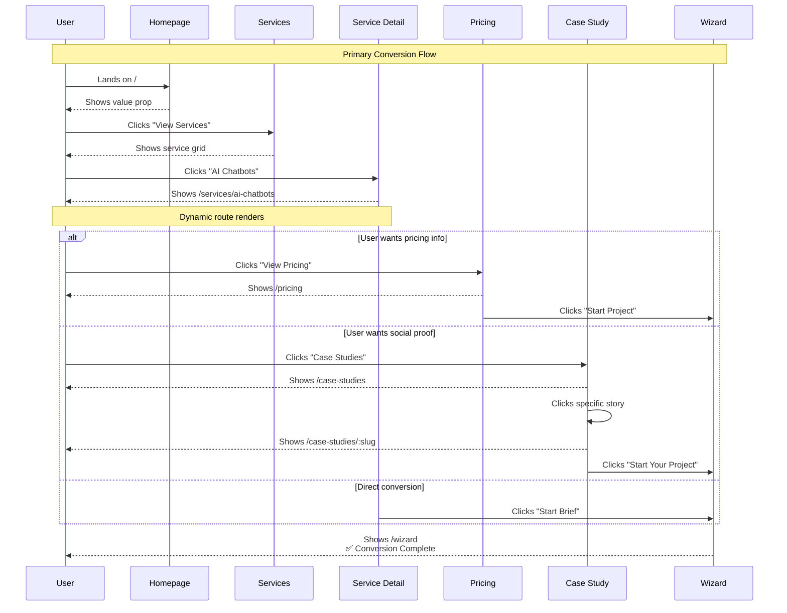

# 02 - Marketing Routing Implementation

**Version:** 1.0.0  
**Status:** 🔴 Not Started  
**Priority:** P0 - Critical  
**Estimated Time:** 6 hours  
**Owner:** TBD

---

## Executive Summary

This task implements all public marketing routes, builds 4 critical missing pages (Pricing, Case Studies, Case Study Detail, Contact), converts service routes to dynamic routing, and establishes SEO foundations. This unblocks revenue generation and enables complete user journeys from discovery to conversion.

---

## Problem This Task Solves

**Current State:**
- Missing `/pricing` → Users cannot see pricing information
- Missing `/case-studies` → No social proof or trust signals
- Missing `/contact` → No direct contact path
- 7 separate service detail components → Hard to maintain
- No SEO meta tags → Poor search visibility

**Target State:**
- All 4 critical pages built and functional
- Dynamic `/services/:slug` route (one component, many services)
- Complete conversion funnels (Home → Service → Pricing → Wizard)
- Basic SEO meta tags per route
- Shareable URLs for all marketing content

---

## Scope

### In Scope
- Build 4 missing pages:
  - `/pricing` - PricingPage
  - `/case-studies` - CaseStudiesPage
  - `/case-studies/:slug` - CaseStudyDetailPage
  - `/contact` - ContactPage
- Convert 7 service pages to dynamic route `/services/:slug`
- Add all marketing routes to route configuration
- Implement basic SEO meta tags (title, description)
- Create service data structure for dynamic routing
- Test all marketing → wizard conversion paths

### Out of Scope
- Protected dashboard routes (Task 03)
- Wizard step-based routing (Task 04)
- Advanced SEO (sitemap, robots.txt - Task 07)
- Auth routes (Task 05)
- Error boundaries (Task 06)

---

## Dependencies

### Prerequisites
- ✅ Task 01 complete (routing foundation exists)
- Marketing layout created and functional
- Existing marketing components available

### Blocks These Tasks
- Task 07: SEO Routing (needs marketing routes to exist)

### Blocked By
- Task 01: Routing Foundation (must be complete)

---

## Step-by-Step Implementation

### Step 1: Create Service Data Structure (30 minutes)

Create `/src/data/services.ts`:

```tsx
export interface Service {
  slug: string;
  name: string;
  title: string;
  description: string;
  icon: string;
  features: string[];
  benefits: string[];
  pricing: {
    starter: number;
    professional: number;
    enterprise: string;
  };
  cta: string;
  ctaLink: string;
}

export const services: Service[] = [
  {
    slug: 'ai-web-dev',
    name: 'AI Web Development',
    title: 'Build Intelligent Web Applications',
    description: 'Custom AI-powered web applications that scale...',
    icon: 'code',
    features: [
      'AI-powered features',
      'Real-time collaboration',
      'Scalable architecture',
      'API integrations',
    ],
    benefits: [
      '10x development speed',
      'Built-in AI capabilities',
      'Production-ready code',
    ],
    pricing: {
      starter: 15000,
      professional: 35000,
      enterprise: 'Custom',
    },
    cta: 'Start Your Project',
    ctaLink: '/wizard',
  },
  {
    slug: 'ai-development',
    name: 'AI Development',
    title: 'Custom AI Solutions',
    description: 'End-to-end AI development...',
    icon: 'brain',
    features: [...],
    benefits: [...],
    pricing: {...},
    cta: 'Start Your Project',
    ctaLink: '/wizard',
  },
  // Add remaining 5 services
  // ai-sales-marketing, ai-agents, ai-mvp, ai-chatbots, (industries handled separately)
];

export function getServiceBySlug(slug: string): Service | undefined {
  return services.find(s => s.slug === slug);
}

export function getAllServices(): Service[] {
  return services;
}
```

**Validation:**
- [ ] All 7 services defined
- [ ] Unique slugs
- [ ] No empty required fields
- [ ] Export functions work

---

### Step 2: Create Dynamic Service Detail Page (45 minutes)

Create `/src/pages/ServiceDetailPage.tsx`:

```tsx
import { useParams, useNavigate, Navigate } from 'react-router-dom';
import { Helmet } from 'react-helmet-async';
import { getServiceBySlug } from '../data/services';
import { ServiceHero } from '../components/services/ServiceHero';
import { ServiceFeatures } from '../components/services/ServiceFeatures';
import { ServicePricing } from '../components/services/ServicePricing';
import { ServiceCTA } from '../components/services/ServiceCTA';

export default function ServiceDetailPage() {
  const { slug } = useParams<{ slug: string }>();
  const navigate = useNavigate();
  const service = getServiceBySlug(slug || '');

  // Handle invalid slug
  if (!service) {
    return <Navigate to="/404" replace />;
  }

  return (
    <>
      <Helmet>
        <title>{service.title} | Your Brand</title>
        <meta name="description" content={service.description} />
        <link rel="canonical" href={`https://yoursite.com/services/${service.slug}`} />
      </Helmet>

      <div className="min-h-screen">
        <ServiceHero
          title={service.title}
          description={service.description}
          icon={service.icon}
        />

        <ServiceFeatures features={service.features} />

        <ServiceBenefits benefits={service.benefits} />

        <ServicePricing pricing={service.pricing} />

        <ServiceCTA
          text={service.cta}
          onClick={() => navigate(service.ctaLink)}
        />
      </div>
    </>
  );
}
```

**Create supporting components:**
- `/src/components/services/ServiceHero.tsx`
- `/src/components/services/ServiceFeatures.tsx`
- `/src/components/services/ServiceBenefits.tsx`
- `/src/components/services/ServicePricing.tsx`
- `/src/components/services/ServiceCTA.tsx`

**OR reuse existing components:**
If `AIWebDevPageV7.tsx` already has good structure, refactor it:

```tsx
// Extract reusable component
export function ServiceTemplate({ service }: { service: Service }) {
  // Reuse existing AIWebDevPageV7 structure
  // Replace hardcoded content with service props
}
```

---

### Step 3: Build Pricing Page (60 minutes)

Create `/src/pages/PricingPage.tsx`:

```tsx
import { Helmet } from 'react-helmet-async';
import { useNavigate } from 'react-router-dom';
import { Check } from 'lucide-react';

interface PricingTier {
  name: string;
  price: string;
  period: string;
  description: string;
  features: string[];
  cta: string;
  ctaLink: string;
  popular?: boolean;
}

const pricingTiers: PricingTier[] = [
  {
    name: 'Starter',
    price: '$15,000',
    period: 'per project',
    description: 'Perfect for small projects and MVPs',
    features: [
      'AI-powered web application',
      '5 core features',
      'Responsive design',
      'Basic SEO setup',
      '1 month support',
      'Source code included',
    ],
    cta: 'Start Project',
    ctaLink: '/wizard',
  },
  {
    name: 'Professional',
    price: '$35,000',
    period: 'per project',
    description: 'For growing businesses needing advanced features',
    features: [
      'Everything in Starter',
      'Advanced AI features',
      '15+ core features',
      'Custom integrations',
      'Performance optimization',
      '3 months support',
      'Priority development',
    ],
    cta: 'Start Project',
    ctaLink: '/wizard',
    popular: true,
  },
  {
    name: 'Enterprise',
    price: 'Custom',
    period: 'contact us',
    description: 'For large-scale applications and custom requirements',
    features: [
      'Everything in Professional',
      'Unlimited features',
      'Dedicated team',
      'Custom architecture',
      'SLA guarantee',
      '12 months support',
      '24/7 priority support',
    ],
    cta: 'Contact Sales',
    ctaLink: '/contact',
  },
];

export default function PricingPage() {
  const navigate = useNavigate();

  return (
    <>
      <Helmet>
        <title>Pricing | AI Development Services</title>
        <meta 
          name="description" 
          content="Transparent pricing for AI development projects. From $15,000 for MVPs to custom enterprise solutions." 
        />
        <link rel="canonical" href="https://yoursite.com/pricing" />
      </Helmet>

      <div className="min-h-screen bg-gradient-to-b from-gray-50 to-white py-24">
        <div className="max-w-7xl mx-auto px-4">
          {/* Header */}
          <div className="text-center mb-16">
            <h1 className="text-5xl font-bold mb-4">
              Simple, Transparent Pricing
            </h1>
            <p className="text-xl text-gray-600 max-w-2xl mx-auto">
              Choose the plan that fits your project. All plans include source code and support.
            </p>
          </div>

          {/* Pricing Grid */}
          <div className="grid md:grid-cols-3 gap-8 mb-16">
            {pricingTiers.map((tier) => (
              <div
                key={tier.name}
                className={`
                  relative rounded-2xl p-8 border-2
                  ${tier.popular 
                    ? 'border-indigo-600 shadow-xl scale-105' 
                    : 'border-gray-200'
                  }
                `}
              >
                {tier.popular && (
                  <div className="absolute -top-4 left-1/2 -translate-x-1/2 bg-indigo-600 text-white px-4 py-1 rounded-full text-sm font-medium">
                    Most Popular
                  </div>
                )}

                <div className="mb-6">
                  <h3 className="text-2xl font-bold mb-2">{tier.name}</h3>
                  <p className="text-gray-600 mb-4">{tier.description}</p>
                  <div className="flex items-baseline gap-2">
                    <span className="text-4xl font-bold">{tier.price}</span>
                    <span className="text-gray-500">{tier.period}</span>
                  </div>
                </div>

                <ul className="space-y-3 mb-8">
                  {tier.features.map((feature) => (
                    <li key={feature} className="flex items-start gap-3">
                      <Check className="h-5 w-5 text-green-600 flex-shrink-0 mt-0.5" />
                      <span className="text-gray-700">{feature}</span>
                    </li>
                  ))}
                </ul>

                <button
                  onClick={() => navigate(tier.ctaLink)}
                  className={`
                    w-full py-3 rounded-lg font-medium transition
                    ${tier.popular
                      ? 'bg-indigo-600 text-white hover:bg-indigo-700'
                      : 'bg-gray-100 text-gray-900 hover:bg-gray-200'
                    }
                  `}
                >
                  {tier.cta}
                </button>
              </div>
            ))}
          </div>

          {/* FAQ Section */}
          <div className="max-w-3xl mx-auto">
            <h2 className="text-3xl font-bold text-center mb-8">
              Frequently Asked Questions
            </h2>
            <div className="space-y-6">
              <FAQItem
                question="What's included in the price?"
                answer="All prices include development, design, testing, deployment, and the specified support period. You own all source code."
              />
              <FAQItem
                question="Can I upgrade later?"
                answer="Yes! You can upgrade from Starter to Professional at any time by paying the difference."
              />
              <FAQItem
                question="What payment methods do you accept?"
                answer="We accept wire transfer, credit card, and can set up milestone-based payment plans."
              />
            </div>
          </div>
        </div>
      </div>
    </>
  );
}

function FAQItem({ question, answer }: { question: string; answer: string }) {
  return (
    <div className="border-b border-gray-200 pb-6">
      <h3 className="text-lg font-semibold mb-2">{question}</h3>
      <p className="text-gray-600">{answer}</p>
    </div>
  );
}
```

**Validation:**
- [ ] All 3 pricing tiers display correctly
- [ ] CTA buttons navigate to correct routes
- [ ] Responsive on mobile
- [ ] FAQ section readable
- [ ] Meta tags present

---

### Step 4: Build Case Studies Overview Page (60 minutes)

Create `/src/data/caseStudies.ts`:

```tsx
export interface CaseStudy {
  slug: string;
  company: string;
  industry: string;
  logo: string;
  title: string;
  excerpt: string;
  challenge: string;
  solution: string;
  results: {
    metric: string;
    value: string;
    description: string;
  }[];
  testimonial: {
    quote: string;
    author: string;
    role: string;
    avatar: string;
  };
  tags: string[];
  featured?: boolean;
}

export const caseStudies: CaseStudy[] = [
  {
    slug: 'fintech-saas-ai-automation',
    company: 'FinanceFlow',
    industry: 'fintech',
    logo: '/case-studies/financeflow-logo.png',
    title: 'FinanceFlow Automates 80% of Customer Support with AI',
    excerpt: 'How a fintech startup reduced support costs by $120K/year...',
    challenge: 'FinanceFlow was struggling with...',
    solution: 'We built a custom AI chatbot...',
    results: [
      { metric: 'Support Cost Reduction', value: '80%', description: '$120K saved annually' },
      { metric: 'Response Time', value: '<30s', description: 'Down from 4 hours' },
      { metric: 'Customer Satisfaction', value: '4.8/5', description: 'Up from 3.2/5' },
    ],
    testimonial: {
      quote: 'The AI solution transformed our support operations...',
      author: 'Sarah Chen',
      role: 'CEO, FinanceFlow',
      avatar: '/testimonials/sarah-chen.jpg',
    },
    tags: ['AI Chatbot', 'FinTech', 'Support Automation'],
    featured: true,
  },
  // Add 5-10 more case studies
];

export function getCaseStudyBySlug(slug: string): CaseStudy | undefined {
  return caseStudies.find(cs => cs.slug === slug);
}

export function getFeaturedCaseStudies(): CaseStudy[] {
  return caseStudies.filter(cs => cs.featured);
}

export function getCaseStudiesByIndustry(industry: string): CaseStudy[] {
  return caseStudies.filter(cs => cs.industry === industry);
}
```

Create `/src/pages/CaseStudiesPage.tsx`:

```tsx
import { Helmet } from 'react-helmet-async';
import { useState } from 'react';
import { useNavigate } from 'react-router-dom';
import { caseStudies, CaseStudy } from '../data/caseStudies';
import { ArrowRight } from 'lucide-react';

export default function CaseStudiesPage() {
  const navigate = useNavigate();
  const [filter, setFilter] = useState<string>('all');

  const filteredStudies = filter === 'all'
    ? caseStudies
    : caseStudies.filter(cs => cs.industry === filter);

  const industries = ['all', ...new Set(caseStudies.map(cs => cs.industry))];

  return (
    <>
      <Helmet>
        <title>Case Studies | Client Success Stories</title>
        <meta 
          name="description" 
          content="See how we've helped companies build AI-powered solutions. Real results from real clients." 
        />
        <link rel="canonical" href="https://yoursite.com/case-studies" />
      </Helmet>

      <div className="min-h-screen bg-white py-24">
        <div className="max-w-7xl mx-auto px-4">
          {/* Header */}
          <div className="text-center mb-16">
            <h1 className="text-5xl font-bold mb-4">
              Client Success Stories
            </h1>
            <p className="text-xl text-gray-600 max-w-2xl mx-auto">
              Real results from companies that trusted us to build their AI solutions.
            </p>
          </div>

          {/* Filter Bar */}
          <div className="flex items-center gap-4 mb-12 overflow-x-auto pb-2">
            {industries.map((industry) => (
              <button
                key={industry}
                onClick={() => setFilter(industry)}
                className={`
                  px-6 py-2 rounded-full whitespace-nowrap transition
                  ${filter === industry
                    ? 'bg-indigo-600 text-white'
                    : 'bg-gray-100 text-gray-700 hover:bg-gray-200'
                  }
                `}
              >
                {industry.charAt(0).toUpperCase() + industry.slice(1)}
              </button>
            ))}
          </div>

          {/* Featured Case Study */}
          {filter === 'all' && (
            <FeaturedCaseStudy
              study={filteredStudies[0]}
              onClick={() => navigate(`/case-studies/${filteredStudies[0].slug}`)}
            />
          )}

          {/* Case Study Grid */}
          <div className="grid md:grid-cols-2 lg:grid-cols-3 gap-8 mt-12">
            {filteredStudies.slice(filter === 'all' ? 1 : 0).map((study) => (
              <CaseStudyCard
                key={study.slug}
                study={study}
                onClick={() => navigate(`/case-studies/${study.slug}`)}
              />
            ))}
          </div>
        </div>
      </div>
    </>
  );
}

function FeaturedCaseStudy({ study, onClick }: { study: CaseStudy; onClick: () => void }) {
  return (
    <div 
      onClick={onClick}
      className="relative bg-gradient-to-r from-indigo-600 to-purple-600 rounded-2xl p-12 text-white cursor-pointer hover:scale-[1.02] transition-transform"
    >
      <div className="absolute top-4 right-4 bg-white text-indigo-600 px-4 py-1 rounded-full text-sm font-medium">
        Featured
      </div>
      <h2 className="text-3xl font-bold mb-4">{study.title}</h2>
      <p className="text-lg mb-8 text-indigo-100">{study.excerpt}</p>
      <div className="flex items-center gap-8 mb-8">
        {study.results.slice(0, 3).map((result) => (
          <div key={result.metric}>
            <div className="text-4xl font-bold">{result.value}</div>
            <div className="text-indigo-200">{result.metric}</div>
          </div>
        ))}
      </div>
      <button className="flex items-center gap-2 font-medium hover:gap-4 transition-all">
        Read Full Story <ArrowRight className="h-5 w-5" />
      </button>
    </div>
  );
}

function CaseStudyCard({ study, onClick }: { study: CaseStudy; onClick: () => void }) {
  return (
    <div
      onClick={onClick}
      className="bg-white border-2 border-gray-200 rounded-xl p-6 cursor-pointer hover:border-indigo-600 hover:shadow-lg transition-all"
    >
      <div className="flex items-center gap-3 mb-4">
        
        <div>
          <h3 className="font-semibold">{study.company}</h3>
          <p className="text-sm text-gray-500">{study.industry}</p>
        </div>
      </div>
      <h4 className="text-lg font-semibold mb-2">{study.title}</h4>
      <p className="text-gray-600 mb-4 line-clamp-3">{study.excerpt}</p>
      <div className="flex flex-wrap gap-2 mb-4">
        {study.tags.map((tag) => (
          <span key={tag} className="bg-gray-100 text-gray-700 px-3 py-1 rounded-full text-sm">
            {tag}
          </span>
        ))}
      </div>
      <button className="text-indigo-600 font-medium flex items-center gap-2 hover:gap-4 transition-all">
        Read Story <ArrowRight className="h-4 w-4" />
      </button>
    </div>
  );
}
```

---

### Step 5: Build Case Study Detail Page (45 minutes)

Create `/src/pages/CaseStudyDetailPage.tsx`:

```tsx
import { useParams, useNavigate, Navigate } from 'react-router-dom';
import { Helmet } from 'react-helmet-async';
import { getCaseStudyBySlug, caseStudies } from '../data/caseStudies';
import { ArrowRight, Quote } from 'lucide-react';

export default function CaseStudyDetailPage() {
  const { slug } = useParams<{ slug: string }>();
  const navigate = useNavigate();
  const study = getCaseStudyBySlug(slug || '');

  if (!study) {
    return <Navigate to="/case-studies" replace />;
  }

  // Find next case study
  const currentIndex = caseStudies.findIndex(cs => cs.slug === slug);
  const nextStudy = caseStudies[(currentIndex + 1) % caseStudies.length];

  return (
    <>
      <Helmet>
        <title>{study.title} | Case Study</title>
        <meta name="description" content={study.excerpt} />
        <link rel="canonical" href={`https://yoursite.com/case-studies/${study.slug}`} />
      </Helmet>

      <div className="min-h-screen bg-white">
        {/* Hero */}
        <div className="bg-gradient-to-r from-indigo-600 to-purple-600 text-white py-24">
          <div className="max-w-4xl mx-auto px-4">
            <div className="flex items-center gap-4 mb-6">
              
              <div>
                <h2 className="text-xl font-semibold">{study.company}</h2>
                <p className="text-indigo-200">{study.industry}</p>
              </div>
            </div>
            <h1 className="text-5xl font-bold mb-6">{study.title}</h1>
            <p className="text-xl text-indigo-100">{study.excerpt}</p>
          </div>
        </div>

        {/* Results */}
        <div className="bg-gray-50 py-16">
          <div className="max-w-4xl mx-auto px-4">
            <h2 className="text-3xl font-bold text-center mb-12">Key Results</h2>
            <div className="grid md:grid-cols-3 gap-8">
              {study.results.map((result) => (
                <div key={result.metric} className="text-center">
                  <div className="text-5xl font-bold text-indigo-600 mb-2">
                    {result.value}
                  </div>
                  <div className="text-xl font-semibold mb-1">{result.metric}</div>
                  <div className="text-gray-600">{result.description}</div>
                </div>
              ))}
            </div>
          </div>
        </div>

        {/* Challenge */}
        <div className="py-16">
          <div className="max-w-4xl mx-auto px-4">
            <h2 className="text-3xl font-bold mb-6">The Challenge</h2>
            <p className="text-lg text-gray-700 leading-relaxed">
              {study.challenge}
            </p>
          </div>
        </div>

        {/* Solution */}
        <div className="bg-gray-50 py-16">
          <div className="max-w-4xl mx-auto px-4">
            <h2 className="text-3xl font-bold mb-6">Our Solution</h2>
            <p className="text-lg text-gray-700 leading-relaxed">
              {study.solution}
            </p>
          </div>
        </div>

        {/* Testimonial */}
        <div className="py-16">
          <div className="max-w-4xl mx-auto px-4">
            <div className="bg-indigo-50 rounded-2xl p-12 relative">
              <Quote className="h-12 w-12 text-indigo-600 mb-6" />
              <p className="text-2xl font-medium text-gray-900 mb-8">
                "{study.testimonial.quote}"
              </p>
              <div className="flex items-center gap-4">
                
                <div>
                  <div className="font-semibold text-lg">{study.testimonial.author}</div>
                  <div className="text-gray-600">{study.testimonial.role}</div>
                </div>
              </div>
            </div>
          </div>
        </div>

        {/* CTA */}
        <div className="bg-gradient-to-r from-indigo-600 to-purple-600 text-white py-16">
          <div className="max-w-4xl mx-auto px-4 text-center">
            <h2 className="text-3xl font-bold mb-4">
              Ready to Transform Your Business?
            </h2>
            <p className="text-xl text-indigo-100 mb-8">
              Let's build your success story together.
            </p>
            <button
              onClick={() => navigate('/wizard')}
              className="bg-white text-indigo-600 px-8 py-4 rounded-lg font-semibold hover:bg-indigo-50 transition inline-flex items-center gap-3"
            >
              Start Your Project <ArrowRight />
            </button>
          </div>
        </div>

        {/* Next Case Study */}
        <div className="py-16 bg-gray-50">
          <div className="max-w-4xl mx-auto px-4">
            <h3 className="text-2xl font-bold mb-6">Next Case Study</h3>
            <div
              onClick={() => navigate(`/case-studies/${nextStudy.slug}`)}
              className="bg-white border-2 border-gray-200 rounded-xl p-8 cursor-pointer hover:border-indigo-600 hover:shadow-lg transition-all"
            >
              <div className="flex items-center justify-between">
                <div>
                  <h4 className="text-xl font-semibold mb-2">{nextStudy.title}</h4>
                  <p className="text-gray-600">{nextStudy.company} · {nextStudy.industry}</p>
                </div>
                <ArrowRight className="h-8 w-8 text-indigo-600" />
              </div>
            </div>
          </div>
        </div>
      </div>
    </>
  );
}
```

---

### Step 6: Build Contact Page (30 minutes)

Create `/src/pages/ContactPage.tsx`:

```tsx
import { Helmet } from 'react-helmet-async';
import { useState } from 'react';
import { Mail, Phone, MapPin } from 'lucide-react';
import { toast } from 'sonner@2.0.3';

export default function ContactPage() {
  const [formData, setFormData] = useState({
    name: '',
    email: '',
    company: '',
    message: '',
  });
  const [isSubmitting, setIsSubmitting] = useState(false);

  const handleSubmit = async (e: React.FormEvent) => {
    e.preventDefault();
    setIsSubmitting(true);

    // TODO: Replace with actual API call
    await new Promise(resolve => setTimeout(resolve, 1000));

    toast.success('Message sent! We\'ll respond within 24 hours.');
    setFormData({ name: '', email: '', company: '', message: '' });
    setIsSubmitting(false);
  };

  return (
    <>
      <Helmet>
        <title>Contact Us | Get In Touch</title>
        <meta 
          name="description" 
          content="Get in touch with our team. We respond to all inquiries within 24 hours." 
        />
        <link rel="canonical" href="https://yoursite.com/contact" />
      </Helmet>

      <div className="min-h-screen bg-white py-24">
        <div className="max-w-7xl mx-auto px-4">
          <div className="text-center mb-16">
            <h1 className="text-5xl font-bold mb-4">Get In Touch</h1>
            <p className="text-xl text-gray-600 max-w-2xl mx-auto">
              Have a project in mind? Let's discuss how we can help.
            </p>
          </div>

          <div className="grid lg:grid-cols-2 gap-12">
            {/* Contact Form */}
            <div>
              <form onSubmit={handleSubmit} className="space-y-6">
                <div>
                  <label htmlFor="name" className="block font-medium mb-2">
                    Name *
                  </label>
                  <input
                    type="text"
                    id="name"
                    required
                    value={formData.name}
                    onChange={(e) => setFormData({ ...formData, name: e.target.value })}
                    className="w-full px-4 py-3 border-2 border-gray-200 rounded-lg focus:border-indigo-600 focus:outline-none"
                  />
                </div>

                <div>
                  <label htmlFor="email" className="block font-medium mb-2">
                    Email *
                  </label>
                  <input
                    type="email"
                    id="email"
                    required
                    value={formData.email}
                    onChange={(e) => setFormData({ ...formData, email: e.target.value })}
                    className="w-full px-4 py-3 border-2 border-gray-200 rounded-lg focus:border-indigo-600 focus:outline-none"
                  />
                </div>

                <div>
                  <label htmlFor="company" className="block font-medium mb-2">
                    Company
                  </label>
                  <input
                    type="text"
                    id="company"
                    value={formData.company}
                    onChange={(e) => setFormData({ ...formData, company: e.target.value })}
                    className="w-full px-4 py-3 border-2 border-gray-200 rounded-lg focus:border-indigo-600 focus:outline-none"
                  />
                </div>

                <div>
                  <label htmlFor="message" className="block font-medium mb-2">
                    Message *
                  </label>
                  <textarea
                    id="message"
                    required
                    rows={6}
                    value={formData.message}
                    onChange={(e) => setFormData({ ...formData, message: e.target.value })}
                    className="w-full px-4 py-3 border-2 border-gray-200 rounded-lg focus:border-indigo-600 focus:outline-none resize-none"
                  />
                </div>

                <button
                  type="submit"
                  disabled={isSubmitting}
                  className="w-full bg-indigo-600 text-white py-4 rounded-lg font-semibold hover:bg-indigo-700 disabled:bg-gray-400 transition"
                >
                  {isSubmitting ? 'Sending...' : 'Send Message'}
                </button>
              </form>
            </div>

            {/* Contact Info */}
            <div className="space-y-8">
              <div>
                <h2 className="text-2xl font-bold mb-6">Contact Information</h2>
                <div className="space-y-4">
                  <div className="flex items-start gap-4">
                    <Mail className="h-6 w-6 text-indigo-600 flex-shrink-0" />
                    <div>
                      <div className="font-medium">Email</div>
                      <a href="mailto:hello@yourcompany.com" className="text-indigo-600">
                        hello@yourcompany.com
                      </a>
                    </div>
                  </div>

                  <div className="flex items-start gap-4">
                    <Phone className="h-6 w-6 text-indigo-600 flex-shrink-0" />
                    <div>
                      <div className="font-medium">Phone</div>
                      <a href="tel:+1234567890" className="text-indigo-600">
                        +1 (234) 567-890
                      </a>
                    </div>
                  </div>

                  <div className="flex items-start gap-4">
                    <MapPin className="h-6 w-6 text-indigo-600 flex-shrink-0" />
                    <div>
                      <div className="font-medium">Location</div>
                      <div className="text-gray-600">
                        San Francisco, CA<br />
                        United States
                      </div>
                    </div>
                  </div>
                </div>
              </div>

              <div className="bg-indigo-50 rounded-xl p-8">
                <h3 className="text-xl font-bold mb-2">Response Time</h3>
                <p className="text-gray-700 mb-4">
                  We typically respond to all inquiries within 24 hours during business days.
                </p>
                <h3 className="text-xl font-bold mb-2">Business Hours</h3>
                <p className="text-gray-700">
                  Monday - Friday: 9:00 AM - 6:00 PM PST
                </p>
              </div>
            </div>
          </div>
        </div>
      </div>
    </>
  );
}
```

---

### Step 7: Update Route Configuration (15 minutes)

Update `/src/routes/index.tsx` to include all marketing routes:

```tsx
import { Navigate, RouteObject } from 'react-router-dom';
import { lazy } from 'react';
import { MarketingLayout } from '../layouts/MarketingLayout';

// Lazy load pages
const HomePage = lazy(() => import('../pages/HomePage'));
const ServicesPage = lazy(() => import('../pages/ServicesPage'));
const ServiceDetailPage = lazy(() => import('../pages/ServiceDetailPage'));
const PricingPage = lazy(() => import('../pages/PricingPage'));
const CaseStudiesPage = lazy(() => import('../pages/CaseStudiesPage'));
const CaseStudyDetailPage = lazy(() => import('../pages/CaseStudyDetailPage'));
const ContactPage = lazy(() => import('../pages/ContactPage'));
const ProjectsPage = lazy(() => import('../pages/ProjectsPage'));
const ProcessPage = lazy(() => import('../pages/ProcessPage'));
const AboutPage = lazy(() => import('../pages/AboutPage'));
const BookingPage = lazy(() => import('../pages/BookingPage'));

export const marketingRoutes: RouteObject[] = [
  {
    path: '/',
    element: <MarketingLayout />,
    children: [
      { index: true, element: <HomePage /> },
      
      // Services
      { path: 'services', element: <ServicesPage /> },
      { path: 'services/:slug', element: <ServiceDetailPage /> },
      
      // New pages
      { path: 'pricing', element: <PricingPage /> },
      { path: 'case-studies', element: <CaseStudiesPage /> },
      { path: 'case-studies/:slug', element: <CaseStudyDetailPage /> },
      { path: 'contact', element: <ContactPage /> },
      
      // Existing pages
      { path: 'projects', element: <ProjectsPage /> },
      { path: 'process', element: <ProcessPage /> },
      { path: 'about', element: <AboutPage /> },
      { path: 'booking', element: <BookingPage /> },
    ],
  },
];
```

---

### Step 8: Test All Marketing Routes (30 minutes)

**Test Checklist:**

1. **Homepage:**
   - [ ] Loads at `/`
   - [ ] CTA navigates to `/wizard`
   - [ ] Service links navigate to `/services/:slug`

2. **Services:**
   - [ ] Services overview loads at `/services`
   - [ ] Each service card navigates to correct detail page
   - [ ] Dynamic routing works for all 7 services

3. **Service Detail:**
   - [ ] Each `/services/:slug` loads correct content
   - [ ] Invalid slug redirects to 404
   - [ ] CTA navigates to `/wizard`
   - [ ] Back button returns to `/services`

4. **Pricing:**
   - [ ] Loads at `/pricing`
   - [ ] All 3 tiers display
   - [ ] Starter/Pro CTAs navigate to `/wizard`
   - [ ] Enterprise CTA navigates to `/contact`

5. **Case Studies:**
   - [ ] Overview loads at `/case-studies`
   - [ ] Filter buttons work
   - [ ] Featured study displays
   - [ ] Cards navigate to detail pages

6. **Case Study Detail:**
   - [ ] Each `/case-studies/:slug` loads
   - [ ] Invalid slug redirects to `/case-studies`
   - [ ] CTA navigates to `/wizard`
   - [ ] "Next Study" navigates correctly

7. **Contact:**
   - [ ] Form loads at `/contact`
   - [ ] Validation works
   - [ ] Submit shows toast
   - [ ] Form resets after submit

8. **Navigation:**
   - [ ] Browser back works on all pages
   - [ ] Direct URL access works
   - [ ] Refresh preserves current page
   - [ ] Share URL works

---

## Mermaid Diagram: Marketing Route Tree

```mermaid
flowchart TD
    Root[/ Homepage] --> Services[/services<br/>Services Overview]
    Root --> Pricing[/pricing<br/>✅ NEW]
    Root --> Cases[/case-studies<br/>✅ NEW]
    Root --> Contact[/contact<br/>✅ NEW]
    Root --> Projects[/projects]
    Root --> Process[/process]
    Root --> About[/about]
    Root --> Booking[/booking]
    
    Services --> SD1[/services/ai-web-dev]
    Services --> SD2[/services/ai-development]
    Services --> SD3[/services/ai-sales-marketing]
    Services --> SD4[/services/ai-agents]
    Services --> SD5[/services/ai-mvp]
    Services --> SD6[/services/ai-chatbots]
    
    SD1 --> Dynamic[🔄 ServiceDetailPage<br/>Dynamic Routing]
    SD2 --> Dynamic
    SD3 --> Dynamic
    SD4 --> Dynamic
    SD5 --> Dynamic
    SD6 --> Dynamic
    
    Cases --> CS1[/case-studies/fintech-saas]
    Cases --> CS2[/case-studies/ecommerce-ai]
    Cases --> CS3[/case-studies/healthcare-bot]
    Cases --> CSMore[... more case studies]
    
    CS1 --> DynamicCS[🔄 CaseStudyDetailPage<br/>Dynamic Routing]
    CS2 --> DynamicCS
    CS3 --> DynamicCS
    
    Dynamic --> Wizard[Navigate to<br/>/wizard]
    Pricing --> Wizard
    DynamicCS --> Wizard
    
    Contact --> ThankYou[Show Toast<br/>Success Message]
    
    style Pricing fill:#a5d6a7
    style Cases fill:#a5d6a7
    style Contact fill:#a5d6a7
    style Dynamic fill:#fff59d
    style DynamicCS fill:#fff59d
```

---

## Mermaid Diagram: Conversion Flow (Home → Wizard)



---

## Success Criteria Checklist

- [ ] All 4 new pages built (Pricing, Case Studies x2, Contact)
- [ ] Dynamic `/services/:slug` routing works
- [ ] Service data structure created with 7 services
- [ ] Case study data structure created with 5+ studies
- [ ] All marketing routes added to route config
- [ ] All pages have SEO meta tags (title, description, canonical)
- [ ] All CTAs navigate to correct routes
- [ ] No hardcoded URLs (use navigate())
- [ ] Invalid slugs redirect gracefully
- [ ] All manual tests pass
- [ ] Responsive on mobile
- [ ] No console errors
- [ ] Browser navigation works (back/forward/refresh)

---

## Production-Ready Checklist

**Code Quality:**
- [ ] TypeScript types defined for all data structures
- [ ] Props interfaces documented
- [ ] No `any` types
- [ ] ESLint passes
- [ ] Prettier applied

**UX:**
- [ ] Loading states for lazy-loaded routes
- [ ] Smooth transitions between pages
- [ ] Accessible forms (labels, aria-attributes)
- [ ] Keyboard navigation works
- [ ] Focus management correct

**Performance:**
- [ ] Images optimized
- [ ] Lazy loading implemented
- [ ] Code splitting per route
- [ ] <2s page load

**Content:**
- [ ] All copy proofread
- [ ] CTAs compelling
- [ ] Images/logos present (or placeholders)
- [ ] Contact info accurate

---

## Common Failure Points

### Issue 1: Dynamic route not matching

**Symptom:** `/services/ai-chatbots` shows 404

**Cause:** Route pattern incorrect or slug doesn't match data

**Fix:**
```tsx
// Check route pattern matches param name
{ path: 'services/:slug', element: <ServiceDetailPage /> }

// Check slug in data matches URL
const service = getServiceBySlug(slug);  // slug must match
```

---

### Issue 2: Helmet meta tags not updating

**Symptom:** All pages show same title

**Cause:** Helmet not installed or HelmetProvider missing

**Fix:**
```bash
npm install react-helmet-async

// App.tsx
import { HelmetProvider } from 'react-helmet-async';

<HelmetProvider>
  <App />
</HelmetProvider>
```

---

### Issue 3: Form submission doesn't work

**Symptom:** Form submits but nothing happens

**Cause:** Missing API endpoint or state management

**Fix:** For now, use local state + toast:
```tsx
const handleSubmit = async (e) => {
  e.preventDefault();
  // TODO: Replace with API call
  await simulateAPICall();
  toast.success('Message sent!');
  resetForm();
};
```

---

### Issue 4: Case study images broken

**Symptom:** Broken image placeholders

**Cause:** Image paths incorrect

**Fix:**
```tsx
// Use public folder paths
logo: '/case-studies/logo.png'

// Or use Unsplash placeholder
logo: 'https://source.unsplash.com/100x100/?logo'
```

---

### Issue 5: Filter buttons don't work

**Symptom:** Clicking filter doesn't update grid

**Cause:** State update not triggering re-render

**Fix:**
```tsx
const [filter, setFilter] = useState('all');

// Filter logic
const filtered = filter === 'all'
  ? allStudies
  : allStudies.filter(s => s.industry === filter);

// Render filtered, not allStudies
{filtered.map(study => ...)}
```

---

## Rollback / Recovery Notes

### If marketing pages have critical bugs:

**Option 1: Disable specific route**
```tsx
// Route config
{ 
  path: 'pricing', 
  element: <div>Under maintenance</div>  // Temporary
}
```

**Option 2: Revert to old pages**
```tsx
// Keep old components as fallback
{ path: 'services/ai-chatbots', element: <AIChatbotsPageV7 /> }
// Instead of dynamic route
```

**Option 3: Feature flag**
```tsx
const USE_DYNAMIC_SERVICES = false;

{ 
  path: 'services/:slug', 
  element: USE_DYNAMIC_SERVICES 
    ? <ServiceDetailPage /> 
    : <OldServicePage />
}
```

---

## SEO Validation (Basic)

**Per-Page Checklist:**

- [ ] Unique `<title>` (50-60 chars)
- [ ] Unique `<meta description>` (150-160 chars)
- [ ] Canonical URL set
- [ ] No duplicate content
- [ ] Heading hierarchy (H1, H2, H3)
- [ ] Alt text on images
- [ ] Internal links work

**Tools:**
- Chrome DevTools → Lighthouse → SEO audit
- View Page Source → Check meta tags
- Google Search Console (post-deploy)

---

## CTA Validation Checklist

**Every page must have clear next action:**

| Page | Primary CTA | Secondary CTA | Validates To |
|------|-------------|---------------|--------------|
| Homepage | "Start Brief" → /wizard | "View Services" → /services | ✅ |
| Services | "View Service" → /services/:slug | - | ✅ |
| Service Detail | "Start Brief" → /wizard | "View Pricing" → /pricing | ✅ |
| Pricing | "Start Project" → /wizard | "Contact Sales" → /contact | ✅ |
| Case Studies | "Read Story" → /:slug | - | ✅ |
| Case Study Detail | "Start Project" → /wizard | - | ✅ |
| Contact | "Send Message" (form) | - | ✅ |

---

## Next Steps

After this task is complete:

1. **Update Progress Tracker:**
   - Mark Task 02 as ✅ Complete
   - Update completion %

2. **Proceed to:**
   - Task 03: Dashboard Routing
   - Task 07: SEO Routing (depends on this)

3. **Team Demo:**
   - Show all new pages
   - Walk through conversion flow
   - Get feedback

---

## Version History

| Version | Date | Changes | Author |
|---------|------|---------|--------|
| 1.0.0 | Dec 20, 2025 | Initial task specification | Product Architecture |

---

**This task builds the revenue-critical marketing pages. Do not skip validation steps. Test all conversion paths thoroughly.**
