# 03 - Dashboard/App Routing Implementation

**Version:** 1.0.0  
**Status:** 🔴 Not Started  
**Priority:** P0 - Critical  
**Estimated Time:** 4 hours  
**Owner:** TBD

---

## Executive Summary

This task implements all protected dashboard routes, connects the existing LeadProfileView component to URL-based routing, establishes AdminLayout with proper `<Outlet />` integration, implements breadcrumb navigation, and sets up URL-based active nav state management. This enables deep linking into the app and proper navigation UX for authenticated users.

---

## Problem This Task Solves

**Current State:**
- Protected routes use state-based navigation
- LeadProfileView exists but cannot be accessed via URL
- Cannot deep-link to `/app/leads/123`
- Admin sidebar doesn't reflect URL state
- No breadcrumbs for navigation context
- Refresh loses current app section

**Target State:**
- All `/app/*` routes URL-based
- Lead detail accessible at `/app/leads/:id`
- Deep linking works throughout app
- Sidebar reflects current route
- Breadcrumbs show navigation path
- Refresh preserves app state

---

## Scope

### In Scope
- Connect `/app/leads/:id` to LeadProfileView
- Set up AppLayout with `<Outlet />`
- Implement breadcrumb component
- Add URL-based active nav state
- Create all dashboard route wrappers
- Test protected route access control

### Out of Scope
- Building new dashboard features (future work)
- Auth guard implementation (Task 05)
- Account/Billing pages (suggested routes, not P0)
- Audit logs (suggested routes)

---

## Dependencies

### Prerequisites
- ✅ Task 01 complete (routing foundation)
- AdminLayout component exists
- LeadProfileView component exists

### Blocks These Tasks
- Task 05: Auth Routing (needs protected routes)

### Blocked By
- Task 01: Routing Foundation

---

## Step-by-Step Implementation

### Step 1: Create Dashboard Route Wrappers (20 minutes)

Create `/src/pages/app/DashboardPage.tsx`:

```tsx
import { ProjectDashboard } from '../../components/ProjectDashboard';

export default function DashboardPage() {
  return <ProjectDashboard onClose={() => {/* Handled by nav */}} />;
}
```

Create `/src/pages/app/LeadsListPage.tsx`:

```tsx
import { CRMLeadsDashboard } from '../../components/crm/CRMLeadsDashboard';

export default function LeadsListPage() {
  return <CRMLeadsDashboard />;
}
```

Create `/src/pages/app/LeadDetailPage.tsx`:

```tsx
import { useParams, Navigate, useNavigate } from 'react-router-dom';
import { useLeads } from '../../context/LeadContext';
import { LeadProfileView } from '../../components/crm/LeadProfileView';

export default function LeadDetailPage() {
  const { id } = useParams<{ id: string }>();
  const { leads } = useLeads();
  const navigate = useNavigate();

  const lead = leads.find(l => l.id === id);

  if (!lead) {
    return <Navigate to="/app/leads" replace />;
  }

  return (
    <LeadProfileView 
      lead={lead}
      onClose={() => navigate('/app/leads')}
    />
  );
}
```

---

### Step 2: Update AppLayout for Routing (30 minutes)

Modify `/src/layouts/AppLayout.tsx`:

```tsx
import { Outlet, useLocation, useNavigate } from 'react-router-dom';
import { Suspense } from 'react';
import { AdminLayout } from '../components/crm/AdminLayout';

export function AppLayout() {
  const location = useLocation();
  const navigate = useNavigate();

  // Derive active page from URL
  const getActivePage = (pathname: string): string => {
    if (pathname.startsWith('/app/leads')) return 'leads';
    if (pathname.startsWith('/app/ops')) return 'ops';
    if (pathname.startsWith('/app/workflows')) return 'workflow';
    if (pathname.startsWith('/app/intelligence')) return 'intelligence';
    if (pathname.startsWith('/app/settings')) return 'settings';
    return 'dashboard';
  };

  const activePage = getActivePage(location.pathname);

  // Convert page name to route
  const handleNavigate = (page: string) => {
    const routes: Record<string, string> = {
      dashboard: '/app/dashboard',
      leads: '/app/leads',
      ops: '/app/ops',
      workflow: '/app/workflows',
      settings: '/app/settings',
      intelligence: '/app/intelligence/upload',
    };
    navigate(routes[page] || '/app/dashboard');
  };

  return (
    <Suspense fallback={<div>Loading...</div>}>
      <AdminLayout
        activePage={activePage}
        onNavigate={handleNavigate}
      >
        <Outlet /> {/* Child routes render here */}
      </AdminLayout>
    </Suspense>
  );
}
```

---

### Step 3: Implement Breadcrumb Component (45 minutes)

Create `/src/components/Breadcrumbs.tsx`:

```tsx
import { Fragment } from 'react';
import { Link, useLocation } from 'react-router-dom';
import { ChevronRight, Home } from 'lucide-react';

interface Crumb {
  label: string;
  href?: string;
}

interface BreadcrumbsProps {
  crumbs?: Crumb[];
}

export function Breadcrumbs({ crumbs }: BreadcrumbsProps) {
  const location = useLocation();

  // Auto-generate breadcrumbs from URL if not provided
  const autoCrumbs = crumbs || generateCrumbsFromPath(location.pathname);

  return (
    <nav className="flex items-center gap-2 text-sm mb-6">
      {/* Home link */}
      <Link
        to="/app/dashboard"
        className="text-gray-500 hover:text-gray-900 transition"
      >
        <Home className="h-4 w-4" />
      </Link>

      {autoCrumbs.map((crumb, index) => (
        <Fragment key={index}>
          <ChevronRight className="h-4 w-4 text-gray-400" />
          
          {crumb.href ? (
            <Link
              to={crumb.href}
              className="text-indigo-600 hover:underline"
            >
              {crumb.label}
            </Link>
          ) : (
            <span className="text-gray-900 font-medium">
              {crumb.label}
            </span>
          )}
        </Fragment>
      ))}
    </nav>
  );
}

function generateCrumbsFromPath(pathname: string): Crumb[] {
  const segments = pathname.split('/').filter(Boolean);
  const crumbs: Crumb[] = [];

  segments.forEach((segment, index) => {
    if (segment === 'app') return; // Skip 'app' segment

    const label = formatSegment(segment);
    const isLast = index === segments.length - 1;
    
    if (!isLast) {
      const href = '/' + segments.slice(0, index + 1).join('/');
      crumbs.push({ label, href });
    } else {
      crumbs.push({ label }); // Last crumb (current page) - no link
    }
  });

  return crumbs;
}

function formatSegment(segment: string): string {
  // Convert kebab-case to Title Case
  return segment
    .split('-')
    .map(word => word.charAt(0).toUpperCase() + word.slice(1))
    .join(' ');
}
```

Use in page components:

```tsx
export default function LeadDetailPage() {
  const { lead } = useLeadData();
  
  const breadcrumbs = [
    { label: 'Leads', href: '/app/leads' },
    { label: lead.name }, // Current page, no href
  ];

  return (
    <div>
      <Breadcrumbs crumbs={breadcrumbs} />
      <LeadProfileView lead={lead} />
    </div>
  );
}
```

---

### Step 4: Add All Dashboard Routes to Config (20 minutes)

Update `/src/routes/index.tsx`:

```tsx
import { Navigate } from 'react-router-dom';
import { lazy } from 'react';
import { AppLayout } from '../layouts/AppLayout';

const DashboardPage = lazy(() => import('../pages/app/DashboardPage'));
const LeadsListPage = lazy(() => import('../pages/app/LeadsListPage'));
const LeadDetailPage = lazy(() => import('../pages/app/LeadDetailPage'));
const OpsPage = lazy(() => import('../pages/app/OpsPage'));
const WorkflowsPage = lazy(() => import('../pages/app/WorkflowsPage'));
const SettingsPage = lazy(() => import('../pages/app/SettingsPage'));

// Intelligence routes
const IntelligenceUploadPage = lazy(() => import('../pages/app/intelligence/UploadPage'));
const IntelligenceAnalysisPage = lazy(() => import('../pages/app/intelligence/AnalysisPage'));
const IntelligenceBriefPage = lazy(() => import('../pages/app/intelligence/BriefPage'));
const IntelligenceSearchPage = lazy(() => import('../pages/app/intelligence/SearchPage'));

export const appRoutes = [
  {
    path: '/app',
    element: <AppLayout />,
    children: [
      // Redirect /app to /app/dashboard
      { index: true, element: <Navigate to="/app/dashboard" replace /> },
      
      // Main dashboard
      { path: 'dashboard', element: <DashboardPage /> },
      
      // CRM
      { path: 'leads', element: <LeadsListPage /> },
      { path: 'leads/:id', element: <LeadDetailPage /> },
      
      // Operations
      { path: 'ops', element: <OpsPage /> },
      { path: 'workflows', element: <WorkflowsPage /> },
      
      // Intelligence
      {
        path: 'intelligence',
        children: [
          { index: true, element: <Navigate to="/app/intelligence/upload" replace /> },
          { path: 'upload', element: <IntelligenceUploadPage /> },
          { path: 'analysis', element: <IntelligenceAnalysisPage /> },
          { path: 'brief', element: <IntelligenceBriefPage /> },
          { path: 'search', element: <IntelligenceSearchPage /> },
        ],
      },
      
      // Settings
      { path: 'settings', element: <SettingsPage /> },
    ],
  },
];
```

---

### Step 5: Update Intelligence Flow Navigation (30 minutes)

Update components to use navigate instead of state:

```tsx
// CallIngestion.tsx
import { useNavigate } from 'react-router-dom';

export function CallIngestion() {
  const navigate = useNavigate();

  const handleUploadComplete = () => {
    navigate('/app/intelligence/analysis');
  };

  return (
    <div>
      {/* Upload UI */}
      <button onClick={handleUploadComplete}>
        Process Call
      </button>
    </div>
  );
}

// AnalysisState.tsx
export function AnalysisState() {
  const navigate = useNavigate();

  useEffect(() => {
    // After analysis completes
    const timer = setTimeout(() => {
      navigate('/app/intelligence/brief');
    }, 8000);

    return () => clearTimeout(timer);
  }, [navigate]);

  return <div>Analyzing...</div>;
}

// CallBrief.tsx
export function CallBrief() {
  const navigate = useNavigate();

  const handleUpdateLead = () => {
    navigate('/app/leads');
  };

  return (
    <div>
      {/* Brief UI */}
      <button onClick={handleUpdateLead}>
        Update Lead
      </button>
    </div>
  );
}
```

---

### Step 6: Implement Active Nav State (15 minutes)

Update `AdminLayout` to use active state from props:

```tsx
// AdminLayout.tsx
export function AdminLayout({ 
  activePage, 
  onNavigate, 
  children 
}: AdminLayoutProps) {
  const navItems = [
    { id: 'dashboard', label: 'Dashboard', icon: LayoutDashboard },
    { id: 'leads', label: 'Leads', icon: Users },
    { id: 'ops', label: 'Operations', icon: Activity },
    { id: 'workflow', label: 'Workflows', icon: Workflow },
    { id: 'settings', label: 'Settings', icon: Settings },
  ];

  return (
    <div className="flex h-screen">
      <aside className="w-64 bg-gray-900 text-white">
        <nav className="p-4 space-y-2">
          {navItems.map((item) => (
            <button
              key={item.id}
              onClick={() => onNavigate(item.id)}
              className={`
                w-full flex items-center gap-3 px-4 py-3 rounded-lg transition
                ${activePage === item.id
                  ? 'bg-indigo-600 text-white'  // Active
                  : 'text-gray-300 hover:bg-gray-800'  // Inactive
                }
              `}
            >
              <item.icon className="h-5 w-5" />
              {item.label}
            </button>
          ))}
        </nav>
      </aside>

      <main className="flex-1 overflow-auto">
        {children}
      </main>
    </div>
  );
}
```

---

### Step 7: Test All Dashboard Routes (30 minutes)

**Manual Test Checklist:**

1. **Dashboard:**
   - [ ] `/app` redirects to `/app/dashboard`
   - [ ] Dashboard renders
   - [ ] Sidebar shows "Dashboard" active

2. **Leads List:**
   - [ ] Navigate to `/app/leads`
   - [ ] Leads list renders
   - [ ] Sidebar shows "Leads" active

3. **Lead Detail:**
   - [ ] Click lead in list
   - [ ] URL changes to `/app/leads/:id`
   - [ ] Lead profile displays
   - [ ] Breadcrumbs show: Dashboard > Leads > [Name]
   - [ ] Back button returns to list

4. **Deep Link:**
   - [ ] Paste `/app/leads/abc123` in address bar
   - [ ] Lead detail loads directly
   - [ ] Breadcrumbs correct

5. **Invalid Lead:**
   - [ ] Navigate to `/app/leads/invalid-id`
   - [ ] Redirects to `/app/leads`
   - [ ] No crash

6. **Intelligence Flow:**
   - [ ] `/app/intelligence` redirects to `/upload`
   - [ ] Upload → Analysis → Brief flow works
   - [ ] URLs update at each step
   - [ ] Can refresh at any step

7. **Browser Navigation:**
   - [ ] Back button works
   - [ ] Forward button works
   - [ ] Refresh preserves current route

---

## Mermaid Diagram: Dashboard Route Hierarchy

```mermaid
flowchart TD
    Root[/app] --> Redirect{index route}
    Redirect -->|auto redirect| Dashboard[/app/dashboard<br/>DashboardPage]
    
    Root --> Leads[/app/leads<br/>LeadsListPage]
    Root --> Ops[/app/ops<br/>OpsPage]
    Root --> Workflows[/app/workflows<br/>WorkflowsPage]
    Root --> Settings[/app/settings<br/>SettingsPage]
    Root --> Intel[/app/intelligence]
    
    Leads --> LeadDetail[/app/leads/:id<br/>LeadDetailPage ✅]
    
    Intel --> IntelRedirect{index route}
    IntelRedirect -->|auto redirect| Upload[/app/intelligence/upload]
    Intel --> Analysis[/app/intelligence/analysis]
    Intel --> Brief[/app/intelligence/brief]
    Intel --> Search[/app/intelligence/search]
    
    LeadDetail --> Outlet1[Renders in AppLayout]
    Dashboard --> Outlet1
    Leads --> Outlet1
    Ops --> Outlet1
    Workflows --> Outlet1
    Settings --> Outlet1
    Upload --> Outlet1
    Analysis --> Outlet1
    Brief --> Outlet1
    Search --> Outlet1
    
    Outlet1 --> AdminLayout[AdminLayout<br/>Sidebar + Content]
    
    style LeadDetail fill:#a5d6a7
    style Outlet1 fill:#fff59d
    style AdminLayout fill:#e1bee7
```

---

## Mermaid Diagram: Intelligence Flow with URLs

```mermaid
sequenceDiagram
    participant U as User
    participant List as Leads List
    participant Detail as Lead Detail
    participant Upload as Call Upload
    participant Analysis as AI Analysis
    participant Brief as Call Brief
    participant Back as Leads List

    U->>List: Navigate to /app/leads
    List-->>U: Shows lead list
    
    U->>Detail: Click lead "Sarah Chen"
    Note over Detail: URL: /app/leads/abc123
    Detail-->>U: Shows lead profile
    
    U->>Upload: Click "Upload Call"
    Note over Upload: URL: /app/intelligence/upload
    Upload-->>U: Shows upload interface
    
    U->>Upload: Drop call.mp3
    Upload->>Analysis: Upload complete
    Note over Analysis: URL: /app/intelligence/analysis
    Analysis-->>U: Shows "Analyzing..." (8s)
    
    Analysis->>Brief: Analysis complete
    Note over Brief: URL: /app/intelligence/brief
    Brief-->>U: Shows insights
    
    U->>Brief: Click "Update Lead"
    Brief->>Back: Navigate to /app/leads
    Note over Back: URL: /app/leads
    Back-->>U: Shows updated lead
    
    Note over U,Back: ✅ All URLs preserved in history<br/>Can use browser back at any step
```



---

## Success Criteria Checklist

- [ ] LeadProfileView accessible at `/app/leads/:id`
- [ ] AppLayout uses `<Outlet />` pattern
- [ ] Breadcrumb component created and working
- [ ] Active nav state reflects URL
- [ ] All dashboard routes added to config
- [ ] Intelligence flow uses URL navigation
- [ ] Deep linking works (paste URL directly)
- [ ] Invalid lead ID redirects gracefully
- [ ] Browser back/forward works
- [ ] Refresh preserves current route
- [ ] No console errors
- [ ] Sidebar reflects active page

---

## Production-Ready Checklist

- [ ] TypeScript types for all route params
- [ ] Loading states during navigation
- [ ] Error boundaries for route errors
- [ ] Breadcrumbs update on navigation
- [ ] Mobile-responsive sidebar
- [ ] Keyboard navigation works
- [ ] Focus management correct

---

## Common Failure Points

### Issue 1: Lead detail shows blank page

**Cause:** Lead not found, but no redirect handling

**Fix:**
```tsx
if (!lead) {
  return <Navigate to="/app/leads" replace />;
}
```

### Issue 2: Breadcrumbs show ID instead of name

**Cause:** Using URL param instead of actual lead name

**Fix:**
```tsx
const breadcrumbs = [
  { label: 'Leads', href: '/app/leads' },
  { label: lead.name }, // Use lead data, not params.id
];
```

### Issue 3: Sidebar doesn't highlight active page

**Cause:** Active state not derived from URL

**Fix:** Use `useLocation()` in AppLayout (see Step 2)

---

## Rollback / Recovery Notes

If dashboard routing breaks:

```tsx
// Temporarily disable dynamic routes
{ path: 'leads', element: <LeadsListPage /> },
// Comment out detail route
// { path: 'leads/:id', element: <LeadDetailPage /> },
```

---

## Next Steps

1. Mark Task 03 complete in tracker
2. Proceed to Task 05: Auth Routing
3. Test protected route access control

---

**This task enables deep linking throughout the dashboard. Validate breadcrumbs and active nav states thoroughly.**
