# 05 - Auth Routing Implementation

**Version:** 1.0.0  
**Status:** 🔴 Not Started  
**Priority:** P0 - Critical  
**Estimated Time:** 2 hours  
**Owner:** TBD

---

## Executive Summary

This task implements proper authentication routing with dedicated `/login` route, ProtectedRoute component with redirect logic, intended destination preservation, and session-based access control. This ensures only authenticated users can access `/app/*` routes while providing seamless login/logout flows.

---

## Problem This Task Solves

**Current State:**
- Login page only shows as fallback component
- No dedicated `/login` route
- Empty `onLoginSuccess` callback
- No redirect to intended route after login
- Cannot link to login page directly
- Session state not preserved across refreshes

**Target State:**
- `/login` is a proper route
- Unauthenticated users redirected to `/login`
- After login, redirect to intended destination
- Session preserved in localStorage/cookie
- Logout clears session and redirects
- Can deep-link to login page

---

## Scope

### In Scope
- Create `/login` route
- Implement ProtectedRoute component
- Add redirect-after-login logic
- Preserve intended destination in state
- Session persistence
- Logout functionality
- Auth context validation

### Out of Scope
- User registration (signup flow)
- Password reset
- OAuth/social login
- Multi-factor authentication
- Email verification

---

## Dependencies

### Prerequisites
- ✅ Task 01 complete (routing foundation)
- ✅ Task 03 complete (dashboard routes)
- AuthContext exists

### Blocks These Tasks
- None (enables security for existing routes)

### Blocked By
- Task 01: Routing Foundation
- Task 03: Dashboard Routing

---

## Step-by-Step Implementation

### Step 1: Create Login Page (30 minutes)

Create `/src/pages/LoginPage.tsx`:

```tsx
import { useState } from 'react';
import { useNavigate, useLocation } from 'react-router-dom';
import { Helmet } from 'react-helmet-async';
import { useAuth } from '../context/AuthContext';
import { toast } from 'sonner@2.0.3';
import { Lock, Mail } from 'lucide-react';

export default function LoginPage() {
  const navigate = useNavigate();
  const location = useLocation();
  const { login } = useAuth();

  const [email, setEmail] = useState('');
  const [password, setPassword] = useState('');
  const [isLoading, setIsLoading] = useState(false);

  // Get intended destination from location state
  const from = location.state?.from || '/app/dashboard';

  const handleSubmit = async (e: React.FormEvent) => {
    e.preventDefault();
    setIsLoading(true);

    try {
      await login(email, password);
      
      toast.success('Welcome back!');
      
      // Redirect to intended destination
      navigate(from, { replace: true });
    } catch (error) {
      toast.error('Invalid email or password');
    } finally {
      setIsLoading(false);
    }
  };

  return (
    <>
      <Helmet>
        <title>Login | Your App</title>
        <meta name="description" content="Login to access your dashboard" />
        <meta name="robots" content="noindex" />
      </Helmet>

      <div className="min-h-screen bg-gray-50 flex items-center justify-center py-12 px-4">
        <div className="max-w-md w-full space-y-8">
          <div className="text-center">
            <Lock className="mx-auto h-12 w-12 text-indigo-600" />
            <h2 className="mt-6 text-3xl font-bold text-gray-900">
              Sign in to your account
            </h2>
            <p className="mt-2 text-sm text-gray-600">
              Access your dashboard and manage your projects
            </p>
          </div>

          <form onSubmit={handleSubmit} className="mt-8 space-y-6">
            <div className="space-y-4">
              <div>
                <label htmlFor="email" className="block text-sm font-medium text-gray-700 mb-1">
                  Email address
                </label>
                <div className="relative">
                  <Mail className="absolute left-3 top-1/2 -translate-y-1/2 h-5 w-5 text-gray-400" />
                  <input
                    id="email"
                    name="email"
                    type="email"
                    autoComplete="email"
                    required
                    value={email}
                    onChange={(e) => setEmail(e.target.value)}
                    className="pl-10 w-full px-4 py-3 border border-gray-300 rounded-lg focus:ring-2 focus:ring-indigo-600 focus:border-transparent"
                    placeholder="you@example.com"
                  />
                </div>
              </div>

              <div>
                <label htmlFor="password" className="block text-sm font-medium text-gray-700 mb-1">
                  Password
                </label>
                <div className="relative">
                  <Lock className="absolute left-3 top-1/2 -translate-y-1/2 h-5 w-5 text-gray-400" />
                  <input
                    id="password"
                    name="password"
                    type="password"
                    autoComplete="current-password"
                    required
                    value={password}
                    onChange={(e) => setPassword(e.target.value)}
                    className="pl-10 w-full px-4 py-3 border border-gray-300 rounded-lg focus:ring-2 focus:ring-indigo-600 focus:border-transparent"
                    placeholder="••••••••"
                  />
                </div>
              </div>
            </div>

            <div className="flex items-center justify-between">
              <div className="flex items-center">
                <input
                  id="remember-me"
                  name="remember-me"
                  type="checkbox"
                  className="h-4 w-4 text-indigo-600 focus:ring-indigo-600 border-gray-300 rounded"
                />
                <label htmlFor="remember-me" className="ml-2 block text-sm text-gray-900">
                  Remember me
                </label>
              </div>

              <div className="text-sm">
                <a href="#" className="font-medium text-indigo-600 hover:text-indigo-500">
                  Forgot password?
                </a>
              </div>
            </div>

            <button
              type="submit"
              disabled={isLoading}
              className="w-full flex justify-center py-3 px-4 border border-transparent rounded-lg shadow-sm text-sm font-medium text-white bg-indigo-600 hover:bg-indigo-700 focus:outline-none focus:ring-2 focus:ring-offset-2 focus:ring-indigo-600 disabled:bg-gray-400"
            >
              {isLoading ? 'Signing in...' : 'Sign in'}
            </button>
          </form>

          {/* Demo credentials */}
          <div className="mt-4 p-4 bg-yellow-50 border border-yellow-200 rounded-lg">
            <p className="text-sm text-yellow-800">
              <strong>Demo:</strong> Use any email/password to login (development mode)
            </p>
          </div>
        </div>
      </div>
    </>
  );
}
```

---

### Step 2: Implement ProtectedRoute Component (30 minutes)

Create `/src/components/ProtectedRoute.tsx`:

```tsx
import { Navigate, useLocation } from 'react-router-dom';
import { useAuth } from '../context/AuthContext';

interface ProtectedRouteProps {
  children: React.ReactNode;
}

export function ProtectedRoute({ children }: ProtectedRouteProps) {
  const { isAuthenticated, isLoading } = useAuth();
  const location = useLocation();

  // Show loading state while checking auth
  if (isLoading) {
    return (
      <div className="min-h-screen flex items-center justify-center">
        <div className="animate-spin rounded-full h-12 w-12 border-b-2 border-indigo-600" />
      </div>
    );
  }

  // Not authenticated: redirect to login with intended destination
  if (!isAuthenticated) {
    return (
      <Navigate 
        to="/login" 
        state={{ from: location.pathname }}
        replace 
      />
    );
  }

  // Authenticated: render protected content
  return <>{children}</>;
}
```

---

### Step 3: Update AuthContext (30 minutes)

Enhance `/src/context/AuthContext.tsx`:

```tsx
import { createContext, useContext, useState, useEffect, ReactNode } from 'react';

interface User {
  id: string;
  email: string;
  name: string;
  role: string;
}

interface AuthContextType {
  user: User | null;
  isAuthenticated: boolean;
  isLoading: boolean;
  login: (email: string, password: string) => Promise<void>;
  logout: () => void;
}

const AuthContext = createContext<AuthContextType | undefined>(undefined);

export function AuthProvider({ children }: { children: ReactNode }) {
  const [user, setUser] = useState<User | null>(null);
  const [isLoading, setIsLoading] = useState(true);

  // Check for existing session on mount
  useEffect(() => {
    const checkSession = () => {
      const savedUser = localStorage.getItem('user');
      const token = localStorage.getItem('token');

      if (savedUser && token) {
        setUser(JSON.parse(savedUser));
      }

      setIsLoading(false);
    };

    checkSession();
  }, []);

  const login = async (email: string, password: string) => {
    setIsLoading(true);

    // TODO: Replace with actual API call
    await new Promise(resolve => setTimeout(resolve, 1000));

    // Mock user data
    const mockUser: User = {
      id: '123',
      email,
      name: email.split('@')[0],
      role: 'admin',
    };

    const mockToken = 'mock-jwt-token';

    // Save to localStorage
    localStorage.setItem('user', JSON.stringify(mockUser));
    localStorage.setItem('token', mockToken);

    setUser(mockUser);
    setIsLoading(false);
  };

  const logout = () => {
    localStorage.removeItem('user');
    localStorage.removeItem('token');
    setUser(null);
  };

  return (
    <AuthContext.Provider 
      value={{ 
        user, 
        isAuthenticated: !!user, 
        isLoading, 
        login, 
        logout 
      }}
    >
      {children}
    </AuthContext.Provider>
  );
}

export function useAuth() {
  const context = useContext(AuthContext);
  if (!context) {
    throw new Error('useAuth must be used within AuthProvider');
  }
  return context;
}
```

---

### Step 4: Update Route Configuration (15 minutes)

```tsx
// routes/index.tsx
import { ProtectedRoute } from '../components/ProtectedRoute';
import LoginPage from '../pages/LoginPage';

export const authRoutes = [
  { path: '/login', element: <LoginPage /> },
];

export const appRoutes = [
  {
    path: '/app',
    element: (
      <ProtectedRoute>
        <AppLayout />
      </ProtectedRoute>
    ),
    children: [
      // All app routes automatically protected
      { path: 'dashboard', element: <DashboardPage /> },
      { path: 'leads', element: <LeadsListPage /> },
      // ...
    ],
  },
];
```

---

### Step 5: Add Logout Functionality (15 minutes)

Update AdminLayout to include logout:

```tsx
// AdminLayout.tsx
import { useNavigate } from 'react-router-dom';
import { useAuth } from '../context/AuthContext';
import { LogOut } from 'lucide-react';

export function AdminLayout({ children }: { children: ReactNode }) {
  const navigate = useNavigate();
  const { user, logout } = useAuth();

  const handleLogout = () => {
    logout();
    navigate('/login');
  };

  return (
    <div className="flex h-screen">
      <aside className="w-64 bg-gray-900 text-white">
        {/* User info */}
        <div className="p-4 border-b border-gray-800">
          <div className="font-medium">{user?.name}</div>
          <div className="text-sm text-gray-400">{user?.email}</div>
        </div>

        {/* Navigation */}
        <nav className="p-4">
          {/* Nav items */}
        </nav>

        {/* Logout button */}
        <div className="absolute bottom-0 w-64 p-4">
          <button
            onClick={handleLogout}
            className="w-full flex items-center gap-3 px-4 py-3 text-gray-300 hover:bg-gray-800 rounded-lg transition"
          >
            <LogOut className="h-5 w-5" />
            Logout
          </button>
        </div>
      </aside>

      <main className="flex-1 overflow-auto">
        {children}
      </main>
    </div>
  );
}
```

---

### Step 6: Test Auth Flow (30 minutes)

**Manual Test Checklist:**

1. **Unauthenticated Access:**
   - [ ] Visit `/app/dashboard` while logged out
   - [ ] Redirects to `/login`
   - [ ] URL shows `/login`

2. **Login:**
   - [ ] On login page, enter credentials
   - [ ] Click "Sign in"
   - [ ] Redirects to `/app/dashboard`
   - [ ] Dashboard loads

3. **Redirect After Login:**
   - [ ] Log out
   - [ ] Try to visit `/app/leads/123`
   - [ ] Redirects to `/login`
   - [ ] After login, redirects to `/app/leads/123` ✅

4. **Session Persistence:**
   - [ ] Login
   - [ ] Refresh page
   - [ ] Still authenticated

5. **Logout:**
   - [ ] Click logout button
   - [ ] Redirects to `/login`
   - [ ] Cannot access `/app/*` routes

6. **Already Authenticated:**
   - [ ] While logged in, visit `/login`
   - [ ] Should redirect to `/app/dashboard`

---

## Mermaid Diagram: Auth Redirect Flow

```mermaid
sequenceDiagram
    participant U as User
    participant R as React Router
    participant P as ProtectedRoute
    participant A as AuthContext
    participant L as Login Page
    participant D as Dashboard

    Note over U,D: Scenario 1: Access Protected Route (Not Authenticated)
    
    U->>R: Visit /app/leads/123
    R->>P: Render ProtectedRoute
    P->>A: Check isAuthenticated
    A-->>P: false
    P->>P: Save intended destination<br/>(state: from=/app/leads/123)
    P->>L: <Navigate to="/login" state={{from}} />
    L-->>U: Show login form
    
    U->>L: Submit email + password
    L->>A: login(email, password)
    A->>A: Validate credentials
    A->>A: Save user to localStorage
    A-->>L: Success
    
    L->>L: Read state.from
    L->>R: navigate(from) → /app/leads/123
    R->>P: Render ProtectedRoute
    P->>A: Check isAuthenticated
    A-->>P: true ✅
    P->>D: Render Dashboard
    D-->>U: Shows /app/leads/123 ✅
    
    Note over U,D: Scenario 2: Already Authenticated
    
    U->>R: Visit /login (while logged in)
    R->>L: Render LoginPage
    L->>A: Check isAuthenticated
    A-->>L: true
    L->>D: <Navigate to="/app/dashboard" />
    D-->>U: Shows dashboard
    
    Note over U,D: Scenario 3: Logout
    
    U->>D: Click "Logout"
    D->>A: logout()
    A->>A: Clear localStorage
    A-->>D: Success
    D->>L: navigate("/login")
    L-->>U: Shows login page
```



---

## Success Criteria Checklist

- [ ] `/login` route exists and renders
- [ ] ProtectedRoute component created
- [ ] Unauthenticated users redirected to `/login`
- [ ] Intended destination preserved in state
- [ ] After login, redirect to intended route
- [ ] Session persists across refreshes
- [ ] Logout clears session
- [ ] Logout redirects to `/login`
- [ ] Loading state shows while checking auth
- [ ] Cannot access `/app/*` when logged out

---

## Common Failure Points

### Issue 1: Infinite redirect loop

**Cause:** Login page also wrapped in ProtectedRoute

**Fix:** Login route must be public:
```tsx
{ path: '/login', element: <LoginPage /> } // No ProtectedRoute
```

### Issue 2: Intended destination not preserved

**Cause:** Not reading location state

**Fix:** Read `location.state.from`:
```tsx
const from = location.state?.from || '/app/dashboard';
```

### Issue 3: Session lost on refresh

**Cause:** Not checking localStorage on mount

**Fix:** Add useEffect in AuthContext (see Step 3)

---

## Security Checklist

**Client-Side (Current):**
- [ ] Protected routes redirect to login
- [ ] Session stored in localStorage
- [ ] Token included in API requests

**Server-Side (Required for Production):**
- [ ] Validate JWT on every API request
- [ ] Never trust client-side auth alone
- [ ] Implement proper CSRF protection
- [ ] Use httpOnly cookies for tokens
- [ ] Rate limit login attempts

**Warning:** Current implementation is client-side only. For production:
1. Validate auth on backend
2. Use secure token storage
3. Implement proper session management

---

## Next Steps

1. Mark Task 05 complete
2. Test all protected routes
3. Implement backend auth (production)

---

**This task secures the dashboard. Never rely on client-side auth alone in production.**
