# 06 - Error Handling & Routing

**Version:** 1.0.0  
**Status:** 🔴 Not Started  
**Priority:** P1 - High  
**Estimated Time:** 2 hours  
**Owner:** TBD

---

## Executive Summary

This task implements comprehensive error handling for routing including a 404 NotFound page, error boundaries for route-level errors, loading states for lazy-loaded routes, invalid parameter handling, and user-friendly error recovery paths. This ensures users never see blank screens or crashes when routes fail.

---

## Problem This Task Solves

**Current State:**
- Invalid URLs show blank screen
- No 404 page
- Route errors crash entire app
- No loading states during route transitions
- Invalid params (e.g., `/leads/fake-id`) not handled
- No recovery path from errors

**Target State:**
- 404 page with helpful navigation
- Error boundaries catch route errors
- Loading states during lazy loading
- Invalid params redirect gracefully
- Clear recovery paths
- Errors logged for monitoring

---

## Scope

### In Scope
- Build 404 NotFoundPage
- Add catch-all route (`*`)
- Implement RouteErrorBoundary component
- Add loading states for Suspense
- Handle invalid route params
- Create error recovery UI
- Add error logging

### Out of Scope
- Network error handling (separate concern)
- Form validation errors
- API error handling
- Global error boundary (app-level, not route-level)

---

## Dependencies

### Prerequisites
- ✅ Task 01 complete (routing foundation)
- React Router v6 error handling features

### Blocks These Tasks
- Task 08: Validation & Testing (needs error handling to test)

### Blocked By
- Task 01: Routing Foundation

---

## Step-by-Step Implementation

### Step 1: Create 404 NotFound Page (30 minutes)

Create `/src/pages/NotFoundPage.tsx`:

```tsx
import { Helmet } from 'react-helmet-async';
import { useNavigate, useLocation } from 'react-router-dom';
import { Home, Search, ArrowLeft } from 'lucide-react';

export default function NotFoundPage() {
  const navigate = useNavigate();
  const location = useLocation();

  const suggestions = [
    { label: 'Go Home', path: '/', icon: Home },
    { label: 'View Services', path: '/services', icon: Search },
    { label: 'Contact Us', path: '/contact', icon: Home },
  ];

  return (
    <>
      <Helmet>
        <title>404 - Page Not Found</title>
        <meta name="robots" content="noindex" />
      </Helmet>

      <div className="min-h-screen bg-gradient-to-b from-gray-50 to-white flex items-center justify-center px-4">
        <div className="max-w-2xl w-full text-center">
          {/* 404 Graphic */}
          <div className="mb-8">
            <div className="text-9xl font-bold text-indigo-600">404</div>
            <div className="text-2xl font-semibold text-gray-900 mt-4">
              Page Not Found
            </div>
            <p className="text-gray-600 mt-2 max-w-md mx-auto">
              The page <code className="bg-gray-100 px-2 py-1 rounded text-sm">{location.pathname}</code> doesn't exist or has been moved.
            </p>
          </div>

          {/* Action Buttons */}
          <div className="flex flex-col sm:flex-row items-center justify-center gap-4 mb-8">
            <button
              onClick={() => navigate(-1)}
              className="flex items-center gap-2 px-6 py-3 bg-gray-100 text-gray-700 rounded-lg hover:bg-gray-200 transition"
            >
              <ArrowLeft className="h-5 w-5" />
              Go Back
            </button>

            <button
              onClick={() => navigate('/')}
              className="flex items-center gap-2 px-6 py-3 bg-indigo-600 text-white rounded-lg hover:bg-indigo-700 transition"
            >
              <Home className="h-5 w-5" />
              Go Home
            </button>
          </div>

          {/* Suggestions */}
          <div className="mt-12">
            <h3 className="text-lg font-semibold mb-4">You might be looking for:</h3>
            <div className="grid sm:grid-cols-3 gap-4">
              {suggestions.map((item) => (
                <button
                  key={item.path}
                  onClick={() => navigate(item.path)}
                  className="flex flex-col items-center gap-2 p-6 bg-white border-2 border-gray-200 rounded-xl hover:border-indigo-600 hover:shadow-lg transition"
                >
                  <item.icon className="h-8 w-8 text-indigo-600" />
                  <span className="font-medium">{item.label}</span>
                </button>
              ))}
            </div>
          </div>

          {/* Support Contact */}
          <div className="mt-12 p-6 bg-indigo-50 rounded-xl">
            <p className="text-gray-700">
              Still can't find what you're looking for?{' '}
              <button
                onClick={() => navigate('/contact')}
                className="text-indigo-600 font-medium hover:underline"
              >
                Contact our support team
              </button>
            </p>
          </div>
        </div>
      </div>
    </>
  );
}
```

---

### Step 2: Add Catch-All Route (10 minutes)

Update `/src/routes/index.tsx`:

```tsx
import NotFoundPage from '../pages/NotFoundPage';

export const routes: RouteObject[] = [
  // ... all other routes

  // Catch-all route (must be last)
  {
    path: '*',
    element: <NotFoundPage />,
  },
];
```

---

### Step 3: Create Route Error Boundary (45 minutes)

Create `/src/components/RouteErrorBoundary.tsx`:

```tsx
import { useRouteError, isRouteErrorResponse, useNavigate } from 'react-router-dom';
import { AlertTriangle, Home, RefreshCcw } from 'lucide-react';

export function RouteErrorBoundary() {
  const error = useRouteError();
  const navigate = useNavigate();

  // Determine error type
  let errorMessage = 'An unexpected error occurred';
  let errorDetails = '';
  let statusCode = 500;

  if (isRouteErrorResponse(error)) {
    // React Router error (404, etc.)
    statusCode = error.status;
    errorMessage = error.statusText || errorMessage;
    errorDetails = error.data?.message || '';
  } else if (error instanceof Error) {
    // JavaScript error
    errorMessage = error.message;
    errorDetails = error.stack || '';
  }

  // Log error for monitoring
  console.error('Route Error:', {
    status: statusCode,
    message: errorMessage,
    details: errorDetails,
    timestamp: new Date().toISOString(),
  });

  // For 404, use NotFoundPage instead
  if (statusCode === 404) {
    return <NotFoundPage />;
  }

  return (
    <div className="min-h-screen bg-gray-50 flex items-center justify-center px-4">
      <div className="max-w-2xl w-full bg-white rounded-2xl shadow-xl p-8">
        <div className="flex items-center gap-4 mb-6">
          <div className="p-3 bg-red-100 rounded-full">
            <AlertTriangle className="h-8 w-8 text-red-600" />
          </div>
          <div>
            <h1 className="text-2xl font-bold text-gray-900">
              Something Went Wrong
            </h1>
            <p className="text-gray-600">
              Error Code: {statusCode}
            </p>
          </div>
        </div>

        <div className="mb-6">
          <p className="text-gray-700 mb-2">
            <strong>Error:</strong> {errorMessage}
          </p>
          
          {process.env.NODE_ENV === 'development' && errorDetails && (
            <details className="mt-4">
              <summary className="cursor-pointer text-sm text-gray-600 hover:text-gray-900">
                Show technical details
              </summary>
              <pre className="mt-2 p-4 bg-gray-100 rounded-lg text-xs overflow-auto max-h-64">
                {errorDetails}
              </pre>
            </details>
          )}
        </div>

        <div className="flex flex-col sm:flex-row gap-4">
          <button
            onClick={() => window.location.reload()}
            className="flex items-center justify-center gap-2 px-6 py-3 bg-gray-100 text-gray-700 rounded-lg hover:bg-gray-200 transition"
          >
            <RefreshCcw className="h-5 w-5" />
            Reload Page
          </button>

          <button
            onClick={() => navigate('/')}
            className="flex items-center justify-center gap-2 px-6 py-3 bg-indigo-600 text-white rounded-lg hover:bg-indigo-700 transition"
          >
            <Home className="h-5 w-5" />
            Go Home
          </button>
        </div>

        {process.env.NODE_ENV === 'production' && (
          <p className="mt-6 text-sm text-gray-600">
            This error has been logged. If the problem persists,{' '}
            <button
              onClick={() => navigate('/contact')}
              className="text-indigo-600 hover:underline"
            >
              contact support
            </button>
            .
          </p>
        )}
      </div>
    </div>
  );
}
```

Add error boundary to routes:

```tsx
export const routes: RouteObject[] = [
  {
    path: '/',
    element: <MarketingLayout />,
    errorElement: <RouteErrorBoundary />, // Add this
    children: [
      // ... routes
    ],
  },
  {
    path: '/app',
    element: <ProtectedRoute><AppLayout /></ProtectedRoute>,
    errorElement: <RouteErrorBoundary />, // Add this
    children: [
      // ... routes
    ],
  },
];
```

---

### Step 4: Add Loading States (20 minutes)

Create `/src/components/RouteLoading.tsx`:

```tsx
export function RouteLoadingSkeleton() {
  return (
    <div className="min-h-screen bg-gray-50 p-8 animate-pulse">
      <div className="max-w-7xl mx-auto">
        {/* Header skeleton */}
        <div className="h-8 bg-gray-200 rounded w-1/4 mb-8" />
        
        {/* Content skeleton */}
        <div className="grid gap-4">
          <div className="h-32 bg-gray-200 rounded" />
          <div className="h-32 bg-gray-200 rounded" />
          <div className="h-32 bg-gray-200 rounded" />
        </div>
      </div>
    </div>
  );
}

export function RouteLoadingSpinner() {
  return (
    <div className="min-h-screen flex items-center justify-center">
      <div className="text-center">
        <div className="inline-block animate-spin rounded-full h-12 w-12 border-b-2 border-indigo-600 mb-4" />
        <p className="text-gray-600">Loading...</p>
      </div>
    </div>
  );
}
```

Update layouts to use loading states:

```tsx
// MarketingLayout.tsx
import { Suspense } from 'react';
import { Outlet } from 'react-router-dom';
import { RouteLoadingSkeleton } from '../components/RouteLoading';

export function MarketingLayout() {
  return (
    <div className="min-h-screen">
      <Header />
      
      <Suspense fallback={<RouteLoadingSkeleton />}>
        <Outlet />
      </Suspense>
      
      <Footer />
    </div>
  );
}
```

---

### Step 5: Handle Invalid Params (25 minutes)

Create reusable param validation hook:

```tsx
// hooks/useValidatedParam.ts
import { useParams, useNavigate } from 'react-router-dom';
import { useEffect } from 'react';

export function useValidatedParam<T>(
  paramName: string,
  validator: (value: string) => T | undefined,
  fallbackPath: string
): T | null {
  const params = useParams();
  const navigate = useNavigate();

  const value = params[paramName];
  const validated = value ? validator(value) : undefined;

  useEffect(() => {
    if (!validated && value) {
      // Invalid param: redirect to fallback
      navigate(fallbackPath, { replace: true });
    }
  }, [validated, value, fallbackPath, navigate]);

  return validated || null;
}

// Usage example
export default function LeadDetailPage() {
  const { leads } = useLeads();
  
  const lead = useValidatedParam(
    'id',
    (id) => leads.find(l => l.id === id),
    '/app/leads'
  );

  if (!lead) {
    return <RouteLoadingSpinner />;
  }

  return <LeadProfileView lead={lead} />;
}
```

---

### Step 6: Test Error Scenarios (30 minutes)

**Manual Test Checklist:**

1. **404 - Invalid URL:**
   - [ ] Navigate to `/invalid-page`
   - [ ] 404 page displays
   - [ ] Suggestions shown
   - [ ] "Go Home" works

2. **404 - Invalid Dynamic Param:**
   - [ ] Navigate to `/services/invalid-slug`
   - [ ] Shows 404 (or redirects)
   - [ ] No crash

3. **Route Error:**
   - [ ] Trigger error in component
   - [ ] Error boundary catches it
   - [ ] Error message shown
   - [ ] "Reload" button works

4. **Loading State:**
   - [ ] Navigate to lazy-loaded route
   - [ ] Loading skeleton shows
   - [ ] Transitions smoothly to content

5. **Invalid Lead ID:**
   - [ ] Navigate to `/app/leads/fake-id`
   - [ ] Redirects to `/app/leads`
   - [ ] Toast shows error (optional)

6. **Browser Navigation:**
   - [ ] 404 page: browser back works
   - [ ] Error page: browser back works
   - [ ] Loading doesn't flash unnecessarily

---

## Mermaid Diagram: Error Handling Flow

```mermaid
flowchart TD
    Start([User Navigates]) --> Router{React Router}
    
    Router --> Valid{Valid Route?}
    
    Valid -->|Yes| Lazy{Lazy Loaded?}
    Valid -->|No| CatchAll[Catch-All Route *]
    
    CatchAll --> NotFound[404 NotFoundPage]
    
    Lazy -->|Yes| Loading[Show Loading State<br/>Suspense Fallback]
    Lazy -->|No| DirectRender[Render Component]
    
    Loading --> LoadSuccess{Load Success?}
    
    LoadSuccess -->|Yes| Render[Render Component]
    LoadSuccess -->|No| LoadError[Lazy Load Error]
    
    Render --> Runtime{Runtime Error?}
    
    Runtime -->|No| Success[✅ Page Renders]
    Runtime -->|Yes| ErrorBoundary[Route Error Boundary]
    
    LoadError --> ErrorBoundary
    DirectRender --> Runtime
    
    ErrorBoundary --> LogError[Log Error<br/>console.error]
    LogError --> ShowError[Show Error UI]
    
    ShowError --> Recovery{User Action}
    
    Recovery -->|Reload| Retry[window.location.reload]
    Recovery -->|Go Home| Home[navigate /]
    Recovery -->|Contact| Contact[navigate /contact]
    
    NotFound --> NotFoundRecovery{User Action}
    
    NotFoundRecovery -->|Go Back| Back[navigate -1]
    NotFoundRecovery -->|Go Home| Home
    NotFoundRecovery -->|Suggestions| Suggest[navigate /services, etc.]
    
    style NotFound fill:#ffebee
    style ErrorBoundary fill:#ffebee
    style Success fill:#e8f5e9
    style Loading fill:#fff9c4
```



---

## Success Criteria Checklist

- [ ] 404 NotFoundPage created and functional
- [ ] Catch-all route (`*`) added
- [ ] RouteErrorBoundary implemented
- [ ] Error boundaries added to route groups
- [ ] Loading states show during lazy loading
- [ ] Invalid params redirect gracefully
- [ ] Errors logged to console (production: monitoring)
- [ ] Recovery paths clear and functional
- [ ] Browser navigation works on error pages
- [ ] No blank screens on any error type

---

## Common Failure Points

### Issue 1: Error boundary doesn't catch error

**Cause:** Error thrown outside route rendering

**Fix:** Only catches errors in route components:
```tsx
// This is caught
<Route element={<Component />} errorElement={<ErrorBoundary />} />

// This is NOT caught (use app-level boundary)
throw new Error('outside route');
```

### Issue 2: Loading state flashes too quickly

**Cause:** Component loads in <100ms

**Fix:** Add minimum delay:
```tsx
const Component = lazy(() => 
  Promise.all([
    import('./Component'),
    new Promise(resolve => setTimeout(resolve, 300))
  ]).then(([module]) => module)
);
```

### Issue 3: 404 page styled incorrectly

**Cause:** Not wrapped in layout

**Fix:** 404 should be standalone (no layout)

---

## Error Logging (Production)

For production, integrate error logging:

```tsx
// errorLogger.ts
export function logRouteError(error: unknown, context: string) {
  const errorData = {
    message: error instanceof Error ? error.message : 'Unknown error',
    stack: error instanceof Error ? error.stack : undefined,
    context,
    url: window.location.href,
    timestamp: new Date().toISOString(),
    userAgent: navigator.userAgent,
  };

  // Send to monitoring service
  // e.g., Sentry, LogRocket, DataDog
  console.error('Route Error:', errorData);

  // TODO: Replace with actual service
  // Sentry.captureException(error, { extra: errorData });
}

// Use in RouteErrorBoundary
export function RouteErrorBoundary() {
  const error = useRouteError();

  useEffect(() => {
    logRouteError(error, 'RouteErrorBoundary');
  }, [error]);

  // ... rest of component
}
```

---

## Next Steps

1. Mark Task 06 complete
2. Test all error scenarios
3. Set up error monitoring (production)

---

**This task ensures users never see crashes or blank screens. Test all error paths thoroughly.**
