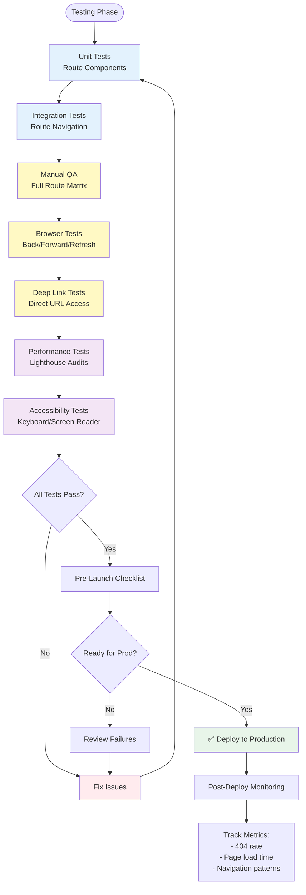

# 08 - Validation & Testing

**Version:** 1.0.0  
**Status:** 🔴 Not Started  
**Priority:** P0 - Critical  
**Estimated Time:** 2 hours  
**Owner:** TBD

---

## Executive Summary

This task implements comprehensive validation and testing for all routing functionality including manual QA procedures, automated test suites, pre-launch validation checklist, browser compatibility testing, and regression prevention rules. This ensures routing works correctly across all scenarios before production deployment.

---

## Problem This Task Solves

**Current State:**
- No systematic testing of routes
- Manual testing inconsistent
- No automated route tests
- Unknown edge cases
- Risk of regressions
- No validation before deploy

**Target State:**
- Complete test coverage for all routes
- Automated tests prevent regressions
- Manual QA checklist standardized
- Edge cases identified and tested
- Browser compatibility verified
- Pre-launch validation gate

---

## Scope

### In Scope
- Manual QA checklist (all routes)
- Automated route tests (React Testing Library)
- Browser navigation tests
- Deep linking validation
- Performance validation
- Accessibility validation
- Pre-launch checklist

### Out of Scope
- E2E tests (Playwright/Cypress - separate task)
- Load testing
- Security penetration testing
- API testing
- Component unit tests (separate concern)

---

## Dependencies

### Prerequisites
- ✅ All previous tasks complete (01-07)
- All routes implemented and functional

### Blocks These Tasks
- Production deployment (validation gate)

### Blocked By
- Task 01-07: All routing tasks

---

## Step-by-Step Implementation

### Step 1: Manual QA Checklist (30 minutes to execute)

**Complete Route Test Matrix:**

#### Marketing Routes (Public)

| Route | Loads | Title Correct | Back Works | Refresh OK | Deep Link | CTA Works |
|-------|-------|---------------|------------|------------|-----------|-----------|
| `/` | ☐ | ☐ | ☐ | ☐ | ☐ | ☐ |
| `/services` | ☐ | ☐ | ☐ | ☐ | ☐ | ☐ |
| `/services/ai-web-dev` | ☐ | ☐ | ☐ | ☐ | ☐ | ☐ |
| `/services/ai-chatbots` | ☐ | ☐ | ☐ | ☐ | ☐ | ☐ |
| `/pricing` | ☐ | ☐ | ☐ | ☐ | ☐ | ☐ |
| `/case-studies` | ☐ | ☐ | ☐ | ☐ | ☐ | ☐ |
| `/case-studies/:slug` | ☐ | ☐ | ☐ | ☐ | ☐ | ☐ |
| `/contact` | ☐ | ☐ | ☐ | ☐ | ☐ | ☐ |
| `/projects` | ☐ | ☐ | ☐ | ☐ | ☐ | ☐ |
| `/process` | ☐ | ☐ | ☐ | ☐ | ☐ | ☐ |
| `/about` | ☐ | ☐ | ☐ | ☐ | ☐ | ☐ |
| `/booking` | ☐ | ☐ | ☐ | ☐ | ☐ | ☐ |

#### Wizard Routes

| Route | Loads | Step Indicator | Data Persists | Back Works | Can't Skip | Submit Works |
|-------|-------|----------------|---------------|------------|------------|--------------|
| `/wizard/1` | ☐ | ☐ | ☐ | ☐ | ☐ | ☐ |
| `/wizard/2` | ☐ | ☐ | ☐ | ☐ | ☐ | ☐ |
| `/wizard/3` | ☐ | ☐ | ☐ | ☐ | ☐ | ☐ |
| `/wizard/4` | ☐ | ☐ | ☐ | ☐ | ☐ | ☐ |
| `/wizard/5` | ☐ | ☐ | ☐ | ☐ | ☐ | ☐ |
| `/wizard/processing` | ☐ | ☐ | ☐ | ☐ | ☐ | ☐ |
| `/wizard/complete` | ☐ | ☐ | ☐ | ☐ | ☐ | ☐ |

#### Protected Routes (Requires Auth)

| Route | Auth Check | Redirect to Login | Redirect Back | Breadcrumbs | Active Nav | Logout Works |
|-------|------------|-------------------|---------------|-------------|------------|--------------|
| `/app/dashboard` | ☐ | ☐ | ☐ | ☐ | ☐ | ☐ |
| `/app/leads` | ☐ | ☐ | ☐ | ☐ | ☐ | ☐ |
| `/app/leads/:id` | ☐ | ☐ | ☐ | ☐ | ☐ | ☐ |
| `/app/ops` | ☐ | ☐ | ☐ | ☐ | ☐ | ☐ |
| `/app/workflows` | ☐ | ☐ | ☐ | ☐ | ☐ | ☐ |
| `/app/intelligence/upload` | ☐ | ☐ | ☐ | ☐ | ☐ | ☐ |
| `/app/intelligence/analysis` | ☐ | ☐ | ☐ | ☐ | ☐ | ☐ |
| `/app/intelligence/brief` | ☐ | ☐ | ☐ | ☐ | ☐ | ☐ |
| `/app/settings` | ☐ | ☐ | ☐ | ☐ | ☐ | ☐ |

#### Error Routes

| Route | Shows 404 | Recovery Options | Back Works |
|-------|-----------|------------------|------------|
| `/invalid-page` | ☐ | ☐ | ☐ |
| `/services/invalid-slug` | ☐ | ☐ | ☐ |
| `/app/leads/invalid-id` | ☐ | ☐ | ☐ |

---

### Step 2: Create Automated Route Tests (45 minutes)

Create `/src/__tests__/routes.test.tsx`:

```tsx
import { render, screen, waitFor } from '@testing-library/react';
import { BrowserRouter, MemoryRouter } from 'react-router-dom';
import { HelmetProvider } from 'react-helmet-async';
import userEvent from '@testing-library/user-event';
import App from '../App';

// Wrapper for tests
const TestWrapper = ({ children, initialRoute = '/' }) => (
  <MemoryRouter initialEntries={[initialRoute]}>
    <HelmetProvider>
      {children}
    </HelmetProvider>
  </MemoryRouter>
);

describe('Marketing Routes', () => {
  test('homepage renders at /', async () => {
    render(<App />, { wrapper: () => <TestWrapper initialRoute="/" /> });
    
    await waitFor(() => {
      expect(screen.getByText(/AI Development Agency/i)).toBeInTheDocument();
    });
  });

  test('services page renders at /services', async () => {
    render(<App />, { wrapper: () => <TestWrapper initialRoute="/services" /> });
    
    await waitFor(() => {
      expect(screen.getByText(/Our Services/i)).toBeInTheDocument();
    });
  });

  test('pricing page renders at /pricing', async () => {
    render(<App />, { wrapper: () => <TestWrapper initialRoute="/pricing" /> });
    
    await waitFor(() => {
      expect(screen.getByText(/Pricing/i)).toBeInTheDocument();
    });
  });

  test('case studies page renders at /case-studies', async () => {
    render(<App />, { wrapper: () => <TestWrapper initialRoute="/case-studies" /> });
    
    await waitFor(() => {
      expect(screen.getByText(/Case Studies/i)).toBeInTheDocument();
    });
  });

  test('contact page renders at /contact', async () => {
    render(<App />, { wrapper: () => <TestWrapper initialRoute="/contact" /> });
    
    await waitFor(() => {
      expect(screen.getByText(/Contact/i)).toBeInTheDocument();
    });
  });
});

describe('Dynamic Routes', () => {
  test('service detail renders with valid slug', async () => {
    render(<App />, { wrapper: () => <TestWrapper initialRoute="/services/ai-chatbots" /> });
    
    await waitFor(() => {
      expect(screen.getByText(/AI Chatbot/i)).toBeInTheDocument();
    });
  });

  test('invalid service slug redirects to 404', async () => {
    render(<App />, { wrapper: () => <TestWrapper initialRoute="/services/invalid" /> });
    
    await waitFor(() => {
      expect(screen.getByText(/404/i)).toBeInTheDocument();
    });
  });

  test('case study detail renders with valid slug', async () => {
    render(<App />, { wrapper: () => <TestWrapper initialRoute="/case-studies/fintech-saas" /> });
    
    await waitFor(() => {
      expect(screen.getByText(/FinanceFlow/i)).toBeInTheDocument();
    });
  });
});

describe('Wizard Routes', () => {
  test('wizard redirects from /wizard to /wizard/1', async () => {
    render(<App />, { wrapper: () => <TestWrapper initialRoute="/wizard" /> });
    
    await waitFor(() => {
      expect(window.location.pathname).toBe('/wizard/1');
    });
  });

  test('wizard step 1 renders', async () => {
    render(<App />, { wrapper: () => <TestWrapper initialRoute="/wizard/1" /> });
    
    await waitFor(() => {
      expect(screen.getByText(/Step 1/i)).toBeInTheDocument();
    });
  });

  test('wizard navigation works', async () => {
    const user = userEvent.setup();
    render(<App />, { wrapper: () => <TestWrapper initialRoute="/wizard/1" /> });
    
    const nextButton = await screen.findByText(/Next/i);
    await user.click(nextButton);
    
    await waitFor(() => {
      expect(window.location.pathname).toBe('/wizard/2');
    });
  });
});

describe('Protected Routes', () => {
  test('unauthenticated user redirected to /login', async () => {
    render(<App />, { wrapper: () => <TestWrapper initialRoute="/app/dashboard" /> });
    
    await waitFor(() => {
      expect(window.location.pathname).toBe('/login');
    });
  });

  // Add more auth tests...
});

describe('404 Handling', () => {
  test('invalid route shows 404 page', async () => {
    render(<App />, { wrapper: () => <TestWrapper initialRoute="/invalid-page" /> });
    
    await waitFor(() => {
      expect(screen.getByText(/404/i)).toBeInTheDocument();
      expect(screen.getByText(/Page Not Found/i)).toBeInTheDocument();
    });
  });

  test('404 page has recovery options', async () => {
    render(<App />, { wrapper: () => <TestWrapper initialRoute="/invalid" /> });
    
    await waitFor(() => {
      expect(screen.getByText(/Go Home/i)).toBeInTheDocument();
      expect(screen.getByText(/Go Back/i)).toBeInTheDocument();
    });
  });
});

describe('SEO', () => {
  test('homepage has correct title', async () => {
    render(<App />, { wrapper: () => <TestWrapper initialRoute="/" /> });
    
    await waitFor(() => {
      const title = document.querySelector('title');
      expect(title?.textContent).toContain('AI Development Agency');
    });
  });

  test('pricing page has correct title', async () => {
    render(<App />, { wrapper: () => <TestWrapper initialRoute="/pricing" /> });
    
    await waitFor(() => {
      const title = document.querySelector('title');
      expect(title?.textContent).toContain('Pricing');
    });
  });
});
```

Run tests:
```bash
npm test -- --testPathPattern=routes.test
```

---

### Step 3: Browser Navigation Tests (30 minutes)

**Browser Behavior Checklist:**

1. **Back Button:**
   - [ ] Navigate: / → /services → /pricing
   - [ ] Click back button twice
   - [ ] Returns to / ✅
   - [ ] Content loads correctly

2. **Forward Button:**
   - [ ] Navigate: / → /services
   - [ ] Click back
   - [ ] Click forward
   - [ ] Returns to /services ✅

3. **Refresh:**
   - [ ] Navigate to /services/ai-chatbots
   - [ ] Press F5
   - [ ] Page reloads on same route ✅
   - [ ] Content preserved

4. **Direct URL:**
   - [ ] Paste /case-studies/fintech-saas in address bar
   - [ ] Page loads directly ✅
   - [ ] No redirect to /

5. **Bookmark:**
   - [ ] Navigate to /pricing
   - [ ] Bookmark page (Ctrl+D)
   - [ ] Close browser
   - [ ] Open bookmark
   - [ ] Loads /pricing ✅

6. **Share URL:**
   - [ ] Copy /services/ai-chatbots URL
   - [ ] Open in incognito window
   - [ ] Paste URL
   - [ ] Page loads correctly ✅

---

### Step 4: Deep Linking Validation (15 minutes)

**Deep Link Test Matrix:**

| Deep Link URL | Expected Behavior | Status |
|---------------|-------------------|--------|
| `/services/ai-chatbots` | Loads service detail | ☐ |
| `/case-studies/fintech-saas` | Loads case study | ☐ |
| `/app/leads/123` (logged out) | Redirects to /login, then back after login | ☐ |
| `/wizard/3` | Loads step 3 (if completed 1-2) | ☐ |
| `/wizard/5` (fresh start) | Redirects to /wizard/1 | ☐ |
| `/services/invalid` | Shows 404 or redirects | ☐ |
| `/app/leads/fake-id` | Redirects to /app/leads | ☐ |

---

### Step 5: Performance Validation (20 minutes)

**Route Performance Checklist:**

```bash
# Install Lighthouse CLI
npm install -g lighthouse

# Test key routes
lighthouse https://yoursite.com/ --only-categories=performance
lighthouse https://yoursite.com/services --only-categories=performance
lighthouse https://yoursite.com/pricing --only-categories=performance
```

**Performance Targets:**

| Metric | Target | Actual |
|--------|--------|--------|
| First Contentful Paint | <1.8s | ___ |
| Largest Contentful Paint | <2.5s | ___ |
| Time to Interactive | <3.8s | ___ |
| Total Blocking Time | <200ms | ___ |
| Cumulative Layout Shift | <0.1 | ___ |

**Per-Route Validation:**

| Route | FCP | LCP | TTI | Score |
|-------|-----|-----|-----|-------|
| `/` | ___ | ___ | ___ | ☐ >90 |
| `/services` | ___ | ___ | ___ | ☐ >90 |
| `/pricing` | ___ | ___ | ___ | ☐ >90 |
| `/app/dashboard` | ___ | ___ | ___ | ☐ >80 |

---

### Step 6: Accessibility Validation (15 minutes)

**Accessibility Checklist:**

```bash
# Install axe CLI
npm install -g @axe-core/cli

# Test routes
axe https://yoursite.com/
axe https://yoursite.com/pricing
axe https://yoursite.com/contact
```

**Manual Tests:**

1. **Keyboard Navigation:**
   - [ ] Tab through homepage
   - [ ] All links accessible
   - [ ] Focus visible
   - [ ] Can activate CTAs with Enter

2. **Screen Reader:**
   - [ ] Turn on VoiceOver (Mac) or NVDA (Windows)
   - [ ] Navigate through /pricing
   - [ ] All content readable
   - [ ] Links announced correctly

3. **Color Contrast:**
   - [ ] All text meets WCAG AA (4.5:1)
   - [ ] CTAs meet contrast requirements

---

### Step 7: Pre-Launch Validation Checklist (20 minutes)

**Final Gate Before Production:**

#### Routing Infrastructure
- [ ] React Router v6 installed
- [ ] All routes defined in config
- [ ] No state-based navigation remaining
- [ ] Browser navigation works everywhere

#### Marketing Routes (Public)
- [ ] All 20+ marketing routes load
- [ ] Dynamic service routing works
- [ ] Dynamic case study routing works
- [ ] All CTAs navigate correctly
- [ ] No hardcoded URLs

#### Wizard
- [ ] Step-based URLs work
- [ ] Browser back navigates steps
- [ ] Refresh preserves step + data
- [ ] Can't skip ahead
- [ ] Resume functionality works

#### Protected Routes
- [ ] Auth guard redirects to /login
- [ ] Redirect back after login works
- [ ] Breadcrumbs accurate
- [ ] Active nav reflects URL
- [ ] Logout works

#### Error Handling
- [ ] 404 page exists
- [ ] Invalid URLs show 404
- [ ] Error boundaries catch errors
- [ ] Loading states show
- [ ] Recovery paths clear

#### SEO
- [ ] All pages have unique titles
- [ ] All pages have meta descriptions
- [ ] Canonical URLs set
- [ ] Open Graph tags present
- [ ] sitemap.xml accessible
- [ ] robots.txt configured

#### Testing
- [ ] Automated tests pass
- [ ] Manual QA complete
- [ ] Browser compatibility verified
- [ ] Performance targets met
- [ ] Accessibility validated

---

## Mermaid Diagram: Test Coverage Flow



---

## Regression Prevention Rules

**To prevent routing regressions in future development:**

1. **Never bypass routes:**
   ```tsx
   // ❌ Don't
   window.location.href = '/dashboard';
   
   // ✅ Do
   navigate('/app/dashboard');
   ```

2. **Always use route constants:**
   ```tsx
   // ❌ Don't
   navigate('/app/dashboard');
   
   // ✅ Do
   navigate(ROUTES.APP_DASHBOARD);
   ```

3. **Test before merging:**
   - [ ] Run `npm test`
   - [ ] Manually test affected routes
   - [ ] Check browser navigation

4. **Update tests when changing routes:**
   - Route path changed? Update tests.
   - New route added? Add tests.

5. **Monitor in production:**
   - Track 404 rate (should be <1%)
   - Monitor page load times
   - Alert on sudden changes

---

## Success Criteria Checklist

- [ ] All automated tests pass
- [ ] Manual QA checklist 100% complete
- [ ] Browser navigation validated
- [ ] Deep linking works
- [ ] Performance targets met
- [ ] Accessibility validated
- [ ] Pre-launch checklist complete
- [ ] No critical bugs
- [ ] All routes documented

---

## Common Test Failures

### Issue 1: Tests timeout

**Cause:** Lazy-loaded routes take too long

**Fix:** Increase timeout:
```tsx
test('route loads', async () => {
  // ...
}, 10000); // 10 second timeout
```

### Issue 2: "Not wrapped in Router"

**Cause:** Test doesn't provide router context

**Fix:** Use TestWrapper (see Step 2)

### Issue 3: Flaky navigation tests

**Cause:** Race condition in route transition

**Fix:** Use `waitFor`:
```tsx
await waitFor(() => {
  expect(window.location.pathname).toBe('/target');
});
```

---

## Post-Launch Monitoring

**Track these metrics in production:**

1. **404 Rate:**
   ```javascript
   // Google Analytics
   gtag('event', 'page_view', {
     page_path: window.location.pathname,
     page_title: document.title
   });
   
   // Track 404s
   if (is404Page) {
     gtag('event', '404', {
       page_path: window.location.pathname
     });
   }
   ```

2. **Page Load Performance:**
   - Monitor with Web Vitals
   - Alert if FCP > 2s
   - Track per route

3. **Navigation Patterns:**
   - Most common paths
   - Drop-off points
   - Conversion funnels

---

## Next Steps

1. Mark Task 08 complete in tracker
2. Update overall completion to 100%
3. Deploy to production
4. Monitor metrics

---

**This is the final validation gate. Do not deploy until all checks pass. Production routing must be flawless.**
