# FIX PLAN

## OBJECTIVE
Fix 2 critical blockers preventing production deployment

## BLOCKERS


## FIX #1: IMPORTS

### Issue
50+ files use `from "package@1.2.3"` syntax

### Fix
Remove version from all imports

### Time
5 minutes (automated script)

### Success Criteria
- [ ] All files import without @version
- [ ] App builds without errors
- [ ] No console import errors

### Command
```bash
node scripts/fix-imports.js
```

## FIX #2: ROUTING

### Issue  
State-based navigation only (no URLs)

### Impact
- Can't share links
- No browser back button
- No SEO
- Not production-ready

### Solution Architecture

```mermaid
graph LR
    A[Current: State Nav] --> B[Add React Router]
    B --> C[URL Routes]
    C --> D[Marketing Routes]
    C --> E[App Routes]
    C --> F[Wizard Routes]
    D --> G[/, /features, /pricing]
    E --> H[/app/*, /dashboard/*]
    F --> I[/wizard/*, /setup/*]
```

### Implementation Phases

```mermaid
gantt
    title Routing Implementation
    dateFormat HH:mm
    section Phase 1
    Install Router           :a1, 00:00, 30min
    Create Routes Config     :a2, after a1, 1h
    section Phase 2  
    Marketing Routes         :b1, after a2, 1h
    App Routes              :b2, after b1, 2h
    section Phase 3
    Wizard Routes           :c1, after b2, 1h
    Testing                 :c2, after c1, 1h
    section Phase 4
    URL State Sync          :d1, after c2, 1h
    Production Deploy       :d2, after d1, 30min
```



### Time Estimate
6-8 hours total

### Success Criteria
- [ ] All routes have URLs
- [ ] Back button works
- [ ] URL sharing works
- [ ] Deep linking works
- [ ] Navigation preserved
- [ ] Build succeeds
- [ ] No broken links
- [ ] SEO meta tags work

## ROUTE MAP

### Marketing (Public)
```
/ → Home
/features → Features
/pricing → Pricing  
/contact → Contact
```

### App (Protected)
```
/app → Dashboard
/app/crm → CRM
/app/deals → Deals
/app/playbooks → Playbooks
/app/intelligence → Sales Intelligence
```

### Wizard (Onboarding)
```
/wizard → Start
/wizard/profile → Profile Setup
/wizard/crm → CRM Connect
/wizard/complete → Done
```

## DEPENDENCIES


## VALIDATION CHECKLIST

### Pre-Deploy
- [ ] All imports fixed
- [ ] Router installed
- [ ] Routes defined
- [ ] Navigation updated
- [ ] URLs tested

### Post-Deploy
- [ ] Home page loads
- [ ] Deep links work
- [ ] Back button works
- [ ] Share URLs work
- [ ] No console errors
- [ ] SEO tags present

## ROLLBACK PLAN
Git commit before changes. If broken: `git reset --hard HEAD~1`
